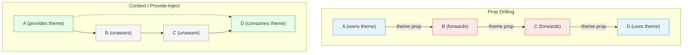
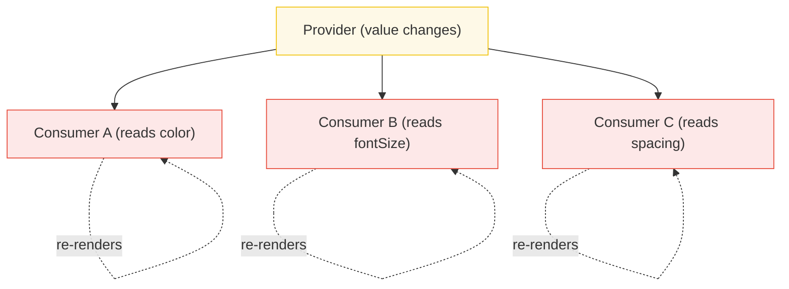

# [FEE-603] Context 與 Prop Drilling

:::info
Context 是一個**依賴注入（dependency injection）**機制，而非狀態管理器。它的存在是為了傳遞橫切關注點（cross-cutting concerns）的值 -- 主題、語系、驗證 -- 而無需將 props 逐層傳遞。當你開始將高頻、快速變化的狀態放入 context（尤其在 React 中），你就會引發再多 memoization 都無法完全修復的效能問題。
:::

## 背景脈絡（Context）

在任何非簡單的元件樹中，某些資料需要被層級相距甚遠的元件使用。在應用程式根節點設定的主題 token 必須到達深層巢狀的按鈕。登入時建立的驗證物件必須讓下方三層的 API 層可以存取。語系字串必須讓樹中的每個翻譯標籤都能讀取。

天真的解決方案是 **prop drilling**：將值作為 prop 從父元件傳遞給子元件，穿過每個中間元件，直到到達消費者。Prop drilling 可以運作，但它在不使用該值的元件之間建立了緊密耦合，並迫使每個中間元件宣告、接受和轉發 prop。

### Prop Drilling 問題

考慮一個簡單的元件樹，其中只有元件 D 需要元件 A 擁有的 `theme` 值：

```
A (owns theme)
 -> B (forwards theme)
    -> C (forwards theme)
       -> D (uses theme)
```

元件 B 和 C 對 `theme` 毫無興趣。它們接受它作為 prop 只是為了傳遞下去。這造成三個問題：

1. **耦合（Coupling）。** B 和 C 現在依賴 `theme` prop。重新命名、重新定型或移除它需要在不使用它的元件中進行變更。
2. **雜訊（Noise）。** 每個中間元件的介面都被它不消費的 props 污染。
3. **脆弱性（Fragility）。** 在 A 和 D 之間新增一層需要更新 prop 鏈。遺漏一個環節就會破壞整個流程。

每個現代框架都提供一種機制來繞過這條鏈，直接從提供者傳遞值給消費者。在 React 中是 Context API。在 Vue 中是 `provide`/`inject`。在 Svelte 中是 `setContext`/`getContext`。在 Angular 中是依賴注入（dependency injection）系統。

## 設計思維（Design Thinking）

### 為什麼 Context 存在

Context 是為特定類別的資料設計的：**橫切關注點（cross-cutting concerns）**。這些值具有以下特徵：

- 被樹中不同深度的許多元件需要
- 不常變化（主題、語系、驗證狀態）
- 代表設定或環境，而非應用程式資料
- 透過 props 傳遞是不切實際的

React 文件明確指出：「Context 的設計是為了分享可被視為元件樹中 'global' 的資料。」關鍵字是「global」-- 而非「高頻更新」。

### React Context：重新渲染全部陷阱（Re-Render-All Trap）

當 React Context provider 的 `value` 變更時，**每個呼叫該 context 的 `useContext` 的元件都會重新渲染**。沒有內建的 selector 機制。React 無法知道元件 X 只讀取 `theme.primaryColor` 而元件 Y 只讀取 `theme.fontSize`。當主題物件的任何部分改變時，兩者都會重新渲染。

這與 Zustand 等狀態管理庫有根本性的不同，在那裡 selectors 允許元件訂閱特定的狀態切片，並在無關切片變更時跳過重新渲染。

#### 緩解策略（Mitigation Strategies）

**1. 分割 Context（Split Contexts）。** 不要一個大 context 包含多個值，為每個值建立獨立的 context：

```jsx
// Instead of one big context:
// { theme, locale, user, permissions }

// Split into focused contexts:
const ThemeContext = createContext(defaultTheme);
const LocaleContext = createContext('en');
const AuthContext = createContext(null);
```

當 `theme` 變更時，只有 `ThemeContext` 的消費者重新渲染。`LocaleContext` 和 `AuthContext` 的消費者不受影響。

**2. 使用 useMemo 穩定值的參考（Stabilize the value reference）。** 如果你傳遞一個物件作為 context value，React 在每次渲染時都會看到新的參考，即使內容相同也會觸發消費者重新渲染：

```jsx
// PROBLEM: new object every render
function ThemeProvider({ children }) {
  const [mode, setMode] = useState('light');
  // This creates a new object reference on every render
  return (
    <ThemeContext value={{ mode, setMode }}>
      {children}
    </ThemeContext>
  );
}

// FIX: stabilize with useMemo
function ThemeProvider({ children }) {
  const [mode, setMode] = useState('light');
  const value = useMemo(() => ({ mode, setMode }), [mode]);
  return (
    <ThemeContext value={value}>
      {children}
    </ThemeContext>
  );
}
```

**3. 分離 state 與 dispatch。** 將狀態值和更新函式放在不同的 context 中。更新器（dispatch/setState）是穩定的參考，很少需要自己的重新渲染週期：

```jsx
const ThemeStateContext = createContext('light');
const ThemeDispatchContext = createContext(() => {});

function ThemeProvider({ children }) {
  const [mode, setMode] = useState('light');
  return (
    <ThemeStateContext value={mode}>
      <ThemeDispatchContext value={setMode}>
        {children}
      </ThemeDispatchContext>
    </ThemeStateContext>
  );
}
```

只需要變更主題的元件（按鈕、切換器）消費 `ThemeDispatchContext`，當主題值變更時永遠不會重新渲染。

**4. use-context-selector（第三方函式庫）。** Daishi Kato 的 `use-context-selector` 函式庫提供 `useContextSelector` hook，讓消費者訂閱 context 的一個切片，類似 Zustand 的 selectors：

```jsx
import { useContextSelector } from 'use-context-selector';

const primaryColor = useContextSelector(
  ThemeContext,
  (ctx) => ctx.primaryColor
);
```

元件只在 `primaryColor` 變更時重新渲染，而非主題的其他部分變更時。注意這是第三方函式庫，而非 React 的內建功能。

### Vue provide/inject：預設細粒度（Fine-Grained by Default）

Vue 的響應式系統追蹤每個元件讀取的具體響應式屬性。當你 `provide` 一個 `ref`，後代元件 `inject` 它時，Vue 確切知道哪些元件依賴那個 ref。當 ref 變更時，只有實際讀取它的元件會重新渲染。

這意味著 Vue 不會遭受困擾 React Context 的「重新渲染全部」問題。你可以安全地提供響應式狀態，無需擔心連鎖重新渲染到無關的消費者。

然而，Vue 的最佳實務建議將修改與提供者共置（co-locate）。不要讓消費者直接修改注入的狀態，而是在響應式資料旁邊提供修改函式：

```js
// Provider
provide('theme', {
  mode: readonly(mode),
  setMode
});
```

使用 `readonly()` 可以防止消費者意外修改。

### Svelte Context：非響應式（Not Reactive）

Svelte 的 `setContext`/`getContext` **預設不是響應式的**。Svelte 中的 context 在元件初始化時設定一次，當來源值變更時不會更新。如果你需要響應性，必須明確傳遞一個 `$state` 響應式物件作為 context 值，並更新其屬性（而非重新賦值整個物件）。

這是與 Vue 的 `provide`/`inject` 的關鍵區別，在 Vue 中傳遞一個 `ref` 會自動維持響應性。在 Svelte 中，context 主要用於靜態服務或設定的依賴注入 -- 而非響應式狀態共享。

### Angular 依賴注入（Dependency Injection）

Angular 採取最明確的方式。它的 DI 系統使用在階層式注入器樹中註冊的 `@Injectable` 服務。服務可以在根層級（singleton）、模組層級或元件層級提供。這是主要框架中最強大也最複雜的 context 機制，但核心概念相同：在高層級註冊一個值，在需要的地方注入，以繞過 prop drilling。

## 最佳實踐

**依更新頻率分割 context 以防止不必要的重新渲染。** 在 React 中，當 provider 的 value 參考改變時，context 的每個消費者都會重新渲染。SHOULD 為以不同速率改變的值建立獨立的 context -- 主題、語系和驗證應存在於各自的 context 中，而非合併為一個大物件。當 context 攜帶物件或陣列時，MUST 用 `useMemo` memoize 該值，以防止 provider 每次渲染產生新參考而觸發所有消費者重新渲染。

**對消費者提供自定義 hook 而非原始 `useContext`，以獲得更好的封裝。** SHOULD 將 `useContext` 呼叫包裝在具名 hook（`useTheme`、`useAuth`）中，而非在消費者中直接呼叫 `useContext(SomeContext)`。自定義 hook 可以驗證消費者是否在正確的 provider 內、在不滿足時拋出描述性錯誤，並向消費者元件隱藏 context 物件的形狀，使未來的重構更容易。

**將 context 用於穩定的值 -- 主題、語系、驗證 -- 而非高頻變化的資料。** Context 是依賴注入機制，不是狀態管理器。MUST NOT 將高頻狀態（表單輸入、游標位置、動畫幀）放入 React Context；每次變更都會重新渲染所有消費者，不管它們讀取哪個切片。對於高頻共享狀態，使用專用的狀態管理庫（Zustand、Pinia），其 selector 將重新渲染限制在訂閱了已變更切片的元件。

## 視覺化（Visual）

### Prop Drilling vs. Context



在 prop drilling 模型中，B 和 C 是被迫的中間人（紅色）。使用 context 時，B 和 C 完全不知道提供的值（灰色），只有 A 和 D 參與。

### React Context 重新渲染問題



當 provider 的值改變時，**全部三個消費者都重新渲染** -- 即使只有 `color` 改變。消費者 B 和 C 不需要更新，但 React 沒有內建方式知道這一點。

## 範例（Example）

### 1. React Context 用於主題（Theme）

```jsx
import { createContext, useContext, useState, useMemo } from 'react';

// 1. Create the context
const ThemeContext = createContext('light');

// 2. Provider component
function ThemeProvider({ children }) {
  const [mode, setMode] = useState('light');
  const value = useMemo(() => ({ mode, setMode }), [mode]);

  return (
    <ThemeContext value={value}>
      {children}
    </ThemeContext>
  );
}

// 3. Custom hook for consumers
function useTheme() {
  const ctx = useContext(ThemeContext);
  if (ctx === undefined) {
    throw new Error('useTheme must be used within a ThemeProvider');
  }
  return ctx;
}

// 4. Consumer component (deep in the tree)
function ThemedButton() {
  const { mode, setMode } = useTheme();
  return (
    <button
      style={{
        background: mode === 'light' ? '#fff' : '#333',
        color: mode === 'light' ? '#333' : '#fff',
      }}
      onClick={() => setMode(mode === 'light' ? 'dark' : 'light')}
    >
      Toggle Theme
    </button>
  );
}

// 5. App tree -- no prop drilling through Header or Nav
function App() {
  return (
    <ThemeProvider>
      <Header />
    </ThemeProvider>
  );
}

function Header() {
  // Header does NOT receive or forward theme
  return (
    <nav>
      <ThemedButton />
    </nav>
  );
}
```

重點：
- `ThemeProvider` 在高層級包裹整個樹一次。
- `Header` 不知道主題 -- 沒有轉發 props。
- `ThemedButton` 透過 `useTheme()` 直接消費 context。
- 使用 `useMemo` 穩定值以防止不必要的重新渲染。

### 2. Vue provide/inject

```vue
<!-- ThemeProvider.vue -->
<script setup>
import { ref, provide, readonly } from 'vue';

const mode = ref('light');

function setMode(newMode) {
  mode.value = newMode;
}

// Provide reactive state + mutation function
provide('theme', {
  mode: readonly(mode),
  setMode,
});
</script>

<template>
  <slot />
</template>
```

```vue
<!-- ThemedButton.vue (deep in the tree) -->
<script setup>
import { inject } from 'vue';

const { mode, setMode } = inject('theme');

function toggle() {
  setMode(mode.value === 'light' ? 'dark' : 'light');
}
</script>

<template>
  <button
    :style="{
      background: mode === 'light' ? '#fff' : '#333',
      color: mode === 'light' ? '#333' : '#fff',
    }"
    @click="toggle"
  >
    Toggle Theme
  </button>
</template>
```

```vue
<!-- App.vue -->
<template>
  <ThemeProvider>
    <Header />
  </ThemeProvider>
</template>
```

重點：
- Vue 的 `provide` 傳遞響應式 `ref` -- 變更自動傳播。
- `readonly()` 防止消費者直接修改狀態。
- 只有實際讀取 `mode` 的元件在其變更時重新渲染 -- 沒有「重新渲染全部」陷阱。
- 沒有中間元件需要知道主題。

### 3. React Context 效能問題與修復

```jsx
import { createContext, useContext, useState, useMemo } from 'react';

// PROBLEM: One big context with multiple values
const AppContext = createContext(null);

function AppProvider({ children }) {
  const [theme, setTheme] = useState('light');
  const [locale, setLocale] = useState('en');
  const [user, setUser] = useState(null);

  // Even with useMemo, ALL consumers re-render when ANY value changes
  const value = useMemo(
    () => ({ theme, setTheme, locale, setLocale, user, setUser }),
    [theme, locale, user]
  );

  return (
    <AppContext value={value}>
      {children}
    </AppContext>
  );
}

// This component only reads theme, but re-renders when locale or user changes
function ThemeDisplay() {
  const { theme } = useContext(AppContext);
  return <div>Current theme: {theme}</div>;
}
```

```jsx
// FIX: Split into separate contexts

const ThemeContext = createContext(null);
const LocaleContext = createContext(null);
const AuthContext = createContext(null);

function ThemeProvider({ children }) {
  const [theme, setTheme] = useState('light');
  const value = useMemo(() => ({ theme, setTheme }), [theme]);
  return <ThemeContext value={value}>{children}</ThemeContext>;
}

function LocaleProvider({ children }) {
  const [locale, setLocale] = useState('en');
  const value = useMemo(() => ({ locale, setLocale }), [locale]);
  return <LocaleContext value={value}>{children}</LocaleContext>;
}

function AuthProvider({ children }) {
  const [user, setUser] = useState(null);
  const value = useMemo(() => ({ user, setUser }), [user]);
  return <AuthContext value={value}>{children}</AuthContext>;
}

// Now ThemeDisplay only re-renders when theme changes
function ThemeDisplay() {
  const { theme } = useContext(ThemeContext);
  return <div>Current theme: {theme}</div>;
}

// Compose providers
function App() {
  return (
    <ThemeProvider>
      <LocaleProvider>
        <AuthProvider>
          <Page />
        </AuthProvider>
      </LocaleProvider>
    </ThemeProvider>
  );
}
```

重點：
- 巨型 `AppContext` 迫使所有消費者在任何變更時都重新渲染。
- 分割成 `ThemeContext`、`LocaleContext` 和 `AuthContext` 隔離了重新渲染。
- 每個 provider 使用 `useMemo` 穩定其值。
- 元件只訂閱它們需要的 context。

## 常見錯誤（Common Mistakes）

### 1. 混淆 Svelte Context（非響應式）與 Vue provide/inject（響應式）

```js
// Svelte -- context is NOT reactive by default
setContext('count', 0);
// Later reads via getContext('count') will always return 0

// To make it reactive, pass a $state object:
let count = $state({ value: 0 });
setContext('count', count);
// Consumers must read count.value, and updates propagate
// But reassigning count = { value: 1 } breaks the link
```

Svelte context 在元件初始化時設定一次。如果你需要響應式的值，必須明確使用 `$state` 物件並更新屬性而非重新賦值。Vue 的 `provide`/`inject` 搭配 `ref` 預設就是響應式的 -- 變更自動傳播。

### 2. 在需要狀態庫時使用 Context

Context 是用於**依賴注入** -- 傳遞服務、設定和橫切關注點。如果你發現自己有：
- 高頻狀態更新（每秒多次）
- 複雜的更新邏輯（reducers、middleware）
- 選擇性訂閱（元件 A 關心切片 X，不關心切片 Y）
- DevTools 需求（time-travel debugging、action logging）

...你需要的是狀態管理庫（Zustand、Pinia、Redux、Jotai），而非 context。Context 和狀態庫解決不同的問題，且經常一起使用：函式庫管理狀態，context 將 store 實例傳遞到樹中。

## 相關 FEE（Related FEEs）

- [FEE-600](./600.md) 狀態管理概觀 -- 將 context 分類為「共享狀態」傳輸機制的分類體系
- [FEE-601](./601.md) 局部元件狀態 -- 當狀態不需要共享時最簡單的替代方案
- [FEE-607](./607.md) 狀態管理庫 -- Zustand、Pinia、Redux 和其他為 context 無法勝任的工作而設計的工具

## 參考資料（References）

- [React: createContext](https://react.dev/reference/react/createContext) -- 建立 context 物件的官方 API 參考
- [React: useContext](https://react.dev/reference/react/useContext) -- 消費 context 值的官方 hook
- [Vue: Provide / Inject](https://vuejs.org/guide/components/provide-inject) -- Vue 依賴注入機制的官方指南
- [Svelte: Context](https://svelte.dev/docs/svelte/context) -- Svelte 中 setContext/getContext 的官方文件
- [Angular: Dependency Injection](https://angular.dev/guide/di) -- Angular DI 系統的官方指南
- [Mark Erikson: Why React Context is Not a "State Management" Tool](https://blog.isquaredsoftware.com/2021/01/context-redux-differences/) -- context 與狀態管理的詳細分析
- [Nadia Makarevich: How to Write Performant React Apps with Context](https://www.developerway.com/posts/how-to-write-performant-react-apps-with-context) -- context 效能模式實用指南
- [use-context-selector (GitHub)](https://github.com/dai-shi/use-context-selector) -- 用於選擇性 context 消費的使用者空間函式庫
