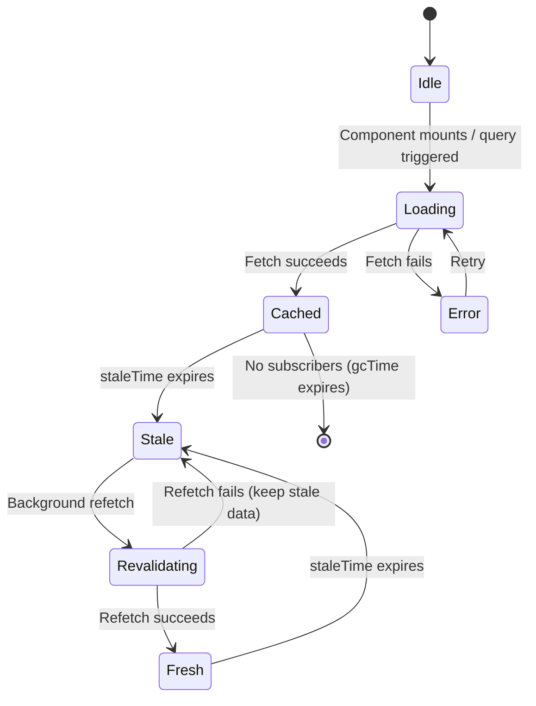
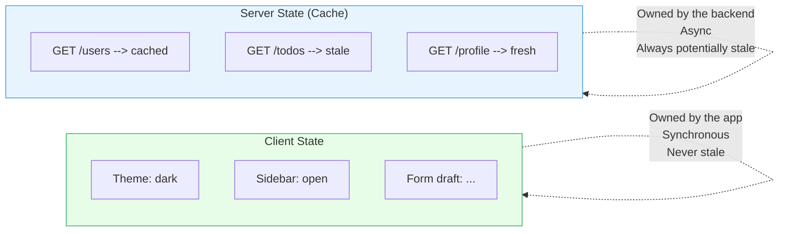

# [FEE-604] 伺服器狀態與資料同步

:::info
伺服器狀態（server state）是存在於後端的資料，前端僅僅是*借用*它。它可以在客戶端不知情的情況下改變、收到的瞬間就可能過時、而且多個使用者可能同時在修改它。將伺服器回應當作本地狀態處理（儲存在 Redux 或 Zustand 中並手動管理 loading、error 和資料新鮮度）是現代前端應用程式中最常見的 bug 和複雜度來源之一。
:::

## 背景脈絡（Context）

每個非簡單的前端應用程式都會從伺服器擷取資料。使用者檔案、產品目錄、通知 feed 和設定物件都源自後端，透過 HTTP 或 WebSocket 連線流向客戶端。當資料到達客戶端的那一刻，它就開始老化。伺服器可能已經接受了另一個使用者的新寫入。背景工作可能已經更新了一筆記錄。你剛收到的資料，充其量只是一個已經過去的時刻的快照。

這就是**伺服器狀態**的根本挑戰：客戶端永遠不擁有真實來源（source of truth）。它持有的是一個快取（cache），一個可能反映也可能不反映現實的本地副本。快取終將過時；真正的問題在於*多快*過時，以及*你如何應對*。

多年來，標準做法是將 API 回應儲存在全域客戶端 store（Redux、Vuex、MobX）中，與 modal 和表單輸入等 UI 狀態混在一起。開發者撰寫 action creators、reducers、thunks、sagas 和 epics，只為了取得一個項目列表並放入正規化的 store。Loading 狀態、error 狀態、快取失效（cache invalidation）、重新擷取、請求去重（deduplication）和重試邏輯都是手動實作，在每個專案中一次又一次地重複。

諸如 TanStack Query、SWR、Nuxt 的 `useFetch`，以及框架層級的資料載入（Remix loaders、SvelteKit `load`、React Server Components）等專用的伺服器狀態函式庫之所以存在，是因為這類問題與客戶端狀態管理截然不同，值得有專門的工具來處理。

## 設計思維（Design Thinking）

### 為什麼不用 Redux 處理伺服器資料？

考慮當你將從 `/api/todos` 擷取的待辦事項列表儲存在 Redux store 中時會發生什麼：

1. 你 dispatch `FETCH_TODOS_REQUEST` 並設定 `loading: true`。
2. Thunk 發送 `fetch('/api/todos')`。
3. 成功時，dispatch `FETCH_TODOS_SUCCESS` 並帶上 payload，設定 `loading: false`。
4. 失敗時，dispatch `FETCH_TODOS_FAILURE` 並帶上 error。
5. 元件讀取 `state.todos.items`、`state.todos.loading` 和 `state.todos.error`。

這對一個端點有效。現在把它乘以應用程式中每個 API 呼叫的數量。你需要每個端點一個 reducer、三個 action types、一個 thunk 和一個 selector。你還需要回答：

- 資料何時過時？你怎麼知道何時該重新擷取？
- 當兩個元件都需要同一份資料時會怎樣？它們都各自擷取嗎？
- 當使用者切換分頁再回來時會怎樣？資料還是新鮮的嗎？
- 在 mutation（POST、PUT、DELETE）之後，哪些 query 需要被失效？
- 你如何顯示樂觀更新（optimistic update）並在失敗時回滾（rollback）？

Redux 不回答這些問題。你必須每次自己建構答案。這不是對 Redux 的批評。它從未被設計來解決這個問題。

### 快取作為真實來源（Cache as Source of Truth）

TanStack Query 和 SWR 翻轉了模型。它們不將伺服器資料儲存在客戶端 store 中，而是維護一個**查詢快取（query cache）**，一個專門的資料結構，追蹤：

- 每個唯一 query key 的快取回應
- 最後一次成功擷取的時間戳
- 資料是新鮮的（fresh）、過時的（stale）還是正在重新擷取
- Loading、error 和 success 狀態
- 活躍訂閱者數量（使用此資料的元件數量）

當元件呼叫 `useQuery` 時，它訂閱一個快取項目。如果項目存在且新鮮，元件立即收到快取資料而無需網路請求。如果項目過時，元件立即收到快取資料*同時*觸發背景重新擷取。如果項目不存在，則發起擷取並讓元件看到 loading 狀態。

這就是 **stale-while-revalidate** 模式：立即提供快取，然後在背景靜默更新它。使用者立即看到內容，如果有任何變化則在片刻後自行修正。這種方法借鑑自 HTTP 快取語義（RFC 5861）。

### SSR 消除了初始快取問題

React Server Components、Remix loaders、SvelteKit `load` 函式和 Nuxt `useFetch` 採取了不同但互補的方式：它們在請求週期中於伺服器端擷取資料，並將其作為初始 HTML 或序列化 payload 的一部分傳遞。客戶端永遠不需要為首次渲染顯示 loading spinner，因為資料隨頁面一起到達。

- **React Server Components** 在伺服器上執行。它們可以直接 `await` 資料庫查詢或 API 呼叫。結果以已渲染的 HTML 串流傳輸：初始載入不需要客戶端 fetch、loading 狀態或快取項目。
- **Remix loaders** 在路由渲染前於伺服器上執行。元件透過 `useLoaderData` 同步接收資料。初始載入後，Remix 在 mutation 發生時自動處理 revalidation。
- **SvelteKit `load` 函式** 在首次請求時於伺服器上執行，後續導航在客戶端執行。資料作為 props 傳遞給頁面元件。
- **Nuxt `useFetch`** 包裝了 `useAsyncData` 和 `$fetch`。它在 SSR 期間於伺服器端擷取，並透過 Nuxt payload 將資料傳輸到客戶端，防止 hydration 期間的重複請求。

這些方式與 TanStack Query 和 SWR 互補，而非取代它們。伺服器渲染的資料處理初始載入；客戶端快取函式庫處理後續互動、mutations 和即時更新。

## 最佳實踐

**將伺服器狀態與客戶端狀態分離：不要將伺服器資料放入 Redux 或 Zustand。** 客戶端 store（Redux、Zustand、Pinia）設計用於同步的、客戶端擁有的資料：主題、側邊欄狀態、表單草稿。MUST NOT 用它們作為伺服器擷取資料的真實來源。這樣做需要為每個端點手動實作 loading 狀態、error 狀態、過時偵測、重新擷取、請求去重和快取失效。改用 TanStack Query、SWR 或框架層級的 loader（Remix、SvelteKit）；它們自動處理這一切。

**使用 stale-while-revalidate 快取。** SHOULD 設定 `staleTime` 以反映你的資料真正多久改變一次。從快取提供的資料立即顯示給使用者，同時背景重新擷取靜默地更新它。`staleTime` 為零（預設值）會在每次掛載時重新擷取；適當的非零值（例如使用者列表 30 秒）可在不長時間顯示過時資料的情況下消除不必要的網路請求。

**應用帶有錯誤回滾的樂觀更新。** 當 mutation 很可能成功時，SHOULD 在伺服器回應之前立即更新快取，讓 UI 感覺即時。MUST 在套用樂觀變更之前快照先前的快取狀態，並在 `onError` 處理器中還原它。沒有回滾，伺服器拒絕會讓 UI 永久不一致，直到下一次完整頁面重新整理。

**在 mutation 後使快取失效。** 成功寫入（POST、PUT、DELETE）後，MUST 呼叫 `invalidateQueries`（或等效方法）為每個快取資料可能已過時的 query。未能失效意味著 UI 繼續顯示 mutation 前的資料，看起來像是靜默丟棄了使用者的更改。

## 視覺化（Visual）

### 伺服器狀態生命週期（Server State Lifecycle）



關鍵洞察：**Stale**（過時）和 **Revalidating**（重新驗證）不是錯誤狀態。它們是生命週期中正常、預期的階段。使用者在這兩個階段都能看到資料。只有新鮮度改變。

### 客戶端狀態 vs. 伺服器狀態



## 範例（Example）

### 1. TanStack Query：基本查詢（Basic Query）

```tsx
import { useQuery } from '@tanstack/react-query';

function TodoList() {
  const { data, isLoading, isError, error } = useQuery({
    queryKey: ['todos'],
    queryFn: () => fetch('/api/todos').then(res => res.json()),
    staleTime: 30_000,   // Data is fresh for 30 seconds
    gcTime: 300_000,     // Unused cache lives for 5 minutes
  });

  if (isLoading) return <p>Loading...</p>;
  if (isError) return <p>Error: {error.message}</p>;

  return (
    <ul>
      {data.map(todo => (
        <li key={todo.id}>{todo.title}</li>
      ))}
    </ul>
  );
}
```

你免費獲得的關鍵行為：
- 自動去重（deduplication）：如果兩個元件使用 `['todos']`，只會發出一個請求。
- 視窗重新聚焦和網路重新連線時的背景重新擷取。
- 在背景 revalidation 發生時立即提供過時資料。
- 在 `gcTime` 後對未使用的快取項目進行垃圾回收（garbage collection）。

### 2. TanStack Query：樂觀 Mutation 與回滾（Optimistic Mutation with Rollback）

```tsx
import { useMutation, useQueryClient } from '@tanstack/react-query';

function useAddTodo() {
  const queryClient = useQueryClient();

  return useMutation({
    mutationFn: (newTodo) =>
      fetch('/api/todos', {
        method: 'POST',
        body: JSON.stringify(newTodo),
        headers: { 'Content-Type': 'application/json' },
      }).then(res => res.json()),

    // Optimistic update: modify the cache before the server responds
    onMutate: async (newTodo) => {
      // Cancel in-flight refetches so they do not overwrite our optimistic data
      await queryClient.cancelQueries({ queryKey: ['todos'] });

      // Snapshot the current cache for rollback
      const previous = queryClient.getQueryData(['todos']);

      // Optimistically add the new todo
      queryClient.setQueryData(['todos'], (old) => [
        ...old,
        { ...newTodo, id: Date.now() },
      ]);

      // Return the snapshot so onError can restore it
      return { previous };
    },

    // Rollback on failure
    onError: (_err, _newTodo, context) => {
      queryClient.setQueryData(['todos'], context.previous);
    },

    // Refetch after success or failure to ensure server truth
    onSettled: () => {
      queryClient.invalidateQueries({ queryKey: ['todos'] });
    },
  });
}
```

模式：快照快取、套用樂觀變更、在錯誤時回滾、並且總是在結束時失效。使用者立即看到新的待辦事項。如果伺服器拒絕，待辦事項消失，快取回到伺服器確認的狀態。

### 3. SWR：最小化資料擷取

```tsx
import useSWR from 'swr';

const fetcher = (url) => fetch(url).then(res => res.json());

function Profile() {
  const { data, error, isLoading } = useSWR('/api/user', fetcher);

  if (isLoading) return <p>Loading...</p>;
  if (error) return <p>Error loading profile.</p>;

  return <h1>Hello, {data.name}</h1>;
}
```

SWR 以更少的設定實現相同的 stale-while-revalidate 模式。它預設使用 URL 作為快取 key、去重請求、在聚焦和重新連線時 revalidate，並支援間隔輪詢（interval polling）。它比 TanStack Query 更輕量但功能較少（無內建 mutation 原語、無從 mutation 觸發的 query invalidation、無 DevTools）。

**何時選擇 TanStack Query 或 SWR：**

| 考量 | TanStack Query | SWR |
|---|---|---|
| Mutation 支援 | 內建 `useMutation`，支援樂觀更新與回滾 | 透過 `mutate` helper 手動處理 |
| 快取失效 | `invalidateQueries` 依 key 或 predicate | 手動 `mutate(key)` |
| DevTools | 官方 React Query DevTools | 社群建構 |
| 套件大小 | 較大（約 39 kB） | 較小（約 13 kB） |
| 框架支援 | React、Vue、Solid、Svelte、Angular | 僅 React |
| 最適合 | 有大量 mutation 的複雜應用 | 以讀取為主、更新簡單的應用 |

### 4. Nuxt useFetch（SSR + 客戶端）

```vue
<script setup>
const { data: todos, status, error, refresh } = await useFetch('/api/todos');
</script>

<template>
  <p v-if="status === 'pending'">Loading...</p>
  <p v-else-if="error">Error: {{ error.message }}</p>
  <ul v-else>
    <li v-for="todo in todos" :key="todo.id">{{ todo.title }}</li>
  </ul>
  <button @click="refresh()">Refresh</button>
</template>
```

`useFetch` 在 SSR 期間於伺服器端擷取，並透過 Nuxt payload 將快取結果傳輸到客戶端。客戶端在 hydration 期間不會重新擷取。後續呼叫 `refresh()` 在客戶端擷取新鮮資料。

### 5. Remix Loader

```tsx
// app/routes/todos.tsx
import type { LoaderFunctionArgs } from '@remix-run/node';
import { json } from '@remix-run/node';
import { useLoaderData } from '@remix-run/react';

export async function loader({ request }: LoaderFunctionArgs) {
  const todos = await db.todos.findMany();
  return json({ todos });
}

export default function Todos() {
  const { todos } = useLoaderData<typeof loader>();
  return (
    <ul>
      {todos.map(todo => (
        <li key={todo.id}>{todo.title}</li>
      ))}
    </ul>
  );
}
```

這裡不需要 loading 狀態、fetch 失敗的 error boundary（Remix 已提供路由層級的 error boundaries），也不需要管理客戶端快取。資料隨 HTML 一起到達。在透過 Remix `action` 函式進行 mutation 後，loaders 自動 revalidate。

## 常見錯誤（Common Mistakes）

### 1. 沒有 Loading 或 Error 狀態

```tsx
// WRONG -- assumes data is always available
function UserProfile() {
  const { data } = useQuery({ queryKey: ['user'], queryFn: fetchUser });
  return <h1>{data.name}</h1>; // Crashes when data is undefined
}

// CORRECT -- handle all states
function UserProfile() {
  const { data, isLoading, isError, error } = useQuery({
    queryKey: ['user'],
    queryFn: fetchUser,
  });

  if (isLoading) return <Skeleton />;
  if (isError) return <ErrorMessage error={error} />;
  return <h1>{data.name}</h1>;
}
```

伺服器資料本質上是非同步的。每個 query 至少有三種狀態：loading、error 和 success。忽略任何一個都會造成執行時期崩潰或破損的 UI。

### 2. Mutation 後沒有快取失效

```tsx
// WRONG -- cache still shows old data after creating a todo
const mutation = useMutation({
  mutationFn: createTodo,
  // Missing: onSuccess / onSettled to invalidate the todos query
});

// CORRECT -- invalidate related queries
const mutation = useMutation({
  mutationFn: createTodo,
  onSuccess: () => {
    queryClient.invalidateQueries({ queryKey: ['todos'] });
  },
});
```

沒有 invalidation，UI 在成功寫入後仍顯示過時資料。使用者建立了一個待辦事項但在列表中看不到它，直到手動重新整理頁面。

### 3. 樂觀更新沒有回滾

```tsx
// WRONG -- no rollback on failure
onMutate: async (newTodo) => {
  queryClient.setQueryData(['todos'], (old) => [...old, newTodo]);
  // If the server rejects, the UI permanently shows a ghost item
},

// CORRECT -- snapshot and restore on error (see Example 2 above)
```

樂觀更新必須總是包含回滾路徑。沒有它，伺服器失敗會讓 UI 處於不一致的狀態，只有完全重新整理頁面才能修復。

### 4. 瀑布式擷取（可並行時卻循序執行）

```tsx
// WRONG -- sequential fetches create a waterfall
function Dashboard() {
  const { data: user } = useQuery({ queryKey: ['user'], queryFn: fetchUser });
  const { data: todos } = useQuery({
    queryKey: ['todos', user?.id],
    queryFn: () => fetchTodos(user.id),
    enabled: !!user, // Waits for user to load first
  });
  const { data: stats } = useQuery({
    queryKey: ['stats'],
    queryFn: fetchStats,
    enabled: !!todos, // Waits for todos -- but stats do not depend on todos
  });
  // Total time: user + todos + stats (sequential)
}

// CORRECT -- only depend where truly necessary
function Dashboard() {
  const { data: user } = useQuery({ queryKey: ['user'], queryFn: fetchUser });
  const { data: todos } = useQuery({
    queryKey: ['todos', user?.id],
    queryFn: () => fetchTodos(user.id),
    enabled: !!user, // Truly depends on user
  });
  const { data: stats } = useQuery({
    queryKey: ['stats'],
    queryFn: fetchStats,
    // No enabled constraint -- fetches in parallel with user
  });
  // Total time: max(user + todos, stats)
}
```

只在有真正的資料依賴時才使用 `enabled`。不必要的循序擷取會增加使用者能看到和感受到的延遲。

## 相關 FEE（Related FEEs）

- [FEE-600](./600.md) 狀態管理概觀：將伺服器狀態分類為獨立類別的分類體系
- [FEE-403](../JavaScript%20Fundamentals/403.md) Fetch API：進行 HTTP 請求的底層機制
- [FEE-607](./607.md) 狀態管理庫：Redux、Zustand、Pinia，以及它們何時是（和何時不是）正確的工具

## 參考資料（References）

- [TanStack Query: Overview](https://tanstack.com/query/v5/docs/framework/react/overview)：涵蓋 queries、mutations 和快取的官方文件
- [TanStack Query: Query Invalidation](https://tanstack.com/query/v5/docs/framework/react/guides/query-invalidation)：query 失效與重新擷取指南
- [TanStack Query: Optimistic Updates](https://tanstack.com/query/v5/docs/react/guides/optimistic-updates)：即時 UI 更新與回滾的模式
- [SWR](https://swr.vercel.app/)：Vercel 的 React 資料擷取函式庫，實作 stale-while-revalidate
- [Nuxt: useFetch](https://nuxt.com/docs/api/composables/use-fetch)：Nuxt 的 SSR 友善資料擷取 composable
- [Remix: Data Loading](https://remix.run/docs/en/main/guides/data-loading)：伺服器端 loaders 與自動 revalidation
- [SvelteKit: Loading Data](https://svelte.dev/docs/kit/load)：伺服器與通用 load 函式
- [React: Server Components](https://react.dev/reference/rsc/server-components)：零客戶端 fetch 的伺服器端渲染
- [RFC 5861: HTTP Cache-Control Extensions for Stale Content](https://datatracker.ietf.org/doc/html/rfc5861)：stale-while-revalidate 背後的 HTTP 規範
