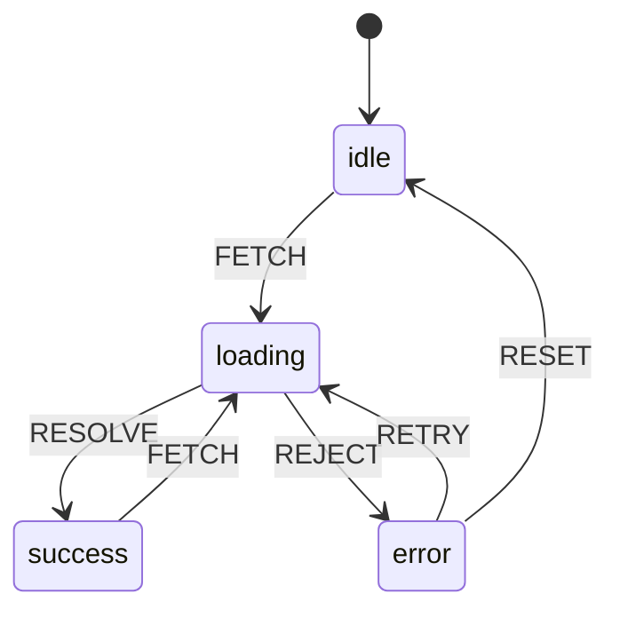
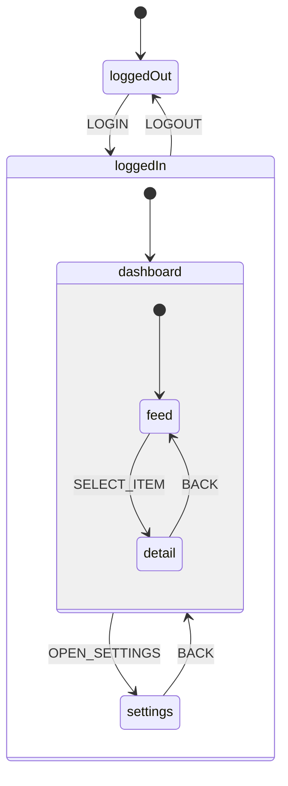

# [FEE-605] 狀態機與有限自動機

:::info
狀態機（state machine）是一種數學模型，系統在任何時間點只能處於有限數量的狀態之一，且只能透過明確定義的事件（event）在狀態之間轉換。在 UI 開發中，狀態機用單一、明確的狀態變數取代脆弱的布林旗標組合 -- 從設計層面讓不可能的狀態（impossible states）無法存在。
:::

## 背景脈絡（Context）

每個互動式 UI 都有模式（modes）。一個 fetch 請求可能是 idle、loading、success 或 error。一個 modal 是開啟或關閉。一個多步驟表單在第 1、2 或 3 步。這些都是**有限狀態（finite states）** -- 元件在任何時間點所處的離散模式。

自然的直覺是用布林旗標來建模這些模式：`isLoading`、`isError`、`isSuccess`。這對最簡單的情境有效，但很快就會崩潰。3 個布林值會產生 2^3 = 8 種可能的組合，但只有 4 種是合法的（idle、loading、success、error）。剩下的 4 種組合 -- 例如 `isLoading === true && isError === true` -- 是**不可能的狀態**，你的程式碼必須不斷防範它們，卻永遠無法完全避免。

這就是**布林旗標爆炸（boolean flag explosion）**問題。正如 David Khourshid（XState 的創建者）所說：「N 個布林旗標會產生 2^N 種可能的狀態，而開發者必須確保其中大部分永遠不會出現。」這個負擔是指數級增長的，每新增一個旗標就會讓需要推理的組合數量翻倍。

有限狀態機（Finite State Machines, FSMs）透過將布林值替換為明確的狀態變數和轉換表（transition table）來解決這個問題。系統永遠只處於一個狀態。事件（events）觸發狀態之間的轉換（transitions）。如果當前狀態沒有定義某個轉換，該事件就會被忽略。不可能達到不合法的組合，因為機器不允許。

**狀態圖（statecharts）**擴展了 FSM，加入了階層式狀態（hierarchical states）、平行狀態（parallel/orthogonal regions）、歷史狀態（history states）和守衛條件（guard conditions）。由 David Harel 於 1987 年發明，狀態圖解決了普通 FSM 在建模複雜系統時的組合爆炸問題 -- 你可以將相關的狀態分組為父狀態，並在獨立的區域中平行運行，而不需要讓狀態數量相乘。

**XState** 是 JavaScript 生態系統中最廣泛採用的狀態圖函式庫。它提供宣告式 API 來定義機器、視覺化檢查器來除錯，以及 actor model 來協調多個機器。對於較簡單的情境，React 內建的 `useReducer` 可以作為輕量級 FSM，無需額外的依賴。

## 設計思維（Design Thinking）

### 為什麼狀態機比布林值更適合建模 UI

UI 元件有**離散模式**。按鈕可能是 idle、hovered、pressed 或 disabled。網路請求可能是 idle、pending、resolved 或 rejected。精靈（wizard）可能在第 1、2、3 步或已完成。這些不是連續的光譜 -- 它們是獨立的、互斥的狀態。

布林值掩蓋了這個事實。當你將 `isLoading`、`isError` 和 `isSuccess` 寫成獨立變數時，你告訴執行環境每個都可以獨立為 true 或 false。但它們並不獨立 -- 它們是單一模式的不同面向。一個請求不可能同時是 loading 和 success。然而你的型別系統允許它、執行環境允許它，最終一個競爭條件（race condition）或一個忘記的 `setState` 就會產生它。

狀態機讓約束變得明確。你定義狀態：`idle`、`loading`、`success`、`error`。你定義轉換：`idle --FETCH--> loading`、`loading --RESOLVE--> success`、`loading --REJECT--> error`。沒有從 `idle` 到 `success` 的轉換，因為那代表資料在沒有請求的情況下到達。不可能同時處於兩個狀態，因為機器只持有一個狀態值。

這不僅僅是更乾淨的程式碼 -- 它是一個根本不同的模型。布林值描述的是可以任意組合的**屬性（properties）**。狀態描述的是互斥的**模式（modes）**。UI 元件有模式，不是屬性。狀態機建模的是真相。

### 不可能狀態問題（The Impossible State Problem）

考慮一個有以下旗標的資料擷取元件：

- `isIdle`
- `isLoading`
- `isError`
- `isSuccess`

4 個布林值產生 2^4 = 16 種組合。只有 4 種合法（一個旗標為 true，其餘為 false）。剩下的 12 種是不可能的 -- 但程式碼中沒有任何東西阻止它們發生。元件中的每個條件判斷都必須防禦性地檢查不應存在的組合。

使用狀態機，你只有一個變數：`status: 'idle' | 'loading' | 'error' | 'success'`。4 個可能的值。4 個合法的狀態。零個不可能的組合。型別系統強制它。執行環境強制它。開發者不需要去想它。

### 狀態圖：擴展超越扁平 FSM

普通 FSM 有一個限制：每個狀態都在同一層級。當你需要建模某些狀態共享行為的系統時（例如「任何錯誤狀態都應允許重試」），你必須在每個錯誤相關的狀態中重複轉換定義。

狀態圖用**階層式狀態（hierarchical states）**解決這個問題。父狀態 `authenticated` 可以包含子狀態 `dashboard`、`settings`、`profile`。定義在 `authenticated` 上的任何轉換都適用於所有子狀態。如果使用者的 session 過期，父狀態上的單一 `SESSION_EXPIRED` 轉換就能處理，不管當前活躍的是哪個子狀態。

**平行狀態（parallel states）**（正交區域）讓你建模獨立的關注點而不需要讓狀態數相乘。影片播放器可能有一個 `playback` 區域（playing/paused）和一個 `volume` 區域（muted/unmuted）。用扁平 FSM 你需要 4 個狀態：playing-unmuted、playing-muted、paused-unmuted、paused-muted。用平行狀態，你有 2 + 2 = 4 個狀態值組織在 2 個獨立的區域。差異在規模上變得巨大：3 個區域各有 3 個狀態會產生 27 個扁平狀態，但只需要 9 個狀態圖值。

**歷史狀態（history states）**記住你離開複合狀態時最後活躍的子狀態。當你回到父狀態時，機器從你離開的地方恢復，而不是從初始子狀態開始。這對分頁介面、多步驟表單，以及任何使用者期望回到先前位置的流程都很有用。

### XState Actor Model

XState v5 擁抱 **actor model** 進行協調。每個機器實例是一個 actor，它：

- 有自己的內部狀態（context + finite state）
- 接收事件（messages）
- 可以向其他 actors 發送事件
- 可以產生（spawn）子 actors

這個模型自然地對應到元件層級結構。父元件的機器可以為列表中的每個項目產生子機器，透過事件通訊，並在子機器不再需要時清理。它避免了全域 store 的共享可變狀態問題，同時提供獨立狀態機之間的結構化通訊。

## 視覺化（Visual）

### Fetch 狀態機



這個機器讓幾個保證變得可見：
- 不經過 `loading` 就無法到達 `success`。
- 不能從 `idle` 或 `success` 進行 `RETRY` -- 只能從 `error`。
- 每個狀態至少有一個出口轉換，所以 UI 永遠不會卡住。
- `RESET` 轉換從 `error` 回到 `idle`，清除失敗的狀態。

### 包含階層式和平行狀態的狀態圖



階層的意義是：如果使用者處於 `loggedIn.dashboard.detail` 而 `LOGOUT` 事件觸發，機器會轉換到 `loggedOut`，不管巢狀深度如何。父狀態上的一個轉換就能處理所有子狀態。

## 範例（Example）

### 1. 布林旗標爆炸 vs. FSM

```tsx
// WRONG -- boolean flags create impossible states
function useFetchBooleans() {
  const [isIdle, setIsIdle] = useState(true);
  const [isLoading, setIsLoading] = useState(false);
  const [isError, setIsError] = useState(false);
  const [isSuccess, setIsSuccess] = useState(false);
  const [data, setData] = useState(null);
  const [error, setError] = useState(null);

  async function fetchData(url) {
    // Must manually reset ALL flags -- miss one and you have an impossible state
    setIsIdle(false);
    setIsLoading(true);
    setIsError(false);
    setIsSuccess(false);
    setError(null);

    try {
      const res = await fetch(url);
      const json = await res.json();
      setData(json);
      setIsLoading(false); // What if this line runs but the next does not?
      setIsSuccess(true);
    } catch (err) {
      setError(err);
      setIsLoading(false);
      setIsError(true);
    }
  }

  return { isIdle, isLoading, isError, isSuccess, data, error, fetchData };
}

// CORRECT -- single state variable, no impossible combinations
function useFetchMachine() {
  const [state, setState] = useState({ status: 'idle', data: null, error: null });

  async function fetchData(url) {
    setState({ status: 'loading', data: null, error: null });

    try {
      const res = await fetch(url);
      const json = await res.json();
      setState({ status: 'success', data: json, error: null });
    } catch (err) {
      setState({ status: 'error', data: null, error: err });
    }
  }

  return { ...state, fetchData };
}
```

布林版本有 2^4 = 16 種可能的旗標組合。FSM 版本恰好有 4 種可能的狀態。不可能的狀態無法存在。

### 2. XState Fetch 機器

```ts
import { setup, assign, fromPromise } from 'xstate';

const fetchMachine = setup({
  types: {
    context: {} as { data: unknown; error: unknown; url: string },
    events: {} as
      | { type: 'FETCH'; url: string }
      | { type: 'RETRY' }
      | { type: 'RESET' },
  },
  actors: {
    fetchData: fromPromise(async ({ input }: { input: { url: string } }) => {
      const res = await fetch(input.url);
      if (!res.ok) throw new Error(`HTTP ${res.status}`);
      return res.json();
    }),
  },
}).createMachine({
  id: 'fetch',
  initial: 'idle',
  context: { data: null, error: null, url: '' },
  states: {
    idle: {
      on: {
        FETCH: {
          target: 'loading',
          actions: assign({ url: ({ event }) => event.url }),
        },
      },
    },
    loading: {
      invoke: {
        src: 'fetchData',
        input: ({ context }) => ({ url: context.url }),
        onDone: {
          target: 'success',
          actions: assign({ data: ({ event }) => event.output }),
        },
        onError: {
          target: 'error',
          actions: assign({ error: ({ event }) => event.error }),
        },
      },
    },
    success: {
      on: {
        FETCH: {
          target: 'loading',
          actions: assign({ url: ({ event }) => event.url }),
        },
      },
    },
    error: {
      on: {
        RETRY: { target: 'loading' },
        RESET: {
          target: 'idle',
          actions: assign({ data: null, error: null, url: '' }),
        },
      },
    },
  },
});
```

在 React 中使用：

```tsx
import { useMachine } from '@xstate/react';

function UserProfile() {
  const [state, send] = useMachine(fetchMachine);

  return (
    <div>
      {state.matches('idle') && (
        <button onClick={() => send({ type: 'FETCH', url: '/api/user' })}>
          Load Profile
        </button>
      )}
      {state.matches('loading') && <Spinner />}
      {state.matches('success') && <Profile data={state.context.data} />}
      {state.matches('error') && (
        <div>
          <p>Error: {String(state.context.error)}</p>
          <button onClick={() => send({ type: 'RETRY' })}>Retry</button>
          <button onClick={() => send({ type: 'RESET' })}>Reset</button>
        </div>
      )}
    </div>
  );
}
```

相比布林方式的關鍵優勢：
- `state.matches('loading')` 是窮舉的 -- 不可能同時處於兩個狀態。
- `RETRY` 事件只在 `error` 狀態下有效。在 `idle` 狀態發送它不會有任何效果。
- XState 視覺化工具（stately.ai/viz）將機器渲染為互動式圖表。
- TypeScript 推斷事件、狀態和 context 的完整型別。

### 3. useReducer 作為簡單 FSM

當 XState 顯得過度（簡單切換、3-5 個狀態的小型狀態機）時，React 的 `useReducer` 可以在不引入外部依賴的情況下強制 FSM 語義：

```ts
type FetchState =
  | { status: 'idle' }
  | { status: 'loading' }
  | { status: 'success'; data: unknown }
  | { status: 'error'; error: unknown };

type FetchEvent =
  | { type: 'FETCH' }
  | { type: 'RESOLVE'; data: unknown }
  | { type: 'REJECT'; error: unknown }
  | { type: 'RETRY' }
  | { type: 'RESET' };

// Transition table: current state + event = next state
const TRANSITIONS: Record<FetchState['status'], Partial<Record<FetchEvent['type'], (event: FetchEvent) => FetchState>>> = {
  idle: {
    FETCH: () => ({ status: 'loading' }),
  },
  loading: {
    RESOLVE: (e) => ({ status: 'success', data: (e as any).data }),
    REJECT: (e) => ({ status: 'error', error: (e as any).error }),
  },
  success: {
    FETCH: () => ({ status: 'loading' }),
  },
  error: {
    RETRY: () => ({ status: 'loading' }),
    RESET: () => ({ status: 'idle' }),
  },
};

function fetchReducer(state: FetchState, event: FetchEvent): FetchState {
  const handler = TRANSITIONS[state.status]?.[event.type];
  // If no transition is defined, ignore the event (FSM semantics)
  return handler ? handler(event) : state;
}
```

使用方式：

```tsx
function DataLoader({ url }: { url: string }) {
  const [state, dispatch] = useReducer(fetchReducer, { status: 'idle' });

  useEffect(() => {
    if (state.status !== 'loading') return;

    let cancelled = false;
    fetch(url)
      .then(res => res.json())
      .then(data => { if (!cancelled) dispatch({ type: 'RESOLVE', data }); })
      .catch(error => { if (!cancelled) dispatch({ type: 'REJECT', error }); });

    return () => { cancelled = true; };
  }, [state.status, url]);

  return (
    <div>
      {state.status === 'idle' && (
        <button onClick={() => dispatch({ type: 'FETCH' })}>Load</button>
      )}
      {state.status === 'loading' && <Spinner />}
      {state.status === 'success' && <pre>{JSON.stringify(state.data)}</pre>}
      {state.status === 'error' && (
        <>
          <p>Failed: {String(state.error)}</p>
          <button onClick={() => dispatch({ type: 'RETRY' })}>Retry</button>
        </>
      )}
    </div>
  );
}
```

`TRANSITIONS` 物件就是狀態機。Reducer 查詢當前狀態和傳入的事件。如果轉換存在，就回傳下一個狀態。如果不存在，就回傳當前狀態不變 -- 這正是狀態機在收到未處理事件時的行為。

### 何時使用什麼工具

| 複雜度 | 工具 | 何時使用 |
|---|---|---|
| 簡單切換（2 個狀態） | `useState` 搭配布林值 | 開啟/關閉、啟用/停用、顯示/隱藏 |
| 3-5 個狀態，少量轉換 | `useReducer` 搭配轉換表 | Fetch 狀態、簡單精靈、表單模式 |
| 5+ 個狀態，巢狀/平行 | XState | 複雜工作流程、多步驟表單、協調 |
| 需要視覺化除錯 | XState + Stately 視覺化工具 | 任何團隊需要看到流程的機器 |

## 常見錯誤（Common Mistakes）

### 1. 在複雜流程中使用布林旗標

```ts
// WRONG -- 5 booleans = 32 possible combinations, most are impossible
const [isIdle, setIsIdle] = useState(true);
const [isLoading, setIsLoading] = useState(false);
const [isError, setIsError] = useState(false);
const [isSuccess, setIsSuccess] = useState(false);
const [isRetrying, setIsRetrying] = useState(false);

// CORRECT -- one status variable, 5 valid states
const [status, setStatus] = useState<
  'idle' | 'loading' | 'error' | 'success' | 'retrying'
>('idle');
```

每新增一個布林值就會讓狀態數量翻倍。單一的區別聯合（discriminated union）讓數量保持線性，並使不可能的狀態無法被表達。

### 2. 沒有建模錯誤恢復轉換

```ts
// WRONG -- no way out of the error state
states: {
  error: {
    // Dead end. User is stuck.
  },
}

// CORRECT -- provide recovery paths
states: {
  error: {
    on: {
      RETRY: { target: 'loading' },
      RESET: { target: 'idle' },
    },
  },
}
```

每個錯誤狀態都應該有至少一個出口轉換。使用者必須能夠在不重新整理頁面的情況下恢復。這是使用狀態機建模最強大的好處之一 -- 你可以在視覺上驗證每個狀態都有一條出路。

### 3. 用 XState 過度設計簡單的切換

```ts
// OVERKILL -- XState for a boolean toggle
const toggleMachine = createMachine({
  id: 'toggle',
  initial: 'inactive',
  states: {
    inactive: { on: { TOGGLE: 'active' } },
    active: { on: { TOGGLE: 'inactive' } },
  },
});

// SUFFICIENT -- useState for a simple toggle
const [isOpen, setIsOpen] = useState(false);
const toggle = () => setIsOpen(prev => !prev);
```

XState 增加了套件大小（約 20 kB）和概念開銷。對於只有 2 個狀態和 1 個事件的元件，`useState` 是正確的工具。當你有 5+ 個狀態、巢狀狀態、平行區域，或需要視覺化工具進行團隊溝通時，才使用 XState。

### 4. 忘記守衛條件（Guard Conditions）

```ts
// WRONG -- allows fetch even when already loading (duplicate requests)
idle: {
  on: { FETCH: 'loading' },
},
loading: {
  on: { FETCH: 'loading' }, // Oops -- re-enters loading on every click
},

// CORRECT -- guard prevents re-entry, or simply do not define the transition
idle: {
  on: {
    FETCH: {
      target: 'loading',
      guard: ({ context }) => context.url !== '',
    },
  },
},
// loading state has no FETCH transition -- clicks are ignored
```

Guards（也稱為 conditions）讓你為轉換加入執行期檢查。它們對於防止重複提交、驗證前置條件，以及根據 context 分支到不同目標狀態至關重要。

### 5. 不使用 XState 視覺化工具除錯

XState 機器被設計為可視覺化的。Stately 編輯器（stately.ai/editor）和檢查器（`@stately/inspect`）將你的機器渲染為互動式狀態圖。你可以：

- 一目了然地看到所有狀態和轉換
- 模擬事件並觀察機器的回應
- 識別死路狀態（沒有出口轉換）
- 與設計師和產品經理分享圖表

如果你在程式碼中定義了機器卻從不視覺化它，你就是放棄了狀態機最強大的好處。視覺化表示是你驗證正確性、與非工程師溝通、以及除錯非預期行為的方式。

## 相關 FEE（Related FEEs）

- [FEE-600](./600.md) 狀態管理概觀 -- 將狀態機納入狀態管理方法的分類體系
- [FEE-601](./601.md) 本地元件狀態 -- `useReducer` 作為 React 中最簡單的 FSM 語義路徑
- [FEE-305](../JavaScript%20Core%20and%20Runtime/305.md) 錯誤處理 -- 狀態機中的錯誤恢復轉換直接對應到錯誤處理模式

## 參考資料（References）

- [XState Documentation](https://stately.ai/docs/xstate) -- XState v5 的官方文件，涵蓋 machines、actors 和框架整合
- [Stately: Finite States](https://stately.ai/docs/finite-states) -- 在 XState 脈絡下解釋有限狀態
- [Stately Editor & Visualizer](https://stately.ai/editor) -- 建立、編輯和模擬狀態機的視覺化工具
- [Statecharts.dev: What is a Statechart?](https://statecharts.dev/what-is-a-statechart.html) -- 社群對狀態圖的介紹
- [Wikipedia: Finite-state machine](https://en.wikipedia.org/wiki/Finite-state_machine) -- FSM 的正式定義和理論
- [David Khourshid: Robust React User Interfaces with Finite State Machines](https://css-tricks.com/robust-react-user-interfaces-with-finite-state-machines/) -- 布林爆炸問題與 FSM 解決方案
- [David Khourshid: The FaceTime Bug and the Dangers of Implicit State Machines](https://medium.com/@DavidKPiano/the-facetime-bug-and-the-dangers-of-implicit-state-machines-a5f0f61bdaa2) -- 隱式狀態管理的真實後果
- [Kent C. Dodds: Stop Using isLoading Booleans](https://kentcdodds.com/blog/stop-using-isloading-booleans) -- 反對使用布林旗標表示非同步狀態的實務論點
- [Kyle Shevlin: How to Use useReducer as a Finite State Machine](https://kyleshevlin.com/how-to-use-usereducer-as-a-finite-state-machine/) -- 使用 React hooks 的輕量級 FSM 模式
- [Wikipedia: UML State Machine](https://en.wikipedia.org/wiki/UML_state_machine) -- 狀態圖的正式規範，包括階層式和正交狀態
