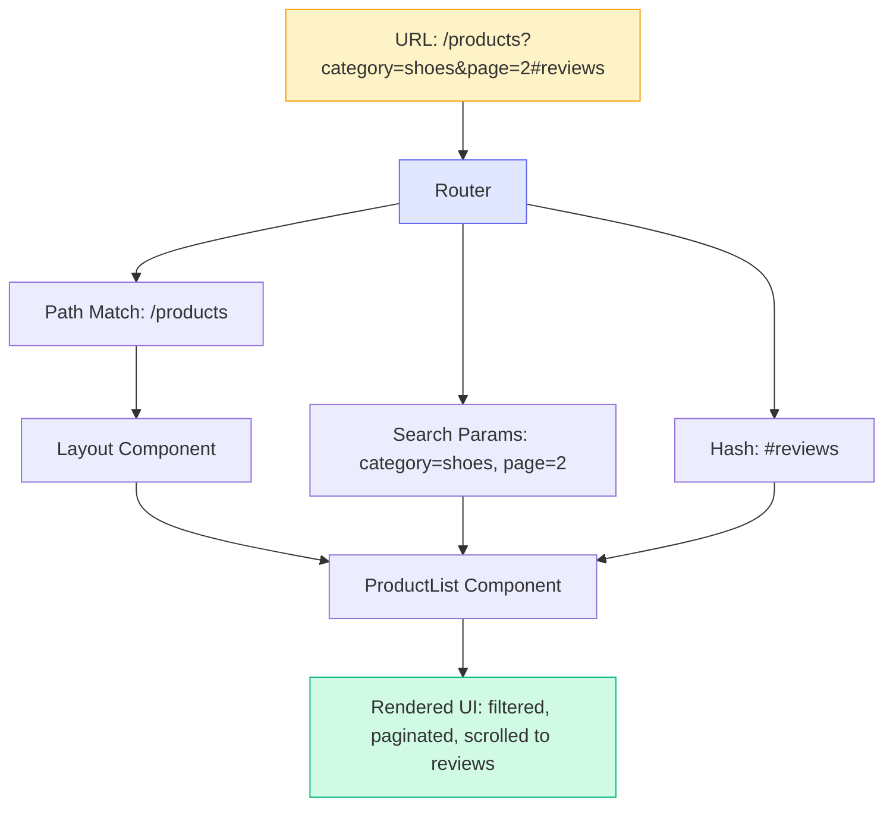
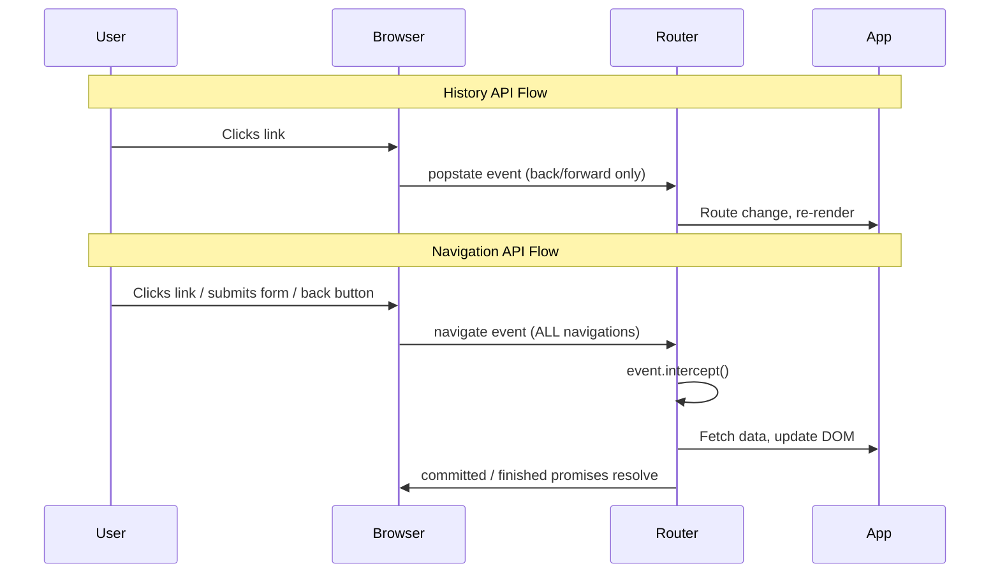

# [FEE-606] URL 狀態與路由

:::info
URL 是 web 最原始的狀態容器。每一次頁面載入、每一個書籤、每一個分享的連結，都將應用程式狀態直接編碼在網址列中。單頁應用程式（SPA）打破了這個契約，完全在 JavaScript 中管理導航，將狀態隱藏在記憶體變數背後。現代框架和瀏覽器 API 正在恢復 URL 作為可分享、可導航應用程式狀態的真實來源（source of truth）的正當地位。
:::

## 背景脈絡（Context）

在 SPA 出現之前，URL *就是*應用程式狀態。點擊連結會向伺服器發送請求，伺服器回傳新的 HTML 頁面。瀏覽器的網址列、返回按鈕和書籤功能都能無縫運作，因為每一次有意義的狀態變更都會產生新的 URL。使用者可以複製 URL、傳給同事，同事會看到完全相同的頁面。

早期 SPA（2010 年代的 Backbone、Angular.js）打破了這個模型。導航完全在 JavaScript 中發生。URL 停留在 `/`，而應用程式在數十個視圖之間切換。返回按鈕失效了。書籤變得無用。深層連結（deep link）不可能實現。搜尋引擎無法爬取內容。

Web 平台以 History API（`pushState`、`replaceState`、`popstate`）作為回應，讓 JavaScript 可以在不完整重新載入頁面的情況下更新 URL。框架路由器 -- React Router、Vue Router、Angular Router -- 建構在這個基礎之上，在 SPA 中恢復了 URL 驅動的導航。今天，更新的 Navigation API 提供了更多控制能力，包括正確攔截導航事件、存取完整的 history entry 列表，以及基於 Promise 的導航模型。

URL 不僅僅是顯示用的產物。它是一個**狀態容器**，具有定義明確的區段：

| 區段 | 用途 | 範例 |
|---|---|---|
| **Pathname（路徑）** | 識別資源/路由 | `/products/42` |
| **Search params（查詢參數）** | 編碼篩選/排序/分頁狀態 | `?category=shoes&sort=price` |
| **Hash（雜湊）** | 指向頁面內的某個區段 | `#reviews` |

每個區段扮演不同的角色。Pathname 識別使用者正在看*什麼*。Search params 描述他們*如何*看（篩選、排序、分頁）。Hash 指向他們聚焦在頁面的*哪裡*。理解這個分類法是有效使用 URL 作為狀態的第一步。

## 原則（Principle）

> **SHOULD**（建議）將 URL 作為任何需要可分享、可收藏書籤、或在頁面重新整理後仍然存在的狀態的真實來源。

如果使用者可以分享一個連結，而接收者應該看到相同的視圖 -- 相同的篩選條件、相同的分頁、相同的選取分頁標籤 -- 那個狀態就屬於 URL。元件本地狀態（`useState`、`ref()`）是短暫的：重新整理就消失，無法分享。URL 狀態是持久的：跨越工作階段、裝置和使用者都能保持。

這不代表*所有*狀態都屬於 URL。Modal 開關、hover 效果、動畫進度和表單草稿內容是短暫的 UI 狀態，應該留在元件狀態中。指導原則：**如果狀態改變了「使用者正在看什麼」的答案，它屬於 URL。如果它改變的是「頁面目前看起來怎樣」，它屬於元件。**

## 設計思維（Design Thinking）

### URL：Web 最原始的狀態管理器

Web 建構在無狀態的請求-回應模型之上。每次互動都產生一個 URL。每個 URL 都產生一個完整的頁面。這在很多方面是受限的，但它免費提供了三個強大的能力：

1. **可分享性（Shareability）** -- 複製 URL，貼到任何地方，接收者看到相同的內容。
2. **可收藏性（Bookmarkability）** -- 儲存 URL，數週後回到完全相同的視圖。
3. **可導航性（Navigability）** -- 返回和前進按鈕遍歷有意義的狀態轉換。

SPA 用更豐富的互動性換取了這些能力。現代框架旨在恢復它們。目標不是回到伺服器渲染頁面，而是確保 SPA 遵守 web 建構時所依據的相同 URL 契約。

### 檔案式路由作為慣例（File-Based Routing as Convention）

早期 SPA 路由器需要明確的路由設定 -- 一個將 URL 模式映射到元件的 JavaScript 物件。這很靈活但冗長，而且將 URL 結構與檔案結構斷開了連結：

```js
// 手動路由設定（React Router v5 風格）
const routes = [
  { path: '/', element: <Home /> },
  { path: '/products', element: <Products /> },
  { path: '/products/:id', element: <ProductDetail /> },
  { path: '/about', element: <About /> },
];
```

Next.js 推廣了**檔案式路由（file-based routing）**：檔案系統*就是*路由表。位於 `app/products/[id]/page.tsx` 的檔案自動處理 `/products/42`。SvelteKit、Nuxt 和 Remix/React Router v7（框架模式）都採用此模式，只是慣例略有不同：

| 框架 | 路由檔案 | 動態區段 | Layout |
|---|---|---|---|
| Next.js (App Router) | `app/products/[id]/page.tsx` | `[id]` | `layout.tsx` |
| SvelteKit | `src/routes/products/[id]/+page.svelte` | `[id]` | `+layout.svelte` |
| Nuxt | `pages/products/[id].vue` | `[id]` | `layouts/default.vue` |
| React Router v7 | `app/routes/products.$id.tsx` | `$id` | `root.tsx` |

檔案式路由消除了程式碼組織與 URL 結構之間的斷裂。檔案樹成為應用程式支援的每個 URL 的視覺化地圖。

### 平行狀態問題（The Parallel State Problem）

URL 狀態管理中最困難的挑戰是保持兩個狀態來源同步：URL 和元件樹。考慮一個帶有篩選器的產品列表頁面：

1. 使用者從下拉選單中選擇 "category=shoes"。
2. 元件狀態更新以反映選擇。
3. URL 也必須更新為 `?category=shoes`。
4. 如果使用者按下返回按鈕，URL 會變回去。
5. 元件狀態必須更新以匹配先前的 URL。

這種雙向同步就是**平行狀態問題（parallel state problem）**。如果元件擁有狀態而 URL 只是反映，返回按鈕導航會壞掉，因為元件不會對 URL 變化做出反應。如果 URL 擁有狀態而元件從中讀取，解決方案更乾淨，但要求每次狀態變更都通過 URL（透過 `pushState` 或路由器導航）。

原則：**讓 URL 成為單一真實來源。元件從 URL 讀取，使用者互動寫入 URL。** 這完全消除了同步問題，因為只有一個來源需要保持同步。

### History API 與 Navigation API

History API（`pushState`、`replaceState`、`popstate`）自 2010 年以來一直是 SPA 路由的基礎。它能運作，但有顯著的限制：

- **無法在導航發生前攔截它。** 你可以在返回/前進導航後監聽 `popstate`，但無法阻止或修改它。
- **無法存取完整的 history 列表。** `history.length` 告訴你有多少條目，但你無法檢查它們。
- **無法區分你的應用程式的條目與其他來源。** History 在分頁中的所有頁面之間共享。
- **沒有 Promise。** `pushState` 是「送出就忘」，無法知道導航何時完成。

Navigation API（截至 2026 年初已在所有主流瀏覽器中可用）解決了這些限制：

```js
// Navigation API：攔截並處理導航
navigation.addEventListener('navigate', (event) => {
  const url = new URL(event.destination.url);

  if (url.pathname.startsWith('/products/')) {
    event.intercept({
      async handler() {
        const content = await fetchProductPage(url.pathname);
        renderContent(content);
      },
    });
  }
});

// 基於 Promise 的程式化導航
const result = await navigation.navigate('/products/42');
// result.committed -- URL 變更時 resolve 的 promise
// result.finished  -- handler 完成時 resolve 的 promise
```

Navigation API 的主要優勢：
- **攔截任何導航**（連結點擊、表單提交、返回/前進）在同一個地方。
- **存取 history 條目**，透過 `navigation.entries()` 限定在你的 origin。
- **基於 Promise 的導航**，具有 `committed` 和 `finished` promise。
- **逐條目狀態**，透過 `navigation.navigate(url, { state })` 跨工作階段持久化。

框架路由器正開始在底層採用 Navigation API，但理解它有助於你推理路由器在做什麼以及除錯導航問題。

### 客戶端路由與伺服器端路由（Client-Side vs. Server-Side Routing）

| 面向 | 伺服器端路由 | 客戶端路由 |
|---|---|---|
| **機制** | 伺服器接收 URL，回傳 HTML | JavaScript 攔截導航，更新 DOM |
| **頁面重新載入** | 每次導航完整重新載入 | 不重新載入；DOM 就地更新 |
| **初始載入** | 快（HTML 已就緒到達） | 較慢（JS bundle 必須先載入） |
| **後續導航** | 較慢（完整來回行程） | 較快（只擷取資料，非完整 HTML） |
| **SEO** | 內建（HTML 可爬取） | 需要 SSR/SSG 才可爬取 |
| **返回按鈕** | 原生運作 | 必須由路由器實作 |

現代 meta 框架（Next.js、Remix、SvelteKit、Nuxt）模糊了這個區別。初始頁面載入是伺服器渲染的以獲得速度和 SEO。後續導航是客戶端的以獲得回應性。這種混合方式 -- 有時稱為**過渡型應用程式（transitional apps）** -- 給你兩全其美。

## 視覺化（Visual）

### URL 到元件樹流程（URL to Component Tree Flow）



路由器將 URL 分解為其組成部分，並將它們分配到元件樹中。Pathname 決定*哪些*元件渲染。Search params 和 hash 作為 props 傳遞或透過 hooks 存取，影響元件顯示*什麼*和*在哪裡*。

### 導航流程：History API 與 Navigation API



## 範例（Example）

### 1. URLSearchParams 用於篩選狀態

`URLSearchParams` API 提供了乾淨的介面來讀寫查詢參數，不需要手動字串解析：

```ts
// 從當前 URL 讀取 search params
const params = new URLSearchParams(window.location.search);
const category = params.get('category');    // "shoes" or null
const page = Number(params.get('page')) || 1;
const sort = params.get('sort') ?? 'relevance';

// 不完整重新載入頁面就寫入 search params
function updateFilters(newCategory: string) {
  const params = new URLSearchParams(window.location.search);
  params.set('category', newCategory);
  params.set('page', '1'); // 篩選變更時重置分頁

  // pushState：建立新的 history 條目（返回按鈕回到先前的）
  history.pushState(null, '', `?${params.toString()}`);

  // 或 replaceState：更新當前條目（不產生新的 history 條目）
  // history.replaceState(null, '', `?${params.toString()}`);

  // 觸發你的應用程式重新讀取 URL 並重新渲染
  applyFilters();
}
```

在 React 中，`useSearchParams` hook 包裝了這個模式：

```tsx
import { useSearchParams } from 'react-router';

function ProductFilters() {
  const [searchParams, setSearchParams] = useSearchParams();
  const category = searchParams.get('category') ?? 'all';

  function handleCategoryChange(newCategory: string) {
    setSearchParams((prev) => {
      prev.set('category', newCategory);
      prev.set('page', '1');
      return prev;
    });
  }

  return (
    <select value={category} onChange={(e) => handleCategoryChange(e.target.value)}>
      <option value="all">All</option>
      <option value="shoes">Shoes</option>
      <option value="bags">Bags</option>
    </select>
  );
}
```

### 2. React Router v7 Data Loader

React Router v7（框架模式）結合檔案式路由與伺服器端資料載入。`loader` 函式在元件渲染前於伺服器上執行，其資料在元件中同步可用：

```tsx
// app/routes/products.tsx
import type { Route } from './+types/products';

export async function loader({ request }: Route.LoaderArgs) {
  const url = new URL(request.url);
  const category = url.searchParams.get('category') ?? 'all';
  const page = Number(url.searchParams.get('page')) || 1;

  const products = await db.products.findMany({
    where: category !== 'all' ? { category } : {},
    skip: (page - 1) * 20,
    take: 20,
  });

  return { products, category, page };
}

export default function Products({ loaderData }: Route.ComponentProps) {
  const { products, category, page } = loaderData;

  return (
    <div>
      <h1>Products ({category})</h1>
      <ul>
        {products.map((p) => (
          <li key={p.id}>{p.name} - ${p.price}</li>
        ))}
      </ul>
      <Pagination current={page} />
    </div>
  );
}
```

URL 驅動一切：`loader` 從請求 URL 讀取 search params、擷取正確的資料，元件渲染它。變更 URL（透過連結、表單提交或 `useNavigate`）會自動再次觸發 loader。不需要手動狀態同步。

### 3. Next.js 平行路由（Parallel Routes）

Next.js 平行路由允許多個路由區段在同一個 layout 中同時渲染。這對於 dashboard 和複雜 UI 非常強大，其中不同面板具有獨立的 URL 驅動狀態：

```
app/
  dashboard/
    layout.tsx          # 同時渲染 @analytics 和 @feed slots
    page.tsx            # 預設 dashboard 內容
    @analytics/
      page.tsx          # 分析面板
      loading.tsx       # 獨立的載入狀態
    @feed/
      page.tsx          # 動態消息面板
      loading.tsx       # 獨立的載入狀態
```

```tsx
// app/dashboard/layout.tsx
export default function DashboardLayout({
  children,
  analytics,
  feed,
}: {
  children: React.ReactNode;
  analytics: React.ReactNode;
  feed: React.ReactNode;
}) {
  return (
    <div className="grid grid-cols-3 gap-4">
      <main className="col-span-2">{children}</main>
      <aside>
        {analytics}
        {feed}
      </aside>
    </div>
  );
}
```

每個 slot（`@analytics`、`@feed`）獨立載入，可以有自己的 loading 和 error 狀態。URL 決定每個 slot 中渲染什麼內容。結合攔截路由（intercepting routes），這能實現像 modal overlay 這樣的模式，在顯示詳細視圖的同時保留底層頁面 URL。

## 常見錯誤（Common Mistakes）

### 1. 將可分享的狀態保存在元件而非 URL 中

```tsx
// 錯誤 -- 篩選條件在重新整理時遺失，無法分享
function ProductList() {
  const [category, setCategory] = useState('all');
  const [sort, setSort] = useState('price');
  // 不論篩選狀態如何，URL 都停留在 /products
}

// 正確 -- 篩選條件存在 URL 中
function ProductList() {
  const [searchParams, setSearchParams] = useSearchParams();
  const category = searchParams.get('category') ?? 'all';
  const sort = searchParams.get('sort') ?? 'price';
  // URL: /products?category=shoes&sort=price -- 可分享、可收藏書籤
}
```

如果同事問「你能把鞋子類別按價格排序的連結傳給我嗎？」，第一個版本無法產生那個連結。第二個版本已經在網址列中了。

### 2. 瀏覽器返回時未同步 URL 與狀態

```js
// 錯誤 -- 監聽下拉選單變更但忽略 popstate
dropdown.addEventListener('change', (e) => {
  currentCategory = e.target.value;
  history.pushState(null, '', `?category=${currentCategory}`);
  renderProducts();
});
// 使用者按返回：URL 變了，但元件仍顯示舊的 category

// 正確 -- 同時監聽 popstate（或使用框架路由器）
window.addEventListener('popstate', () => {
  const params = new URLSearchParams(window.location.search);
  currentCategory = params.get('category') ?? 'all';
  dropdown.value = currentCategory;
  renderProducts();
});
```

返回按鈕會變更 URL，但你的應用程式必須對該變更做出反應。框架路由器會自動處理這點 -- 這是使用它們而非手動 `pushState` 呼叫的關鍵原因。

### 3. 在 URL 中編碼複雜狀態

```
// 錯誤 -- 將整個應用程式狀態序列化到 URL 中
/dashboard?state=eyJmaWx0ZXJzIjp7ImNhdGVnb3J5Ijoic2hvZXMiLCJwcmljZVJhbmdlIjpbMTAsMTAwXX19

// 正確 -- 簡單、可讀的參數用於可分享狀態
/dashboard?category=shoes&priceMin=10&priceMax=100
```

URL 有實際長度限制（約 2,000 個字元以獲得廣泛相容性）。Base64 編碼的 JSON blob 是不透明的、脆弱的、且無法除錯。保持 URL 狀態扁平且人類可讀。不需要可分享的複雜狀態（表單草稿、UI 偏好）屬於元件狀態、localStorage 或 sessionStorage。

### 4. 不使用 URLSearchParams（手動字串解析）

```js
// 錯誤 -- 脆弱的手動解析
const query = window.location.search.substring(1);
const parts = query.split('&');
const params = {};
parts.forEach((part) => {
  const [key, value] = part.split('=');
  params[key] = decodeURIComponent(value);
});
// 在以下情況會壞掉：空搜尋、缺失值、編碼的 &、重複的 key

// 正確 -- 使用平台內建 API
const params = new URLSearchParams(window.location.search);
const category = params.get('category');
const tags = params.getAll('tag'); // 處理重複的 key：?tag=a&tag=b
```

`URLSearchParams` 處理編碼、解碼、重複 key、缺失值和迭代。所有現代瀏覽器和 Node.js 都支援。沒有理由手動解析查詢字串。

### 5. 在 SPA 中破壞深層連結

```
// 錯誤 -- SPA 只處理從首頁開始的導航
// 使用者直接造訪 https://myapp.com/products/42
// 伺服器回傳 404 因為不存在 /products/42.html

// 正確 -- 設定伺服器為所有路由提供 index.html
// nginx
location / {
  try_files $uri $uri/ /index.html;
}

// 或使用 SSR/SSG 讓每個路由都有真實的伺服器回應
```

如果你的 SPA 使用客戶端路由，伺服器必須設定為對任何 URL 路徑都提供 SPA shell。否則，直接導航、書籤和分享連結都會產生 404 錯誤。SSR 框架（Next.js、Remix、SvelteKit、Nuxt）透過為每個路由產生伺服器回應來解決這個問題。

## 相關 FEE（Related FEEs）

- [FEE-600](./600.md) 狀態管理總覽 -- 將 URL 狀態分類為獨立類別的分類法
- [FEE-106](../HTML%20and%20Semantic%20Markup/106.md) 漸進增強（Progressive Enhancement）-- 不需要 JavaScript 也能運作的 URL
- [FEE-604](./604.md) 伺服器狀態與資料同步 -- 讀取 URL 狀態的 loaders 和伺服器端資料擷取

## 參考資料（References）

- [MDN: Navigation API](https://developer.mozilla.org/en-US/docs/Web/API/Navigation_API) -- 用於攔截和管理導航的現代瀏覽器 API
- [MDN: URLSearchParams](https://developer.mozilla.org/en-US/docs/Web/API/URLSearchParams) -- 讀寫查詢字串的標準 API
- [React Router: Data Loading](https://reactrouter.com/start/framework/data-loading) -- React Router v7 中的 loaders 和伺服器端資料擷取
- [Next.js: Parallel Routes](https://nextjs.org/docs/app/api-reference/file-conventions/parallel-routes) -- 同時渲染多個路由區段
- [SvelteKit: Routing](https://svelte.dev/docs/kit/routing) -- SvelteKit 中的檔案式路由慣例
- [Vue Router: File-Based Routing](https://router.vuejs.org/file-based-routing/file-based-routing) -- Vue Router 的檔案慣例
- [Your URL Is Your State](https://alfy.blog/2025/10/31/your-url-is-your-state.html) -- URL 驅動狀態管理的實用指南
- [MDN: History API](https://developer.mozilla.org/en-US/docs/Web/API/History_API) -- SPA 路由的基礎 API
