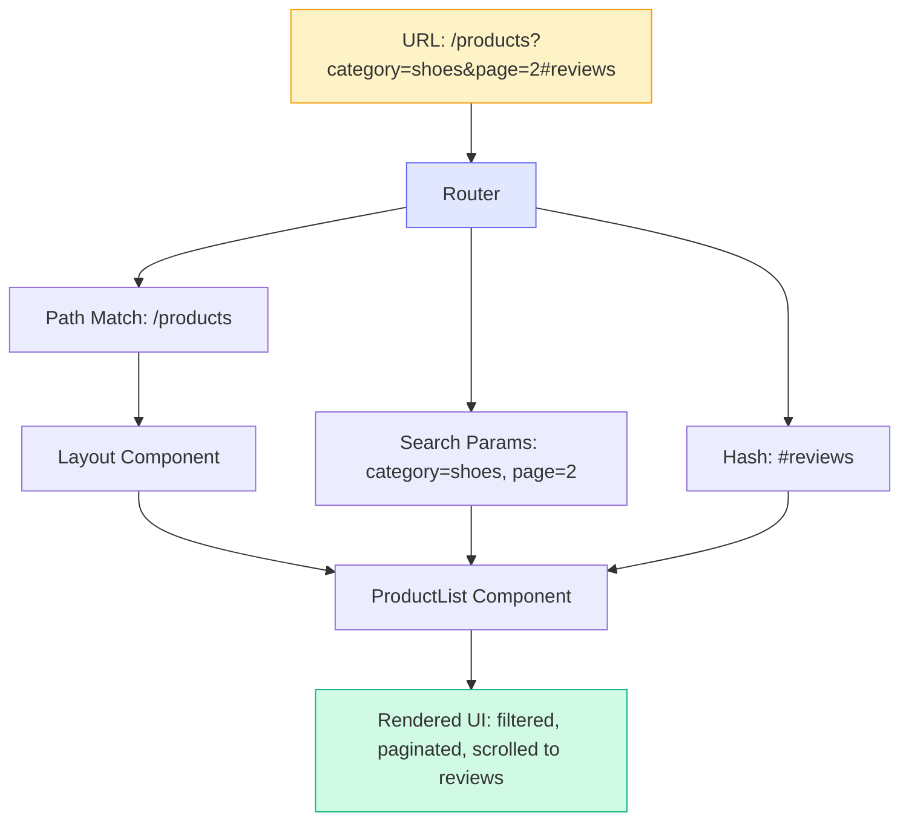
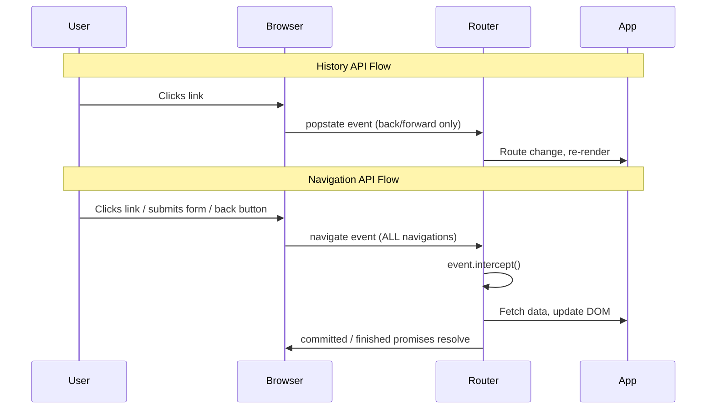

# [FEE-606] URL 狀態與路由

:::info
URL 是 web 最原始的狀態容器。每一次頁面載入、每一個書籤、每一個分享的連結，都將應用程式狀態直接編碼在網址列中。單頁應用程式（SPA）打破了這個契約，完全在 JavaScript 中管理導航，將狀態隱藏在記憶體變數背後。現代框架和瀏覽器 API 正在恢復 URL 作為可分享、可導航應用程式狀態的真實來源（source of truth）的正當地位。
:::

## 背景脈絡（Context）

在 SPA 出現之前，URL *就是*應用程式狀態。點擊連結會向伺服器發送請求，伺服器回傳新的 HTML 頁面。瀏覽器的網址列、返回按鈕和書籤功能都能無縫運作，因為每一次有意義的狀態變更都會產生新的 URL。使用者可以複製 URL、傳給同事，同事會看到完全相同的頁面。

早期 SPA（2010 年代的 Backbone、Angular.js）打破了這個模型。導航完全在 JavaScript 中發生，URL 停留在 `/`，而應用程式卻在數十個視圖之間切換。返回按鈕失效了，而加了書籤的頁面載入的是空殼，而不是使用者當初儲存的那個視圖。

Web 平台以 History API（`pushState`、`replaceState`、`popstate`）作為回應，讓 JavaScript 可以在不完整重新載入頁面的情況下更新 URL。框架路由器（React Router、Vue Router、Angular Router）建構在這個基礎之上，在 SPA 中恢復了 URL 驅動的導航。今天，更新的 Navigation API 提供了更多控制能力，包括正確攔截導航事件、存取完整的 history entry 列表，以及基於 Promise 的導航模型。

URL 不僅僅是顯示用的產物。它是一個**狀態容器**，具有定義明確的區段：

| 區段 | 用途 | 範例 |
|---|---|---|
| **Pathname（路徑）** | 識別資源/路由 | `/products/42` |
| **Search params（查詢參數）** | 編碼篩選/排序/分頁狀態 | `?category=shoes&sort=price` |
| **Hash（雜湊）** | 指向頁面內的某個區段 | `#reviews` |

每個區段扮演不同的角色。Pathname 識別使用者正在看*什麼*。Search params 描述他們*如何*看（篩選、排序、分頁）。Hash 指向他們聚焦在頁面的*哪裡*。

## 視覺化（Visual）

### URL 到元件樹流程（URL to Component Tree Flow）



路由器將 URL 分解為其組成部分，並將它們分配到元件樹中。Pathname 決定*哪些*元件渲染。Search params 和 hash 作為 props 傳遞或透過 hooks 存取，影響元件顯示*什麼*和*在哪裡*。

### 導航流程：History API 與 Navigation API



## 範例（Example）

以下範例聚焦於 React 及其 meta 框架（React Router、Next.js），這是目前檔案式路由與型別化 loader 最成熟的生態系。SvelteKit 與 Vue Router 分別透過 `load` 函式與 `useRoute()` 套用相同的「URL 即狀態」原則；本文後面的檔案式路由對照表與參考資料章節都連結到各框架專屬的文件。

### 1. URLSearchParams 用於篩選狀態

`URLSearchParams` API 提供了乾淨的介面來讀寫查詢參數，不需要手動字串解析：

```ts
// 從當前 URL 讀取 search params
const params = new URLSearchParams(window.location.search);
const category = params.get('category');    // "shoes" or null
const page = Number(params.get('page')) || 1;
const sort = params.get('sort') ?? 'relevance';

// 不完整重新載入頁面就寫入 search params
function updateFilters(newCategory: string) {
  const params = new URLSearchParams(window.location.search);
  params.set('category', newCategory);
  params.set('page', '1'); // 篩選變更時重置分頁

  // pushState：建立新的 history 條目（返回按鈕回到先前的）
  history.pushState(null, '', `?${params.toString()}`);

  // 或 replaceState：更新當前條目（不產生新的 history 條目）
  // history.replaceState(null, '', `?${params.toString()}`);

  // 觸發你的應用程式重新讀取 URL 並重新渲染
  applyFilters();
}
```

在 React 中，`useSearchParams` hook 包裝了這個模式：

```tsx
import { useSearchParams } from 'react-router';

function ProductFilters() {
  const [searchParams, setSearchParams] = useSearchParams();
  const category = searchParams.get('category') ?? 'all';

  function handleCategoryChange(newCategory: string) {
    setSearchParams((prev) => {
      prev.set('category', newCategory);
      prev.set('page', '1');
      return prev;
    });
  }

  return (
    <select value={category} onChange={(e) => handleCategoryChange(e.target.value)}>
      <option value="all">All</option>
      <option value="shoes">Shoes</option>
      <option value="bags">Bags</option>
    </select>
  );
}
```

### 2. React Router v7 Data Loader

React Router v7（框架模式）結合檔案式路由與伺服器端資料載入。`loader` 函式在元件渲染前於伺服器上執行，其資料在元件中同步可用：

```tsx
// app/routes/products.tsx
import type { Route } from './+types/products';

export async function loader({ request }: Route.LoaderArgs) {
  const url = new URL(request.url);
  const category = url.searchParams.get('category') ?? 'all';
  const page = Number(url.searchParams.get('page')) || 1;

  const products = await db.products.findMany({
    where: category !== 'all' ? { category } : {},
    skip: (page - 1) * 20,
    take: 20,
  });

  return { products, category, page };
}

export default function Products({ loaderData }: Route.ComponentProps) {
  const { products, category, page } = loaderData;

  return (
    <div>
      <h1>Products ({category})</h1>
      <ul>
        {products.map((p) => (
          <li key={p.id}>{p.name} - ${p.price}</li>
        ))}
      </ul>
      <Pagination current={page} />
    </div>
  );
}
```

URL 驅動一切：`loader` 從請求 URL 讀取 search params、擷取正確的資料，元件渲染它。變更 URL（透過連結、表單提交或 `useNavigate`）會自動再次觸發 loader。不需要手動狀態同步。

### 3. Next.js 平行路由（Parallel Routes）

Next.js 平行路由允許多個路由區段在同一個 layout 中同時渲染。這對於 dashboard 和複雜 UI 非常強大，其中不同面板具有獨立的 URL 驅動狀態：

```
app/
  dashboard/
    layout.tsx          # 同時渲染 @analytics 和 @feed slots
    page.tsx            # 預設 dashboard 內容
    @analytics/
      page.tsx          # 分析面板
      loading.tsx       # 獨立的載入狀態
    @feed/
      page.tsx          # 動態消息面板
      loading.tsx       # 獨立的載入狀態
```

```tsx
// app/dashboard/layout.tsx
export default function DashboardLayout({
  children,
  analytics,
  feed,
}: {
  children: React.ReactNode;
  analytics: React.ReactNode;
  feed: React.ReactNode;
}) {
  return (
    <div className="grid grid-cols-3 gap-4">
      <main className="col-span-2">{children}</main>
      <aside>
        {analytics}
        {feed}
      </aside>
    </div>
  );
}
```

每個 slot（`@analytics`、`@feed`）獨立載入，可以有自己的 loading 和 error 狀態。URL 決定每個 slot 中渲染什麼內容。結合攔截路由（intercepting routes），這能實現像 modal overlay 這樣的模式，在顯示詳細視圖的同時保留底層頁面 URL。

## 最佳實踐

**將可分享的 UI 狀態編碼在 URL 中：篩選條件、搜尋、分頁。** 任何改變「使用者正在看什麼」答案的狀態都 SHOULD 存在於 URL 中。如果使用者可以向同事描述他們的視圖（「給我看按價格排序的第 3 頁鞋子」），一個編碼了該視圖的 URL 可以讓他們用一次複製貼上分享。元件本地狀態（`useState`、`ref()`）是短暫的：重新整理就消失，無法分享。AVOID 在篩選條件、排序順序、搜尋查詢或選取分頁應該在頁面重新載入後仍然存在的情況下，將它們保存在元件狀態中。

**使用 `URLSearchParams` 進行結構化的查詢字串管理。** MUST NOT 用 `split('&')` 和 `split('=')` 手動解析查詢字串。手動解析在空值、編碼的 & 符號和重複 key 上會出錯。`URLSearchParams` 正確處理所有瀏覽器中的編碼、解碼、重複 key（`getAll()`）和序列化。使用 `params.set()` 更新單一參數，用 `params.toString()` 將其寫回 URL。

**避免在本地或伺服器狀態中重複 URL 狀態。** 當 URL 是真實來源時，MUST NOT 同時在 `useState` 或 store 中儲存相同的值。描述相同事物的兩個來源終究會產生不一致。最常見的觸發點是返回按鈕：它會改變 URL，卻不會更動元件狀態。讓 URL 擁有該值；元件透過 router hook（`useSearchParams`、`useRoute`）讀取它，並透過導航寫入它。

**驗證並為 URL 狀態賦予型別，而非直接信任原始字串。** Search params 抵達時都是未型別化的字串，因此上面範例中的 `Number(params.get('page')) || 1` 會在 `page=abc` 時悄悄變成 `1`，且不會留下解析失敗的紀錄。SHOULD 在路由邊界對 search params 進行 schema 驗證，而非在每個元件中內嵌驗證邏輯。TanStack Router 的 `validateSearch` 選項可在路由定義上接受一個 schema（Zod、Valibot 或一般函式），並將型別化、已驗證的值提供給 loaders 與元件，讓不合法的值可預期地失敗，而不是讓 `NaN` 一路擴散。對於 TanStack Router 之外的 React 應用（Next.js、Remix、原生 React Router），`nuqs` 透過帶有宣告預設值的 parser，提供了相近的 schema 型別化讀寫 API。

**對非導航性的狀態更新使用 `history.replaceState` 而非 `pushState`。** `pushState` 建立新的瀏覽器歷史條目，因此返回按鈕會回到之前的篩選條件集。`replaceState` 就地更新 URL，不產生新條目。SHOULD 在狀態變更精煉當前視圖（改變排序順序）而非構成使用者想要後退的有意義導航時，使用 `replaceState`（或相應的 router 等效方法）。

## 設計思維（Design Thinking）

### URL：Web 最原始的狀態管理器

Web 最原始的請求-回應模型免費給了使用者三種能力：

1. **可分享性。** 複製 URL，貼到任何地方，接收者都會看到相同的內容。
2. **可收藏性。** 儲存 URL，數週後仍能回到完全相同的視圖。
3. **可導航性。** 返回與前進按鈕遍歷有意義的狀態轉換。

SPA 用更豐富的互動性換取了這些能力。現代框架讓 URL 保持權威，同時仍在客戶端渲染。

### 檔案式路由作為慣例（File-Based Routing as Convention）

早期 SPA 路由器需要明確的路由設定：一個將 URL 模式映射到元件的 JavaScript 物件。這很靈活但冗長，而且將 URL 結構與檔案結構斷開了連結：

```js
// 手動路由設定（React Router v5 風格）
const routes = [
  { path: '/', element: <Home /> },
  { path: '/products', element: <Products /> },
  { path: '/products/:id', element: <ProductDetail /> },
  { path: '/about', element: <About /> },
];
```

Next.js 推廣了**檔案式路由（file-based routing）**：檔案系統*就是*路由表。位於 `app/products/[id]/page.tsx` 的檔案自動處理 `/products/42`。SvelteKit、Nuxt 和 Remix/React Router v7（框架模式）都採用此模式，只是慣例略有不同：

| 框架 | 路由檔案 | 動態區段 | Layout |
|---|---|---|---|
| Next.js (App Router) | `app/products/[id]/page.tsx` | `[id]` | `layout.tsx` |
| SvelteKit | `src/routes/products/[id]/+page.svelte` | `[id]` | `+layout.svelte` |
| Nuxt | `pages/products/[id].vue` | `[id]` | `layouts/default.vue` |
| React Router v7 | `app/routes/products.$id.tsx` | `$id` | `root.tsx` |

檔案式路由消除了程式碼組織與 URL 結構之間的斷裂。

### 平行狀態問題（The Parallel State Problem）

URL 狀態管理中最困難的挑戰是保持兩個狀態來源同步：URL 和元件樹。考慮一個帶有篩選器的產品列表頁面：

1. 使用者從下拉選單中選擇 "category=shoes"。
2. 元件狀態更新以反映選擇。
3. URL 也必須更新為 `?category=shoes`。
4. 如果使用者按下返回按鈕，URL 會變回去。
5. 元件狀態必須更新以匹配先前的 URL。

這種雙向同步就是**平行狀態問題（parallel state problem）**。如果元件擁有狀態而 URL 只是反映，返回按鈕導航會壞掉，因為元件不會對 URL 變化做出反應。如果 URL 擁有狀態而元件從中讀取，解決方案更乾淨，但要求每次狀態變更都通過 URL（透過 `pushState` 或路由器導航）。

原則：**讓 URL 成為單一真實來源。元件從 URL 讀取，使用者互動寫入 URL。**

### History API 與 Navigation API

History API（`pushState`、`replaceState`、`popstate`）自 2010 年以來一直是 SPA 路由的基礎。它能運作，但有顯著的限制：

- **無法在導航發生前攔截它。** 你可以在返回/前進導航後監聽 `popstate`，但無法阻止或修改它。
- **無法存取完整的 history 列表。** `history.length` 告訴你有多少條目，但你無法檢查它們。
- **無法區分你的應用程式的條目與其他來源。** History 在分頁中的所有頁面之間共享。
- **沒有 Promise。** `pushState` 是「送出就忘」，無法知道導航何時完成。

Navigation API 解決了這些限制。它已在 2026 年 1 月達到 Baseline Newly Available，如今已在所有主要瀏覽器中可用，不過 MDN 指出這套 API 的部分功能在各實作間的支援程度仍有差異；完整的守衛檢查理由與生命週期圖，請參見 [FEE-418](../Browser%20APIs%20and%20Web%20Platform/navigation-api.md)：

```js
// Navigation API：攔截並處理導航
navigation.addEventListener('navigate', (event) => {
  if (!event.canIntercept) return;             // 跨源或跨文件遍歷
  if (event.hashChange) return;                 // 片段導覽，無需變更視圖
  if (event.downloadRequest !== null) return;   // 下載連結，交給瀏覽器處理

  const url = new URL(event.destination.url);

  if (url.pathname.startsWith('/products/')) {
    event.intercept({
      async handler() {
        const content = await fetchProductPage(url.pathname);
        renderContent(content);
      },
    });
  }
});

// 程式化導航回傳的是一組 promise，而非單一 thenable
const { committed, finished } = navigation.navigate('/products/42');
await committed; // URL 變更時兌現
await finished;  // intercept handler 的 promise 解決時兌現
```

Navigation API 的主要優勢：
- **攔截任何導航**（連結點擊、表單提交、返回/前進）在同一個地方，並以 `canIntercept`、`hashChange` 與 `downloadRequest` 守衛。
- **存取 history 條目**，透過 `navigation.entries()` 限定在你的 origin。
- **基於 Promise 的導航**，具有 `committed` 和 `finished` promise。
- **逐條目狀態**，透過 `navigation.navigate(url, { state })` 跨工作階段持久化。

框架路由器正開始在底層採用 Navigation API，但理解它有助於你推理路由器在做什麼以及除錯導航問題。

### 客戶端路由與伺服器端路由（Client-Side vs. Server-Side Routing）

| 面向 | 伺服器端路由 | 客戶端路由 |
|---|---|---|
| **機制** | 伺服器接收 URL，回傳 HTML | JavaScript 攔截導航，更新 DOM |
| **頁面重新載入** | 每次導航完整重新載入 | 不重新載入；DOM 就地更新 |
| **初始載入** | 快（HTML 已就緒到達） | 較慢（JS bundle 必須先載入） |
| **後續導航** | 較慢（完整來回行程） | 較快（只擷取資料，非完整 HTML） |
| **SEO** | 內建（HTML 可爬取） | 需要 SSR/SSG 才可爬取 |
| **返回按鈕** | 原生運作 | 必須由路由器實作 |

現代 meta 框架（Next.js、Remix、SvelteKit、Nuxt）模糊了這個區別。初始頁面載入是伺服器渲染的以獲得速度和 SEO。後續導航是客戶端的以獲得回應性。這種混合方式，有時稱為**過渡型應用程式（transitional apps）**，讓你兩全其美。

## 常見錯誤（Common Mistakes）

### 1. 瀏覽器返回時未同步 URL 與狀態

```js
// 錯誤 -- 監聽下拉選單變更但忽略 popstate
dropdown.addEventListener('change', (e) => {
  currentCategory = e.target.value;
  history.pushState(null, '', `?category=${currentCategory}`);
  renderProducts();
});
// 使用者按返回：URL 變了，但元件仍顯示舊的 category

// 正確 -- 同時監聽 popstate（或使用框架路由器）
window.addEventListener('popstate', () => {
  const params = new URLSearchParams(window.location.search);
  currentCategory = params.get('category') ?? 'all';
  dropdown.value = currentCategory;
  renderProducts();
});
```

返回按鈕會變更 URL，但你的應用程式必須對該變更做出反應。框架路由器會自動處理這點，這正是使用它們而非手動呼叫 `pushState` 的關鍵原因。

### 2. 在 URL 中編碼複雜狀態

```
// 錯誤 -- 將整個應用程式狀態序列化到 URL 中
/dashboard?state=eyJmaWx0ZXJzIjp7ImNhdGVnb3J5Ijoic2hvZXMiLCJwcmljZVJhbmdlIjpbMTAsMTAwXX19

// 正確 -- 簡單、可讀的參數用於可分享狀態
/dashboard?category=shoes&priceMin=10&priceMax=100
```

URL 有實際長度限制（約 2,000 個字元以獲得廣泛相容性）。Base64 編碼的 JSON blob 是不透明的、脆弱的、且無法除錯。保持 URL 狀態扁平且人類可讀。不需要可分享的複雜狀態（表單草稿、UI 偏好）屬於元件狀態、localStorage 或 sessionStorage。

### 3. 不使用 URLSearchParams（手動字串解析）

```js
// 錯誤 -- 脆弱的手動解析
const query = window.location.search.substring(1);
const parts = query.split('&');
const params = {};
parts.forEach((part) => {
  const [key, value] = part.split('=');
  params[key] = decodeURIComponent(value);
});
// 在以下情況會壞掉：空搜尋、缺失值、編碼的 &、重複的 key

// 正確 -- 使用平台內建 API
const params = new URLSearchParams(window.location.search);
const category = params.get('category');
const tags = params.getAll('tag'); // 處理重複的 key：?tag=a&tag=b
```

`URLSearchParams` 處理編碼、解碼、重複 key、缺失值和迭代。所有現代瀏覽器和 Node.js 都支援。沒有理由手動解析查詢字串。

### 4. 在 SPA 中破壞深層連結

```
// 錯誤 -- SPA 只處理從首頁開始的導航
// 使用者直接造訪 https://myapp.com/products/42
// 伺服器回傳 404 因為不存在 /products/42.html

// 正確 -- 設定伺服器為所有路由提供 index.html
// nginx
location / {
  try_files $uri $uri/ /index.html;
}

// 或使用 SSR/SSG 讓每個路由都有真實的伺服器回應
```

如果你的 SPA 使用客戶端路由，伺服器必須設定為對任何 URL 路徑都提供 SPA shell。否則，直接導航、書籤和分享連結都會產生 404 錯誤。SSR 框架（Next.js、Remix、SvelteKit、Nuxt）透過為每個路由產生伺服器回應來解決這個問題。

## 延伸閱讀（Related Topics）

- [FEE-600](./600.md) 狀態管理總覽 — 將 URL 狀態分類為獨立類別的分類法
- [FEE-106](../HTML%20and%20Semantic%20Markup/106.md) 漸進增強（Progressive Enhancement）— 不需要 JavaScript 也能運作的 URL
- [FEE-418](../Browser%20APIs%20and%20Web%20Platform/navigation-api.md) Navigation API — 本文件建立於其上的 `canIntercept`／`hashChange`／`downloadRequest` 守衛檢查，以及基於 Promise 的導航生命週期
- [FEE-604](./604.md) 伺服器狀態與資料同步 — 讀取 URL 狀態的 loaders 和伺服器端資料擷取

## 參考資料（References）

- MDN contributors, "Navigation API," MDN Web Docs (2026). https://developer.mozilla.org/en-US/docs/Web/API/Navigation_API
- MDN contributors, "History API," MDN Web Docs (2025). https://developer.mozilla.org/en-US/docs/Web/API/History_API
- MDN contributors, "URLSearchParams," MDN Web Docs (2025). https://developer.mozilla.org/en-US/docs/Web/API/URLSearchParams
- François Best, "nuqs: Type-safe search params state manager for React," nuqs.dev (2025). https://nuqs.dev
- Tanner Linsley, "Search Params Are State," TanStack Blog (2025). https://tanstack.com/blog/search-params-are-state
- React Router team, "Data Loading," React Router Docs (2025). https://reactrouter.com/start/framework/data-loading
- Vercel, "Parallel Routes," Next.js Docs (2025). https://nextjs.org/docs/app/api-reference/file-conventions/parallel-routes
- Svelte team, "Routing," SvelteKit Docs (2025). https://svelte.dev/docs/kit/routing
- Vue Router team, "File-Based Routing," Vue Router Docs (2025). https://router.vuejs.org/file-based-routing/file-based-routing
- Ahmad Alfy, "Your URL Is Your State," alfy.blog (2025). https://alfy.blog/2025/10/31/your-url-is-your-state.html
