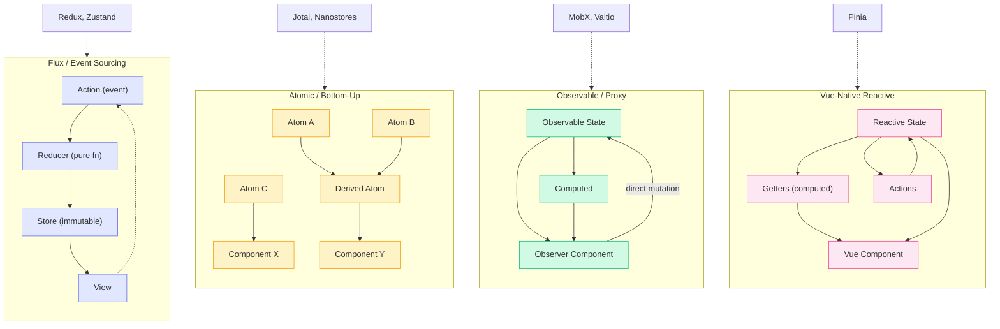

# [FEE-607] 狀態管理函式庫

:::info
狀態管理函式庫是帶有主張的工具。每一個都嵌入了關於狀態應該如何被結構化、更新和觀察的哲學。Redux 將狀態變更視為記錄的事件。MobX 將狀態視為活的試算表。Jotai 由下而上建構狀態，一次一個 atom。選擇一個函式庫，是在賭你的團隊能在多年維護中持續哪種心智模型。理解每個函式庫背後的哲學，比記住它的 API 更重要。
:::

## 背景

自 2014 年 Flux 引入單向資料流模式以來，JavaScript 生態系已經產生了數十個狀態管理函式庫。每個函式庫都是對其前身限制的回應，每個都承載著關於應用程式狀態應該如何運作的獨特哲學。

這個生態並非隨機的。它遵循一個鐘擺模式：

1. **2014 年：Flux；2015 年：Redux。** Facebook 的 Flux 架構引入了狀態變更應該單向流動的概念：action、dispatcher、store、view。Redux 在 2015 年將此精煉為三個原則（單一真實來源、唯讀狀態、純函式 reducer），並成為 React 應用程式的預設選擇。哲學：狀態變更是被記錄的事件，就像一個只能追加的日誌。

2. **2015 年：MobX 的反彈。** MobX（最初以 Mobservable 之名發布，同樣在 2015 年）採取了相反的方式：可變狀態搭配自動依賴追蹤。直接賦值即可，例如 `user.name = "Ann"`，MobX 會自行找出需要更新什麼，不需要撰寫 dispatch 步驟。MobX 與 Redux 並肩發展；覺得 Redux 樣板繁重的開發者，從一開始就選擇了 MobX。哲學：狀態是一個活的試算表。

3. **2019 年：Hooks 減少了需求。** React Hooks（`useState`、`useReducer`、`useContext`）消除了許多先前需要 Redux 的使用場景。Redux 的共同創造者 Dan Abramov 早在 2016 年就寫了「You Might Not Need Redux」。Hooks 讓這個建議對大多數應用程式變得實際可行。

4. **2020 年：原子化 store。** Recoil（Meta；其儲存庫已於 2025 年 1 月封存）和 Jotai 引入了原子化狀態（atomic state）：微小的獨立狀態單元，組合成更大的結構。這種由下而上的方式提供了細粒度的重新渲染，沒有集中式 store 的開銷。哲學：狀態作為可組合的基本元素。

5. **2023 年：Server Components 縮減客戶端狀態。** React Server Components、Next.js App Router 和類似的框架將資料擷取移到伺服器端，減少了需要存在於客戶端的狀態量。剩餘的客戶端狀態通常簡單到用 local state 或輕量級函式庫就夠了。

6. **2024 年起：Signals 匯流。** Solid、Vue、Preact 和 Angular 各自提供了 signal 風格的細粒度響應式原語，TC39 Signals 提案（自 2024 年 4 月起處於 Stage 1）則試圖標準化跨框架共用的核心機制。API 比較與底層追蹤演算法請見 [FEE-611](/zh-tw/State%20Management/framework-signals)；本文聚焦於它之上的 store 層級函式庫。

每一波浪潮並沒有消滅前一波。Redux 仍被廣泛使用（Redux Toolkit 現代化了它的 API）。MobX 仍然驅動著大型應用程式。這些函式庫共存，因為它們服務於不同的需求、團隊規模和除錯需求。npm 註冊表顯示了這種共存的當前樣貌：截至 2026 年 7 月，Zustand 每月下載量約為 1.76 億次，相較之下 `@reduxjs/toolkit` 約為 9,800 萬次，這是新專案傾向的一個訊號。下載量衡量的是採用程度，而非品質。

本文檢視七個函式庫的設計哲學：Redux、Zustand、Pinia、Jotai、MobX、Nanostores 和 Valtio。目標是幫助你辨認出哪種心智模型適合你的情境。

## 視覺對比

### 狀態管理範式比較



四種範式的狀態流動方式不同。Flux 透過 action 和 reducer 強制嚴格循環。原子化 store 組合小型獨立的片段。Observable/proxy 系統允許直接 mutation 搭配自動追蹤。Vue 原生 store 與框架內建的響應式系統整合。

## 範例

購物車範例才能顯示這些範式真正分歧之處：一個 `items` 陣列、一個由它衍生的 `total`，以及一次非同步的價格更新。counter 做不到這件事，因為 counter 沒有衍生值，也沒有任何需要等待的非同步操作。以下用 Redux Toolkit、Jotai 和 Valtio 實作同一個購物車，分別對應 Flux、原子化和 proxy 三種範式；Pinia 的 setup-store 範例（不含衍生 total 或非同步更新）出現在常見錯誤 #3。

### 1. Redux Toolkit（Flux / Event Sourcing）

```ts
// store/cartSlice.ts
import { createSlice, createAsyncThunk, createSelector, type PayloadAction } from '@reduxjs/toolkit';

interface CartItem {
  id: string;
  name: string;
  price: number;
  qty: number;
}

interface CartState {
  items: CartItem[];
  priceUpdateStatus: 'idle' | 'loading' | 'failed';
}

const initialState: CartState = { items: [], priceUpdateStatus: 'idle' };

export const refreshPrice = createAsyncThunk(
  'cart/refreshPrice',
  async (itemId: string) => {
    const response = await fetch(`/api/prices/${itemId}`);
    const { price } = await response.json();
    return { itemId, price };
  }
);

const cartSlice = createSlice({
  name: 'cart',
  initialState,
  reducers: {
    addItem(state, action: PayloadAction<CartItem>) {
      state.items.push(action.payload);
    },
  },
  extraReducers: (builder) => {
    builder
      .addCase(refreshPrice.pending, (state) => {
        state.priceUpdateStatus = 'loading';
      })
      .addCase(refreshPrice.fulfilled, (state, action) => {
        const item = state.items.find((i) => i.id === action.payload.itemId);
        if (item) item.price = action.payload.price;
        state.priceUpdateStatus = 'idle';
      });
  },
});

export const { addItem } = cartSlice.actions;
export default cartSlice.reducer;

// 衍生狀態存在於 slice 之外，並經過 memoize，
// 只在 `items` 變更時才重新計算。
export const selectCartTotal = createSelector(
  (state: { cart: CartState }) => state.cart.items,
  (items) => items.reduce((sum, item) => sum + item.price * item.qty, 0)
);
```

```tsx
// Cart.tsx
import { useSelector, useDispatch } from 'react-redux';
import { refreshPrice, selectCartTotal } from './store/cartSlice';

function Cart() {
  const items = useSelector((state) => state.cart.items);
  const total = useSelector(selectCartTotal);
  const dispatch = useDispatch();

  return (
    <div>
      {items.map((item) => (
        <div key={item.id}>
          {item.name}: ${item.price} x {item.qty}
          <button onClick={() => dispatch(refreshPrice(item.id))}>Refresh price</button>
        </div>
      ))}
      <strong>Total: ${total}</strong>
    </div>
  );
}
```

衍生狀態是用 `createSelector` 建立的 memoized selector。非同步狀態是一個具有三個生命週期 action（`pending`、`fulfilled`、`rejected`）的 thunk；這裡的 reducer 明確處理了 `pending` 和 `fulfilled`。

### 2. Jotai（原子化 / 由下而上）

```ts
// store/cartAtoms.ts
import { atom } from 'jotai';

interface CartItem {
  id: string;
  name: string;
  price: number;
  qty: number;
}

export const itemsAtom = atom<CartItem[]>([]);

// 衍生 atom：itemsAtom 變更時自動重新計算。
export const totalAtom = atom((get) =>
  get(itemsAtom).reduce((sum, item) => sum + item.price * item.qty, 0)
);

// 非同步 atom：一個只寫的 atom，其函式主體會 await 一次 fetch，
// 然後更新 itemsAtom。
export const refreshPriceAtom = atom(null, async (get, set, itemId: string) => {
  const response = await fetch(`/api/prices/${itemId}`);
  const { price } = await response.json();
  set(
    itemsAtom,
    get(itemsAtom).map((item) => (item.id === itemId ? { ...item, price } : item))
  );
});
```

```tsx
// Cart.tsx
import { useAtomValue, useSetAtom } from 'jotai';
import { itemsAtom, totalAtom, refreshPriceAtom } from './store/cartAtoms';

function Cart() {
  const items = useAtomValue(itemsAtom);
  const total = useAtomValue(totalAtom);
  const refreshPrice = useSetAtom(refreshPriceAtom);

  return (
    <div>
      {items.map((item) => (
        <div key={item.id}>
          {item.name}: ${item.price} x {item.qty}
          <button onClick={() => refreshPrice(item.id)}>Refresh price</button>
        </div>
      ))}
      <strong>Total: ${total}</strong>
    </div>
  );
}
```

衍生狀態是直接依賴 `itemsAtom` 的讀取 atom，不需要設定任何 selector。非同步狀態是一個 setter 函式恰好是 `async` 的寫入 atom；這裡沒有另一套獨立的 pending/fulfilled/rejected 詞彙。只讀取 `totalAtom` 的元件，在 `refreshPriceAtom` 執行中不會重新渲染。

### 3. Valtio（Observable / Proxy）

```ts
// store/cartStore.ts
import { proxy } from 'valtio';

interface CartItem {
  id: string;
  name: string;
  price: number;
  qty: number;
}

class CartStore {
  items: CartItem[] = [];
  // 一個普通的 getter 就是 Valtio 的衍生狀態機制：它在每次讀取時
  // 針對目前的 proxy 狀態重新求值，不需要另外接線。
  get total() {
    return this.items.reduce((sum, item) => sum + item.price * item.qty, 0);
  }
}

export const cartState = proxy(new CartStore());

// 非同步狀態：一個直接修改 proxy 的普通 async 函式。
export async function refreshPrice(itemId: string) {
  const response = await fetch(`/api/prices/${itemId}`);
  const { price } = await response.json();
  const item = cartState.items.find((i) => i.id === itemId);
  if (item) item.price = price;
}
```

```tsx
// Cart.tsx
import { useSnapshot } from 'valtio';
import { cartState, refreshPrice } from './store/cartStore';

function Cart() {
  const snap = useSnapshot(cartState);

  return (
    <div>
      {snap.items.map((item) => (
        <div key={item.id}>
          {item.name}: ${item.price} x {item.qty}
          <button onClick={() => refreshPrice(item.id)}>Refresh price</button>
        </div>
      ))}
      <strong>Total: ${snap.total}</strong>
    </div>
  );
}
```

衍生狀態與非同步狀態用的是同一套機制：修改 proxy，每個讀取過該屬性的訂閱者就會重新渲染。這裡沒有 reducer，沒有 selector，也沒有另一套詞彙用來標記「這次更新恰好是非同步的」。`refreshPrice` 讀起來就像一個普通的 async 函式，因為它本來就是。

## 最佳實踐

**根據實際複雜度選擇函式庫；不要為簡單情況添加 Redux。** SHOULD 在添加函式庫之前評估你的應用程式是否真的有該函式庫解決的問題。當你需要為大型多人開發的程式碼庫提供完整的審計軌跡、middleware 管道和時間旅行除錯時，Redux 的開銷才是值得的。對於本地狀態和 `useContext` 就足夠的小型應用，Redux 增加了間接層卻沒有帶來好處。正如函式庫的共同創建者所寫：「在你遇到 vanilla React 的問題之前，不要使用 Redux。」

**將狀態與擁有它的功能共置（colocate）。** SHOULD 按功能領域而非資料類型組織 store 狀態。屬於產品列表功能的狀態不應該散布在被不相關模組存取的全域 store slice 中。當一個功能被刪除時，它的狀態也應該是可刪除的。共置的狀態減少了變更的影響範圍，並使功能與其資料之間的關係明確。

**避免將伺服器狀態放入全域 store。** MUST NOT 在同一個 store 中混合伺服器擷取的資料（使用者列表、產品目錄、API 回應）與客戶端擁有的狀態（主題、側邊欄開關、表單草稿）。伺服器狀態有獨特的關注點：過時性、背景重新擷取、請求去重、快取失效。客戶端 store 沒有配備自動處理這些的能力。對伺服器狀態使用 TanStack Query 或 SWR，將客戶端 store 保留給客戶端真正擁有的資料。

**使用 selector memoization 防止過多的重新渲染。** 當元件訂閱 store 時，SHOULD 傳入一個只回傳元件所需最小切片的 selector。Zustand selector 預設使用參考相等性；Redux Toolkit 透過 `createSelector`（Reselect）的 selector 會 memoize 衍生值。訂閱完整 store 物件的元件在每次 store 變更時都重新渲染。讀取單一衍生值的元件只在該值改變時重新渲染。

## 設計思維

### Redux：狀態變更作為記錄的事件

Redux 建立在三個借鑑自 Flux 和 event sourcing 的原則之上：

1. **單一真實來源（Single source of truth）。** 整個應用程式狀態存在於一個 store 中，一個單一的 JavaScript 物件樹。這使序列化、除錯和伺服器端渲染變得直接。
2. **狀態是唯讀的（State is read-only）。** 變更狀態的唯一方式是 dispatch 一個 action：一個描述發生了什麼的純物件。View 和網路回呼永遠不會直接寫入狀態。
3. **變更透過純函式進行（Changes are made with pure functions）。** Reducer 接收先前的狀態和一個 action，回傳新的狀態物件。沒有 mutation，沒有副作用。

這個架構使狀態變更**可預測且可追蹤**。每個變更都是一個可以被記錄、序列化、重播和在 DevTools 中檢視的 action 物件。時間旅行除錯（在狀態歷史中前後步進）是這個設計的自然結果。

代價是冗長。原始 Redux 中的一個功能需要 action type 常數、action creator 函式和 reducer case。Redux Toolkit（RTK）的創建就是為了消除這些樣板，同時保留其哲學。RTK 的 `createSlice` 從單一宣告生成 action creator 和 reducer。Immer 在底層運行，允許「可變」語法產生不可變的更新。

Redux 在以下情況最強：你需要完整的狀態變更審計軌跡、middleware 管道（日誌、分析、樂觀更新）、時間旅行除錯，或者大型團隊受益於強制結構。

### Zustand：去掉繁文縟節的 Redux

Zustand 將 Flux 精簡到本質。它保留了集中式 store 搭配不可變更新的概念，但移除了樣板：

- **不需要 Provider。** Store 是模組級的 singleton，透過 hook 存取。沒有 React context，沒有包裝元件。
- **沒有 action type 或 dispatcher。** 狀態更新是定義在 store 內的普通函式。
- **可在 React 外部運作。** Store 可以從 vanilla JavaScript、事件處理器或 WebSocket 回呼中讀取和更新。
- **最小 API 介面。** 核心 API 是 `create`（定義 store）和回傳的 hook（消費它）。Selector 防止不必要的重新渲染。

Zustand 的哲學是 Flux 模式是合理的，但圍繞它的繁文縟節不是。狀態仍然應該以不可變方式更新，但開發者不應該需要定義 action type、連接 dispatcher 或用 Provider 包裝應用程式。Zustand 自己的函式庫比較文件將這個分野框定為「狀態存在哪裡、如何變更」：Zustand 在元件樹之外維持單一、不可變的 store，Valtio 的 proxy 是可變的，而 Jotai 則將狀態分散到可組合的 atom 中，而非單一 store。結果是一個感覺像「給覺得 Redux 太重的人用的 Redux」的函式庫。

Middleware 支援（persist、devtools、immer）可用但是選擇性的。你只在需要時添加複雜性。

### Pinia：善用框架

Pinia 是 Vue 的官方狀態管理函式庫，取代了 Vuex。它的哲學很直接：**如果你在使用 Vue，你的狀態管理應該感覺像 Vue。**

關鍵設計決策：

- **沒有 mutation。** Vuex 需要明確的 mutation 函式來變更狀態。Pinia 完全消除了這一層。Action 可以是同步或非同步的，狀態可以直接修改。
- **兩種 store 風格。** Options API store（state、getters、actions 作為物件）對 Vuex 使用者來說很熟悉。Composition API store（在 setup 函式中使用 `ref`、`computed` 和普通函式）直接利用 Vue 的響應式原語。
- **Vue DevTools 整合。** Pinia 透過 Vue DevTools 面板提供 action 時間線、視覺化 store 關係和時間旅行除錯。
- **HMR 支援。** Store 可以在開發時熱更新而不遺失狀態。
- **SSR 安全。** Pinia 處理每次請求的狀態隔離，防止伺服器渲染應用程式中的跨請求污染。
- **扁平架構。** 沒有巢狀模組。Store 是獨立的，可以互相匯入，甚至可以循環引用。

Pinia 的哲學是狀態管理不應該與框架對抗。Vue 的響應式系統已經追蹤依賴、觸發更新並提供 computed 屬性。Pinia 用一層薄薄的包裝加上 DevTools、SSR 安全和組織結構，僅此而已。

### Jotai：由下而上的組合

Jotai 採取與 Redux 相反的方式。不是單一的自上而下的 store，而是使用 **atom** 由下而上建構狀態，微小的、獨立的狀態單元。

核心概念：

- **Atom 是基本元素。** 一個 atom 持有一個單一值：一個數字、一個字串、一個物件。它是最小可能的狀態單元。
- **衍生 atom（Derived atoms）。** 一個 atom 可以定義為其他 atom 的函式。當來源 atom 變更時，衍生 atom 自動重新計算。這類似於 computed 屬性，但在 store 層級。
- **不需要 Provider**（選擇性）。Jotai 可以搭配或不搭配 Provider 使用。沒有的話，atom 使用預設的全域 store。有的話，你可以將 atom 限定在子樹中（對測試或多實例很有用）。
- **細粒度重新渲染。** 讀取 atom A 的元件在 atom B 變更時不會重新渲染。React 只重新渲染訂閱了特定變更 atom 的元件。

Jotai 的哲學受 Recoil 啟發，而 Recoil 的儲存庫已於 2025 年 1 月被 Meta 封存；Jotai 是它在 React 生態系中持續維護的後繼者。狀態的組合方式就像函式一樣：小的 atom 透過衍生組合成更大的結構，而不是透過一個龐大的 store 物件。這使 Jotai 對於有許多獨立狀態片段偶爾需要互動的應用程式特別有效。

最小核心 API（`atom`、`useAtom`）大約 2KB。擴充如 `atomWithStorage`、`atomWithQuery` 和 `atomWithMachine` 在不膨脹核心的情況下增加持久化、資料擷取和狀態機能力。

### MobX：試算表模型

MobX 的哲學用其文件中的一句話概括：**「任何可以從應用程式狀態衍生的東西，都應該被自動衍生。」**

MobX 使用**透明函式響應式程式設計（TFRP，Transparent Functional Reactive Programming）**：

- **狀態是可變的。** 你定義 observable 物件，用普通的 JavaScript 賦值修改它們，例如 `store.count++`。不需要撰寫 reducer，也沒有 dispatch 步驟。
- **自動依賴追蹤。** MobX 記錄每個元件在渲染期間讀取了哪些 observable 屬性。當那些特定屬性變更時，只有那些特定元件重新渲染，不需要手動撰寫 selector 函式。
- **Computed 值。** 就像引用其他儲存格的試算表儲存格，computed 值從 observable 衍生，只在其依賴變更時重新計算。
- **Reaction。** 副作用（日誌、網路請求、localStorage 寫入）在其觀察的依賴變更時自動執行。

心智模型是試算表：儲存格（observable）持有原始資料，公式（computed 值）從儲存格衍生，當你改變一個儲存格時，所有依賴的公式自動重新計算。

MobX 對相同功能需要的程式碼比 Redux 少，其可變 API 對來自物件導向背景的開發者來說感覺很自然。代價是較少的可見性：沒有明確的 action 日誌，追蹤「是什麼在何時改變了這個值？」可能更困難。MobX 確實支援 action（透過 `action` 和 `flow` 裝飾器）在需要時提供結構。

### Nanostores：最小化且可攜

Nanostores 把「小」本身當成第一設計目標：

- **框架無關。** 相同的 store 可搭配 React、Vue、Svelte、Solid、Lit、Angular 和 vanilla JavaScript 使用。你匯入一個框架特定的綁定（例如 `@nanostores/react`），重量幾乎為零。
- **極小佔用空間。** 根據專案目前的 README，核心函式庫壓縮後（minified）加 brotli 壓縮的大小介於 340 到 864 bytes 之間。這個位元組預算是一項設計約束：每一項 API 新增都要對照它衡量。
- **原子化 store。** 如同 Jotai，狀態被組織為小型獨立 store。不同於 Jotai，store 是框架無關的物件，具有 `.get()` 和 `.set()` 方法，而不是 React 特定的 atom。
- **延遲生命週期（Lazy lifecycle）。** Store 可以定義 `onMount` 回呼，只在元件訂閱時才執行。當最後一個訂閱者斷開時，清理自動執行。這對 WebSocket 連線、計時器或其他只應在使用中存在的資源很有用。

Nanostores 的哲學：狀態管理應該是一個薄的、可攜帶的層，不會將你鎖定在一個框架中。如果你從 React 切換到 Svelte，或者需要在 React 應用和 vanilla JS widget 之間共享狀態邏輯，你的 store 應該不需修改就能運作。代價是功能較少：沒有內建的 DevTools 面板，除錯得靠純粹的 console log 或手動埋點。你得到一個最小的基本元素，在上面建構你需要的東西。

### Valtio：自然地寫 JavaScript

Valtio 使用 JavaScript Proxy 橋接可變與不可變的世界：

- **可變寫入。** 你建立一個 proxy 物件並直接修改它，例如 `state.count++` 或 `state.todos.push(item)`，和操作一個普通物件時用的語法完全一樣。
- **不可變讀取。** `useSnapshot()` hook 回傳 proxy 的不可變快照。React 使用此快照進行渲染，並能高效偵測哪些屬性變更了。
- **模組範圍的狀態。** 如同 Zustand，store 存在於 React 外部。你可以從任何地方更新它：事件處理器、WebSocket 回呼、計時器、其他模組。

Valtio 的哲學是 React 的不可變性要求應該是函式庫的問題，而不是開發者的問題。你以最自然的 JavaScript 方式寫狀態更新，proxy 層在幕後將 mutation 轉換為不可變快照。結果是一個感覺像純 JavaScript 但與 React 渲染模型整合良好的 API。

### 決策矩陣

選擇函式庫取決於情境。以下是重要的維度：

| 維度 | Redux/RTK | Zustand | Pinia | Jotai | MobX | Nanostores | Valtio |
|---|---|---|---|---|---|---|---|
| **範式** | Flux / event sourcing | 簡化版 flux | Vue 原生響應式 | 原子化 / 由下而上 | Observable / proxy | 原子化 / 可攜 | Proxy / 可變 |
| **框架** | React（主要） | React（主要） | Vue（專屬） | React（主要） | 任何（React、Vue 等） | 任何 | React（主要） |
| **Bundle 大小**（min+gzip，bundlephobia，2026-07） | ~17.4KB（RTK 2.12 + react-redux 9.3） | ~0.5KB（v5.0） | ~6.6KB（v4.0） | ~4KB（v2.20，完整套件） | ~18.4KB（v6.16） | 340-864 bytes（核心，min+brotli，依 README） | ~2.6KB（v2.3） |
| **樣板程式碼** | 中等（RTK）/ 高（原始） | 低 | 低 | 低 | 低 | 低 | 低 |
| **DevTools** | 優秀（時間旅行） | 良好（相容 Redux DevTools） | 優秀（Vue DevTools） | 基本 | 良好（瀏覽器擴充套件搭配 `trace`/`spy` 工具） | 無內建 | 基本 |
| **需學習的新概念** | action、reducer、dispatch、middleware、selector（5 項） | store hook、selector（2 項） | store、state、getters、actions（4 項） | atom、衍生 atom、write atom（3 項） | observable、computed、reaction/action（3 項） | store、`.get()`/`.set()`、`onMount`（3 項） | proxy、`useSnapshot`（2 項） |
| **最適合** | 大型團隊、審計軌跡 | 中小型 React 應用 | Vue 應用程式 | 細粒度 React 狀態 | 複雜衍生狀態 | 多框架、micro-frontend | 偏好 mutation 的開發者 |

## 常見錯誤

### 1. 使用原始 Redux 而非 Redux Toolkit

```ts
// 過時 -- 手動 action type、action creator、switch 語句
const INCREMENT = 'counter/increment';

function increment() {
  return { type: INCREMENT };
}

function counterReducer(state = { count: 0 }, action) {
  switch (action.type) {
    case INCREMENT:
      return { ...state, count: state.count + 1 };
    default:
      return state;
  }
}

// 現代 -- Redux Toolkit 處理以上所有
const counterSlice = createSlice({
  name: 'counter',
  initialState: { count: 0 },
  reducers: {
    increment(state) {
      state.count += 1;
    },
  },
});
```

Redux Toolkit 是官方推薦的 Redux 寫法。它消除了讓 Redux 名聲不好的樣板程式碼。如果你在 reducer 中寫 switch 語句，你寫的是舊版 Redux。

### 2. 混用多個狀態函式庫而沒有明確邊界

```tsx
// 混亂 -- Redux 管認證、Zustand 管 UI、Jotai 管表單、MobX 管 dashboard
// 每個開發者必須知道四套 API、四種心智模型、四套 DevTools

// 有紀律 -- 一個主要函式庫，例外要有明確理由
// 「我們所有客戶端狀態使用 Zustand。
//  我們使用 TanStack Query 管理伺服器狀態。
//  沒有文件記錄的理由不允許例外。」
```

每個函式庫引入一個心智模型。在同一個應用程式中混用多個模型會倍增認知負荷，使新人上手變困難。為客戶端狀態選一個函式庫，為伺服器狀態選一個。只有在有文件記錄的理由時才加入第二個客戶端狀態函式庫。

### 3. 沒有先使用框架原生方案

```ts
// 錯誤（Vue 應用）-- 為 Vue 安裝 Zustand 或 Redux
// 這些函式庫以 React 為主，不會利用 Vue 的響應式系統

// 正確（Vue 應用）-- 使用 Pinia，Vue 的官方狀態管理
import { ref } from 'vue';
import { defineStore } from 'pinia';

export const useCounterStore = defineStore('counter', () => {
  const count = ref(0);
  function increment() { count.value++; }
  return { count, increment };
});
```

Vue 用 Pinia，Angular 用 signals，Svelte 用 Svelte stores。框架原生方案與框架的響應式系統、DevTools 和 SSR 管道整合。跨框架函式庫（Zustand、Redux）對 React 來說很優秀，但強制用在其他生態系時會失去優勢。

### 4. 基於潮流而非實際需求選擇

```
// 潮流驅動
「Jotai 在 Twitter 上很火，我們從 Redux 遷移過去吧。」

// 需求驅動
「我們的應用有 200+ 個 Redux action，時間旅行除錯對 QA 至關重要。
 遷移到 Jotai 會失去 action 歷史且需要重寫所有測試。
 目前的 Redux Toolkit 設定運作良好。我們留下來。」
```

新函式庫解決真實問題，但也引入遷移成本、重新訓練和新的邊界情況。根據你的實際痛點評估：你目前的方案太冗長嗎？太慢嗎？太難測試嗎？如果答案是「它運作得很好，但我看到了一個很酷的 demo」，遷移成本就不合理。

## 延伸閱讀

- [FEE-600 狀態管理總覽](/zh-tw/State%20Management/600) — 分類狀態類別、辨別每種狀態何時重要的分類法
- [FEE-601 本地元件狀態](/zh-tw/State%20Management/601) — 完全消除函式庫需求的最簡單替代方案
- [FEE-603 Context 與 Prop Drilling](/zh-tw/State%20Management/603) — 為什麼 context 不是狀態管理器，以及何時真正需要函式庫
- [FEE-604 伺服器狀態與資料同步](/zh-tw/State%20Management/604) — TanStack Query、SWR，以及伺服器狀態與客戶端狀態的分離
- [FEE-611 框架 Signals](/zh-tw/State%20Management/framework-signals) — 2024 年起 Solid、Vue、Preact、Angular 的 signals 匯流，以及標準化共用原語的 TC39 提案

## 參考資料

- Dan Abramov and Andrew Clark, "Redux: Motivation," Redux documentation (2015). https://redux.js.org/understanding/thinking-in-redux/motivation
- Dan Abramov and Andrew Clark, "Redux: Three Principles," Redux documentation (2015). https://redux.js.org/understanding/thinking-in-redux/three-principles
- Redux Toolkit team, "Redux Toolkit: Quick Start," Redux Toolkit documentation (2026). https://redux-toolkit.js.org/tutorials/quick-start
- Poimandres (pmndrs), "Zustand," GitHub (2026). https://github.com/pmndrs/zustand
- Poimandres (pmndrs), "Comparison," Zustand documentation (2026). https://zustand.docs.pmnd.rs/learn/getting-started/comparison
- Eduardo San Martin Morote, "Pinia: Introduction," Pinia documentation (2026). https://pinia.vuejs.org/introduction.html
- Daishi Kato, "Jotai: Introduction," Jotai documentation (2026). https://jotai.org/docs/introduction
- Michel Weststrate, "MobX: README," MobX documentation (2026). https://mobx.js.org/README.html
- Andrey Sitnik, "Nanostores," GitHub (2026). https://github.com/nanostores/nanostores
- Daishi Kato, "Valtio: Getting Started," Valtio documentation (2026). https://valtio.dev/docs/introduction/getting-started
- Dan Abramov, "You Might Not Need Redux," Medium (2016). https://medium.com/@dan_abramov/you-might-not-need-redux-be46360cf367
- Mark Erikson, "Why React Context is Not a 'State Management' Tool," blog.isquaredsoftware.com (2021). https://blog.isquaredsoftware.com/2021/01/context-redux-differences/
- Meta Platforms (facebookexperimental), "Recoil," GitHub, archived January 1, 2025. https://github.com/facebookexperimental/Recoil
- TC39, "Proposal: Signals," GitHub, Stage 1 since April 2024. https://github.com/tc39/proposal-signals
- npm, Inc., "Download counts for zustand," npm Registry API, accessed July 2026. https://api.npmjs.org/downloads/point/last-month/zustand
- npm, Inc., "Download counts for @reduxjs/toolkit," npm Registry API, accessed July 2026. https://api.npmjs.org/downloads/point/last-month/@reduxjs/toolkit
