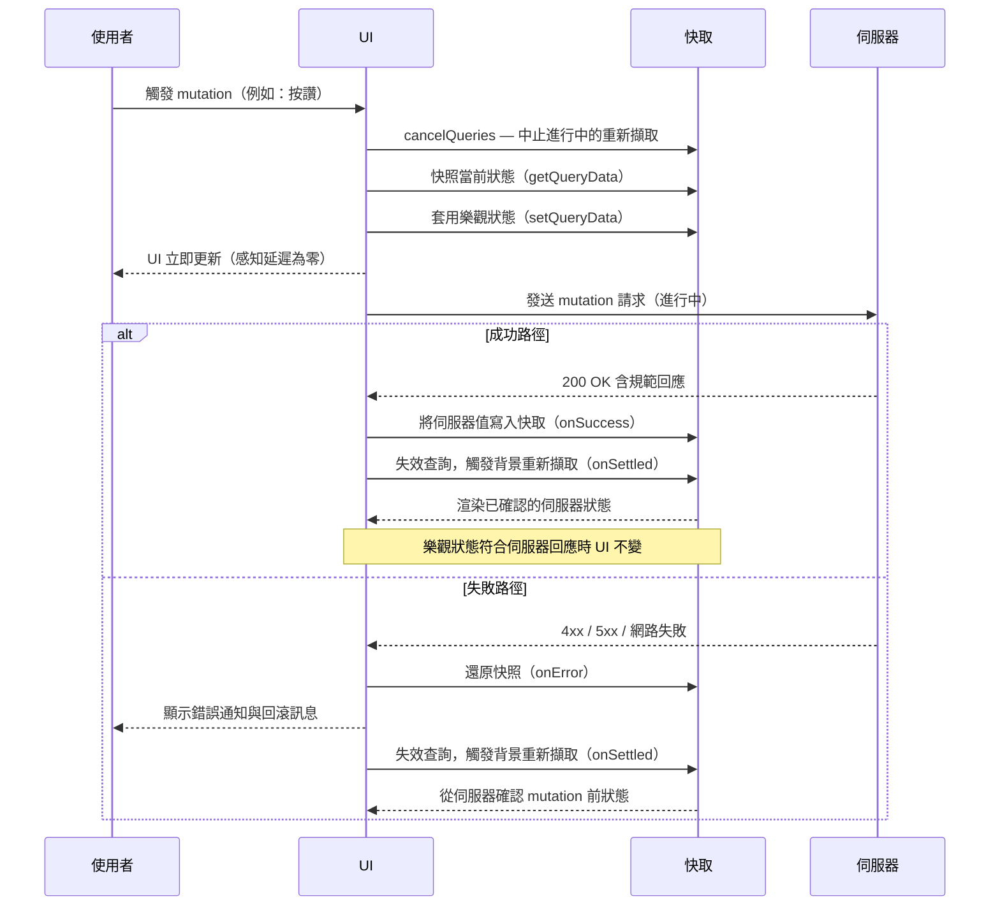

# 樂觀更新

樂觀更新（Optimistic Update）是指在伺服器確認變更之前，立即將修改套用到本地端狀態。UI 會直接
反映 mutation 的預期結果 — 按讚數增加、項目從列表中移除、留言出現 — 同時網路請求仍在傳送中。
如果伺服器確認了 mutation，樂觀狀態就成為正式的規範狀態。如果請求失敗，本地狀態則回滾至 mutation
前的值，並通知使用者發生了錯誤。「樂觀」這個詞是刻意選用的：客戶端賭定 mutation 會成功，並立即
根據這個假設採取行動，同時接受可能出錯的可能性。

這個取捨是明確的：樂觀更新讓 UI 感覺更快、更具響應性，尤其在高延遲連線下，但它引入了本地與
伺服器狀態之間暫時不一致的可能性。回滾路徑 — 也就是當伺服器拒絕 mutation 時該如何處理 — 必須
被設計好、透過適當方式告知使用者（toast 通知、內聯錯誤訊息），並且像測試成功路徑一樣徹底地加以
測試。回滾不是邊界情況；它是使用者在正式環境中會遭遇到的一流互動，而它的表現決定了這個功能讓人
感覺是可信賴的，還是壞掉的。

TanStack Query、SWR 和 Apollo Client 各自提供一流的樂觀更新 API。它們的模式都遵循相同的三階段
結構：（1）在 mutation 執行前套用樂觀狀態，（2）對伺服器執行 mutation，（3）成功時 — 伺服器
可能回傳規範值以取代樂觀狀態；失敗時 — 回滾樂觀狀態並顯示使用者可見的錯誤。理解這個三階段循環
的機制，是正確實作樂觀更新並避免任何階段被跳過或實作不完整時所產生之微妙 bug 的基礎。

## 設計思維

### 樂觀狀態與載入中狀態的選擇

載入中狀態模型與樂觀狀態模型代表處理使用者意圖與伺服器確認之間延遲差距的兩種截然不同的哲學。

**載入中狀態模型：**

- UI 停用輸入並顯示 spinner 或骨架畫面。
- 在伺服器回應之前，UI 不反映任何變更。
- 使用者看到的每個像素都代表已確認的伺服器狀態。
- 代價：延遲。每次 mutation 都插入了強制等待。在 300ms 連線下，按讚、封存和重新排序各自
  讓使用者等待 300ms。當使用者快速連續執行這些動作時，等待累積，介面感覺遲鈍。

**樂觀狀態模型：**

- UI 在使用者動作後立即套用預期的變更。
- 不等待伺服器，繼續接受互動。
- 網路請求被視為背景操作。
- 代價：複雜度。應用程式必須取消競爭查詢、為回滾快照先前狀態，並以可見回饋處理成功與失敗兩條路徑。

在這兩種模型之間選擇的實務啟發法，是將失敗機率與後果嚴重性結合考量：

| Mutation 類型 | 失敗率 | 回滾代價 | 建議模型 |
|---|---|---|---|
| 按讚、反應、收藏 | 極低 | 微小（減少計數、toast） | 樂觀更新 |
| 封存、重排、標記 | 低 | 簡單（還原位置/狀態） | 樂觀更新 |
| 設定更新 | 低 | 簡單（還原先前值） | 樂觀更新 |
| 檔案上傳 | 中 | 中等（從列表移除） | 載入中狀態 |
| 付款、結帳 | 不定 | 高（信任受損） | 載入中狀態 |
| 權限變更 | 低 | 高（安全性影響） | 載入中狀態 |

有疑慮時，對觸及財務資料、不可逆資源或庫存的 mutation 預設使用載入中狀態。對社群反應、偏好切換
和列表重新排序，在失敗率可忽略且回滾無痛的情況下使用樂觀更新。

### TanStack Query 的 onMutate / onError / onSettled

TanStack Query 提供三個生命週期 callback，精確對應到樂觀更新的三個階段。

**第一階段 — onMutate（請求前）：**

`onMutate` callback 在 mutation 函式執行前觸發。在 `onMutate` 中，三個操作必須依序執行：

1. 為受影響的查詢鍵呼叫 `await queryClient.cancelQueries`。這會中止任何進行中的背景重新
   擷取，避免它們在樂觀寫入之後才解析，並以過期的伺服器資料覆蓋它，產生使用者未發起的混亂
   回退。
2. 呼叫 `queryClient.getQueryData` 讀取當前快取值並將其儲存為快照。此快照是 mutation
   失敗時的回滾目標。
3. 呼叫 `queryClient.setQueryData` 將樂觀值寫入快取。這是使用者立即看到的內容。

將快照從 `onMutate` 作為 context 物件回傳 — TanStack Query 會將它作為 `context` 參數傳遞
給後續的 callback。

**第二階段 — onError（失敗時）：**

`onError` callback 在 mutation 函式拋出或回傳被拒絕的 promise 時觸發。它接收錯誤、原始
mutation 變數，以及 `onMutate` 回傳的 `context`。回滾是兩個操作：使用
`queryClient.setQueryData(key, context.previous)` 還原快照，並呼叫通知函式顯示錯誤。
由於快照早於樂觀寫入，還原它永遠能產生一致的已知良好狀態。

**第三階段 — onSettled（解析後，永遠執行）：**

`onSettled` callback 在 mutation 解析後觸發，無論成功或失敗皆然。在這裡呼叫
`queryClient.invalidateQueries`，將受影響的查詢標記為過期並觸發背景重新擷取。即使成功，
重新擷取也不是多餘的：伺服器的回應可能與樂觀假設有細微差異 — 伺服器指派的時間戳記、計算的
聚合值、資料庫觸發器修改的值。每次 mutation 後失效確保快取收斂到伺服器的規範狀態。在所有結果
中都執行 `onSettled`，將一致性保證整合到一個地方，而不是在 `onSuccess` 和 `onError` 中
分別需要平行的失效邏輯。

### 衝突解決

在多個客戶端可以同時 mutate 同一資源的協作應用程式中，樂觀更新會引入需要刻意處理的衝突情境。

設想兩位使用者查看同一份文件：使用者 A 在本地套用樂觀更新並發送 mutation 請求。同時，使用者
B 也這樣做了。伺服器依序收到兩個請求；根據 mutation 類型，第二次寫入可能部分覆蓋第一次 —
最後寫入勝出語意、CRDT 合併，或 409 衝突拒絕。每個客戶端接著收到伺服器對自己 mutation 的
規範回應，而那些回應可能與各自在本地套用的樂觀狀態有所差異。

正確的解決策略：

- 在成功時永遠以伺服器的權威性回應取代樂觀狀態。
- 當伺服器回傳不同的值時，切勿保留或合併樂觀假設。
- 在 `onSuccess` 中，在 `onSettled` 觸發完整失效之前，使用 `queryClient.setQueryData`
  立即將伺服器回傳的資料寫入快取。這種兩步驟流程將 UI 顯示過期資料的時間窗口最小化，同時
  確保最終收斂。

對於有次秒延遲需求的即時協作，將樂觀更新與 WebSocket 或 Server-Sent Events 頻道搭配使用。
樂觀更新處理當前使用者自身動作的延遲；即時頻道在其他使用者的確認變更發生時傳遞給客戶端，分別
處理並發收斂。這兩種機制解決的是不同維度的問題，組合使用時不會相互干擾。

正確設計衝突解決的另一個面向是避免在 `onMutate` 中過度假設伺服器的最終狀態。樂觀寫入應該只
反映使用者意圖的直接結果，而不是對伺服器可能進一步處理的預判。例如，樂觀地增加按讚計數是合理
的，但樂觀地計算伺服器可能基於其他欄位派生出的欄位，則是過度假設，容易在 `onSettled` 重新擷取
後產生令人困惑的 UI 跳動。保持樂觀寫入的最小範圍，是降低衝突複雜度的有效策略。

### 新項目的暫時 ID

樂觀地將新項目新增到列表，會製造一個更新 mutation 所沒有的結構性問題：新項目在必須渲染的那
一刻還沒有伺服器指派的 ID。

沒有穩定的 key，React 就無法在協調過程中正確識別項目。當伺服器回應帶著永久 ID 抵達時，React
可能渲染重複項目、將項目放在錯誤位置，或產生視覺閃爍。這些 bug 很微妙 — 它們只出現在樂觀渲染
與伺服器回應之間的窗口期 — 使它們在單元測試中容易被忽略，但在典型網路連線下對使用者是可見的。

解決方案是在 `onMutate` 中建立暫時的客戶端生成 ID：

1. 使用 `crypto.randomUUID()`（現代瀏覽器和 Node.js 14.17+ 皆可用，無需 import）或
   `nanoid` 之類的函式庫，生成具有足夠熵值以避免碰撞的 ID。
2. 以此暫時 ID 建構樂觀項目並新增到快取中的列表。
3. 將暫時 ID 包含在 `onMutate` 回傳的 context 中。
4. 在 `onSuccess` 時，以帶有真實 ID 的伺服器回傳項目取代樂觀項目。
5. 在 `onError` 時，將暫時項目從列表中完全移除。

暫時 ID 的限制：

- 不得（MUST NOT）作為項目身份的一部分發送給伺服器 — 伺服器指派真正的 ID。
- 不得持久化到 localStorage、資料庫或任何外部儲存。
- 必須只在進行中請求的持續期間內有效。

暫時 ID 的設計也影響錯誤訊息的品質。如果 `onError` 需要從列表中移除失敗的樂觀項目，它必須能
夠精確定位該項目。透過 context 傳遞暫時 ID，`onError` 就能以 ID 比對而非位置索引來移除項目，
避免列表在 `onError` 觸發前因其他並發操作而位移時產生移除錯誤項目的 bug。這個細節在列表可以
同時有多個進行中 mutation（例如拖曳排序中的快速連續操作）時尤其重要。

### 何時不適合使用樂觀更新

判斷一個 mutation 是否適合樂觀更新，核心問題是：「我能否在不知道伺服器回應的情況下，可靠地
預測伺服器完成後的狀態？」對付款、配額檢查、唯一性約束，或任何涉及伺服器端驗證邏輯的 mutation，
答案通常是否定的。在這些情境下，樂觀更新只是在用戶端建立一個可能需要立即撤銷的謊言，代價是
讓使用者對功能的可靠性產生困惑。載入中狀態雖然不如樂觀更新流暢，但它是誠實的——它承認應用程式正在等待伺服器決定，而不是
提前宣告一個尚未成立的結果。在工程評審中，識別不適合樂觀更新的 mutation 並明確記錄這個決定，
和識別適合使用的情境同樣重要；這讓未來維護者能理解刻意的設計邊界，而非誤以為遺漏了最佳化。
適合與不適合的案例都應在技術文件或 ADR（架構決策記錄）中留存，以維持團隊決策的一致性。
一份明確的「適用清單」與「排除清單」，比口耳相傳更能確保新工程師做出符合產品設計意圖的選擇。

## 最佳實踐

**必須（MUST）在套用樂觀更新之前對當前狀態做快照，以便在失敗時能夠回滾。** 在 TanStack Query
中，在 `onMutate` 中使用 `queryClient.getQueryData()` 並儲存結果，然後在 `onError` 中呼叫
`queryClient.setQueryData()` 還原快照。沒有快照，回滾就需要一次完整的網路重新擷取 — 這不僅
更慢、增加了往返延遲，還會讓使用者在整個重新擷取期間暴露在不一致狀態中。快照必須在
`await queryClient.cancelQueries` 之後才取得，因為在取快照時但在樂觀寫入之前解析的並發背景
重新擷取，會被取消操作正確阻止。

**必須（MUST）在樂觀更新被回滾時，顯示使用者可見的錯誤通知。** 在沒有解釋的情況下還原到先前
值的狀態，看起來就像是一個故障。從使用者的角度來看：他們採取了刻意的動作，UI 似乎確認了它，
然後它靜默地撤銷了自己。這個順序會摧毀對功能的信任，並導致使用者反覆重試動作。通知必須在
回滾發生時立即出現。它必須具體：「無法為此文章按讚 — 請再試一次」比「發生錯誤」更好。對於可
恢復的錯誤，將通知與恢復操作入口搭配：重新呼叫 mutation 的重試按鈕，或解釋動作為何失敗的訊息。

**應該（SHOULD）在任何 mutation 解析後（無論成功或失敗）重新擷取受影響的查詢。** 樂觀狀態是
對伺服器回應的近似值。即使成功，伺服器也可能回傳與樂觀假設略有不同的結果 — 伺服器指派的時間
戳記、重新計算的聚合值、被觸發器更新的欄位，或被其他使用者的並發寫入影響的值。使用 `onSettled`
進行失效並重新擷取，確保快取收斂到伺服器的真相。當樂觀狀態是準確的時，重新擷取對使用者是透明的
— UI 不會有可見的變化，因為快取更新與當前渲染一致。好處是系統性的最終一致性，消除了整個一類的
過期 UI bug，無需手動對齊。

**禁止（MUST NOT）對結果無法預期的 mutation 套用樂觀更新。** 付款、庫存預留、權限變更和檔案上傳，
其失敗率過高、無法預測，後果嚴重程度也不允許向使用者顯示誤報。當 mutation 的伺服器端結果無法從
用戶端的當前狀態可靠地預測時，正確的模式是載入中狀態——而非樂觀狀態——讓 UI 在伺服器回應之前，
如實反映真正的不確定性。

## 視覺呈現



## 範例

使用 TanStack Query 為按讚按鈕實作樂觀更新。mutation 在 `onMutate` 中取消進行中查詢並快照
當前文章資料，樂觀地在快取中增加按讚數並設定 `likedByMe` 旗標，在 `onError` 中還原快照並
顯示 toast，並在 `onSettled` 中使文章查詢失效，以與伺服器的規範狀態對齊。

```js
const mutation = useMutation({
  mutationFn: (postId) => api.likePost(postId),
  onMutate: async (postId) => {
    // 步驟一：取消任何會覆蓋樂觀更新的進行中重新擷取
    await queryClient.cancelQueries({ queryKey: ['post', postId] });

    // 步驟二：快照當前快取值以備回滾
    const previous = queryClient.getQueryData(['post', postId]);

    // 步驟三：套用樂觀更新 — 使用者立即看到此結果
    queryClient.setQueryData(['post', postId], (old) => ({
      ...old,
      likes: old.likes + 1,
      likedByMe: true,
    }));

    // 在 context 中回傳快照，供 onError 使用
    return { previous };
  },
  onError: (_err, postId, context) => {
    // 回滾到樂觀更新前取得的快照
    queryClient.setQueryData(['post', postId], context.previous);

    // 通知使用者動作失敗且 UI 已被還原
    toast.error('按讚失敗 — 請再試一次');
  },
  onSettled: (_data, _err, postId) => {
    // mutation 後永遠重新擷取，確保快取反映規範的伺服器狀態
    queryClient.invalidateQueries({ queryKey: ['post', postId] });
  },
});
```

## 常見錯誤

- **樂觀寫入前未呼叫 `cancelQueries`。** 一個常見的實作錯誤是在未先取消相同快取鍵的進行中查詢的
  情況下就將樂觀更新套用到快取。如果背景重新擷取在樂觀寫入之後才解析，TanStack Query 的預設行為
  會將過期的伺服器回應合併進快取，以 mutation 前的資料覆蓋樂觀值，並產生可見的雙重更新閃爍。務必在
  `onMutate` 的第一個操作就執行 `await queryClient.cancelQueries` — `await` 是不可省略的，因為
  底層取消是非同步的，跳過它即使呼叫了 `cancelQueries` 仍會留下競態條件。

- **靜默回滾而不給使用者任何回饋。** 在 `onError` 中還原快照只是需求的一半。只呼叫
  `queryClient.setQueryData` 而什麼都不做的 `onError` handler，會產生一個靜默地自行還原的 UI。
  從使用者的角度來看，他們採取了刻意的動作，UI 似乎確認了它，然後它在沒有解釋的情況下撤銷了自己
  — 這個順序明確地讓人感覺是一個 bug，侵蝕信任並導致反覆重試。每個樂觀更新的 `onError` handler
  都必須顯示說明發生了什麼並為使用者提供前進路徑的通知；「無法更新 — 請再試一次」是最低限度的
  可接受訊息，帶有重試操作入口的具體訊息是強烈建議的選擇。

- **對高風險 mutation 套用樂觀更新。** 按讚按鈕和付款按鈕不是同一種 mutation，即使兩者都觸發
  POST 請求。樂觀確認適合在失敗率幾乎為零且回滾無痛的情境；但當套用到付款、庫存預留或權限變更時
  則有害，這些情境的失敗率較高，而誤報確認 — 在伺服器回應前顯示「付款成功」— 迫使使用者重新評估
  他們的錢是否已被扣除，損害信任並可能需要支援介入。對於高風險或頻繁失敗的 mutation，帶有清晰進度
  指示器的載入中狀態才是正確的選擇；樂觀更新是高信心、容易逆轉互動的精準工具，而不是通用的降低延遲
  技術。

## 相關 FEE

- [FEE-600](./600.md) 狀態管理總覽 — 分類狀態類別的分類法，包括暫時性的樂觀狀態及其在
  狀態模型中的位置
- [FEE-604](./604.md) 伺服器狀態與資料同步 — TanStack Query、SWR、快取失效，以及樂觀
  更新所建立於其上的 stale-while-revalidate 模式
- [FEE-305](../Error Handling/305.md) 錯誤處理模式 — 呈現、分類與從觸發回滾的錯誤中
  恢復的策略，包括 toast 通知模式

## 參考資料

- [TanStack Query: Optimistic Updates](https://tanstack.com/query/latest/docs/framework/react/guides/optimistic-updates)
  — 官方指南，涵蓋 `onMutate`、`onError` 和 `onSettled` 的完整實作範例，同時包含更新和
  插入 mutation 的情境
- [SWR: Optimistic Updates](https://swr.vercel.app/docs/mutation#optimistic-updates) — SWR
  的 `optimisticData` 和 `rollbackOnError` 選項，透過更宣告式的 API 提供相同的三階段模式
- [Apollo Client: Optimistic UI](https://www.apollographql.com/docs/react/performance/optimistic-ui)
  — Apollo 的 `optimisticResponse` 欄位及其與 GraphQL mutation 的正規化 InMemoryCache 整合
  方式
