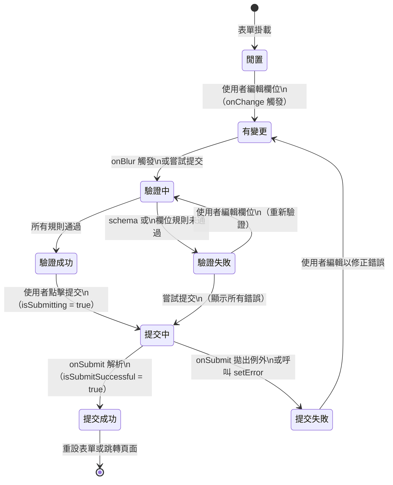

# 表單狀態管理

表單代表一種獨特的 UI 狀態類別。與伺服器資料或應用程式路由狀態不同，表單狀態本質上是本地的、
暫時性的，並且具有結構：表單有帶有值的欄位，每個欄位有觸碰過/未觸碰的狀態，表單有有效/無效狀態，
而提交則觸發一個非同步的副作用。使用通用的 `useState` 來管理這些狀態是可行的，但相當冗長；
專門的表單函式庫存在，是因為所需的模式 — 欄位註冊、驗證、髒值追蹤、提交狀態 — 在每個表單中都
以完全相同的方式重複出現。

React Hook Form、Formik 和 TanStack Form 是主流的函式庫。React Hook Form 使用非受控輸入
（基於 ref）以避免每次按鍵觸發重新渲染；Formik 使用帶有 context provider 的受控輸入；TanStack
Form 是框架無關的，具有更明確的 API。在有許多欄位的大型表單中，各方法之間的效能差異是可量測的，
而函式庫的選擇對驗證、錯誤顯示和提交狀態如何串接在一起有下游影響。以二十個欄位的表單為例，
React Hook Form 的非受控方式在每次按鍵只觸發目標欄位的更新，而受控方式則觸發所有訂閱相同
context 的元件重新渲染，在低階裝置或複雜表單佈局上的差距尤為顯著。

選擇使用表單函式庫的決策，主要不是關於狀態複雜度 — 兩個欄位的 `useState` 並不繁重 — 而是
關於驗證、提交處理和錯誤顯示。沒有函式庫的表單需要手動協調驗證邏輯、非同步提交狀態、錯誤訊息
顯示，以及欄位層級的觸碰追蹤。函式庫為所有這些提供了一個一致且經過測試的 API。在一個有數十個
表單的產品中，這些累積的節省相當顯著：統一的錯誤顯示、可預期的提交生命週期，以及驗證時機和
欄位互動追蹤上微妙 bug 的減少。

此外，表單函式庫對 TypeScript 的支援是現代開發工作流程的重要組成部分。搭配 Zod 的型別推斷，
表單的資料型別可以直接從 schema 派生（`z.infer<typeof schema>`），確保欄位名稱、值型別和
驗證規則在編譯時期都是型別安全的。這消除了一整類因欄位名稱拼寫錯誤或假設錯誤的資料型別而
產生的執行期錯誤，在重構表單或更新 schema 時尤為重要。

## 原則

工程師應該（SHOULD）對任何有三個或更多欄位、驗證需求或非同步提交的表單使用表單函式庫。門檻
不在於狀態變數的數量，而在於驗證和提交的生命週期。一個有必填欄位、格式驗證、伺服器端錯誤，以及
提交期間載入狀態的表單，其生命週期複雜度足以從函式庫對每個階段的一致且經過測試的處理中獲益。
沒有函式庫，工程師必須在產品中的每個表單上手動且一致地重新實作這個生命週期 — 這種方式隨著表單
數量增加，會引入差異、bug 和維護負擔。

工程師必須（MUST）在客戶端和伺服器端都進行驗證，且不得僅依賴客戶端表單驗證來保護安全性相關的
輸入。客戶端驗證為誠實的使用者提供即時回饋；它無法阻止惡意提交。接受表單提交的 API 端點必須
獨立驗證相同的規則。Zod schema 可以在前端 resolver 和後端路由處理器之間共享，讓雙重驗證具有
成本效益，並在驗證規則變更時保持兩端同步。雙重驗證不是重複勞動，而是系統邊界設計的基本原則：
每個系統邊界都必須自行驗證其輸入，無論來源是否受信任。在前端驗證成功通過後直接信任客戶端
資料的 API 端點，為繞過瀏覽器表單邏輯的惡意請求建立了未被保護的攻擊面。

## 設計思維

### 受控輸入與非受控輸入的選擇

React 為工程師提供了兩種擁有輸入狀態的模型。在受控模型中，React 透過狀態變數擁有值；每次按鍵
都會更新狀態、觸發重新渲染，輸入永遠反映 React 的值。在非受控模型中，DOM 透過 ref 擁有值；React
只在需要時（通常在提交或失焦時）讀取值，不在每次按鍵時重新渲染。

React Hook Form 的非受控方式在有許多欄位的大型表單中擴展性更好。一個有二十個輸入框的受控狀態
表單，每次按鍵都會產生二十次狀態更新和二十次重新渲染 — 在低階裝置上是可量測的效能成本。React Hook
Form 基於 ref 的註冊（`register()`）透過按需直接從 DOM 讀取值來避免這個問題。取捨是受控輸入
更容易與需要 value prop 的元件整合（例如自訂設計系統輸入元件），這就是為什麼 React Hook Form
為這些情況提供了 `Controller` 包裝器。架構決策並非非此即彼；大多數現實世界的表單實作，會混合使用
`register` 處理非受控欄位，和 `Controller` 處理第三方元件的受控欄位。

### 驗證策略

驗證可以在三個事件上觸發：`onChange`（每次按鍵）、`onBlur`（使用者離開欄位時），或 `onSubmit`
（使用者提交表單時）。每種策略都有不同的 UX 影響。`onChange` 驗證提供最快的回饋，但可能在使用者
完成輸入前就產生錯誤訊息 — 在使用者只輸入了「jo」時顯示「無效的電子郵件」感覺很突兀。`onBlur`
驗證是標準建議：當使用者離開欄位且已有完整機會填寫後，才顯示錯誤。`onSubmit` 驗證是最保守的 —
只有在使用者嘗試提交後才顯示錯誤 — 適合不需要內聯錯誤的短表單。

使用 `zod`、`yup` 或 `valibot` 的 schema 驗證，在一個宣告式物件中定義所有驗證規則，而不是將
每個欄位的規則物件分散在表單各處。React Hook Form 透過 `resolver` 選項整合 schema 驗證 —
來自 `@hookform/resolvers/zod` 的 `zodResolver(schema)` — 它對表單值執行整個 schema 並
自動將驗證錯誤對應回欄位名稱。該 schema 可以匯出並在後端重用，消除規則重複，並確保客戶端和
伺服器執行相同的限制條件。

### 欄位狀態：觸碰、髒值、錯誤

表單函式庫為每個欄位追蹤三個正交狀態：`touched`、`dirty` 和 `error`。這些狀態是截然不同的，
不能混為一談。`touched` 記錄使用者是否造訪過該欄位 — 將焦點移入然後移出 — 無論他們是否更改了
值。`dirty` 記錄值是否與初始值不同。`error` 保存當前的驗證錯誤訊息（如果有的話）。

`touched` 與 `dirty` 之間的區別對錯誤顯示時機至關重要。一個空的必填欄位在 schema 角度立即就
有錯誤，但在未觸碰的欄位上顯示「此欄位為必填」會讓尚未有機會填寫的使用者感到困惑。正確的模式
將 `touched` 用作閘門：只有在 `touched` 為 true（使用者已造訪欄位）或表單已被提交時才顯示錯誤。
React Hook Form 的 `mode: 'onBlur'` 自動應用這個閘門；在 `mode: 'onChange'` 中，工程師
負責在渲染錯誤訊息之前檢查 `touchedFields`。

`dirty` 狀態在儲存確認對話框和離開頁面防護（beforeunload）的情境中特別有用：在使用者有未儲存
的變更（`isDirty` 為 true）且試圖離開頁面時，提示確認有助於防止意外的資料遺失。React Hook
Form 的頂層 `formState.isDirty` 反映整個表單是否有任何欄位與其初始值不同，可直接用於這個閘門
邏輯，而無需手動比較每個欄位的當前值和初始值。

### 伺服器端錯誤

伺服器回應中經常帶有客戶端 schema 驗證無法產生的欄位層級驗證錯誤：電子郵件地址已使用、
使用者名稱已被佔用、資料庫中違反唯一性限制的值。這些錯誤必須填回表單的欄位錯誤狀態，而不是
顯示為繞過表單函式庫錯誤顯示機制的獨立通用錯誤橫幅。

在 React Hook Form 中，`setError('fieldName', { type: 'server', message: '電子郵件已被使用' })`
在提交後將欄位的錯誤狀態填入。type 值 `'server'` 將這些錯誤與 schema 驗證錯誤區分開來，這對
清除行為很有用 — schema 錯誤在下一次驗證通過時清除，而帶有 `shouldFocus: true` 的伺服器錯誤
還可以將焦點移至問題欄位。提交處理器應該包裝在 try/catch 中，將 API 錯誤回應結構對應到個別的
`setError` 呼叫，無論錯誤來自客戶端還是伺服器，都能維持一致的錯誤顯示。

### 提交狀態與重設

提交生命週期有三個可觀察的狀態，由表單函式庫追蹤：`isSubmitting`（非同步處理器正在執行中）、
`isSubmitted`（處理器至少完成過一次）和 `isSubmitSuccessful`（處理器完成且未拋出例外）。這些
旗標驅動不同的 UI 行為。`isSubmitting` 停用提交按鈕。`isSubmitted` 控制伺服器端錯誤的顯示
時機 — 在使用者嘗試提交之前顯示伺服器錯誤令人困惑，應避免。`isSubmitSuccessful` 可以觸發
成功訊息或頁面跳轉。

成功提交後，`reset()` 將所有欄位還原為預設值，並清除所有表單狀態 — `dirty`、`touched`、
`errors` 和提交旗標 — 使表單回到初始狀態。當表單在成功操作後繼續掛載（例如每次留言發布後仍
保持掛載的留言表單），這是正確的行為。當表單在成功後應該卸載時（登入後跳轉到儀表板的登入表單），
不需要手動重設；React 的卸載會自動清除表單狀態。

### 表單函式庫的選擇

React Hook Form 在效能和生態系整合方面都表現出色，是大多數 React 專案的合理預設選擇。
`@hookform/resolvers` 套件支援 Zod、Yup、Valibot 等主流 schema 函式庫，使驗證整合幾乎不需要
樣板程式碼。TanStack Form 在需要框架無關方案（同時支援 React、Vue 和 Solid）或需要更明確的
欄位訂閱模型以獲得細粒度效能控制時是更好的選擇。Formik 在許多現有程式碼庫中仍被廣泛使用，
但對於新的開發工作，React Hook Form 通常提供更好的效能特性和更積極的維護。最終選擇應考慮
團隊現有的熟悉度、設計系統元件的整合需求，以及是否存在跨框架的需求。

## 最佳實踐

**應該（SHOULD）使用 `zod` 或類似的 schema 函式庫作為表單函式庫的驗證 resolver。** 基於
schema 的驗證在一處定義所有驗證規則，產生一致的錯誤訊息，並可重用於 API 端驗證。將驗證規則定義
為 schema，能夠讓 React Hook Form resolver 和後端路由處理器共享同一個 schema，消除重複。直接
嵌入在 `register` 呼叫中的每欄位規則物件，會將驗證邏輯分散在元件各處，使其難以審查、重用或與
後端驗證保持同步。

**必須（MUST）只在使用者與欄位互動後（觸碰）或嘗試提交後，才顯示欄位層級的驗證錯誤。** 在
一個全新的、未觸碰的表單上顯示「此欄位為必填」，會讓尚未有機會填寫的使用者感到困惑。正確的
模式是在失焦時（使用者離開欄位時）或提交時（使用者提交而未填寫必填欄位時）顯示錯誤。大多數
表單函式庫透過 `mode: 'onBlur'` 或 `mode: 'onTouched'` 實作這個邏輯。工程師必須（MUST）
只在使用者觸碰過欄位或嘗試提交後，才渲染欄位層級的驗證錯誤訊息。剛載入的表單必須（MUST）在
使用者與其互動之前不顯示任何錯誤。

**應該（SHOULD）在表單提交進行中時停用提交按鈕，並在提交解析後重新啟用。** 雙重提交 — 兩次
發送相同的表單資料 — 是重複記錄、重複交易和並發提交之間競態條件的常見根源。在提交期間停用
按鈕可以防止這類 bug，而無需伺服器端的冪等性金鑰。React Hook Form `formState` 中的
`isSubmitting` 布林值在非同步 `onSubmit` 處理器執行期間為 true，在其解析或拒絕後為 false，
是綁定到按鈕 `disabled` 屬性的正確值。載入狀態同時提供了提交正在處理中的回饋，降低使用者因
認為沒有任何事情發生而再次點擊按鈕的可能性。

## 視覺呈現



## 範例

使用 Zod resolver 的 React Hook Form。`schema` 在一處定義電子郵件和密碼規則。`handleSubmit`
包裝非同步的 `onSubmit` 並在提交期間將 `isSubmitting` 設為 true。`register` 無需受控狀態即可
將輸入框連接到表單。錯誤僅對驗證失敗的欄位顯示，且提交進行中時提交按鈕會被停用。

```jsx
import { useForm } from 'react-hook-form';
import { zodResolver } from '@hookform/resolvers/zod';
import { z } from 'zod';

const schema = z.object({
  email: z.string().email('請輸入有效的電子郵件地址'),
  password: z.string().min(8, '密碼至少需要 8 個字元'),
});

function LoginForm({ onSubmit }) {
  const {
    register,
    handleSubmit,
    setError,
    formState: { errors, isSubmitting },
  } = useForm({
    resolver: zodResolver(schema),
    mode: 'onBlur',
  });

  async function handleLogin(data) {
    try {
      await onSubmit(data);
    } catch (err) {
      // 將伺服器端錯誤對應回個別的表單欄位
      if (err.field === 'email') {
        setError('email', { type: 'server', message: err.message });
      }
    }
  }

  return (
    <form onSubmit={handleSubmit(handleLogin)}>
      <label htmlFor="email">電子郵件</label>
      <input
        id="email"
        type="email"
        {...register('email')}
        aria-invalid={!!errors.email}
        aria-describedby={errors.email ? 'email-error' : undefined}
      />
      {errors.email && (
        <span id="email-error" role="alert">
          {errors.email.message}
        </span>
      )}

      <label htmlFor="password">密碼</label>
      <input
        id="password"
        type="password"
        {...register('password')}
        aria-invalid={!!errors.password}
        aria-describedby={errors.password ? 'password-error' : undefined}
      />
      {errors.password && (
        <span id="password-error" role="alert">
          {errors.password.message}
        </span>
      )}

      <button type="submit" disabled={isSubmitting}>
        {isSubmitting ? '登入中…' : '登入'}
      </button>
    </form>
  );
}
```

## 常見錯誤

- **掛載後立即顯示所有錯誤。** 在表單掛載的瞬間 — 在使用者與任何東西互動之前 — 就為每個必填欄位
  渲染錯誤訊息，是一個常見錯誤，通常發生在未檢查 `touchedFields` 或 `isSubmitted` 就觸發驗證
  的情況。這讓表單感覺充滿敵意。修正方式是在 React Hook Form 中使用 `mode: 'onBlur'`，將錯誤
  顯示限制在使用者造訪過的欄位。

- **繞過表單函式庫來顯示伺服器錯誤。** 從 API 回應中設定元件層級的錯誤狀態變數，並在表單函式庫
  的錯誤顯示機制之外渲染它，會在同一個表單中建立兩套獨立的錯誤系統。伺服器回傳的欄位錯誤應該
  透過 `setError` 流轉，這樣它們就能出現在與客戶端驗證錯誤相同的位置，並使用相同的樣式。

- **提交期間未停用提交按鈕。** 依賴使用者不會快速連點兩下並不是充分的策略。沒有
  `disabled={isSubmitting}`，快速雙重提交會發送兩個相同的請求，產生重複記錄、重複扣款，或
  兩個並發提交之間的競態條件。`formState` 中的 `isSubmitting` 旗標綁定成本幾乎為零，卻能消除
  整類雙重提交的 bug。

- **在客戶端和伺服器端重複驗證規則。** 在表單中以每欄位規則物件寫一次相同的驗證規則，再在 API
  處理器中以手動檢查再寫一次，意味著隨著時間推移它們會逐漸偏離。前端的「密碼至少 8 個字元」
  最終可能與後端的「密碼至少 10 個字元」不一致，讓通過客戶端驗證的使用者在提交時看到意外的
  伺服器錯誤。正確的方法是一個在前端 resolver 和後端之間共享的單一 Zod schema。當驗證規則
  改變時，只需在一個地方改變，兩端自動保持同步。

- **在 `useForm` 之外管理表單資料狀態。** 在 React Hook Form 外部維護一個平行的 `useState`
  來追蹤欄位值，是一種常見的過度工程反模式。這不僅造成兩個狀態來源之間的同步負擔，還會重新
  引入函式庫本應解決的效能問題（每次按鍵重新渲染）。表單的資料狀態應該完全由表單函式庫管理；
  元件只需要透過 `watch()` 讀取值（用於派生 UI）或透過 `getValues()` 在提交時讀取，而不是
  維護一個鏡像的 state。

## 相關 FEE

- [FEE-600](./600.md) 狀態管理總覽 — 分類狀態類別的分類法，將表單狀態置於本地、暫時性狀態的
  象限中
- [FEE-103](../HTML and Semantic Markup/103.md) 表單與驗證 — HTML 表單語意、無障礙標籤，以及
  補充函式庫驗證的原生瀏覽器驗證屬性
- [FEE-601](./601.md) 本地元件狀態 — 表單函式庫所建立並在複雜驗證和提交生命週期管理上加以
  超越的基本 `useState` 方法
- [FEE-1708](../Runtime Validation and Schema Libraries/1708.md) 執行時期驗證與結構描述函式庫
  — 深入介紹 Zod、Yup 和 Valibot；schema 推斷如何生成 TypeScript 型別；在客戶端與伺服器之間
  共享 schema 的模式

## 參考資料

- [React Hook Form](https://react-hook-form.com) — 官方文件，涵蓋 `register`、`Controller`、
  `useForm` 選項、`formState`、`setError` 及完整的 resolver API
- [TanStack Form](https://tanstack.com/form/latest) — 框架無關的表單函式庫，具有明確的欄位
  註冊、型別安全的驗證器和非同步驗證支援
- [@hookform/resolvers (Zod)](https://github.com/react-hook-form/resolvers) — 將 Zod、Yup、
  Valibot 和其他 schema 函式庫連接到 React Hook Form resolver 介面的轉接器套件，包含完整的
  schema 整合範例和型別推斷使用方式
- [Zod 官方文件](https://zod.dev) — Zod schema 定義、型別推斷（`z.infer`）和與 React Hook
  Form 整合的完整 API 參考，適合深入了解 schema 共享模式的工程師
