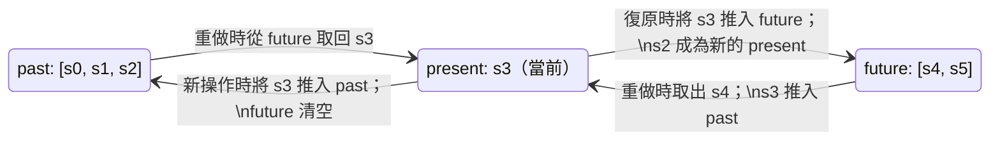

# [FEE-610] 復原與重做模式

:::info
復原（Undo）與重做（Redo）是任何需要讓使用者進行連續編輯的應用程式都應提供的基本功能，文字編輯器、
繪圖工具、表單建構器、資料表格皆然。其底層機制是一個歷史堆疊（history stack），而每一種實作都必須
決定兩件事：每一步要記錄什麼，以及歷史紀錄要往回保留多久。實務上以兩種模型為主：快照模型在每一步
儲存完整的狀態副本；命令模型則儲存一個可逆的差異（delta）。選錯模型的代價通常要到後期才會顯現：
可能是過大快照造成的記憶體壓力，也可能是復原按鈕悄悄做錯事。
:::

## 背景

快照模型（snapshot model）在每次操作前儲存完整狀態的副本。復原時回復上一個快照；重做時回復下一個
快照。快照實作簡單、易於推論，但記憶體用量會隨狀態大小乘以歷史深度而成長：對於小型狀態樹，這個開銷
可忽略不計；對於大型文件或畫布，快照儲存的代價則相當高昂。

命令模型（command model）儲存的是操作的描述，例如 `{ type: 'MOVE', id: '1', from: {x:0,y:0},
to: {x:10,y:0} }`，並搭配 `do` 與 `undo` 兩個實作。復原時呼叫 `undo` 函式；重做時再次呼叫 `do`
函式。命令模型的實作較為複雜，但無論狀態大小，每個命令佔用的記憶體都是固定的。Immer 等現代狀態
函式庫模糊了這兩種模型的界限：在可變風格的 recipe API 之上生成補丁，就能達到命令模型級別的記憶體
效率，而不必手寫 `do`/`undo` 函式對。本文接下來會說明 redux-undo 與 Zundo 預設採用的雙堆疊歷史
結構、復原邊界該畫在哪裡、協作編輯如何讓這個問題變得複雜，以及在實務上該如何限制歷史紀錄的大小。

## 視覺對比

標準的歷史堆疊結構是一個雙堆疊歷史：一個 `past` 陣列、一個 `future` 陣列，加上目前的 `present`
狀態。這個結構既可以儲存完整狀態快照（如下方範例，以及 redux-undo、Zundo 預設的做法），也可以
儲存可逆的補丁。下圖說明復原、重做，以及新操作如何讓狀態在這三者之間移動。



## 範例

以有界歷史深度的快照模型實作復原與重做，透過高階 reducer（higher-order reducer）包裝實現。
`withHistory` 包裝器攔截 `UNDO` 與 `REDO` 動作，並圍繞著被委託的 reducer 管理 past/future 堆疊。
`MAX_HISTORY` 常數限制 past 堆疊的大小，確保記憶體有界。被委託 reducer 處理的任何動作，都會清空
future 堆疊，實現標準的分支行為。

```js
const MAX_HISTORY = 100;

function withHistory(reducer) {
  const initialPresent = reducer(undefined, {});
  const initialState = { past: [], present: initialPresent, future: [] };

  return function historyReducer(state = initialState, action) {
    if (action.type === 'UNDO') {
      if (!state.past.length) return state;
      const past = [...state.past];
      const previous = past.pop();
      return {
        past,
        present: previous,
        future: [state.present, ...state.future],
      };
    }

    if (action.type === 'REDO') {
      if (!state.future.length) return state;
      const [next, ...future] = state.future;
      return {
        past: [...state.past, state.present].slice(-MAX_HISTORY),
        present: next,
        future,
      };
    }

    const present = reducer(state.present, action);
    if (present === state.present) return state;     // 無變更——略過歷史條目
    return {
      past: [...state.past, state.present].slice(-MAX_HISTORY),
      present,
      future: [],                                    // 新編輯使重做分支失效
    };
  };
}
```

## 最佳實踐

**必須（MUST）為復原歷史堆疊設置可配置的最大深度，並在達到上限時移除最舊的條目。** 在一個具有
數千次編輯的文件編輯器中，如果沒有上限，就會在記憶體中累積數千個快照或命令。合適的上限取決於
應用程式本身：舉例來說，一個小型設定表單可能只需保留少數幾步，而文件或畫布編輯器則可能需要保留
數百步。這些數字只是說明性的起點，不是硬性規則，實際採用前應針對自己的應用程式測量條目大小再
決定。達到上限時，在推入新的 present 之前，先從 past 陣列的前端移除最舊的條目。深度限制的數值
必須以具名常數或設定選項表示，而非散落在 reducer 中的魔法數字，以確保上限清晰可見、有文件記錄，
且不必深入實作細節即可調整。

**應該（SHOULD）在應用程式已使用 Immer 進行狀態管理時，採用 `immer` 的 `produceWithPatches` 來
實作 undo/redo。** 補丁生成功能預設是關閉的：使用 `produceWithPatches` 之前，必須先在應用程式
啟動時呼叫一次 `enablePatches()`，否則呼叫會在執行期拋出例外。`produceWithPatches` 會自動生成
反向補丁；儲存反向補丁而非完整快照，可將記憶體用量降低到變更本身的大小，而非整個狀態的大小。這是
Immer 狀態管理中實現 undo/redo 最高效、程式碼最精簡的路徑。產生的實作不需要手動撰寫 `do`/`undo`
函式對：補丁格式是宣告式且可逆的，`applyPatches` 能處理兩個方向的套用。對於同時需要持久化復原
歷史的應用程式，反向補丁是純粹可 JSON 序列化的物件，可以直接儲存至 localStorage 或 IndexedDB，
無需額外的序列化工作。

**應該（SHOULD）透過防抖（debouncing）或明確的批次分組（batch grouping），將連續快速的編輯
（如單個按鍵輸入）合併為單一個復原步驟。** 使用者在輸入時按下 Ctrl+Z，應該復原的是最後一個字詞或
句子，而非最後一個字元。批次分組是把一段時間窗口內的編輯合併為單一歷史條目，符合使用者期望，也讓
歷史堆疊保持在可管理的大小。防抖的做法是延遲歷史提交，直到在閾值時間內沒有新的編輯到來；輸入情境
下常見的選擇是 300–500 毫秒，但實際數值取決於應用程式，應該依實測調整，而非直接沿用。明確批次
分組的做法則是在 `beginBatch` 與 `endBatch` 呼叫之間累積變更，最後作為單一命令提交。

**應該（SHOULD）將復原與重做的可用狀態表示為兩個衍生布林值 `canUndo` 與 `canRedo`，並將其綁定
至對應 UI 控制項的 disabled 屬性。** 一個永遠啟用但有時什麼都不做的「復原」選單項目或工具列按鈕，
是一個可用性缺陷：它沒有給使用者任何關於操作是否可用的回饋。`canUndo` 的值等於 `past.length > 0`；
`canRedo` 的值等於 `future.length > 0`。這些值從歷史狀態中即可廉價推導，應當暴露給 UI 層，讓復原
與重做的控制項在任何時候都能準確反映當前的歷史狀態。

## 設計思維

### 歷史堆疊的資料結構

標準的歷史堆疊由兩個陣列組成：`past`（過去）堆疊與 `future`（未來）堆疊，加上當前的 `present`
狀態。執行復原時，從 `past` 的頂端取出一個項目，將當前 `present` 推入 `future`，並以取出的值作為
新的 `present`。執行重做時，從 `future` 的頂端取出一個項目，將當前 `present` 推入 `past`，並以
取出的值作為新的 `present`。當有新的、非復原也非重做的使用者操作到來時，當前 `present` 會被推入
`past`，新值成為 `present`，`future` 則被完全清空，因為新的編輯會讓所有已復原的狀態失效。

這個雙堆疊模型原則上是 O(1) 的：復原與重做各自只是一次取出（pop）與一次推入（push），不需要掃描
整個歷史紀錄。取出與推入本身是 O(1)，但如果實作建立在不可變陣列複製之上，例如上方範例中
`withHistory` reducer 使用的 `.slice()`，每一步就要付出 O(n) 的複製成本來複製整個堆疊。需要在
深度歷史紀錄上取得更高吞吐量的函式庫，會改用結構共享（structural sharing）或可變的環狀緩衝區
（ring buffer），而不是每次操作都複製陣列。每當有新的使用者操作時清空 `future` 堆疊是標準行為，
這符合使用者的預期：一旦在復原後進行了新的編輯，被復原的那個分支就會消失。部分特殊編輯器（支援
非線性復原的工具）會保留未來樹而非清空，但這帶來了可觀的額外複雜度，超出了標準模型的範疇。

歷史狀態中儲存的 `present` 值，應該精確地是底層 reducer 所操作的領域狀態，而不是包含 `past`、
`present`、`future` 的包裝物件整體。這使得被委託的 reducer 無需關心歷史記錄的實作細節，因為它
只需接收並產生領域狀態，而歷史包裝器則是疊加在其上的一層基礎設施。這個邊界在序列化狀態以供持久化
時也十分重要：通常只有領域狀態（即 `present`）需要被持久化，而非過去與未來堆疊，除非應用程式明確
要求跨頁面重新整理保留復原歷史。

### Immer produceWithPatches

Immer 的 `produceWithPatches(state, recipe)` 回傳一個包含三個值的元組：`[nextState, patches,
inversePatches]`。自 Immer v6 起，補丁生成功能必須透過在應用程式啟動時呼叫一次 `enablePatches()`
才能明確開啟；若未呼叫，`produceWithPatches` 會在執行期拋出例外。`patches` 陣列描述正向變更；
`inversePatches` 陣列則精確描述如何反轉這些變更。只需為每個歷史條目儲存 `inversePatches`，即可
在 Immer 熟悉的可變風格 API 之上，實現命令模型式的 undo/redo。

執行復原時，使用 `applyPatches(state, inversePatches)` 將儲存的反向補丁套用至當前狀態。執行重做
時，套用正向 `patches`。補丁的表示方式相當精簡：對一個大型物件中單一屬性的修改，只會產生一個描述
受影響路徑與新值的補丁，而非整個物件的完整快照。對於整體較大、但每次編輯只影響一小部分的狀態樹，
`produceWithPatches` 能以命令模型的效率搭配 Immer recipe API 的簡潔性。

### 哪些操作應納入復原範疇

並非所有狀態變更都應進入復原歷史。復原歷史應該（SHOULD）追蹤文件與資料的變更，也就是使用者正在
處理的內容。路由導航（使用者所在的頁面）、短暫的 UI 狀態（側邊欄是否展開、哪個分頁是啟用狀態），
以及游標或選取位置（當其不是刻意的編輯操作時），則不應該（SHOULD NOT）列入復原歷史。將這些狀態
納入復原歷史，會違背使用者期望：按下 Ctrl+Z 結果關閉了側邊欄，而非復原文字輸入，對使用者來說既
意外又困惑。

一個實用的判斷原則是：問問自己這個變更是否屬於使用者的文件或工作成果。在畫布上移動一個元素：是的。
將頁面捲動到不同位置：不是。重新命名一個圖層：是的。切換工具面板：不是。

在 Redux 風格的架構中，強制執行這個邊界最簡單的方式，是在 reducer 層進行過濾：只有帶有特定標記
（例如 `meta.undoable: true`）的 action，才會被歷史包裝器攔截，其他所有 action 則直接傳遞給領域
reducer，不影響 past/future 堆疊。可復原操作的 action creator 包含此標記；純 UI 狀態變更的
action creator 則省略它。這種明確的選擇加入（opt-in）模型比黑名單模型（封鎖特定 action 類型）
更加安全：一個新建但未明確標記的 action creator，預設就不會被記錄。這是一個安全的預設值。

### 協作編輯與衝突

在協作文件中的復原，也就是多位使用者同時編輯的情境（例如 Google Docs 或 Figma），必須考量其他
使用者的並發編輯。使用者在復原自己的操作時，不應同時撤銷協作者在該操作之後所做的修改。這是一個比
單使用者復原困難得多的問題：它需要 Operational Transformation（OT）或 CRDT 語義的復原機制，其中
一個復原操作在套用前必須先相對於後續的遠端變更進行重定基底（rebase）。

Yjs 是一個用於協作編輯的 CRDT 函式庫，其 `UndoManager` 提供了這個概念的具體實作。它依來源
（origin）追蹤變更，預設永遠不會覆寫遠端變更：只有來自被追蹤來源（通常是本地端）的編輯會被復原
或重做，因此一位使用者的復原不會撤銷協作者的工作成果。它是「只復原自己操作」語義在多寫入者 CRDT
情境下，一個被廣泛使用且有完整文件記錄的實作。

這個協作復原問題超出了大多數應用層級 undo/redo 實作的範疇，後者通常假設只有單一使用者工作階段。
工程師在開發協作功能時應了解，雙堆疊模型在多寫入者情境下並不適用，正確解決此問題需要內建復原支援
的 OT/CRDT 函式庫，或自行實作重定基底機制。儘早建立這個認知，可以避免先設計好單使用者復原、後來
才發現在協作模式下行不通的常見問題。

### 歷史記錄的持久化與序列化

部分應用程式希望復原歷史能夠跨頁面重新整理後依然保留：使用者關閉並重新開啟一個繪圖，應能復原上一個
工作階段的最後幾筆操作。持久化歷史記錄帶來了序列化需求：past 與 future 堆疊必須是可 JSON 序列化
的，這排除了在命令模型中直接儲存函式參照的做法，除非這些函式能在載入時從可序列化的命令描述子中
重建。

快照模型（儲存純狀態物件）天然具備可序列化性。補丁模型（儲存 Immer 補丁，即純物件）同樣天然可
序列化。以函式為基礎的命令模型則無法直接序列化。若要持久化，命令必須拆分為可序列化的描述子，以及
在載入時將描述子對映回函式的運行時執行器登錄表。對於需要持久化復原歷史的應用程式，補丁模型是最
直接的路徑：將反向補丁陣列組成的 past 堆疊序列化至 localStorage 或 IndexedDB，載入時直接還原，
無需額外的登錄表機制。

### 在實務中選擇歷史深度上限

正確的歷史深度取決於應用程式本身：包括預期的編輯工作階段長度，以及每個條目的記憶體成本。對快照型
歷史記錄，每個條目的成本是該時間點完整狀態物件的大小；對補丁型歷史記錄，每個條目的成本是該操作的
差異大小，文字編輯通常為數 KB，簡單的屬性變更則可能僅數十位元組。並不存在一個放諸四海皆準的上限；
合理的做法是先為你的應用程式選一個起始值（如上方最佳實踐所述，小型表單用少數幾步，文件或畫布編輯器
用數百步），接著在正式環境中監控歷史堆疊的記憶體用量，例如使用
`performance.measureUserAgentSpecificMemory()` 或定期採樣堆疊的序列化大小，並根據觀察到的實際
使用情況調整上限，而不是僅憑一次設計時的猜測定案。應將所選上限及其理由記錄在該常數旁的程式碼註解
中，讓未來的維護者理解這個數值的由來，而不是把它當作任意的魔法數字。

## 常見錯誤

- **歷史深度無上限。** 省略 past 堆疊的上限，是 undo/redo 實作中最常見的效能錯誤。在一個使用數
  小時的文件編輯器中，past 陣列無限增長，每個條目儲存著完整快照或補丁。設定 `MAX_HISTORY` 只需
  一行程式碼，卻能防止這類無界記憶體洩漏。

- **將 UI 狀態納入復原歷史。** 將側邊欄開關狀態、選中分頁或捲動位置推入 past 堆疊，會導致按 Ctrl+Z
  恢復的是 UI 配置而非文件內容。使用者期望復原影響的是他們正在編輯的工作成果。UI 專屬狀態應單獨儲存，
  並排除在歷史 reducer 之外。

- **執行新操作時未清空 future 堆疊。** 在派發新的（非復原、非重做）動作時，忘記設定 `future: []`，
  會讓過時的 future 條目持續存在。下次執行重做時，就會回復到早於新操作的狀態，造成重做堆疊與當前
  文件之間的不一致。

- **將每個按鍵記錄為獨立的復原步驟。** 如果沒有防抖或批次分組，復原歷史會充滿單字元插入的記錄。
  使用者必須多次按下 Ctrl+Z 才能復原一個完整的字詞。將歷史提交防抖到 300–500 毫秒左右的區間
  （一個常見的起始值），或在組合輸入事件周圍使用明確的批次分組，即可解決這個問題。

- **將反向補丁套用至錯誤的基底狀態。** 使用 `produceWithPatches` 時，反向補丁必須套用至產生補丁時
  的當前狀態。補丁套用順序錯誤，或套用至錯誤的基底，會靜默地產生損壞的狀態。雙堆疊模型強制保證了
  正確的套用順序：始終對當前 present 套用 past 頂端的反向補丁。偏離這個結構存在風險。

- **復原與重做控制項在堆疊為空時仍保持啟用。** 讓「復原」按鈕在 `past.length === 0` 時仍然可點擊，
  會給使用者帶來沒有任何可以復原的錯誤印象。從歷史狀態推導 `canUndo` 與 `canRedo` 並將其綁定至
  控制項的 disabled 屬性，是一個只需一行推導式的改動，卻能避免令人困惑的靜默無效操作體驗。

- **持久化完整歷史狀態而非僅持久化 present。** 將整個 `{ past, present, future }` 物件儲存至後端
  或 localStorage，會將復原堆疊的儲存空間一起浪費，而使用者通常不會期望復原歷史在完整重新載入後
  仍然保留。多數應用程式的正確行為是只持久化 `present` 領域狀態，載入時以空堆疊開始。只有在產品
  明確承諾跨工作階段復原時，才應持久化歷史堆疊。

## 延伸閱讀

- [FEE-600](./600.md) 狀態管理總覽 -- 復原與重做歷史所歸屬的狀態管理方法分類
- [FEE-601](./601.md) 本地元件狀態 -- `useReducer`，也就是大多數 `withHistory` 風格包裝器所建構
  的基礎模式
- [FEE-605](./605.md) 狀態機與有限自動機 -- 明確建模合法狀態轉換的技巧，是線性復原堆疊的互補技術

## 參考資料

- [Immer: produceWithPatches](https://immerjs.github.io/immer/patches) -- 補丁生成、
  `enablePatches()`、反向補丁與 `applyPatches` 的官方文件；以 Immer 實作補丁式 undo/redo 的主要
  參考資料
- [Redux 文件：實作復原歷史](https://redux.js.org/usage/implementing-undo-history) -- Redux
  官方關於 past/present/future 堆疊模式與高階 reducer 的標準指南；本文採用的結構模型出自此處
- [Zundo：Zustand 的 undo/redo 套件](https://github.com/charkour/zundo) -- 一個為 Zustand store
  設計的生產級復原中介層，可作為參考實作，也可直接用於 Zustand 應用程式
- [協作應用程式中的 Undo/Redo（Marijn Haverbeke）](https://marijnhaverbeke.nl/blog/collaborative-editing-cm.html) --
  詳細闡述 CodeMirror 中的協作復原問題；對理解單使用者復原在協作編輯情境下無法直接套用的原因，
  提供了有益的背景說明
- [Yjs: Y.UndoManager](https://docs.yjs.dev/api/undo-manager) -- Yjs 選擇性 undo/redo 管理器的
  API 參考文件，是 CRDT 協作編輯器中「依來源追蹤」復原機制廣泛使用、文件完整的實作
- [redux-undo](https://github.com/omnidan/redux-undo) -- 最早為 Redux 提供高階 reducer 實作的
  函式庫，本文的 past/present/future 模式直接受其 API 啟發；截至 2026 年已封存且不再積極維護，
  但原始碼仍具可讀性，有助於理解雙堆疊模型的邊界情況
- [useUndoable（React hook）](https://github.com/xplato/useUndoable) -- 一個輕量的 React hook
  （npm 套件 `use-undoable`），封裝了歷史堆疊；適合作為不依賴全域狀態管理器的 hook 式復原實作的
  參考範例

