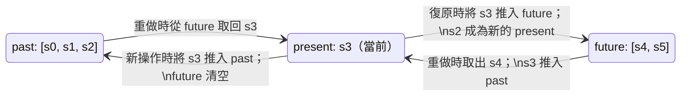

# 復原與重做模式

復原（Undo）與重做（Redo）是任何需要讓使用者進行連續編輯的應用程式都應提供的基本功能：文字編輯器、
繪圖工具、表單建構器、資料表格皆然。其底層機制是一個歷史堆疊（history stack）：每一個使用者操作都
被記錄為一個可逆的步驟，復原與重做則在堆疊中移動游標。設計上的核心挑戰在於決定「要記錄什麼」——
在每個時間點儲存完整狀態（快照模型），還是只儲存狀態之間的差異（命令模型）——以及如何限制歷史紀錄的
深度。

快照模型（snapshot model）在每次操作前儲存完整狀態的副本。復原時回復上一個快照；重做時回復下一個
快照。快照實作簡單、易於推論，但記憶體用量會隨狀態大小乘以歷史深度而成長。對於小型狀態樹，這個開銷
可忽略不計；對於大型文件或畫布，快照儲存的代價則無法接受。

命令模型（command model）儲存的是操作的描述——例如 `{ type: 'MOVE', id: '1', from: {x:0,y:0},
to: {x:10,y:0} }`——同時包含 `do` 與 `undo` 的實作。復原時呼叫 `undo` 函式；重做時再次呼叫
`do` 函式。命令模型的實作較為複雜，但無論狀態大小，每個命令佔用的記憶體是固定的。Immer 等現代狀態
函式庫模糊了這兩種模型的界限——透過補丁生成，在快照風格的狀態管理之上達到命令模型級別的效率。

選擇快照模型或命令模型，通常取決於應用程式的性質與已採用的狀態管理工具。已使用 Redux 或 Zustand 等
不可變狀態管理函式庫的應用程式，傾向於選擇快照模型，因為不可變更新帶來的結構共享使記憶體成本遠低於
表面看起來的數字。以 OOP 風格設計或需要嚴格記憶體預算的應用程式（如大型畫布繪圖工具），則傾向採用
命令模型，以確保記憶體成本隨操作數量線性增長，而非隨狀態大小增長。

## 設計思維

### 歷史堆疊的資料結構

標準的歷史堆疊由兩個陣列組成：`past`（過去）堆疊與 `future`（未來）堆疊，加上當前的 `present`
狀態。執行復原時，從 `past` 的頂端取出一個項目，將當前 `present` 推入 `future`，並以取出的值作為
新的 `present`。執行重做時，從 `future` 的頂端取出一個項目，將當前 `present` 推入 `past`，並以
取出的值作為新的 `present`。當有新的使用者操作到來——而非復原或重做——時，當前 `present` 被推入
`past`，新值成為 `present`，`future` 被完全清空，因為新的編輯會讓所有已復原的狀態失效。

這個雙堆疊模型對復原和重做都十分高效：兩者都是 O(1) 的陣列操作。每當有新的使用者操作時清空 `future`
堆疊，是標準行為——這符合使用者的預期：一旦在復原後進行了新的編輯，被復原的那個分支就消失了。部分特殊
編輯器（支援非線性復原的工具）會保留未來樹而非清空，但這帶來了可觀的額外複雜度，超出了標準模型的
範疇。

歷史狀態中儲存的 `present` 值，應該精確地是底層 reducer 所操作的領域狀態，而不是包含 `past`、
`present`、`future` 的包裝物件整體。這個分離使得被委託的 reducer 無需關心歷史記錄的實作細節，
它只需接收並產生領域狀態。歷史包裝器是純粹的基礎設施層，疊加在領域邏輯之上。這個邊界在序列化狀態
以供持久化時也十分重要：通常只有領域狀態（即 `present`）需要被持久化，而非過去與未來堆疊，除非
應用程式明確要求跨頁面重新整理保留復原歷史。

### Immer produceWithPatches

Immer 的 `produceWithPatches(state, recipe)` 回傳一個包含三個值的元組：`[nextState, patches,
inversePatches]`。`patches` 陣列描述正向變更；`inversePatches` 陣列則精確描述如何反轉這些變更。
只需為每個歷史條目儲存 `inversePatches`，即可在 Immer 熟悉的可變風格 API 之上，實現命令模型式的
undo/redo。

執行復原時，使用 `applyPatches(state, inversePatches)` 將儲存的反向補丁套用至當前狀態。執行重做
時，套用正向 `patches`。補丁的表示方式相當精簡：對一個大型物件中單一屬性的修改，只會產生一個描述
受影響路徑與新值的補丁，而非整個物件的完整快照。對於整體較大、但每次編輯只影響一小部分的狀態樹，
`produceWithPatches` 能以命令模型的效率搭配 Immer recipe API 的簡潔性。

補丁本身是符合 JSON Patch 規範（RFC 6902）的純物件，格式為 `{ op, path, value }`。這個格式不僅
可序列化，還具有互操作性：相同的補丁格式可以用於網路同步、操作日誌或稽核追蹤，使補丁成為超越
undo/redo 本身用途的通用工具。在設計需要歷史追蹤、即時協作或操作回放的系統時，這一點值得考慮。

### 哪些操作應納入復原範疇

並非所有狀態變更都應進入復原歷史。復原歷史應該（SHOULD）追蹤文件與資料的變更——使用者正在處理的
內容。路由導航（使用者所在的頁面）、短暫的 UI 狀態（側邊欄是否展開、哪個分頁是啟用狀態），以及游標
或選取位置（當其不是刻意的編輯操作時），應該（SHOULD）不列入復原歷史。將這些狀態納入復原歷史，會
違背使用者期望：按下 Ctrl+Z 結果關閉了側邊欄，而非復原文字輸入，對使用者來說既意外又困惑。

一個實用的判斷原則是：問問自己這個變更是否屬於使用者的文件或工作成果。在畫布上移動一個元素：是的。
將頁面捲動到不同位置：不是。重新命名一個圖層：是的。切換工具面板：不是。復原的邊界，與使用者所擁有
的工作成果的邊界是一致的。

在 Redux 風格的架構中，強制執行這個邊界最簡單的方式，是在 reducer 層進行過濾：只有帶有特定標記
（例如 `meta.undoable: true`）的 action，才會被歷史包裝器攔截，其他所有 action 則直接傳遞給領域
reducer，不影響 past/future 堆疊。可復原操作的 action creator 包含此標記；純 UI 狀態變更的
action creator 則省略它。這種明確的選擇加入（opt-in）模型比黑名單模型（封鎖特定 action 類型）
更加安全：一個新建但未明確標記的 action creator，預設行為就是不被記錄，這是安全的預設值。

在 Zustand 為基礎的應用程式中，同樣的邊界可以透過 Zundo 的 `partialize` 選項來實現：只將狀態物件
中需要追蹤歷史的欄位（文件資料）傳入 `partialize`，Zundo 只會追蹤這些欄位的變化。UI 專屬的
欄位（如 `selectedTool`、`panelOpen`）則被排除在歷史追蹤之外，不論它們如何頻繁地更新。

### 協作編輯與衝突

在協作文件中的復原——多位使用者同時編輯，例如 Google Docs 或 Figma——必須考量其他使用者的並發編輯。
使用者在復原自己的操作時，不應同時撤銷協作者在該操作之後所做的修改。這是一個比單使用者復原困難得多
的問題：它需要 Operational Transformation（OT）或 CRDT 語義的復原機制，其中一個復原操作在套用前
必須先相對於後續的遠端變更進行重定基底（rebase）。

這個協作復原問題超出了大多數應用層級 undo/redo 實作的範疇，後者通常假設只有單一使用者工作階段。
工程師在開發協作功能時應了解，雙堆疊模型在多寫入者情境下並不適用，正確解決此問題需要內建復原支援的
OT/CRDT 函式庫，或自行實作重定基底機制。儘早建立這個認知，可以避免先設計好單使用者復原、後來才發現
在協作模式下行不通的常見問題。

在實作中，協作復原常見的妥協方案是「本地復原」語義：每位使用者只能復原自己的操作，且復原結果
相對於其他協作者的當前狀態被重定基底，確保復原不會抹去他人的工作。Y.js、Automerge 等 CRDT 函式庫
內建了此類語義；若使用自訂 OT 實作，工程師需要明確定義復原操作如何與並發操作轉換，這是 OT 演算法
設計中最難的部分之一。

### 歷史記錄的持久化與序列化

部分應用程式希望復原歷史能夠跨頁面重新整理保留——使用者關閉並重新開啟一個繪圖，應能復原上一個工作
階段的最後幾筆操作。持久化歷史記錄帶來了序列化需求：past 與 future 堆疊必須是可 JSON 序列化的，
這排除了在命令模型中直接儲存函式參照的做法，除非這些函式能在載入時從可序列化的命令描述子中重建。

快照模型（儲存純狀態物件）天然具備可序列化性。補丁模型（儲存 Immer 補丁，即純物件）同樣天然可序列化。
以函式為基礎的命令模型則無法直接序列化——若要持久化，命令必須拆分為可序列化的描述子，以及在載入時
將描述子對映回函式的運行時執行器登錄表。對於需要持久化復原歷史的應用程式，補丁模型是最直接的路徑：
將反向補丁陣列組成的 past 堆疊序列化至 localStorage 或 IndexedDB，載入時直接還原，無需額外的
登錄表機制。

持久化歷史記錄時，另一個需要注意的問題是版本相容性：應用程式更新後，狀態的形狀（shape）可能已
改變，舊的快照或補丁可能無法正確套用至新版本的狀態結構。建議在序列化的歷史記錄中包含版本標記，
並在載入時進行版本檢查：若版本不符，安全的做法是丟棄舊的歷史記錄，以空堆疊啟動，而非嘗試套用
可能損壞狀態的舊補丁。

### 在實務中選擇歷史深度上限

正確的最大歷史深度取決於預期的編輯工作階段長度，以及每個條目的記憶體成本。對快照型歷史
記錄，每個條目的成本是該時間點完整狀態物件的大小；對補丁型歷史記錄，每個條目的成本是該
操作的差異大小——文字編輯通常為數 KB，簡單的屬性變更則可能僅數十位元組。一個實用的經驗
法則是設定上限，使最壞情況下的歷史記憶體佔用——最大深度乘以最大條目大小——保持在 50MB
以下。對多數生產力應用程式而言，100 步加上按鍵合併與補丁式儲存，輕易就能滿足這個限制。

建議在生產環境中使用 `performance.measureUserAgentSpecificMemory()` 或定期採樣堆疊的
序列化大小，監控歷史堆疊的記憶體用量，並根據觀察到的使用模式調整上限，而非以單一的設計
時猜測定案。深度上限的選擇理由應記錄在相鄰的程式碼註解中，讓未來的維護者理解這個數值
的由來，而非把它當作任意的魔法數字。將深度上限暴露為可配置選項，讓不同的部署情境能夠
根據自身的記憶體限制與使用者期望，選擇適合的值。

## 最佳實踐

**必須（MUST）為復原歷史堆疊設置可配置的最大深度，並在達到上限時移除最舊的條目。** 在一個具有數千
次編輯的文件編輯器中，如果沒有上限，就會在記憶體中累積數千個快照或命令。深度上限必須依應用程式類型
設為可配置的選項：對設定表單而言 20 步可能就夠了；對文件或畫布編輯器而言 200 步才合適。達到上限時，
在推入新的 present 之前，先從 past 陣列的前端移除最舊的條目。深度限制的數值必須以具名常數或設定選項
表示，而非散落在 reducer 中的魔法數字，以確保上限清晰可見、有文件記錄，且在不深入實作細節的情況下
即可調整。

**應該（SHOULD）在應用程式已使用 Immer 進行狀態管理時，採用 `immer` 的 `produceWithPatches` 來
實作 undo/redo。** `produceWithPatches` 會自動生成反向補丁；儲存反向補丁而非完整快照，可將記憶體
用量降低到變更本身的大小，而非整個狀態的大小。這是 Immer 狀態管理中實現 undo/redo 最高效、
程式碼最精簡的路徑。產生的實作不需要手動撰寫 `do`/`undo` 函式對：補丁格式是宣告式且可逆的，
`applyPatches` 能處理兩個方向的套用。對於同時需要持久化復原歷史的應用程式，反向補丁是純粹可
JSON 序列化的物件，可以直接儲存至 localStorage 或 IndexedDB，無需額外的序列化工作。

**應該（SHOULD）透過防抖（debouncing）或明確的批次分組（batch grouping），將連續快速的編輯
（如單個按鍵輸入）合併為單一個復原步驟。** 使用者在輸入時按下 Ctrl+Z，應該復原的是最後一個字詞或
句子，而非最後一個字元。批次分組透過將一段時間窗口內的編輯合併為單一歷史條目來達成這個目標，符合
使用者期望，也讓歷史堆疊保持在可管理的大小。防抖的做法是延遲歷史提交，直到在閾值時間（輸入時通常
為 300–500 毫秒）內沒有新的編輯到來。明確批次分組的做法則是在 `beginBatch` 與 `endBatch` 呼叫之間
累積變更，最後作為單一命令提交。

**應該（SHOULD）將復原與重做的可用狀態以衍生布林值——`canUndo` 與 `canRedo`——的形式公開，
並將其綁定至對應 UI 控制項的 disabled 屬性。** 一個永遠啟用但有時什麼都不做的「復原」選單項目或
工具列按鈕，是一個可用性缺陷：它沒有給使用者任何關於操作是否可用的回饋。`canUndo` 的值等於
`past.length > 0`；`canRedo` 的值等於 `future.length > 0`。這些值從歷史狀態中即可廉價推導，應當
暴露給 UI 層，讓復原與重做的控制項在任何時候都能準確反映當前的歷史狀態。

## 視覺呈現

下圖展示雙堆疊歷史模型的狀態與操作關係。`past` 儲存已執行的狀態序列；`present` 是當前狀態；
`future` 儲存已復原但尚未被新操作覆蓋的狀態序列。復原操作將 present 推入 future，並從 past 取出
最新狀態作為新的 present。重做操作則相反。新的使用者編輯操作會將 present 推入 past，並清空 future，
切斷重做分支。



## 範例

以有界歷史深度的快照模型實作復原與重做，透過高階 reducer（higher-order reducer）包裝實現。
`withHistory` 包裝器攔截 `UNDO` 與 `REDO` 動作，並圍繞著被委託的 reducer 管理 past/future 堆疊。
`MAX_HISTORY` 常數限制 past 堆疊的大小，確保記憶體有界。被委託 reducer 處理的任何一般動作，都會
清空 future 堆疊，實現標準的分支行為。`present === state.present` 的相等性檢查，利用不可變更新
所產生的參照相等性，確保無狀態變更的動作（如 no-op）不會在 past 中留下重複的歷史條目，這也是為何
此模式與 Immer 或 Redux Toolkit 等不可變狀態管理工具搭配效果最佳的原因。

```js
const MAX_HISTORY = 100;

function withHistory(reducer) {
  const initialPresent = reducer(undefined, {});
  const initialState = { past: [], present: initialPresent, future: [] };

  return function historyReducer(state = initialState, action) {
    if (action.type === 'UNDO') {
      if (!state.past.length) return state;
      const past = [...state.past];
      const previous = past.pop();
      return {
        past,
        present: previous,
        future: [state.present, ...state.future],
      };
    }

    if (action.type === 'REDO') {
      if (!state.future.length) return state;
      const [next, ...future] = state.future;
      return {
        past: [...state.past, state.present].slice(-MAX_HISTORY),
        present: next,
        future,
      };
    }

    const present = reducer(state.present, action);
    if (present === state.present) return state;     // 無變更——略過歷史條目
    return {
      past: [...state.past, state.present].slice(-MAX_HISTORY),
      present,
      future: [],                                    // 新編輯使重做分支失效
    };
  };
}
```

## 常見錯誤

- **歷史深度無上限。** 省略 past 堆疊的上限，是 undo/redo 實作中最常見的效能錯誤。在一個使用數小時
  的文件編輯器中，past 陣列無限增長，每個條目儲存著完整快照或補丁。設定 `MAX_HISTORY` 只需一行程式碼，
  卻能防止這類無界記憶體洩漏。使用 Chrome DevTools 的 Memory 面板追蹤 JS heap 大小，可以驗證上限
  是否確實生效：長時間編輯後，heap 大小應趨於穩定，而非持續線性增長。

- **將 UI 狀態納入復原歷史。** 將側邊欄開關狀態、選中分頁或捲動位置推入 past 堆疊，會導致按 Ctrl+Z
  恢復的是 UI 配置而非文件內容。使用者期望復原影響的是他們正在編輯的工作成果。UI 專屬狀態應單獨儲存，
  並排除在歷史 reducer 之外。

- **執行新操作時未清空 future 堆疊。** 在派發新的（非復原、非重做）動作時，忘記設定 `future: []`，
  會讓過時的 future 條目持續存在。下次執行重做時，就會回復到早於新操作的狀態，造成重做堆疊與當前
  文件之間的不一致。

- **將每個按鍵記錄為獨立的復原步驟。** 如果沒有防抖或批次分組，復原歷史會充滿單字元插入的記錄。使用者
  必須多次按下 Ctrl+Z 才能復原一個完整的字詞。將歷史提交防抖到最後一次按鍵後 300–500 毫秒，或在組合
  輸入事件周圍使用明確的批次分組，即可解決這個問題。

- **將反向補丁套用至錯誤的基底狀態。** 使用 `produceWithPatches` 時，反向補丁必須套用至產生補丁時的
  當前狀態。補丁套用順序錯誤，或套用至錯誤的基底，會靜默地產生損壞的狀態。雙堆疊模型強制保證了正確
  的套用順序——始終對當前 present 套用 past 頂端的反向補丁——這也是偏離標準結構存在風險的原因。

- **復原與重做控制項在堆疊為空時仍保持啟用。** 讓「復原」按鈕在 `past.length === 0` 時仍然可點擊，
  會給使用者帶來沒有任何可以復原的錯誤印象。從歷史狀態推導 `canUndo` 與 `canRedo` 並將其綁定至
  控制項的 disabled 屬性，是一個只需一行推導式的改動，卻能避免令人困惑的靜默無效操作體驗。

- **持久化完整歷史狀態而非僅持久化 present。** 將整個 `{ past, present, future }` 物件儲存至後端
  或 localStorage，會將復原堆疊的儲存空間一起浪費——而使用者通常不會期望復原歷史在完整重新載入後
  仍然保留。多數應用程式的正確行為是只持久化 `present` 領域狀態，載入時以空堆疊開始。只有在產品
  明確承諾跨工作階段復原時，才應持久化歷史堆疊，且必須同時處理版本相容性問題，以防應用程式更新後
  舊的歷史記錄格式與新的狀態結構不相容。

- **在非復原操作中意外觸發歷史包裝器的副作用。** 高階 reducer 包裝器通常對所有到來的 action 做出
  反應；如果某個 action 意外命中了 `UNDO` 或 `REDO` 的判斷邏輯（例如 action type 命名衝突），會
  產生難以追蹤的狀態錯誤。建議為 UNDO 與 REDO 使用帶有命名空間前綴的 action type，例如
  `@@history/UNDO`，以降低與應用程式其他 action 衝突的機率。

## 相關 FEE


- [FEE-600](./600.md) — 狀態管理總覽
- [FEE-601](./601.md) — 本地元件狀態
- [FEE-605](./605.md) — 狀態機與有限自動機

## 參考資料

- [Immer: produceWithPatches](https://immerjs.github.io/immer/patches) — 補丁生成、反向補丁與
  `applyPatches` 的官方文件；以 Immer 實作補丁式 undo/redo 的主要參考資料
- [Redux 文件：實作復原歷史](https://redux.js.org/usage/implementing-undo-history) — Redux 官方
  關於 past/present/future 堆疊模式與高階 reducer 的標準指南；本文採用的結構模型出自此處
- [Zundo — Zustand 的 undo/redo 套件](https://github.com/charkour/zundo) — 一個為 Zustand
  store 設計的生產級復原中介層，可作為參考實作，也可直接用於 Zustand 應用程式
- [協作應用程式中的 Undo/Redo（Marijn Haverbeke）](https://marijnhaverbeke.nl/blog/collaborative-editing-cm.html) —
  詳細闡述 CodeMirror 中的協作復原問題；對理解單使用者復原在協作編輯情境下無法直接套用的原因，
  提供了有益的背景說明
- [redux-undo](https://github.com/omnidan/redux-undo) — 最早為 Redux 提供高階 reducer 實作的
  函式庫；本文的 past/present/future 模式直接受其 API 啟發；原始碼可讀性高，有助於理解雙堆疊模型的
  各種邊界情況，包含歷史過濾、群組操作、以及清除堆疊等進階功能的參考實作
- [use-undoable（React hook）](https://github.com/nicholasgasior/use-undoable) — 封裝歷史堆疊的
  輕量 React hook；適合作為不依賴全域狀態管理器的 hook 式復原實作的參考範例
- [Y.js CRDT 函式庫](https://github.com/yjs/yjs) — 業界廣泛使用的 CRDT 協作框架，內建文件歷史與
  復原語義；是需要協作編輯的應用程式研究復原設計的重要參考；Yjs 的復原管理器
  （`UndoManager`）提供了「只復原自己操作」的語義，是協作 undo 的實務參考
- [JSON Patch 規範（RFC 6902）](https://datatracker.ietf.org/doc/html/rfc6902) — Immer 補丁格式
  所基於的標準規範；理解 `op`、`path`、`value` 的語義，有助於除錯補丁式 undo/redo 的實作；
  同時也是評估補丁格式互操作性與持久化方案的必備背景知識
