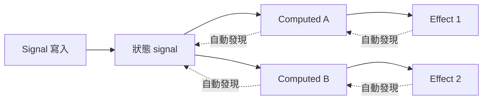

# [FEE-611] 框架 Signals 比較（Solid、Vue、Preact、Angular）

:::info
Signal 是一種響應式值容器，當其值變動時會通知依賴它的消費者，為現代 UI 框架的宣告式狀態傳遞提供基礎。Solid signals、Vue refs、Preact signals 與 Angular signals 都收斂到相同的原語形態：值容器在讀取時自動追蹤依賴、在寫入時觸發 effect。每個實作都自帶一套自動追蹤機制，因此一個框架的 signal 在執行期無法與另一個框架互通。本文整理共通的心智模型，以及函式庫作者在針對任一框架時會遇到的各家 API 介面。
:::

## 背景

Solid 透過 `createSignal` 建立了現代 signal API，回傳 getter／setter 配對，getter 會自動向周遭的追蹤範圍訂閱。Vue 的 Composition API 透過 `ref()` 提供相同形態的原語：ref 物件可變動，讀取 `.value` 會被追蹤，寫入則觸發相關 effect。Preact 將 signals 包裝為框架無關的核心（`@preact/signals-core`），並提供 Preact 與 React 的綁定，透過穩定的 `.value` 存取器暴露其值。Angular 在 v17 將 signals 推出為穩定 API，文件中將其描述為「值的包裝層，當值變動時會通知關注的消費者」。Vue 文件明確點出這層收斂：「在本質上，signals 就是與 Vue refs 同類的響應式原語。」

## 情境

某位函式庫作者正在為共用設計系統打造狀態容器，需要決定要對外暴露哪一種響應式原語。同一份元件邏輯可能執行於 Solid、Vue、Preact 或 Angular 應用之內。釐清哪些 API 共享語意、哪些地方會分歧，會決定單一核心是否足以支撐四種綁定，或是各框架需要各自的轉接層。

## 最佳實踐

- **必須**將每個框架的 signal 視為不可跨執行期攜帶的原語。每種實作都有自己的自動追蹤機制，一個框架的 signal 不會替另一個框架的消費者建立訂閱關係，這正是 TC39 標準化工作的明確動機。
- **必須不要**在 Solid 中依賴某個 signal 更新時所訂閱 effect 的觸發順序。Solid 文件指出「順序可能變動」且「effect 的執行順序未受保證，不應被依賴」。
- **應該**在 Angular 中優先以 signal 寫入來驅動變更偵測，而非依賴 Zone.js 修補的非同步 API。Angular zoneless 指南將「在模板中讀取的 signal 被更新」列為 zoneless 的觸發條件，從而免除 Zone.js 對瀏覽器 API 的修補。
- **應該**在設計 Preact 風格 API 時，讓 signal 在多次變動之間維持相同身份。Preact signal 是「具有 `.value` 屬性的物件……signal 的值可以變動，但 signal 本身始終不變」，這讓消費者可持有對容器的參照，無需在每次變動時都從父層重新讀取。
- **可以**仰賴框架的自動追蹤，而非為衍生計算手動宣告依賴陣列。Solid 的 `createEffect` 文件指出「Solid 會自動追蹤 effect 的依賴，所以你無需手動指定它們」。

## 設計思維

Signals 以較細緻的求值模型，換取放棄純拉取式重新渲染的單純性。TC39 提案將此策略稱為 push-pull：狀態變動將失效訊息推進依賴圖，計算值則在被讀取時才被惰性拉取。提案點名「無 glitch」不變式為此模型的保證之一，亦即消費者永遠不會觀察到不一致的中間狀態。Solid 的細粒度響應指南以 DOM 角度說明回報：「在細粒度響應系統中，應用便有能力進行高度針對性與特定的更新」、「在 Solid 中，更新會直接施加在需要變更的目標屬性上」。所換取的代價是寫入時較多的簿記工作，換來渲染時較少的工作量，因為虛擬 DOM 比對被替換為錨定到變動 signal 的直接屬性更新。

## 深入探討

自動追蹤是各家共享的機制。TC39 提案記載「computed Signal 會自動發現它依賴的其他 Signal，無論這些 Signal 是單純的值或其他 computation」，Solid 也為 `createEffect` 記錄了相同性質。在等值語意上各實作有所差異，這在寫入抵達 memo 或 computed 時格外重要。Solid 的 `createMemo`「對其依賴的每次變動最佳化為只執行一次」，並且「若依賴變動但其值維持不變，則不會觸發後續更新」，意味著當重新計算的值與快取值相符時，下游 effect 會被略過。Vue 3.5 重構了響應式核心，將響應式記憶體用量降低 56%，並讓深層響應陣列的追蹤在某些情況下最高加快 10×，且不改變既有行為。Angular 的 `computed()` 為唯讀衍生值，`effect()` 則「建立活的連結。若被追蹤的 signal 變動，Angular 終究會重新執行其消費者」。

## 圖解



虛線邊代表自動追蹤的訂閱關係：每個 computed 與 effect 都在執行過程中自動發現自身依賴，正如 TC39 提案所記。

## 範例

Solid：

```js
import { createSignal } from "solid-js";
const [count, setCount] = createSignal(0);
console.log(count());        // 0
setCount(count() + 1);
```

Vue：

```js
import { ref } from "vue";
const count = ref(0);
console.log(count.value);    // 0
count.value++;
```

Preact：

```js
import { signal } from "@preact/signals-core";
const count = signal(0);
console.log(count.value);    // 0
count.value++;
```

Angular：

```ts
import { signal } from "@angular/core";
const count = signal(0);
console.log(count());        // 0
count.set(count() + 1);
```

每段程式片段都涵蓋各框架文件所記載的讀寫介面：Solid 的 getter／setter 配對、Vue 在 `ref` 上的 `.value` 存取器、Preact 在 signal 物件上的 `.value`，以及 Angular 以函式呼叫讀取 signal、再以 `set`／`update` 寫入。

## 跨框架 API 比較

| 面向            | Solid                          | Vue                             | Preact                          | Angular                         |
| ----------------- | ------------------------------ | ------------------------------- | ------------------------------- | ------------------------------- |
| 讀取語法       | `count()`（呼叫 getter）        | `count.value`                   | `count.value`                   | `count()`（呼叫 signal）         |
| 寫入語法      | `setCount(next)`（setter）      | `count.value = next`            | `count.value = next`            | `count.set(next)` / `count.update(fn)` |
| 預設等值判斷  | memo 值未變則略過更新 | `ref` 淺層／`reactive` 深層 | `.value` 寫入時即觸發 | `Object.is` 風格：未變則略過 |
| Computed 原語| `createMemo`                   | `computed`                      | `computed`                      | `computed`                      |
| Effect 原語  | `createEffect`                 | `watchEffect` / `watch`         | `effect`                        | `effect`                        |

讀取與寫入兩列分別錨定於 Solid `createSignal` 的 getter／setter 合約、Vue `ref` 的 `.value` 語意、Preact 在穩定 signal 物件上的 `.value` 存取器，以及 Angular signals 指南。等值列則反映 Solid memo 在等值時略過的行為，以及各框架容器所記載的響應式行為。

## 內部參考

- FEE-612 — TC39 Signals 提案，將本文所盤點的跨框架原語進行標準化。
- FEE-616 — React 19 表單狀態，將其 hook 協作模式對照於 signal 模型。
- FEE-614 — XState v5 actor 模型，將編排式狀態機對照於細粒度的 signal 圖。

## 參考資料

- Solid, "Signals," docs.solidjs.com. https://docs.solidjs.com/concepts/signals
- Solid, "Effects," docs.solidjs.com. https://docs.solidjs.com/concepts/effects
- Solid, "Memos," docs.solidjs.com. https://docs.solidjs.com/concepts/derived-values/memos
- Solid, "Fine-Grained Reactivity," docs.solidjs.com. https://docs.solidjs.com/advanced-concepts/fine-grained-reactivity
- Preact, "Signals," preactjs.com. https://preactjs.com/guide/v10/signals/
- Angular, "Signals," angular.dev. https://angular.dev/guide/signals
- Angular, "Zoneless," angular.dev. https://angular.dev/guide/zoneless
- Vue, "Reactivity API: Core," vuejs.org. https://vuejs.org/api/reactivity-core.html
- Vue, "Reactivity in Depth," vuejs.org. https://vuejs.org/guide/extras/reactivity-in-depth.html
- Evan You, "Announcing Vue 3.5," blog.vuejs.org. https://blog.vuejs.org/posts/vue-3-5
- TC39, "Signals Proposal," github.com/tc39. https://github.com/tc39/proposal-signals
