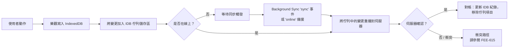

# [FEE-617] 以 IndexedDB 實作離線優先狀態（idb、Dexie）

:::info
IndexedDB 是瀏覽器內建的交易式、非同步、JavaScript 物件導向儲存體，專為大量結構化資料與索引型查詢而設計。`idb`（約 1.19KB brotli 壓縮後的 Promise 化包裝器）與 Dexie（提供版本化 schema 與 `liveQuery()` 的類 ORM 層）這類包裝器，弭平了原生 API 的可用性落差。要提供離線優先體驗，變更先寫入 IndexedDB，之後再透過 Background Sync API 或 Workbox 佇列進行重播；對於 Background Sync 屬於 limited-availability 的瀏覽器，則以 `online` 事件作為備援路徑。持久化儲存與配額估算可以避免靜默驅逐，這是讓「離線優先」不至於變成「資料遺失」的關鍵。重播變更與伺服器狀態之間的衝突解決屬於另一個獨立議題，相關內容請參閱 FEE-615。
:::

## 背景

IndexedDB 是低階的瀏覽器 API，用於在用戶端儲存大量結構化資料（包含檔案與 blob），並透過索引提供高效能查詢（MDN：「IndexedDB is a low-level API for client-side storage of significant amounts of structured data, including files/blobs. This API uses indexes to enable high-performance searches of this data.」）。從架構上看，它是一套交易式資料庫系統，在交易保證上可比擬 SQL 型 RDBMS，同時又是以結構化可複製值（structured-clonable）作為鍵的 JavaScript 物件導向儲存體（MDN：「IndexedDB is a transactional database system, like an SQL-based Relational Database Management System (RDBMS). However, unlike SQL-based RDBMSes, which use fixed-column tables, IndexedDB is a JavaScript-based object-oriented database.」）。這兩個性質（交易完整性與結構化複製鍵）共同奠定了離線優先模式的基礎：耐久的用戶端變更可以撐過重新整理與重新連線，並且不需要客製化的序列化機制。

## 情境

某長文寫作應用程式在網路中斷時不斷遺失使用者草稿。團隊一開始使用 `localStorage`，它是同步式的、每個來源上限僅數 MB，且只能存放字串值，因此較大的文件與二進位附件無法容納。改用 IndexedDB 之後，每次按鍵都能透過交易寫入物件儲存區，這個儲存區能容納結構化可複製物件（包含 blob），並支援以文件 id 與最後編輯時間戳建立索引查詢。同一個儲存區也兼作未同步變更的佇列，等待網路恢復後重播。

## 最佳實踐

- **必須**將每個讀寫包在交易中：IndexedDB 強制要求，且任一動作失敗時資料庫會回滾到交易前狀態（web.dev：「All read or write operations in IndexedDB must be part of a transaction.」「If one of the actions in a transaction fails, all of them are applied and the database returns to the state it was in before the transaction began.」）。
- **應該**採用包裝器，而非直接驅動原生 `IDBRequest` 回呼。Jake Archibald 撰寫的 `idb` 是約 1.19KB（brotli 壓縮後）的小型函式庫，其大部分介面對應 IndexedDB API，並把每個 `IDBRequest` 轉換為 Promise（idb README：「This is a tiny (~1.19kB brotli'd) library that mostly mirrors the IndexedDB API, but with small improvements that make a big difference to usability.」「Any method that usually returns an IDBRequest object will now return a promise for the result.」）。
- **可以**在應用程式需要透過 `version().stores()` 進行版本化 schema 定義、索引化的 `where()` 查詢、交易、hooks 與大量操作，且希望由單一類 ORM 介面提供時選用 Dexie（Dexie 文件：「Dexie.js is a library that makes it super simple to use indexedDB - the standard client-side database in browsers.」）。
- **應該**在寫入大型 blob 之前估算可用空間。`navigator.storage.estimate()` 會回傳近似的 `quota` 與 `usage`，單位為位元組（MDN：「quota - A numeric value in bytes which provides a conservative approximation of the total storage the user's device or computer has available for the site origin or Web app.」「usage - A numeric value in bytes approximating the amount of storage space currently being used.」）。
- 對於離線優先應用程式，**必須**透過 `navigator.storage.persist()` 申請持久化儲存。獲准後該 bucket 即免於 UA 在儲存壓力下的驅逐（MDN：「The persist() method of the StorageManager interface requests permission to use persistent storage, and returns a Promise that resolves to true if permission is granted and bucket mode is persistent.」）。

## 設計思維

第一個權衡是 `idb` 與 Dexie 之間的選擇。`idb` 是貼著原生 API 的薄 Promise 包裝，心智模型靠近規範，bundle 成本維持在約 1.19KB（brotli 壓縮後）。Dexie 以這份極簡為代價，換取一層類 ORM 介面，包含 `version().stores()` 遷移、`where()` 查詢、hooks、大量操作，外加 `liveQuery()` 反應式機制。儲存區數量少且存取模式客製化的應用程式傾向選用 `idb`；schema 持續演進、索引查詢繁多的應用程式則能攤提 Dexie 的介面成本。

第二個權衡是重播路徑。Workbox 的 `workbox-background-sync` Queue 會將失敗的請求保存在 IndexedDB 中，並在重新連線時重播；對於沒有原生 Background Sync 的瀏覽器，它還會以 service worker 啟動時重試作為備援。自製的重播佇列能完全掌控載荷格式、重試政策與排序，但代價是需要自行撰寫並維護該機制。已在執行 Workbox service worker 的團隊能攤提 Workbox 佇列的成本；具有非 HTTP 變更或非平凡排序需求的團隊往往自行擁有佇列。

重播變更與並行伺服器編輯之間的衝突解決屬於另一個議題；協作式離線優先狀態的處理請參閱 FEE-615 介紹的 Yjs/Automerge CRDT。

## 深入探討

交易僅在建立它的任務以及其請求 success/error 處理器內部處於 active 狀態。在 inactive 期間下達請求會丟出例外（MDN：「A transaction alternates between active and inactive states between event loop tasks. It's active in the task when it was created, and in each task of the requests' success or error event handlers. It's inactive in all other tasks, in which case placing requests will fail.」）。實務上的後果是：在同一交易中的兩次儲存區操作之間 `await` 一個無關的 Promise 會破壞該交易，因為當沒有更多待處理請求且沒有其他未完成請求時，交易將自動 commit（MDN：「If no new requests are placed when the transaction is active, and there are no other outstanding requests, the transaction will automatically commit.」）。包裝器作者的因應方式是把 IndexedDB 請求串接於同一個 microtask 內；應用程式碼則必須避免在單一交易內的兩次操作之間 await fetch 或 timer。

Schema 遷移會在請求版本超過已儲存版本時於 `upgradeneeded` 事件中執行，而 `versionchange` 事件則於別處請求資料庫結構變更時觸發，例如另一個分頁開啟更高版本（MDN：「The versionchange event is fired when a database structure change (upgradeneeded event send on an IDBOpenDBRequest or IDBFactory.deleteDatabase) was requested elsewhere」）。遷移程式碼每次版本提升只執行一次，這意味著每次 schema 變更都必須以 `oldVersion` 為鍵的冪等升級步驟來表達。

## 圖解

下方的離線變更生命週期把：動作 → 樂觀寫入 IDB → 佇列項目 → 重新連線 → 重播 → 伺服器確認 → 對帳，串連起來。



## 範例

Dexie 的 `liveQuery()`（自 Dexie 3.1+ 加入）會把一個 Dexie 查詢函式轉為 Observable，每當寫入影響其結果時便重新發出（Dexie 文件：「Turns a Promise-returning function that queries Dexie into an Observable.」「Whenever a database change is made that would affect the result of your querier, your querier callback will be re-executed and your observable will emit the new result.」）。

```ts
import Dexie, { liveQuery } from "dexie";

const db = new Dexie("writing-app");
db.version(1).stores({
  drafts: "++id, updatedAt",
  outbox: "++id, createdAt",
});

const draftsObservable = liveQuery(() =>
  db.drafts.orderBy("updatedAt").reverse().toArray()
);

const subscription = draftsObservable.subscribe({
  next: (drafts) => render(drafts),
  error: (err) => console.error(err),
});

// Any later write inside this tab — e.g. db.drafts.put({ id, body, updatedAt })
// — re-runs the querier and re-emits to subscribers.
```

查詢函式在訂閱時執行一次，其後每當 Dexie 寫入觸及結果集就會再次執行，藉此提供反應式的 UI 更新，無需手動使快取失效。

## 連線恢復後的同步策略

完整的離線優先同步路徑由三層構成，每一層都對應到具體的依據：

1. **Background Sync API 作為主要觸發器。** 頁面註冊一個 tag，當裝置恢復穩定連線後 service worker 處理 `sync` 事件（MDN：「The Background Synchronization API enables a web app to defer tasks so that they can be run in a service worker once the user has a stable network connection.」）。這條路徑能在頁面被關閉後仍然存活。

2. **Workbox `workbox-background-sync` Queue 作為持久化與重播層。** Queue 類別把失敗請求儲存在 IndexedDB 中並於日後重試；在沒有原生 Background Sync 支援的瀏覽器中，它會退而以 service worker 每次啟動時重試作為備援（Workbox 文件：「A class to manage storing failed requests in IndexedDB and retrying them later.」「Browsers that don't support the BackgroundSync API will retry the queue every time the service worker is started up.」）。這讓佇列本身在支援度落差中仍可移植。

3. **`online` 事件備援以彌補支援度落差。** Background Sync 目前屬於 limited-availability 且僅限 secure context（MDN：「Limited availability - This feature is not Baseline because it does not work in some of the most widely-used browsers.」「Secure context: This feature is available only in secure contexts (HTTPS).」）。生產環境的「連線恢復後同步」必須因此包含由頁面 `online` 事件或 service worker 啟動觸發的備援路徑，否則在沒有該 API 的瀏覽器上佇列中的變更將永遠停滯。

4. **跨分頁協調作為頂層。** 當同一來源的兩個分頁都持有草稿時，已開啟的連線會在另一分頁開啟更高 schema 版本時收到 `versionchange` 事件，而 `BroadcastChannel` 提供同來源的 pub/sub 以傳遞重播狀態（MDN：「The BroadcastChannel interface represents a named channel that any browsing context of a given origin can subscribe to. It allows communication between different documents (in different windows, tabs, frames or iframes) of the same origin.」）。利用 `BroadcastChannel` 廣播「outbox 已清空」，讓其他分頁更新其 `liveQuery()` 訂閱者，並把 `versionchange` 視為在升級分頁繼續執行前乾淨關閉連線的訊號。

## 內部參考

- [CRDT 協作狀態（Yjs 與 Automerge）](/zh-tw/State%20Management/615) —— 針對重播的離線變更與並行伺服器編輯之間的衝突解決。

## 參考資料

- MDN Web Docs, "IndexedDB API," developer.mozilla.org. https://developer.mozilla.org/en-US/docs/Web/API/IndexedDB_API
- MDN Web Docs, "IDBTransaction," developer.mozilla.org. https://developer.mozilla.org/en-US/docs/Web/API/IDBTransaction
- MDN Web Docs, "IDBDatabase: versionchange event," developer.mozilla.org. https://developer.mozilla.org/en-US/docs/Web/API/IDBDatabase/versionchange_event
- MDN Web Docs, "StorageManager.estimate()," developer.mozilla.org. https://developer.mozilla.org/en-US/docs/Web/API/StorageManager/estimate
- MDN Web Docs, "StorageManager.persist()," developer.mozilla.org. https://developer.mozilla.org/en-US/docs/Web/API/StorageManager/persist
- MDN Web Docs, "BroadcastChannel," developer.mozilla.org. https://developer.mozilla.org/en-US/docs/Web/API/BroadcastChannel
- MDN Web Docs, "Background Synchronization API," developer.mozilla.org. https://developer.mozilla.org/en-US/docs/Web/API/Background_Synchronization_API
- web.dev, "Working with IndexedDB," web.dev. https://web.dev/articles/indexeddb
- Jake Archibald, "idb," GitHub. https://github.com/jakearchibald/idb
- Dexie.js, "Dexie," dexie.org. https://dexie.org/docs/Dexie/Dexie
- Dexie.js, "liveQuery()," dexie.org. https://dexie.org/docs/liveQuery()
- Chrome for Developers, "workbox-background-sync," developer.chrome.com. https://developer.chrome.com/docs/workbox/modules/workbox-background-sync
