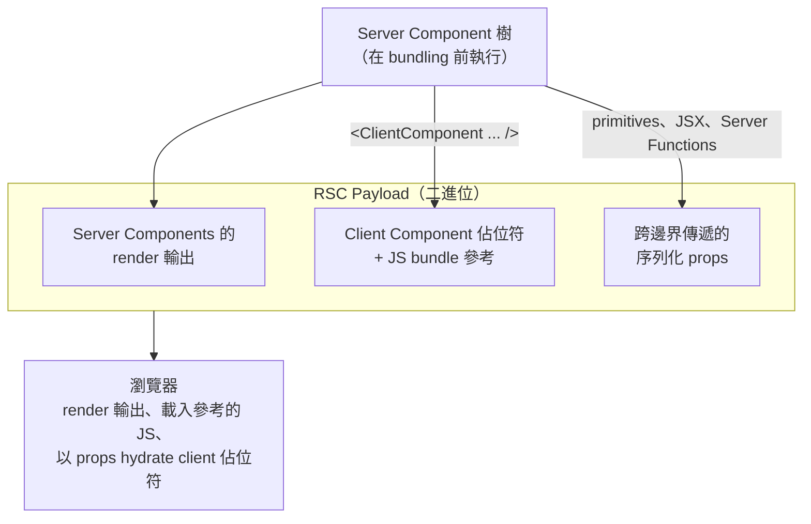

# [FEE-618] React Server Components：狀態邊界

:::info
React Server Components（RSC）在 client bundle 之外執行，因此除非有明確的 `'use client'` 指令開啟邊界，否則它們所觸及的任何 module 都不會送到網路上。狀態、effect 與事件處理器只存在於該邊界的 client 端；在 server 端則可在 render 過程中進行非同步資料存取。本文說明哪些東西能跨越邊界、哪些不能，以及如何避免帶有狀態的邏輯污染一棵原本應留在 server 上的樹。
:::

## 背景

React 文件將 Server Components 描述為一種「在 bundling 前、於與你的 client app 或 SSR server 分離的環境中提前 render」的元件型別（[react.dev/reference/rsc/server-components](https://react.dev/reference/rsc/server-components)）。同一份參考文件指出兩種執行時機：「Server Components 可以在你的 CI server 上於 build 時執行一次，或是針對每個請求由 web server 執行。」由於它們在 bundling 之前 render，其輸出不會包含在 JavaScript bundle 中。

2023 年 React Labs 的文章從資料存取角度切入：「Server Components 可在 build 期間執行，讓你讀取檔案系統或抓取靜態內容。它們也可以在 server 上執行，讓你不必先建立 API 就能存取資料層」（[react.dev/blog/2023/03/22](https://react.dev/blog/2023/03/22/react-labs-what-we-have-been-working-on-march-2023)）。非同步 Server Component 可以直接在 render 中 `await`。

代價是 Server Components 沒有 client lifecycle。同一份 React 參考文件寫道：「Server Components 不會送到瀏覽器，因此無法使用像 `useState` 這類互動式 API。」`useEffect` 也基於同樣理由無法使用。

RSC 是「一份適用於相容 React frameworks 元件的規格」（React Labs，2023 年 3 月）。Frameworks 與 bundlers，例如 Next.js App Router、Waku 與 Vite plugins，會實作該規格；React 套件本身並未提供能端到端掛載 RSC 的 runtime。

## 情境

設想一個 Next.js App Router 頁面，render 一個產品詳細頁面布局：標題從資料庫取得的 header、從 CMS 讀取的描述區塊、由 server 端分頁的評論清單，以及一個需要 `useState` 來追蹤 in-flight 樂觀更新的「加入購物車」按鈕。如果為了滿足按鈕的 hook 而把整個頁面 module 標記為 `'use client'`，每個被 import 的部分（產品 fetcher、CMS adapter、評論清單）都會連同其遞移依賴一起搬進 client bundle。即使資料存取 module 的結果不需要在瀏覽器重新 render，這些 module 還是會送到瀏覽器。

修法是讓頁面留在 server，並把按鈕隔離成自己的 client 標記 module。本文其餘部分說明邊界允許什麼，以及哪些模式能讓帶狀態的邏輯保持在葉節點。

## 最佳實踐

- **必須**將 `'use client'` 指令範圍限縮到最小的互動葉節點。Next.js 文件建議：「為了縮小 client JavaScript bundle，請將 `'use client'` 加到特定的互動元件上，而不是把 UI 的大片區塊都標為 Client Components」（[nextjs.org/docs/app/getting-started/server-and-client-components](https://nextjs.org/docs/app/getting-started/server-and-client-components)）。
- **必須**把 `'use client'` 視為 module graph 的邊界。React 參考文件指出，它「在 module 依賴樹中引入一個 server-client 邊界，實際上建立出一棵 Client modules 的子樹」（[react.dev/reference/rsc/use-client](https://react.dev/reference/rsc/use-client)）。該指令會作用於它出現的檔案以及該檔案 import 的所有內容。
- **必須**考量遞移性的 client 評估。同一份參考文件寫道：「當一個標記了 `'use client'` 的檔案被 Server Component import 時，相容的 bundlers 會把該 module import 視為 server-run 與 client-run 程式碼之間的邊界。作為 `RichTextEditor` 的依賴，`formatDate` 與 `Button` 也會在 client 上被評估，無論其 module 是否包含 `'use client'` 指令。」
- **應該**使用 `'use server'` 把非同步的 server 邏輯暴露給 client 端呼叫者。React 參考文件：「在非同步 function body 頂端加上 `'use server'` 即可把該 function 標記為可由 client 呼叫。我們稱這些 function 為 Server Functions」（[react.dev/reference/rsc/use-server](https://react.dev/reference/rsc/use-server)）。
- **必須不**假設 `'use client'` 會讓元件不參與 server-side rendering。Josh Comeau 的 RSC 教學糾正這個誤解：「我們仍然依靠 Server Side Rendering 產生初始 HTML。React Server Components 在此之上更進一步，讓我們可以把某些元件從 client-side JavaScript bundle 中省略」（[joshwcomeau.com/react/server-components](https://www.joshwcomeau.com/react/server-components/)）。

## 設計思維

關於 RSC 最常見的混淆是把 `'use client'` 解讀成「這個元件略過 SSR」。Comeau 的文章直接反駁：「我們仍然依靠 Server Side Rendering 產生初始 HTML。React Server Components 在此之上更進一步，讓我們可以把某些元件從 client-side JavaScript bundle 中省略。」Server-side rendering 仍然會為 client 元件產生初始 HTML；該指令只決定原始 module 是否要打包成 JavaScript 用於 hydration。

RSC 的設計意圖建立在這個基礎上。SSR 本來就在 server 上執行；RSC 新增的是一類元件，其原始程式碼完全不會跨越網路。Bundle 縮減來自於你把邊界推得多深。把 `'use client'` 看作純粹的 hydration 標記（一個「這個葉節點需要 client 上的 JavaScript」開關），可以讓心智模型與 bundler 對待 module graph 的方式保持一致。

## 深入探討

Next.js 文件把 framework 實際在邊界間傳輸的內容描述為 RSC Payload：「一份已 render 的 React Server Components 樹的緊湊二進位表示……[其中包含] Server Components 的 render 結果、Client Components 應被 render 的位置佔位符與其 JavaScript 檔案的參考、Server Component 傳遞給 Client Component 的任何 props」（[nextjs.org/docs/app/getting-started/server-and-client-components](https://nextjs.org/docs/app/getting-started/server-and-client-components)）。

因此有三個部分。Server 端 render 的輸出已經是解析完成的 UI，亦即執行非同步 Server Components 的結果，包含任何 `await` 過的資料。佔位符標示出 client 元件應在何處出現，並搭配瀏覽器必須載入以 hydrate 這些位置的 JS chunk 參考。序列化後的 props 則是 server 端父元件交給每個 client 子元件的值；它們隨 payload 一同傳送，使 hydration 不需另外發起一次資料抓取就能取得所需資料。

這個格式讓邊界在 runtime 可被觀察。Server 資料變動時會重新 render server 輸出並送出新的 payload；除非底層 client module 改變，否則跨越這些 render 的 client 元件參考會保持穩定。

## 圖解



## 範例

Next.js 文件的常見模式：「一個 `<Cart>` 元件在 server 上抓取資料，置於使用 client 狀態切換顯示與否的 `<Modal>` 元件之內」（[nextjs.org/docs/app/getting-started/server-and-client-components](https://nextjs.org/docs/app/getting-started/server-and-client-components)）。Modal 擁有開／關狀態，Cart 擁有資料抓取。它們在中間相遇的方式，是把 server 的 cart 當作 `children` 傳入。

`app/components/Modal.tsx`（client）：

```tsx
'use client';

import { useState, type ReactNode } from 'react';

export function Modal({ children }: { children: ReactNode }) {
  const [open, setOpen] = useState(false);
  return (
    <>
      <button onClick={() => setOpen(true)}>Open cart</button>
      {open && (
        <div role="dialog">
          <button onClick={() => setOpen(false)}>Close</button>
          {children}
        </div>
      )}
    </>
  );
}
```

`app/cart/page.tsx`（server）：

```tsx
import { Modal } from '../components/Modal';
import { db } from '../lib/db';

async function Cart() {
  const items = await db.cart.findMany();
  return (
    <ul>
      {items.map((item) => (
        <li key={item.id}>{item.name} — {item.qty}</li>
      ))}
    </ul>
  );
}

export default function CartPage() {
  return (
    <Modal>
      <Cart />
    </Modal>
  );
}
```

`Modal` 是一個持有 `useState` 的 client 元件。`Cart` 是一個 `await` 資料庫的 server 元件。頁面是組合這兩者的 server 元件。Cart 的資料抓取永遠不會進入 client bundle；只有 modal 的互動性會。

## 將狀態提升到 RSC 之上

邊界有序列化規則。React 參考文件列出哪些可作為 props 從 server 跨到 client：「Primitives [string, number, bigint, boolean, undefined, null, symbol]、含有可序列化值的 Iterables [String, Array, Map, Set, TypedArray 與 ArrayBuffer]、[Date]、Plain [objects]、屬於 [Server Functions] 的 Functions、Client 或 Server Component 元素（JSX）、[Promises]」（[react.dev/reference/rsc/use-client](https://react.dev/reference/rsc/use-client)）。以及哪些不行：「未從 client 標記 module 匯出或未以 [`'use server'`] 標記的 [Functions]、[Classes]、屬於任何 class（除了上述內建）實例的 Objects、未在全域註冊的 Symbols。」

不對稱之處在於：只有 Server Functions 能作為可呼叫物跨越邊界。定義在 server 上的純函式參考無法作為 prop 傳給 client 元件，因為沒有相應的傳輸機制；Server Function 可以，因為該指令會將其註冊為跨邊界呼叫的對象。Server Function 的回傳值受同樣限制：「支援的可序列化回傳值與邊界 Client Component 的可序列化 props 相同」（[react.dev/reference/rsc/use-server](https://react.dev/reference/rsc/use-server)）。React 元素、純函式與任意 class instance 都無法回傳給呼叫者。

讓邊界可生活的組合規則：Server Component 可作為 prop（通常是 `children`）傳入 Client Component。Next.js 文件：「你可以把 Server Components 作為 prop 傳給 Client Component。這讓你能在視覺上將 server-rendered UI 嵌套於 Client 元件之內」（[nextjs.org/docs/app/getting-started/server-and-client-components](https://nextjs.org/docs/app/getting-started/server-and-client-components)）。Client 父元件不會把 server 子元件當作 module import；它只會 render 被交付的 JSX。Server 子元件的原始碼留在 server，client 父元件的 JS bundle 也維持小巧。

這就是「將狀態提升到 RSC 之上」的槓桿。當一棵樹混合 server 資料與 client 互動時，問題在於哪個元件擁有 `useState`。如果答案是深處的葉節點，周圍的樹便能留在 server；如果答案是根節點，整棵樹都會被編譯進 client bundle。Comeau 的 pluck 模式示範這個改寫：「我們把 color-management 的東西抽到自己的元件裡，搬到自己的檔案中……我們可以從 `Homepage` 移除 `'use client'` 指令，因為它不再使用狀態或任何其他 client-side React 功能」（[joshwcomeau.com/react/server-components](https://www.joshwcomeau.com/react/server-components/)）。帶狀態的邏輯從 layout 抽出，放進 layout 所 render 的同層 client 元件；layout 拿掉 `'use client'`，回到 server 上執行。

該模式可與前一節的 children-slot 範例組合：在葉節點放 client 互動外殼、其上放 server 資料，並由 server 父元件把資料當作 `children` 傳入，而非透過必須序列化的 props 路由。

## 內部參考

- [FEE-616 — React 19 Form State](/zh-tw/State%20Management/616) 涵蓋從 client 表單處理器呼叫 Server Functions 的情境，與本文相同的 `'use server'` 機制套用於表單驅動的變更。
- [FEE-613 — TanStack Query](/zh-tw/State%20Management/613) 從純 client 角度處理 server state 快取，與 RSC 在 server 上 render 的取徑形成對照。

## 參考資料

- React Team, "Server Components," React reference (n.d.). https://react.dev/reference/rsc/server-components
- React Team, "'use client' directive," React reference (n.d.). https://react.dev/reference/rsc/use-client
- React Team, "'use server' directive," React reference (n.d.). https://react.dev/reference/rsc/use-server
- React Team, "Server Functions," React reference (n.d.). https://react.dev/reference/rsc/server-functions
- React Team, "React Labs: What We've Been Working On — March 2023," React blog (2023). https://react.dev/blog/2023/03/22/react-labs-what-we-have-been-working-on-march-2023
- Vercel, "Server and Client Components," Next.js documentation (n.d.). https://nextjs.org/docs/app/getting-started/server-and-client-components
- Josh Comeau, "Making Sense of React Server Components," joshwcomeau.com (2023). https://www.joshwcomeau.com/react/server-components/
- Vercel, "Server and Client Components," Next.js Foundations (n.d.). https://nextjs.org/learn/react-foundations/server-and-client-components
