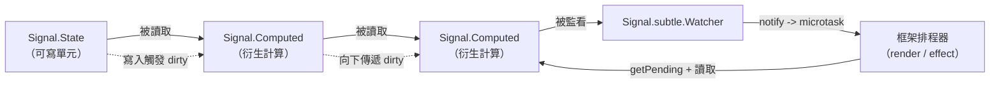

# [FEE-612] TC39 Signals 提案

:::info
TC39 Signals 提案將單一響應式原語推進至 JavaScript 語言層級，使各框架不再各自打造同一概念的客製版本。此提案於 2024 年 4 月 TC39 議程上達到 Stage 1，整合了來自 Angular、Bubble、Ember、FAST、MobX、Preact、Qwik、RxJS、Solid、Starbeam、Svelte、Vue、Wiz 維護者的設計意見。公開介面包含可寫單元的 `Signal.State`、衍生計算的 `Signal.Computed`，以及供框架整合使用的受控 `Signal.subtle` 命名空間。求值採用拉取式（pull-based）且無 glitch，目前唯一可使用此 API 的途徑為官方 `signal-polyfill` 套件。
:::

## 背景

Signals 於 2024 年 4 月 TC39 議程上進入 Stage 1，並在多個框架中持續進行原型驗證的同時維持於 Stage 1（proposal-signals/proposal-signals，README）。當前草案整合了所有主要響應式框架作者與維護者的設計意見，提案中列出 Angular、Bubble、Ember、FAST、MobX、Preact、Qwik、RxJS、Solid、Starbeam、Svelte、Vue、Wiz「以及更多」，這是首次有框架響應式原語在語言層級上達成一致（proposal-signals README）。公開 API 拆解為三個部分：用於可寫單元的 `Signal.State(value)`、用於沿圖傳遞衍生計算的 `Signal.Computed(callback)`，以及用於底層整合 hook 的受控 `Signal.subtle` 命名空間（signal-polyfill README）。`subtle` 命名空間對應 `crypto.subtle` 的設計：將進階功能放在刻意設立的屏障之後，因此應用程式碼會使用 `State` 與 `Computed`，而框架作者則會使用 `Watcher`（proposal-signals README）。

## 情境

某位函式庫作者希望發佈一個響應式資料層，例如 query cache、表單引擎、線上狀態 client，並讓它能與 Solid、Vue、Preact、Angular 與 Lit 互通。當前該作者必須在三條路中選擇：選定一個 runtime（將函式庫綁死於某個框架的響應式系統）、重新發明推送式變更通知（並重新爭辯 glitch 問題），或發佈 N 套轉接層。Signals 提案正是針對此情境提出方案，將每個框架本來就會打造的原語標準化，使單一整合即涵蓋整個生態系（lit.dev，「Signals」，2024）。

## 最佳實踐

- **必須**將 `Signal.subtle` 視為應用程式碼禁區。Polyfill README 明確指出：「These APIs are not targeted at application-level code, but rather at framework/library authors.」應用層介面僅使用 `Signal.State` 與 `Signal.Computed`（signal-polyfill README）。
- **必須**避免將 `signal-polyfill` 部署至 production。其 README 開頭即聲明：「This polyfill is a preview of an in-progress proposal and could change at any time. Do not use this in production.」設計上僅供預覽（signal-polyfill README）。
- **應該**在組合 computed 時依賴一致性保證：「A computed Signal always observes the Signal graph in a consistent state, and its execution is not interrupted by other Signal-mutating code (except for things it calls itself).」整張圖不會出現中介撕裂（intermediate-tearing）狀態（proposal-signals README）。
- **應該**依賴 glitch-freeness，避免再疊一層手動去重邏輯。根據 README：「Computation is 'glitch-free', meaning no unnecessary calculations are ever performed」，衍生 signal 永遠不會在輸入處於不一致快照時重新計算（proposal-signals README）。

## 設計思維

TC39 之所以接手 signals，源自各框架獨立趨同至同一原語的設計現實。Angular、Vue、Preact、Solid、Svelte、MobX、Qwik、Starbeam 等各自發佈了自家的響應式單元加衍生對組；Lit 在介紹 signals 的部落格文中描述代價：「Standardized signals in JavaScript would let us build just one integration (and eventually add signals support directly in Lit's core), and enable interop between signal-using libraries」（lit.dev，2024）。提案接受的取捨在於範圍紀律。藉由收斂為 `State`、`Computed` 與受控 `subtle` 命名空間，提案將非同步語意、渲染整合與 effect 排程策略推出語言介面之外。這些政策由框架擁有；語言則擁有依賴圖與一致性保證。趨同的設計重點，亦即拉取式、惰性、glitch-free，從這個職責分工自然導出。

## 深入探討

求值採用拉取式並結合急切失效（eager invalidation）。提案 README 指出：「Computations are not eagerly evaluated when they are declared, nor are they immediately evaluated when their dependencies change. They are only evaluated when their value is explicitly requested」（proposal-signals README）。對 `Signal.State` 進行寫入會立刻將相依的 `Signal.Computed` 節點標記為 dirty，重算則延遲到讀取發生時才進行。README 闡述為何拉取式對 UI 優於推送式：「Signals avoid this dynamic by being pull-based, rather than push-based: At the time the framework schedules the rendering of the UI, it will pull the appropriate updates, avoiding wasted work both in computation as well as in writing to the DOM」（proposal-signals README）。框架整合層位於 `Signal.subtle.Watcher`。Watcher 註冊一個 notify callback，當其追蹤集合中任一 signal 首次轉為 dirty 時觸發；README 描述為：「Add these signals to the Watcher's set, and set the watcher to run its notify callback next time any signal in the set (or one of its dependencies) changes」（proposal-signals README）。dirty 集合透過 `Watcher.getPending()` 查詢，其作用為：「Returns the set of sources in the Watcher's set which are still dirty, or is a computed signal with a source which is dirty or pending and hasn't yet been re-evaluated」（proposal-signals README）。

## 圖解



此圖呈現 Lit 在 signals 文章中的核心論點：單一共享原語能將 N 套框架專屬整合收斂為一套。Lit 直接基於標準 polyfill 打造 `SignalWatcher` 來證明這一點：「we just use the `SignalWatcher` mixin in our Custom Element definition; any signals we read from will automatically be observed, triggering updates whenever their values change」（lit.dev，2024）。

## 範例

提案 README 提供一個 counter 範例，展示衍生計算如何串接而無需顯式訂閱接線：

```js
const counter = new Signal.State(0);
const isEven = new Signal.Computed(() => (counter.get() & 1) == 0);
const parity = new Signal.Computed(() => isEven.get() ? "even" : "odd");
```

`parity` 讀取 `isEven`，`isEven` 讀取 `counter`。沒有 `subscribe()`、沒有 observer 註冊、沒有手動依賴宣告。呼叫 `counter.set(1)` 將 `isEven` 標為 dirty；讀取 `parity.get()` 沿圖走訪，先計算 `isEven` 一次，再計算 `parity`（proposal-signals README）。

## Polyfill 整合模式

`signal-polyfill` 套件目前是使用此 API 的唯一途徑（signal-polyfill README），其 README 提供了標準的 `effect()` 配方供框架接入：

```js
let needsEnqueue = true;

const w = new Signal.subtle.Watcher(() => {
  if (needsEnqueue) {
    needsEnqueue = false;
    queueMicrotask(processPending);
  }
});

function processPending() {
  needsEnqueue = true;

  for (const s of w.getPending()) {
    s.get();
  }

  w.watch();
}
```

整合形式由提案固定：

1. 為每個排程邊界（一個 renderer、一個 effect 群組、一個 hydration root）建立一個 `Signal.subtle.Watcher`。
2. 將該邊界關注的 signals 加入 Watcher 的集合；當其中任一 signal 首次轉為 dirty 時，notify callback 觸發（proposal-signals README，Watcher 語意說明）。
3. 在 notify 內以 `needsEnqueue` 旗標搭配 `queueMicrotask` 進行去抖，使 Watcher 在同一個 tick 中無論發生多少寫入，每個 microtask 僅觸發一次（signal-polyfill README）。
4. 在 microtask 中走訪 `w.getPending()`，對每個項目呼叫 `.get()` 以重算，再呼叫 `w.watch()` 為下一次 dirty 轉換重新武裝 Watcher（proposal-signals README，`getPending` 說明）。
5. 將新值交給框架自身的渲染或 effect 機制。提案的職責止於依賴圖；渲染屬於框架（proposal-signals README，拉取式排程說明）。

Lit 端到端示範了此模式：`SignalWatcher` 是一個 mixin，內部負責步驟 1 至 4，步驟 5 即為「在 host element 上觸發更新」（lit.dev，2024）。

## 內部參考

- FEE-611 — 使用者層的框架 signals（Solid、Vue、Preact、Angular），TC39 提案將其抽象為單一原語。
- FEE-600 — State Management 類別總覽；將 signals 定位於各替代方案之中。

## 參考資料

- TC39, "Signals Proposal," GitHub (2024). https://github.com/tc39/proposal-signals
- TC39, "Signals Proposal README," GitHub (2024). https://github.com/tc39/proposal-signals/blob/main/README.md
- proposal-signals, "signal-polyfill," GitHub (2024). https://github.com/proposal-signals/signal-polyfill
- proposal-signals, "signal-polyfill README," GitHub (2024). https://github.com/proposal-signals/signal-polyfill/blob/main/README.md
- Lit team, "Signals," lit.dev (2024). https://lit.dev/blog/2024-10-08-signals/
