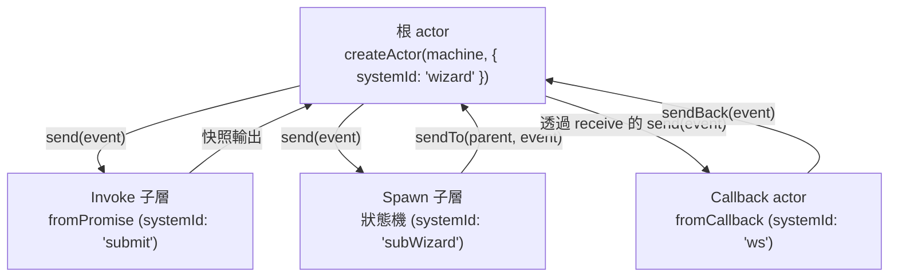

# [FEE-614] XState v5：Actor 模型

:::info
XState v5 將 actor 提升為其基礎的執行期抽象：執行中的狀態機就是一個 actor，僅透過非同步訊息傳遞與外界溝通，藉由內部信箱依序處理事件，並封裝狀態使得變更只能由內部發起。函式庫提供五種 actor 邏輯類型（狀態機、promise、callback、observable、transition），並以單一介面統一暴露 `send`、`subscribe` 與 `getSnapshot`。當應用程式中每個執行單元都是具備穩定身分的 actor 時，父子協調、非同步工作與可觀測性將從三個獨立問題收斂為同一個問題。
:::

## 背景

Stately 的 v5 文件以 actor 模型作為核心執行期概念來重新框定 XState。「當你在 XState 中執行一個狀態機，它就成為 actor。Actor 透過非同步發送與接收事件來與其他 actor 溝通」（Stately, "Actor model"）。每個 actor 擁有自己的信箱：「Actor 一次處理一則訊息。它們具備內部『信箱』作為事件佇列，依序處理事件」（Stately, "Actors"）。封裝是嚴格的：「actor 擁有自己內部、封裝的狀態，只能由 actor 自身更新」，且「actor 共享資料的唯一方式是發送事件」（Stately, "Actor model"）。在這些不變式之上，v5 內建五種 actor 邏輯類型：狀態機、promise、callback、observable 與 transition（Stately, "Actors"）。它們合在一起，將一次性非同步工作、串流、雙向橋接與純 reducer 全部收進同一份執行期契約。

## 情境

某個 React 應用程式以 `useReducer` 實作多步驟表單精靈。新需求接連湧入：每個步驟提交至不同後端（部分回傳 promise，部分透過 WebSocket 串流），其中一個步驟會開啟子精靈，子精靈必須在父層於步驟之間切換時持續存活，團隊還需要一個能記錄每次轉移的 devtools 面板。`useReducer` 對 invoke 非同步沒有對應做法，沒有方式建模能跨越單一狀態存活的子精靈，也沒有內建的可觀測性。XState v5 將上述每項需求對應到 actor：父層精靈狀態機 invoke 一個 `fromPromise` actor 處理一次性提交、spawn 一個跨越數個步驟存活的子精靈 actor，並透過 `systemId` 註冊每個 actor，讓 inspector 能將轉移事件串流給 devtools。

## 最佳實踐

- **必須**將每個執行單元視為 actor，僅透過其公開介面與其互動——`actor.send(event)`、`actor.subscribe(observer)`、`actor.getSnapshot()`（Stately, "Actors"）。
- **必須**在從 v4 遷移到 v5 時，將 `interpret(machine)` 的呼叫位置改名為 `createActor(machine, options)`；該函式已重新命名（Stately, "Migration"）。
- **應該**使用 `setup({ types, actors, actions, guards })` 宣告型別化機器，並在該處傳入實作來源，而非作為 `createMachine` 的第二個參數（Stately, "Setup"）。
- **應該**將跨領域的 actor 以 `systemId` 註冊，讓其他 actor 透過 `system.get('actorId')` 取得，而非把 `ActorRef` 串接於 context 中（Stately, "System"）。
- **必須**在轉移到 v5 時更新 v4 模式：將 `cond` 改名為 `guard`、將 `schema` 改名為 `types`、以 `raise(...)` 取代自我事件的 `send(...)` 或以 `sendTo(...)` 取代指定目標的發送，並在實作函式中改以 `{ context, event }` 作為單一物件參數（Stately, "Migration"）。

## 設計思維

v5 文件刻意捨棄 v4 的「service」術語，並以「actor」作為標準（研究筆記）。這項調整的份量超越單純改名：v4 中「service」是帶有旁通通道的已詮釋狀態機，v5 中 actor 是唯一的概念，訊息傳遞為唯一的變更通道。文件指出：「actor 共享資料的唯一方式是發送事件」（Stately, "Actor model"）。這項約束以直接呼叫的便利性換取兩個性質：每次跨 actor 互動都能以事件被觀測，且每個 actor 都能獨立推理，因為其狀態僅在回應信箱時改變。五種內建邏輯類型（Stately, "Actors"）即成為同一份契約的特化形式，使得基於 promise 的 fetch 與長存的狀態機能在同一個監督樹下接入，無須客製接線。

## 深入探討

並非每種 actor 邏輯類型都是雙向的。Promise 與 observable actor 為唯收：「對 promise actor 發送事件不會有任何效果」與「對 observable actor 發送事件不會有任何效果」（Stately, "Actors"）。當子層需要將事件推回父層時，使用 callback 邏輯搭配 `fromCallback(({ sendBack, receive, input }) => { ... })`，用於「需要雙向溝通的 callback-based actor」（Stately, "Migration"）；該 callback 閉包持有 `sendBack` 以向上發送事件，並以 `receive` 接收來自父層的事件。在可觀測性方面，`createActor(machine, options)` 接受 `inspect` callback。「當你將 `inspect` 選項傳入 XState 的 `createActor(machine, options)` 函式 actor 選項時，它會自動發送所有這些檢查事件」，且「目前共發送三類事件：actor 建立事件、actor 對 actor 通訊事件、actor 快照變更」（Stately, "Inspector"）。Inspector hook 是 devtools、結構化日誌與重播工具的官方支援整合點。

## 圖解



根 actor 由 `createActor(actorLogic)` 建立，後者「隱性建立一個 actor 系統，其中所建立的 actor 為根 actor」（Stately, "Actors"）。子層在自己的 `systemId` 下註冊，箭頭顯示連結它們的訊息通道。

## 範例

以 `setup` 宣告型別化精靈狀態機，搭配兩種子 actor 邏輯（`fromPromise` 處理一次性提交、`fromCallback` 作為雙向 WebSocket 橋接）：

```ts
import { setup, fromPromise, fromCallback, createActor, assign } from 'xstate';

const submitForm = fromPromise(async ({ input }: { input: { payload: unknown } }) => {
  const res = await fetch('/api/submit', {
    method: 'POST',
    body: JSON.stringify(input.payload),
  });
  return res.json();
});

const wsBridge = fromCallback(({ sendBack, receive }) => {
  const socket = new WebSocket('wss://example.test/wizard');
  socket.onmessage = (e) => sendBack({ type: 'WS_MESSAGE', data: e.data });
  receive((event) => {
    if (event.type === 'PUBLISH') socket.send(JSON.stringify(event.payload));
  });
  return () => socket.close();
});

const wizard = setup({
  types: {} as {
    context: { result: unknown };
    events: { type: 'SUBMIT'; payload: unknown } | { type: 'PUBLISH'; payload: unknown };
  },
  actors: { submitForm, wsBridge },
}).createMachine({
  id: 'wizard',
  initial: 'editing',
  context: { result: null },
  invoke: { src: 'wsBridge', systemId: 'ws' },
  states: {
    editing: {
      on: { SUBMIT: 'submitting' },
    },
    submitting: {
      invoke: {
        src: 'submitForm',
        systemId: 'submit',
        input: ({ event }) => ({ payload: (event as any).payload }),
        onDone: {
          target: 'done',
          actions: assign({ result: ({ event }) => event.output }),
        },
      },
    },
    done: { type: 'final' },
  },
});

const actor = createActor(wizard, { systemId: 'wizardRoot' });
actor.start();
```

setup 函式承載型別化來源，呼應「將 action、actor、guard 等來源從 `createMachine(config, sources)` 的第 2 個參數移至 `setup({ ... })`」（Stately, "Setup"）。`createActor(machine, { systemId })` 遵循 system 文件：「系統的根可在 `createActor(...)` 函式中被明確賦予 `systemId`」，且「invoke 的 actor 在 `invoke` 物件中以系統範圍的 `systemId` 註冊」（Stately, "System"）。`fromCallback` 橋接遵循遷移指南中雙向 callback actor 的模式（Stately, "Migration"）。

## Actor 生命週期：invoke 與 spawn

`invoke` 將 actor 的存活期綁定至宣告它的狀態。「被 invoke 的 actor 會在進入該狀態時啟動，並在離開該狀態時停止」（Stately, "Invoke"）。當工作歸屬於單一狀態時，這項生命週期耦合是合適的預設，例如綁定於 `loading` 狀態的 fetch 或綁定於 `streaming` 狀態的訂閱。

當生命週期不再屬於單一狀態時，改用 `spawn`。Spawn 文件直白地列出這些情境：「有時 invoke actor 對你的需求而言彈性不足。例如，你可能想要：invoke 跨越*數個*狀態存活的子機器〔或〕invoke *動態數量*的 actor」（Stately, "Spawn"）。Spawn 的 actor 以 `ActorRef` 值存放於 `context` 中，因此父層可在轉移之間 `sendTo` 它們，並儲存任意集合。

該彈性附帶清理義務。Spawn 的 actor 不會自動停止：「若使用 `spawn`，**請確保在 spawn 的 actor 不再需要時，從 `context` 移除 ActorRef，以防止記憶體洩漏**」（Stately, "Spawn"）。標準模式為以一個 action 停止 spawn 的 actor，並在其工作結束後將 ref 從 context 中 assign 移除。

`invoke` 與 `spawn` 兩者皆接受 `systemId`，使 spawn 與 invoke 的子層皆能透過 `system.get('actorId')` 取得（Stately, "System"）。根 actor 的 `systemId` 透過 `createActor(machine, { systemId })` 設定，作為系統其餘部分讀取的註冊表錨點。

## 內部參考

- [Reactive Framework Signals](/zh-tw/State%20Management/611) — 對照 signal 模型與狀態圖驅動的 actor。
- [React 19 Form State and Actions](/zh-tw/State%20Management/616) — 對照 `useActionState` 生命週期與 invoke 的非同步 actor。

## 參考資料

- Stately, "Actor model," Stately Docs (n.d.). https://stately.ai/docs/actor-model
- Stately, "Actors," Stately Docs (n.d.). https://stately.ai/docs/actors
- Stately, "System," Stately Docs (n.d.). https://stately.ai/docs/system
- Stately, "Invoke," Stately Docs (n.d.). https://stately.ai/docs/invoke
- Stately, "Spawn," Stately Docs (n.d.). https://stately.ai/docs/spawn
- Stately, "Setup," Stately Docs (n.d.). https://stately.ai/docs/setup
- Stately, "Migration from XState v4 to v5," Stately Docs (n.d.). https://stately.ai/docs/migration
- Stately, "Inspector," Stately Docs (n.d.). https://stately.ai/docs/inspector
