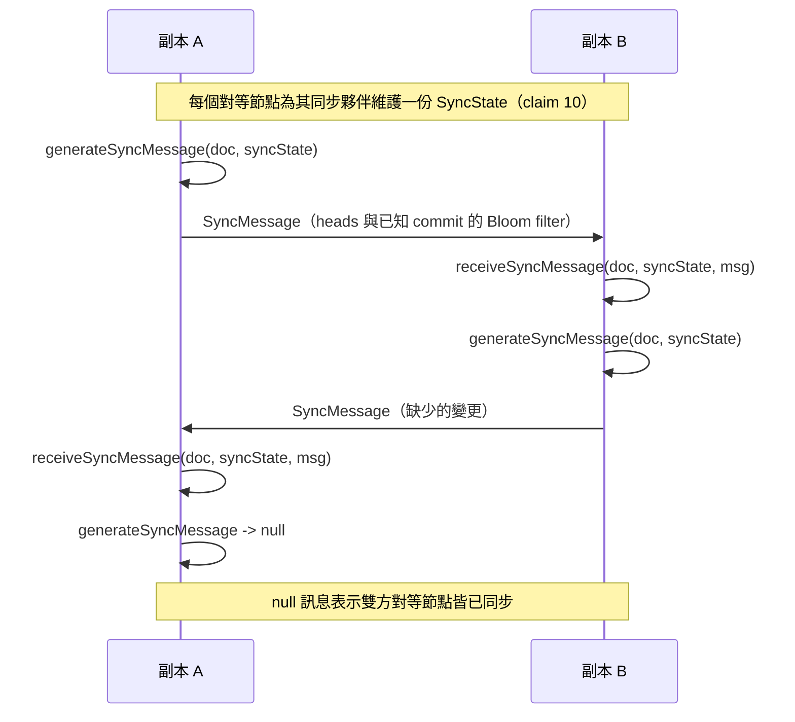

# [FEE-615] CRDT 協作狀態（Yjs 與 Automerge）

:::info
無衝突複製資料型別（Conflict-free Replicated Data Types, CRDTs）提供具備結合律、交換律與冪等律的合併函式，使得並行的副本得以在無需協調的情況下收斂（Shapiro et al., Inria HAL）。本文涵蓋兩個適用於瀏覽器、可投入正式環境的 CRDT 實作：Yjs 是高效能的共享型別函式庫，「網路無關（network agnostic）」並能在不論更新順序的情況下完成合併；Automerge 則是類 JSON 的 CRDT 加上同步引擎，明確以「以關聯式資料庫支援伺服器應用的方式，支援本機優先（local-first）應用」為目標。當需求是離線可容忍的收斂時選擇 CRDTs，而對於唯一性或容量上限這類非匯合（non-confluent）不變式，必須另外搭配獨立的協調機制。
:::

## 背景

CRDT 理論由 Shapiro、Preguica、Baquero 與 Zawirski 於 Inria 提出形式化定義：一種半格（join-semilattice）合併運算，滿足「交換律（x ⊔v y = y ⊔v x）、冪等律（x ⊔v x = x）以及結合律」，使得獨立的副本得以在沒有鎖的情況下收斂（claim 1）。Yjs 將此理論落實到瀏覽器：其共享型別「能被操作、會在變更發生時觸發事件，並且能在沒有合併衝突的情況下自動合併」，並且該函式庫是「網路無關」的，因此「只要所有變更最終都會抵達，文件就會收斂，不論更新順序或所使用的網路技術為何」（claim 2）。Automerge 採取互補路徑，定位自己是「一種類 JSON 的資料結構（CRDT），可由不同使用者並行修改並再次自動合併」，其宣示目標是「以關聯式資料庫支援伺服器應用的方式，支援本機優先應用」（claim 8）。此種定位來自 Ink & Switch 的 local-first 文章，將「你本機裝置上的資料副本……視為主要副本。伺服器仍然存在，但它們持有的是次要副本」（claim 11）。正是這種架構上的反轉，才使得在瀏覽器內運行 CRDT 具有正當性。

## 情境

一個多使用者文件編輯器必須在筆電於航班中離線時持續可用，必須在兩位協作者於不同城市同時編輯同一段落時持續可用，並且必須在中央中繼伺服器暫時無法連線時持續可用。應用需要具備型別的共享集合（文字、清單、映射）、線上狀態指示（游標、選取範圍、誰在線上）、本機持久化以便文件在重新載入後仍然存在，以及在長時間斷線後能高效復原的同步協定。團隊希望避免採用集中式的轉換伺服器。Yjs 與 Automerge 都針對此種情境。

## 最佳實踐

- **必須**以函式庫提供的有型別共享集合來建模協作狀態，而非自製的 JSON。Yjs 提供 `Y.Map`、`Y.Array`、`Y.Text`、`Y.XmlFragment`、`Y.XmlElement` 與 `Y.XmlText`；舉例而言「Y.Array：可在任意位置高效插入／刪除元素的可共享類陣列型別。Y.Text：針對共享文字編輯最佳化的可共享型別」（claim 3）。
- **必須**將傳輸與儲存維持為獨立的 provider 關注點。在 Yjs 中這意味著組合多個模組：「y-websocket：包含簡易 websocket 後端與連線到該後端的 websocket 客戶端的模組。y-webrtc：透過 WebRTC 以點對點方式傳播文件更新。y-indexeddb：將文件更新有效率地持久化到瀏覽器的 indexeddb 資料庫」（claim 7）。應用通常會同時組合多個 provider。
- **必須**不要單靠 CRDT 來強制非匯合不變式，例如「不超過 5 個項目」或「同一座位不能重複預訂」。根據 ACM Queue 探討協調的文章：「若兩個節點能各自獨立進行更新且仍保有不變式，則該不變式為匯合的……若所有不變式皆為匯合，應用便能無協調運作；非匯合的不變式則需要協調」（claim 12）。這類不變式必須以獨立的協調機制疊加在上層。

## 設計思維

本機優先翻轉了通常的 client/server 角色：本機副本成為主要副本，伺服器只持有次要副本（claim 11）。一旦接受此種反轉，合併演算法就必須容忍任意長度的網路分區，這也排除了那些需要單一權威紀錄檔的設計。

OT 與 CRDT 的取捨相當直接。根據 TinyMCE 工程部落格的比較：「OT 以複雜度換取捕捉使用者意圖的能力；CRDT 複雜度較低，但僅能保證所有客戶端最終得到相同資料」，而「CRDT 能夠在點對點且具備端對端加密的情境下運作……即便客戶端離線也仍可運作」（claim 14）。當在單一轉換伺服器上捕捉細粒度的使用者意圖是可接受的，便選擇 OT；當必須支援離線運作與點對點傳輸時，則選擇 CRDTs。

Yjs 屬於特定的 CRDT 譜系。Sun et al. 於 2019 年的綜述論文指出：「一個較新的、以墓碑（tombstone）為基礎的 CRDT 解決方案 Yjs 值得關注。Yjs 的特色在於其支援富文本協同編輯的擴充；但其核心是基於 WOOT，並做了若干變化以降低時間與空間複雜度」（claim 15）。WOOT 的譜系塑造了 Yjs 識別項目以及調和並行插入的方式，而富文本擴充則疊加在這個以識別碼為基礎的序列之上。

## 深入探討

Yjs 的子文件（subdocuments）讓一個 Y.Doc 能以延遲載入的方式嵌入父層共享型別之中：「Yjs 文件可以被嵌入到共享型別當中。這讓你能將大量 Yjs 文件管理為某個根文件的一部分」，而且「子文件預設是空的，直到被明確載入為止」（claim 4）。Yjs 也是透過此機制，才能擴展到擁有數千頁的工作區，而不必強制每個客戶端實體化每一頁。

Automerge 的同步輪次通常一次來回即可完成。根據 Kleppmann 的撰文：「除了發送其 heads 的雜湊外，每個節點還會建構一個 Bloom filter，包含其所知曉的 commit 雜湊」，並且「幾乎所有的調和都在一次來回中完成」（claim 13）。Bloom filter 對每個已知 commit 約以 1.25 位元組編碼，因此文件會隨時間增長，但同步時的線上傳輸載荷仍維持較小的規模。

## 圖解



## 範例

一個使用 `generateSyncMessage` 與 `receiveSyncMessage` 的小型 Automerge 同步迴圈。根據 API 文件，該函式回傳「[newSyncState, syncMessage | null]」，並且「回傳的 newSyncState 應取代原本的 state 物件，而 syncMessage 則應傳送給對等節點——除非它是 null，這代表雙方對等節點已完成同步」（claim 9）。每個對等節點「為其同步的每個對等節點維護一份 State」（claim 10）。

```js
import * as Automerge from "@automerge/automerge"

// Each peer keeps its own doc and a SyncState per partner.
let docA = Automerge.from({ items: [] })
let syncStateA = Automerge.initSyncState()

let docB = Automerge.init()
let syncStateB = Automerge.initSyncState()

// One direction of a sync round, A -> B.
function step(fromDoc, fromState, toDoc, toState) {
  const [nextFromState, msg] = Automerge.generateSyncMessage(fromDoc, fromState)
  if (msg === null) {
    // null signals that both peers are already synchronized
    return { fromState: nextFromState, toDoc, toState, done: true }
  }
  const [nextToDoc, nextToState] = Automerge.receiveSyncMessage(toDoc, toState, msg)
  return {
    fromState: nextFromState,
    toDoc: nextToDoc,
    toState: nextToState,
    done: false,
  }
}

// Drive the loop until both directions return null.
let done = false
while (!done) {
  const ab = step(docA, syncStateA, docB, syncStateB)
  syncStateA = ab.fromState
  docB = ab.toDoc
  syncStateB = ab.toState

  const ba = step(docB, syncStateB, docA, syncStateA)
  syncStateB = ba.fromState
  docA = ba.toDoc
  syncStateA = ba.fromState // updated receive state
  done = ab.done && ba.done
}
```

對兩個對等節點之間具備可靠且按序傳遞通道的依賴，是該協定的前提假設：「該實作仰賴兩個對等節點之間可靠且按序的串流，並基於 https://arxiv.org/abs/2012.00472 的學術研究」（claim 10）。

## 合併語意比較

| 面向 | Yjs | Automerge |
| --- | --- | --- |
| 資料型別模型 | 有型別的共享集合：`Y.Map`、`Y.Array`、`Y.Text`、`Y.XmlFragment`、`Y.XmlElement`、`Y.XmlText`，各自帶有具型別的方法（claim 3） | 類 JSON 文件，其中映射、清單與文字各自擁有對應型別的 CRDT 合併（claim 8） |
| Awareness／線上狀態 | 為游標、選取範圍、使用者識別提供獨立的暫態 Awareness CRDT；「Awareness 資訊不會儲存在 Yjs 文件中，因為它無需跨工作階段持久化」（claim 5） | 核心同步協定中未提供內建的 awareness 層（claim 9、10 僅描述文件同步） |
| 線上狀態逾時 | 「若客戶端在 30 秒內未收到遠端對等節點的更新，便將該遠端客戶端標記為離線」，同時兼具線上／離線訊號（claim 6） | 文件化的同步協定中未提供等價的內建 30 秒線上狀態逾時 |
| 同步協定 | 透過 providers 交換更新訊息；函式庫為「網路無關」，因此「文件會收斂，不論更新順序或所使用的網路技術為何」（claim 2） | 對每個夥伴維護 `SyncState`；`generateSyncMessage` 回傳 `[newSyncState, syncMessage \| null]`，null 代表雙方對等節點已同步（claim 9）；Bloom filter 交換通常一次來回即可完成（claim 13） |
| 傳輸假設 | 網路無關：可在 websocket 中繼、WebRTC 點對點，或任何最終會遞送更新的通道上運作（claim 2、7） | 「該實作仰賴兩個對等節點之間可靠且按序的串流」（claim 10） |
| 與 OT 的對照 | CRDT 譜系自 WOOT 衍生，並加上富文本擴充（claim 15）；提供無需集中式轉換伺服器的收斂能力（claim 14） | CRDT 引擎針對離線可容忍的點對點收斂而設計；以 OT 所擅長的較豐富意圖語意換取此特性（claim 14） |

## 內部參考

- [離線優先 IndexedDB](/zh-tw/State%20Management/offline-first-indexeddb)——本機優先的互補面向；CRDT 文件需要本機持久化層（例如 `y-indexeddb`）才能在重新載入後留存（FEE-617）。
- [狀態管理總覽](/zh-tw/State%20Management/600)——分類首頁（FEE-600）。

## 參考資料

- Shapiro, Preguica, Baquero, Zawirski, "A comprehensive study of Convergent and Commutative Replicated Data Types," Inria research report (2011). https://inria.hal.science/inria-00555588/document
- Yjs project, "Yjs Documentation," docs.yjs.dev. https://docs.yjs.dev/
- Yjs project, "Adding Awareness," docs.yjs.dev. https://docs.yjs.dev/getting-started/adding-awareness
- Yjs project, "About Awareness," docs.yjs.dev. https://docs.yjs.dev/api/about-awareness
- Yjs project, "Subdocuments," docs.yjs.dev. https://docs.yjs.dev/api/subdocuments
- Yjs project, "yjs/yjs README," GitHub. https://github.com/yjs/yjs
- Automerge project, "automerge/automerge README," GitHub. https://github.com/automerge/automerge
- Automerge project, "generateSyncMessage API reference," automerge.org. https://automerge.org/automerge/api-docs/js/functions/generateSyncMessage.html
- Automerge project, "Sync module documentation," automerge.org. https://automerge.org/automerge/automerge/sync/index.html
- Martin Kleppmann, "Moving elements in lists, and Bloom filter hash graph sync" (2020). https://martin.kleppmann.com/2020/12/02/bloom-filter-hash-graph-sync.html
- Kleppmann, Wiggins, van Hardenberg, McGranaghan, "Local-first software," Ink & Switch essay (2019). https://www.inkandswitch.com/essay/local-first/
- Sun et al., "Real Differences between OT and CRDT under a General Transformation Framework for Consistency Maintenance in Co-Editors," arXiv preprint (2019). https://arxiv.org/pdf/1905.01517
- TinyMCE engineering, "Real-time collaboration: OT vs CRDT," tiny.cloud blog. https://www.tiny.cloud/blog/real-time-collaboration-ot-vs-crdt/
- Bailis, Fekete, Franklin, Ghodsi, Hellerstein, Stoica, "Coordination Avoidance in Database Systems," ACM Queue. https://queue.acm.org/detail.cfm?id=3546931
