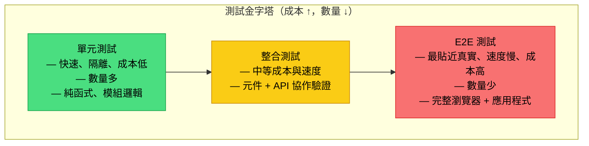
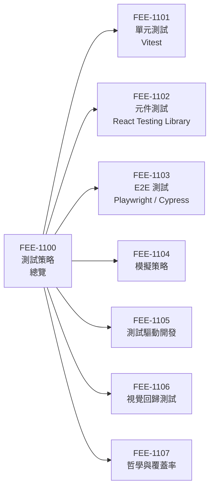

# 測試策略總覽

:::info
本類別涵蓋完整的自動化測試層次 — 從靜態分析、單元測試，到元件測試、整合測試，再到端對端測試 — 並聚焦於各層次之間成本與信心的取捨關係。
:::

## 背景

自動化測試是讓程式碼庫在持續成長的同時保持穩定的核心機制。一套涵蓋行為（而非僅追蹤程式碼行數）的測試套件，能賦予工程師重構、升級相依套件、以及出貨新功能的信心，而無需每次改動後都回頭手動驗證。測試同時也是活的文件：一個命名良好的測試案例，比任何散文式的註解都更精確地傳達模組的預期行為。

前端應用的測試環境在過去十年間有了顯著改變。Vitest、React Testing Library（RTL）、Playwright 等工具大幅降低了在多個層次撰寫快速且有意義測試的成本。這使得細緻的分層策略既實際又必要 — 單一方法（全部都是單元測試，或全部都是 E2E 測試）會在「信心」或「可維護性」兩端留下缺口。

本類別將引導您理解這套分層策略：各測試層次是什麼、何時使用、如何有效組合，以及如何將測試整合進日常開發流程，包括 TDD（測試驅動開發）與 CI 管線。

### 本類別涵蓋內容

- **單元測試** (FEE-1101)：使用 Vitest 測試獨立的函式與模組。
- **元件測試** (FEE-1102)：使用 React Testing Library 對 UI 元件進行隔離測試。
- **端對端測試** (FEE-1103)：使用 Playwright 與 Cypress 測試完整的使用者流程。
- **模擬策略** (FEE-1104)：控制相依性，讓測試保持快速且可預期。
- **測試驅動開發** (FEE-1105)：先寫測試再寫實作，以測試引導設計。
- **視覺回歸測試** (FEE-1106)：透過快照比對捕捉非預期的視覺變化。
- **哲學與覆蓋率** (FEE-1107)：覆蓋率指標、測試信心，以及長期維護策略。

## 設計思維

### 測試金字塔：形狀源自成本

經典的測試金字塔（由 Mike Cohn 提出、Martin Fowler 推廣）定義了三個層次 — 單元、整合、E2E — 並建議多寫單元測試、少寫整合測試、極少寫 E2E 測試。金字塔的形狀並非美觀考量，它直接對應了成本結構：單元測試在毫秒內執行且無需任何基礎設施，整合測試需要協調多個模組且通常涉及網路或資料庫呼叫，E2E 測試則需要啟動真實瀏覽器與運行中的應用程式。成本向上遞增，測試數量應向上遞減。

速度與隔離程度遵循相同的梯度。一個純函式的單元測試在一秒內即可確定性地執行與除錯。一個驅動登入流程的 E2E 測試則依賴網路層、DOM 渲染器、驗證狀態與時序，每一個環節都可能引入不穩定性（flakiness）。金字塔建議減少 E2E 測試，不是因為它們價值較低，而是其維護成本最高。

### 測試獎盃：前端的信心成本比

Kent C. Dodds 提出了測試獎盃（Testing Trophy）作為前端 JavaScript 應用的改良模型。獎盃由底部到頂部分為四層：靜態分析、單元測試、整合測試、E2E 測試 — 但最寬的帶狀區域是整合測試，而非單元測試。其核心原則是：*「測試越貼近軟體被使用的方式，就能給你越高的信心。」*

對於前端元件而言，一個驗證 React hook 內部狀態的單元測試，只告訴你該 hook 在隔離環境下能運作。一個渲染完整元件樹、觸發真實使用者事件、並對 DOM 可見內容進行斷言的整合測試，告訴你元件以使用者會實際體驗的方式正確運作。後者每個測試產生的信心更高，因為它同時驗證了邏輯、渲染與事件處理之間的協作。這就是為什麼測試獎盃將整合測試置於最寬的區段：對大多數前端場景而言，它是信心成本比最高的選擇。

靜態分析 — TypeScript、ESLint、import linting — 位於獎盃底部，而非被視為獨立關切。這些檢查在零執行時成本下捕捉整類型的 bug（型別不符、未定義變數、錯誤的 API 用法）。它們是最廉價的測試形式，應列為不可妥協的基礎。

### 信心與成本：沒有單一層次能滿足一切

兩種模型並不衝突，它們共享一個核心洞見：隨著測試越來越貼近真實使用方式，信心與成本同步提升。正確的策略是將測試分佈於各層次，以平衡兩者。靜態分析低成本捕捉型別錯誤；單元測試精確定位演算法邏輯與邊界條件；整合測試驗證元件與服務之間的協作；E2E 測試確認關鍵使用者旅程（登入、結帳、表單送出）在真實瀏覽器中端對端正常運作。

一套只有單元測試的套件，可能在一個元件靜默渲染空白時全數通過。一套只有 E2E 測試的套件，雖然會捕捉到該失敗，但需要十分鐘才能執行完畢，且產生的堆疊追蹤會指向渲染管線的某處，而非造成失敗的具體函式。各層次是互補而非競爭的關係。

### RTL 對整合層的影響

React Testing Library 刻意不暴露元件內部。你無法透過元件名稱、內部狀態或實作細節進行查詢。你只能透過可見文字、ARIA 角色（roles）與標籤進行查詢 — 這與使用者或輔助技術所使用的信號相同。這個設計在 API 層面強制執行「測試行為而非實作」的原則，這意味著一個基於 RTL 的元件測試，已經是對渲染層、事件系統與無障礙樹（accessibility tree）的整合測試。這就是為什麼 FEE-1102 被定義為元件測試而非單元測試：此工具的設計哲學將其置於獎盃的整合帶。

## 視覺化

### 測試金字塔

### 類別地圖

## 相關 FEE

- [FEE-1101 單元測試 — Vitest](./1101.md)
- [FEE-1102 元件測試 — React Testing Library](./1102.md)
- [FEE-1103 E2E 測試 — Playwright / Cypress](./1103.md)
- [FEE-1104 模擬策略](./1104.md)
- [FEE-1105 測試驅動開發](./1105.md)
- [FEE-1106 視覺回歸測試](./1106.md)
- [FEE-1107 哲學與覆蓋率](./1107.md)
- [FEE-800 建置工具 — CI 中的測試執行器](../Build%20Tooling/800.md)
