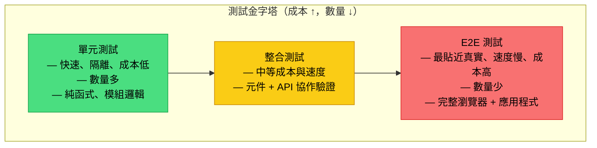
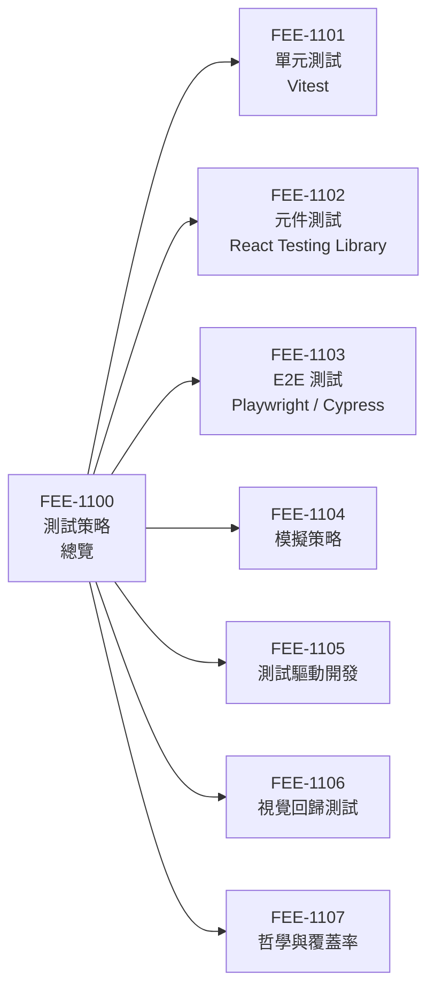

# 測試策略總覽

:::info
本類別涵蓋完整的自動化測試層次 — 從靜態分析、單元測試，到元件測試、整合測試，再到端對端測試 — 並聚焦於各層次之間成本與信心的取捨關係。
:::

## 背景

自動化測試是讓程式碼庫在持續成長的同時保持穩定的核心機制。一套涵蓋行為（而非僅追蹤程式碼行數）的測試套件，能賦予工程師重構、升級相依套件、以及出貨新功能的信心，而無需每次改動後都回頭手動驗證。

具體來說，測試能防止哪些問題？

一次 CSS 重構若重新命名了 class token，可能在不改動任何 JavaScript 的情況下，靜默地破壞元件的版面配置，因為選擇器依賴了一個已不存在的 class 名稱。元件看起來能渲染，在開發者的瀏覽器中（舊 CSS 可能仍被快取）通過了目視檢查，然後帶著問題上線。

一次 API 合約變更 — 例如後端端點將欄位從 `user_id` 改為 `userId` — 可能靜默地破壞表單送出：請求發出去了，伺服器收到格式錯誤的資料，而客戶端因為吞掉了回應而不顯示任何錯誤，使用者完全不知道送出失敗。若沒有測試對請求負載格式或結果 UI 狀態進行斷言，這個回歸在使用者回報前完全不可見。

一次相依套件從第 3 版升到第 4 版，可能改變了日期函式庫處理時區偏移的方式；所有受影響的計算都悄悄地偏移，若沒有一個斷言特定輸入對應特定輸出的測試，這個回歸就會無聲無息地進入正式環境。

這些不是假設情境，而是自動化測試存在的意義：在程式碼抵達使用者之前攔截此類失敗。

測試同時也是活的文件。一個命名良好的測試套件，比任何散文式的註解或 wiki 頁面都更精確地傳達模組的預期行為。當新工程師加入團隊並閱讀付款表單的測試檔案時，他們能了解哪些輸入有效、元件處理哪些錯誤狀態、以及成功送出後會觸發哪些副作用 — 全部不需要執行應用程式。這與閱讀 README 有本質差異，因為測試是可執行的：一旦行為偏移，測試就會失敗，文件也會以一種立即可見的方式宣告自身過時。

前端應用的測試環境在過去十年間有了顯著改變。在 2010 年代大部分時間，前端測試難度之高使得「就重新整理瀏覽器吧」成為一個務實的預設做法。Jasmine 與 Karma 需要繁瑣的設定；PhantomJS（無頭瀏覽器）出了名地慢且不穩定；測試 React 元件需要將其掛載到實際的 DOM 中並配合脆弱的查詢選擇器。

改變是逐步發生的：Jest 標準化了單元測試體驗，React Testing Library 取代了 enzyme 並改變了元件測試的寫法，Playwright 讓 E2E 測試可靠到足以在每次提交時於 CI 中執行，Vitest 則將測試啟動時間壓縮到幾乎為零。

今天，測試已快到可以在每次儲存檔案時執行，也可靠到足以作為合併 PR 的門檻。預設值已從「出貨前手動驗證」轉變為「CI 把關的 PR，測試失敗則阻擋合併」。尚未完成此轉變的團隊，往往需要花費越來越多的時間手動驗證那些自動化套件只需幾秒就能捕捉的回歸問題。

這個轉變同時也改變了團隊文化。當測試缺席時，程式碼審查高度依賴心智模擬 —「我認為這個改動是安全的」— 因為審查者沒有自動化信號可以依靠。當專案有充足的測試覆蓋時，審查重心轉向設計與意圖：測試本身證明了正確性，審查者可以聚焦在命名、架構，以及測試可能未涵蓋的邊界案例上。這讓審查更快、更一致，也更少依賴審查者對每個子系統的深度熟悉程度。

本類別將引導您理解這套分層策略：各測試層次是什麼、何時使用、如何有效組合，以及如何將測試整合進日常開發流程，包括 TDD（測試驅動開發）與 CI 管線。

### 本類別涵蓋內容

- **單元測試** (FEE-1101)：使用 Vitest 測試獨立的函式與模組。
- **元件測試** (FEE-1102)：使用 React Testing Library 對 UI 元件進行隔離測試。
- **端對端測試** (FEE-1103)：使用 Playwright 與 Cypress 測試完整的使用者流程。
- **模擬策略** (FEE-1104)：控制相依性，讓測試保持快速且可預期。
- **測試驅動開發** (FEE-1105)：先寫測試再寫實作，以測試引導設計。
- **視覺回歸測試** (FEE-1106)：透過快照比對捕捉非預期的視覺變化。
- **哲學與覆蓋率** (FEE-1107)：覆蓋率指標、測試信心，以及長期維護策略。

本類別中的條目彼此相互建立。FEE-1101 與 FEE-1102 奠定了單元層與元件層撰寫測試的基礎。FEE-1103 將這個基礎延伸至完整的瀏覽器流程。FEE-1104 透過解釋如何隔離相依性來橋接三個層次 — 相同的模擬技術出現在單元測試、元件測試，乃至部分 E2E 設定中。FEE-1105 翻轉了順序，展示先寫測試如何改變實作過程中的回饋迴路。FEE-1106 補充了行為測試無法涵蓋的視覺維度。FEE-1107 則退一步回答長期問題：多少覆蓋率才足夠、何時應刪除測試、以及如何將測試套件本身視為一個需要維護的系統。

## 設計思維

### 測試金字塔：形狀源自成本

經典的測試金字塔（由 Mike Cohn 提出、Martin Fowler 推廣）定義了三個層次 — 單元、整合、E2E — 並建議多寫單元測試、少寫整合測試、極少寫 E2E 測試。金字塔的形狀並非美觀考量，它直接對應了成本結構：單元測試在毫秒內執行且無需任何基礎設施，整合測試需要協調多個模組且通常涉及網路或資料庫呼叫，E2E 測試則需要啟動真實瀏覽器與運行中的應用程式。成本向上遞增，測試數量應向上遞減。

用具體數字來說明：一個典型的中型前端專案，可能有 200 個單元測試在 2 秒內完成、50 個整合測試在 30 秒內完成、10 個 E2E 測試花費 5 分鐘。200 個單元測試提供對純邏輯的快速且精確的回饋。50 個整合測試驗證元件之間的協作是否正確。10 個 E2E 測試確認最關鍵的使用者路徑 — 登入、結帳、帳號設定 — 在真實瀏覽器中端對端正常運作。若比例顛倒 — 10 個單元測試加上 200 個 E2E 測試 — CI 管線需要 100 分鐘才能完成，且每一個不穩定的網路呼叫都有機會讓建置失敗。金字塔的形狀存在，是因為上述比例能以最短時間提供最廣泛的覆蓋。

速度與隔離程度遵循相同的梯度。一個純函式的單元測試在一秒內即可確定性地執行與除錯。一個驅動登入流程的 E2E 測試則依賴網路層、DOM 渲染器、驗證狀態與時序，每一個環節都可能引入不穩定性（flakiness）。金字塔建議減少 E2E 測試，不是因為它們價值較低，而是其維護成本最高。

### 測試獎盃：前端的信心成本比

Kent C. Dodds 提出了測試獎盃（Testing Trophy）作為前端 JavaScript 應用的改良模型。獎盃由底部到頂部分為四層：靜態分析、單元測試、整合測試、E2E 測試 — 但最寬的帶狀區域是整合測試，而非單元測試。其核心原則是：*「測試越貼近軟體被使用的方式，就能給你越高的信心。」*

獎盃底部的靜態分析層值得特別關注，因為它是最常被低估的測試形式。TypeScript 型別檢查、ESLint 規則、以及 import linting 在毫秒內執行，無需測試執行器，並能在程式碼真正執行之前捕捉整個類別的 bug。

TypeScript 錯誤可以攔截以錯誤引數型別呼叫函式的情況。ESLint 規則可以捕捉在條件分支中呼叫 React hook 的問題。import lint 規則可以在循環相依導致執行時錯誤之前提早發現它。

這些檢查比任何手寫測試都更廉價 — 它們作為編譯與編輯器回饋的一部分執行 — 在討論任何其他測試策略之前，它們應該是不可妥協的基礎。

對於前端元件而言，一個驗證 React hook 內部狀態的單元測試，只告訴你該 hook 在隔離環境下能運作。一個渲染完整元件樹、觸發真實使用者事件、並對 DOM 可見內容進行斷言的整合測試，告訴你元件以使用者會實際體驗的方式正確運作。後者每個測試產生的信心更高，因為它同時驗證了邏輯、渲染與事件處理之間的協作。這就是為什麼測試獎盃將整合測試置於最寬的區段：對大多數前端場景而言，它是信心成本比最高的選擇。

### 成本細分：撰寫時間、維護時間、CI 執行時間

每個測試層次在三個維度上有不同的成本比例：撰寫測試需要多長時間、長期維護需要多少心力、以及在 CI 中執行需要多久。

單元測試撰寫成本低，維護成本幾乎為零 — 一個純函式的測試幾乎不會改變，除非函式的合約有意地被調整。執行速度也最快，即使數量龐大也對 CI 總時間貢獻極少。

整合測試的撰寫時間較長，因為需要設定已渲染的元件、模擬網路呼叫，並對 DOM 狀態進行斷言。維護成本中等：它們在行為改變時會失敗（這是預期中的），但有時也會在內部實作改動影響查詢方式時失敗。

E2E 測試的撰寫成本最高、維護成本最高、執行成本也遠超其他層次。一個驗證多步驟結帳流程的 Playwright 測試，可能需要 50 行的設定程式碼、精心設計的等待策略以避免不穩定，以及每次執行 30 秒的掛鐘時間。

「沒有測試」的隱性成本值得明確說明。一個沒有自動化測試覆蓋的程式碼庫，其測試成本並非零，而是可能達到的最高手動測試成本。每一次改動都需要開發者在瀏覽器中手動驗證行為。每一次相依套件升級都是一次賭注。每一次重構都冒著將回歸帶入正式環境的風險，因為沒有測試會在正式環境之前攔截它們。

更微妙的是，缺乏測試會在工程師心中製造對改動的恐懼，讓程式碼庫凍結：工程師們避免碰觸遺留模組，因為他們無法判斷會破壞什麼。測試覆蓋率將恐懼轉化為信心，而信心正是讓重構得以發生的條件 — 也是讓程式碼庫能維護數年而非數月的關鍵。

### 信心與成本：沒有單一層次能滿足一切

兩種模型並不衝突，它們共享一個核心洞見：隨著測試越來越貼近真實使用方式，信心與成本同步提升。正確的策略是將測試分佈於各層次，以平衡兩者。靜態分析低成本捕捉型別錯誤；單元測試精確定位演算法邏輯與邊界條件；整合測試驗證元件與服務之間的協作；E2E 測試確認關鍵使用者旅程（登入、結帳、表單送出）在真實瀏覽器中端對端正常運作。

一套只有單元測試的套件，可能在一個元件靜默渲染空白時全數通過。一套只有 E2E 測試的套件，雖然會捕捉到該失敗，但需要十分鐘才能執行完畢，且產生的堆疊追蹤會指向渲染管線的某處，而非造成失敗的具體函式。各層次是互補而非競爭的關係。

在實務上，正確的分佈比例也取決於應用程式的性質。一個具有複雜篩選邏輯的資料密集型儀表板，受益於更重的單元測試層，因為那些轉換操作是演算法性質且無副作用的。一個充滿表單的工作流程應用，受益於更重的整合測試層，因為價值在於輸入、驗證、狀態與送出之間如何協作。結帳或驗證流程無論其他測試如何分佈，都值得 E2E 覆蓋，因為這些路徑一旦損壞對使用者的風險最高。沒有單一比例適用於所有專案；金字塔與獎盃是指引，而非規範。

### RTL 對整合層的影響

React Testing Library 刻意不暴露元件內部。你無法透過元件名稱、內部狀態或實作細節進行查詢。你只能透過可見文字、ARIA 角色（roles）與標籤進行查詢 — 這與使用者或輔助技術所使用的信號相同。這個設計在 API 層面強制執行「測試行為而非實作」的原則，這意味著一個基於 RTL 的元件測試，已經是對渲染層、事件系統與無障礙樹（accessibility tree）的整合測試。這就是為什麼 FEE-1102 被定義為元件測試而非單元測試：此工具的設計哲學將其置於獎盃的整合帶。

一個實際的結果是：RTL 測試比 enzyme 風格的測試更能在重構中存活。當你重新命名元件的內部狀態變數，或將子元件抽取出來時，只要可見輸出不變，RTL 測試就會繼續通過。這讓測試的生命週期與功能的生命週期對齊，而非與實作的生命週期對齊 — 測試在行為改變時失敗，而非在開發者改善內部結構時失敗。

## 視覺化

### 測試金字塔

下方圖表展示了三層測試金字塔。綠色底部代表單元測試：數量多、成本低、執行快速。黃色中間層代表整合測試：數量與成本居中。紅色頂端代表 E2E 測試：數量少、成本最高、最貼近真實情境。箭頭方向代表向上移動時真實性遞增，而逐漸縮窄的形狀反映了建議數量的遞減。

### 類別地圖

下方圖表展示了本總覽條目（FEE-1100）與其所管轄的七個子主題之間的關係。每個節點代表一個專屬的 FEE 條目，深入涵蓋一個測試層次或實踐方法。

## 相關 FEE

- [FEE-1101 單元測試 — Vitest](./1101.md)
- [FEE-1102 元件測試 — React Testing Library](./1102.md)
- [FEE-1103 E2E 測試 — Playwright / Cypress](./1103.md)
- [FEE-1104 模擬策略](./1104.md)
- [FEE-1105 測試驅動開發](./1105.md)
- [FEE-1106 視覺回歸測試](./1106.md)
- [FEE-1107 哲學與覆蓋率](./1107.md)
- [FEE-800 建置工具 — CI 中的測試執行器](../Build%20Tooling/800.md)
