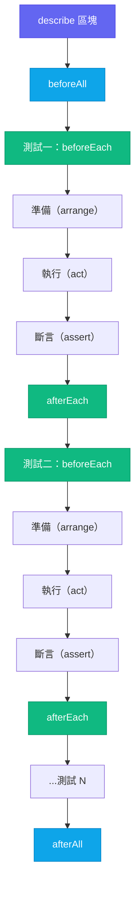

# 使用 Vitest 與 Jest 進行單元測試

## 背景

單元測試驗證單一函式或模組在隔離環境下的行為。它匯入受測對象、提供受控輸入，並對輸出進行斷言——完全不涉及資料庫、網路、DOM 渲染器或任何其他外部相依性。當單元測試失敗時，你能確切知道哪段邏輯出了問題以及原因，因為測試範圍之外什麼都沒有。

這種隔離性正是單元測試成為測試金字塔（參見 FEE-1100）中最快、最廉價層次的原因。像 `calculateDiscount(price, rate)` 這樣的純函式沒有副作用、沒有 I/O、也沒有共享狀態。它的測試在微秒內執行、在所有機器上具有確定性，且除了匯入模組之外不需要任何測試環境設定。

並非所有「單元」都是純函式。讀取 `localStorage`、呼叫網路 API 或向全域事件匯流排發送事件的模組，都有相依性。對這些模組進行單元測試需要模擬（mocking）——用可預期的替代品取代真實相依性。模擬正是讓單元測試保持「單元」性質的關鍵：當你模擬掉網路呼叫時，測試不再驗證網路是否正常運作；它驗證的是你的程式碼對網路回傳值的回應是否正確。

在 2010 年代大部分時間，**Jest** 是 JavaScript 單元測試無可爭議的標準。由於 Create React App 內建了 Jest，並預設整合了 JSDOM、Istanbul 程式碼覆蓋率和快照測試，它成為了那個世代 React 專案的全功能預設選擇。其 API——`describe`、`it`、`expect`、`beforeEach`、`jest.fn()`、`jest.mock()`——如今已被廣泛使用，儼然成為前端工程師之間的共同語言。

**Vitest** 於 2021 年作為 Vite 原生替代方案問世。它刻意保持與 Jest 的 API 相容性，因此遷移路徑基本上就是全域替換（`jest.fn` → `vi.fn`、`jest.mock` → `vi.mock`）。Vitest 真正改變的是執行模型：它使用 Vite 的 esbuild 管線進行轉換，這意味著 TypeScript 和 JSX 的處理不需要額外的轉譯步驟。原本使用 Jest（即便搭配 `@swc/jest`）需要 8–18 秒的冷啟動時間，在 Vitest 中降至 2 秒以內。監聽模式下的差距更為顯著，因為 Vitest 利用 Vite 的模組圖只重新執行受變更檔案影響的測試。

兩個工具都已在生產環境中廣泛部署。選擇幾乎完全取決於你的建置工具：如果你在 Vite 專案中，使用 Vitest；如果你在舊版 CRA 或 Webpack 專案中，Jest 仍是務實的選擇。

## 設計思維

### Jest 為何主導了一個時代

Jest 的主導地位並非偶然。當 Create React App 預先整合了 JSDOM、零設定執行、覆蓋率、模擬與快照等功能後，它消除了讓測試對小型團隊而言難以落地的設定成本。你執行 `npx create-react-app`，測試套件就準備好了。Jest 成為事實標準，因為它同時消除了所有阻力。

這個生態優勢延續至今。舊有程式碼庫、大多數熱門函式庫、所有 React 官方文件範例，以及 Stack Overflow 上的大量解答，都引用 Jest 的 API。Jest 30（2025 年 6 月）大幅改善了效能和 ESM 支援。對於已有 Jest 的現有專案，繼續使用 Jest 往往是阻力最小的路徑。

### 為什麼 Vitest 在新 Vite 專案中是首選

關鍵洞見在於設定的重複性。一個 Vite 專案已有 `vite.config.ts`，其中包含路徑別名、插件、環境變數與 TypeScript 路徑設定。一個 Jest 專案則需要額外的 `jest.config.ts`（或 `babel.config.js` 加上 `jest-setup.ts`），這些檔案必須重複一部分 Vite 的設定。當你在 Vite 中新增路徑別名時，必須在 Jest 的 `moduleNameMapper` 中手動同步。當你升級一個 Vite 插件時，可能需要同步更新 Jest 的 transform 設定。這種設定漂移隨時間累積，成為維護負擔。

Vitest 透過在 `vite.config.ts` 中接受 `test` 區塊來解決這個問題。不需要額外的設定檔。路徑別名、插件和環境變數都會自動繼承。

效能差異源於架構設計。Jest 在 ESM 標準化之前設計，預設將所有程式碼編譯為 CommonJS，並將 ESM 支援標記為實驗性。Vitest 原生使用 esbuild，esbuild 以 Go 語言編寫並跨 CPU 核心並行處理轉換。冷啟動基準測試一致顯示，與使用 `ts-jest` 或 `babel-jest` 的 Jest 相比提升 5–10 倍，即使與使用更快速 `@swc/jest` 的 Jest 相比也有 2–4 倍的提升。在每天執行數百次的 CI 管線中，這個差距直接轉化為成本。

Vitest 的監聽模式利用 Vite 的模組圖。當你修改 `utils/formatDate.ts` 時，Vitest 知道哪些測試檔案（直接或間接）匯入了該模組，並只重新執行那些測試。Jest 的監聽模式使用檔案路徑啟發式規則，重新執行所有符合模式的測試，粒度較粗。

Vitest 還內建了瀏覽器模式（`@vitest/browser`），可透過 Playwright 在真實的 Chromium、Firefox 或 WebKit 中執行測試。這縮小了 Jest 和 Vitest 預設使用的 JSDOM 模擬與真實瀏覽器 DOM 之間的差距——對於測試 JSDOM 未實作的瀏覽器 API（Web Animations、ResizeObserver、canvas）非常有用。

### 快照測試的取捨

快照測試的引入是為了解決一個合理的問題：在不寫大量個別斷言的情況下，驗證序列化輸出是否有所改變。對於穩定的文字序列化值，它運作良好：CLI 命令的格式化輸出、圖表函式庫生成的 SVG 路徑字串、日期格式化函式的地區輸出、Redux action 序列。

對於元件 JSX 樹，它的效果很差。一個元件快照通常包含數百行序列化的 HTML 屬性、class 名稱和行內樣式。當快照失敗時——因為 class 名稱改變、新增了 `data-testid`，或相依套件升級改變了輸出格式——開發者會執行 `vitest --update-snapshots` 並在未閱讀的情況下批准新快照。測試通過了；回歸也一起上線了。

Kent C. Dodds 直接描述了這種模式：「我親身經歷過一個超過 640 行的快照。沒有人會審查它，大家唯一對它投入的心力，就是每次有變更時直接刪掉重建。」測試存在著，覆蓋率數字是綠色的，但訊號全是雜訊。

替代方案是明確的斷言：`expect(button).toHaveTextContent('Submit')`、`expect(form).not.toHaveAttribute('disabled')`。這些比一個 `toMatchSnapshot()` 呼叫更難寫，但它們迫使你說清楚你真正在意的是什麼——而這正是測試的意義所在。

### 為什麼覆蓋率百分比是虛榮指標

`expect(add(2, 2)).toBe(4)` 讓 `add` 函式達到 100% 的行覆蓋率。但它沒有測試 `add(-1, -1)`、`add(0, 0)`、`add(NaN, 1)`，或 `add(Number.MAX_SAFE_INTEGER, 1)`。覆蓋率告訴你測試執行器執行了哪些程式碼行；它對那些行是否以能揭露錯誤的輸入被驗證，什麼都不說。

一個以「達到 90% 覆蓋率」為目標的團隊，會寫出只是執行程式碼路徑而不做任何有意義斷言的測試——因為行覆蓋率隨著測試執行器觸及的每一行增加，無論周圍有多少 `expect` 呼叫。指標成了目標，而目標取代了測試的真正目的。

覆蓋率作為缺口偵測器是有用的：如果一個函式有 0% 覆蓋率，就表示它完全沒有測試。但 100% 覆蓋率對測試品質毫無說明。有效的問題不是「覆蓋了多少百分比」，而是「當我引入一個合理的錯誤時，我的測試會失敗嗎？」

## 最佳實踐

**必須（MUST）對所有新 Vite 專案使用 Vitest，而非額外建立 Jest 設定。** Vitest 讀取現有 `vite.config.ts` 中的 `test` 區塊，路徑別名、插件和環境變數會自動繼承，不需要 `moduleNameMapper` 重複設定。獨立的 `jest.config.ts` 與 `vite.config.ts` 之間的設定漂移，必須（MUST）被視為維護負債，而非小問題。

**應該（SHOULD）在全域設定 `restoreMocks: true`，而非在每個測試中手動管理 Mock 清理。** 在 `vitest.config.ts` 中設定 `restoreMocks: true`，可在每個測試結束後自動清除呼叫歷史、重置回傳值，並還原 `vi.spyOn` 的原始實作——這是最安全的預設值。絕對禁止（MUST NOT）讓 Mock 清理完全依賴個別測試的 `afterEach` 呼叫，因為任何一個測試檔案中遺漏清理，都會導致狀態洩漏，表現為後續測試的間歇性失敗。

**應該（SHOULD）撰寫明確的斷言，而非對元件輸出使用快照測試。** 對 JSX 樹的快照測試是絕對禁止（MUST NOT）的元件輸出模式：開發者執行 `vitest --update-snapshots` 時不會閱讀差異，快照只是批准程式碼當前產生的任何輸出。你應該（SHOULD）針對具體的、使用者可見的屬性撰寫斷言——`toHaveTextContent`、`toBeDisabled`、`toHaveAttribute`——這些斷言迫使你說清楚測試實際上在驗證什麼。

**必須（MUST）將覆蓋率視為缺口偵測器，而非品質關卡。** 75–80% 行覆蓋率閾值可以標記完全沒有測試的檔案，同時不會激勵無斷言的測試填充。100% 覆蓋率絕對禁止（MUST NOT）被解讀為測試品質的證明；一個 `expect(fn()).toBeTruthy()` 呼叫在覆蓋率上涵蓋了該函式，卻幾乎沒有斷言任何有意義的內容。有效的問題永遠是：如果引入一個合理的錯誤，測試是否會失敗。

## 視覺化

### 單元測試生命週期

下方圖表展示了單元測試套件的生命週期。`beforeAll` 在 `describe` 區塊的任何測試開始之前執行一次。`afterAll` 在所有測試完成後執行一次。`beforeEach` 和 `afterEach` 包裹每一個個別測試——它們是重置模擬與共享 fixture 的正確位置。



## 範例

### 1. 包含覆蓋率設定的 `vitest.config.ts`

最簡單的 Vitest 設定是在 `vite.config.ts` 中加入 `test` 區塊。`coverage` 區塊設定閾值，若任何指標低於指定百分比，執行就會失敗。

```ts
// vitest.config.ts（或合併至 vite.config.ts）
import { defineConfig } from 'vitest/config'

export default defineConfig({
  test: {
    // 使用 JSDOM 模擬瀏覽器 DOM（網頁專案的預設值）
    environment: 'jsdom',

    // 在每個測試檔案之前執行設定檔案
    setupFiles: ['./src/test/setup.ts'],

    // 覆蓋率設定
    coverage: {
      // 'v8' 使用原生 V8 覆蓋率——速度快，零前置插樁成本。
      // 'istanbul' 對原始碼進行插樁——對轉譯或壓縮程式碼的分支覆蓋更精確。
      // 優先使用 'v8' 以提升速度；若分支覆蓋率數字不準確，則切換至 'istanbul'。
      provider: 'v8',

      // 要納入報告的檔案（即使從未被測試匯入）
      include: ['src/**/*.{ts,tsx}'],

      // 從覆蓋率中排除測試檔案和型別定義檔案
      exclude: ['src/**/*.test.{ts,tsx}', 'src/**/*.d.ts'],

      // 若任何閾值未達到，執行失敗
      thresholds: {
        lines: 80,
        branches: 75,
        functions: 80,
        statements: 80,
      },

      // 輸出格式：'text' 列印至終端，'lcov' 可上傳至 Codecov
      reporter: ['text', 'lcov'],
    },
  },
})
```

執行覆蓋率的指令：`vitest run --coverage`

### 2. 一個簡單的單元測試

`describe` 將相關測試分組。`it`（或 `test`）命名一個場景。`beforeEach` 在每個測試之前重置共享狀態。`expect` 對結果進行斷言。

```ts
// src/utils/formatCurrency.ts
export function formatCurrency(amount: number, currency = 'USD'): string {
  if (!Number.isFinite(amount)) {
    throw new RangeError(`Invalid amount: ${amount}`)
  }
  return new Intl.NumberFormat('en-US', {
    style: 'currency',
    currency,
  }).format(amount)
}
```

```ts
// src/utils/formatCurrency.test.ts
import { describe, it, expect, beforeEach } from 'vitest'
import { formatCurrency } from './formatCurrency'

describe('formatCurrency', () => {
  // beforeEach 在此 describe 中的每個 `it` 區塊之前執行
  beforeEach(() => {
    // 這裡沒有需要重置的狀態——純函式，無副作用。
    // 在有模擬或共享狀態的測試中，這是重置它們的地方。
  })

  it('格式化整數金額', () => {
    expect(formatCurrency(1000)).toBe('$1,000.00')
  })

  it('正確格式化分（cents）', () => {
    expect(formatCurrency(9.99)).toBe('$9.99')
  })

  it('支援非預設貨幣', () => {
    expect(formatCurrency(42, 'EUR')).toBe('€42.00')
  })

  it('對非有限數字拋出例外', () => {
    expect(() => formatCurrency(Infinity)).toThrow(RangeError)
    expect(() => formatCurrency(NaN)).toThrow(RangeError)
  })

  it('正確格式化零值', () => {
    expect(formatCurrency(0)).toBe('$0.00')
  })
})
```

### 3. 使用 `vi.fn()` 與 `vi.spyOn()` 進行模擬

`vi.fn()` 建立一個沒有實作的模擬函式。`vi.spyOn()` 包裝一個現有方法，讓你可以對呼叫進行斷言，同時保留真實實作（除非你呼叫 `.mockImplementation()`）。

```ts
// src/services/analytics.ts
export const analytics = {
  track(event: string, data?: Record<string, unknown>): void {
    // 真實實作會發送至第三方服務
    console.log('track', event, data)
  },
}
```

```ts
// src/hooks/useCheckout.test.ts
import { describe, it, expect, vi, beforeEach, afterEach } from 'vitest'
import { analytics } from '../services/analytics'
import { submitOrder } from './useCheckout'

describe('submitOrder', () => {
  // 監看 analytics.track——用模擬取代它，但保持相同的介面形狀
  const trackSpy = vi.spyOn(analytics, 'track').mockImplementation(() => {})

  beforeEach(() => {
    trackSpy.mockClear() // 在測試之間重置呼叫次數
  })

  afterEach(() => {
    vi.restoreAllMocks() // 恢復原始實作
  })

  it('成功時追蹤 order_placed 事件', async () => {
    const mockFetch = vi.fn().mockResolvedValue({ ok: true, json: async () => ({ id: '42' }) })
    global.fetch = mockFetch

    await submitOrder({ items: [{ sku: 'ABC', qty: 1 }] })

    expect(trackSpy).toHaveBeenCalledOnce()
    expect(trackSpy).toHaveBeenCalledWith('order_placed', { orderId: '42' })
  })

  it('請求失敗時不追蹤事件', async () => {
    global.fetch = vi.fn().mockResolvedValue({ ok: false, status: 500 })

    await expect(submitOrder({ items: [] })).rejects.toThrow()
    expect(trackSpy).not.toHaveBeenCalled()
  })
})
```

### 4. 使用 `vi.mock()` 進行模組模擬

`vi.mock()` 用工廠函式取代整個模組。工廠函式在檔案中任何測試執行之前就已運行，這意味著在匯入解析之前，模擬就已就位。這是你取代網路層、第三方 SDK 或在匯入時具有副作用的模組的方式。

```ts
// src/api/userApi.ts
export async function fetchUser(id: string) {
  const res = await fetch(`/api/users/${id}`)
  if (!res.ok) throw new Error('User not found')
  return res.json()
}
```

```ts
// src/services/userService.test.ts
import { describe, it, expect, vi, beforeEach } from 'vitest'

// vi.mock 會被 Vitest 的轉換提升至檔案頂部——
// 模組路徑必須是靜態字串字面值（不可使用變數）。
vi.mock('../api/userApi')

import { fetchUser } from '../api/userApi'
import { getUserDisplayName } from './userService'

describe('getUserDisplayName', () => {
  beforeEach(() => {
    vi.mocked(fetchUser).mockReset()
  })

  it('當姓名欄位都存在時回傳全名', async () => {
    vi.mocked(fetchUser).mockResolvedValue({
      firstName: 'Alice',
      lastName: 'Chen',
      email: 'alice@example.com',
    })

    const name = await getUserDisplayName('user-1')
    expect(name).toBe('Alice Chen')
  })

  it('姓名缺失時退回使用電子郵件', async () => {
    vi.mocked(fetchUser).mockResolvedValue({
      firstName: null,
      lastName: null,
      email: 'bob@example.com',
    })

    const name = await getUserDisplayName('user-2')
    expect(name).toBe('bob@example.com')
  })
})
```

### 5. 快照測試——以及何時應避免使用

`toMatchSnapshot()` 將值序列化並在首次執行時寫入 `.snap` 檔案。後續執行與儲存的快照進行比對。`toMatchInlineSnapshot()` 則將快照直接儲存在測試檔案中。

**快照的適用場景**：穩定的文字序列化輸出，手動斷言過於繁瑣時。

```ts
// 良好使用：確定性的字串序列化
import { describe, it, expect } from 'vitest'
import { serializeFilter } from './queryBuilder'

describe('serializeFilter', () => {
  it('將複合篩選條件序列化為穩定的查詢字串', () => {
    const filter = {
      status: ['active', 'pending'],
      createdAfter: '2025-01-01',
      tags: ['urgent'],
    }
    // 輸出是一個扁平字串——在 .snap 檔案中易於閱讀，
    // 當它改變時也有意義可以審查。
    expect(serializeFilter(filter)).toMatchInlineSnapshot(
      `"status=active,pending&createdAfter=2025-01-01&tags=urgent"`
    )
  })
})
```

**應避免使用快照的場景**：元件 JSX 輸出。快照很龐大，每次樣式或標記調整都會改變，而開發者會在未閱讀的情況下更新它。

```ts
// 避免這種模式
import { render } from '@testing-library/react'
import { CheckoutForm } from './CheckoutForm'

it('正確渲染', () => {
  const { container } = render(<CheckoutForm />)
  // 這個快照會有 200 行以上的 HTML。沒有人會審查它。
  // 當 class 名稱改變時，開發者執行 --update-snapshots 然後繼續工作。
  expect(container).toMatchSnapshot() // ← 不要這樣做
})

// 改用明確的斷言
it('顯示送出按鈕', () => {
  render(<CheckoutForm />)
  expect(screen.getByRole('button', { name: /submit/i })).toBeInTheDocument()
})

it('表單無效時停用送出按鈕', () => {
  render(<CheckoutForm />)
  expect(screen.getByRole('button', { name: /submit/i })).toBeDisabled()
})
```

### 6. 在 CI 中執行

```bash
# 非監聽模式、單次執行——在 CI 中使用此指令
vitest run

# 包含覆蓋率輸出（若未達到閾值則失敗）
vitest run --coverage

# JUnit reporter，用於可解析 XML 測試結果的 CI 系統（GitHub Actions、GitLab CI）
vitest run --reporter=junit --outputFile=test-results/junit.xml

# 執行特定的檔案模式
vitest run src/utils/
```

**GitHub Actions 範例：**

```yaml
- name: 執行單元測試
  run: pnpm vitest run --coverage --reporter=junit --outputFile=test-results/junit.xml

- name: 上傳覆蓋率至 Codecov
  uses: codecov/codecov-action@v4
  with:
    files: ./coverage/lcov.info
```

## 常見錯誤

**過度模擬。** 當一個測試模擬掉模組的每一個相依性時，它實際上測試的是模擬呼叫的串接——而非真正的邏輯。如果 `calculateTotal` 呼叫了 `applyDiscount`，而 `applyDiscount` 被模擬為回傳 `0`，那麼 `calculateTotal` 的測試永遠不會捕捉到折扣邏輯中的錯誤。在邊界處進行模擬（網路、儲存、時間），而非在每個內部函式邊界處模擬。

**測試實作而非行為。** 一個斷言 `expect(component.state.isLoading).toBe(true)` 的測試，每次重新命名或重組內部狀態時都會失敗，即使元件的可見行為未改變。測試使用者所體驗到的：渲染的文字、ARIA 狀態、發出的事件。

**在 `vi.mock()` 中使用動態路徑。** Vitest 在轉換時提升 `vi.mock()` 呼叫。模組路徑必須是靜態字串字面值——不可使用模板字串或變數。使用變數的 `vi.mock()` 呼叫將靜默失敗。

## 相關 FEE

- [FEE-1100 測試策略總覽](./1100.md)
- [FEE-1104 模擬策略](./1104.md) — `vi.fn()`、`vi.spyOn()`、MSW 和網路模擬模式的深度解析
- [FEE-1105 測試驅動開發](./1105.md) — 先寫測試再實作；Vitest 監聽模式作為 TDD 回饋迴路
- [FEE-1107 覆蓋率哲學](./1107.md) — 為何 80% 不是目標、突變測試，以及測試套件的長期健康

## 參考資料

- [Vitest — Features](https://vitest.dev/guide/features) — 原生 ESM、瀏覽器模式、基於 HMR 的監聽
- [Vitest — Coverage Guide](https://vitest.dev/guide/coverage.html) — v8 與 istanbul 提供者、閾值、reporter
- [Vitest — Comparisons with Other Test Runners](https://vitest.dev/guide/comparisons.html) — 與 Jest 及其他執行器的官方比較
- [Kent C. Dodds — Effective Snapshot Testing](https://kentcdodds.com/blog/effective-snapshot-testing) — 快照何時有幫助，何時成為雜訊
- [Artem Sapegin — What's Wrong With Snapshot Tests](https://sapegin.me/blog/snapshot-tests/) — 「不閱讀就批准」的失敗模式解析
- [Jest vs Vitest: Which Test Runner Should You Use in 2025?](https://medium.com/@ruverd/jest-vs-vitest-which-test-runner-should-you-use-in-2025-5c85e4f2bda9) — 基準數據與遷移考量
