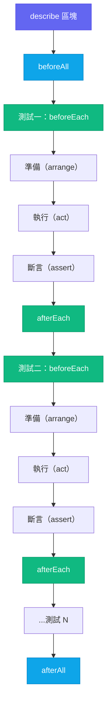

# [FEE-1101] 使用 Vitest 與 Jest 進行單元測試

:::info
單元測試將一個函式或模組獨立出來，提供受控輸入並檢查輸出，過程中不會觸及資料庫、網路或 DOM 渲染器。截至 2026 年年中，Vitest 與 Jest 都是主流選擇：Jest 30（2025 年 6 月）帶來了實測的效能提升，並持續是 React Native 的預設執行器；Vitest 則已在每週 npm 下載量上超越 Jest。本文說明如何以 Vitest 撰寫與設定單元測試、如何正確模擬使單元測試維持「單元」性質，並探討如何把快照測試與覆蓋率百分比當作工具而非目標。
:::

## 背景

單元測試驗證單一函式或模組在隔離環境下的行為。它匯入受測對象、提供受控輸入，並對輸出進行斷言。過程中不涉及資料庫、網路或 DOM 渲染器。當單元測試失敗時，你能確切知道哪段邏輯出了問題以及原因，因為測試範圍之外什麼都沒有。

這種隔離性正是單元測試成為測試金字塔（參見 FEE-1100）中最快、最廉價層次的原因。像 `calculateDiscount(price, rate)` 這樣的純函式沒有副作用、沒有 I/O、也沒有共享狀態。它的測試在微秒內執行、在所有機器上具有確定性，且除了匯入模組之外不需要任何測試環境設定。

並非所有「單元」都是純函式。讀取 `localStorage`、呼叫網路 API 或向全域事件匯流排發送事件的模組，都有相依性。對這些模組進行單元測試需要模擬：用可預期的替代品取代真實相依性。模擬正是讓單元測試保持「單元」性質的關鍵。當你模擬掉網路呼叫時，測試不再驗證網路是否正常運作；它驗證的是你的程式碼對網路回傳值的回應是否正確。應該在外部邊界（網路、儲存、時鐘）進行模擬，而非模擬內部函式，詳見下方「常見錯誤」與 FEE-1104 的完整討論。

**Jest** 在 2010 年代成為 JavaScript 預設的測試執行器，其 API（`describe`、`it`、`expect`、`beforeEach`、`jest.fn()`、`jest.mock()`）如今已是前端工程師之間的共同語言。大多數現有的 React 官方文件與 Stack Overflow 解答至今仍使用它。Jest 為何取得這個地位，詳見下方「設計思維」。

**Vitest** 於 2021 年作為 Vite 原生替代方案問世。它刻意保持與 Jest 的 API 相容性，因此遷移路徑基本上就是全域替換（`jest.fn` → `vi.fn`、`jest.mock` → `vi.mock`）。Vitest 真正改變的是執行模型：它使用 Vite 的 esbuild 管線進行轉換，因此 TypeScript 和 JSX 的處理不需要額外的轉譯步驟，並且在監聽模式下重複利用 Vite 即時的模組圖，只重新執行受變更檔案影響的測試。實際的相對速度高度取決於測試套件的結構、轉換設定與隔離模式，因此任何具體的跨執行器倍率都應該抱持懷疑。兩個專案唯一有發布真實數據的基準測試來自 Jest 自己：Jest 30 版本（2025 年 6 月）在一個大型 TypeScript 應用程式的伺服器測試套件上，量測到相較 Jest 29 有最高 37% 的執行速度提升與 77% 的記憶體用量降低（Jest 官方部落格）。

截至 2026 年年中，兩者都是主流且持續開發的工具。Jest 30.x 定期發布更新，並持續是 React Native 的預設測試執行器；Vitest 則在 2025 到 2026 年間於每週 npm 下載量上超越 Jest（根據 npm trends，截至 2026 年 6 月約為每週 7,000 萬次對比 4,500 萬次）。依建置流程來選擇：Vite 專案使用 Vitest；Webpack 或其他非 Vite 建置則 Jest 仍是務實的選擇。

Node 內建的測試執行器（`node:test`，自 Node 20 起穩定）是第三個零相依性選項。它沒有自己的轉換管線，因此適合沒有建置步驟的小型函式庫，但缺少 Vitest 監聽模式的模組圖與 Jest 的快照工具。對於使用 TypeScript、JSX 或路徑別名的應用程式碼，Vitest 或 Jest 仍是實務上的選擇。

## 視覺對比

### 單元測試生命週期

下方圖表展示了單元測試套件的生命週期。`beforeAll` 在 `describe` 區塊的任何測試開始之前執行一次。`afterAll` 在所有測試完成後執行一次。`beforeEach` 和 `afterEach` 包裹每一個個別測試。這裡是重置模擬與共享 fixture 的正確位置。



## 範例

### Vitest 與 Jest 快速對照表

以下所有範例都以 Vitest 撰寫。如果你身處 Jest 30 的程式碼庫，這張表可以轉換其中的設定鍵、API 與 CLI 參數。

| 概念 | Vitest | Jest |
|---|---|---|
| 設定位置 | `vite.config.ts` 中的 `test` 區塊 | `jest.config.ts` |
| 模擬函式 | `vi.fn()` | `jest.fn()` |
| 模組模擬 | `vi.mock()` | `jest.mock()` |
| 監看（spy） | `vi.spyOn()` | `jest.spyOn()` |
| 自動還原模擬 | `restoreMocks: true` | `restoreMocks: true` |
| 更新快照 | `vitest -u` | `jest -u`（或 `jest --updateSnapshot`） |
| 單次執行（CI） | `vitest run` | `jest`（加上 `--ci` 讓新快照導致失敗） |
| 覆蓋率 | `vitest run --coverage` | `jest --coverage` |

### 1. 包含覆蓋率設定的 `vitest.config.ts`

最簡單的 Vitest 設定是在 `vite.config.ts` 中加入 `test` 區塊。`coverage` 區塊設定閾值，若任何指標低於指定百分比，執行就會失敗。

```ts
// vitest.config.ts（或合併至 vite.config.ts）
import { defineConfig } from 'vitest/config'

export default defineConfig({
  test: {
    // Vitest 預設使用 Node 環境。這裡選擇加入 jsdom 以
    // 處理 DOM 相關程式碼（需另外安裝：npm i -D jsdom）。
    environment: 'jsdom',

    // 在每個測試檔案之前執行設定檔案
    setupFiles: ['./src/test/setup.ts'],

    // 覆蓋率設定
    coverage: {
      // 'v8' 是預設的提供者。自 Vitest 4.0 起，它使用以 AST 為基礎的
      // 重新對應機制（3.2 版為實驗性選用），準確度已與 istanbul 相當。
      // 'istanbul' 在非 V8 執行環境中仍然有用。
      provider: 'v8',

      // 要納入報告的檔案（即使從未被測試匯入）
      include: ['src/**/*.{ts,tsx}'],

      // 從覆蓋率中排除測試檔案和型別定義檔案
      exclude: ['src/**/*.test.{ts,tsx}', 'src/**/*.d.ts'],

      // 若任何閾值未達到，執行失敗
      thresholds: {
        lines: 80,
        branches: 75,
        functions: 80,
        statements: 80,
      },

      // 輸出格式：'text' 列印至終端，'lcov' 可上傳至 Codecov
      reporter: ['text', 'lcov'],
    },
  },
})
```

執行覆蓋率的指令：`vitest run --coverage`

### 2. 一個簡單的單元測試

`describe` 將相關測試分組。`it`（或 `test`）命名一個場景。`beforeEach` 在每個測試之前重置共享狀態。`expect` 對結果進行斷言。

```ts
// src/utils/formatCurrency.ts
export function formatCurrency(amount: number, currency = 'USD'): string {
  if (!Number.isFinite(amount)) {
    throw new RangeError(`Invalid amount: ${amount}`)
  }
  return new Intl.NumberFormat('en-US', {
    style: 'currency',
    currency,
  }).format(amount)
}
```

```ts
// src/utils/formatCurrency.test.ts
import { describe, it, expect, beforeEach } from 'vitest'
import { formatCurrency } from './formatCurrency'

describe('formatCurrency', () => {
  // beforeEach 在此 describe 中的每個 `it` 區塊之前執行
  beforeEach(() => {
    // 這裡沒有需要重置的狀態——純函式，無副作用。
    // 在有模擬或共享狀態的測試中，這是重置它們的地方。
  })

  it('格式化整數金額', () => {
    expect(formatCurrency(1000)).toBe('$1,000.00')
  })

  it('正確格式化分（cents）', () => {
    expect(formatCurrency(9.99)).toBe('$9.99')
  })

  it('支援非預設貨幣', () => {
    expect(formatCurrency(42, 'EUR')).toBe('€42.00')
  })

  it('對非有限數字拋出例外', () => {
    expect(() => formatCurrency(Infinity)).toThrow(RangeError)
    expect(() => formatCurrency(NaN)).toThrow(RangeError)
  })

  it('正確格式化零值', () => {
    expect(formatCurrency(0)).toBe('$0.00')
  })
})
```

### 3. 使用 `vi.fn()` 與 `vi.spyOn()` 進行模擬

`vi.fn()` 建立一個沒有實作的模擬函式。`vi.spyOn()` 包裝一個現有方法，讓你可以對呼叫進行斷言，同時保留真實實作（除非你呼叫 `.mockImplementation()`）。

```ts
// src/services/analytics.ts
export const analytics = {
  track(event: string, data?: Record<string, unknown>): void {
    // 真實實作會發送至第三方服務
    console.log('track', event, data)
  },
}
```

```ts
// src/hooks/useCheckout.test.ts
import { describe, it, expect, vi, beforeEach, afterEach } from 'vitest'
import { analytics } from '../services/analytics'
import { submitOrder } from './useCheckout'

describe('submitOrder', () => {
  let trackSpy: ReturnType<typeof vi.spyOn>

  beforeEach(() => {
    // 在每個測試中重新建立這個 spy。如果它是在 describe 層級只建立一次，
    // 下方的 afterEach 會在第一個測試後把 analytics.track 還原成真實實作，
    // 導致後續測試呼叫到真正的 analytics.track：像 not.toHaveBeenCalled()
    // 這樣的否定斷言會無意義地通過，而肯定斷言則會失敗。
    trackSpy = vi.spyOn(analytics, 'track').mockImplementation(() => {})
  })

  afterEach(() => {
    vi.restoreAllMocks() // 還原 analytics.track
    vi.unstubAllGlobals() // 還原 global.fetch
  })

  it('成功時追蹤 order_placed 事件', async () => {
    const mockFetch = vi.fn().mockResolvedValue({ ok: true, json: async () => ({ id: '42' }) })
    vi.stubGlobal('fetch', mockFetch)

    await submitOrder({ items: [{ sku: 'ABC', qty: 1 }] })

    expect(trackSpy).toHaveBeenCalledOnce()
    expect(trackSpy).toHaveBeenCalledWith('order_placed', { orderId: '42' })
  })

  it('請求失敗時不追蹤事件', async () => {
    vi.stubGlobal('fetch', vi.fn().mockResolvedValue({ ok: false, status: 500 }))

    await expect(submitOrder({ items: [] })).rejects.toThrow()
    expect(trackSpy).not.toHaveBeenCalled()
  })
})
```

### 4. 使用 `vi.mock()` 進行模組模擬

`vi.mock()` 用工廠函式取代整個模組。工廠函式在檔案中任何測試執行之前就已運行，這意味著在匯入解析之前，模擬就已就位。這是你取代網路層、第三方 SDK 或在匯入時具有副作用的模組的方式。

```ts
// src/api/userApi.ts
export async function fetchUser(id: string) {
  const res = await fetch(`/api/users/${id}`)
  if (!res.ok) throw new Error('User not found')
  return res.json()
}
```

```ts
// src/services/userService.test.ts
import { describe, it, expect, vi, beforeEach } from 'vitest'

// vi.mock 會被 Vitest 的轉換提升至檔案頂部。
// 模組路徑必須是靜態字串字面值（不可使用變數）。
vi.mock('../api/userApi')

import { fetchUser } from '../api/userApi'
import { getUserDisplayName } from './userService'

describe('getUserDisplayName', () => {
  beforeEach(() => {
    vi.mocked(fetchUser).mockReset()
  })

  it('當姓名欄位都存在時回傳全名', async () => {
    vi.mocked(fetchUser).mockResolvedValue({
      firstName: 'Alice',
      lastName: 'Chen',
      email: 'alice@example.com',
    })

    const name = await getUserDisplayName('user-1')
    expect(name).toBe('Alice Chen')
  })

  it('姓名缺失時退回使用電子郵件', async () => {
    vi.mocked(fetchUser).mockResolvedValue({
      firstName: null,
      lastName: null,
      email: 'bob@example.com',
    })

    const name = await getUserDisplayName('user-2')
    expect(name).toBe('bob@example.com')
  })
})
```

### 5. 快照測試，以及何時應避免使用

`toMatchSnapshot()` 將值序列化並在首次執行時寫入 `.snap` 檔案。後續執行與儲存的快照進行比對。`toMatchInlineSnapshot()` 則將快照直接儲存在測試檔案中。

**快照的適用場景**：穩定的文字序列化輸出，手動斷言過於繁瑣時。

```ts
// 良好使用：確定性的字串序列化
import { describe, it, expect } from 'vitest'
import { serializeFilter } from './queryBuilder'

describe('serializeFilter', () => {
  it('將複合篩選條件序列化為穩定的查詢字串', () => {
    const filter = {
      status: ['active', 'pending'],
      createdAfter: '2025-01-01',
      tags: ['urgent'],
    }
    // 輸出是一個扁平字串，在 .snap 檔案中易於閱讀，
    // 當它改變時也有意義可以審查。
    expect(serializeFilter(filter)).toMatchInlineSnapshot(
      `"status=active,pending&createdAfter=2025-01-01&tags=urgent"`
    )
  })
})
```

這兩篇被引用的評論文章都同意快照應該保持精簡；Sapegin 進一步建議使用 `toMatchInlineSnapshot()`，讓值直接留在程式碼審查的 diff 中，而不是獨立的 `.snap` 檔案；Dodds 則建議使用自訂序列化器來去除雜訊。

**應避免使用快照的場景**：元件 JSX 輸出。快照很龐大，每次樣式或標記調整都會改變，而開發者會在未閱讀的情況下更新它。

```ts
// 避免這種模式
import { render } from '@testing-library/react'
import { CheckoutForm } from './CheckoutForm'

it('正確渲染', () => {
  const { container } = render(<CheckoutForm />)
  // 這個快照會有 200 行以上的 HTML。沒有人會審查它。
  // 當 class 名稱改變時，開發者執行 -u 然後繼續工作。
  expect(container).toMatchSnapshot() // ← 不要這樣做
})

// 改用明確的斷言
it('顯示送出按鈕', () => {
  render(<CheckoutForm />)
  expect(screen.getByRole('button', { name: /submit/i })).toBeInTheDocument()
})

it('表單無效時停用送出按鈕', () => {
  render(<CheckoutForm />)
  expect(screen.getByRole('button', { name: /submit/i })).toBeDisabled()
})
```

### 6. 在 CI 中執行

```bash
# 非監聽模式、單次執行——在 CI 中使用此指令
vitest run

# 包含覆蓋率輸出（若未達到閾值則失敗）
vitest run --coverage

# JUnit reporter，用於可解析 XML 測試結果的 CI 系統（GitHub Actions、GitLab CI）
vitest run --reporter=junit --outputFile=test-results/junit.xml

# 執行特定的檔案模式
vitest run src/utils/
```

**GitHub Actions 範例：**

```yaml
- name: 執行單元測試
  run: pnpm vitest run --coverage --reporter=junit --outputFile=test-results/junit.xml

- name: 上傳覆蓋率至 Codecov
  uses: codecov/codecov-action@v4
  with:
    files: ./coverage/lcov.info
```

## 最佳實踐

**必須（MUST）在所有新的 Vite 專案中使用 Vitest，而不要另外建立 Jest 設定。** Vitest 會讀取既有 `vite.config.ts` 中的 `test` 區塊，因此路徑別名、外掛與環境變數都會自動繼承，不需要重複設定 `moduleNameMapper`。

**應該（SHOULD）在全域設定 `restoreMocks: true`，而不是在每個測試中手動管理模擬清理。** 在 `vitest.config.ts` 中設定 `restoreMocks: true`，會在每個測試前呼叫 `vi.restoreAllMocks()`，清除上一個測試留下的呼叫紀錄並還原 `vi.spyOn` 的原始實作。這是循序測試最安全的預設值，但搭配 `test.concurrent` 時並不安全：在測試仍在進行時還原所有 spy，可能會影響到同時執行中的其他測試，因此並行測試套件需要改用範圍受限的 `mockReset`／`mockRestore` 呼叫。若把清理工作完全交給個別測試的 `afterEach`，一旦某個檔案漏掉清理，就會造成狀態外洩，並在其他測試中表現為間歇性失敗。

**應該（SHOULD）針對元件輸出撰寫明確的斷言，而不是使用快照測試。** 對 JSX 樹進行快照測試是一種反模式：開發者執行 `vitest -u` 卻不閱讀差異，快照就這樣批准了程式碼目前產生的任何結果。應改為針對具體、使用者可見的屬性撰寫斷言，例如 `toHaveTextContent`、`toBeDisabled`、`toHaveAttribute`；這些斷言會迫使你說清楚測試實際在驗證什麼。

**必須（MUST）把覆蓋率當作缺口偵測器，而不是品質關卡。** 75–80% 的行覆蓋率閾值可以標記出完全沒有測試的檔案，同時不會鼓勵無斷言的測試填充。100% 覆蓋率絕對不能（MUST NOT）被解讀為測試品質的證明：一個 `expect(fn()).toBeTruthy()` 呼叫，在覆蓋率上涵蓋了該函式，卻幾乎沒有斷言任何有意義的內容。

## 設計思維

### Jest 為何成為預設選擇

Jest 早期的主導地位並非偶然。當 Create React App 預先整合了 JSDOM、零設定執行、覆蓋率與快照等功能後，它消除了讓測試對小型團隊而言難以落地的設定成本。執行 `npx create-react-app` 就能得到一個可用的測試套件。Jest 之所以成為預設答案，是因為它一次消除了所有阻力，而這個生態優勢延續至今：舊有程式碼庫、大多數熱門函式庫，以及 Stack Overflow 上的大量解答，至今仍引用 Jest 的 API。Jest 30（2025 年 6 月）大幅改善了效能和 ESM 支援，並持續是 React Native 的預設測試執行器。對於已有 Jest 的現有專案，繼續使用 Jest 往往是阻力最小的路徑。

### 為什麼 Vitest 在新 Vite 專案中是首選

關鍵洞見在於設定的重複性。一個 Vite 專案已有 `vite.config.ts`，其中包含路徑別名、插件、環境變數與 TypeScript 路徑設定。一個 Jest 專案則需要額外的 `jest.config.ts`（或 `babel.config.js` 加上 `jest-setup.ts`），這些檔案必須重複一部分 Vite 的設定。當你在 Vite 中新增路徑別名時，必須在 Jest 的 `moduleNameMapper` 中手動同步。當你升級一個 Vite 插件時，可能需要同步更新 Jest 的 transform 設定。這種設定漂移隨時間累積，成為維護負擔。

Vitest 透過在 `vite.config.ts` 中接受 `test` 區塊來解決這個問題。不需要額外的設定檔。路徑別名、插件和環境變數都會自動繼承。

效能差異源於架構設計。Jest 在 ESM 標準化之前設計：預設將所有程式碼編譯為 CommonJS，並將 ESM 支援視為實驗性功能。Vitest 原生使用 esbuild，esbuild 以 Go 語言編寫，能跨 CPU 核心並行處理轉換。實際的相對速度高度取決於測試套件的結構、轉換設定與隔離模式，因此不宜篤定地引用單一的跨執行器倍率；如果需要具體數字，應該針對自己的測試套件實測並標註測試時間。即便如此，在每天執行許多次的 CI 管線中，任何持續存在的單次執行差距，累積起來仍會轉化為實際成本。

Vitest 的監聽模式利用 Vite 的模組圖。當你修改 `utils/formatDate.ts` 時，Vitest 知道哪些測試檔案（直接或間接）匯入了該模組，並只重新執行那些測試。Jest 在監聽模式下同樣只會重新執行相關測試，但它是從一份靜態建立的 CommonJS 模組對照表（也就是它的 haste map）搭配 git 狀態來解析相依關係。Vitest 則改用 Vite 即時的 ESM 模組圖，即使歷經別名、外掛與動態轉換，也能維持準確，不需要額外的解析器。

Vitest 還內建瀏覽器模式，可透過 Playwright 在真實的 Chromium、Firefox 或 WebKit 中執行測試。自 Vitest 4.0（2025 年 10 月）起，瀏覽器模式已經穩定，並在瀏覽器內新增了視覺回歸測試功能（`toMatchScreenshot`）。原本單一的 `@vitest/browser` 套件已拆分為個別供應商套件，例如 `@vitest/browser-playwright`，context 的匯入方式也改為 `vitest/browser`。瀏覽器模式縮小了 Jest 與使用 jsdom 設定的 Vitest 所用的 jsdom 模擬環境，與真實瀏覽器 DOM 之間的差距，這對於測試 jsdom 未實作的瀏覽器 API（Web Animations、ResizeObserver、canvas）很有幫助。

### 快照測試的取捨

快照測試的引入是為了解決一個合理的問題：在不寫大量個別斷言的情況下，驗證序列化輸出是否有所改變。對於穩定的文字序列化值，它運作良好：CLI 命令的格式化輸出、圖表函式庫生成的 SVG 路徑字串、日期格式化函式的地區輸出、Redux action 序列。

對於元件 JSX 樹，它的效果很差。一個元件快照通常包含數百行序列化的 HTML 屬性、class 名稱和行內樣式。當快照失敗時（因為 class 名稱改變、新增了 `data-testid`，或相依套件升級改變了輸出格式），開發者會執行 `vitest -u` 並在未閱讀的情況下批准新快照。測試通過了，回歸也一起上線了。

Kent C. Dodds 直接描述了這種模式：「我親身經歷過一個超過 640 行的快照。沒有人會審查它，大家唯一對它投入的心力，就是每次有變更時直接刪掉重建。」

替代方案是明確的斷言：`expect(button).toHaveTextContent('Submit')`、`expect(form).not.toHaveAttribute('disabled')`。這些比一個 `toMatchSnapshot()` 呼叫更難寫，但它們迫使你說清楚你真正在意的是什麼。

### 為什麼覆蓋率百分比是虛榮指標

`expect(add(2, 2)).toBe(4)` 讓 `add` 函式達到 100% 的行覆蓋率。但它沒有測試 `add(-1, -1)`、`add(0, 0)`、`add(NaN, 1)`，或 `add(Number.MAX_SAFE_INTEGER, 1)`。覆蓋率告訴你測試執行器執行了哪些程式碼行；它對那些行是否以能揭露錯誤的輸入被驗證，什麼都不說。

一個以「達到 90% 覆蓋率」為目標的團隊，會寫出只是執行程式碼路徑卻不做任何有意義斷言的測試。行覆蓋率會隨著測試執行器觸及的每一行增加，無論周圍有多少 `expect` 呼叫。

覆蓋率作為缺口偵測器是有用的：如果一個函式有 0% 覆蓋率，就表示它完全沒有測試。但 100% 覆蓋率對測試品質毫無說明。不如換一個問題來問測試套件：如果 `calculateDiscount` 對每一組輸入都靜默回傳 0，哪一個測試會失敗？

## 常見錯誤

**過度模擬。** 當一個測試模擬掉模組的每一個相依性時，它實際上測試的只是模擬呼叫的串接，而非真正的邏輯。如果 `calculateTotal` 呼叫了 `applyDiscount`，而 `applyDiscount` 被模擬為回傳 `0`，那麼 `calculateTotal` 的測試永遠不會捕捉到折扣邏輯中的錯誤。應該在邊界處進行模擬（網路、儲存、時間），而不是在每個內部函式邊界都模擬。

**測試實作而非行為。** 一個斷言 `expect(component.state.isLoading).toBe(true)` 的測試，每次重新命名或重組內部狀態時都會失敗，即使元件的可見行為未改變。測試使用者所體驗到的：渲染的文字、ARIA 狀態、發出的事件。

**在 `vi.mock()` 中使用動態路徑。** Vitest 會在轉換時提升 `vi.mock()` 呼叫，模組路徑必須是靜態字串字面值，不可使用模板字串，也不可使用變數。像 ``vi.mock(`../${dir}/api`)`` 這樣的呼叫會靜默失敗。

## 延伸閱讀

- [FEE-1100 測試策略總覽](/zh-tw/Testing%20Strategies/1100)
- [FEE-1104 模擬策略](/zh-tw/Testing%20Strategies/1104)：`vi.fn()`、`vi.spyOn()`、MSW 和網路模擬模式的深度解析。
- [FEE-1105 測試驅動開發](/zh-tw/Testing%20Strategies/1105)：先寫測試再實作；Vitest 監聽模式作為 TDD 回饋迴路。
- [FEE-1107 覆蓋率哲學](/zh-tw/Testing%20Strategies/1107)：為何 80% 不是目標、突變測試，以及測試套件的長期健康。

## 參考資料

- Vitest Team, "Features," Vitest (2025). https://vitest.dev/guide/features
- Vitest Team, "Coverage Guide," Vitest (2025). https://vitest.dev/guide/coverage.html
- Vitest Team, "Comparisons with Other Test Runners," Vitest (2025). https://vitest.dev/guide/comparisons.html
- Vitest Team, "Vitest 4.0," Vitest Blog (2025). https://vitest.dev/blog/vitest-4
- Jest Team, "Jest 30: Faster, Leaner, Better," Jest Blog (2025). https://jestjs.io/blog/2025/06/04/jest-30
- Kent C. Dodds, "Effective Snapshot Testing," kentcdodds.com (2017). https://kentcdodds.com/blog/effective-snapshot-testing
- Artem Sapegin, "What's Wrong With Snapshot Tests," sapegin.me (2019). https://sapegin.me/blog/snapshot-tests/
- npm trends, "jest vs vitest," npmtrends.com (2026). https://npmtrends.com/jest-vs-vitest
