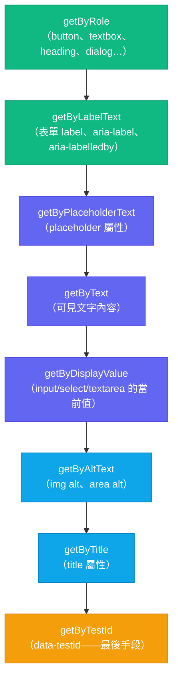

# 使用 Testing Library 進行元件測試

## 背景

元件測試將 UI 元件渲染至真實（或模擬的）DOM 環境中，並對使用者所見及可操作的內容進行斷言——而非對內部狀態、props 或實作細節進行斷言。這是測試金字塔中介於單元測試與端對端測試之間的概念性中間層：元件樹是真實的，但網路、路由與後端均以模擬取代。

與純單元測試的差異在於環境。單元測試在完全沒有 DOM 的隔離環境中執行模組。元件測試使用 JSDOM（或 Vitest 瀏覽器模式中的真實瀏覽器）來渲染 HTML、附加事件監聽器，並讓你以使用者或螢幕閱讀器互動的方式查詢元素。一個登入表單的元件測試可以填入電子郵件和密碼欄位、點擊送出，並斷言載入中指示器出現——完全不需要啟動伺服器。

與端對端測試的差異在於範圍與速度。E2E 測試在真實瀏覽器上驅動一個執行中的應用程式；它具有最高的權威性，但速度慢且不穩定。元件測試在進程內對 DOM 模擬執行：在毫秒內啟動、具有確定性，且可在每次提交時執行。

**React Testing Library（RTL）** 是 React 元件測試的事實標準，在 2020 年代初期完全取代了 Enzyme。其核心哲學在函式庫的指導原則中清楚陳述：

> 「你的測試愈貼近軟體被使用的方式，它們給你的信心就愈大。」

RTL 提供一個主要的渲染 API（`render`）和一個主要的查詢介面（`screen`）。查詢介面刻意限縮為使用者或無障礙輔助工具可以觀察的事物：role、label、文字內容、placeholder 文字、顯示值、alt 文字，以及作為最後手段的 test ID。沒有任何 API 用於讀取元件狀態、存取 React fiber 節點或檢查 prop 值——這些事物對使用者而言是不可見的，因此與具有信心的測試無關。

**Vue Testing Library** 和 **Svelte Testing Library** 提供相同的查詢 API，各自適配其框架。心智模型、查詢優先順序和行為原則可直接轉移；只有 `render` 的匯入路徑和元件設定有所不同。

**Storybook 互動測試**（透過 `play` 函式）提供了一種互補的方法：它們在真實瀏覽器的 Storybook 環境中執行互動序列，使其適用於視覺迴歸測試和跨瀏覽器互動驗證，同時也能搭配元件的 story 變體使用。

## 設計思維

### 為什麼 RTL 取代了 Enzyme

Enzyme 是 2016 年至 2020 年代初期主流的 React 測試函式庫。其主要特性是能夠對元件進行淺層渲染——只渲染受測元件而不渲染其子元件——並直接檢查其內部狀態和 prop 值：

```js
// Enzyme——測試實作細節
const wrapper = shallow(<LoginForm onSubmit={mockSubmit} />)
wrapper.find('PasswordInput').prop('onChange')({ target: { value: 'secret' } })
expect(wrapper.state('password')).toBe('secret')
wrapper.find('button[type="submit"]').simulate('click')
expect(mockSubmit).toHaveBeenCalledWith({ password: 'secret' })
```

這種測試風格有兩個相互強化的問題。第一，`wrapper.find('PasswordInput')` 與元件樹結構耦合——重新命名子元件、將其提取至不同檔案，或直接用 `<input type="password">` 取代，測試就會失敗，即使使用者可見的行為完全相同。第二，`wrapper.state('password')` 與 React class 元件的狀態 API 耦合，這意味著當團隊從 class 元件遷移到函式元件時，Enzyme 測試需要大幅重寫。Enzyme 成了遷移的阻礙。

更深層的問題是信心。一個透過直接呼叫 `.prop('onChange')` 來通過的測試，只驗證了 prop 有被連接——但沒有驗證使用者在欄位中輸入實際上會觸發那個 change handler。測試通過條件與使用者體驗之間的落差，正是錯誤藏身之處。

RTL 透過拒絕暴露內部 API 來彌合這個落差。在 RTL 中與元件互動的唯一方式是透過 DOM：查詢元素、對其觸發事件，並觀察 DOM 中的變化。對於複雜元件，這種方式的撰寫速度較慢，但產生的測試能夠在重構時存活，並捕捉真實的行為迴歸。

### 可存取查詢的優先順序

RTL 提供多種查詢策略，並建議按優先順序使用。這個層級不是任意的：位於清單較高位置的查詢使用的是使用者和螢幕閱讀器實際使用的訊號，這意味著撰寫使用這些查詢的測試，會迫使你建構具有無障礙性的元件。

如果 `getByRole('button', { name: '送出' })` 找不到你的送出按鈕，其中一項必然成立：按鈕沒有 `button` role（它可能是 `<div>` 或 `<span>`）、它沒有可存取名稱「送出」（可能缺少可見文字或 `aria-label`），或它根本不存在於渲染的 DOM 中。這些問題對鍵盤使用者和螢幕閱讀器使用者而言都是真實的問題，不只是測試的問題。

`getByTestId` 位於層級底部，因為它不攜帶任何語意意義。`data-testid="submit-button"` 屬性對螢幕閱讀器不可見，不是標準 HTML 屬性，也沒有傳達關於元素 role 或目的的任何資訊。依賴它的測試，即使元素沒有可存取 role、沒有可存取名稱、且無法透過鍵盤導覽找到，也能通過。

### 查詢變體：`getBy`、`queryBy`、`findBy`

每個查詢系列有三種形式，在未匹配時和非同步解析上有不同行為：

- `getBy*`——同步，若無匹配則拋出錯誤。用於必須存在的元素。
- `queryBy*`——同步，若無匹配則回傳 `null`。用於斷言元素不存在：`expect(queryByRole('alert')).not.toBeInTheDocument()`。
- `findBy*`——回傳一個 Promise，當元素出現時解析，可設定 timeout（預設 1000ms）。用於在非同步操作（資料擷取、setTimeout、動畫）後出現的元素。

當預期有多個匹配時，也有 `getAllBy*`、`queryAllBy*` 和 `findAllBy*` 變體，它們回傳陣列。

### `userEvent` 與 `fireEvent` 的差異

`fireEvent.click(button)` 派發單一 `click` 事件。`userEvent.click(button)` 派發完整的指標和滑鼠事件序列：`pointerover`、`pointerenter`、`mouseover`、`mouseenter`、`pointermove`、`mousemove`、`pointerdown`、`mousedown`、焦點事件、`pointerup`、`mouseup`、`click`。對於大多數點擊處理器，差異是不可見的。但對於使用 `onMouseDown` 而非 `onClick` 的元件、實作焦點陷阱的元件，或在 `onBlur` 中驗證欄位的元件，差異至關重要。

`userEvent.type(input, 'hello')` 為每個字元派發獨立的 `keydown`、`keypress`、`input`、`keyup` 序列。這正是觸發輸入遮罩、透過 `onInput` 強制執行字元數限制，以及 IME 組字處理的機制。`fireEvent.change(input, { target: { value: 'hello' } })` 設定值並觸發一個 change 事件——它繞過了所有逐按鍵邏輯。

在 RTL v14+ 中，`userEvent.setup()` 是推薦的進入點。它建立一個 `userEvent` 實例，在測試中的多次互動之間維護指標狀態和選取狀態，更貼近真實瀏覽器工作階段。

### `act()` 與其重要性

React 批次處理狀態更新，並將 effect（透過 `useEffect`）延遲到當前渲染之後。當測試觸發狀態變更時，React 需要在測試可以斷言結果 DOM 之前，將這些更新全部 flush 完成。`act()` 包裹一個互動，以確保所有狀態更新、effect 和重新渲染在下一行程式碼執行之前完成。

RTL 自動將所有查詢和 `fireEvent` 呼叫包裹在 `act()` 中。在 RTL v14+ 中，`userEvent` 也在內部呼叫 `act()`。你需要手動呼叫 `act()` 的情況非常有限：當你在 RTL 控制之外觸發非同步狀態更新時（例如 `setInterval` 回呼或在測試的 `await` 鏈之外解析的 `Promise`）。在實務中，`findBy*` 查詢可處理大多數非同步情況，無需手動使用 `act()`。

### JSDOM 的限制

JSDOM 實作了大部分 DOM 規範，但沒有佈局引擎。這意味著：

- `element.getBoundingClientRect()` 總是回傳零。你無法測試基於 CSS 的佈局、依位置決定的元素可見性，或滾動行為。
- `ResizeObserver`、`IntersectionObserver` 和 `MutationObserver` 未實作（或以空操作實作）。依賴這些 API 的元件需要在測試設定檔中手動模擬。
- `canvas` API 未實作。基於 canvas 的元件需要模擬，或必須在真實瀏覽器（Vitest 瀏覽器模式、Playwright）中測試。
- 基於視區尺寸的 CSS 媒體查詢匹配無法運作。

當你的元件依賴這些瀏覽器 API 時，可以在測試設定檔中模擬它們、用 Playwright E2E 測試單獨測試該層，或使用 Vitest 瀏覽器模式在真實的 Chromium、Firefox 或 WebKit 中執行測試。

### Storybook 互動測試與 RTL 的比較

Storybook `play` 函式在真實瀏覽器中、於 story 的視覺渲染旁邊執行互動序列。這使它們成為以下用途的正確工具：

- 視覺迴歸：確認元件在互動後的外觀正確
- 跨瀏覽器互動：捕捉特定瀏覽器的事件處理差異
- 元件文件：讓設計師和利害關係人可以發現互動狀態

RTL 在 JSDOM 中是以下用途的正確工具：

- 快速 CI 回饋：完整的 RTL 套件在幾秒內執行；Storybook 測試需要啟動瀏覽器
- 複雜邏輯測試：條件渲染、表單驗證、非同步資料狀態
- 與覆蓋率工具的整合：RTL 測試直接對程式碼進行插樁

這兩種方法是互補的，而非競爭關係。一個常見的模式是使用 RTL 測試行為邏輯，使用 Storybook 進行視覺文件，並讓 Storybook 互動測試只覆蓋最關鍵的、能從視覺驗證中獲益的使用者流程。

## 最佳實踐

**應該（SHOULD）優先使用 `getByRole` 和 `getByLabelText`，而非以 `getByTestId` 作為首要查詢策略。** Testing Library 文件將 `getByRole` 定為最高優先級查詢，因為它針對的是螢幕閱讀器和鍵盤使用者賴以操作的相同訊號。如果 `getByRole('button', { name: '送出' })` 找不到你的按鈕，該按鈕要麼缺少可存取 role，要麼缺少可存取名稱——這是真實的無障礙缺陷，而非測試不便。絕對禁止（MUST NOT）在耗盡所有語意查詢之前就使用 `getByTestId`。

**必須（MUST）使用 `userEvent.setup()` 取代 `fireEvent` 進行所有互動測試。** `userEvent` 派發完整的瀏覽器事件序列——pointerdown、mousedown、focus、keydown、input、keyup、change、blur——這是真實使用者動作所產生的序列。當元件依賴逐按鍵邏輯、焦點管理，或使用 `onMouseDown` 而非 `onClick` 時，`fireEvent` 絕對禁止（MUST NOT）使用。在 RTL v14+ 中，應該（SHOULD）在每個測試頂部呼叫 `userEvent.setup()`，以在多次互動之間維護指標和選取狀態。

**必須（MUST）斷言可觀察的 DOM 輸出，而非內部狀態或 ref。** 讀取 `component.state.isLoading` 或從元件外部存取 React ref 值的測試，與實作細節耦合，在你將邏輯提取至自訂 hook 或重命名內部變數時就會失敗，即使渲染的 UI 完全相同。測試必須（MUST）只驗證使用者或呼叫者觀察到的內容——渲染文字、ARIA 屬性、停用狀態和可見的錯誤訊息。

**必須（MUST）使用 `queryBy*` 進行不存在斷言，使用 `findBy*` 處理非同步內容。** `getBy*` 在找不到匹配時立即拋出錯誤，因此若元素不存在，`expect(screen.getByRole('alert')).not.toBeInTheDocument()` 會在 `expect` 執行之前拋出。不存在斷言必須（MUST）使用 `queryBy*`。同樣地，`findBy*` 回傳 Promise，必須（MUST）加上 `await`；忘記 `await` 會導致斷言評估一個永遠為真值的未解析 Promise 物件。

## 視覺化

### RTL 查詢優先順序圖

位於圖表較高位置的查詢，反映使用者和螢幕閱讀器實際使用的訊號。優先使用頂部的查詢；只有在沒有可存取替代方案時，才使用 `getByTestId`。



綠色：最高信心（可存取）。紫色：中等信心。藍色：較低信心。琥珀色：僅作為逃生艙口。

## 範例

### 1. 基本 RTL 測試：render、按 role 查詢、互動、斷言

受測元件是一個在按鈕點擊時遞增的計數器。測試按 role 查詢、使用 `userEvent` 進行互動，並對使用者可見的文字內容進行斷言。

```tsx
// src/components/Counter.tsx
import { useState } from 'react'

export function Counter() {
  const [count, setCount] = useState(0)
  return (
    <div>
      <p>Count: {count}</p>
      <button type="button" onClick={() => setCount(c => c + 1)}>
        Increment
      </button>
    </div>
  )
}
```

```tsx
// src/components/Counter.test.tsx
import { render, screen } from '@testing-library/react'
import userEvent from '@testing-library/user-event'
import { Counter } from './Counter'

describe('Counter', () => {
  it('點擊按鈕時遞增計數', async () => {
    // userEvent.setup() 建立一個追蹤指標/鍵盤狀態的使用者工作階段
    const user = userEvent.setup()

    render(<Counter />)

    // 按可存取 role 查詢——按鈕必須有 role="button" 且
    // 可存取名稱為 "Increment"。若任一條件不符，會立即拋出錯誤，
    // 暴露無障礙缺口而非將其隱藏。
    const button = screen.getByRole('button', { name: 'Increment' })

    // 確認初始狀態
    expect(screen.getByText('Count: 0')).toBeInTheDocument()

    // 模擬真實點擊——派發完整的指標 + 滑鼠 + 焦點事件序列
    await user.click(button)

    // 對使用者觀察到的 DOM 狀態進行斷言
    expect(screen.getByText('Count: 1')).toBeInTheDocument()
  })
})
```

### 2. 使用 `findBy` 的非同步測試（等待非同步狀態）

當元件在掛載時擷取資料時，載入完成的內容在渲染時不存在。`findByRole` 回傳一個 Promise，當元素出現時解析，預設 timeout 為 1000ms。

```tsx
// src/components/UserProfile.tsx
import { useEffect, useState } from 'react'

interface User { name: string; email: string }

export function UserProfile({ userId }: { userId: string }) {
  const [user, setUser] = useState<User | null>(null)
  const [error, setError] = useState(false)

  useEffect(() => {
    fetch(`/api/users/${userId}`)
      .then(r => r.json())
      .then(setUser)
      .catch(() => setError(true))
  }, [userId])

  if (error) return <p role="alert">無法載入使用者資料。</p>
  if (!user) return <p>載入中...</p>
  return <h2>{user.name}</h2>
}
```

```tsx
// src/components/UserProfile.test.tsx
import { render, screen } from '@testing-library/react'
import { UserProfile } from './UserProfile'

// 模擬全域 fetch，讓測試不會發出真實網路請求
beforeEach(() => {
  global.fetch = vi.fn().mockResolvedValue({
    ok: true,
    json: async () => ({ name: 'Alice Chen', email: 'alice@example.com' }),
  })
})

afterEach(() => {
  vi.restoreAllMocks()
})

it('fetch 解析後顯示使用者姓名', async () => {
  render(<UserProfile userId="user-1" />)

  // 元件初始渲染「載入中...」。findByRole 會等到
  // heading 出現——不需要手動 setTimeout 或 waitFor。
  const heading = await screen.findByRole('heading', { name: 'Alice Chen' })
  expect(heading).toBeInTheDocument()
})

it('fetch 失敗時顯示錯誤提示', async () => {
  global.fetch = vi.fn().mockRejectedValue(new Error('Network error'))

  render(<UserProfile userId="user-2" />)

  const alert = await screen.findByRole('alert')
  expect(alert).toHaveTextContent('無法載入使用者資料。')
})
```

### 3. 使用 `queryBy` 斷言元素不存在

當你預期元素存在時，`getByRole` 在未找到匹配時拋出錯誤——這是正確行為。當你需要斷言某個元素不存在時，使用 `queryByRole`，它在未找到時回傳 `null`。

```tsx
// src/components/ErrorBanner.tsx
interface Props { error: string | null }

export function ErrorBanner({ error }: Props) {
  if (!error) return null
  return <div role="alert">{error}</div>
}
```

```tsx
// src/components/ErrorBanner.test.tsx
import { render, screen } from '@testing-library/react'
import { ErrorBanner } from './ErrorBanner'

it('有 error 時渲染錯誤訊息', () => {
  render(<ErrorBanner error="發生錯誤。" />)
  expect(screen.getByRole('alert')).toHaveTextContent('發生錯誤。')
})

it('error 為 null 時不渲染任何內容', () => {
  render(<ErrorBanner error={null} />)

  // queryByRole 在未找到時回傳 null，而非拋出——這是斷言不存在的正確工具
  expect(screen.queryByRole('alert')).not.toBeInTheDocument()
})
```

### 4. Vue Testing Library 對應範例

Vue Testing Library 使用相同的 `screen` 查詢 API。差異在於匯入路徑和元件的匯入方式。行為斷言與 React 版本完全相同。

```vue
<!-- src/components/Counter.vue -->
<script setup lang="ts">
import { ref } from 'vue'
const count = ref(0)
</script>

<template>
  <div>
    <p>Count: {{ count }}</p>
    <button type="button" @click="count++">Increment</button>
  </div>
</template>
```

```ts
// src/components/Counter.test.ts
import { render, screen } from '@testing-library/vue'
import userEvent from '@testing-library/user-event'
import Counter from './Counter.vue'

describe('Counter', () => {
  it('點擊按鈕時遞增計數', async () => {
    const user = userEvent.setup()

    render(Counter)

    const button = screen.getByRole('button', { name: 'Increment' })
    expect(screen.getByText('Count: 0')).toBeInTheDocument()

    await user.click(button)

    expect(screen.getByText('Count: 1')).toBeInTheDocument()
  })
})
```

查詢 API 在 React、Vue、Svelte、Angular 和 Solid 的適配器之間共享。熟悉 RTL 的前端工程師無需查閱新文件，即可閱讀和撰寫 Vue Testing Library 測試。

### 5. 自訂 render 包裝器（providers：router、theme、i18n）

真實的應用程式會用 provider 包裹其元件樹——路由器、theme context、i18n context、Redux store。在期望 `useNavigate()` 正常運作的測試中渲染 `<LoginForm />`，若沒有路由器 provider，將會拋出錯誤。

標準解法是建立一個 `renderWithProviders` 函式，將元件包裹在應用程式使用的所有 provider 中。測試呼叫這個函式，而非直接使用 RTL 的 `render`。

```tsx
// src/test/renderWithProviders.tsx
import { ReactNode } from 'react'
import { render, RenderOptions } from '@testing-library/react'
import { MemoryRouter } from 'react-router-dom'
import { ThemeProvider } from '../theme/ThemeProvider'
import { I18nProvider } from '../i18n/I18nProvider'

interface WrapperProps { children: ReactNode }

function AllProviders({ children }: WrapperProps) {
  return (
    // MemoryRouter 而非 BrowserRouter——JSDOM 中沒有真實的 URL 列
    <MemoryRouter initialEntries={['/']}>
      <ThemeProvider theme="light">
        <I18nProvider locale="zh-TW">
          {children}
        </I18nProvider>
      </ThemeProvider>
    </MemoryRouter>
  )
}

export function renderWithProviders(
  ui: React.ReactElement,
  options?: Omit<RenderOptions, 'wrapper'>
) {
  return render(ui, { wrapper: AllProviders, ...options })
}
```

```tsx
// src/components/LoginForm.test.tsx
import { screen } from '@testing-library/react'
import userEvent from '@testing-library/user-event'
import { renderWithProviders } from '../test/renderWithProviders'
import { LoginForm } from './LoginForm'

it('以電子郵件和密碼送出表單', async () => {
  const user = userEvent.setup()
  const onSubmit = vi.fn()

  renderWithProviders(<LoginForm onSubmit={onSubmit} />)

  await user.type(screen.getByLabelText('電子郵件'), 'alice@example.com')
  await user.type(screen.getByLabelText('密碼'), 'correct-horse')
  await user.click(screen.getByRole('button', { name: '登入' }))

  expect(onSubmit).toHaveBeenCalledWith({
    email: 'alice@example.com',
    password: 'correct-horse',
  })
})
```

## 常見錯誤

**將 `userEvent` 呼叫包裹在手動 `act()` 中。** RTL v14+ 和 `@testing-library/user-event` v14+ 在內部處理 `act()`。手動將 `await user.click(button)` 包裹在 `act()` 中是多餘的，可能導致 double-flush 警告。移除手動 `act()` 包裹，讓 RTL 管理 React 更新週期。

**忽略測試之間的清理。** 當你使用具有正確設定的現代測試執行器（Vitest、Jest）時，RTL 在每個測試之後自動呼叫 `cleanup()`。如果你看到測試在單獨執行時通過，但一起執行時失敗，請檢查元件外部的共享可變狀態——全域 fetch 模擬、模組層級的單例，或附加到 `document` 且未清理的事件監聽器。

## 相關 FEE

- [FEE-1100 測試策略總覽](./1100.md) — 測試金字塔與各層之間的成本-信心取捨
- [FEE-1101 使用 Vitest 與 Jest 進行單元測試](./1101.md) — 作為 RTL 元件測試底層執行器的 Vitest
- [FEE-1104 模擬策略](./1104.md) — 在元件測試中使用 MSW 模擬網路請求；使用 vi.fn() 處理回呼
- [FEE-1107 覆蓋率哲學](./1107.md) — 為何元件測試的覆蓋率數字需要與單元測試覆蓋率同樣的懷疑態度

## 參考資料

- [Testing Library — Guiding Principles](https://testing-library.com/docs/guiding-principles) — 基礎哲學：測試行為，而非實作
- [Testing Library — Queries](https://testing-library.com/docs/queries/about) — 查詢優先順序、變體（getBy/queryBy/findBy）及各自的使用時機
- [Testing Library — user-event](https://testing-library.com/docs/user-event/intro) — userEvent 與 fireEvent 的比較、setup() 及指標/鍵盤模擬
- [Testing Library — Vue Testing Library](https://testing-library.com/docs/vue-testing-library/intro/) — 使用相同查詢 API 的 Vue 適配器
- [Kent C. Dodds — Common mistakes with React Testing Library](https://kentcdodds.com/blog/common-mistakes-with-react-testing-library) — queryBy 與 getBy、userEvent 與 fireEvent、act() 誤用
- [Kent C. Dodds — Making your UI tests resilient to change](https://kentcdodds.com/blog/making-your-ui-tests-resilient-to-change) — Enzyme 淺層渲染為何失敗，以及 RTL 方法為何成功
- [Enzyme deprecation — Airbnb Engineering](https://medium.com/airbnb-engineering/unlocking-comments-on-github-bc0c4e4fb290) — Enzyme 衰退及遷移至 RTL 的背景
