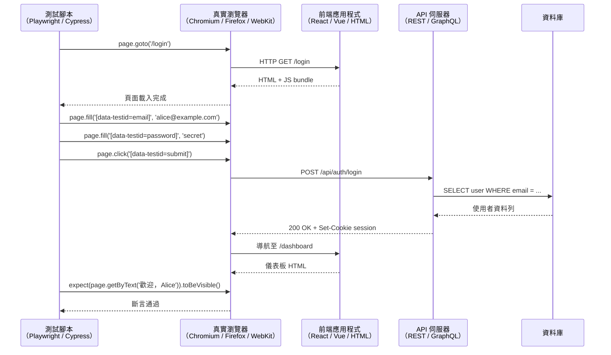

# 端對端測試：Playwright 與 Cypress

## 背景

端對端（E2E）測試像真實使用者一樣，驅動真實瀏覽器操作你的應用程式：導航至某個 URL、填寫表單、點擊按鈕，並對 DOM 中出現的內容進行斷言——同時完整的技術堆疊在背後運行。瀏覽器與前端應用程式通訊，前端呼叫 API 伺服器，API 伺服器查詢真實（或測試隔離的）資料庫，回應透過網路堆疊傳回，產生測試執行器所斷言的 DOM 變化。

這使 E2E 測試成為測試金字塔中唯一能捕捉整類整合錯誤的層級：損壞的認證流程、錯誤配置的 API 路由、阻擋必要腳本的 Content Security Policy、本機開發有但正式環境缺少的 CORS 標頭。當整個系統連接在一起時才會出現的錯誤，任何單元測試或元件測試都無法發現。

**Playwright** 是 Microsoft 於 2020 年發布的瀏覽器自動化框架。它透過單一 API 控制 Chromium、Firefox 和 WebKit（Safari 的引擎），預設在各瀏覽器和工作執行緒之間平行執行測試，並附帶一個追蹤檢視器，記錄每個動作、網路請求和 DOM 快照，讓失敗可以在事後除錯而無需重新執行測試。Playwright 的架構直接透過 Chrome DevTools Protocol（Chromium）及 Firefox 和 WebKit 的對應協定驅動瀏覽器，無需中介伺服器——這消除了整類的不穩定性和啟動延遲。

**Cypress** 於 2015 年推出現代 E2E 開發者體驗時引領了這個領域。它在與應用程式相同的瀏覽器事件迴圈中執行測試，實現了其標誌性功能：時光旅行除錯器，讓你能將滑鼠懸停在測試日誌中的任何指令上，看到那個精確時刻的 DOM 狀態，DOM 快照固定在瀏覽器視區中。Cypress 還引入了透過 `cy.intercept()` 進行網路 stubbing，以及在檔案儲存時即時重新執行測試。它在真實瀏覽器（Chrome、Firefox、Edge）中執行，但不支援 WebKit。Cypress Cloud 為團隊提供跨機器的平行化、不穩定性分析和測試回放功能。

這兩個工具隨著時間推移在功能上趨於一致——兩者現在都提供元件測試模式，無需運行完整應用程式即可掛載元件。但它們在架構、速度預設值和除錯使用體驗上仍存在實質差異。

## 設計思維

### 為什麼 E2E 位於金字塔頂端但不可替代

測試金字塔說要寫比單元測試更少的 E2E 測試，因為 E2E 測試速度更慢、更難維護、也更不穩定。這是真的。但金字塔不是價值排名——它是成本效益指南。E2E 測試之所以不可替代，是因為它們是唯一同時測試完整技術堆疊的層級。

考慮一個登入流程。單元測試可以驗證密碼雜湊函式產生正確的雜湊值。元件測試可以驗證登入表單在送出時派發正確的動作。契約測試可以驗證 API 端點接受正確的請求結構。但這些測試都無法捕捉這種錯誤：正式環境中 API 端點掛載在 `/api/v2/auth/login`，但前端呼叫的是 `/api/auth/login`——這是一類真實的錯誤，只有當瀏覽器、前端、網路層和 API 伺服器都同時運行時才會出現。

E2E 測試還能捕捉 CSP 違規（腳本被 Content-Security-Policy 標頭阻擋）、認證 cookie 網域不匹配（cookie 設置在 `.api.example.com` 但前端在 `app.example.com`），以及由中介件配置引起的重定向迴圈。這些都是整合錯誤，而整合錯誤需要整合測試。

### 為什麼 Playwright 在速度競賽中勝出

Playwright 的架構使其在三個具體方面比 Cypress 更快地處理大型測試套件。

第一，Playwright 預設平行執行測試——同時跨瀏覽器和工作執行緒。每個工作執行緒都有自己的瀏覽器上下文，具有隔離的 cookie、儲存空間和網路狀態。100 個測試組成的套件以平行網格方式執行，而非依序排隊。

第二，Playwright 不需要 Electron 伺服器。Cypress 在瀏覽器旁邊運行一個 Node.js 伺服器來代理網路請求並啟用 `cy.intercept()`。這個伺服器增加了啟動延遲，並且是額外的失敗點。Playwright 直接透過 DevTools Protocol 驅動瀏覽器，無需任何中介程序。

第三，Playwright 的瀏覽器上下文比完整的瀏覽器設定檔更輕量。建立新的上下文（相當於全新的瀏覽器工作階段）只需毫秒。Cypress 在測試之間重新載入瀏覽器頁面，速度較慢。

對於擁有 500 個 E2E 測試的團隊，Playwright 的預設平行架構配合跨機器的 4 向分片，可以將 CI 執行時間從 40 分鐘縮短至 8 分鐘。

### 為什麼 Cypress 仍有擁護者：時光旅行除錯器

Playwright 在吞吐量上勝出。Cypress 在除錯使用體驗上勝出。

當 Playwright 測試在 CI 失敗時，你有一個追蹤檔案（如果已配置），記錄失敗執行中的每個動作、網路請求、控制台訊息和 DOM 快照。你可以開啟 Playwright Trace Viewer，在時間軸上滑動，並在失敗斷言處檢查 DOM。這很強大，但需要下載追蹤產出物並開啟檢視器。

當 Cypress 測試在本機失敗時，你點擊測試日誌中的失敗指令，瀏覽器視區就會顯示那個精確時刻的 DOM——無需下載產出物、無需額外工具、無需重新執行。時光旅行除錯器就在測試執行所在的同一個瀏覽器視窗中。對於開發人員花費大量時間除錯 E2E 失敗的團隊，這種使用體驗優勢是真實的。

Cypress 也受益於更大的外掛生態系統和更長的社群開發模式歷史。如果你的團隊已在使用 Cypress 並建立了關於它的組織知識，除非平行化是痛點，否則遷移至 Playwright 的成本可能不值得。

### 不穩定性問題

E2E 測試因時序問題、網路延遲、動畫和 CI 環境變異而間歇性失敗。95% 時間通過的測試比沒有測試更糟糕——它侵蝕了對整個套件的信任，導致開發人員不斷重新執行測試直到通過，而非調查失敗原因。

緩解措施，按有效性排序：

**自動等待。** Playwright 和 Cypress 都在與元素互動之前自動等待其出現並可互動。Playwright 的 `page.click(locator)` 會重試點擊，直到元素穩定、可見且未被遮擋。Cypress 指令基於重試直到超時的模型。這消除了大多數因非同步渲染而產生的時序問題。

**重試斷言。** Playwright 的 `expect(locator).toBeVisible()` 在條件為真或超時之前重試斷言，而非在那行程式碼執行的瞬間只檢查一次。這處理了元素在應該產生它的動作後 200ms 才出現的情況。

**穩定的選擇器。** 當按鈕的 CSS 類別從 `btn-primary` 改為 `btn-submit`，或按鈕文字從「送出」改為「傳送」時，`[data-testid="submit-button"]` 不會改變。使用 `data-testid` 作為元件與測試之間的選擇器契約，消除了整類的選擇器不穩定性。

**失敗時重試。** 在 CI 上配置 `retries: 2`。這吸收了偶發的基礎設施失敗（不穩定的網路呼叫、導致渲染延遲的瞬間 CPU 峰值）。不要使用重試來遮蔽系統性不穩定性——如果測試在第二次重試時持續失敗，請調查根本原因。

**測試隔離。** 共享狀態的測試會根據執行順序間歇性失敗。每個測試應擁有自己的資料。使用 Playwright 的 `test.beforeEach` 建立全新的使用者帳號並登入，或使用 Playwright 的 `storageState` 從固定裝置檔案還原預先認證的工作階段，而非在每個測試上重新執行登入流程。

### 頁面物件模型（POM）

頁面物件模型是一種設計模式，將頁面互動封裝在類別中，讓測試描述使用者意圖（「以 Alice 身份登入」），而非實作細節（「導航至 /login，透過 data-testid 找到電子郵件輸入框，輸入 alice@example.com，找到密碼輸入框，輸入密碼，點擊送出按鈕」）。當登入頁面的結構改變時，只需更新頁面物件——而非每個使用登入的測試。

登入頁面的 POM 類別提供 `login(email, password)`、`getErrorMessage()` 和 `assertLoggedIn()` 等方法。這些方法包含 Playwright 或 Cypress 呼叫。測試匯入類別並呼叫方法。

## 最佳實踐

**應該（SHOULD）優先使用可存取定位器（`getByRole`、`getByLabel`），僅在無可存取選項時才使用 `data-testid` 作為 E2E 選擇器的退備方案。** Playwright 官方文件將基於 role 和 label 的定位器列為最高優先級，因為它們針對的是能夠在 CSS 重構和標記重組後仍然存在的使用者介面屬性。CSS 類別選擇器絕對禁止（MUST NOT）用作 E2E 定位器——每次設計系統重新命名類別時都會失敗。只為真正沒有可存取 role 或 label 的元素保留 `data-testid`。

**必須（MUST）在 CI 上設定 `retries: 2`，並使用自動等待斷言取代明確的睡眠。** Playwright 和 Cypress 在執行動作前都會自動等待元素出現並可互動。`expect(locator).toBeVisible()` 在內部重試直到條件通過或超時，因此可以表達為斷言的測試中，`page.waitForTimeout()` 絕對禁止（MUST NOT）出現。CI 重試應該（SHOULD）設為 2 次以吸收偶發的基礎設施失敗；需要超過兩次重試的測試存在系統性不穩定問題，必須（MUST）調查。

**必須（MUST）確保每個 E2E 測試完全隔離——測試之間不得共享可變狀態。** 依賴先前測試建立資料的測試，在執行器平行化或重新排序測試時會間歇性失敗。每個測試必須（MUST）在 `beforeEach` fixture 中建立自己的資料，或使用 Playwright 的 `storageState` 還原預先認證的工作階段，而非在整個套件中共享登入狀態。

**應該（SHOULD）將頁面互動封裝在頁面物件模型（POM）類別中，而非直接寫在測試檔案中。** 當定位器邏輯位於測試檔案中時，單一 UI 變更需要編輯每個接觸該頁面的測試。POM 類別提供意圖層級的方法（`loginPage.login(email, password)`）並集中所有定位器引用，使結構性變更應該（SHOULD）只需更新一個類別，而非每個測試。Playwright 官方最佳實踐指南明確背書此模式。

## 視覺化

### E2E 測試流程

測試腳本驅動瀏覽器，瀏覽器運行完整的應用程式堆疊。斷言發生在完整往返的 DOM 輸出上。



## 範例

### 1. Playwright 測試：使用可存取定位器的登入流程

Playwright 的 `page.getByRole` 和 `page.getByLabel` 查詢無障礙樹，而非 DOM 結構。當 HTML 具有無障礙性時，這些是首選的定位器方法；當沒有可存取查詢適用時，`data-testid` 是退備方案。

```ts
// tests/login.spec.ts
import { test, expect } from '@playwright/test'

test('以有效憑證登入並進入儀表板', async ({ page }) => {
  await page.goto('/login')

  // getByLabel 查詢與輸入框關聯的 <label> 元素。
  // 如果關聯缺失，這會立即失敗——暴露真實的無障礙問題，而非將其隱藏。
  await page.getByLabel('Email').fill('alice@example.com')
  await page.getByLabel('Password').fill('correct-horse-battery')

  // getByRole 透過 ARIA role 和可存取名稱找到按鈕。
  await page.getByRole('button', { name: 'Log in' }).click()

  // Playwright 自動等待這段文字出現在 DOM 中。
  await expect(page.getByText('歡迎，Alice')).toBeVisible()

  // 斷言 URL 已改變——確認路由端對端正常運作。
  await expect(page).toHaveURL('/dashboard')
})

test('無效憑證時顯示錯誤', async ({ page }) => {
  await page.goto('/login')

  await page.getByLabel('Email').fill('alice@example.com')
  await page.getByLabel('Password').fill('wrong-password')
  await page.getByRole('button', { name: 'Log in' }).click()

  // data-testid 作為退備方案——錯誤橫幅通常缺少可存取 role
  await expect(page.getByTestId('error-banner')).toBeVisible()
  await expect(page.getByTestId('error-banner')).toHaveText('電子郵件或密碼無效。')
})
```

### 2. Playwright 設定：重試、分片、多瀏覽器

```ts
// playwright.config.ts
import { defineConfig, devices } from '@playwright/test'

export default defineConfig({
  testDir: './tests',

  // 在 CI 上重試失敗的測試兩次，以吸收瞬間的不穩定性。
  // 在本機，重試被停用，讓失敗立即可見。
  retries: process.env.CI ? 2 : 0,

  // 跨工作執行緒平行執行測試（預設：CPU 核心數）。
  workers: process.env.CI ? 4 : undefined,

  // 在第一次重試時收集追蹤，讓 CI 產出物包含
  // 失敗的 DOM 快照、網路請求和控制台日誌。
  use: {
    baseURL: process.env.BASE_URL ?? 'http://localhost:5173',
    trace: 'on-first-retry',
    screenshot: 'only-on-failure',
  },

  projects: [
    // 跨三個主要瀏覽器引擎測試。
    {
      name: 'chromium',
      use: { ...devices['Desktop Chrome'] },
    },
    {
      name: 'firefox',
      use: { ...devices['Desktop Firefox'] },
    },
    {
      name: 'webkit',
      use: { ...devices['Desktop Safari'] },
    },
  ],

  // 如果開發伺服器尚未運行，在執行測試前啟動它。
  webServer: {
    command: 'pnpm dev',
    url: 'http://localhost:5173',
    reuseExistingServer: !process.env.CI,
  },
})
```

在 CI 上執行特定分片以跨機器分佈測試：

```bash
# 執行第 1 個分片（共 4 個）（每台 CI 機器執行不同的分片）
npx playwright test --shard=1/4

# 在另一台 CI 機器上執行第 2 個分片
npx playwright test --shard=2/4
```

使用 4 向分片的 GitHub Actions 範例：

```yaml
# .github/workflows/e2e.yml
name: E2E Tests

on: [push, pull_request]

jobs:
  test:
    runs-on: ubuntu-latest
    strategy:
      matrix:
        shard: [1, 2, 3, 4]
    steps:
      - uses: actions/checkout@v4
      - uses: actions/setup-node@v4
        with:
          node-version: 20
      - run: pnpm install
      - run: pnpx playwright install --with-deps chromium
      - run: pnpm exec playwright test --shard=${{ matrix.shard }}/4
        env:
          CI: true
          BASE_URL: http://localhost:5173
      - uses: actions/upload-artifact@v4
        if: failure()
        with:
          name: playwright-report-${{ matrix.shard }}
          path: playwright-report/
```

### 3. Cypress 測試：visit、data-testid 選擇器、網路 stubbing

```ts
// cypress/e2e/login.cy.ts
describe('登入', () => {
  it('以有效憑證登入', () => {
    // Stub API 呼叫，讓測試不依賴運行中的後端。
    // cy.intercept() 在網路請求離開瀏覽器之前攔截它。
    cy.intercept('POST', '/api/auth/login', {
      statusCode: 200,
      body: { token: 'test-jwt', user: { name: 'Alice', email: 'alice@example.com' } },
    }).as('loginRequest')

    cy.visit('/login')

    // data-testid 選擇器在 UI 重新設計時保持穩定。
    cy.get('[data-testid="email-input"]').type('alice@example.com')
    cy.get('[data-testid="password-input"]').type('correct-horse-battery')
    cy.get('[data-testid="login-submit"]').click()

    // 等待攔截的請求完成。
    cy.wait('@loginRequest')

    // 對 DOM 中的結果進行斷言。
    cy.contains('歡迎，Alice').should('be.visible')
    cy.url().should('include', '/dashboard')
  })

  it('登入失敗時顯示錯誤橫幅', () => {
    cy.intercept('POST', '/api/auth/login', {
      statusCode: 401,
      body: { error: '電子郵件或密碼無效。' },
    }).as('loginFailed')

    cy.visit('/login')

    cy.get('[data-testid="email-input"]').type('alice@example.com')
    cy.get('[data-testid="password-input"]').type('wrong-password')
    cy.get('[data-testid="login-submit"]').click()

    cy.wait('@loginFailed')

    cy.get('[data-testid="error-banner"]')
      .should('be.visible')
      .and('contain.text', '電子郵件或密碼無效。')
  })
})
```

### 4. 登入頁面的頁面物件模型（Playwright）

`LoginPage` 類別封裝登入頁面的所有定位器和互動。測試匯入類別並呼叫方法——當登入頁面改變時，只需更新 POM 類別。

```ts
// tests/pages/LoginPage.ts
import { type Page, type Locator, expect } from '@playwright/test'

export class LoginPage {
  readonly page: Page
  readonly emailInput: Locator
  readonly passwordInput: Locator
  readonly submitButton: Locator
  readonly errorBanner: Locator

  constructor(page: Page) {
    this.page = page
    // 盡可能使用可存取定位器；data-testid 作為退備方案。
    this.emailInput = page.getByLabel('Email')
    this.passwordInput = page.getByLabel('Password')
    this.submitButton = page.getByRole('button', { name: 'Log in' })
    this.errorBanner = page.getByTestId('error-banner')
  }

  async goto() {
    await this.page.goto('/login')
  }

  async login(email: string, password: string) {
    await this.emailInput.fill(email)
    await this.passwordInput.fill(password)
    await this.submitButton.click()
  }

  async assertLoggedIn(userName: string) {
    await expect(this.page.getByText(`歡迎，${userName}`)).toBeVisible()
    await expect(this.page).toHaveURL('/dashboard')
  }

  async assertErrorVisible(message: string) {
    await expect(this.errorBanner).toBeVisible()
    await expect(this.errorBanner).toHaveText(message)
  }
}
```

```ts
// tests/login.spec.ts — 使用頁面物件
import { test } from '@playwright/test'
import { LoginPage } from './pages/LoginPage'

test('成功登入', async ({ page }) => {
  const loginPage = new LoginPage(page)
  await loginPage.goto()
  await loginPage.login('alice@example.com', 'correct-horse-battery')
  await loginPage.assertLoggedIn('Alice')
})

test('密碼錯誤時顯示錯誤', async ({ page }) => {
  const loginPage = new LoginPage(page)
  await loginPage.goto()
  await loginPage.login('alice@example.com', 'wrong-password')
  await loginPage.assertErrorVisible('電子郵件或密碼無效。')
})
```

POM 模式具有良好的可擴展性：當登入頁面新增「記住我」核取方塊或 CAPTCHA 時，你在 `LoginPage` 中新增一個方法——而非在每個使用登入的測試中分散修改。

## 常見錯誤

**透過 E2E 測試所有內容。** 驗證 15 個表單驗證規則的 E2E 測試，其執行成本是 15 個驗證函式單元測試的 10 倍。使用 E2E 測試驗證驗證系統已連接且一個代表性錯誤訊息能正確顯示；使用單元測試詳盡驗證每條規則。E2E 覆蓋率應與整合風險成比例，而非與功能完整性成比例。

**不使用 codegen 腳本起步。** Playwright（`playwright codegen <url>`）和 Cypress（帶有選擇器工具列的 `cypress open`）都可以從真實瀏覽器互動中錄製測試骨架。為新測試先執行 codegen 可以節省時間並產生有效的定位器語法。生成的測試是起點，而非成品——它始終需要手動清理、可讀的斷言和 POM 提取。

**忽略失敗時的追蹤檢視器。** 當 Playwright 測試在 CI 失敗且已配置追蹤（`trace: 'on-first-retry'`）時，追蹤產出物包含失敗執行中的每個動作、網路請求和 DOM 快照。開啟 Playwright Trace Viewer（`npx playwright show-trace trace.zip`）無需重新執行測試即可重現失敗。不配置追蹤的團隊會花費數小時重新執行不穩定的測試，試圖重現追蹤本可在幾分鐘內解釋的失敗。

## 相關 FEE

- [FEE-1100 測試策略總覽](./1100.md) — 測試金字塔、成本與信心的取捨，以及 E2E 相對於單元測試和元件測試的定位
- [FEE-1104 模擬策略](./1104.md) — 在元件測試中使用 MSW 進行 API 模擬；`cy.intercept()` 和 Playwright 路由攔截用於 E2E 網路 stubbing
- [FEE-1107 覆蓋率哲學](./1107.md) — 為何 E2E 覆蓋率指標具有誤導性，以及如何評估 E2E 測試的價值

## 參考資料

- [Playwright — Getting Started](https://playwright.dev/docs/intro) — 官方安裝、測試結構和第一個測試的逐步說明
- [Playwright — Configuration](https://playwright.dev/docs/test-configuration) — 重試、分片、projects（多瀏覽器）、webServer 和追蹤配置
- [Playwright — Locators](https://playwright.dev/docs/locators) — `getByRole`、`getByLabel`、`getByTestId` 和定位器優先順序的理由
- [Playwright — Trace Viewer](https://playwright.dev/docs/trace-viewer) — 錄製追蹤、檢視 DOM 快照和除錯 CI 失敗
- [Cypress — Introduction](https://docs.cypress.io/guides/overview/why-cypress) — Cypress 架構、真實瀏覽器測試和時光旅行除錯器
- [Cypress — cy.intercept()](https://docs.cypress.io/api/commands/intercept) — 網路 stubbing、請求別名和回應固定裝置
- [Playwright vs Cypress — Checkly Engineering Blog](https://www.checklyhq.com/blog/cypress-vs-playwright/) — 架構、速度、除錯使用體驗和多瀏覽器支援的詳細比較
