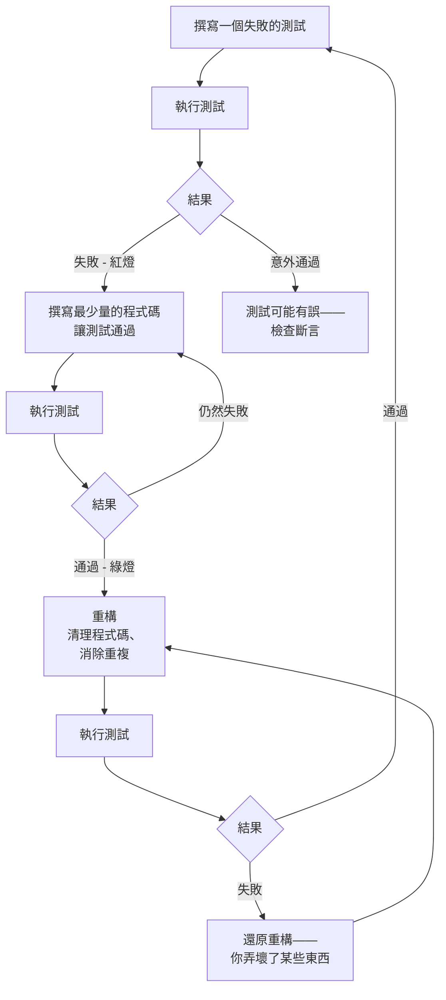

# 測試驅動開發（TDD）

## 背景

測試驅動開發是一種在撰寫任何正式程式碼之前，先寫一個會失敗的測試的軟體開發實踐。流程是：寫一個表達意圖的測試、看它失敗（確認測試是真實有效的）、寫最少量的程式碼讓它通過，然後在保持測試為綠燈的狀態下重構程式碼。

Kent Beck 在 *Test-Driven Development: By Example*（2002）中將 TDD 正式化，將其定位為設計技術而非測試技術——一種讓測試引導你走向更簡潔、更簡單實作的方法。

這個實踐分為兩個公認的流派：

**由內而外 TDD（底特律 / 古典主義派）** — 從最底層開始。為一個小函式寫一個失敗的單元測試，讓它通過，再將這些已測試的單元組合成更大的結構。你在從下往上建構的過程中發現設計。古典主義派在可能的情況下傾向使用真實的協作者而非 mock；測試驗證可觀察的狀態，而非內部互動。這是原始的 Beck 模型。

**由外而內 TDD（倫敦 / 模擬主義派）** — 從最外層邊界開始，通常是一個驗收測試或 E2E 測試。讓失敗的高層測試引導你向內：它失敗是因為某個元件不存在，這驅動了一個失敗的元件測試，進而驅動了一個失敗的單元測試。你從外部向內發現介面——呼叫者的視角決定每一層的形狀，然後才實作。這種方法大量使用 mock 來替代尚未存在的協作者。

兩個流派都不是孤立正確的。大多數實踐者將兩者混合：從由外而內開始確立功能邊界，一旦設計清晰後切換到由內而外。

## 設計思維

### 為什麼 TDD 產生更好的 API 設計

當你先寫測試時，你被迫呼叫你尚未撰寫的程式碼。你必須決定：這個函式應該叫什麼名字？它接受什麼參數？它回傳什麼？呼叫者如何處理錯誤？

這是 TDD 最重要的好處，但它一再被低估。測試優先設計的 API 在它存在之前至少有一個真實的呼叫者：測試本身。如果在測試中呼叫程式碼感覺很彆扭——如果你需要十行設定才能測試一個行為——那種彆扭感在告訴你一些事。API 設計有問題。修改設計，而非測試。

先實作後設計 API 往往會向「對作者方便」而非「對呼叫者方便」偏移。你建構容易實作的東西，然後記錄它，再希望使用者覺得它好用。TDD 將這個順序倒轉：你建構容易使用的東西，然後實作它。

### 為什麼 TDD 在前端比後端更難

一個純函式測試只需三行：呼叫函式、斷言回傳值、結束。一個元件測試需要 DOM 環境、一次渲染過程、非同步狀態解析，以及通常需要模擬的瀏覽器 API。測試設置成本更高。

React Testing Library 藉由用符合使用者視角的查詢隱藏渲染細節，大幅降低了這個成本。但即便有 RTL，元件測試仍然比純函式測試需要更多的腳手架。回報——捕捉渲染輸出、使用者互動和非同步狀態中的迴歸問題——是真實的，但需要耐心設置。

實際建議：對業務邏輯和工具函式嚴格套用 TDD（純函式從測試優先設計中獲益最多）。對元件採用較寬鬆的形式——先草擬元件，然後撰寫固定你關心的行為的測試。對整合是風險所在的功能使用 E2E 測試。

### 為什麼重構步驟是最被忽視的

紅燈 → 綠燈 → 重構循環有三個步驟。實務中，大多數開發者在綠燈後停下來。

一旦測試通過，心理壓力就會來臨：「它可以運作了。上線吧。」重構步驟被跳過，因為它感覺有風險（萬一我弄壞了什麼怎麼辦？）且不必要（測試已經是綠燈了）。

這恰恰相反。綠燈測試就是安全網。你無法在沒有測試的情況下無畏地重構程式碼。有了測試，你可以重新命名變數、提取函式、簡化條件判斷、消除重複——並立即知道是否有什麼東西壞了。重構步驟是 TDD 回收投資的地方。跳過它意味著你積累了與從未寫測試一樣的技術債。

紀律是：不要在綠燈時宣告勝利。問問自己：有重複嗎？名稱準確嗎？結構對下一位讀者清晰嗎？在進入下一個測試之前做出這些修改。

### 研究顯示了什麼

2008 年的一項微軟/IBM 研究（Nagappan、Maximilien、Bhat、Williams——《透過測試驅動開發實現品質改善》）測量了四個職業開發團隊切換到 TDD 的情況。各團隊的缺陷密度下降了 40–90%。開發時間增加了 15–35%。這個額外成本是前期投資；缺陷減少是持續的回報。對於任何運行時間超過一個衝刺的產品，這個經濟效益是正面的。

常見異議：「TDD 讓我變慢了。」這在新技術的第一週是準確的。作為跨越產品生命週期的一般性論斷則是不準確的。除錯時間、迴歸調查，以及觸碰未經測試的程式碼的認知成本，才是緩慢的部分。TDD 用現在快速編碼交換以後較少的除錯。

常見異議：「我還不知道要寫什麼。」正確回應：先做探索。寫一次性的探索性程式碼來理解問題空間，然後刪除它，一旦你理解了設計，再用 TDD 重新開始。探索給你知識；TDD 實作給你你真正會維護的程式碼。

## 最佳實踐

**必須（MUST）在撰寫任何正式程式碼之前確認紅燈階段——一個無法失敗的測試沒有任何價值。** 紅燈-綠燈-重構循環只有在失敗的測試是真實訊號時才有意義。如果一個新測試立即通過，要麼行為已經被實作了，要麼測試本身有問題。你必須（MUST）先執行測試、觀察真正的失敗，然後才撰寫讓它通過的最少正式程式碼。一個你從未看它失敗過的測試不是測試——它是沒有驗證的文件。

**必須（MUST）撰寫最少量讓測試通過的程式碼，然後在進入下一個測試之前重構。** 重構步驟是 TDD 設計效益得以實現的地方。Martin Fowler 指出重構對 TDD 不可或缺：先寫測試迫使介面設計，而在測試為綠燈時重構是防止技術債積累的機制。跳過重構步驟絕對禁止（MUST NOT）以「它可以運作了」為藉口——綠燈測試是安全網，安全網應該（SHOULD）被使用。

**應該（SHOULD）對純函式和業務邏輯嚴格套用 TDD；對元件則採用較寬鬆的形式。** 純函式測試只需三行：呼叫、斷言、結束。元件測試需要 DOM 環境、渲染和非同步解析——設置成本更高。你應該（SHOULD）撰寫固定你關心行為的元件測試，而非對每一行 JSX 嚴格遵循紅燈-綠燈-重構。由外而內 TDD 適合確立功能邊界；一旦設計清晰，切換到由內而外。

**必須（MUST）先做探索再開始 TDD，並在探索結束後刪除探索性程式碼，再用 TDD 實作真實解決方案。** 探索是沒有測試的程式碼，用來獲取知識；它絕對禁止（MUST NOT）成為正式實作。一旦探索澄清了設計，刪除探索性程式碼，從頭開始 TDD。將探索當作 TDD 會話來對待，會產生你沒有充分理解到足以進行測試驅動的程式碼，最終的測試會匹配實作結構而非呼叫者的意圖。

## 視覺化

### TDD 循環



## 範例

### 1. 由內而外 TDD：購物車模組

從一個失敗的測試開始。目前還沒有任何實作。

```ts
// shoppingCart.test.ts — 步驟 1：撰寫失敗的測試
import { describe, it, expect } from 'vitest'
import { createCart } from './shoppingCart'

describe('createCart', () => {
  it('以空的品項清單和零總計開始', () => {
    const cart = createCart()
    expect(cart.items).toEqual([])
    expect(cart.total).toBe(0)
  })
})
```

執行測試。它失敗：`Cannot find module './shoppingCart'`。這是一個有效的紅燈狀態——測試正在表達一個程式碼尚未實現的意圖。

撰寫最少量的程式碼來通過：

```ts
// shoppingCart.ts — 步驟 2：最小實作
export function createCart() {
  return {
    items: [] as CartItem[],
    total: 0,
  }
}
```

測試通過。現在在撰寫更多程式碼之前，先寫下一個失敗的測試：

```ts
// shoppingCart.test.ts — 步驟 3：下一個失敗的測試
it('新增品項並更新總計', () => {
  const cart = createCart()
  const updated = addItem(cart, { id: 'p-1', name: 'Widget', price: 9.99, quantity: 2 })
  expect(updated.items).toHaveLength(1)
  expect(updated.total).toBeCloseTo(19.98)
})
```

紅燈。現在實作：

```ts
// shoppingCart.ts — 步驟 4：實作 addItem
export interface CartItem {
  id: string
  name: string
  price: number
  quantity: number
}

export interface Cart {
  items: CartItem[]
  total: number
}

export function createCart(): Cart {
  return { items: [], total: 0 }
}

export function addItem(cart: Cart, item: CartItem): Cart {
  const items = [...cart.items, item]
  const total = items.reduce((sum, i) => sum + i.price * i.quantity, 0)
  return { items, total }
}
```

綠燈。現在重構：總計計算是會在 `removeItem` 和 `updateQuantity` 中重複出現的邏輯。在撰寫那些測試之前先提取它：

```ts
// shoppingCart.ts — 步驟 5：在新增更多功能前重構
function calculateTotal(items: CartItem[]): number {
  return items.reduce((sum, i) => sum + i.price * i.quantity, 0)
}

export function createCart(): Cart {
  return { items: [], total: 0 }
}

export function addItem(cart: Cart, item: CartItem): Cart {
  const items = [...cart.items, item]
  return { items, total: calculateTotal(items) }
}
```

重構後執行測試。仍然是綠燈。現在繼續：為 `removeItem` 寫下一個失敗的測試，然後重複。

### 2. RTL + Vitest TDD 用於計數器元件

從元件層級由外而內：在元件存在之前先寫測試。

```tsx
// Counter.test.tsx — 步驟 1：失敗的測試
import { describe, it, expect } from 'vitest'
import { render, screen, fireEvent } from '@testing-library/react'
import Counter from './Counter'

describe('Counter', () => {
  it('顯示初始計數為零', () => {
    render(<Counter />)
    expect(screen.getByRole('status')).toHaveTextContent('0')
  })

  it('點擊增加按鈕時計數加一', () => {
    render(<Counter />)
    fireEvent.click(screen.getByRole('button', { name: /increment/i }))
    expect(screen.getByRole('status')).toHaveTextContent('1')
  })

  it('點擊減少按鈕時計數減一', () => {
    render(<Counter />)
    fireEvent.click(screen.getByRole('button', { name: /increment/i }))
    fireEvent.click(screen.getByRole('button', { name: /decrement/i }))
    expect(screen.getByRole('status')).toHaveTextContent('0')
  })

  it('計數不低於零', () => {
    render(<Counter />)
    fireEvent.click(screen.getByRole('button', { name: /decrement/i }))
    expect(screen.getByRole('status')).toHaveTextContent('0')
  })
})
```

四個測試全部失敗：`Counter` 不存在。撰寫最少量的元件讓它們通過：

```tsx
// Counter.tsx — 步驟 2：通過所有測試的最小實作
import { useState } from 'react'

export default function Counter() {
  const [count, setCount] = useState(0)

  return (
    <div>
      <button onClick={() => setCount(c => Math.max(0, c - 1))}>
        Decrement
      </button>
      <span role="status">{count}</span>
      <button onClick={() => setCount(c => c + 1)}>
        Increment
      </button>
    </div>
  )
}
```

四個測試全部通過。重構：下限邏輯（`Math.max(0, ...)`）是一個領域規則。它應該放在一個命名函式中，讓意圖更清晰：

```tsx
// Counter.tsx — 步驟 3：為清晰而重構
import { useState } from 'react'

function clampToZero(value: number): number {
  return Math.max(0, value)
}

export default function Counter() {
  const [count, setCount] = useState(0)

  return (
    <div>
      <button onClick={() => setCount(c => clampToZero(c - 1))}>
        Decrement
      </button>
      <span role="status">{count}</span>
      <button onClick={() => setCount(c => c + 1)}>
        Increment
      </button>
    </div>
  )
}
```

測試仍然通過。重構完成。

### 3. 由外而內 TDD：從 E2E 到元件再到單元

由外而內 TDD 從驗收邊界開始向內鑽入。每一層都驅動下一層的設計。

**步驟 1 — 從 Playwright E2E 測試開始（最外層的驗收邊界）**

```ts
// tests/e2e/checkout.spec.ts
import { test, expect } from '@playwright/test'

test('使用者可以將產品加入購物車並看到更新後的總計', async ({ page }) => {
  await page.goto('/products/widget-pro')

  await page.getByRole('button', { name: /add to cart/i }).click()

  await expect(page.getByRole('status', { name: /cart total/i }))
    .toHaveText('$29.99')
})
```

這個測試失敗，因為頁面不存在。這是正確的：它現在驅動我們去建構這個功能。E2E 測試從使用者視角定義了契約——使用者點擊什麼以及他們期望看到什麼。

**步驟 2 — 為 AddToCartButton 撰寫 RTL 元件測試**

E2E 失敗告訴我們需要一個「加入購物車」按鈕。在實作之前，先撰寫元件測試：

```tsx
// src/components/AddToCartButton.test.tsx
import { describe, it, expect, vi } from 'vitest'
import { render, screen, fireEvent } from '@testing-library/react'
import AddToCartButton from './AddToCartButton'

describe('AddToCartButton', () => {
  it('點擊時以產品 id 呼叫 onAddToCart', () => {
    const onAddToCart = vi.fn()
    render(
      <AddToCartButton productId="widget-pro" price={29.99} onAddToCart={onAddToCart} />
    )

    fireEvent.click(screen.getByRole('button', { name: /add to cart/i }))

    expect(onAddToCart).toHaveBeenCalledWith('widget-pro', 29.99)
  })

  it('點擊後顯示確認訊息', async () => {
    render(
      <AddToCartButton productId="widget-pro" price={29.99} onAddToCart={vi.fn()} />
    )

    fireEvent.click(screen.getByRole('button', { name: /add to cart/i }))

    expect(await screen.findByText(/added to cart/i)).toBeInTheDocument()
  })
})
```

這定義了元件的介面：`productId`、`price`、`onAddToCart`。介面是透過問「呼叫者需要提供什麼，元件需要公開什麼？」來設計的——而非透過問「什麼容易實作？」

**步驟 3 — 為購物車總計計算撰寫單元測試**

元件測試驅動我們實作購物車狀態。在撰寫購物車邏輯之前，先撰寫單元測試：

```ts
// src/lib/cartTotal.test.ts
import { describe, it, expect } from 'vitest'
import { calculateCartTotal } from './cartTotal'

describe('calculateCartTotal', () => {
  it('空購物車回傳 0', () => {
    expect(calculateCartTotal([])).toBe(0)
  })

  it('回傳所有品項的價格乘以數量的總和', () => {
    const items = [
      { price: 29.99, quantity: 1 },
      { price: 9.99, quantity: 3 },
    ]
    expect(calculateCartTotal(items)).toBeCloseTo(59.96)
  })

  it('將總計格式化為貨幣字串', () => {
    const items = [{ price: 29.99, quantity: 1 }]
    expect(calculateCartTotal(items, { format: 'currency' })).toBe('$29.99')
  })
})
```

現在實作 `calculateCartTotal`，然後實作 `AddToCartButton`，再驗證 E2E 測試通過。你由外而內工作：E2E 驅動了元件介面，元件驅動了單元介面。

## 常見錯誤

**先寫實作再寫測試，然後讓測試匹配實作。** 這看起來像 TDD，但沒有任何好處。如果你先寫程式碼，你就無法用測試來發現 API 設計。你也會傾向於寫匹配實作結構而非呼叫者意圖的測試，這意味著測試會在實作內部改變時就失敗——即使行為被保留了。

**當測試設置複雜時放棄 TDD。** 前端元件測試比純函式測試有更多設置。正確的回應是簡化設置——提取測試輔助函式、使用工廠、正確配置 RTL——而非跳過 TDD。複雜的測試設置通常是 API 問題的訊號：元件有太多必要的 props，或者與太多外部依賴耦合。

## 相關 FEE

- [FEE-1100 測試策略總覽](./1100.md) — 測試金字塔以及 TDD 產生的測試如何對應到它
- [FEE-1101 使用 Vitest 進行單元測試](./1101.md) — Vitest 作為單元和整合測試的 TDD 執行器
- [FEE-1102 使用 RTL 進行元件測試](./1102.md) — 讓元件層級 TDD 實際可行的 RTL 模式
- [FEE-1107 測試最佳實踐](./1107.md) — 補充 TDD 的模式：測試輔助函式、工廠、斷言清晰度

## 參考資料

- [Kent Beck — *Test-Driven Development: By Example*（2002）](https://www.oreilly.com/library/view/test-driven-development/0321146530/) — TDD 的奠基文本；第一章以金錢範例逐步說明紅燈-綠燈-重構循環
- [Nagappan、Maximilien、Bhat、Williams — "Realizing quality improvement through test driven development"（2008，Empirical Software Engineering）](https://link.springer.com/article/10.1007/s10664-008-9062-z) — 微軟/IBM 研究，測量四個團隊中 40–90% 的缺陷密度降低，開發時間增加 15–35%
- [Martin Fowler — "Test Driven Development"](https://martinfowler.com/bliki/TestDrivenDevelopment.html) — 對循環、流派以及 TDD 與設計關係的簡潔概述
- [Kent C. Dodds — "Write tests. Not too many. Mostly integration."](https://kentcdodds.com/blog/write-tests) — 主張與 TDD 互補的測試哲學：專注於行為而非實作細節；RTL 的設計受此影響
- [Martin Fowler — "Mocks Aren't Stubs"](https://martinfowler.com/articles/mocksArentStubs.html) — 解釋倫敦（模擬主義派/由外而內）和底特律（古典主義派/由內而外）TDD 流派的區別，以及這個選擇如何影響測試設計
