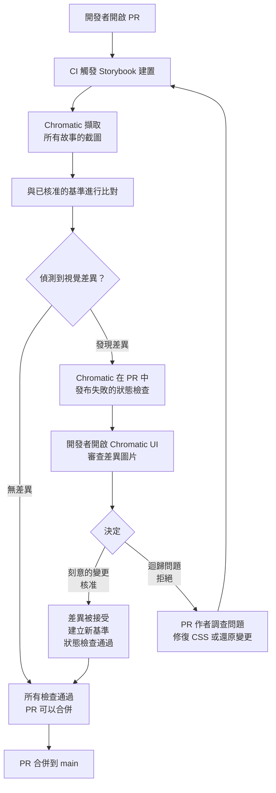

# 視覺回歸測試

## 背景

視覺回歸測試透過比較截圖來捕捉非預期的 UI 變更。流程很直接：在元件或頁面處於已知正常狀態時擷取基準截圖，然後在每次後續建置時擷取新截圖。像素差異演算法比對這兩張圖片。如果差異超過設定的閾值，測試就會失敗，並由人工審查差異，決定這個變更是刻意的設計更新，還是一個不小心溜過程式碼審查的迴歸問題。

核心洞見在於：截圖是使用者實際看到的畫面最忠實的呈現。Jest 元件測試檢查 DOM 樹；TypeScript 編譯器檢查型別；Linter 檢查程式碼風格——但它們都看不到渲染後的字型、計算後的 CSS 層疊、GPU 合成的圖層，或是像素層級的佈局。截圖能看到這一切。

目前有四個主流工具：

**Playwright 截圖 + pixelmatch** — Playwright 可以透過 `page.screenshot()` 或 `toMatchSnapshot()` 擷取整頁或元素層級的截圖。Pixelmatch 是一個純 Node.js 函式庫，計算像素差異並回傳不匹配百分比。這個組合完全開源、完全在自己的基礎設施上運行，讓你對閾值、遮罩和比較邏輯有完整的控制權。代價是你必須自行管理基準圖儲存、CI 差異比對流程和審查工作流程。

**Storybook + Chromatic** — Chromatic（由 Storybook 團隊開發）是一個雲端服務，在每次提交時擷取所有 Storybook 故事的截圖，與上一個基準進行差異比對，並提供 UI 審查介面讓開發者核准或拒絕變更。它直接整合到 GitHub、GitLab 和 Bitbucket 的 PR 狀態檢查。Chromatic 是設計系統團隊的主流選擇，因為 Storybook 故事本身就是孤立且可重現的元件固件——截圖精確捕捉元件的孤立狀態，沒有周圍頁面的雜訊。Chromatic 按每月快照數量計費。

**Percy** — BrowserStack 的視覺測試雲端服務。功能上與 Chromatic 類似：整合 CI、擷取截圖、與基準比對，並提供核准 UI。Percy 支援更廣泛的渲染目標，包括非 Storybook 頁面和靜態網站生成器。對於需要跨完整頁面（而非孤立元件）進行視覺測試的團隊，Percy 是更常見的選擇。

**Backstop.js** — 開源、設定驅動的視覺回歸工具。你在 `backstop.json` 設定檔中定義場景：URL、視口、要擷取的選擇器、互動腳本（擷取前的點擊、捲動、懸停）。Backstop 內部使用 Puppeteer 或 Playwright，並在 Docker 容器中渲染截圖，以消除跨機器的渲染差異。輸出是一個包含差異圖片的獨立 HTML 報告。當 Chromatic/Percy 的費用不合理時，Backstop 是開源替代方案。

## 設計思維

### 為什麼視覺回歸能捕捉到單元測試遺漏的問題

使用 React Testing Library 的 React 元件測試，驗證的是正確的 DOM 節點是否以正確的文字內容、ARIA 角色和事件處理器渲染出來。這很有價值。但測試無法驗證：

- CSS 特異性衝突導致按鈕的背景色渲染為透明
- `z-index` 計算錯誤使下拉選單出現在固定標頭後方
- 設計 token 更新中錯誤的 `font-weight` 讓內文以粗體渲染
- 外距折疊（margin collapse）使兩個區塊在視覺上合而為一
- CSS `overflow: hidden` 裁切掉清單中的最後一個項目

這些問題都會破壞視覺上的 UI，但沒有一個會讓基於 DOM 的測試失敗。元件仍然渲染。文字仍然存在。ARIA 角色仍然正確。測試是綠燈，但 UI 已經損壞。

視覺回歸測試存在於「DOM 正確」和「UI 看起來正確」之間的落差中。截圖能看到一切最終出現在螢幕上的東西，無論是由多少個 CSS 層、繼承的屬性和瀏覽器渲染啟發式規則所產生的。

這也是為什麼視覺回歸測試不是單元或元件測試的替代品，而是互補的。單元測試告訴你為什麼出了問題；視覺差異告訴你出了問題，並讓你看到它確切的樣子。

### 為什麼 Chromatic + Storybook 是設計系統的主流方案

設計系統團隊已經投資於 Storybook 故事作為活文件：每個元件變體（主要按鈕、次要按鈕、停用按鈕、載入中按鈕）都有一個專屬的故事。這項投資的副產品，是一個孤立且可重現的元件固件儲存庫。

Chromatic 將這個既有投資轉化為視覺回歸測試套件，不需要額外撰寫任何測試。每個故事都成為一個測試案例。截圖是在無頭瀏覽器中渲染的故事；差異是與上一個已核准基準的比較；核准工作流程就是 PR 審查流程。

關鍵的架構優勢在於隔離。Chromatic 截圖在白色背景上擷取單一元件，沒有頁面外框、沒有導航列、沒有動態資料。這消除了整頁視覺測試會遭遇的一整類不穩定性：動畫標頭、延遲載入的圖片、第三方小工具和日期相關的內容，全都不存在於 Storybook 故事中。

費用模型是誠實的取捨：Chromatic 按快照計費。一個有 200 個元件、每個 5 個故事的設計系統，每次提交就是 1,000 個快照。對一個有 20 位工程師、每天各提交 5 次的團隊來說，每月就是 100,000 個快照。這個成本是真實的，必須與在人工審查中捕捉視覺迴歸的成本相權衡。

### 為什麼視覺測試在測試成本頂點

測試金字塔確立了測試應在底部（單元測試：快速、廉價、孤立）大量存在，在頂部（E2E 測試：緩慢、昂貴、與完整系統耦合）少量存在。視覺回歸測試在成本軸上位於 E2E 或其上方，原因如下：

**速度。** 一個截圖測試每次擷取需要 5–10 秒：瀏覽器啟動、頁面渲染、CSS 繪製、截圖、差異比對。一個單元測試需要 5–10 毫秒。一個有 500 個截圖的視覺測試套件，端到端執行需要 45–80 分鐘。

**金錢。** 雲端視覺測試服務按快照計費。Chromatic 的定價從每月約 149 美元起（5,000 個快照），並依此規模擴展。Percy 的定價類似。這些是單元測試和元件測試沒有的持續性、重複性運營成本。

**人工審查時間。** 每個超過閾值的視覺差異都需要人工查看並決定是刻意的變更還是迴歸。這很有價值——捕捉到真正的迴歸值得花費審查時間——但它是一種勞動成本，自動化單元測試沒有對等的成本。

基於這些原因，視覺回歸測試在以下情況最合理：

- **設計系統元件**：按鈕元件的視覺迴歸成本，與產品中所有使用它的界面成正比。
- **重要的行銷和落地頁**：流量高且對轉換至關重要的頁面，佈局偏移會造成可量測的營收影響。
- **高流量且品牌識別強烈的 UI**：視覺一致性直接影響用戶信任的頁面。

視覺回歸測試通常在以下情況是過度投資：

- **內部管理工具**：低流量、無品牌要求、快速迭代周期使其額外成本不合理。
- **無樣式要求的表單**：如果唯一的要求是表單欄位可以渲染和提交，DOM 測試就足夠了。
- **快速迭代的原型**：基準圖片的產生速度趕不上變更速度，每個變更都需要核准。

### 不穩定性的取捨

像素精確的比較本質上是脆弱的。同一個元件在搭載 M 系列 GPU 的 macOS 上和在 x86 CI 執行器上的 Ubuntu 上渲染，會在文字上產生略微不同的反鋸齒效果，在邊框上產生略微不同的子像素渲染，以及可能不同的字型暗示。這些差異對人眼不可見，但在像素精確的比較中會登記為數百個不同的像素。

緩解方法：

**百分比閾值。** 大多數工具允許你設定閾值：允許最多 N% 的像素不同才觸發失敗。Playwright 的 `toMatchSnapshot` 接受 `{ threshold: 0.1 }`（每像素色彩距離）和 `{ maxDiffPixelRatio: 0.01 }`（總像素的 1%）。Backstop 接受每個場景的 `misMatchThreshold`。代價是：2% 的閾值可以防止反鋸齒造成的假陽性，但也可能讓 2% 的真正迴歸通過而未被注意到。根據你的特定元件上細微迴歸的樣子來校準閾值。

**遮罩動態區域。** 任何在渲染之間會改變的內容——時間戳、使用者名稱、隨機生成的 ID、廣告橫幅、即時資料饋送——在比較前必須被遮罩。Playwright 允許你在頁面中執行 JavaScript 來在擷取截圖之前用靜態佔位符取代動態文字。Backstop 支援每個場景的 `hideSelectors` 和 `removeSelectors`。

**停用動畫。** CSS 動畫和轉場效果會導致在不同時刻擷取的截圖捕捉到不同的視覺狀態。標準緩解措施是在擷取前注入一個將所有動畫持續時間設為 0ms 的 CSS 規則。Chromatic 提供 `isChromatic()`——一個在 Chromatic 內部運行時回傳 `true` 的執行期輔助函式——讓 Storybook 故事可以有條件地停用動畫。

**使用一致的渲染環境。** 跨機器差異最可靠的緩解措施是 Docker：Backstop 推薦的部署在特定的 Docker 映像中運行 Puppeteer，確保開發者機器和 CI 上有相同的字型渲染、GPU 堆疊和瀏覽器版本。

## 最佳實踐

**必須（MUST）將截圖範圍限定在特定元件或元素，而非整頁。** 用整頁截圖進行元件測試，會擷取到在執行之間變化的動態側邊欄、Cookie 提示橫幅和即時資料饋送，導致每次建置都有假陽性。Playwright 的 `toMatchSnapshot` API 接受定位器範圍，讓你只對受測元素進行快照。你必須（MUST）將視覺斷言範圍限定在最小的有意義區域，只有在明確驗證頁面層級佈局的測試中，才應該（SHOULD）擴展到整頁範圍。

**必須（MUST）從 CI 生成並儲存所有基準，絕不從開發者的本機機器生成。** Playwright 官方文件指出，瀏覽器渲染因作業系統、GPU、電源狀態和無頭模式而有所不同，使得本機生成的基準與 CI 渲染的截圖永久不一致。基準必須（MUST）在與比對時相同的環境中生成；只提交 CI 產生的基準的政策，消除了整類由跨機器渲染差異導致的假陽性。

**必須（MUST）在擷取截圖之前停用所有 CSS 動畫和轉場效果。** 在擷取時正在執行的旋轉 spinner 或任何 CSS `animation`/`transition`，每次都會因時序不同而產生不同的截圖。你必須（MUST）在任何視覺擷取前注入 `animation-duration: 0ms !important; transition-duration: 0ms !important`，或在 Storybook 故事中使用 `isChromatic()` 在 Chromatic 執行時有條件地停用動畫。

**應該（SHOULD）依元件類型校準像素差異閾值，而非設定單一全域值。** 零像素差異的閾值會在反鋸齒文字邊緣上持續失敗；閾值過高則會讓真正的佈局迴歸悄悄通過。以 `maxDiffPixelRatio: 0.01`（總像素的 1%）作為基準，然後依元件調整：文字密集的元件應該（SHOULD）使用比純色塊更寬鬆的閾值，因為字型暗示會引入更多自然差異。

## 視覺化

### Chromatic 工作流程



## 範例

### 1. 使用 `toMatchSnapshot` 的 Playwright 截圖測試

Playwright 內建的快照測試在第一次執行時將基準 PNG 檔案儲存在測試檔案旁邊，並在後續執行時進行比對。

```ts
// tests/visual/button.spec.ts
import { test, expect } from '@playwright/test'

test('主要按鈕渲染正確', async ({ page }) => {
  await page.goto('/components/button?variant=primary')

  // 範圍限定在元件，而非整頁
  const button = page.locator('[data-testid="primary-button"]')

  await expect(button).toMatchSnapshot('primary-button.png', {
    // 允許每像素最多 0.1 的色彩距離（0–1 的比例尺）
    threshold: 0.1,
    // 允許最多 1% 的總像素不同
    maxDiffPixelRatio: 0.01,
  })
})

test('按鈕狀態：懸停和聚焦', async ({ page }) => {
  await page.goto('/components/button?variant=primary')

  const button = page.locator('[data-testid="primary-button"]')

  // 懸停狀態
  await button.hover()
  await expect(button).toMatchSnapshot('primary-button-hover.png', {
    threshold: 0.1,
  })

  // 透過鍵盤的聚焦狀態
  await page.keyboard.press('Tab')
  await expect(button).toMatchSnapshot('primary-button-focus.png', {
    threshold: 0.1,
  })
})
```

執行 `playwright test --update-snapshots` 來生成初始基準。將 PNG 檔案與測試一起提交到版本控制中。在後續執行時，`playwright test` 會將目前的渲染與儲存的基準進行比對。

### 2. 搭配 Chromatic 設置的 Storybook 故事

安裝 Chromatic 並設定它在 CI 上執行。Storybook 故事不需要任何修改——每個故事都會自動被擷取。

```bash
# 安裝 Chromatic CLI
pnpm add -D chromatic

# 執行 Chromatic（通常在 CI 中，而非本地）
# CHROMATIC_PROJECT_TOKEN 設定為 CI 的密鑰
npx chromatic --project-token=$CHROMATIC_PROJECT_TOKEN
```

在 Storybook 故事中，使用 `isChromatic()` 在擷取期間停用動畫：

```tsx
// src/components/Spinner/Spinner.stories.tsx
import type { Meta, StoryObj } from '@storybook/react'
import { isChromatic } from 'chromatic/isChromatic'
import { Spinner } from './Spinner'

const meta: Meta<typeof Spinner> = {
  title: 'Components/Spinner',
  component: Spinner,
}

export default meta
type Story = StoryObj<typeof Spinner>

export const Default: Story = {
  args: {
    size: 'md',
    label: '載入中...',
  },
  decorators: [
    (Story) => (
      // 在 Chromatic 內部執行時凍結所有動畫
      // 讓截圖能擷取到穩定的畫面
      <div style={{ animation: isChromatic() ? 'none' : undefined }}>
        <Story />
      </div>
    ),
  ],
}

export const Large: Story = {
  args: {
    size: 'lg',
    label: '處理中...',
  },
}
```

或者，在 `.storybook/preview.ts` 中注入全域 CSS 覆寫：

```ts
// .storybook/preview.ts
import { isChromatic } from 'chromatic/isChromatic'
import type { Preview } from '@storybook/react'

const preview: Preview = {
  decorators: [
    (Story) => {
      if (isChromatic()) {
        // 注入一個全域停用所有動畫的 style 標籤
        const style = document.createElement('style')
        style.textContent = `
          *, *::before, *::after {
            animation-duration: 0ms !important;
            transition-duration: 0ms !important;
          }
        `
        document.head.appendChild(style)
      }
      return <Story />
    },
  ],
}

export default preview
```

### 3. Backstop.js 設定片段

Backstop 透過 `backstop.json` 進行設定。定義視口、場景（要擷取的 URL 和選擇器），以及每個場景的閾值。

```json
{
  "id": "marketing_site",
  "viewports": [
    { "label": "mobile", "width": 375, "height": 812 },
    { "label": "tablet", "width": 768, "height": 1024 },
    { "label": "desktop", "width": 1440, "height": 900 }
  ],
  "scenarios": [
    {
      "label": "首頁主視覺",
      "url": "http://localhost:3000/",
      "selectors": ["#hero"],
      "misMatchThreshold": 0.5,
      "requireSameDimensions": true
    },
    {
      "label": "定價表",
      "url": "http://localhost:3000/pricing",
      "selectors": [".pricing-grid"],
      "misMatchThreshold": 0.2,
      "hideSelectors": [".live-chat-widget"],
      "removeSelectors": ["[data-testid='cookie-banner']"]
    },
    {
      "label": "導航列——展開狀態",
      "url": "http://localhost:3000/",
      "selectors": ["nav"],
      "clickSelector": "[aria-label='Open menu']",
      "postInteractionWait": 300,
      "misMatchThreshold": 0.5
    }
  ],
  "paths": {
    "bitmaps_reference": "backstop_data/bitmaps_reference",
    "bitmaps_test": "backstop_data/bitmaps_test",
    "html_report": "backstop_data/html_report"
  },
  "engine": "playwright",
  "engineOptions": {
    "args": ["--no-sandbox"]
  },
  "dockerCommandTemplate": "docker run --rm -i --mount type=bind,source={cwd},target=/src backstopjs/backstopjs:{version} {backstopCommand} {args}"
}
```

執行一次基準擷取：`npx backstop reference`。然後在每次後續建置時：`npx backstop test`。位於 `backstop_data/html_report/index.html` 的 HTML 報告顯示並排的參考和測試圖片，並疊加差異圖。

### 4. 在 Playwright 中遮罩動態內容

任何在渲染之間會改變的內容，必須在擷取截圖之前替換成穩定的佔位符。Playwright 讓你在頁面中執行 JavaScript 來直接操作 DOM。

```ts
// tests/visual/dashboard.spec.ts
import { test, expect } from '@playwright/test'

test('儀表板佈局是穩定的', async ({ page }) => {
  await page.goto('/dashboard')

  // 等待儀表板完成載入
  await page.waitForSelector('[data-testid="dashboard-content"]')

  // 將時間戳替換為靜態字串
  await page.locator('[data-testid="last-updated"]').evaluate(
    (el) => { el.textContent = '2024-01-01 00:00:00' }
  )

  // 替換使用者特定的問候語
  await page.locator('[data-testid="greeting"]').evaluate(
    (el) => { el.textContent = '您好，[使用者]' }
  )

  // 將隨機生成的頭像 URL 替換為佔位色塊
  await page.evaluate(() => {
    document.querySelectorAll('[data-testid="user-avatar"]').forEach((img) => {
      const placeholder = document.createElement('div')
      placeholder.style.cssText = 'width:40px;height:40px;background:#ccc;border-radius:50%'
      img.replaceWith(placeholder)
    })
  })

  // 使用 Playwright 內建的 mask 選項遮罩整個區域
  // （在截圖中的遮罩區域上渲染洋紅色方塊）
  const activityFeed = page.locator('[data-testid="activity-feed"]')

  await expect(page).toMatchSnapshot('dashboard.png', {
    threshold: 0.1,
    mask: [activityFeed],
  })
})
```

`toMatchSnapshot` 中的 `mask` 選項是排除整個區域最簡潔的方法：Playwright 在差異比對前，在遮罩的 locator 上覆蓋一個實心洋紅色矩形，因此該區域內任何內容的變化對比對都是不可見的。

## 常見錯誤

**刻意的設計變更後跳過核准步驟。** 當設計師更改主要按鈕的顏色時，所有包含主要按鈕的截圖測試都會失敗。正確的回應是在 Chromatic 中核准這些差異（或更新 Backstop 的基準圖片）並提交新基準。錯誤的回應是提高閾值讓失敗消失，這同時也會遮蔽未來的迴歸。

**對所有東西都加上視覺回歸測試。** 並非每個元件都需要截圖測試。單元和元件測試涵蓋行為；視覺測試涵蓋外觀。工具 hook 沒有外觀可以測試。沒有品牌要求的內部資料表格，不值得花費快照儲存和審查的額外成本。在視覺一致性是產品要求的地方套用視覺測試，而不是對所有元件作為預設值。

## 相關 FEE

- [FEE-1100 測試策略總覽](./1100.md) — 測試金字塔以及視覺測試相對於單元、元件和 E2E 測試的位置
- [FEE-1102 使用 Storybook 進行元件測試](./1102.md) — Storybook 互動測試，與 Chromatic 視覺快照互補
- [FEE-1107 測試最佳實踐](./1107.md) — 視覺回歸在均衡測試策略中的位置，以及何時值得投資

## 參考資料

- [Playwright — Visual Comparisons](https://playwright.dev/docs/screenshots) — Playwright 官方文件，涵蓋 `toMatchSnapshot`、`page.screenshot`、閾值選項和 mask API
- [Chromatic — Introduction](https://www.chromatic.com/docs/) — Chromatic 文件，涵蓋設置、UI 審查工作流程、基準管理和 `isChromatic()` 使用方式
- [Backstop.js — GitHub Repository and README](https://github.com/garris/BackstopJS) — 場景、視口、閾值和 Docker 引擎選項的設定參考
- [Gleb Bahmutov — "Visual Testing with Playwright"](https://glebbahmutov.com/blog/visual-testing-with-playwright/) — Playwright 截圖測試的實務演練，包含動態內容遮罩策略
- [Storybook — Visual Testing](https://storybook.js.org/docs/writing-tests/visual-testing) — Storybook 自己的文件，涵蓋整合視覺測試工具，包含 Chromatic 和替代方案
