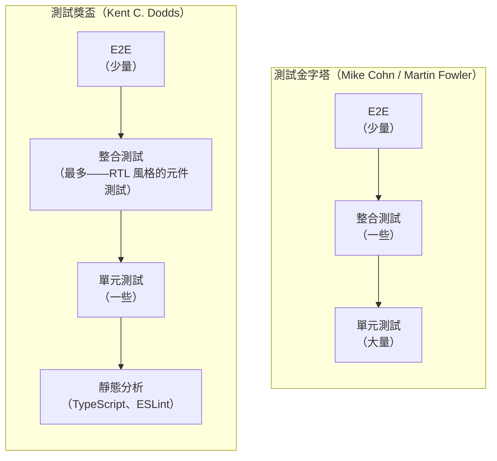

# [FEE-1107] 測試哲學：覆蓋率、信心與測試金字塔

:::info
覆蓋率百分比衡量的是程式碼在測試執行期間是否被執行，而不是是否有測試驗證了執行結果的正確性。一個測試套件可以達到 100% 的行覆蓋率，卻沒有做出任何有意義的斷言。本文區分前端測試的兩個主流心智模型（金字塔與獎盃），說明突變測試如何揭露覆蓋率看不到的缺口，並提出具體規則，判斷該測試什麼、該略過什麼，以及測試套件何時算是完成。
:::

## 背景

每個測試套件最終都會面臨同一個問題：測試到什麼程度才夠？直覺的答案是「越多越好」，這導致團隊追逐覆蓋率百分比、在 CI 中強制要求 80% 的行覆蓋率，最終產出龐大、緩慢、維護成本高昂的測試套件，卻仍然無法真正防止迴歸。本文探討測試決策背後的概念框架：如何誠實地解讀覆蓋率數字、測試套件應該是什麼形狀、如何偵測覆蓋率無法發現的缺口，以及何時應該停止寫測試。

測試金字塔（Testing Pyramid）與測試獎盃（Testing Trophy）是前端測試討論中兩個主流的心智模型。金字塔（Mike Cohn 提出，Martin Fowler 推廣）主張大量單元測試、較少整合測試、極少 E2E 測試。這個形狀由經濟效益驅動：單元測試在毫秒內執行且不需要任何基礎設施；E2E 測試則需要啟動真實瀏覽器、在運行中的應用程式中導航，每個測試耗時數秒。獎盃最早由 Kent C. Dodds 在 2018 年 2 月 6 日的一則推文中提出雛形，並在他 2021 年的〈Testing Trophy and Testing Classifications〉文章中進一步闡述，針對前端情境修改了這個處方：最大的一層是整合測試，也就是使用 React Testing Library 或類似工具撰寫的元件層級測試，因為它們在 UI 程式碼中提供最佳的信心效益比。金字塔和獎盃在底部（許多快速、廉價的單元測試）與頂部（少量昂貴的 E2E 測試）上達成共識，但中間層有分歧：對後端或程式庫程式碼而言，金字塔中間層的整合測試規模相對較小；對前端程式碼而言，獎盃主張中間層才是應該投入最多資源的地方。另外還有兩個模型從不同角度處理同一個權衡：Spotify 的測試蜂巢（Testing Honeycomb，André Schaffer，2018 年）為微服務程式碼重新塑造了這個概念，採用更重的整合層；Google 的〈Just Say No to More End-to-End Tests〉（Mike Wacker，2015 年）則是本文全文所依賴之 E2E 成本論證的經典陳述。

覆蓋率指標（行覆蓋率、分支覆蓋率和函式覆蓋率）報告的是測試執行期間哪些程式碼被執行了，而不是測試是否對結果做出了任何有意義的斷言。這個區別是關於覆蓋率的大多數混淆的根源。一個呼叫函式但不做任何斷言的測試，可以產生 100% 的行覆蓋率，同時提供零信心。覆蓋率告訴你什麼被執行了；突變測試告訴你什麼被真正檢查了。

## 視覺對比

### 測試金字塔 vs. 測試獎盃



### 信心 vs. 成本矩陣

```mermaid
quadrantChart
    title 測試類型：信心 vs. 成本
    x-axis 低成本 --> 高成本
    y-axis 低信心 --> 高信心
    quadrant-1 高價值，謹慎預算
    quadrant-2 理想區域
    quadrant-3 低價值，最小化
    quadrant-4 高價值，積極投入
    靜態分析: [0.05, 0.45]
    單元測試: [0.15, 0.5]
    整合測試 (RTL): [0.4, 0.82]
    E2E (Playwright): [0.8, 0.9]
    視覺回歸: [0.88, 0.7]
```

## 範例

### 1. 覆蓋率陷阱：100% 行覆蓋率卻遺漏了一個 bug

```ts
// math.ts
export function divide(a: number, b: number): number {
  return a / b
}
```

```ts
// math.test.ts — 達到 100% 行覆蓋率，但遺漏了除以零的情況
import { divide } from './math'

test('divides two numbers', () => {
  expect(divide(4, 2)).toBe(2)
})
// 行覆蓋率：100%。分支覆蓋率：100%。函式覆蓋率：100%。
// 但 divide(10, 0) 返回 Infinity——從未被測試。
// divide(0, 0) 返回 NaN——從未被測試。
```

突變測試捕獲了覆蓋率遺漏的東西。Stryker 會建立一個將 `a / b` 改為 `a * b`、`a - b` 或 `a + b` 的突變。以輸入 `divide(4, 2)` 為例，正確結果是 2。`a * b` 突變會回傳 8，`a + b` 突變會回傳 6，因此這兩個突變都會被消滅：測試失敗，Stryker 將這個變化記錄為已捕獲。`a - b` 突變會回傳 `4 - 2`，同樣等於 2，恰好與測試期望的值相同，純屬巧合。這個突變存活了下來：對這筆輸入而言，測試套件無法區分減法和除法，即使在生產環境中，除法和減法對絕大多數其他輸入所做的事情截然不同。Stryker 將這個存活的突變標記為一個缺口。

一個更好的測試套件：

```ts
test('divides two positive numbers', () => {
  expect(divide(10, 2)).toBe(5)
})

test('returns Infinity when dividing by zero', () => {
  expect(divide(10, 0)).toBe(Infinity)
})

test('returns NaN for 0 divided by 0', () => {
  expect(divide(0, 0)).toBeNaN()
})

test('handles negative divisor', () => {
  expect(divide(10, -2)).toBe(-5)
})
```

這個套件消滅了算術運算符的突變，因為和上面巧合的 `4 / 2` 案例不同，這裡沒有任何一筆輸入會在換成別的運算符後產生相同的結果：光是 `divide(10, 2)` 就已經足以區分 `/` 與 `*`、`-`、`+`，因為只有在運算符確實是除法時，它才會回傳 5。

### 2. Stryker.js 設定與突變報告

為 Vitest 專案安裝並設定 Stryker：

```bash
pnpm add -D @stryker-mutator/core @stryker-mutator/vitest-runner
```

```js
// stryker.config.mjs
/** @type {import('@stryker-mutator/api/core').PartialStrykerOptions} */
export default {
  testRunner: 'vitest',
  // 只突變應用程式原始碼，不突變測試或設定
  mutate: ['src/**/*.ts', '!src/**/*.test.ts', '!src/**/*.spec.ts'],
  // Vitest 執行器選項
  vitest: {
    configFile: 'vitest.config.ts',
  },
  // 報告器：終端機中的進度 + 詳細的 HTML 報告
  reporters: ['progress', 'html'],
  // 如何解讀結果
  thresholds: {
    high: 80,    // >= 80% 的突變被消滅：良好
    low: 60,     // 60-79%：警告
    break: 50,   // < 50%：讓 CI 步驟失敗
  },
}
```

執行：`npx stryker run`

範例報告輸出（簡化）。Stryker 的突變分數計算方式是 `(消滅數 + 逾時數) / 突變總數`；逾時的突變也算作被偵測到，因為卡住本身就是測試會注意到的一種行為變化：

```
Mutation testing report
=======================
Ran 47 mutants in 12.3 seconds

Killed:   38 (81%)
Survived:  7 (15%)
Timeout:   2 ( 4%)

Score: 85%

Survived mutations:
  src/utils/clamp.ts:4:18  EqualityOperator: `<` => `<=`
  src/utils/clamp.ts:5:18  EqualityOperator: `>` => `>=`
  src/api/auth.ts:22:3     ConditionalExpression: `status === 401` => `true`
  src/api/auth.ts:22:3     ConditionalExpression: `status === 401` => `false`
  ...
```

每個存活的突變都指出一個特定的行為缺口。`clamp.ts` 的存活者告訴你邊界條件（`<=` vs `<`）沒有被測試。`auth.ts` 的存活者告訴你 401 處理路徑沒有被任何斷言驗證。

### 3. 過度指定的測試 vs. 良好指定的測試

過度指定的測試耦合了實作細節，在無害的重構上就會失敗：

```tsx
// 不好的做法：測試內部結構，而非使用者可見的行為
test('LoginForm 用 email 和 password 呼叫 handleSubmit', () => {
  const handleSubmit = vi.fn()
  const { getByTestId } = render(<LoginForm onSubmit={handleSubmit} />)

  // 耦合到作為實作細節的內部 test ID
  fireEvent.change(getByTestId('email-input'), {
    target: { value: 'user@example.com' },
  })
  fireEvent.change(getByTestId('password-input'), {
    target: { value: 'secret' },
  })
  fireEvent.click(getByTestId('submit-button'))

  // 斷言內部函式呼叫，而非使用者看到的結果
  expect(handleSubmit).toHaveBeenCalledWith({
    email: 'user@example.com',
    password: 'secret',
  })
})
// 如果開發者將 data-testid="email-input" 重命名為 data-testid="login-email"，
// 這個測試就會失敗——即使表單的行為完全沒有改變。
```

良好指定的測試透過無障礙角色查詢，並斷言可觀察的結果。它使用 Mock Service Worker（MSW）在網路層攔截登入請求，而不是模擬元件的內部實作；本範例所假設的 MSW 設定，請參見 [FEE-1104 模擬、替身與測試替代物](/zh-tw/Testing%20Strategies/1104)：

```tsx
// 好的做法：測試使用者的體驗，能在內部重構後存活
import { render, screen } from '@testing-library/react'
import userEvent from '@testing-library/user-event'
import { http, HttpResponse } from 'msw'
import { server } from '../mocks/server'
import { LoginForm } from './LoginForm'

test('提交憑證並在成功時重新導向', async () => {
  const user = userEvent.setup()

  // 觀察伺服器收到什麼——這是使用者可見的行為
  let capturedBody: unknown
  server.use(
    http.post('/api/login', async ({ request }) => {
      capturedBody = await request.json()
      return HttpResponse.json({ token: 'abc123' })
    })
  )

  render(<LoginForm />)

  // 透過標籤文字查詢——無論 test ID 或元素結構如何，都能運作
  await user.type(screen.getByLabelText('電子郵件'), 'user@example.com')
  await user.type(screen.getByLabelText('密碼'), 'secret')
  await user.click(screen.getByRole('button', { name: /登入/i }))

  // 斷言使用者在成功後看到的內容
  expect(await screen.findByText('歡迎回來')).toBeInTheDocument()
  // 斷言 API 合約——對後端消費者可觀察的
  expect(capturedBody).toEqual({ email: 'user@example.com', password: 'secret' })
})
```

這個測試能在重命名內部變數、重構元件的 JSX、更改 test ID 以及將表單拆分成子元件後仍然存活，因為它從未觸及任何這些實作細節。

### 4. 帶有閾值的 Vitest 覆蓋率設定

```ts
// vitest.config.ts
import { defineConfig } from 'vitest/config'

export default defineConfig({
  test: {
    coverage: {
      // 使用 V8（快速，內建於 Node）或 Istanbul（更詳細的分支資訊）
      provider: 'v8',

      // 要為哪些檔案測量覆蓋率
      include: ['src/**/*.{ts,tsx}'],
      exclude: [
        'src/**/*.test.{ts,tsx}',
        'src/**/*.stories.{ts,tsx}',
        'src/mocks/**',
        // 純型別檔案沒有可覆蓋的執行時期行為
        'src/**/*.d.ts',
      ],

      // 報告器：終端機中的文字摘要 + 用於 CI 覆蓋率上傳的 lcov
      reporter: ['text', 'lcov', 'html'],

      // 閾值：如果覆蓋率低於這些值，CI 就會失敗。
      // 這些是「我們是否完全忘記測試這個檔案」的健全性檢查，
      // 不是品質關卡。不要將它們設為 100%。
      thresholds: {
        // 所有檔案的全域閾值
        lines: 75,
        functions: 75,
        branches: 65,   // 分支覆蓋率較難達到，設低一點
        statements: 75,

        // 每個檔案的閾值：對關鍵業務邏輯更嚴格
        perFile: false, // 啟用以對每個檔案而非全域強制閾值
      },
    },
  },
})
```

分支閾值有意設得比行閾值低。分支覆蓋率要求執行每個條件的兩個分支，包括錯誤路徑、邊界條件和可選鏈的後備值。在 75% 的行覆蓋率旁邊達到 65% 的分支覆蓋率是現實可行的；要求兩者都達到 80%，通常會產生測試錯誤路徑但什麼斷言也不做的測試。

## 最佳實踐

**驗證使用者或模組消費者可觀察到的行為。絕不測試內部實作細節。** 一個對內部狀態屬性、私有方法，或從元件外部存取的 hook 回傳值做斷言的測試，會耦合到每次重構都可能改變的實作選擇，即使外部行為完全相同。測試必須（MUST）斷言使用者或呼叫端所觀察到的內容：渲染的文字、ARIA 狀態、API 載荷、回傳值，而不是產生這些輸出的內部結構。

**將覆蓋率作為找出未測試程式碼的缺口偵測器，而非用來認證測試正確性的品質關卡。** 覆蓋率告訴你哪些行被執行了，而不是是否有任何斷言檢查過它們。實務上將 CI 閾值設在 70–80% 的行覆蓋率，能標記出完全沒有測試的檔案，同時不會激勵無斷言的測試填充。100% 的覆蓋率禁止（MUST NOT）被解讀為對正確性的信心；真正有意義的問題永遠是：如果在一個被覆蓋的行中引入一個真實的 bug，這些測試是否會失敗。

**對變更的程式碼執行突變測試，而非對整個程式碼庫執行，以找到覆蓋率無法偵測到的行為缺口。** Stryker.js 等突變測試工具會對生產程式碼做出小而系統性的變更，例如將 `>` 改為 `>=`、將 `+` 替換為 `-`，並回報哪些突變存活下來（代表沒有測試注意到這個變化）。Google 自身導入突變測試的經驗發現，對大型程式碼庫執行完整分析無法擴展，因此改為只對每次程式碼審查中變更的行做突變（Petrović 與 Ivanković，ICSE-SEIP，2018 年）。你應該（SHOULD）對變更的檔案以增量模式執行 Stryker.js（`npx stryker run --incremental`），而非對整個套件執行，以在維持高信號回饋的同時控制成本。

**刪除脆弱的測試，而非讓它們保持被跳過狀態。** 被標記為 `.skip` 的測試不是通過的測試：它是被忽略的測試，不再驗證它原本被寫來驗證的行為。一個在無害的重構上就會失敗的脆弱測試，會訓練工程師忽略失敗，並侵蝕對套件的信任。你必須（MUST）修復這種脆弱性（透過測試可觀察的行為而非實作細節），或者刪除該測試並用一個規格良好的測試取代它。不斷增長的被跳過測試清單，是測試套件腐化的跡象，必須（MUST）被正視處理。

## 設計思維

### 金字塔與獎盃的比較

金字塔與獎盃是針對不同的程式碼庫，校準同一個權衡取捨。

金字塔涵蓋所有軟體：它將單元測試訂為基礎，因為隔離性和速度具有普遍價值。對於後端服務或工具程式庫，金字塔中間層（驗證模組互動的整合測試）規模適中。對於建立在 React 或 Vue 上的前端應用程式，大多數有趣的行為不是存在於孤立的純函式中，而是存在於元件、狀態和 DOM 之間的互動中。RTL 風格的整合測試測試的正是這種互動。獎盃反映了這一點：它將重心從許多對個別函式的小型單元測試，轉移到渲染整個元件樹並以使用者的方式驗證行為的整合測試。

這不僅僅是美學上的差異。一個針對 `<LoginForm>` 的整合測試，驗證元件以正確的載荷呼叫 API 並在憑證錯誤時顯示錯誤訊息，比二十個對該表單內部各個輔助函式的單元測試，能捕獲更廣泛的迴歸。那些輔助函式可能在孤立環境下都能正確運作，但元件仍然失敗，因為它們被錯誤地連接在一起。整合測試能捕獲這個問題。單元測試做不到。

獎盃還明確地將靜態分析（TypeScript、ESLint）納入其基礎層，這是原始金字塔省略的一個類別。靜態分析是最廉價的回饋：它在編輯時以毫秒執行、不需要測試執行器，並且能在應用程式甚至還未啟動之前捕獲廣泛的缺陷類別（錯誤的型別、未定義的變數、未使用的 import）。它能捕獲的範圍雖然真實存在，但比直覺認為的還要窄：Gao、Bird 與 Barr 對開源 JavaScript bug 的研究發現，靜態型別檢查器大約能捕獲他們研究的 bug 中的 15%（ICSE，2017 年）。

### 為什麼 100% 覆蓋率是個陷阱

覆蓋率衡量的是執行路徑，而不是正確性。考慮以下函式：

```ts
function clamp(value: number, min: number, max: number): number {
  if (value < min) return min
  if (value > max) return max
  return value
}
```

一個單一的測試，`expect(clamp(5, 0, 10)).toBe(5)`，對這個函式達到了 100% 的行覆蓋率。所有三行都被執行了。但這個測試對邊界條件什麼也沒說：`clamp(0, 0, 10)`、`clamp(10, 0, 10)`、`clamp(-1, 0, 10)`、`clamp(11, 0, 10)` 或 `clamp(NaN, 0, 10)`。任何邊界上的 bug 都不會被捕獲。

這是古德哈特定律（Goodhart's Law）在測試上的應用：當一個指標成為目標時，它就不再是一個好的指標。當 CI 把 80% 的行覆蓋率設為關卡時，工程師就會寫出執行程式碼但不斷言正確性的測試，這正是這個指標本應防止的事情。

分支覆蓋率比行覆蓋率更嚴格（它要求每個 `if` 的兩個分支都被執行），函式覆蓋率追蹤哪些函式完全被呼叫了。但這三個指標都有相同的根本限制：它們衡量執行，而不是斷言的正確性。一個測試可以執行函式的每個分支，卻只斷言函式沒有拋出錯誤。該測試對於在大多數輸入上產生錯誤結果的函式，仍然會顯示 100% 的分支覆蓋率。

從實證角度看，這並非只是理論上的疑慮。Inozemtseva 與 Holmes 針對五個各有 1,000 多個測試的大型 Java 專案，測量了覆蓋率與缺陷偵測效果之間的關係，發現在控制套件規模這個變因後，覆蓋率與套件實際能捕獲的缺陷數量之間只有微弱的相關性（ICSE，2014 年）。

### 覆蓋率的正確用途

儘管有這個限制，覆蓋率對一件事還是有用的：識別完全沒有任何測試觸及的程式碼。一個行覆蓋率為 0% 的函式沒有任何測試。這是可以採取行動的信號。

一個實際的政策：在 CI 中執行覆蓋率作為發現未覆蓋程式碼的健全性檢查，而不是品質關卡。70–80% 的行覆蓋率閾值將標記完全沒有測試的檔案，同時不會激勵無斷言的測試填充。將覆蓋率下降視為尋找缺失測試的信號，而不是將覆蓋率上升視為測試品質好的證明。

### 突變測試：找到覆蓋率看不到的缺口

突變測試在與覆蓋率不同的軸上運作。覆蓋率問的是「這一行被執行了嗎？」，突變測試問的是「有任何測試真正驗證了這一行的作用嗎？」

突變測試工具（JavaScript 和 TypeScript 的 Stryker.js）對生產程式碼做出小而系統性的修改：將 `>` 改為 `>=`、將 `+` 替換為 `-`、移除 `return` 語句。接著它在每次修改後執行測試套件。如果一個突變導致測試失敗，這個突變就被「消滅」了：至少有一個測試注意到了這個變化。如果儘管有突變，所有測試都通過了，這個突變就「存活」了：測試套件沒有驗證這個突變所改變的行為。

Stryker 會將此回報為突變分數（mutation score）：`(消滅數 + 逾時數) / 突變總數`。突變存活率則是它的補數，也就是沒有任何測試捕獲到的突變比例。一個行覆蓋率 100%、突變存活率 30%（突變分數 70%）的函式，有許多存活的突變：它將近三分之一的行為沒有被任何斷言檢查過。一個行覆蓋率 60%、突變存活率 5%（突變分數 95%）的函式，在其覆蓋的路徑內測試得很好。

突變測試很慢。它對每個突變執行一次完整的測試套件，所以一個有 50 個潛在突變點的檔案需要 50 次測試套件執行。它仍然是測試品質可用的最高保真度信號。

### 什麼該測試、什麼不該測試

並非所有事情都應該直接測試。測試錯誤的事情會產生一個維護成本高昂且提供虛假信心的測試套件。

**應該測試：** 使用者或模組消費者可觀察到的行為：元件在特定輸入下渲染什麼、表單提交觸發什麼 API 呼叫、fetch 失敗產生什麼錯誤狀態、純函式對給定輸入返回什麼。

**不應該測試：** 第三方函式庫。`lodash.debounce` 由 lodash 測試。React 的事件系統由 React 團隊測試。測試呼叫 setter 後 `useState` 更新狀態是在測試 React，而不是你的程式碼。要測試的邊界是你的程式碼對函式庫的使用，而不是函式庫的內部行為。

**不應該測試：** 沒有邏輯的瑣碎 getter 和 setter。一個返回 `this.name` 的函式不需要單元測試。如果它被使用它的元件的整合測試所覆蓋，那就足夠了。

**不應該測試：** 實作細節。測試元件呼叫特定內部函式、輔助函式以模組內部的特定參數被呼叫、或類別有特定私有方法：這些測試在實作改變時就會失敗，即使行為保持不變。它們增加了維護成本，卻沒有增加信心。

**不應該測試：** 靜態型別已經驗證的事情。如果 TypeScript 阻止了在需要數字的地方傳入字串，你不需要為該情況寫執行時期測試。型別系統在編輯時就捕獲了它。

### 測試的成本方程式

每個測試都有成本：最初撰寫它的時間、實作改變時維護它的時間，以及它消耗的 CI 時間乘以 CI 執行的次數。舉一個假設情境：假設一個測試需要 100 毫秒，CI 在每個 PR 上大約執行 5 次，而一個團隊每天開啟 10 個 PR。在一個為期 2 年的專案中（大約 730 天），這相當於 `100 毫秒 × 5 × 10 × 730 ≈ 1 小時` 的累積 CI 時間。現在假設在同樣的條件下，一個緩慢的 E2E 測試需要 30 秒：`30 秒 × 5 × 10 × 730 ≈ 304 小時`，相當於單一測試就佔用了大約兩週的持續運算時間。緩慢的測試在 CI 成本上的累積方式，是快速測試所沒有的，這也是為什麼把斷言下放到仍能捕獲該 bug 的最快層級，能在專案的整個生命週期中帶來回報。

這個成本必須與測試提供的信心相權衡。一個定期偵測到真實迴歸的測試，其成本是值得的。一個只有在開發者重構內部實作時才失敗的測試，消耗了 CI 時間和維護精力，卻沒有提供任何價值。

這帶來的結論是：刪除一個測試可以是正確的決定。一個脆弱的測試（在無害的重構上失敗並且需要持續維護才能保持綠燈的測試）比沒有測試更糟糕。它訓練工程師忽略失敗（「可能只是那個不穩定的測試又來了」），侵蝕了對套件的信任，並消耗維護時間。刪除它，然後寫一個更好的測試，覆蓋相同的行為但不耦合到實作細節。

### 測試套件健康指標

三個信號決定測試套件是否正常運作：

**速度**，作為粗略的參考：一個 5 分鐘以內完成的完整套件，通常會在每個 PR 上執行。一個需要 30 分鐘的套件，通常只會在發布前才執行。一個需要 2 小時的套件，通常會被跳過，然後套件會因為覆蓋率下降而沒有人修復。

**可靠性。** 一個失敗頻率高到讓工程師不再信任其紅燈狀態的套件，是一個連真正的迴歸都會被和雜訊一起忽略的套件。不穩定的測試（在沒有任何程式碼變更的情況下失敗的測試）必須立即修復，而不是用 `test.skip` 跳過然後遺忘。這個問題的規模並非假設性的：Google 曾回報，其大約 16% 的測試顯示出某種程度的不穩定性，並將不穩定性視為套件可靠性的主要威脅（John Micco，Google Testing Blog，2016 年）。一個被跳過的不穩定測試提供零價值，卻佔據了測試檔案中可以容納可靠測試的位置。

**信噪比。** 測試失敗後，工程師能多快識別根本原因？一個名為 `it('works')` 的測試失敗並輸出一個 200 行的 diff，需要調查。一個名為 `it('當 API 返回 401 時顯示錯誤橫幅')` 的測試失敗並輸出「Expected element with text '工作階段已過期' to be visible, but it was not」是自我說明的。命名和斷言的具體性，直接影響失敗的有用程度。

### 「寫測試，直到恐懼變成無聊」

Kent Beck 提出的「何時該停止寫測試」啟發式方法，出自《Test-Driven Development: By Example》（2002 年）：寫測試，直到恐懼轉化為無聊。套用到部署情境：如果你在合併一個改變結帳流程的 PR，卻沒有一個執行結帳流程的測試時會感到緊張，就寫那個測試。一旦測試存在並通過，恐懼應該會消散。當再增加一個測試什麼也捕獲不到，而你感到有信心時，你對那個功能的測試就足夠了。Kent C. Dodds 在〈Write tests. Not too many. Mostly integration.〉中提出的停止條件論證，建立在同樣的想法之上，並將它具體應用到測試套件為出貨前端程式碼所提供的信心上。

這是一個基於判斷的啟發式方法，不是指標。它無法被自動化或由 CI 關卡強制執行。實務上，停止條件很具體：你所識別出的每一條有風險的路徑，都有一個會在該路徑出錯時失敗的測試。一旦這一點成立，再增加測試只會提高成本，而不會提高信心。

這個啟發式方法也處理了另一個極端：不要寫測試直到所有恐懼都消除，因為有些恐懼是適當的。對觸碰一個沒有任何測試的 5,000 行檔案的變更感到恐懼是理性的；正確的回應是為你即將觸碰的路徑添加測試，而不是拒絕出貨直到你對這個檔案達到 100% 覆蓋率。

### 左移原則

有一個被廣泛重複的說法認為，單元測試捕獲的 bug，修復成本會比在生產環境中捕獲的 bug 低某個固定倍數，通常以 `1 元／10 元／100 元／1,000 元` 的階梯形式呈現，其源頭可追溯到 Barry Boehm 1981 年提出的缺陷成本曲線（《Software Engineering Economics》，Prentice-Hall 出版）。Laurent Bossavit 在《The Leprechauns of Software Engineering》一書中追查了這些數字背後的引用鏈，發現沒有任何一份原始研究真正測量過它們：這個階梯是被當作資料反覆傳頌的民間傳說，而非實證發現。

這個質性的排序即使在數字被戳破後仍然成立，只是美元數字本身不成立。單元測試失敗會在編輯後幾秒鐘內指向單一函式，此時程式碼還開在編輯器裡，變更也還在短期記憶中。在生產環境中發現的 bug，則需要分類、重現、修復、部署與驗證，而且往往是由沒有寫過原始變更的工程師來處理，他必須先重建脈絡才能開始。真正讓越早捕獲缺陷越便宜的原因，是這種重建脈絡的成本，而不是某個特定的倍數。「左移」指的是把測試活動移到這條時間軸更早的位置，在那裡缺陷最容易連結回它的成因。

## 常見錯誤

**測試第三方函式庫的行為。** 測試 `setTimeout` 在延遲後觸發、`fetch` 發送網路請求，或 React 的 `useState` 在呼叫 setter 後更新狀態，是在測試環境，而不是你的程式碼。這些測試在函式庫更新 API 時增加了維護負擔，卻沒有捕獲你的程式碼中的任何迴歸。

**在不刪除被取代的測試的情況下添加新測試。** 當一個功能被重寫時，舊測試就成了已刪除行為的測試。把它們留在套件中，會產生虛假的通過測試（它們通過是因為舊的程式碼路徑仍然存在，即使它已經不再被使用），並使套件的執行時間膨脹。將刪除過時的測試視為完成功能重寫的一部分。

## 延伸閱讀

- [FEE-1100 測試策略總覽](/zh-tw/Testing%20Strategies/1100)：完整的類別地圖，以及本文在測試進程中的位置
- [FEE-1101 使用 Vitest 與 Jest 進行單元測試](/zh-tw/Testing%20Strategies/1101)：覆蓋率工具，以及單元測試在金字塔中的位置
- [FEE-1102 使用 Testing Library 進行元件測試](/zh-tw/Testing%20Strategies/1102)：RTL 作為獎盃風格整合測試的實際實現
- [FEE-1103 端對端測試：Playwright 與 Cypress](/zh-tw/Testing%20Strategies/1103)：E2E 在金字塔和獎盃頂部的位置
- [FEE-1104 模擬、替身與測試替代物](/zh-tw/Testing%20Strategies/1104)：mock 邊界以及它們如何影響測試實際驗證的內容，包含本文範例 3 所使用的 MSW 設定
- [FEE-1105 測試驅動開發（TDD）](/zh-tw/Testing%20Strategies/1105)：TDD 以及先寫測試如何有機地改變覆蓋率
- [FEE-1106 視覺回歸測試](/zh-tw/Testing%20Strategies/1106)：視覺回歸在成本軸上位於 E2E 之上的位置

## 參考資料

- Kent C. Dodds, "The Testing Trophy and Testing Classifications," kentcdodds.com (2021). https://kentcdodds.com/blog/the-testing-trophy-and-testing-classifications
- Guillermo Rauch, "Write tests. Not too many. Mostly integration."（推文）, X/Twitter (2016). https://x.com/rauchg/status/807626710350839808
- Kent C. Dodds, "Write tests. Not too many. Mostly integration.," kentcdodds.com (2019). https://kentcdodds.com/blog/write-tests. 主張整合測試為前端程式碼提供最佳的信心效益比；標題這句話的出處是上方 Rauch 的推文。
- Kent Beck, "Test-Driven Development: By Example," Addison-Wesley (2002). https://www.oreilly.com/library/view/test-driven-development/0321146530/. 「恐懼轉化為無聊」停止啟發式方法的出處。
- Martin Fowler, "Test Pyramid," martinfowler.com (2012). https://martinfowler.com/bliki/TestPyramid.html
- André Schaffer, "Testing of Microservices," Spotify Engineering (2018). https://engineering.atspotify.com/2018/01/testing-of-microservices
- Mike Wacker, "Just Say No to More End-to-End Tests," Google Testing Blog (2015). https://testing.googleblog.com/2015/04/just-say-no-to-more-end-to-end-tests.html
- Stryker Mutator, "Documentation," stryker-mutator.io (accessed 2026). https://stryker-mutator.io/docs/. 涵蓋設定、突變運算符、報告器，以及增量模式（`--incremental`）。
- Goran Petrović and Marko Ivanković, "State of Mutation Testing at Google," ICSE-SEIP (2018). https://research.google/pubs/state-of-mutation-testing-at-google/
- Lucia Inozemtseva and Reid Holmes, "Coverage Is Not Strongly Correlated with Test Suite Effectiveness," ICSE (2014). https://dl.acm.org/doi/10.1145/2568225.2568271
- Zheng Gao, Christian Bird, and Earl T. Barr, "To Type or Not to Type: Quantifying Detectable Bugs in JavaScript," ICSE (2017). https://discovery.ucl.ac.uk/id/eprint/10064729/
- John Micco, "Flaky Tests at Google and How We Mitigate Them," Google Testing Blog (2016). https://testing.googleblog.com/2016/05/flaky-tests-at-google-and-how-we.html
- Barry W. Boehm, "Software Engineering Economics," Prentice-Hall (1981). https://archive.org/details/softwareengineer0000boeh
- Laurent Bossavit, "The Leprechauns of Software Engineering," Leanpub (2015). https://leanpub.com/leprechauns
- "Goodhart's Law," Wikipedia (accessed 2026). https://en.wikipedia.org/wiki/Goodhart%27s_law. 指出「當一個指標成為目標時，它就不再是一個好的指標」，這正是覆蓋率強制要求會適得其反的根本原因。
