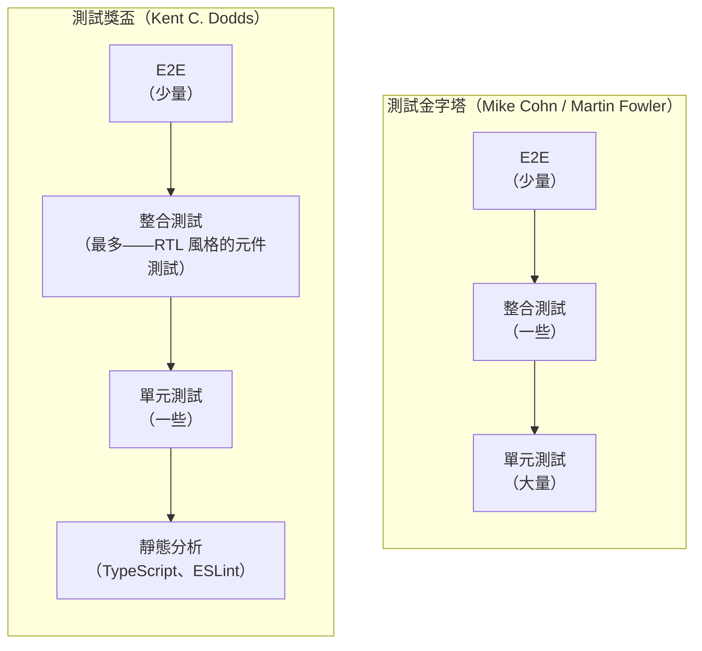

# 測試哲學：覆蓋率、信心與測試金字塔

## 背景

每個測試套件最終都會面臨同一個問題：測試到什麼程度才夠？直覺的答案是「越多越好」，這導致團隊追逐覆蓋率百分比、在 CI 中強制要求 80% 的行覆蓋率，最終產出龐大、緩慢、維護成本高昂的測試套件，卻仍然無法真正防止迴歸。本文探討測試決策背後的概念框架：如何誠實地解讀覆蓋率數字、測試套件應該是什麼形狀、如何偵測覆蓋率無法發現的缺口，以及何時應該停止寫測試。

測試金字塔（Testing Pyramid）與測試獎盃（Testing Trophy）是兩個主流的心智模型。金字塔（Mike Cohn 提出，Martin Fowler 推廣）規定：許多單元測試、較少的整合測試、極少的 E2E 測試。這個形狀由經濟效益驅動：單元測試在毫秒內執行且不需要任何基礎設施；E2E 測試需要啟動真實瀏覽器、在運行中的應用程式中導航，每個測試需要幾秒鐘。成本向上遞增，測試數量應相應遞減。獎盃（Kent C. Dodds，2019 年）針對前端情境修改了這個處方：最大的一層是整合測試——使用 React Testing Library 或類似工具撰寫的元件層級測試——因為它們在前端 UI 程式碼中提供最佳的信心效益比。金字塔和獎盃在底部（許多快速、廉價的單元測試）和頂部（少量昂貴的 E2E 測試）上達成共識，但中間層有分歧。

覆蓋率指標——行覆蓋率、分支覆蓋率和函式覆蓋率——報告的是測試執行期間哪些程式碼被執行了，而不是測試是否對結果做出了任何有意義的斷言。這個區別是關於覆蓋率的大多數混淆的根源。一個呼叫函式但不做任何斷言的測試，可以產生 100% 的行覆蓋率，同時提供零信心。覆蓋率告訴你什麼被執行了；突變測試告訴你什麼被真正檢查了。

## 原則

測試**應該**驗證使用者或模組消費者可觀察到的行為，而不是內部實作細節。測試**應該**是可維護的：一個在每次無害重構時都會失敗的測試會製造噪音而不增加信心，而一個充滿噪音的測試套件是會被忽略的套件。

一個需要 30 分鐘才能執行完畢的測試套件會被跳過。一個每隔一次就因為不穩定的網路呼叫而失敗的套件會被忽略。測試套件的速度和可靠性是一等的工程考量，不是事後才想到的事。

## 設計思維

### 金字塔與獎盃的比較

測試金字塔和測試獎盃並不衝突——它們是針對不同情境的校準。

金字塔針對所有軟體：它將單元測試規定為基礎，因為隔離性和速度具有普遍價值。對於後端服務或工具程式庫，金字塔中間層（驗證模組互動的整合測試）規模適中。對於建立在 React 或 Vue 上的前端應用程式，大多數有趣的行為不是存在於孤立的純函式中，而是存在於元件、狀態和 DOM 之間的互動中——這正是 RTL 風格的整合測試所測試的內容。獎盃反映了這一點：它將重心從許多對個別函式的小型單元測試，轉移到渲染整個元件樹並以使用者的方式驗證行為的整合測試。

這不僅僅是美學上的差異。一個針對 `<LoginForm>` 的整合測試，驗證元件以正確的載荷呼叫 API 並在憑證錯誤時顯示錯誤訊息，比二十個對該表單內部各個輔助函式的單元測試，能捕獲更廣泛的迴歸。那些輔助函式可能在孤立環境下都能正確運作，但元件仍然失敗，因為它們被錯誤地連接在一起。整合測試能捕獲這個問題。單元測試做不到。

獎盃還明確地將靜態分析（TypeScript、ESLint）納入其基礎層——這是原始金字塔省略的一個類別。靜態分析是最廉價的回饋：它在編輯時以毫秒執行、不需要測試執行器，並且能在應用程式甚至還未啟動之前捕獲廣泛的缺陷類別（錯誤的型別、未定義的變數、未使用的 import）。將靜態分析視為一個測試層，闡明了為什麼採用 TypeScript 能對生產環境缺陷率產生可量測的影響。

### 為什麼 100% 覆蓋率是個陷阱

覆蓋率衡量的是執行路徑，而不是正確性。考慮以下函式：

```ts
function clamp(value: number, min: number, max: number): number {
  if (value < min) return min
  if (value > max) return max
  return value
}
```

一個單一的測試——`expect(clamp(5, 0, 10)).toBe(5)`——對這個函式達到了 100% 的行覆蓋率。所有三行都被執行了。但這個測試對邊界條件什麼也沒說：`clamp(0, 0, 10)`、`clamp(10, 0, 10)`、`clamp(-1, 0, 10)`、`clamp(11, 0, 10)` 或 `clamp(NaN, 0, 10)`。任何邊界上的 bug 都不會被捕獲。

這是古德哈特定律（Goodhart's Law）在測試上的應用：當一個指標成為目標時，它就不再是一個好的指標。當 CI 把 80% 的行覆蓋率設為關卡時，工程師就會寫出執行程式碼但不斷言正確性的測試——這正是這個指標本應防止的事情。指標達到了；信心卻沒有獲得。

分支覆蓋率比行覆蓋率更嚴格（它要求每個 `if` 的兩個分支都被執行），函式覆蓋率追蹤哪些函式完全被呼叫了。但這三個指標都有相同的根本限制：它們衡量執行，而不是斷言的正確性。一個測試可以執行函式的每個分支，卻只斷言函式沒有拋出錯誤。該測試對於在大多數輸入上產生錯誤結果的函式，仍然會顯示 100% 的分支覆蓋率。

### 覆蓋率的正確用途

儘管有這個限制，覆蓋率對一件事還是有用的：識別完全沒有任何測試觸及的程式碼。一個行覆蓋率為 0% 的函式沒有任何測試。這是可以採取行動的信號。覆蓋率能找出死角；它無法驗證覆蓋非死角的那些測試的品質。

一個實際的政策：在 CI 中執行覆蓋率作為發現未覆蓋程式碼的健全性檢查，而不是品質關卡。70–80% 的行覆蓋率閾值將標記完全沒有測試的檔案，同時不會激勵無斷言的測試填充。將覆蓋率下降視為尋找缺失測試的信號，而不是將覆蓋率上升視為測試品質好的證明。

### 突變測試：找到覆蓋率看不到的缺口

突變測試在與覆蓋率不同的軸上運作。覆蓋率問的是「這一行被執行了嗎？」，突變測試問的是「有任何測試真正驗證了這一行的作用嗎？」

突變測試工具（JavaScript 和 TypeScript 的 Stryker.js）對生產程式碼做出小而系統性的修改——將 `>` 改為 `>=`，將 `+` 替換為 `-`，移除 `return` 語句——並在每次修改後執行測試套件。如果一個突變導致測試失敗，這個突變就被「消滅」了——至少有一個測試注意到了這個變化。如果儘管有突變，所有測試都通過了，這個突變就「存活」了——測試套件沒有驗證這個突變所改變的行為。

突變存活率是你的程式碼有多少行為未被驗證的直接衡量。一個行覆蓋率 100% 但突變存活率 30% 的函式，有許多存活的突變：它所做的大部分事情沒有任何斷言在檢查。一個行覆蓋率 60% 但突變存活率 5% 的函式，在其覆蓋的路徑內測試得很好。

突變測試很慢——它對每個突變執行一次完整的測試套件，一個有 50 個潛在突變點的檔案需要 50 次測試套件執行——但它是測試品質可用的最高保真度信號。

### 什麼該測試、什麼不該測試

並非所有事情都應該直接測試。測試錯誤的事情會產生一個維護成本高昂且提供虛假信心的測試套件。

**應該測試：** 使用者或模組消費者可觀察到的行為——元件在特定輸入下渲染什麼、表單提交觸發什麼 API 呼叫、fetch 失敗產生什麼錯誤狀態、純函式對給定輸入返回什麼。

**不應該測試：** 第三方函式庫。`lodash.debounce` 由 lodash 測試。React 的事件系統由 React 團隊測試。測試呼叫 setter 後 `useState` 更新狀態是在測試 React，而不是你的程式碼。要測試的邊界是你的程式碼對函式庫的使用，而不是函式庫的內部行為。

**不應該測試：** 沒有邏輯的瑣碎 getter 和 setter。一個返回 `this.name` 的函式不需要單元測試。如果它被使用它的元件的整合測試所覆蓋，那就足夠了。

**不應該測試：** 實作細節。測試元件呼叫特定內部函式、輔助函式以模組內部的特定參數被呼叫、或類別有特定私有方法——這些測試在實作改變時就會失敗，即使行為保持不變。它們增加了維護成本，卻沒有增加信心。

**不應該測試：** 靜態型別已經驗證的事情。如果 TypeScript 阻止了在需要數字的地方傳入字串，你不需要為該情況寫執行時期測試。型別系統在編輯時就捕獲了它。

### 測試的成本方程式

每個測試都有成本：最初撰寫它的時間、實作改變時維護它的時間，以及它消耗的 CI 時間乘以 CI 執行的次數。對於一個需要 100 毫秒、在一個每天開啟 10 個 PR 的團隊中，跨越 2 年專案的每個 PR 上執行的測試，該測試消耗大約 24 小時的 CI 時間。對於一個需要 30 秒的緩慢 E2E 測試，這個數字大約是 7,500 小時。

這個成本必須與測試提供的信心相權衡。一個定期偵測到真實迴歸的測試，其成本是值得的。一個只有在開發者重構內部實作時才失敗的測試，消耗了 CI 時間和維護精力，卻沒有提供任何價值。

這帶來的結論是：刪除一個測試可以是正確的決定。一個脆弱的測試——在無害的重構上失敗並且需要持續維護才能保持綠燈的測試——比沒有測試更糟糕。它訓練工程師忽略失敗（「可能只是那個不穩定的測試又來了」），侵蝕了對套件的信任，並消耗維護時間。刪除它，然後寫一個更好的測試，覆蓋相同的行為但不耦合到實作細節。

### 測試套件健康指標

三個信號決定測試套件是否正常運作：

**速度。** 一個 5 分鐘以內完成的完整套件，會在每個 PR 上執行。一個需要 30 分鐘的套件，只會在發布前執行。一個需要 2 小時的套件，會被跳過，然後套件會因為覆蓋率下降而沒有人修復。

**可靠性。** 一個 95% 的時間通過的套件，是一個工程師對失敗會置之不理的套件。不穩定的測試——在沒有程式碼變更的情況下間歇性失敗的測試——必須立即修復，而不是用 `test.skip` 跳過然後遺忘。一個被跳過的不穩定測試提供零價值，卻佔據了測試檔案中可以容納可靠測試的位置。

**信噪比。** 測試失敗後，工程師能多快識別根本原因？一個名為 `it('works')` 的測試失敗並輸出一個 200 行的 diff，需要調查。一個名為 `it('當 API 返回 401 時顯示錯誤橫幅')` 的測試失敗並輸出「Expected element with text '工作階段已過期' to be visible, but it was not」是自我說明的。命名和斷言的具體性，直接影響失敗的有用程度。

### 「寫測試，直到恐懼變成無聊」

Kent C. Dodds 關於何時停止寫測試的啟發式方法：寫測試，直到你不再害怕部署。如果你在合併一個改變結帳流程的 PR 而沒有執行結帳流程的測試時會感到緊張，就寫那個測試。一旦測試存在並通過，恐懼應該會消散。當再增加一個測試什麼也捕獲不到，而你感到有信心時，你對那個功能的測試就足夠了。

這是一個基於判斷的啟發式方法，不是指標。它無法被自動化或由 CI 關卡強制執行。它的價值在於，它把測試的原因錨定在——建立對部署的信心——並讓停止條件變得清晰可見：不是一個數字，而是一種對覆蓋範圍的適當感，這種感覺是通過真正執行那些有風險的路徑而獲得的。

這個啟發式方法也處理了另一個極端：不要寫測試直到所有恐懼都消除，因為有些恐懼是適當的。對觸碰一個沒有任何測試的 5,000 行檔案的變更感到恐懼是理性的；正確的回應是為你即將觸碰的路徑添加測試，而不是拒絕出貨直到你對這個檔案達到 100% 覆蓋率。

### 左移原則

在單元測試中發現的 bug，修復成本大約是 1 元——理解測試失敗並糾正邏輯的時間。在整合測試中發現的 bug，成本大約是 10 元——同上，加上設置測試環境和解讀更複雜的失敗的時間。在 E2E 測試中發現的 bug，成本大約是 100 元。在生產環境中由用戶發現的 bug，成本大約是 1,000 元——工程師分類、重現、修復、部署、驗證的時間，加上潛在的用戶影響和聲譽成本。

這些數字是近似的，但比例在業界是一致的。它們證明了對快速、早期回饋的投資是合理的：每個在單元或整合層而不是在生產環境中捕獲的 bug，都代表了一個數量級的成本節省。「左移」這個詞指的是將測試活動移到時間軸的左邊——在開發周期的更早期——在那裡缺陷的解決成本最低。

## 視覺化

### 測試金字塔 vs. 測試獎盃



### 信心 vs. 成本矩陣

```mermaid
quadrantChart
    title 測試類型：信心 vs. 成本
    x-axis 低成本 --> 高成本
    y-axis 低信心 --> 高信心
    quadrant-1 高價值，謹慎預算
    quadrant-2 理想區域
    quadrant-3 低價值，最小化
    quadrant-4 高價值，積極投入
    靜態分析: [0.05, 0.45]
    單元測試: [0.15, 0.5]
    整合測試 (RTL): [0.4, 0.82]
    E2E (Playwright): [0.8, 0.9]
    視覺回歸: [0.88, 0.7]
```

## 範例

### 1. 覆蓋率陷阱：100% 行覆蓋率卻遺漏了一個 bug

```ts
// math.ts
export function divide(a: number, b: number): number {
  return a / b
}
```

```ts
// math.test.ts — 達到 100% 行覆蓋率，但遺漏了除以零的情況
import { divide } from './math'

test('divides two numbers', () => {
  expect(divide(10, 2)).toBe(5)
})
// 行覆蓋率：100%。分支覆蓋率：100%。函式覆蓋率：100%。
// 但 divide(10, 0) 返回 Infinity——從未被測試。
// divide(0, 0) 返回 NaN——從未被測試。
```

突變測試捕獲了覆蓋率遺漏的東西。Stryker 會創建一個將 `a / b` 改為 `a * b`（或 `a - b`，或只是 `a`）的突變。當其中一個參數是 2、另一個是 5 時，`a * b` 恰好等於 5，測試 `expect(divide(10, 2)).toBe(5)` 仍然通過——突變存活了。Stryker 將此標記為缺口。

一個更好的測試套件：

```ts
test('divides two positive numbers', () => {
  expect(divide(10, 2)).toBe(5)
})

test('returns Infinity when dividing by zero', () => {
  expect(divide(10, 0)).toBe(Infinity)
})

test('returns NaN for 0 divided by 0', () => {
  expect(divide(0, 0)).toBeNaN()
})

test('handles negative divisor', () => {
  expect(divide(10, -2)).toBe(-5)
})
```

這個套件消滅了算術運算符的突變，因為任何將 `/` 替換為 `*`、`-` 或 `+` 的操作，都會讓至少一個測試失敗。

### 2. Stryker.js 設定與突變報告

為 Vitest 專案安裝並設定 Stryker：

```bash
pnpm add -D @stryker-mutator/core @stryker-mutator/vitest-runner
```

```js
// stryker.config.mjs
/** @type {import('@stryker-mutator/api/core').PartialStrykerOptions} */
export default {
  testRunner: 'vitest',
  // 只突變應用程式原始碼，不突變測試或設定
  mutate: ['src/**/*.ts', '!src/**/*.test.ts', '!src/**/*.spec.ts'],
  // Vitest 執行器選項
  vitest: {
    configFile: 'vitest.config.ts',
  },
  // 報告器：終端機中的進度 + 詳細的 HTML 報告
  reporters: ['progress', 'html'],
  // 如何解讀結果
  thresholds: {
    high: 80,    // >= 80% 的突變被消滅：良好
    low: 60,     // 60-79%：警告
    break: 50,   // < 50%：讓 CI 步驟失敗
  },
}
```

執行：`npx stryker run`

範例報告輸出（簡化）：

```
Mutation testing report
=======================
Ran 47 mutants in 12.3 seconds

Killed:   38 (81%)
Survived:  7 (15%)
Timeout:   2 ( 4%)

Score: 81%

Survived mutations:
  src/utils/clamp.ts:4:18  ArithmeticOperator: `<` => `<=`
  src/utils/clamp.ts:5:18  ArithmeticOperator: `>` => `>=`
  src/api/auth.ts:22:3     ConditionalExpression: `status === 401` => `true`
  src/api/auth.ts:22:3     ConditionalExpression: `status === 401` => `false`
  ...
```

每個存活的突變都指出一個特定的行為缺口。`clamp.ts` 的存活者告訴你邊界條件（`<=` vs `<`）沒有被測試。`auth.ts` 的存活者告訴你 401 處理路徑沒有被任何斷言驗證。

### 3. 過度指定的測試 vs. 良好指定的測試

過度指定的測試耦合了實作細節，在無害的重構上就會失敗：

```tsx
// 不好的做法：測試內部結構，而非使用者可見的行為
test('LoginForm 用 email 和 password 呼叫 handleSubmit', () => {
  const handleSubmit = vi.fn()
  const { getByTestId } = render(<LoginForm onSubmit={handleSubmit} />)

  // 耦合到作為實作細節的內部 test ID
  fireEvent.change(getByTestId('email-input'), {
    target: { value: 'user@example.com' },
  })
  fireEvent.change(getByTestId('password-input'), {
    target: { value: 'secret' },
  })
  fireEvent.click(getByTestId('submit-button'))

  // 斷言內部函式呼叫，而非使用者看到的結果
  expect(handleSubmit).toHaveBeenCalledWith({
    email: 'user@example.com',
    password: 'secret',
  })
})
// 如果開發者將 data-testid="email-input" 重命名為 data-testid="login-email"，
// 這個測試就會失敗——即使表單的行為完全沒有改變。
```

良好指定的測試透過無障礙角色查詢，並斷言可觀察的結果：

```tsx
// 好的做法：測試使用者的體驗，能在內部重構後存活
import { render, screen } from '@testing-library/react'
import userEvent from '@testing-library/user-event'
import { http, HttpResponse } from 'msw'
import { server } from '../mocks/server'
import { LoginForm } from './LoginForm'

test('提交憑證並在成功時重新導向', async () => {
  const user = userEvent.setup()

  // 觀察伺服器收到什麼——這是使用者可見的行為
  let capturedBody: unknown
  server.use(
    http.post('/api/login', async ({ request }) => {
      capturedBody = await request.json()
      return HttpResponse.json({ token: 'abc123' })
    })
  )

  render(<LoginForm />)

  // 透過標籤文字查詢——無論 test ID 或元素結構如何，都能運作
  await user.type(screen.getByLabelText('電子郵件'), 'user@example.com')
  await user.type(screen.getByLabelText('密碼'), 'secret')
  await user.click(screen.getByRole('button', { name: /登入/i }))

  // 斷言使用者在成功後看到的內容
  expect(await screen.findByText('歡迎回來')).toBeInTheDocument()
  // 斷言 API 合約——對後端消費者可觀察的
  expect(capturedBody).toEqual({ email: 'user@example.com', password: 'secret' })
})
```

這個測試能在重命名內部變數、重構元件的 JSX、更改 test ID 以及將表單拆分成子元件後仍然存活——因為它從未觸及任何這些實作細節。

### 4. 帶有閾值的 Vitest 覆蓋率設定

```ts
// vitest.config.ts
import { defineConfig } from 'vitest/config'

export default defineConfig({
  test: {
    coverage: {
      // 使用 V8（快速，內建於 Node）或 Istanbul（更詳細的分支資訊）
      provider: 'v8',

      // 要為哪些檔案測量覆蓋率
      include: ['src/**/*.{ts,tsx}'],
      exclude: [
        'src/**/*.test.{ts,tsx}',
        'src/**/*.stories.{ts,tsx}',
        'src/mocks/**',
        // 純型別檔案沒有可覆蓋的執行時期行為
        'src/**/*.d.ts',
      ],

      // 報告器：終端機中的文字摘要 + 用於 CI 覆蓋率上傳的 lcov
      reporter: ['text', 'lcov', 'html'],

      // 閾值：如果覆蓋率低於這些值，CI 就會失敗。
      // 這些是「我們是否完全忘記測試這個檔案」的健全性檢查，
      // 不是品質關卡。不要將它們設為 100%。
      thresholds: {
        // 所有檔案的全域閾值
        lines: 75,
        functions: 75,
        branches: 65,   // 分支覆蓋率較難達到，設低一點
        statements: 75,

        // 每個檔案的閾值：對關鍵業務邏輯更嚴格
        perFile: false, // 啟用以對每個檔案而非全域強制閾值
      },
    },
  },
})
```

分支閾值有意設得比行閾值低。分支覆蓋率要求執行每個條件的兩個分支——包括錯誤路徑、邊界條件和可選鏈的後備值。在 75% 的行覆蓋率旁邊達到 65% 的分支覆蓋率是現實可行的；要求兩者都達到 80%，通常會產生測試錯誤路徑但什麼斷言也不做的測試。

## 常見錯誤

**把覆蓋率當成品質關卡。** 在 CI 中強制要求 80% 的行覆蓋率，會激勵工程師寫出執行程式碼但不做任何有意義斷言的測試。覆蓋率數字上升了；信心卻沒有。使用覆蓋率來找到未覆蓋的檔案，而不是用來認證測試品質。

**撰寫反映實作的測試。** 一個呼叫 `form.validate()`，然後檢查 `form._errors.length`，然後斷言 `form._isValid === true` 的測試，是在測試表單的內部狀態機，而不是它的行為。當重構期間內部屬性名稱改變時，測試就失敗了。重寫這些測試，從外部測試表單的行為：它是否顯示錯誤訊息？它是否提交？它在處理期間是否禁用提交按鈕？

**測試第三方函式庫的行為。** 測試 `setTimeout` 在延遲後觸發、`fetch` 發送網路請求，或 React 的 `useState` 在呼叫 setter 後更新狀態，是在測試環境，而不是你的程式碼。這些測試在函式庫更新 API 時增加了維護負擔，卻沒有捕獲你的程式碼中的任何迴歸。

**讓不穩定的測試保持被跳過狀態。** 標記為 `.skip` 的測試不是通過的測試——它是被忽略的測試。每個被跳過的測試都代表一個 CI 不再驗證的行為。要麼修復不穩定性（確定性的 mock、穩定的選擇器、移除真實的計時器），要麼刪除測試並寫一個更好的。越來越多的跳過測試清單是測試套件腐化的跡象。

**因為突變測試太慢而跳過它。** 突變測試不需要在每次提交時執行。在排程的 CI 工作中每週執行一次，或只對 PR 中更改的檔案執行（使用 Stryker 的 `--since` 旗標），以可管理的成本提供高信號的回饋。完全跳過它，會讓一整類的測試品質缺口永久不可見。

**在不刪除被取代的測試的情況下添加新測試。** 當一個功能被重寫時，舊測試就成了已刪除行為的測試。把它們留在套件中，會產生虛假的通過測試（它們通過是因為舊的程式碼路徑仍然存在，即使它已經不再被使用），並使套件的執行時間膨脹。將刪除過時的測試視為完成功能重寫的一部分。

## 相關 FEE

- [FEE-1100 測試策略總覽](./1100.md) — 完整的類別地圖以及本文在測試進程中的位置
- [FEE-1101 使用 Vitest 進行單元測試](./1101.md) — 覆蓋率工具以及單元測試在金字塔中的位置
- [FEE-1102 使用 React Testing Library 進行元件測試](./1102.md) — RTL 作為獎盃風格整合測試的實際實現
- [FEE-1103 使用 Playwright 進行端對端測試](./1103.md) — E2E 在金字塔和獎盃頂部的位置
- [FEE-1104 模擬策略](./1104.md) — mock 邊界以及它們如何影響測試實際驗證的內容
- [FEE-1105 測試驅動開發](./1105.md) — TDD 以及先寫測試如何有機地改變覆蓋率
- [FEE-1106 視覺回歸測試](./1106.md) — 視覺回歸在成本軸上位於 E2E 之上的位置

## 參考資料

- [Kent C. Dodds — "The Testing Trophy and Testing Classifications"](https://kentcdodds.com/blog/the-testing-trophy-and-testing-classifications) — 原始獎盃文章，解釋在前端中優先考慮整合測試的理由
- [Kent C. Dodds — "Write tests. Not too many. Mostly integration."](https://kentcdodds.com/blog/write-tests) — 配套文章，解釋「寫測試，直到恐懼變成無聊」的啟發式方法，以及為什麼獎盃形狀適合前端工作
- [Martin Fowler — "Test Pyramid"](https://martinfowler.com/bliki/TestPyramid.html) — 金字塔模型的標準參考，以及其成本驅動形狀的理由
- [Stryker Mutator — Documentation](https://stryker-mutator.io/docs/) — 官方 Stryker.js 文件，涵蓋設定、突變運算符、報告器和 `--since` 增量模式
- [Goodhart's Law (Wikipedia)](https://en.wikipedia.org/wiki/Goodhart%27s_law) — 「當指標成為目標時，它就不再是好的指標」——覆蓋率強制要求適得其反的原則基礎
