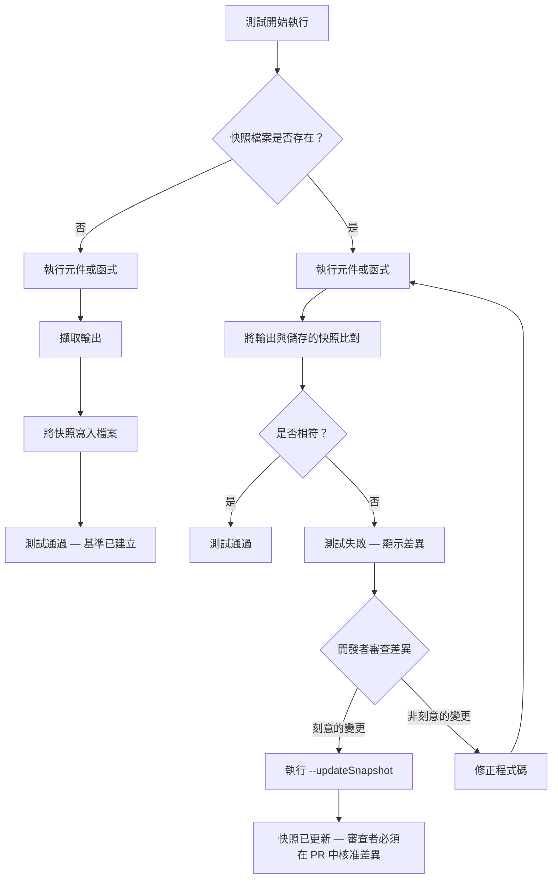

# 快照測試

快照測試會在某個時間點擷取元件或函式的輸出，並將其儲存為檔案。在後續的測試執行中，
輸出結果會與儲存的快照進行比對；若有差異，測試便會失敗。快照測試的承諾是能自動捕捉
非預期的輸出變更，而無需開發者為每個屬性撰寫明確的斷言。

然而現實更為複雜。快照測試最適用於小型、穩定的輸出——序列化的設定物件、短字串轉換、
標記量少的小型元件。對於大型輸出，快照測試反而成為負擔：複雜元件完整 DOM 樹的快照
往往長達數百行，有意義的差異被淹沒在噪音中，開發者也常常在未仔細閱讀的情況下自動更
新快照——這讓測試報告顯示「通過」，實際上卻什麼都沒有捕捉到。

快照測試無法取代行為測試。一個捕捉了 `<button className="btn-primary">Submit</button>`
的快照只能驗證那些確切的位元組是否被產生；它無法驗證點擊按鈕是否真的提交了表單。這個
區別至關重要——快照會在無關緊要的變更（CSS 類別重新命名、空白格式調整）上失敗，卻在
真正有意義的失敗（按鈕功能異常但標記未變）上通過。

要真正理解快照測試的適用場景，必須先理解它執行的是什麼樣的契約。快照執行的是逐位元組
的輸出契約。當確切的輸出本身就是規格說明時——當序列化形式的任何變更，在定義上就是一
個需要人工審查和批准的變更——這個契約才有意義。對於具有穩定輸出的純函式、設定生成器，
以及緊湊的渲染工具函式，這正是恰當的約束層級。而對於大型、持續演進的元件，快照是一種
不良的選擇，會產生噪音，並鼓勵開發者例行性地繞過測試本應引發的審查。

## 原則

工程師**應該（SHOULD）**將快照測試用於小型、語意穩定的輸出，在這些情境下，逐位元組
的輸出一致性才是有意義的訊號——序列化設定、簡單字串轉換、緊湊的純函式輸出，以及小型
元件的 HTML 表示。對於這些情況，快照測試是「這不應在未經人工審查差異的情況下改變」
這一意圖的簡潔表達。

工程師**禁止（MUST NOT）**將快照測試作為互動與行為測試的替代品。快照測試驗證的是輸
出結構，而非行為。一個渲染正確但點擊時觸發錯誤事件的元件、一個回傳正確字串但具有不正
確副作用的函式，以及一個回傳預期結構但值錯誤的 API，都能通過快照測試。快照測試是行
為測試的補充，而非替代。

## 設計思維

### 內嵌快照與外部快照

內嵌快照（Jest 的 `toMatchInlineSnapshot()`）將快照直接嵌入測試檔案中。外部快照
（`.snap` 檔案）則儲存在測試檔案旁的 `__snapshots__` 目錄中。對於小型輸出，內嵌快照
更為理想，因為它能讓預期輸出在測試檔案中直接可見，無需切換檔案。審查者閱讀測試時，可
以在同一視圖中看到被測程式碼及其預期輸出，大幅降低了驗證快照是否有意義的認知負擔。

外部快照適用於輸出過大而無法內嵌、否則會遮蔽測試邏輯的情況。大致的門檻是序列化輸出約
20 至 30 行——超過這個長度，內嵌快照會淹沒測試檔案，預期輸出變得與它本應取代的外部
檔案同樣難以解讀。Vitest 對兩種模式的支援完全相同，因此選擇純粹取決於可讀性，以及可
見性與檔案長度之間的實際權衡。

內嵌模式最重要的特性是它能將預期輸出放入程式碼審查的差異中。當快照發生變更時，審查者
可以在與測試斷言相同的檔案中並排看到舊輸出與新輸出。這是關鍵優勢：外部 `.snap` 檔案
中的快照差異很容易在程式碼審查中被略過；測試檔案中的內嵌差異因為與測試意圖並排，更難
被忽視。審查者必須主動跳過預期輸出才能繼續閱讀測試的其他部分——這意味著他們很可能會
注意到預期輸出已發生變更。

此外還有一個實際的工具考量。Jest 和 Vitest 都會在首次執行時自動填入內嵌快照的值，並
在傳入 `--updateSnapshot` 時自動更新。這意味著開發者無需手動撰寫快照值——他們只需寫
下不帶參數的 `toMatchInlineSnapshot()`，執行一次測試，工具便會填入預期值。這個工作流
程與外部快照完全相同，差別只是結果嵌入在測試檔案中，而非獨立的檔案裡。這消除了對小型
輸出偏好外部快照的任何實際理由。

採用內嵌模式的團隊普遍反映快照審查品質有所提升。過去在未仔細閱讀的情況下核准 `.snap`
檔案變更的審查者，發現在核准測試檔案的變更時要忽視已嵌入的預期輸出變更，在認知上更加
困難。檔案的版面使得跳過快照值變得不自然，因為它夾在函式呼叫與測試的結尾括號之間，在
視覺上要求注意。

### 快照漂移

在未經人工審查的情況下使用 `--updateSnapshot` 更新的快照，將不再具有測試功能。開發者
在 CI 日誌中看到「已更新 1 個快照」，測試「通過」——但快照現在反映的是新的（可能不正
確的）輸出。在 Pull Request 中對快照差異檔案進行程式碼審查，是可靠捕捉未經審查之快照
更新的唯一關卡。將 `.snap` 檔案變更視為無需審查之例行檔案變更的團隊，將隨時間累積漂
移的快照。

快照漂移的隱蔽性在於它在總體指標中是不可見的。測試數量保持不變，通過率維持在 100%，
覆蓋率數字也不受影響。唯一的訊號存在於程式碼審查歷史中——`.snap` 檔案定期變更，卻無
人質疑新內容是否正確。這正是讓快照測試飽受爭議的失敗模式：使用不當時，大量快照測試在
提供虛假的覆蓋感的同時，幾乎什麼都捕捉不到。

解決快照漂移的組織方法，是在程式碼審查中將 `.snap` 檔案的變更視為語意上有重要意義的
變更，而非例行的生成檔案更新。許多團隊透過 Pull Request 範本來強制執行這一點，明確點
出快照更新需要額外關注；或配置差異工具使 `.snap` 檔案的變更更為突出。有些團隊更進一
步，要求在 Pull Request 中修改 `.snap` 檔案時，必須附上說明該快照更新為何正確的評論。

快照漂移也透過一種更隱微的機制累積：一個在撰寫時正確的快照，隨著元件的演進，逐漸喪失
作為有用規格的功能。原始快照擷取了一個在首次撰寫測試時有意義的特定輸出。隨著時間推移，
元件的渲染邏輯發生了變化——或許是合理的變化——快照也相應被更新。但從未有人驗證新快照
代表的是元件的預期輸出，而非其偶發性輸出。快照現在是對元件實際行為的記錄，而非應有行
為的記錄。

大多數快照漂移的根本原因是組織層面的：團隊採用快照測試是因為它比撰寫有針對性的斷言需
要更少的前期思考，但隨後發現這種便利性伴隨著一個容易被推遲的持續維護義務。一個不定期
審查的快照套件，是一個隨時間提供遞減回報的測試套件。保持快照有意義所需的紀律，在許多
方面與撰寫良好斷言所需的紀律相當——差別在於快照的紀律是持續性的，而非前置性的。

### 何時刪除快照

如果更新快照不需要思考新輸出是否正確，那麼這個快照就沒有在發揮作用。在更新快照前，應
該問的問題是：「這個新輸出代表正確的行為嗎？」如果答案無需思考——如果更新如此例行，
開發者甚至在未閱讀差異的情況下就按下更新鍵——那麼這個測試就沒有在測試任何有意義的事
情。刪除它，改用更有針對性的斷言取代，或者在輸出沒有行為上的重要性時直接移除該測試。

實用的判斷準則是觀察快照相對於底層程式碼因有意義的原因發生變更的頻率。如果一個快照每
個迭代週期都因元件標記快速演進而被更新，但從未有人透過該快照發現過錯誤，那麼它只是在
增加維護成本而未帶來安全保障。一個從未捕捉到回歸問題、卻已更新十幾次的快照，是刪除的
候選對象。

替代策略取決於快照原本要保護什麼。如果意圖是確保某個特定屬性被渲染，用
`expect(element.getAttribute('aria-label')).toBe(...)` 取代快照。如果意圖是確保某個特
定結構被渲染，改用語意選擇器針對渲染後的 DOM 進行查詢。有針對性的斷言比快照更能承受
重構，因為它們與行為和語意掛鉤，而非與確切的序列化輸出綁定。

刪除快照不是測試策略的失敗，而是對該測試未能提供足以證明其維護成本的價值的一種承認。
一個由有意義的測試組成的小型套件，比一個充斥著被例行略過之測試的大型套件更有價值。測
試套件的目標是信心，而非數量——而一個開發者已習慣於不加思考地更新的快照，對信心和正
確性都毫無貢獻。

在評估是否刪除快照時，同樣值得考慮未來會遇到它的開發者群體。對於第一次遇到複雜元件樹
快照的新開發者而言，快照帶來了一種義務：他們必須理解預期輸出，才能判斷自己的變更是否
破壞了任何有意義的事情。如果快照過於龐大複雜，使得這種判斷在實際中難以進行，那麼快照
就是在對未來的開發者施加維護負擔，而未提供相應的收益。用一組更小、更有針對性的斷言取
代它，是對未來貢獻者的一種善意。

### 元件快照：快照什麼

應優先對特定元素或屬性進行快照，而非對整個元件樹進行快照。對特定 ARIA 角色輸出或特定
渲染屬性進行快照，比對整個元件進行快照更有針對性。
`expect(screen.getByRole('button').outerHTML).toMatchInlineSnapshot(...)` 比
`expect(container).toMatchSnapshot()` 更為精準。有針對性的快照產生的差異範圍更窄，更
易於審查，且不太可能包含來自不相關標記變更的噪音。

當必須對整個元件樹進行快照時——例如保護父元件與一組子元件之間複雜的渲染契約——應優先
進行淺層渲染，或渲染隔離相關結構的最小化測試固件。渲染包含資料抓取、Context Provider
和多層組合的大型元件樹，會使快照對其中任何一層的變更都變得脆弱，而不僅僅是被測試的那
一層。結果是一個因不相關原因頻繁變更、在不理解原因的情況下被更新的快照。

最耐用的元件快照適用於外部依賴最少的元件：純粹的展示型元件、接受所有資料作為 props 的
小型工具元件，以及具有穩定且明確定義渲染契約的元件。元件的輸出越依賴外部狀態、Context
或副作用，快照就越可能變得嘈雜並發生漂移。

一個有用的心智模型是問：「如果這個快照失敗，我能立即判斷這個變更是否正確嗎？」對於具
有明確渲染契約的小型純元件，答案通常是肯定的——差異範圍窄，預期輸出易於推理。對於具有
許多依賴的大型複雜元件，答案通常是否定的——差異範圍廣，包含來自多個來源的噪音，而要正
確評估新輸出是否正確，需要閱讀數百行序列化 HTML。如果答案是否定的，這個快照就沒有提
供良好測試應有的快速反饋。

在語意單元層級進行渲染輸出的快照——單個 ARIA 地標、特定互動元素、已知的資料驅動區域
——而非整個頁面或元件樹，能產生即使整體應用程式結構演進也仍然有意義的快照。對
`getByRole('navigation')` 輸出的快照，能在不觸及導覽元件的頁面版面重構中存活下來；而
對整個頁面的快照則不能。

### 序列化與確定性

快照必須產生確定性的輸出。包含時間戳記、隨機 ID 或動畫狀態的元件，每次執行都會產生不
同的快照，並持續失敗。在進行快照之前，應模擬或固定非確定性的值：使用固定日期、穩定的
ID，並確保任何影響渲染的元件狀態是可預測的。

快照中常見的非確定性來源包括：渲染邏輯中呼叫的 `Date.now()` 或 `new Date()`、用於生
成元素 ID 的 `Math.random()`、包含幀數或時間戳記的 CSS 動畫類別名稱，以及在輸出中嵌
入版本字串或建置雜湊的第三方函式庫。在快照可靠執行之前，每一個這樣的來源都必須在測試
邊界處被模擬。Vitest 和 Jest 都提供了模擬計時器和日期的工具（`vi.useFakeTimers()`、
`jest.useFakeTimers()`），可消除最常見的非確定性來源。

間歇性失敗的快照比沒有快照更糟糕。間歇性失敗的測試會侵蝕對測試套件的信任——開發者學
會重新執行失敗的測試，期待下次能通過，而真正失敗的測試最終被忽視或壓制。在提交任何快
照測試之前，至少執行三次以驗證它每次都產生相同的輸出。

確定性要求同樣適用於第三方元件函式庫。許多 UI 函式庫包含內部 ID、從計數器生成的 ARIA
屬性，或隨函式庫版本升級而變化的主題令牌。當對包含第三方渲染標記的輸出進行快照時，即
使元件的行為和外觀未發生變化，每次函式庫版本升級都會破壞快照。在這些情況下，應只對屬
於被測元件的輸出部分進行快照——元件直接控制的屬性和結構——而非包含第三方內部實作的完
整子樹。

### 快照測試與 CI

快照測試與 CI 的互動方式與其他單元測試有所不同。當快照測試在 CI 中因輸出發生變更而失
敗時，開發者無法在 CI 中更新快照——他們必須在本地端簽出分支、執行 `--updateSnapshot`，
並提交更新後的 `.snap` 檔案。這個工作流程是刻意設計的：它迫使開發者在提交更新之前，先
在本地端執行程式碼並審查差異。嘗試在 CI 中自動更新快照的團隊正在移除使快照測試有價值
的人工審查關卡。

針對快照測試的 Pull Request 工作流程應確保 `.snap` 檔案的變更在差異中始終可見，並在合
併前得到審查。有些團隊使用 CODEOWNERS 規則或類似機制，設定對 `.snap` 檔案變更需要明確
核准的要求。目標是在結構上讓更新快照而未有至少一位審查者看過並批准預期輸出變更變得困難。

在 CI 模式下執行 `vitest --ci` 或 `jest --ci`，可防止快照被自動寫入或更新——如果快照
不存在或不相符，測試便會失敗，且失敗必須在本地環境中解決。這是任何包含快照測試的 CI
流水線的正確預設值。這個設定確保了快照更新始終是開發者的刻意行為，而非 CI 流程的自動
產物，從而維護了快照作為人工審查觸發點的核心功能。

### 選擇快照序列化器

Jest 和 Vitest 都支援自訂序列化器，用以控制值如何轉換為快照字串。預設序列化器處理
JavaScript 原始值、物件、陣列、React 元素（透過 `jest-snapshot`）和 DOM 節點。對於特
殊的資料結構——自訂類別實例、複雜的設定物件，或特定領域的資料型別——自訂序列化器可以
產生更易讀且更穩定的快照。

良好的自訂序列化器會省略不屬於公開契約的實作細節。例如，針對自訂元件類別的序列化器可
能會省略內部的 `_private` 屬性，只包含代表元件公開渲染契約的屬性。這使快照更窄且更穩
定：當內部實作細節發生變更時，快照不會失敗，只有當公開契約發生變更時才會失敗。

這種做法的代價是它為測試基礎設施增加了複雜性。添加自訂序列化器的團隊必須隨著它所序列
化的資料結構的演進而維護它。對大多數專案而言，內建序列化器加上 `jest-serializer-html`
等套件（用於 HTML 輸出）就已足夠。自訂序列化器對於具有複雜領域物件的專案最有價值，這
些物件在快照測試中頻繁出現，且預設序列化產生不穩定或難以閱讀的輸出。

## 最佳實踐

**應該（SHOULD）**對約 30 行以內的輸出使用內嵌快照（`toMatchInlineSnapshot()`），以便
預期輸出在測試檔案中直接可見，無需切換至 `.snap` 檔案。內嵌快照讓測試意圖對程式碼審
查者而言更加清晰：他們可以在測試邏輯旁邊看到預期輸出。外部 `.snap` 檔案適用於較大的
輸出，但需要在審查中保持紀律，以確保更新是有意為之的。

**必須（MUST）**在程式碼審查中以與測試斷言變更同等的謹慎態度審查快照差異檔案。`.snap`
檔案中的快照更新是對測試預期輸出的變更。以審查 `expect(...)` 斷言變更同等的嚴格標準審
視 `__snapshots__/*.snap` 的變更。一個未被審查者閱讀和理解的快照更新，是一個已停止發
揮正確性檢查功能的測試。

**應該（SHOULD）**刪除那些快照被例行更新而未經審查之元件的快照測試。一個每次元件變更
都自動更新的快照不提供任何保護；它在不增加覆蓋率的情況下虛增了「測試」的數量。用捕捉
輸出中語意有意義部分的斷言取代它，或在輸出沒有行為上的重要性時直接移除。

**禁止（MUST NOT）**使用快照測試來驗證動態的、使用者驅動的行為，例如表單提交結果、事
件處理器的副作用，或由使用者互動驅動的狀態轉換。這些行為需要使用 Testing Library 的
`userEvent` 或 Cypress 等工具進行互動式測試。快照只能驗證在某個時間點渲染了什麼；它
無法驗證使用者對渲染內容進行操作後會發生什麼。

**應該（SHOULD）**將元件快照的範圍限定在最小的語意有意義單元，而非完整的渲染樹。使用
`screen.getByRole(...)` 查詢特定角色或元素，並對其 `outerHTML` 進行快照，產生的快照範
圍窄、焦點集中，且能在元件不相關部分的重構中存活。完整樹快照很脆弱，因為它們在元件層
次結構中任何地方的任何變更上都會失敗，無論該變更是否與被測試的契約相關。

**禁止（MUST NOT）**在未首先驗證非確定性值是否已被完全模擬或替換為穩定等效值的情況下
提交包含這些值的快照測試。時間戳記、隨機 ID 和第三方版本字串將導致快照測試在 CI 中間
歇性失敗，從而侵蝕對整個測試套件的信任。在提交任何快照之前，請使用 `vi.useFakeTimers()`
或 `jest.useFakeTimers()` 以及穩定的 ID 生成器。

## 視覺呈現



## 範例

```js
import { formatCurrency } from './formatCurrency';

test('格式化美元金額', () => {
  expect(formatCurrency(1234.5, 'USD', 'en-US')).toMatchInlineSnapshot(
    `"$1,234.50"`
  );
});

test('格式化日圓金額（無小數位）', () => {
  expect(formatCurrency(1234, 'JPY', 'ja-JP')).toMatchInlineSnapshot(
    `"¥1,234"`
  );
});
```

## 常見錯誤

- 在未審查差異的情況下執行 `--updateSnapshot`——快照淪為記錄程式碼實際行為的文件，
  而非應有行為的規格。
- 對整個大型元件樹進行快照，並將嘈雜的差異視為例行公事——快照不再發揮有意義的正確性
  檢查功能。
- 將快照覆蓋率視為行為正確性的有意義測試覆蓋率——快照測試驗證輸出結構，而非行為或
  互動。
- 在未模擬非確定性值（時間戳記、隨機 ID）的情況下將其包含在快照中——快照間歇性失敗，
  侵蝕對測試套件的信任。

## 相關 FEE

- [FEE-1100 — 測試策略總覽](./1100.md)
- [FEE-1101 — 使用 Vitest 與 Jest 進行單元測試](./1101.md)
- [FEE-1107 — 測試哲學：覆蓋率、信心與測試金字塔](./1107.md)

## 參考資料

- [Vitest: Snapshot Testing](https://vitest.dev/guide/snapshot)
- [Jest: Snapshot Testing](https://jestjs.io/docs/snapshot-testing)
- [Kent C. Dodds: Effective Snapshot Testing](https://kentcdodds.com/blog/effective-snapshot-testing)
