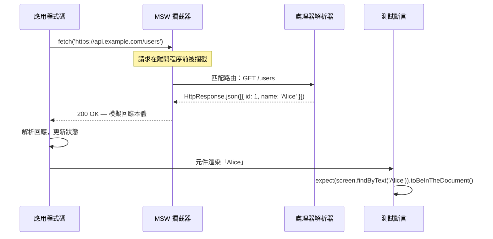

# 使用 MSW 進行 API 模擬與整合測試

整合測試驗證多個單元是否能正確協同運作——例如一個元件樹，它會從伺服器取得資料、渲染
資料，並回應使用者的互動。整合測試面臨的核心挑戰在於網路層：在測試中發出真實的 API 呼
叫速度緩慢、不穩定，且難以全面覆蓋各種情境。錯誤狀態、載入狀態，以及各種邊界條件都需
要伺服器回傳特定的回應，而這些回應難以從真實伺服器穩定重現。等待網路往返也會大幅增加測
試套件的反饋延遲，讓開發者不願頻繁執行測試。

Mock Service Worker（MSW）透過在服務工作者或 Node.js 層攔截 fetch 與 XHR 請求來解決
這個問題，攔截發生在請求離開程序之前。與 jest-mock 或模組模擬不同，MSW 在網路邊界層
運作：應用程式碼發出真實的 `fetch()` 呼叫；MSW 攔截這些請求並回傳設定好的回應。這意
味著應用程式的資料取得邏輯——請求建構、回應解析、錯誤處理——在測試中都會被真實執行，
而不是被模擬繞過。這個區別至關重要：在模組層級模擬 `fetch` 完全取代了傳輸層，意味著
建構請求 URL、設定標頭、解析回應本體的程式碼在測試期間從未被呼叫。

MSW 的處理器（handler）具有可重用性：同樣的處理器定義既可在 Jest/Vitest 中透過
`setupServer` 執行，也可在 Storybook 中透過 `mswDecorator` 執行，還可用於 Playwright
或 Cypress 端對端測試。這種一致性確保了單元測試中使用的模擬資料和錯誤情境，與元件文件
和端對端測試中的情境保持一致。採用 MSW 處理器、在測試環境、Storybook 故事和手動開發
流程中統一重用的團隊，會發現這些處理器逐漸成為描述 API 可觀察行為的共同語彙——一份輕
量、可執行的 API 契約規格，從客戶端的視角呈現。

這種重用性的架構意義在於：處理器值得被認真投入。一個為單次測試倉促撰寫的處理器，會被
複製到 Storybook 故事和端對端測試設定中，將其假設帶入每個使用情境。能準確反映真實 API
形狀的處理器——使用與實際伺服器相同的回應型別、狀態碼和錯誤信封——會在每個使用情境中
帶來複利回報。粗心撰寫的處理器則同樣廣泛地傳播對 API 的錯誤假設。

MSW 的另一個常被忽視的優點，是它讓測試對未來的 HTTP 客戶端更換保持韌性。若某個應用程
式決定從原生 `fetch` 遷移到 `axios`、從 `axios` 遷移到 `ky`，或在 React 應用程式中引
入 React Query 或 SWR，MSW 的處理器定義不需要改變——因為 MSW 在網路層攔截，與客戶端的
實作細節無關。相比之下，模組層級的 `fetch` 模擬在更換 HTTP 客戶端時必須完全重寫。這種
遷移韌性使 MSW 不僅是今日的正確選擇，也是在技術棧持續演進的前端生態系中值得長期投資
的測試基礎設施。

## 原則

工程師**應該（SHOULD）**在整合測試中使用 MSW 進行 API 模擬，而非直接模擬 `fetch`、
`axios` 或網路客戶端模組。模組層級的模擬完全繞過了應用程式的網路層，這意味著整合測試
無法涵蓋請求建構、標頭設定、序列化或回應解析。MSW 在網路邊界層攔截請求，讓完整的請求
/回應週期在受控回應下得以執行，從而以相同的測試基礎設施測試更多應用程式行為。

工程師**必須（MUST）**定義能準確反映真實 API 回應形狀、狀態碼和錯誤條件的 MSW 處理器。
一個永遠回傳硬編碼成功回應的處理器，無法測試當 API 回傳 401、422 或網路錯誤時應用程
式的行為。整合測試應以與成功情境相同的謹慎態度，為錯誤條件設計處理器——因為錯誤處理
本身就是應用程式行為的一部分。一個在成功時表現正確、但在收到 500 回應時靜默崩潰的應
用程式，只有透過包含錯誤狀態處理器的測試才能被發現。

## 設計思維

### setupServer 與 setupWorker

MSW 為相同的處理器定義提供兩種不同的執行環境。`setupServer` 在 Node.js 中執行，使用
適合 Jest 和 Vitest 測試環境的 HTTP 攔截機制；它在 Node.js 層攔截請求，不需要瀏覽器上
下文，是任何在 Node.js 程序中執行的測試的正確選擇。`setupWorker` 在瀏覽器中執行，使用
已註冊的 Service Worker 攔截請求，適用於 Storybook、在真實瀏覽器中執行的 Playwright 測
試，以及應用程式在瀏覽器分頁中執行的手動開發流程。

架構上的關鍵洞察在於：相同的處理器定義可在兩種執行環境中重用。一個以
`http.get('/api/users', () => HttpResponse.json([...]))` 撰寫的處理器，在 Jest 測試中使
用 `setupServer` 時和在 Storybook 中使用 `setupWorker` 時，行為完全相同。唯一的差異是
實例化哪個執行環境——處理器程式碼本身不需要變更。這正是 MSW 相較於模組層級模擬的根本
架構優勢：定義一次，在單元測試、整合測試、Storybook 故事和手動開發中無需修改地使用。

在 Node.js 測試環境中，`setupServer` 使用的 HTTP 攔截機制是透過攔截 Node.js 的底層網
路模組實現的，而非服務工作者。這意味著在 Jest 或 Vitest 中使用 MSW 時，不需要任何瀏覽
器上下文或特殊環境設定——只需在 `vitest.config.ts` 或 Jest 的 `globalSetup` 中啟動伺服
器，測試即可立即開始攔截請求。這種低設定成本是 MSW 在整合測試生態系統中快速普及的原
因之一：採用它所需的基礎設施投入遠低於其帶來的測試品質提升。

採用 MSW 的團隊常常發現，測試夾具與開發夾具之間的界線以有益的方式消融了。在後端尚未
就緒之前，開發者便能以 MSW 處理器啟動開發流程，返回預期的 API 回應——使用的正是他們
日後在整合測試中會用到的同一批處理器。這個工作流程降低了前後端開發時程的耦合，並確保
開發和測試情境中使用的模擬資料保持一致。

理解 `setupServer` 與 `setupWorker` 之間差異的另一個層面，在於它們如何處理跨來源請求。
`setupServer` 在 Node.js 程序層攔截，不涉及跨來源策略——任何 URL 都能被攔截，無論主機
名稱為何。`setupWorker` 在瀏覽器中運作，因此受 CORS 限制影響，儘管 Service Worker 的
攔截機制使得 MSW 能在大多數情況下繞過這些限制，因為它在請求觸及網路之前便介入。這個
差異在測試環境中通常不會造成困擾，但在 Playwright 等在真實瀏覽器中執行的端對端測試框
架中，了解此差異對正確設定處理器具有實際意義。

### 測試間的處理器隔離

共享的處理器狀態是 MSW 設定中測試順序相依失敗最常見的根源。若某個測試為特定情境覆寫了
處理器——例如 500 錯誤回應、特定使用者形狀、空清單——而未清理該覆寫，下一個測試便會繼
承這個覆寫，其行為會依測試執行順序而改變。MSW 提供 `server.resetHandlers()` 來還原
`setupServer` 中定義的基準處理器集合，而 `afterEach` 是呼叫此方法的正確生命週期鉤子。

推薦的模式是：在 `beforeAll` 或 `setupServer` 呼叫中定義涵蓋正常路徑的預設處理器，並
在各測試層級使用 `server.use()` 處理錯誤狀態、邊界條件和變體情況。預設處理器表達基準
契約——API 在一切正常時回傳格式正確的資料；每個測試的覆寫則表達與基準的偏差，這些偏差
對特定測試案例具有意義。以此方式組織處理器，可以清楚看出每個測試實際在測試什麼——任何
出現在測試中的 `server.use()` 呼叫都是一個訊號，表明該測試正在驗證非基準行為。

若 `afterEach` 中未呼叫 `resetHandlers()`，測試套件會以特定方式變得脆弱：單獨執行或按
原始順序執行時通過，但以不同順序執行或在兩個現有測試之間加入新測試時失敗。這類失敗難
以診斷，因為失敗出現在未安裝問題處理器的測試中，而非安裝它的測試中。重置的規範能完全
消除這類失敗。

也可以在測試內部呼叫 `server.resetHandlers()`——例如，為特定請求安裝處理器，然後在發
出第二個請求前重置回基準。這個模式適用於測試多步驟互動，其中不同請求應接收不同回應。
關鍵的不變量是：`afterEach` 中的 `resetHandlers()` 是無條件的——無論測試通過或失敗都會
執行，確保失敗的測試不會遺留狀態而汙染後續測試。

處理器隔離的紀律也影響測試套件的可讀性。當每個測試透過 `server.use()` 覆寫明確宣告它
所依賴的非基準行為時，閱讀測試的開發者能立即看出哪些測試驗證的是一般路徑、哪些驗證的
是錯誤路徑或邊界條件，無需追蹤跨測試的共享狀態。這種清晰度在測試套件隨時間成長時尤為
珍貴——新加入的開發者能在不了解所有測試之間互動的情況下，理解任何單一測試的意圖。從架
構的角度來看，強制每個測試對其非基準假設保持顯式，是一種讓測試保持可讀性和可維護性的
低成本規範，其收益隨套件規模的增長而持續累積。

### MSW 與 Storybook 整合

MSW 的 Storybook 整合套件（`msw-storybook-addon`）允許透過 story 參數，為每個 story 設
定獨立的 API 模擬。渲染使用者個人資料元件的 story，可以定義一個返回特定使用者物件的
MSW 處理器，讓 story 完全自給自足，無需啟動 API 伺服器即可獨立預覽。處理器語法與 Jest
/Vitest 整合測試中完全相同：出現在測試檔案中的 `http.get` 和 `HttpResponse.json` 呼叫，
同樣出現在 story 參數中。

測試檔案與 story 檔案之間語法的一致性帶來了實際好處：可以將處理器提取到共享夾具檔案中，
由測試檔案和 story 檔案共同匯入，而非在各個測試檔案中重複定義。單一夾具檔案定義模擬使
用者、模擬錯誤回應和模擬邊界條件；測試匯入所需的處理器；story 匯入同樣的處理器。當
API 契約發生變更時，更新共享夾具中的處理器定義，即可將更新傳播至所有匯入它的測試和
story，無需逐一修改每個消費者。

包含 MSW 處理器的 story 同時也成為應用程式錯誤處理的互動式文件。名為「錯誤狀態：500
回應」的 story 展示了伺服器故障時元件所顯示的內容——這種文件深度難以透過真實 API 伺服
器實現，卻能透過 MSW 處理器輕鬆達成。設計師、產品經理和 QA 工程師無需手動觸發伺服器
錯誤或操控網路條件，即可在 Storybook 中查看錯誤狀態。

Storybook 整合的另一個實際好處，在於它讓視覺回歸測試的設定更加一致。當 Chromatic 或類
似工具對 Storybook story 執行視覺快照時，MSW 處理器確保每次執行時 story 接收到完全相
同的資料。沒有 MSW 的情況下，story 如果依賴真實 API，在不同的執行之間可能因資料變更而
產生視覺差異，導致誤報的視覺回歸。有了 MSW 處理器，story 的資料是確定性的，視覺快照
工具能夠可靠地區分真正的視覺變更與資料驅動的差異。

### GraphQL 模擬

MSW 透過 `graphql.query('QueryName', resolver)` 和 `graphql.mutation('MutationName',
resolver)` 支援 GraphQL 請求匹配。GraphQL 處理器的運作方式與 REST 處理器完全相同，並
可在同一個 `setupServer` 呼叫中混用。MSW v2 中的 `HttpResponse` 與 `graphql` 工具為
REST 和 GraphQL 提供一致的 API，因此在同一應用程式中同時使用兩者的團隊，能以相同模式
定義所有處理器。

GraphQL 處理器的匹配依據是請求中的操作名稱，而非 URL。這意味著 `GetUsers` 查詢的處理
器，無論端點 URL 為何，都能匹配任何帶有該操作名稱的 GraphQL 請求。這對大多數 GraphQL
客戶端來說是正確的行為，因為它們將所有請求發送到單一端點，並透過操作名稱加以區分。解
析器函式接收請求的 variables，允許根據客戶端的請求內容返回不同的回應——`GetUser` 的處
理器可以根據請求中的 `id` variable 返回不同的使用者物件。

值得注意的是，GraphQL 的錯誤處理慣例與 HTTP 錯誤慣例不同。GraphQL 錯誤通常以 200 回應
回傳，在本體的 `errors` 陣列中包含錯誤資訊，而非以 4xx 或 5xx 狀態碼表示。MSW 的
`graphql` 處理器支援這種模式——解析器可以回傳同時包含 `data` 和 `errors` 欄位的回應，或
僅包含 `errors` 欄位，與 GraphQL 規格的錯誤格式一致。GraphQL 元件的整合測試應包含回傳
`errors` 陣列格式的處理器，以驗證應用程式能否正確區分 GraphQL 錯誤和 HTTP 傳輸錯誤。

對於同時使用 REST 和 GraphQL 的應用程式，MSW 的統一 API 消除了維護兩套模擬基礎設施的
需求。REST 端點的 `http.get` 處理器和 GraphQL 查詢的 `graphql.query` 處理器可以共存於
同一個 `setupServer` 呼叫中，並以相同的測試夾具模式管理——相同的 `server.use()` 覆寫機
制、相同的 `afterEach` 重置規範、相同的夾具匯入方式。這種一致性降低了在混合 API 應用
程式中維護測試基礎設施的認知負擔，讓工程師能夠專注於測試行為本身，而非管理不同的模擬
工具和模式。

### 請求驗證

MSW 處理器接收請求物件，讓測試得以在處理器邏輯本身中斷言應用程式發送給伺服器的內容。
POST 端點的處理器可以檢查請求本體，若本體未包含預期欄位則回傳 422 驗證錯誤——這同時驗
證了應用程式發送了正確的欄位，以及它能正確處理 422 回應。這種雙向測試比僅驗證回應被正
確消費更為完整。

請求驗證也可以採取從處理器中提取請求資料、以便在測試中進行後續斷言的形式。一個將請求
本體儲存至變數的處理器，使測試得以進行類似這樣的驗證：「確認使用者提交表單時，正確的
Payload 被發送至 API」。這種模式比在渲染輸出中尋找間接證據以確認正確請求被發出更為明確，
並能捕捉即使元件事後渲染正確、但 API 呼叫攜帶錯誤資料的問題。

請求驗證模式同樣適用於標頭和查詢參數。處理器可以檢查 `Authorization` 標頭是否存在且格
式正確，若否則回傳 401。分頁端點的處理器可以檢查 `page` 和 `limit` 查詢參數，並回傳相
應的模擬資料片段。這些能力使 MSW 處理器適用於契約測試情境，在同一個測試中同時驗證請
求格式和回應處理邏輯。

請求驗證在持續整合環境中帶來的長期效益值得特別強調。隨著應用程式演進，API 契約可能在
未更新對應測試的情況下悄然改變——例如，一個端點開始要求額外的標頭，或一個 POST 請求的
本體格式發生變更。若整合測試僅驗證渲染輸出，這類 API 契約的變化將被忽視，直到在正式
環境中出現問題。加入請求驗證的處理器，能在測試層級捕捉這些偏差，確保 API 呼叫的請求
格式與回應處理都保持在預期的範圍內，使整合測試成為真正雙向的契約驗證工具。

## 最佳實踐

**應該（SHOULD）**使用 MSW 的 `http.get`/`http.post` 處理器（v2 API），並搭配從實際 API
契約衍生的真實回應形狀。具有真實回應形狀的處理器能捕捉型別不匹配、缺少欄位，以及對 API
介面的錯誤假設。對處理器回應使用與應用程式型別定義相同的 TypeScript 型別，能確保處理
器與 API 契約保持同步，並在開發期間將差異呈現為型別錯誤，而非在正式環境中呈現為執行時
期失敗。

**必須（MUST）**在使用每個測試的處理器覆寫時，於 `afterEach` 中重置處理器，以防止測試
汙染。`afterEach` 中的 `server.resetHandlers()` 確保為某個測試新增的處理器覆寫不會流入
後續測試。若缺少重置，測試順序將決定行為——這是難以診斷的不穩定測試的特徵，因為失敗出
現在未安裝問題處理器的測試中，而非安裝它的測試中。

**禁止（MUST NOT）**在模組層級模擬 `fetch`、`axios` 或 HTTP 客戶端模組以取代 MSW。模
組層級的網路模擬繞過了應用程式實際的請求建構、標頭管理、序列化和回應解析程式碼。使用
模組層級模擬的整合測試，並未測試元件與網路層之間的整合——它們只測試渲染行為，而網路層
被靜默略過。這個缺口意味著請求建構中的問題對整合測試套件完全不可見。

**應該（SHOULD）**為元件所發出的每個 API 呼叫，至少撰寫一個涵蓋錯誤狀態的整合測試。錯
誤狀態是前端整合測試中最常被忽略的路徑。當 API 回傳 500 時顯示無限旋轉圖示，或在 API
回傳非預期形狀時崩潰的元件，能被包含錯誤狀態處理器的整合測試所發現。使用
`HttpResponse.error()` 或特定錯誤狀態碼，在測試中透過 `server.use()` 新增覆寫，只需少
量工作，卻能覆蓋高影響力的失敗模式。

**應該（SHOULD）**將共享的處理器定義提取至夾具檔案，供測試檔案和 Storybook story 共同
匯入，而非在各個測試檔案中重複定義。共享的處理器夾具讓 API 契約發生變更時更新模擬資料
更為容易，並確保測試中使用的資料與 story 中顯示的資料保持一致。夾具檔案也是共置工廠函
式的理想位置，這些函式能產生具有特定變體的處理器回應，減少需要略微不同回應形狀的測試
之間的重複。

**禁止（MUST NOT）**在已知元件會處理錯誤條件的情況下，定義永遠回傳成功回應的 MSW 處
理器。永遠不回傳錯誤的處理器，無法用於驗證錯誤處理行為。元件整合測試的處理器定義應反
映真實 API 可能回傳的完整回應範圍——包括 400、401、403、404、422、500 等變體及網路層
失敗——因為元件在每種情況下的行為都是其規格的一部分。

## 視覺呈現



## 範例

```js
import { http, HttpResponse } from 'msw';
import { setupServer } from 'msw/node';
import { render, screen } from '@testing-library/react';
import { UserList } from './UserList';

const server = setupServer(
  http.get('/api/users', () => HttpResponse.json([{ id: 1, name: 'Alice' }]))
);

beforeAll(() => server.listen());
afterEach(() => server.resetHandlers());
afterAll(() => server.close());

test('從 API 渲染使用者列表', async () => {
  render(<UserList />);
  expect(await screen.findByText('Alice')).toBeInTheDocument();
});

test('API 失敗時顯示錯誤訊息', async () => {
  server.use(http.get('/api/users', () => HttpResponse.error()));
  render(<UserList />);
  expect(await screen.findByRole('alert')).toHaveTextContent('Failed to load users');
});
```

## 常見錯誤

- 在模組層級模擬 `fetch` 或 `axios` 而非使用 MSW——整合測試不再驗證應用程式的請求建
  構、標頭設定或回應解析邏輯，而這些是常見問題的來源。
- 在 `afterEach` 中遺漏 `server.resetHandlers()`——每個測試的處理器覆寫會流入後續測試，
  產生出現在錯誤測試中且難以追蹤的失敗。
- 僅定義正常路徑的處理器，從不新增錯誤狀態覆寫——錯誤處理是前端整合測試中最常被忽略
  的路徑，從不觸發錯誤的測試套件對其中的問題完全不可見。
- 在測試之間使用 `server.close()` 而非 `server.resetHandlers()`——在測試之間關閉並重
  新開啟伺服器是不必要的開銷；`resetHandlers()` 才是正確的每個測試清理方式。
- 在多個測試檔案和 Storybook story 中複製相同的處理器定義，而非提取共享夾具——重複的處
  理器在 API 契約發生變更時會悄然分歧，導致測試和 story 使用不一致的模擬資料。

## 相關 FEE

- [FEE-1100 — 測試策略總覽](./1100.md)
- [FEE-1102 — 使用 Testing Library 進行元件測試](./1102.md)
- [FEE-1104 — 模擬、替身與測試替代物](./1104.md)
- [FEE-403 — Fetch、串流與網路 API](../Web APIs & Browser/403.md)

## 參考資料

- [MSW 官方文件](https://mswjs.io/docs)
- [MSW：快速入門](https://mswjs.io/docs/getting-started)
- [msw-storybook-addon](https://storybook.js.org/addons/msw-storybook-addon)

