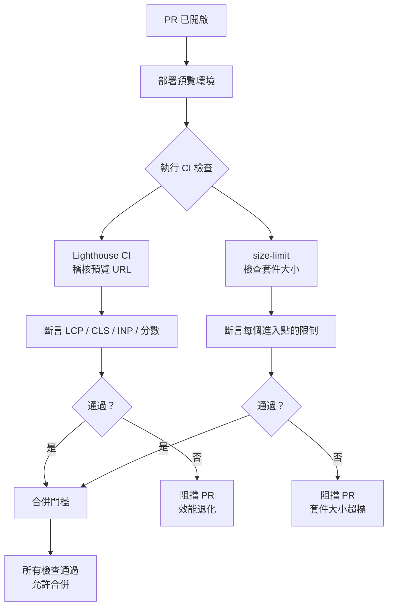

# CI 中的效能測試

在 CI 中進行效能測試，可以在問題到達生產環境之前攔截效能退化。如果設定了效能預算作為必要的 CI
檢查項目，當一個功能使 LCP 從 1.2 秒增加到 2.8 秒，或某次依賴套件更新使 JS 套件體積增加 50kB
時，CI 就會在合併前發現這些問題。若沒有 CI 效能門檻，這些退化只有在部署到生產環境之後才會被發現
——此時已造成使用者影響，為時已晚。

Lighthouse CI 是在 CI 流水線中自動化量測核心 Web 指標的主要工具。它在無介面的 Chrome 環境中，
針對已部署的預覽 URL（或本地伺服器）執行 Lighthouse，量測 LCP、INP、CLS、FCP 及 TTFB 等指標，
並在任何指標超過設定閾值時使 CI 檢查失敗。`bundlesize` 和 `size-limit` 則獨立於核心 Web 指標，
專門量測 JavaScript 和 CSS 套件大小。

效能 CI 的挑戰在於環境的不一致性：實驗室效能（在 GitHub Actions runner 中執行的 Lighthouse CI）
與真實使用者的現場效能（在實際裝置上的真實使用者）並不相符。效能 CI 能捕捉到明顯的退化，但無法
精確預測現場效能。效能 CI 的正確用途是作為退化防護閘門——如果昨天分數是 90，今天降為 55，就應
該調查原因——而非精確衡量使用者體驗的工具。

## 原則

工程師**應該（SHOULD）**在會部署預覽環境的 Pull Request 上，將 Lighthouse CI 設定為必要的檢查
項目。該檢查應針對 LCP、CLS 和 INP，斷言最低 Lighthouse 分數或最大指標閾值。設定效能分數的下限
——而非精確值——可以在容忍 CI 環境量測誤差的同時，有效捕捉到有意義的退化。

工程師**應該（SHOULD）**在 Pull Request 上將 `size-limit` 或 `bundlesize` 設定為必要的檢查項
目，以便在合併前發現套件大小退化。一個在主套件中新增 100kB 的 PR，應該需要經過審慎決策，而不是
悄悄地通過審查。大小預算將這種要求以 PR 必須滿足的約束條件來表達。

## 設計思維

### Lighthouse CI 設定

Lighthouse CI 透過位於儲存庫根目錄的 `lighthouserc.js` 設定檔進行配置。該設定檔指定要稽核哪些
URL、要評估哪些斷言，以及要將收集到的結果上傳到何處。一個最小化的設定會以已部署的預覽 URL 為目
標——無論是 Vercel 預覽、Netlify 部署預覽，還是由 CI 任務本身啟動的暫存環境——並斷言最低效能分
數以及 LCP 和 CLS 的最大指標閾值。

在 CI 步驟中執行 `lhci autorun`，可以透過單一指令處理完整的生命週期：它會為每個設定的 URL 收集
Lighthouse 報告、評估設定的斷言，並將結果上傳到設定的儲存目標。autorun 指令消除了分別協調收集、
斷言和上傳步驟的需要，從而降低了 CI 設定的複雜度。當斷言失敗時，`lhci autorun` 會以非零的狀態
碼退出，導致 CI 任務失敗並阻止 PR 合併。

Lighthouse CI 預設會對每個 URL 執行多次 Lighthouse 審核（通常是三次），並使用中位數結果作為斷言
的基礎。這種多次執行的設計有助於降低單次量測偶發差異對結果的影響。多次執行的次數可以透過 `collect`
設定中的 `numberOfRuns` 選項調整——增加次數可以進一步穩定結果，但會延長 CI 執行時間。大多數團隊
發現三次執行是穩定性與 CI 時間成本之間的合理折衷點。

結果可以儲存在 Lighthouse CI 伺服器（一個持久化報告並提供儀表板的開源 Node.js 伺服器）或 Google
Cloud Storage（適合更簡單的基礎設施）中。對於每個 PR 的門檻設定，不一定需要儲存結果（光是斷言
就已足夠），但趨勢監控則需要已儲存的結果。若沒有持久化的儲存，每次 CI 執行都是獨立評估的，跨多
個 PR 的漸進式退化就會無法被察覺。重視效能趨勢以及每個 PR 退化情況的團隊，**應該（SHOULD）**從
一開始就設定結果儲存，因為事後補救需要重新建立趨勢歷史的基準線。

Lighthouse 針對已部署的預覽 URL 執行，與在 CI runner 上針對本地服務的構建版本執行，在結果品質上
有顯著差異。GitHub Actions runner 上的本地伺服器無法模擬 CDN 傳遞、HTTP/2 推播、快取標頭或 Brotli
壓縮。Vercel 或 Netlify 上的預覽部署確實能模擬這些特性，因為它們使用與生產部署相同的基礎設施來
提供服務。在預覽部署可用的情況下，它們是 Lighthouse CI 稽核的首選目標。

觸發 `lhci autorun` 的 CI 任務，應在開始 Lighthouse 收集之前等待預覽部署進入健康狀態。針對仍在
暖機中或尚未完全傳播到 CDN 邊緣節點的部署執行稽核，會產生不可靠的結果。大多數 CI 設定透過在
Lighthouse CI 步驟執行之前加入部署等待步驟來實現這一點——持續輪詢預覽 URL，直到它返回成功的
HTTP 回應。由未就緒部署導致的失敗稽核，比正確排序且僅在預覽完全就緒後才執行的稽核，更難以與真
實退化區分開來。

### 效能預算

效能預算分為三種不同類型，各自適用於不同的關注點。資源預算限制傳輸到瀏覽器的資源總位元組大小
——最大 JavaScript 位元組數、最大圖片位元組數、最大頁面總重量。時間預算限制量測到的頁面時間指標
——最大 LCP、最大 TTFB、最大 FCP。指標預算限制 Lighthouse 類別分數——最低效能分數、最低無障礙功
能分數。

時間預算與使用者最直接相關，因為它們直接衡量使用者的頁面載入體驗。然而，時間預算在 CI 環境中也
是最容易有差異的：CI runner 上的 CPU 節流行為不一致，同一個頁面在名義上相同的基礎設施上，不同
執行之間可能產生相差數百毫秒的 LCP 量測值。這種差異意味著時間預算閾值必須在預期值之上留有餘地，
以避免持續出現偽失敗。

了解 Lighthouse CI 量測差異的來源，有助於更明智地設定閾值。CPU 節流是 Lighthouse 模擬低端行動
裝置的方式，在 GitHub Actions runner 上實際的節流倍數取決於 runner 在特定執行時的可用 CPU 資源。
記憶體壓力、其他並行 CI 任務，以及 runner 的虛擬化層，都會影響量測值。在連續多次執行上量測基準
LCP，能讓團隊了解 CI 環境中的自然差異範圍，並據此設定容忍度適當的閾值。

除了時間預算和資源預算之外，Lighthouse CI 的 `assert` 設定還支援分別為每個斷言設定 `warn` 或
`error` 嚴重程度。設定為 `error` 的斷言會在失敗時使 CI 檢查失敗並阻止合併；設定為 `warn` 的斷
言會記錄警告但不阻止合併。這種分層設計讓團隊能夠先以 `warn` 模式引入新的效能指標，觀察其在多個
PR 中的行為，再決定是否升級為 `error` 來強制執行。對於量測差異較大的指標，先以 `warn` 模式觀察
基準差異範圍，是避免在設定過嚴的硬性閾值上耗費資源的一個實用的漸進式策略。

資源預算更為穩定，因為它們量測的是磁碟上的位元組，而非耗費的時間。JavaScript 套件在每次 CI 執行
中的大小都是確定的。資源預算也更具可操作性：當資源預算失敗時，修正方向很明確——移除或縮減資源。
當時間預算失敗時，必須先診斷原因，可能涉及效能分析、渲染分析和網路瀑布圖檢查。對於剛開始建立效
能 CI 的團隊而言，資源預算提供了一個穩定、可操作的起點；隨著團隊效能工程實踐的成熟，再加入時間
預算以增加價值。

資源預算的一個實際優勢是，它們可以在不需要瀏覽器的情況下進行評估。bundle 大小檢查可以在構建步
驟之後立即執行，而不需要啟動 Lighthouse 所需的無介面 Chrome 實例。這使得資源預算檢查可以更早地
出現在 CI 流水線中——通常在時間預算檢查之前數分鐘——為工程師提供更快速的初始回饋。在 CI 時間是
工程師生產力瓶頸的環境中，這個提前反饋的特性是有意義的。

Lighthouse 分數預算——最低分數閾值——介於兩者之間：它們有一定的差異性（因為分數取決於時間量測），
但比原始時間預算更穩定，因為 Lighthouse 的評分公式會在一個範圍內進行正規化。80 的分數閾值可以
容忍一些量測差異，同時仍能捕捉到大型退化。

不同的預算類型可以在單一 Lighthouse CI 設定中組合使用：最低效能分數 80 分加上明確的最大 LCP 閾
值 2500ms，同時覆蓋了整體分數和一個對使用者影響最高的具體指標。組合使用預算類型，可以降低某一
指標的大幅退化被其他指標的改善所掩蓋的風險——Lighthouse 評分公式是跨多個指標的聚合計算，在某些
情況下，嚴重的 LCP 退化可能被其他指標的改善所抵銷，使總分仍高於最低閾值。明確的指標閾值確保每
個關鍵指標都有獨立的防護門檻。

### size-limit

`size-limit` 量測 JavaScript 和 CSS 構建產出物的壓縮大小，並將其與設定的限制進行比較。它在
`package.json` 的 `size-limit` 鍵下進行配置，為每個進入點指定路徑 glob 和最大大小（以 KB 為單
位）。當 `size-limit` 執行時，它計算每個匹配產出物的 gzip 或 Brotli 壓縮大小，並報告當前大小、
與基準線相比的變化（在使用 `--why` 旗標或透過 GitHub Actions 整合執行時），以及是否超過設定的
限制。

`size-limit/action` GitHub Action 會在 PR 差異上發佈一則評論，包含每個進入點的大小報告。這使得
大小變化在 PR 審查流程中一目了然，審查者無需查看 CI 日誌即可看到。一個在主套件中新增 40kB 的
PR，會在 PR 評論中顯示這一變化，使退化明確可見，並在合併前引發討論。

為每個進入點設定限制——主套件、供應商套件、路由套件、CSS——為使用者在每個頁面上最關注的資源大小
提供了有針對性的門檻。單一的總套件大小限制允許任何單一路由增長，只要總大小保持在預算以下即可；
每進入點限制則防止任何單一進入點無節制地增長。主套件和最大的路由套件通常是大小預算中最高效益的
目標，因為它們位於最常見使用者旅程的關鍵路徑上。

在建立 size-limit 設定時，一個有效的做法是從對使用者影響最高的進入點開始設定最嚴格的限制。主套
件——包含應用程式框架、路由邏輯和共用工具的初始載入 JavaScript——對首次頁面互動的影響最大。從對
主套件設定嚴格限制開始，能強制執行正確的程式碼分割決策，並防止本應只在特定路由中才載入的依賴項
被直接加入到主套件中。每當 size-limit 檢查在 PR 上失敗，工程師面對的是一個明確的決策點：要麼
縮減引入的內容，要麼就放寬限制並在 PR 中明確理由。

gzip 和 Brotli 對相同的輸入產生不同的壓縮大小；`size-limit` 兩者都支援，預設為 gzip。對於大多
數 JavaScript 而言，Brotli 產生的輸出比 gzip 更小，因此對於相同的檔案，Brotli 限制的數值會低於
gzip 限制。壓縮演算法的選擇應與生產 CDN 傳遞給瀏覽器的方式相符，以便 size-limit 檢查能反映真
實使用者下載的大小。

`size-limit` 的 `--why` 旗標會與 `webpack-bundle-analyzer` 或 `esbuild-bundle-analyzer` 整合，
以識別哪些模組導致了大小增加。當 size-limit 檢查失敗時，在本地執行 `size-limit --why` 會給出套
件組成的詳細分析，讓工程師能直接判斷增加是來自新的依賴項、匯入模組較大，還是缺少程式碼分割設定。
這種診斷能力使 size-limit 失敗具有可操作性，而原始的檔案大小比較則無法做到這一點。

### 基準線管理

設定初始效能預算需要在配置任何限制之前，先量測應用程式的當前狀態。設定在應用程式目前尚未達到的
理想目標上的預算會立即失敗，在它們真正發揮作用之前就產生停用它們的壓力。正確的做法是量測生產構
建版本的當前效能，將初始預算設定在應用程式目前能滿足（或接近滿足）的值上，然後隨著團隊做出改進，
逐步收緊預算。

在多次連續 CI 執行中收集基準量測值是一個有價值的起始步驟。在相同的代碼庫狀態下執行 Lighthouse
CI 五到十次，能揭示 CI 環境中每個指標的自然差異範圍。這個範圍直接告訴我們閾值至少需要留出多少
餘地：如果 LCP 在十次執行中的範圍是 1800ms 到 2200ms，那麼設定 2000ms 的閾值將導致約一半的執
行失敗，而不是因為有任何退化。了解差異範圍是設定有意義閾值的前提。

預算設定過嚴的風險是：由量測差異而非真實退化引起的持續 CI 失敗。時間預算閾值僅比典型量測 LCP 高
出 50ms，將因 CI runner 的差異性而頻繁失敗，產生警報疲勞並形成放寬閾值或停用檢查的壓力。閾值應
設定為能捕捉使用者可感知的退化幅度：LCP 增加 10% 是使用者可感知的；1% 的差異則屬於量測雜訊的範
疇，不值得作為門檻。

預算設定過寬的風險是有意義的退化未被捕捉到。在一個目前得分 90 的應用程式上設定 50 分的 Lighthouse
分數預算，將會錯過退化到 55 分的情況。正確的閾值應遠低於當前量測值足以容忍 CI 差異，但又足夠接
近以捕捉使用者會注意到的退化。對於大多數時間指標而言，在穩定 CI 環境中，設定在當前量測值 15–20%
以下的閾值，可以在偽陽性容忍度和退化敏感性之間提供有用的平衡。

在效能改進之後，應重新審視預算。一個將 LCP 從 2.5 秒改善到 1.8 秒的應用程式，應相應地收緊其 LCP
預算——在改進之後，2.4 秒的預算已不再是有效的退化門檻，因為退化到 2.4 秒將是從新基準線出現的顯
著退化。在改進之後逐步收緊預算，是讓效能 CI 隨時間變得越來越嚴格的方式。

預算設定應與程式碼庫一起進行版本控制。`lighthouserc.js` 檔案和 `package.json` 中的 `size-limit`
設定是表達團隊效能期望的程式碼產出物。將它們儲存在儲存庫中，可以確保預算變更的歷史在 git 歷史
中可見——在特定最佳化之後收緊的預算，可以追溯到執行該最佳化的提交。放寬閾值的預算變更，應接受
與任何其他設定變更相同程度的程式碼審查審查，因為放寬預算代表接受較差效能的決策。

### 趨勢監控與每個 PR 的門檻

每個 PR 的效能門檻能捕捉急性退化——單一 PR 導致 Lighthouse 分數大幅下降或套件大小大幅增加的情況。
這是效能 CI 最常見的使用案例，也是最直接可見的效益。然而，這種方式存在一個固有的盲點：每個 PR
門檻只能比較 PR 分支與合併目標，因此它只能捕捉在該特定 PR 中引入的退化，而無法感知到在許多小改
動中逐漸累積的效能侵蝕。每個 PR 的門檻是正確的出發點，但單獨使用它並不足以全面保護效能品質。

趨勢監控透過隨時間儲存 Lighthouse CI 結果並以時間序列分析的方式解決這一盲點。在連續十個 PR 中，
Lighthouse 效能分數從 90 下降到 88 的情況，對於每個 PR 的門檻來說是不可見的——每次個別下降都在
量測差異範圍內——但從 90 累積下降到 70 的趨勢，在已儲存的結果中清晰可見。Lighthouse CI 伺服器和
Google Cloud Storage 整合透過在 CI 執行之間持久化結果，實現了這種趨勢可見性。

趨勢數據也有助於校準預算閾值。當新功能持續發布且效能指標隨時間穩定時，歷史趨勢圖能清楚地顯示
哪些指標是穩定的、哪些存在自然漂移。這些資訊幫助團隊判斷某次 PR 上的效能下降是常規波動還是值得
調查的真實退化，從而更自信地管理預算閾值，並減少對假警報的過度反應。隨著團隊積累更多的歷史效能
數據，預算管理決策從主觀判斷逐漸演變為有數據支撐的工程決策。

每個 PR 門檻與趨勢監控的結合，同時覆蓋了急性退化和漸進式退化。每個 PR 門檻提供快速、自動化的回
饋迴路，在合併前阻止退化。趨勢監控提供更長期的視角，在效能漂移成為重大問題之前予以識別。同時投
資於兩者的團隊，能獲得應用程式效能軌跡的完整圖景，而不僅僅是每個 PR 邊界的快照。

當 Lighthouse CI 儀表板連接到持久化結果儲存時，會呈現每個指標在所有 CI 執行中的趨勢圖表。這些
圖表使進展方向清晰可見：即使沒有任何單一 PR 觸發每個 PR 的門檻，在六週內持續下降的分數也能從趨
勢圖中一目了然。當趨勢圖顯示持續向下的走勢時，團隊可以調查在此期間落地的是哪些類型的變更，並
將其與效能軌跡相關聯。這種對趨勢數據的調查性使用，在性質上不同於每個 PR 門檻，並且解決了一類截
然不同的效能品質問題。

## 最佳實踐

**應該（SHOULD）**將 Lighthouse CI 配置為針對預覽部署執行，而非針對 localhost，以獲得更具代表性
的效能量測結果。GitHub Actions runner 上的本地伺服器可能與已部署的 CDN 具有不同的網路和 CPU 特
性。Vercel 或 Netlify 上的預覽部署能反映生產服務條件——CDN 傳遞、壓縮、快取——並產生與真實使用者
體驗更相關的 Lighthouse 分數。

**必須（MUST）**為每個進入點設定大小預算，而非設定單一的套件總大小。單一的總預算允許任何單一路
由無限制地增長，只要總大小保持在預算以下即可。每個進入點的預算——主套件、路由套件、CSS——為使用
者在每個頁面上最關注的大小提供有針對性的門檻。當每個進入點的預算被超過時，失敗的進入點會立即被
識別出來，使退化具有可操作性而無需進一步調查。

**禁止（MUST NOT）**將效能預算閾值設定在應用程式目前尚未達到的理想目標上——這類閾值不得用作
前瞻性目標。在基準構建版本上立即失敗的預算，會在它們捕捉到任何真實退化之前，產生停用它們的壓力。
初始閾值應設定在應用程式目前能滿足的值上，然後隨著改進的推進逐步收緊。

**應該（SHOULD）**隨時間儲存 Lighthouse CI 結果，除了每個 PR 門檻之外，還要監控趨勢。每個 PR 門
檻能捕捉急性退化。趨勢監控能捕捉漸進式退化——在多個 PR 中逐漸向下漂移的分數，對每個 PR 的檢查來
說是不可見的，但在已儲存的結果中可以看作一種趨勢。從一開始就設定結果儲存的成本很低，且能實現趨
勢分析功能，而事後補救則需要重新建立基準線。

**應該（SHOULD）**在 CI 流水線中，確保 Lighthouse CI 稽核步驟在預覽部署完全就緒後才執行。在部署
完成後立即觸發稽核，但在 CDN 邊緣節點傳播完成之前，可能得到不代表真實效能的結果。等待部署健康
確認後再啟動 Lighthouse 收集，能減少由基礎設施準備問題導致的偽失敗，使 CI 效能結果更具可重現性
和可信度。這個等待步驟通常只需要輪詢預覽 URL，直到獲得成功的 HTTP 回應即可實現，所需的額外工程
工作量很少，但對結果的可靠性有顯著貢獻。

## 視覺呈現



## 範例

```js
module.exports = {
  ci: {
    collect: {
      url: ['https://preview.example.com', 'https://preview.example.com/about'],
    },
    assert: {
      assertions: {
        'categories:performance': ['warn', { minScore: 0.8 }],
        'categories:accessibility': ['error', { minScore: 0.9 }],
        'first-contentful-paint': ['error', { maxNumericValue: 2000 }],
        'largest-contentful-paint': ['error', { maxNumericValue: 2500 }],
        'cumulative-layout-shift': ['error', { maxNumericValue: 0.1 }],
      },
    },
  },
};
```

## 常見錯誤

- 針對 CI runner 上的 `localhost` 執行 Lighthouse CI，而非針對已部署的預覽 URL——本地伺服器無法
  模擬 CDN 傳遞、壓縮或快取，產生的分數無法代表生產環境效能，且可能無法在本地重現。
- 設定單一的套件總大小預算，而非每個進入點的限制——總預算允許個別路由無節制地增長，只要總大小保
  持在閾值以下，就會使該門檻對任何個別頁面的載入效能失去作用。
- 將初始預算閾值設定在理想目標而非當前量測值上——在基準構建版本上失敗的預算，會在捕捉到任何真實
  退化之前產生停用它們的壓力。
- 將效能 CI 分數視為使用者體驗的精確量測，而非退化門檻——CI 實驗室量測在不同執行之間以及與真實
  使用者效能之間存在差異；CI 中的 82 分並不意味著真實使用者體驗到 82 分。
- 因為每個 PR 門檻似乎已足夠而跳過 Lighthouse CI 結果儲存——若沒有儲存的結果，跨多個 PR 累積的
  漸進式退化將悄然堆積，只有在已發生顯著退化之後，趨勢才會顯現出來。
- 在 CI 預覽部署完全就緒之前就啟動 Lighthouse 稽核——針對仍在啟動中的部署執行稽核，可能產生由
  伺服器未就緒而非真實效能問題導致的失敗，使工程師難以區分假警報和真正的退化。
- 在效能改進之後忘記收緊預算閾值——改進之後未更新的預算不再是有效的退化門檻，因為需要發生非常大
  的退化才能觸發閾值，而這種規模的退化通常已超出了可接受的使用者體驗範圍。

## 相關 FEE

- [FEE-1100 — 測試策略總覽](./1100.md)
- [FEE-704 — 核心 Web 指標與效能指標](../Performance/704.md)
- [FEE-1502 — 構建流水線：Lint、型別檢查、測試與構建](../Build & Tooling/1502.md)
- [FEE-807 — 構建最佳化：壓縮、快取與產出分析](../Build & Tooling/807.md)

## 參考資料

- [Lighthouse CI](https://github.com/GoogleChrome/lighthouse-ci)
- [size-limit](https://github.com/ai/size-limit)
- [web.dev: Lighthouse CI](https://web.dev/articles/lighthouse-ci)
