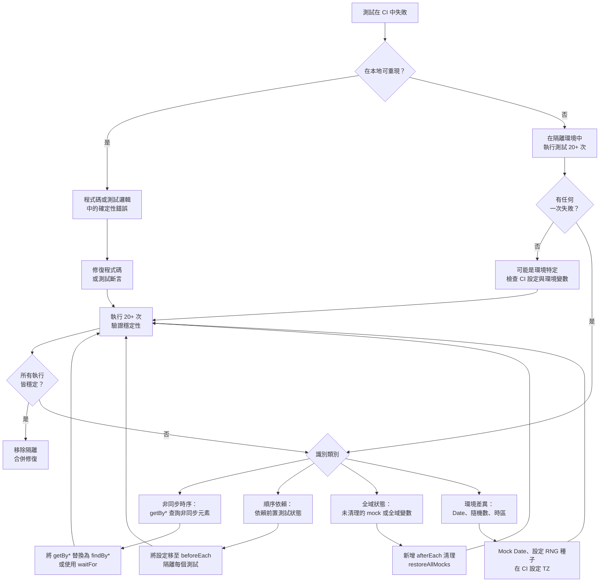

# 診斷與修復不穩定測試

不穩定測試（flaky test）是指在程式碼沒有任何變動的情況下，某些執行通過、某些執行失敗的測試。
不穩定測試會侵蝕測試套件的信任度——當開發者看到測試失敗時，第一個念頭會是「大概又是不穩定測試」
而非「程式碼出了問題」。這種侵蝕是累積性的：隨著不穩定測試的比例上升，開發者開始忽視測試失敗，
測試套件的存在意義也因此消失。

大多數不穩定測試屬於以下幾種類別之一：非同步時序問題（測試未等待非同步操作完成就繼續執行）、
測試順序依賴（測試只有在特定前置測試先行執行後才能通過，因為它依賴前置測試所建立的狀態）、
環境差異（測試在 CI 與本地環境因 CPU 速度、時區或隨機種子不同而產生不同結果），
以及共享資源競爭（兩個並行測試同時修改相同的全域變數或共享狀態）。

面對不穩定測試，正確的回應是找出根本原因並修復，而非設定重試。在 CI 中設定重試可能讓建置報告
看不出失敗，但不穩定性依然存在，並且會在更不方便的時機再度浮現——甚至可能掩蓋一個真實的回歸
問題。在進行診斷期間先將測試隔離，才是負責任的中間步驟。

## 設計思維

處理不穩定測試需要先建立一個心智模型，區分症狀（間歇性的 CI 失敗）和根本原因（時序依賴、共享狀態、環境差異、測試順序依賴）。不加診斷地直接設定重試，是對症狀的回應，而非對根本原因的修復。重試設定會在建置報告中隱藏失敗，但不穩定測試仍然存在，並且會以不可預期的方式繼續干擾工程師的工作流程——包括掩蓋真實的回歸問題。

正確的回應優先順序是：先診斷類別，再選擇對應的修復策略。四種主要的不穩定類別——非同步時序、測試順序依賴、全域狀態污染、環境差異——各自有明確的診斷信號和對應的修復模式。了解類別後，修復往往相對直接。在未診斷類別的情況下進行修復，通常只是將一種不穩定替換為另一種不穩定，而非真正解決問題。在無法立即修復時，以帶有問題追蹤連結的隔離注解作為中間步驟，比讓不穩定測試留在主套件或直接刪除都更為妥當——前者繼續侵蝕測試套件信任度，後者則是遺失了回歸防護的覆蓋範圍。

值得強調的是，不穩定測試的出現也是測試設計品質的訊號。時序不穩定通常指向對非同步行為認知不足；順序依賴通常指向測試未遵循自足性原則；全域狀態污染通常指向 `beforeEach`/`afterEach` 的紀律缺失；環境差異通常指向對隱性輸入缺乏控制的測試設計。從這個角度來看，修復不穩定測試不只是消除一個 CI 噪音源，更是一次改善整體測試套件設計品質的機會，其收益超越被修復的那一個測試本身。

### 非同步時序不穩定

最常見的不穩定根源來自測試查詢非同步操作結果尚未出現的元素或資料。Testing Library 的 `getBy*`
查詢在目標元素尚未出現於 DOM 時會立即拋出例外——沒有等待機制。在開發者本地的快速機器上，
元件渲染速度夠快，這個立即查詢往往恰好成功。但同一個測試在負載較重的 CI 執行器上執行時，
元素在查詢執行的當下尚未出現，測試因此拋出例外。

修正方法是將非同步元素的 `getBy*` 替換為 `findBy*`。`findBy*` 將底層的 `getBy*` 查詢包裝在
輪詢迴圈中，具有可設定的逾時——它會定期重試查詢，直到元素出現或逾時為止。`waitFor` 工具函式
也提供類似功能，適用於非元素查詢的斷言：它接受一個回呼函式並持續重試，直到回呼不再拋出例外。
在測試中插入明確的 `setTimeout` 延遲來「給元件一點時間渲染」是錯誤的做法——這種延遲在高負載
下可能仍然不夠，並且即使非同步操作快速完成也會無條件拖慢測試速度。正確的模式永遠是事件驅動
的等待，而非基於時間的等待。

`findBy*` 的逾時預設值可在 Testing Library 的 `configure` 中全域設定，也可逐個查詢覆寫。
在 CI 執行器明顯慢於本地機器的專案中，將預設逾時從 1000ms 提高到 3000ms 或 5000ms
是合理的，但這應作為最後手段而非第一步——首先確認根本原因確實是 CI 速度，而非測試邏輯問題。
逾時過短會讓本來穩定的測試在慢速環境中失敗；逾時過長會讓測試套件在元素永遠不出現的情況下
等待過久才報告失敗。找到適合專案 CI 環境的平衡點，並在整個套件中保持一致。

非同步時序不穩定的症狀很有辨識度：測試在本地通過、在 CI 失敗；測試在高負載 CI 執行器上穩定失敗；
失敗訊息是「無法找到元素」而非斷言不符。這些症狀能有效區分時序不穩定與邏輯錯誤——邏輯錯誤
無論在何種環境下都會產生一致的失敗。

另一個值得了解的次要模式：`waitFor` 在正確使用時確實會重試其回呼，但若回呼內部包含 `getBy*`
查詢，在某些版本的 Testing Library 中，同步拋出的例外可能在 `waitFor` 捕捉並重試之前就已
浮現。最安全且最符合慣用法的模式是直接使用 `findBy*`——它將重試迴圈嵌入查詢層級而非斷言
層級，在元素真正不存在時產生更清晰的錯誤訊息，並消除需要推理 `waitFor` 與同步拋出交互作用
的認知負擔。將 `waitFor` 保留給完全不是元素查詢的斷言——例如檢查 spy 是否被呼叫，或 store
中的值是否已更新。

### 測試順序依賴

只有在特定前置測試執行後才能通過的測試，就是順序依賴測試。它依賴前置測試建立的狀態——
插入的資料庫記錄、設定的全域變數、觸發的模組副作用——而自身並未建立該狀態。失敗模式非常精確：
測試在完整套件中通過（因為前置測試恰好先執行），但單獨執行時失敗，或在測試執行器調整執行順序後失敗。

診斷方法很直接：使用測試執行器的 `--testNamePattern` 旗標（或等效選項）單獨執行受疑測試。
若測試在單獨執行時失敗但在完整套件中通過，代表它依賴其他測試建立的狀態。修正同樣直接：
將所有狀態設定移入 `beforeEach` 鉤子，使每個測試自行建立初始條件，不依賴前置測試。
測試應完全自足——每個測試從自己建立的已知初始狀態開始，執行受測行為，對結果進行斷言，
並且不留下任何狀態給後續測試。

跨多個 worker 並行執行測試的團隊應特別注意順序依賴問題，因為並行執行消除了測試執行順序的
確定性。在序列模式下有順序依賴的測試，在並行模式下幾乎必然變得不穩定，而且診斷更加困難，
因為順序在每次執行中都是非確定性的。

一個指向順序依賴而非其他不穩定類別的實務信號：失敗不是時序錯誤也不是環境差異——元素存在、
斷言邏輯正確，但測試期望的資料不存在，因為前置測試應該要插入它但沒有。另一個信號是測試在
單獨執行時一百次失敗中一百次，但在完整套件中一百次通過。這種一致性程度能將順序依賴與非同步
時序問題區分開來——非同步時序問題在隔離環境中通常呈現機率性而非確定性的失敗模式。

### 全域狀態與共享資源

修改全域狀態——`window.location`、全域變數、假計時器設定、`localStorage`、cookie、
全域 fetch mock——而未在事後清理的測試，會將這些修改保留給同一個處理程序中所有後續執行的測試。
進行修改的測試本身可能完美通過。在它之後執行的測試可能因為全域狀態不再符合預期而失敗。

修正方法是嚴格使用 `afterEach` 清理鉤子。`jest.restoreAllMocks()` 和 `vi.restoreAllMocks()`
將所有被模擬的函式恢復為原始實作。`server.resetHandlers()` 將 MSW 請求處理器恢復為
`server.use()` 中定義的基準狀態。測試修改的任何全域變數都應重設為原始值。以
`jest.useFakeTimers()` 或 `vi.useFakeTimers()` 安裝的假計時器，應以對應的 `useRealTimers()`
呼叫卸載。模式是一致的：測試設定了什麼，`afterEach` 鉤子就拆除什麼。

對於較大的測試套件，可以在全域設定檔案（`setupFilesAfterFramework` 或 `setupFiles`）中
設定全域的 `afterEach` 清理，確保即使個別測試忘記清理，框架層級的安全網也能處理最常見的
遺漏——例如呼叫 `vi.restoreAllMocks()` 和重設 MSW handlers。這種防禦性設計不會取代在個別
測試中進行明確清理的需求，但確實能降低意外洩漏的風險，並作為一個額外的保護層。

並行測試執行中的共享資源是相關但獨立的問題。兩個並行執行的測試檔案若都向相同的記憶體內資料庫、
共享快取或全域事件發射器寫入，將產生競爭條件。解決方案是將共享資源的範疇限定在測試檔案層級而非全域層級——
每個測試檔案取得自己的隔離資源實例，而不與其他測試檔案共享單例。

在診斷疑似全域狀態污染時，一個實用技術是只執行兩個測試檔案——疑似污染來源和疑似被污染的那個——
在同一個 worker 中，按特定順序執行。若被污染的測試失敗，而排除污染來源後通過，則診斷確認。
大多數測試執行器支援 `--runInBand`（Jest）或帶有特定檔案目標的 `--pool=forks`（Vitest）
來達成此目的。確認後，追溯污染來源測試檔案以找出缺少的 `afterEach` 鉤子，並補上。

### 環境差異

依賴在不同環境中產生不同值的測試，本質上就對環境敏感。`Date.now()` 在不同時刻回傳不同值。
`Math.random()` 每次呼叫回傳不同值。系統時區影響日期格式化。系統語系影響數字和日期字串的呈現。
檔案系統路徑因開發者機器和 CI 執行器而異。依賴上述任何一項而未加以控制的測試，將在不同環境中
產生不同結果。

修正方法是以受控替代品取代環境變數輸入，消除其影響。使用 `vi.setSystemTime()` 或
`jest.setSystemTime()` 將 `Date` mock 為固定時間戳。明確設定隨機數產生器的種子而非依賴
預設種子。在 CI 中透過 `TZ` 環境變數設定固定時區，使日期格式化保持一致。使用相對路徑或
可設定的路徑而非從開發者家目錄衍生的絕對路徑。目標是讓測試的行為只是其輸入的函式，
而不受執行環境影響。

時區差異是一個特別常被忽視的環境問題。一個在台灣開發者機器（UTC+8）上通過但在 UTC 的
CI 執行器上失敗的測試，會在每次跨越午夜邊界時表現不同的行為。當測試涉及日期比較、
日期格式化、或根據時間顯示不同內容的功能時，都應將時區視為需要控制的環境變數。在
CI 的環境設定中加入 `TZ=Asia/Taipei`（或適合專案的時區），可確保 CI 環境與開發者本地
環境在時區方面保持一致。若測試需要驗證跨時區行為，則應使用固定的 UTC 時間戳並明確
轉換，而非依賴系統時區。

環境差異也可能來自本地存在但 CI 缺少的設定——含有功能旗標的 `.env.local` 檔案、修改 DOM
的瀏覽器擴充套件，或本地 hosts 檔案條目。因 `.env.local` 中設定的環境變數而在本地通過、
因該檔案未提交至版本控制而在 CI 失敗的測試，就是環境敏感的，修正方法是在測試中明確控制
該變數，而不依賴環境提供。

環境不穩定的診斷信號是：測試在某個環境中一致通過，在另一個環境中一致失敗，且失敗模式跨環境
內的多次執行完全相同。這種跨環境不一致但環境內一致的模式是關鍵鑑別特徵：時序不穩定在單一環境
內是非確定性的，但環境不穩定在缺少或不同值的環境中產生一致的失敗。當測試在 CI 中失敗但在每
位開發者的機器上通過時，調查應從環境變數、時區和語系開始，然後才考慮其他類別。

### 系統性識別不穩定測試

最直接的技術是在隔離環境中多次重複執行受疑測試。若測試是不穩定的，連續執行二十次以上幾乎
必然會出現至少一次失敗。這個迴圈方法除了測試執行器的 CLI 和 shell 迴圈之外不需要任何工具。
在二十次連續執行中每次都產生相同結果的測試，在正常條件下可能不是不穩定的，但在異常負載下
仍可能不穩定。

在團隊層級，CI 分析平台提供更系統化的視角。Buildkite Test Analytics、GitHub Actions 標注
和 Datadog CI Visibility 都能追蹤相同提交跨多次執行的測試結果。在相同提交上跨多次 CI
執行產生不同通過/失敗結果的測試，被確定為不穩定，這些平台會自動浮現它，無需人工調查。
將 CI 分析整合到開發工作流程中，是不穩定測試管理的可擴展方法——它提供持續更新的不穩定測試
清單及歷史失敗率，使團隊能依影響程度排列修復優先順序，而非依最近哪個不穩定測試導致失敗來決定。

在尚未導入 CI 分析工具的團隊中，可以用一個簡單的 shell 腳本替代：在 CI 中對受疑測試執行
`for i in $(seq 1 20); do pnpm vitest run --reporter=verbose my.test.ts; done`，
然後計算失敗次數。這個方法不需要額外工具，可以臨時運行，並在幾分鐘內給出明確的不穩定性
診斷。腳本的輸出也可以截圖並附在不穩定測試的追蹤問題中作為診斷依據。

不穩定測試的嚴重程度應根據失敗率和影響範圍來評估。一個每一百次失敗一次、且只影響不常觸及
功能的測試，優先級低於一個每五次失敗一次、且位於核心用戶流程中的測試。將失敗率量化為具體
數字（「失敗率約 15%」）而非定性描述（「有時候會失敗」），能讓團隊在排列修復優先順序時
做出更清晰的決策，也能在修復後驗證改善效果——修復前 15% 失敗率，修復後 0%，是可以客觀
衡量的進步。這種量化方式也讓不穩定測試的討論從主觀（「感覺不太穩定」）轉移到客觀
（「過去三週平均失敗率 8%，影響每日建置 2-3 次」），使優先順序決策更具說服力。

當新測試開始不穩定時，第一步永遠是隔離：透過在隔離環境中執行測試、有無 mock 的情況下執行、
以及在不同環境中執行，來確定屬於哪種不穩定類別（時序、順序、環境、共享狀態）。類別決定修正方法。
在未先診斷類別的情況下嘗試修復不穩定測試，通常只會產生另一個不穩定測試，而非穩定的測試。

團隊應將不穩定測試率作為品質指標，與覆蓋率和建置時間並列追蹤。目標是主套件中零已知不穩定測試。
單一不穩定測試是可診斷的問題。百分之五的測試都不穩定的測試套件是系統性問題，需要專門的
團隊努力來解決——可能需要安排一個不穩定測試衝刺，優先修復發生頻率最高的不穩定測試，並新增
CI 分析以防止新的不穩定測試在未被偵測的情況下累積。累積的不穩定測試對開發者生產力和發佈
信心的複合影響是巨大的：不信任測試套件的開發者不會將其作為決策工具，而沒有可信測試套件的
發佈就是沒有安全網的發佈。

### 在測試架構層面防止不穩定

預防不穩定測試最有效的時機是在撰寫測試時，而非在測試開始不穩定後。幾個設計原則能從根本上
降低不穩定測試的發生機率。第一，讓每個測試對其所需的外部條件完全自足：所有設定在 `beforeEach`
中完成，所有清理在 `afterEach` 中完成，不假設任何前置或後置狀態。第二，優先使用角色和語意
查詢（`getByRole`、`getByLabelText`）而非基於實作細節的查詢（`getByTestId`、`querySelector`），
因為角色查詢更貼近使用者感知，對元件內部重構更具彈性。第三，在測試設置中明確控制所有隨機性
來源——時間、亂數、網路請求——而不依賴它們在測試執行時恰好產生期望的值。

Code review 是防止不穩定測試進入主分支的最後防線。審查者應特別注意以下模式：在非同步操作
後使用 `getBy*`、在測試中使用 `setTimeout` 等待、對全域變數的修改而沒有對應的清理、以及
任何對 `Date.now()` 或 `Math.random()` 的直接呼叫。這些模式不保證一定會導致不穩定，但都是
值得在 review 中提出並討論的危險信號。

引入新測試時的另一個有效做法，是將新測試在 CI 中連續執行五到十次作為 PR 合併條件的一部分，
特別針對涉及非同步操作、全域狀態或時間相關功能的測試。這個額外步驟的代價相對小，但能在測試
進入主分支之前就捕捉到間歇性失敗。對於已知容易產生不穩定測試的功能區域（例如複雜的動畫序列、
依賴網路響應時機的功能），這種前置驗證尤其值得投入。建立一套針對高風險測試的強化驗證流程，
是在技術負債形成之前就加以控制的主動策略。

## 最佳實踐

**必須（MUST）**對非同步出現的元素使用 Testing Library 的 `findBy*` 查詢，而非 `getBy*`
查詢。`findBy*` 將 `getBy*` 包裝在具有可設定逾時的輪詢迴圈中；它會等待元素出現，而非立即拋出。
對非同步內容使用 `getBy*` 是非同步時序不穩定最常見的根源，並且產生難以在本地重現的失敗，
因為失敗取決於負載。這個規則適用於所有在使用者互動（點擊按鈕、提交表單、選擇選項）或資料
獲取完成之後才出現的元素，以及在 `useEffect` 執行後才渲染的任何內容。

**必須（MUST）**在 `afterEach` 鉤子中清理全域狀態和 mock。洩漏狀態至後續測試的測試會產生
順序依賴的失敗，這類失敗難以診斷，因為它們只在特定執行順序下才會出現。`jest.restoreAllMocks()`
或 `vi.restoreAllMocks()` 恢復被 mock 的函式；`server.resetHandlers()` 恢復 MSW 處理器；
明確拆除測試所做的全域修改，確保每個測試從已知狀態開始。在使用假計時器的測試中，尤其要記得
在 `afterEach` 中呼叫 `vi.useRealTimers()` 或 `jest.useRealTimers()`，否則後續測試中所有
基於真實時間的非同步操作都將停止推進，導致難以解釋的掛起或逾時。

**應該（SHOULD）**以追蹤注解和問題連結來隔離不穩定測試，而非刪除或無限期停用而不留記錄。
附有說明隔離原因及開放問題連結的停用測試，是有問責機制的已追蹤技術負債項目。悄悄刪除的測試
是遺失的回歸防護閘，沒有任何關於遺失了什麼的記錄。隔離的格式應標準化：使用統一的前綴（例如
`// FLAKY: <issue-url> <date>`）讓後續搜尋容易識別所有被隔離的測試，並在問題解決後能快速
找到需要恢復的測試。

**禁止（MUST NOT）**將 CI 重試失敗測試設定為永久政策以壓制不穩定測試失敗——不得以重試
掩蓋根本原因未被修復的不穩定測試。重試設定增加 CI 執行時間，透過「這個有時候就是會失敗」
掩蓋真實失敗而降低測試套件的可信度，並且延遲能修復根本原因的診斷工作。若 CI 平台本身提供重試功能（例如 GitHub Actions 的 `retry`
選項），這個功能應僅在受控期間用於已知不穩定測試的臨時緩解，並搭配明確的到期計畫，
而非作為預設的失敗處理策略套用於整個測試套件。

## 視覺呈現



## 範例

```js
// 不穩定：getBy* 在元素尚未渲染時立即拋出
test('搜尋後顯示結果', async () => {
  await userEvent.type(screen.getByRole('searchbox'), 'query');
  await userEvent.click(screen.getByRole('button', { name: '搜尋' }));
  await waitFor(() => {
    expect(screen.getByText('結果 1')).toBeInTheDocument(); // 元素出現前可能拋出
  });
});

// 穩定：findBy* 輪詢直到元素出現或逾時
test('搜尋後顯示結果', async () => {
  await userEvent.type(screen.getByRole('searchbox'), 'query');
  await userEvent.click(screen.getByRole('button', { name: '搜尋' }));
  expect(await screen.findByText('結果 1')).toBeInTheDocument(); // 自動等待
});
```

## 常見錯誤

- 在 `waitFor` 內部使用 `getBy*` 查詢，而非直接將 `getBy*` 替換為 `findBy*`——`waitFor` 會重試回呼，但若回呼包含 `getBy*`，在某些版本的 Testing Library 中，第一次失敗的查詢仍會在 `waitFor` 捕捉並重試之前同步拋出。
- 在一個測試中安裝假計時器後，忘記在 `afterEach` 中呼叫 `vi.useRealTimers()` 或 `jest.useRealTimers()`，導致同一檔案中所有後續測試都在假計時器下執行，破壞任何依賴真實非同步時序的測試。
- 將在第二十次重試才通過的測試視為「穩定」——二十次中有一次失敗的測試就是不穩定測試；重試迴圈是診斷工具，不是穩定性閾值。
- 隔離不穩定測試時未開啟追蹤問題或新增說明注解——無說明的 `.skip` 產生看不見的技術負債，沒有負責人，也沒有解決路徑。
- 在模組層級 mock `Date.now` 而非在 `beforeEach` 中，導致模組快取共享時 mock 跨測試檔案持續存在，產生因測試檔案執行順序而異的環境差異。
- 在未確認根本原因的情況下提高 `findBy*` 的逾時值來修復不穩定——更長的逾時可能讓測試在慢速環境中通過，但若根本問題是測試邏輯錯誤而非時序，逾時增加只是延後了最終的失敗，並拖慢了整個測試套件的執行速度。
- 將「在 CI 中重新觸發建置直到通過」作為日常操作接受——這是一個文化問題的信號，表明團隊已開始將不穩定視為正常，而非需要解決的問題；每次手動重觸發都是應該被記錄到不穩定測試追蹤清單中的事件。

## 相關 FEE

- [FEE-1100 — 測試策略總覽](./1100.md)
- [FEE-1102 — 使用 Testing Library 進行元件測試](./1102.md)
- [FEE-1109 — 使用 MSW 進行 API 模擬與整合測試](./1109.md)
- [FEE-1107 — 測試哲學：覆蓋率、信心與測試金字塔](./1107.md)

## 參考資料

- [Testing Library: 非同步工具函式](https://testing-library.com/docs/dom-testing-library/api-async)
- [Google Testing Blog: 不穩定測試](https://testing.googleblog.com/2020/12/test-flakiness-one-of-main-challenges.html)
- [Vitest: 測試重試設定](https://vitest.dev/config/#retry)
- [Jest: 模擬計時器](https://jestjs.io/docs/timer-mocks)
- [Vitest: 模擬日期與系統時間](https://vitest.dev/api/vi.html#vi-setsystemtime)
- [Buildkite Test Analytics](https://buildkite.com/test-analytics)
- [Datadog CI Visibility](https://docs.datadoghq.com/tests/)
- [Testing Library: 設定全域選項](https://testing-library.com/docs/dom-testing-library/api-configuration)
- [GitHub Actions: 重新執行工作流程](https://docs.github.com/en/actions/managing-workflow-runs/re-running-workflows-and-jobs)

