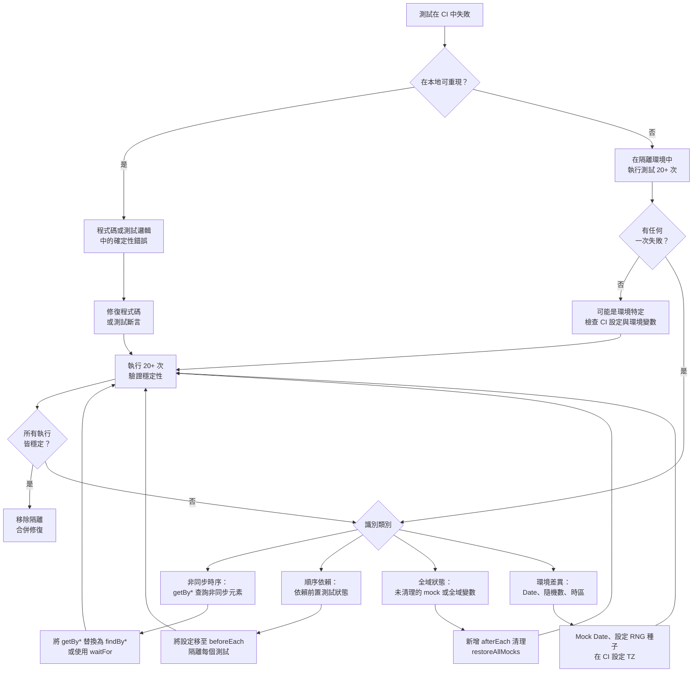

# 診斷與修復不穩定測試

:::info
不穩定測試是指在受測程式碼沒有任何變動的情況下，某些執行通過、某些執行失敗的測試。這是侵蝕測試套件信任度最快的方式之一：一旦開發者認定某次失敗「大概只是不穩定」，就會停止仔細檢視測試失敗的原因。本文涵蓋以 Testing Library、Jest、Vitest 與 Mock Service Worker（MSW）為基礎的元件與單元測試不穩定問題；端對端測試（例如 Playwright）的不穩定議題有自己的一套診斷工具，圍繞著自動重試斷言與追蹤紀錄擷取，不在本文範圍內。這個範圍內的不穩定問題大多可歸為四種成因之一：非同步時序、測試順序依賴、共享全域狀態、環境差異。每種成因都有明確的診斷信號與對應的修復方式，且沒有一種能靠重試測試直到通過來解決。
:::

## 背景

不穩定測試在大型測試套件中是有充分文獻記載的問題。Google 的測試團隊在 2016 年的報告指出，其內部單一大型儲存庫（monorepo）中約有 1.5% 的測試執行結果不穩定，比例高到團隊為此建立了自動化隔離工具，而非仰賴人工逐一排查。當測試間歇性失敗時，常見的處理方式是重試直到通過，無論是手動重跑還是透過 CI 的重試設定。重試會讓建置報告看不出失敗，但根本原因依然存在，日後仍會再度浮現，有時發生在更不方便的時機，有時甚至掩蓋了真正的回歸問題。在根本原因尚未診斷出來之前，將測試隔離（標記為已知不穩定並附上追蹤問題，而非直接刪除）才是負責任的中間步驟。

## 視覺對比



## 範例

```js
// 不穩定：getBy* 若元素尚未渲染會立即拋出例外
test('搜尋後顯示結果', async () => {
  await userEvent.type(screen.getByRole('searchbox'), 'query');
  await userEvent.click(screen.getByRole('button', { name: '搜尋' }));
  expect(screen.getByText('結果 1')).toBeInTheDocument(); // 結果渲染前就會拋出
});

// 穩定：findBy* 會輪詢直到元素出現或逾時
test('搜尋後顯示結果', async () => {
  await userEvent.type(screen.getByRole('searchbox'), 'query');
  await userEvent.click(screen.getByRole('button', { name: '搜尋' }));
  expect(await screen.findByText('結果 1')).toBeInTheDocument(); // 自動等待
});
```

`findBy*` 查詢在底層等同於呼叫 `waitFor(() => getBy*(...))`。Testing Library 維護者 Kent C. Dodds
指出這兩種寫法在功能上是等價的，但 `findBy*` 更簡潔，且在元素始終未出現時會產生更清楚的錯誤訊息，
因此是預設應該採用的查詢方式。

## 最佳實踐

**必須（MUST）**對非同步出現的元素使用 Testing Library 的 `findBy*` 查詢，而非 `getBy*` 查詢。
`findBy*` 將 `getBy*` 包裝在具有可設定逾時的輪詢迴圈中，等待元素出現而非立即拋出例外。對非同步
內容使用 `getBy*` 是非同步時序不穩定最常見的根源，且產生的失敗難以在本地重現，因為它取決於系統
負載。

**必須（MUST）**在 `afterEach` 鉤子中清理全域狀態與 mock。將狀態洩漏給後續測試的測試會產生順序
依賴的失敗，這類失敗難以診斷，因為只有在特定執行順序下才會出現。`jest.restoreAllMocks()` 或
`vi.restoreAllMocks()` 會恢復被 mock 的函式；`server.resetHandlers()` 會恢復 MSW 處理器；明確
拆除測試所做的任何全域修改，確保每個測試都從已知狀態開始。

**應該（SHOULD）**以追蹤注解和問題連結來隔離不穩定測試，而非刪除或無限期停用而不留記錄。附有
說明隔離原因、並連結到開放問題的停用測試，是有問責歸屬的已追蹤技術負債；悄悄刪除的測試則是遺失
的回歸防護閘，沒有留下任何關於遺失內容的記錄。

**禁止（MUST NOT）**將 CI 設定為永久重試失敗的元件或單元測試以壓制不穩定的失敗。全面性的重試
設定會增加 CI 執行時間，用「這個測試有時候就是會失敗」掩蓋真正的失敗，並延遲能修復根本原因的
診斷工作。Playwright 的 `retries` 選項搭配 `trace: 'on-first-retry'` 是不同的做法：它會在端對端
測試失敗時重跑一次，並在那次重跑中擷取完整的追蹤紀錄，目的純粹是為診斷提供證據。測試事後仍然
需要真正的修復。

## 設計思維

以下各節依序說明這套技術堆疊中四種主要不穩定成因：辨識它的診斷信號，以及對應的修復方式。

### 非同步時序不穩定

最常見的不穩定根源來自測試中查詢那些要等非同步操作完成後才會出現的元素或資料。Testing Library
的 `getBy*` 查詢（`@testing-library/dom` 系列，是 React Testing Library、Vue Testing Library
等套件的底層依賴）在目標元素尚未出現於 DOM 中時，會立即拋出例外，沒有內建任何等待機制。在渲染
速度快的本地開發機器上，這種立即查詢常常恰好成功。但同一個測試在負載較重、CPU 資源緊張的 CI
執行器上執行時，查詢當下元素尚未出現，測試因此拋出例外。

修正方法是將非同步出現的元素從 `getBy*` 改為 `findBy*`。`findBy*` 把底層的 `getBy*` 查詢包裝在
具有可設定逾時的輪詢迴圈中，定期重試查詢，直到元素出現或逾時為止。`waitFor` 工具函式提供類似的
功能，適用於非元素查詢的斷言：它接受一個回呼函式，並持續重試直到回呼不再拋出例外。在測試中插入
明確的 `setTimeout` 延遲來「給元件一點時間渲染」是錯誤的做法。這種延遲在高負載下可能仍然不夠，
而且即使非同步操作很快完成，也會無條件拖慢整個測試套件。應該等待具體的事件（元素出現、spy 被
呼叫），而不是等待固定的延遲時間。

在測試設定層級為 `findBy*` 與 `waitFor` 設定合適的預設逾時，可以同時避免誤判失敗（CI 執行器
負載高時逾時太短）與拖慢測試（逾時太長，每次失敗都要等滿整段時間才回報）。Testing Library 的
預設 `asyncUtilTimeout` 是 1000ms，對大多數現代硬體上的非同步操作已經足夠。CI 執行器在高負載下
有時需要更多緩衝時間，2000ms 是常見的選擇，足以容納較慢的渲染速度，又不會讓單次失敗的等待成本
變得昂貴。應該用 `configure({ asyncUtilTimeout: 2000 })` 做全域設定，而不是逐個查詢調整逾時：
這能避免只提高某個查詢的逾時、卻讓其他查詢維持預設值的常見錯誤，這種不一致會產生只在部分查詢
逾時而其他沒有時才顯現的不穩定。全域設定也確保之後新增的非同步查詢會自動套用這個刻意設定的
逾時，而不是悄悄退回到可能已不適合當前 CI 環境的預設值。

非同步時序不穩定的症狀很有辨識度：測試在本地通過但在 CI 失敗，測試在高負載的 CI 執行器上穩定
地失敗，且失敗訊息是「找不到元素」而非斷言不符。這些症狀能把時序不穩定與邏輯錯誤區分開來，邏輯
錯誤無論在什麼環境下都會產生一致的失敗。

有一點值得說清楚：`waitFor(() => screen.getByText(...))` 這種寫法並不是不穩定的。`waitFor` 會
持續重試其回呼直到不再拋出例外，因此回呼內 `getBy*` 查詢拋出的同步例外，會像任何其他失敗的斷言
一樣被捕捉並重試。即便如此，`findBy*` 仍然是較好的預設選擇：它把 `getBy*` 和 `waitFor` 合而為
一次呼叫，因此更簡潔，而且根據 Kent C. Dodds 的說法，在元素始終未出現時會產生更清楚的錯誤訊息。
應該把 `waitFor` 保留給非元素查詢的斷言，例如檢查 spy 是否被呼叫、或 store 中的值是否已更新。

### 測試順序依賴

只有在特定前置測試之後執行才會通過的測試，就是順序依賴測試。它依賴前置測試建立的狀態（插入的
資料庫記錄、設定的全域變數、觸發的模組副作用），而自身並未建立該狀態。失敗模式相當精確：測試在
完整套件中通過，因為前置測試恰好先執行，但單獨執行或測試執行器調整執行順序後就會失敗。

診斷方法很直接：使用測試執行器的 `--testNamePattern` 旗標（或等效選項）單獨執行受疑測試。若測試
單獨執行時失敗、但在完整套件中通過，代表它依賴其他測試建立的狀態。修正方法同樣直接：把所有狀態
設定移入 `beforeEach` 鉤子，讓每個測試自行建立初始條件，不依賴前置測試。每個測試都應該完全自
足：從自己建立的已知初始狀態開始，執行受測行為，對結果做斷言，並且不留下任何狀態給後續測試。

跨多個 worker 並行執行測試的團隊，應該特別留意順序依賴問題，因為並行執行會消除測試執行順序的
確定性。在序列模式下有順序依賴的測試，在並行模式下幾乎必然變得不穩定，而且因為執行順序在每次
執行時都不確定，診斷也會變得更困難。

有一個能指向順序依賴、而非其他不穩定類別的實務信號：失敗既不是時序錯誤，也不是環境差異。元素
存在、斷言邏輯也正確，但測試期望的資料不存在，因為原本應該插入它的前置測試沒有執行。另一個信號
是失敗在單獨執行時百分之百一致，但在完整套件中百分之百通過。這種一致程度可以把順序依賴和非同步
時序問題區分開來：後者在隔離環境中通常呈現機率性、而非確定性的失敗模式。

### 全域狀態與共享資源

修改全域狀態（`window.location`、全域變數、假計時器設定、`localStorage`、cookie、全域 fetch
mock）卻沒有事後清理的測試，會讓這些修改保留下來，影響同一個處理程序中所有後續執行的測試。進行
修改的那個測試本身可能完全正常通過，但在它之後執行的測試，可能因為全域狀態不再符合預期而失敗。

修正方法是嚴格使用 `afterEach` 清理鉤子。`jest.restoreAllMocks()` 和 `vi.restoreAllMocks()` 會
把所有被 mock 的函式恢復為原始實作。`server.resetHandlers()` 會把 Mock Service Worker（MSW，
用來在測試中攔截並模擬網路請求的函式庫）的請求處理器恢復為 `server.use()` 中定義的基準狀態。
測試修改過的任何全域變數，都應該重設回原始值。用 `jest.useFakeTimers()` 或 `vi.useFakeTimers()`
安裝的假計時器，應該用對應的 `useRealTimers()` 呼叫卸載。這個模式是一致的：測試設定了什麼，
`afterEach` 鉤子就拆除什麼。

並行測試執行中的共享資源是另一個相關但獨立的問題。兩個並行執行的測試檔案，若同時寫入相同的記憶
體內資料庫、共享快取或全域事件發射器，就會產生競爭條件。解法是把共享資源的範圍限定在測試檔案
層級，而不是全域層級：讓每個測試檔案取得自己獨立的資源實例，而不是與其他測試檔案共用同一個
單例。

在診斷疑似全域狀態污染時，有個實用的技巧是只執行兩個測試檔案（疑似造成污染的那個，以及疑似被
污染的那個），放在同一個 worker 中，按特定順序執行。如果被污染的測試會失敗，而排除污染來源後
就會通過，診斷就得到確認。大多數測試執行器都支援針對這個目的的 `--runInBand`（Jest）或指定檔案
的 `--pool=forks`（Vitest）。確認之後，回頭追查污染來源測試檔案，找出缺少的 `afterEach` 鉤子
並補上。

### 環境差異

依賴會隨環境而變動的數值的測試，本質上就對環境敏感。`Date.now()` 在不同時刻回傳不同值；
`Math.random()` 每次呼叫回傳不同值；系統時區會影響日期格式化；系統語系會影響數字和日期字串的
呈現方式；檔案系統路徑在開發者機器和 CI 執行器之間也不相同。依賴上述任何一項卻沒有加以控制的
測試，會在不同環境中產生不同結果。

修正方法是用受控的替代品取代這些環境變數輸入，消除其影響。用 `vi.setSystemTime()` 或
`jest.setSystemTime()` 把 `Date` mock 為固定的時間戳記。明確設定隨機數產生器的種子，而不是依賴
預設種子。在 CI 中透過 `TZ` 環境變數設定固定時區，讓日期格式化保持一致。使用相對路徑或可設定的
路徑，而不是從開發者家目錄推導出的絕對路徑。

環境差異也可能來自本地存在、但 CI 沒有的設定：帶有功能旗標的 `.env.local` 檔案、會修改 DOM 的
瀏覽器擴充套件，或本地的 hosts 檔案設定。因為 `.env.local` 中設定的環境變數而在本地通過、卻因為
該檔案未提交至版本控制而在 CI 失敗的測試，就是對環境敏感的測試。修正方法是在測試中明確控制該
變數，而不是依賴環境提供。

環境不穩定的診斷信號是：測試在某個環境中一致通過，在另一個環境中一致失敗，且在失敗的那個環境
中，每次執行的失敗表現都相同。這種在單一環境內一致、但跨環境不一致的模式，是關鍵的鑑別特徵：
時序不穩定在單一環境內就是不確定的，而環境不穩定則是在缺少或不同數值的那個環境中產生一致的
失敗。當測試在 CI 中失敗、但在每位開發者的機器上都能通過時，調查應該從環境變數、時區與語系開始，
之後才考慮其他類別。

### 系統性識別不穩定測試

最直接的技術是在隔離環境中把受疑測試重複執行很多次。如果測試真的不穩定，連續執行二十次以上幾乎
必然會出現至少一次失敗。這個迴圈做法除了測試執行器的 CLI 和一段 shell 迴圈之外，不需要任何額外
工具。在二十次連續執行中每次結果都相同的測試，在正常條件下大概不是不穩定的，但在異常負載下仍有
可能不穩定。

在團隊層級，CI 分析平台能提供比手動隔離迴圈更系統化的視角。專門為不穩定測試追蹤而設計的工具，
例如 Trunk Flaky Tests、Buildkite Test Analytics，以及 Datadog 的 CI Visibility（現已併入
Datadog CI/CD Optimization），會比較同一個測試在同一個提交上跨多次執行的結果，並標記出在通過與
失敗之間反覆的測試。原生的 GitHub Actions 沒有對應的內建功能：它的標注（annotation）只是每次
執行的標記，數量以每個 job 為上限，沒有跨執行的歷史紀錄，因此只依賴 GitHub Actions 的團隊，需要
搭配上述第三方工具之一，才能自動而非碰運氣地抓到不穩定測試。把不穩定測試追蹤工具整合進開發流
程，是管理不穩定測試最具擴充性的做法。它能提供一份持續更新的不穩定測試清單與歷史失敗率，讓修復
工作能依影響程度排序，而不是取決於今天剛好是哪個不穩定測試弄壞了建置。

當新測試開始出現不穩定時，第一步永遠是隔離：透過在隔離環境中執行、有無 mock 的情況下執行、以及
在不同環境中執行，來判斷屬於哪種不穩定類別（時序、順序、環境、共享狀態）。類別決定了修正方法。
在還沒診斷出類別之前就嘗試修復不穩定測試，往往是白費力氣。對於因為前一個測試留下的狀態而失敗的
測試，拉長逾時毫無幫助。

團隊應該把不穩定測試比例當作品質指標之一，與涵蓋率和建置時間一併長期追蹤。Google 的測試團隊曾
報告其內部套件約有 1.5% 的測試執行結果不穩定，比例高到促使他們建立自動化隔離工具，而不是仰賴
人工排查。並不存在一個放諸四海皆準的百分比，能劃分「幾個測試需要修」和「系統性問題」之間的界線。
更有用的判斷信號是行為面的：當開發者習慣重新觸發 CI 而不是去調查失敗原因，或是隔離清單成長的
速度持續快過清空的速度，問題就已經變成系統性的，需要協調一致的整頓（例如安排專門的衝刺、優先
修復發生頻率最高的測試、加入 CI 分析工具在不穩定累積之前就攔截下來），而不是零星的個別修復。
不穩定測試的影響會複合放大：不信任套件的開發者會停止把它當作決策依據，而建立在不受信任測試套件
之上的發佈，就少了那份原本應該提供的安全網。

## 常見錯誤

- 在 `waitFor` 中包裝 `getBy*` 查詢，而不是直接使用等價的 `findBy*`。兩者在功能上是等價的，但
  `findBy*` 更簡短，並且在元素始終未出現時會產生更清楚的錯誤訊息，因此預設應優先使用它。
- 在某個測試中安裝假計時器後，忘記在 `afterEach` 中呼叫 `vi.useRealTimers()` 或
  `jest.useRealTimers()`，導致同一檔案中所有後續測試都在假計時器啟用的狀態下執行，破壞任何依賴
  真實時間非同步行為的測試。
- 把「重試二十次後終於通過」的測試當成「穩定」。二十次執行中失敗一次的測試仍然是不穩定測試；
  重複執行迴圈是用來找出這個失敗的手段，不會改變測試本身是否穩定。
- 隔離不穩定測試時，沒有開立追蹤問題或附上說明注解。沒有任何說明的 `.skip` 會產生看不見、沒有
  負責人、也沒有解決路徑的技術負債。
- 在模組層級 mock `Date.now`，而不是在 `beforeEach` 中進行，導致模組快取共享時 mock 會跨測試
  檔案持續存在，產生隨測試檔案執行順序而變化的環境差異。

## 延伸閱讀

- [FEE-1100：測試策略總覽](/zh-tw/Testing%20Strategies/1100)
- [FEE-1102：使用 Testing Library 進行元件測試](/zh-tw/Testing%20Strategies/1102)
- [FEE-1109：使用 MSW 進行 API 模擬與整合測試](/zh-tw/Testing%20Strategies/1109)
- [FEE-1107：測試哲學：覆蓋率、信心與測試金字塔](/zh-tw/Testing%20Strategies/1107)

## 參考資料

- Testing Library, "Async Utilities," Testing Library docs. https://testing-library.com/docs/dom-testing-library/api-async
- Kent C. Dodds, "Common Mistakes with React Testing Library," kentcdodds.com (2020). https://kentcdodds.com/blog/common-mistakes-with-react-testing-library
- John Micco, "Flaky Tests at Google and How We Mitigate Them," Google Testing Blog (2016). https://testing.googleblog.com/2016/05/flaky-tests-at-google-and-how-we.html
- Playwright, "Test Retries," Playwright docs. https://playwright.dev/docs/test-retries
- Playwright, "Trace Viewer," Playwright docs. https://playwright.dev/docs/trace-viewer-intro
- Vitest, "Test Retry," Vitest config docs. https://vitest.dev/config/#retry
