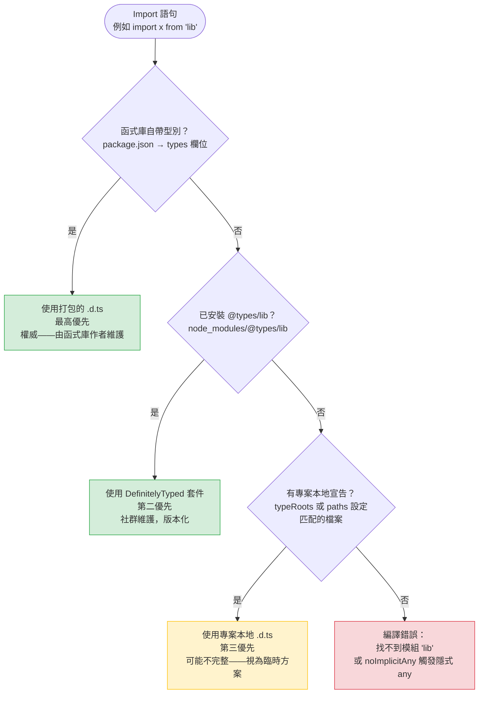

# 宣告檔案與 DefinitelyTyped

TypeScript 為函式庫取得型別的來源有三種：隨函式庫一起打包（由 `package.json` 的 `types` 欄位指定）、透過 `@types/<package>` 套件取自 DefinitelyTyped 社群倉儲，或是專案內手寫的 `.d.ts` 宣告檔案（declaration file）。TypeScript 依以下優先順序解析：打包型別 > `@types` 型別套件（type package）> 專案本地宣告。理解這條解析鏈，可以避免一個常見的錯誤：為已有社群型別（community types）的函式庫手寫宣告檔案，進而產生一份默默覆蓋上游型別、本不應存在的維護負擔。

DefinitelyTyped 是一個 GitHub 倉儲，收錄了數千個未自帶型別的 JavaScript 函式庫的社群維護型別定義。它產出的套件以 `@types` 命名空間發布至 npm。當 TypeScript 專案安裝 `@types/lodash`，取得的是由社群貢獻者跟蹤 lodash API 所維護的 `.d.ts` 檔案集，而非 lodash 作者自行維護。實作與型別定義分離的模式，是 TypeScript 普及之前的主流做法；如今大多數積極維護的函式庫已自帶型別，但 DefinitelyTyped 對採用速度較慢的函式庫而言仍不可或缺。

函式庫的型別支援生命週期遵循一條可預測的軌跡：函式庫不附型別 → 貢獻者在 DefinitelyTyped 新增型別 → 函式庫最終自帶型別 → `@types` 套件變得多餘並被棄用。理解這條軌跡的專案，能更準確地判斷應將型別撰寫的精力投入何處，以及何時移除過時的 `@types` 相依。具體行動是定期稽核 `package.json` 中的 devDependencies，找出對應函式庫已開始自帶型別的 `@types` 套件，並將其移除，以降低追蹤更新的維護成本。

理解三來源模型也有助於釐清選擇每種來源的成本結構。打包型別無需額外安裝、由函式庫作者維護，是成本最低、信心最高的選項。DefinitelyTyped 套件只需一條 `pnpm add -D` 指令，但有落後於函式庫版本的風險；它是廣泛使用且不自帶型別的函式庫的標準選項。專案本地宣告的維護成本與其對函式庫的描述完整程度成正比；它是最後的手段。

## 設計思維

### .d.ts 檔案：無實作的宣告

宣告檔案（declaration file）是不含任何執行期（runtime）值的 TypeScript 語法——它描述 JavaScript 模組的外形，而不輸出任何程式碼。`.d.ts` 檔案可以宣告函式、類別、介面、型別、模組與全域變數，但這些宣告都不會產生 JavaScript 輸出。宣告檔案是 JavaScript 世界（執行期無型別）與 TypeScript 世界（編譯期需要型別）之間的橋樑。

宣告檔案遵循與一般 TypeScript 檔案相同的語法，但有一項限制：不得包含實作。`declare function fetch(url: string): Promise<Response>` 告訴 TypeScript `fetch` 的外形，但不提供函式本體。`declare module 'some-library'` 告訴 TypeScript 該模組存在及其匯出內容，而不複製函式庫的原始碼。正是這個限制，使宣告檔案可以作為覆蓋層疊加於任何 JavaScript 函式庫之上，無需修改函式庫本身。

完整宣告與環境模組宣告（ambient module declaration）在型別安全品質上有本質差異。完整宣告——逐一列舉所有匯出的函式、類別和型別，並提供準確的簽名——能提供完整的型別安全。環境模組宣告，即 `declare module 'lib-name'` 加上空本體，只告訴 TypeScript 該模組存在；所有匯出項目隱式地被型別標注為 `any`。兩者都能消除「找不到模組」的編譯錯誤，但只有前者能提供讓編譯器在呼叫位置捕捉誤用的有效型別資訊。

宣告檔案也是描述全域擴增的機制：為 `window` 新增屬性、擴充內建原型，或宣告由建置工具注入的環境變數（例如 webpack 注入的 `__DEV__` 旗標）。這些全域宣告存在於被 `typeRoots` 設定自動收錄、或在 `tsconfig.json` 中明確列出的 `.d.ts` 檔案中。適用相同的規則：宣告的範圍越精確，意外擴展 TypeScript 對全域環境的認知進而掩蓋真實錯誤的風險就越低。

決定為哪個函式庫使用哪種型別來源的實際工作流程，建議從函式庫本身開始：確認套件的 `package.json` 是否輸出 `types` 欄位，或進入點是否有並列的 `.d.ts` 檔案。若打包型別存在，不需要進一步操作。若不存在，執行 `npm info @types/<套件名稱>` 確認是否存在 DefinitelyTyped 套件，以及其版本是否與使用中的函式庫版本相符。只有在兩者都不存在時，才應撰寫專案本地宣告，且必須在確認 DefinitelyTyped 套件確實不存在（而非只是未出現在搜尋結果中）後再動手——`@types` 命名空間規模龐大，部分社群型別套件採用非常規命名。這個三步驟檢查在兩分鐘內可完成，能防止最常見的不必要本地宣告來源：工程師因為不知道社群型別的存在而自行撰寫宣告。

DefinitelyTyped 套件與函式庫之間的版本對齊是反覆出現的維護課題。DefinitelyTyped 套件遵循 `major.minor` 版本命名，前兩段對應函式庫版本。函式庫與其 DefinitelyTyped 套件是獨立的 npm 套件，由不同團隊維護，因此函式庫釋出新主版本後，型別套件需要獨立更新。使用 `@types/some-library@3.x` 型別而安裝的是 `some-library@4.x` 時，型別所描述的 API 介面已不存在，編譯器提供的安全保證是誤導性的。將型別套件版本對齊納入依賴更新 PR 的審查標準，並利用 Renovate 或 Dependabot 將函式庫升級與對應的 `@types` 套件更新合併為單一 PR，可防止版本漂移在函式庫升級過程中悄然累積。
這種配對策略也確保型別對齊檢查成為每次依賴更新審查的一部分，讓版本漂移成為正常 Pull Request 工作流程中的可見關注點，而非只有在執行時不一致導致生產事件後才被發現的問題。
在團隊的 TypeScript 升級流程中，建議同時執行 `npx tsd --files 'src/**/*.ts'` 或類似的型別測試工具，以確認在型別版本升級後，公開的函式庫 API 型別仍與期望的呼叫簽名一致；這對型別定義與實際執行時 API 之間可能因版本差異而不同步的套件尤為重要。
追蹤專案中所有專案本地 `.d.ts` 宣告的一個實用做法是在 `tsconfig.json` 中保留明確的 `include` 或 `typeRoots` 清單，並在 CI 中加入一個步驟確認這個清單中的每個條目都有對應的追蹤 issue 或有效的保留理由；這讓本地型別宣告保持為可見、可問責的技術債，而非不知不覺累積的隱形負債。
在程式碼審查清單中，對每個新增的 `.d.ts` 檔案觸發對「是否已確認不存在對應的社群型別套件？」的問題，是將三步驟檢查流程制度化的低成本方式，確保知識不僅停留在撰寫本文的工程師腦中，而是內建於團隊的審查流程中，對所有貢獻者一律有效。
建立一個以 `declare module '*'` 為掃描目標的 ESLint 或 TypeScript 自定規則，可以在任何萬用字元宣告被引入時自動發出警告，把這個已知反模式的攔截從依賴人工記憶的審查，升級為有工具保障的品質關卡。
良好的 `.d.ts` 衛生習慣的最終效益，是讓型別系統始終精確地反映程式庫實際提供的介面——這個精確性是 TypeScript 作為安全網發揮作用的前提，也是避免「型別檢查通過但執行時崩潰」這類最難除錯的問題的根本保障。
定期以 `tsd` 等工具對暴露型別的函式庫進行型別測試，驗證公開 API 的型別簽名符合設計意圖，是維護型別準確性的完整閉環，將宣告檔案的正確性從依賴人工審查提升為持續整合中的自動化驗收。

### 模組擴增：擴充第三方型別

當函式庫的型別不完整或有誤時，模組擴增（module augmentation）允許專案在不分叉套件、不維護完整平行宣告的情況下擴充型別。`.d.ts` 檔案中的 `declare module 'library-name'` 區塊會與現有的模組宣告合併，而非取代它。這意味著擴增區塊內的 `interface Options { newField: string }` 會在整個專案範圍內，將 `newField` 加入該函式庫的 `Options` 介面。TypeScript 在編譯期合併擴增後的介面，所有使用 `Options` 的呼叫位置都能看到擴充後的外形。

模組擴增在版本控制中有跡可循，並可在上游型別修正後，以單一提交乾淨地移除。替代方案——在每個呼叫位置以 `as ExtendedOptions` 進行型別轉換——只在一處壓制了錯誤，卻無法讓其他呼叫位置得知該欄位的存在；隨著函式庫在更多地方被使用，轉換語法不斷累積，而當上游型別最終新增該欄位後，清理轉換語法需要全域搜尋替換，且容易出錯——必須區分哪些轉換是暫時的變通，哪些又出於其他原因。

同樣的機制也適用於全域範圍的擴增。擴充 `interface Window { analytics: AnalyticsAPI }` 或透過 `namespace NodeJS { interface ProcessEnv { API_KEY: string } }` 為 `process.env` 新增屬性，都遵循相同的合併語義。擴增檔案必須是一個模組（至少包含一個 `import` 或 `export`），合併才能正確運作；純腳本上下文的 `.d.ts` 檔案會宣告一個競爭的全域變數，而不是合併進現有的宣告，依解析順序不同，可能產生重複識別符錯誤或意外的型別擴寬。

模組擴增有一條重要的範圍規則：擴增只有在擴增檔案被納入 TypeScript 編譯時才生效。檔案透過 `tsconfig.json` 的 `include` 模式、明確的 `files` 項目，或被已納入編譯的檔案遞移匯入而被收錄。存放於 `src/types/` 目錄的擴增檔案，只有在該目錄被編譯設定覆蓋的情況下才有效——當擴增似乎沒有生效時，這個細節值得優先確認。

### 環境模組宣告與萬用字元宣告

當函式庫既無 `@types` 套件、又無自帶型別時，含有 `declare module 'lib-name'` 空本體的最小環境模組宣告（ambient module declaration），能在不提供任何型別安全的情況下消除型別錯誤。該模組被型別標注為 `any`，雖不如完整宣告有用，但比阻擋建置的編譯錯誤更為實用。這作為暫時措施、在安排正式解決方案之前是可以接受的。

環境模組宣告不是永久解決方案。它不向 TypeScript 編譯器提供任何關於模組匯出內容、函式參數型別或回傳型別的資訊。呼叫位置接收到的是 `any`，喪失了所有型別檢查的保障。完整宣告——準確地為實際匯出內容標注型別——應貢獻至上游 DefinitelyTyped，使所有使用該函式庫的專案受益，而不僅是最初撰寫宣告的那個專案。

真正的萬用字元宣告——`declare module '*'`——是一個截然不同且更危險的工具。它告訴 TypeScript 將所有無法解析的模組匯入都視為 `any`，消除專案中所有缺失模組的型別錯誤，而不僅僅是需要處理的那一個。這種模式在特定的打包器插件場景中偶爾是合理的（例如宣告所有 `.svg` 匯入都產生 `string` URL，或所有 `.graphql` 匯入都產生 `DocumentNode`），但絕不應被用作缺失 `@types` 套件的通用修復手段。當萬用字元宣告用於資源匯入時，通常寫成 `declare module '*.svg' { const content: string; export default content; }`——這個模式的範圍限定在特定副檔名，而非真正開放式的萬用字元。

### 型別解析優先順序與覆蓋風險

TypeScript 的解析順序——打包型別 → `@types` 套件 → 專案本地宣告——創造了一個方向與工程師通常預期相反的覆蓋風險。如果專案已有某函式庫的專案本地 `.d.ts` 檔案，後來又安裝了對應的 `@types` 套件，`@types` 套件會取得優先權，專案本地檔案便成為死碼。這通常是預期的結果，但那個死碼會靜靜留存，讓未來的讀者困惑究竟使用的是哪份宣告。

更棘手的方向是：`typeRoots` 或 `paths` 設定導致 TypeScript 優先選用專案本地宣告，而非準確的打包型別。在這種情況下，手寫型別會默默取代準確的型別，編譯器接受了依賴過時宣告的程式碼，差異只在執行期才浮現。在新增 `@types` 套件或升級開始自帶型別的函式庫時，稽核專案本地宣告是保持型別環境一致性的必要步驟。一個實用的做法是：每當升級函式庫時，在程式碼庫中搜尋 `declare module`，確認是否有應被移除的過時宣告。

### 為內部套件撰寫宣告檔案

內部套件——組織內維護的共用工具、設計系統函式庫或平台 SDK——有時以預先建置的 JavaScript 形式發布，而非 TypeScript 原始碼，此時需要附帶宣告檔案。在這種情況下，`.d.ts` 檔案隨編譯輸出一起發布，並透過內部套件 `package.json` 的 `types` 欄位引用。這與第三方套件自帶型別的機制相同：消費方專案無需將內部套件的原始碼納入自身的編譯，即可獲得型別安全。

當內部套件跨 monorepo 工作區使用時，TypeScript 專案參考（`tsconfig.json` 中的 `references`）是優於手寫 `.d.ts` 檔案的首選機制。專案參考使 TypeScript 能夠遍歷相依圖、跨套件進行增量建置，並直接從原始碼提供準確的型別，而非依賴可能過時的編譯輸出。在自行發布宣告檔案與使用專案參考之間的選擇，取決於內部套件是以原始碼還是建置產物的形式被消費。

### `typeRoots` 與 `types` 編譯器選項

`tsconfig.json` 中的 `typeRoots` 選項控制 TypeScript 自動收錄 `@types` 時搜尋的目錄。預設情況下，它會搜尋目錄樹各層級的 `node_modules/@types`。將 `typeRoots` 設為自訂清單，可將自動收錄限制在這些目錄，並能讓專案本地宣告目錄無需逐一列出檔案即可被發現。

`types` 選項是明確的許可清單：設定後，TypeScript 只會自動收錄陣列中列出的 `@types` 套件，即使安裝了其他 `@types` 套件也不例外。這對以下場景很有用：純瀏覽器專案中，`@types/node` 作為遞移相依被安裝，但其全域變數（`process`、`Buffer`）不應在瀏覽器程式碼中可見。在以瀏覽器為目標的 `tsconfig.json` 中設定 `"types": []`，可退出所有自動 `@types` 收錄，要求每個所需的型別套件都必須明確列出或在呼叫位置直接匯入。

理解這兩個選項，可以防止型別定義已安裝卻不可見、或在不應可見時卻可見的常見困惑。當宣告檔案或 `@types` 套件似乎沒有生效時，第一個診斷步驟是確認該檔案位於 `typeRoots` 或 `include` 覆蓋的目錄，且套件未被 `types` 許可清單排除。

`skipLibCheck: true` 選項告訴 TypeScript 跳過所有 `.d.ts` 檔案的型別檢查——包括 `node_modules` 中的那些。這個選項在專案模板中很常見，因為它能抑制不屬於專案責任範圍的第三方型別定義中的錯誤。它不會跳過型別定義本身；這些型別仍會被用來檢查專案的原始檔。理解這個區別很重要：`skipLibCheck` 消除了損壞的第三方宣告帶來的雜訊，同時不降低專案自身程式碼的型別安全。代價是：專案自身 `src/types/` 目錄中的宣告檔案也被跳過，因此手寫宣告引入的錯誤可能直到在呼叫位置消費型別時才浮現。

## 最佳實踐

**必須（MUST）在認定函式庫無型別支援之前，先為 TypeScript 檔案中用到的每個 JavaScript 相依安裝 `@types/<package>`。** 許多廣泛使用的函式庫透過 DefinitelyTyped 而非自帶方式提供型別套件。執行 `pnpm add -D @types/<package>` 是第一步；查看 https://www.typescriptlang.org/dt/search/ 的 DefinitelyTyped 搜尋是第二步。對於 npm 下載量前 10,000 的套件而言，真正沒有型別支援的情況極為罕見。

**禁止（MUST NOT）為已有官方或 DefinitelyTyped 發布型別的套件手寫型別宣告。** 手寫宣告在函式庫更新時會過時，並製造虛假的安全感——TypeScript 編譯器接受了程式碼，而實際的函式庫行為可能與宣告的型別不符。開發者在撰寫 `.d.ts` 檔案之前，禁止（MUST NOT）省略以下步驟：檢查套件自身 `package.json` 是否有 `types` 欄位，以及 npm 上 `@types` 命名空間是否有對應型別套件。

**禁止（MUST NOT）使用 `declare module '*'` 作為無法解析的模組錯誤的通用抑制器。** 萬用字元模組宣告會消除專案中所有無法解析的匯入的型別錯誤，而不只是觸發錯誤的那一個。正確的作法是具名的環境模組宣告：`declare module 'specific-lib-name'`，將抑制範圍精確限定在單一模組。萬用字元形式只在特定的打包器插件場景中適用，例如統一處理特定副檔名的匯入——即使如此，宣告也應儘量精確地型別化資源的格式。

**應該（SHOULD）使用模組擴增來擴充第三方型別，而非在呼叫位置進行型別轉換。** 模組擴增是 TypeScript 在所有用到被擴增型別的位置統一執行的宣告。型別轉換（`as ExtendedOptions`）只在單一呼叫位置壓制了錯誤，卻無法讓其他呼叫位置得知該欄位的存在。模組擴增也能在上游型別修正後，以單一提交乾淨地移除——逐一搜尋轉換語法則無法做到。

**應該（SHOULD）將缺失或有誤的型別貢獻至 DefinitelyTyped，而非無限期維護專案本地宣告。** 維護於單一專案中的 `.d.ts` 檔案只能惠及該專案，並隨函式庫持續演進而產生維護義務。貢獻至 DefinitelyTyped 的型別會被版本化、針對函式庫已發布的 API 進行測試，並對整個生態系開放使用。貢獻流程的說明文件位於 https://github.com/DefinitelyTyped/DefinitelyTyped。

**應該（SHOULD）定期稽核 `@types` devDependencies，並移除對應函式庫已開始自帶型別的套件。** 為已自帶型別的函式庫安裝的 `@types` 套件是無效負重：打包型別取得優先權，`@types` 套件從未被使用，但它仍出現在 `package.json` 中、收到更新通知，並讓調查專案型別設定的工程師感到困惑。移除它能在不影響型別安全的前提下簡化相依圖。

## 視覺呈現

以下圖表顯示 TypeScript 為匯入模組解析型別的順序。解析在第一個成功的匹配處停止；到達最後一步則產生編譯錯誤。黃色表示解析成功但結果型別可能不完整或不精確；綠色表示權威型別；紅色表示失敗。



黃色路徑（專案本地宣告）是唯一需要主動進行工程判斷的路徑。在開發過程中到達黃色路徑是一個調查信號：是否只是尚未安裝的 `@types` 套件？這個函式庫是否值得貢獻 DefinitelyTyped？專案本地宣告是否足夠完整值得信賴，還是在呼叫位置暴露了 `any`？

紅色路徑（編譯錯誤）是資訊，而不只是失敗。它意味著 TypeScript 找不到該模組的任何型別資訊——這比靜默地接受 `any` 要好。在沒有型別的情況下，編譯錯誤是正確的行為；它是一個提示，促使開發者有意識地選擇綠色或黃色路徑，而非偶然為之。

## 範例

以下範例展示模組擴增的實際場景：擴充 Express 的 `Request` 型別以攜帶認證中介軟體（middleware）填入的 `user` 屬性。這是常見的模式，因為 Express 的基礎型別並不了解應用程式特定的中介軟體，所以 `req.user` 並不在預設的 `Request` 介面中。

擴增所引用的使用者模型：

```typescript
// src/models/user.ts
export interface AuthenticatedUser {
  id: string;
  displayName: string;
  email: string;
  roles: string[];
}
```

擴增檔案位於 `src/types/express.d.ts`，必須是一個模組——結尾的 `export {}` 使其成為模組範圍而非腳本範圍，這是 `declare module` 合併正確運作的必要條件：

```typescript
// src/types/express.d.ts
import type { AuthenticatedUser } from '../models/user';

declare module 'express-serve-static-core' {
  interface Request {
    user?: AuthenticatedUser;
  }
}

export {};
```

`tsconfig.json` 必須收錄 types 目錄，TypeScript 才能讀取擴增檔案：

```json
{
  "compilerOptions": {
    "target": "ES2022",
    "module": "NodeNext",
    "strict": true,
    "outDir": "./dist"
  },
  "include": [
    "src/**/*"
  ]
}
```

擴增後的 `Request` 介面在每個呼叫位置都可直接使用，無需任何匯入或型別轉換：

```typescript
// src/middleware/requireAuth.ts
import type { Request, Response, NextFunction } from 'express';

export function requireAuth(req: Request, res: Response, next: NextFunction): void {
  if (!req.user) {
    res.status(401).json({ error: 'Unauthorized' });
    return;
  }
  // TypeScript 在此處知道 req.user 是 AuthenticatedUser — 無需型別轉換
  next();
}
```

```typescript
// src/middleware/requireRole.ts
import type { Request, Response, NextFunction } from 'express';

export function requireRole(role: string) {
  return (req: Request, res: Response, next: NextFunction): void => {
    if (!req.user) {
      res.status(401).json({ error: 'Unauthorized' });
      return;
    }
    if (!req.user.roles.includes(role)) {
      res.status(403).json({ error: 'Forbidden' });
      return;
    }
    next();
  };
}
```

```typescript
// src/routes/profile.ts
import type { Request, Response } from 'express';

export function getProfile(req: Request, res: Response): void {
  // req.user 被型別標注為 AuthenticatedUser | undefined
  const user = req.user;
  if (!user) {
    res.status(401).end();
    return;
  }
  res.json({
    id: user.id,
    name: user.displayName,
    email: user.email,
  });
}

export function updateProfile(req: Request, res: Response): void {
  const user = req.user;
  if (!user) {
    res.status(401).end();
    return;
  }
  // req.body 由 Express 型別標注為 any，仍需驗證
  // 但 user.id 已正確型別化——無需型別轉換
  const { displayName } = req.body as { displayName?: string };
  if (!displayName) {
    res.status(400).json({ error: 'displayName is required' });
    return;
  }
  res.json({ id: user.id, displayName });
}
```

如果沒有模組擴增，每次存取 `req.user` 都需要型別轉換（`(req as any).user`），或在每個路由檔案重新宣告一個自訂的 `AuthenticatedRequest` 介面。有了模組擴增，型別從單一的信任來源自動流動。當這個模式最終被取代時——例如改用內建認證上下文的框架——刪除擴增檔案的單一提交，就能讓編譯器回報所有仍在引用 `req.user` 的位置。

作為對比，以下是針對未型別化函式庫的最小環境模組宣告，作為正式宣告準備期間的臨時措施。注解使臨時狀態明確可見，並連結至工作項目：

```typescript
// src/types/untyped-analytics.d.ts
// 臨時方案——等有完整型別或 @types/some-analytics 後請替換。
// 此宣告將所有來自 'some-analytics' 的匯入型別標注為 `any`。
// 追蹤工作項目：https://github.com/org/repo/issues/1234
declare module 'some-analytics';
```

一旦對 API 足夠了解值得進行型別化，更完整的版本如下：

```typescript
// src/types/some-analytics.d.ts
// 完整本地宣告，等 @types/some-analytics 發布後請替換。
// 僅涵蓋本專案使用的 API 子集。
declare module 'some-analytics' {
  export interface TrackOptions {
    event: string;
    properties?: Record<string, unknown>;
    userId?: string;
  }

  export function track(options: TrackOptions): Promise<void>;
  export function identify(userId: string, traits?: Record<string, unknown>): void;
  export function page(name: string, properties?: Record<string, unknown>): void;
}
```

這個版本為專案使用的 API 部分提供真實的型別安全，同時透過注解明確說明臨時範圍。當 `@types/some-analytics` 發布後，以單一提交刪除此檔案即可。

## 常見錯誤

**將 `@types/node`（或任何 `@types` 套件）全域安裝而非作為專案相依**，會導致型別定義洩漏至共享同一全域 Node 環境的其他專案。當 `@types/node` 全域安裝時，機器上的每個 TypeScript 專案都能存取 Node 全域變數（`process`、`Buffer`、`__dirname`），即使該專案是純瀏覽器應用。意外依賴 Node 全域變數的純瀏覽器專案在本機可以編譯，但在 CI 環境或其他未安裝全域套件的機器上會失敗。

正確的安裝範圍始終是逐專案安裝：`pnpm add -D @types/node`。這使相依關係在 `package.json` 中明確可見、跨環境可重現，並精確限定於真正在 Node 環境中執行的專案。對於將 `@types/node` 作為遞移相依安裝的瀏覽器專案，`tsconfig.json` 中的 `"types": []` 選項可防止 Node 全域變數被自動收錄。

**在只有一個特定模組需要宣告時使用 `declare module '*'`**，會意外消除專案中所有無法解析的模組匯入的型別錯誤。萬用字元模組宣告是一條能匹配 TypeScript 無法解析的任何模組名稱的語句。如果專案有真正缺失的 `@types` 套件、拼錯的匯入路徑，或已刪除的模組，萬用字元宣告會同時隱藏所有這些錯誤，導致程式碼庫看似乾淨地通過編譯，而實際上隱藏了真實問題。

正確的修復方式始終是具名的環境模組宣告——`declare module 'specific-lib-name'`——將抑制範圍精確限定在單一模組，並讓所有其他無法解析的匯入繼續產生編譯錯誤。如果多個不相關的模組需要環境宣告，每個模組各自獨立一條具名的 `declare module` 語句；將它們合併為萬用字元從來都不是正確的做法。

**在未確認函式庫是否已自帶型別的情況下撰寫新的 `.d.ts` 檔案**，在某些 TypeScript 解析設定下可能導致手寫宣告默默覆蓋打包型別。如果 `tsconfig.json` 中的 `typeRoots` 或 `paths` 使 TypeScript 在套件自身的 `node_modules` 項目之前先檢查專案本地宣告，手寫檔案便會取得優先權。由函式庫作者維護、保持最新的打包型別因此變得不可見。

症狀很微妙：程式碼可以編譯，但使用的是過時的手寫型別，而非最新的函式庫型別。使用函式庫近期新增的 API 的呼叫位置，會針對舊的手寫簽名進行型別檢查，可能為新參數靜默地接收 `any`。在撰寫任何 `.d.ts` 檔案之前，先檢查 `package.json` 的 `types` 或 `typings` 欄位，能防止這整類錯誤。這個確認只需數秒；跳過它的代價，可能是函式庫升級後產生意外執行期行為時耗費數小時的除錯。

## 相關 FEE

- FEE-1700 — TypeScript 總覽
- FEE-1701 — Type System Fundamentals & Type Inference（結構型別是理解宣告所描述內容的基礎）
- FEE-1706 — tsconfig & Strict Mode（typeRoots、types 與 skipLibCheck 屬於 tsconfig 範疇）
- FEE-1708 — Runtime Validation & Schema Libraries（宣告檔案描述編譯期型別；執行期驗證填補 TypeScript 無法覆蓋的空白）

## 參考資料

- TypeScript Handbook: Declaration Files — https://www.typescriptlang.org/docs/handbook/declaration-files/introduction.html
- DefinitelyTyped GitHub — https://github.com/DefinitelyTyped/DefinitelyTyped
- TypeScript search for @types packages — https://www.typescriptlang.org/dt/search/
- TypeScript Handbook: Module Augmentation — https://www.typescriptlang.org/docs/handbook/declaration-merging.html#module-augmentation
- TypeScript Handbook: Declaration Reference — https://www.typescriptlang.org/docs/handbook/declaration-files/by-example.html
- TypeScript tsconfig Reference: typeRoots — https://www.typescriptlang.org/tsconfig/#typeRoots
- TypeScript tsconfig Reference: types — https://www.typescriptlang.org/tsconfig/#types
- TypeScript tsconfig Reference: skipLibCheck — https://www.typescriptlang.org/tsconfig/#skipLibCheck
- DefinitelyTyped contribution guide — https://github.com/DefinitelyTyped/DefinitelyTyped/blob/master/README.md
- TypeScript Handbook: tsconfig — https://www.typescriptlang.org/tsconfig/
