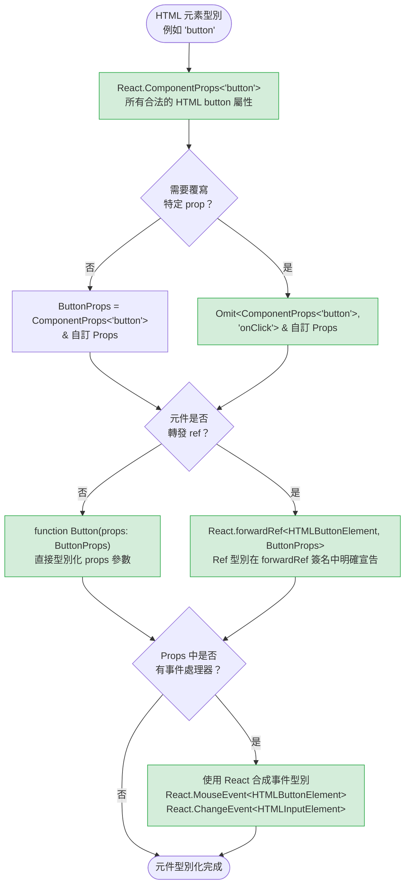

# TypeScript 與 React

TypeScript 與 React 的組合效果良好，原因在於 React 的元件模型與 TypeScript 的結構型別系統天然對應。一個元件就是從 props 到 JSX 的函式，而函式型別正是 TypeScript 最擅長處理的事物。結合兩者時遇到的實際問題是具體而明確的：如何型別化事件處理器、如何型別化 ref、如何型別化泛型元件、如何型別化 children。每個問題都有一個比使用 `any` 或憑感覺猜測更精確的 TypeScript 慣用寫法，而每個慣用寫法背後都有值得理解、而非單純記憶的原理。把這些慣用寫法做對，意味著編譯器能夠捕捉到真正重要的錯誤 — 附加到錯誤元素型別的 ref、接收到錯誤事件的處理器、默默丟棄呼叫方預期傳遞屬性的包裝元件。

React TypeScript 支援的歷史留下了一些曾出現在教學文件和官方文件中、但現在已不再被推薦的寫法。`React.FC` — 函式元件的型別標注 — 在 React 18 型別定義改變 `children` 的隱式行為之前，一直是推薦的元件型別化方式。在那個時期學習 React TypeScript 的工程師因習慣而延續了這個寫法；讀到舊程式碼的工程師則以為它仍然是被推薦的做法。理解為什麼現在不鼓勵使用 `React.FC`，以及應該用什麼來替代它，是邁向慣用 React TypeScript 的第一步。這個教訓可以泛化：React TypeScript 演進迅速，2019 年正確的寫法在 2024 年可能會產生誤導。

包裝元件（wrapper component）— 將 HTML 元素封裝並附加額外行為或樣式的元件 — 帶來了反覆出現的 prop 型別化挑戰。一個封裝 `<button>` 的 `<Button>` 元件應該接受所有合法的 HTML button 屬性，而不只是作者記得列出的那幾個。TypeScript 提供了直接從 HTML 元素型別派生這些型別的工具，其結果比手動列舉屬性更完整、維護成本更低。同樣的工具也支援覆寫特定屬性，允許包裝元件用更豐富的應用層型別取代標準屬性的型別。最終的元件介面同時具備完整性、精確性，且免除了持續追蹤 HTML 規格的維護負擔。

Ref 帶來了第三種不同的型別化需求，泛型元件則帶來了第四個。`useRef` 有兩個根據初始值產生不同型別的簽名，選錯簽名是 React 程式碼中最常見的 TypeScript 錯誤來源之一。泛型元件則需要一個從輸入資料流向渲染輸出的型別參數；`<Select<User>>` 或 `<List<Product>>` 必須是純粹的泛型函式，而非以 `React.FC` 包裝的元件，因為 TypeScript 的泛型函式語法是唯一支援此需求的工具。理解 ref 型別模型與泛型函式模型，能一次解決靠試誤才能繞過的整類錯誤。

## 原則

工程師**禁止（MUST NOT）**使用 `React.FC` 標注函式元件。這個標注相比直接型別化 props 參數並不帶來任何型別安全效益，在 React 18 之前的版本中隱式地將 `children` 加入 props（這個行為已被 React 18 型別移除），妨礙元件被型別化為泛型，並引入一層令元件型別簽名更難閱讀的間接性。正確的標注方式是直接型別化函式的 props 參數本身：`function MyComponent({ name }: MyComponentProps)`。當元件需要接受 `children` 時，**必須（MUST）**在 props 介面中顯式宣告 `children: React.ReactNode`，而非依賴任何標注來隱式包含它。

工程師**必須（MUST）**使用 React 的合成事件（synthetic event）型別 — `React.ChangeEvent<T>`、`React.MouseEvent<T>`、`React.FormEvent<T>` — 來標注 React 事件處理器 prop，而非使用原生 DOM 事件型別。合成事件型別模擬了 React 的跨瀏覽器事件抽象；原生 DOM 型別反映的是瀏覽器特定的實作，與 React 傳給處理器的事件在結構上不同。使用原生事件型別不是在 JSX 層級產生型別錯誤，就是會以偏離執行時行為的方式靜默縮窄處理器的契約。當封裝原生 HTML 元素時，元件**應該（SHOULD）**使用 `React.ComponentProps<'element'>` 派生其 prop 型別，而非手動列舉 HTML 屬性。工程師**必須（MUST）**在任何將被附加到 DOM 元素的 ref 上使用帶有明確元素型別和 `null` 初始值的 `useRef<T>(null)`；省略 `null` 初始值會將回傳的 ref 型別從 `React.RefObject<T>` 改為 `React.MutableRefObject<T | undefined>`，與 JSX 元素上的 `ref` prop 不相容。

泛型元件**禁止（MUST NOT）**使用 `React.FC` 標注，且**必須（MUST）**將泛型參數宣告在函式關鍵字上。在 TSX 檔案中，泛型元件應使用 `<T,>`（後置逗號）語法消除與 JSX 開頭標籤的語法歧義；當限制條件本身帶有消歧以外的語意含義時，才使用 `<T extends SomeType>`。

## 設計思維

### 避免使用 React.FC

`React.FC` 大約從 React 16 到早期 React 17 時代是函式元件的推薦標注方式。這個型別在 React 型別套件中被定義為泛型函式型別：`React.FC<Props>` 等同於 `(props: Props & { children?: ReactNode }) => ReactElement | null`。隱式加入 `children` 是設計特性，而非副作用 — 原意是讓每個元件都能不需顯式宣告就接受 children。

這個設計在大規模使用時暴露出問題。首先，隱式的 `children` prop 代表不打算接受 children 的元件 — 例如顯示數字的 `<Badge>` — 會默默地從呼叫方接受 children 而不產生型別錯誤。由於該 prop 是可選的，傳入不預期的 children 不會失敗，即使元件的渲染邏輯根本不使用它們。想透過型別標注表達「此元件不接受 children」的限制，用 `React.FC` 是做不到的。

其次，`React.FC` 妨礙元件被型別化為泛型函式。接受泛型 `items` prop 的元件 — `function List<T>({ items, renderItem }: ListProps<T>)` — 無法被標注為 `React.FC<ListProps<T>>`，因為元件函式上的泛型參數與 `React.FC` 上的泛型參數指涉不同的事物。這兩種標注方式在結構上不相容，因此只要需要泛型元件，工程師就必須放棄 `React.FC`。

第三，React 18 型別定義從 `React.FC` 的隱式 props 中移除了 `children`，打破了原本的設計初衷。React 團隊在 React 18 遷移指南中明確不再推薦使用 `React.FC`。依賴隱式 `children` 的程式碼需要顯式地在 props 介面中加入 `children: React.ReactNode` — 這正是直接型別化 props 參數時所要求的做法，而且比依賴包裝型別的隱式添加更清晰。

現代慣用寫法是將 props 型別定義為介面或型別別名，並直接標注函式的參數。回傳型別可以留給推論，或在需要明確性時標注為 `JSX.Element`。元件的型別簽名因此如實呈現：一個從特定 props 型別到 JSX 的函式，沒有任何包裝型別添加隱藏行為。

Props 介面在命名上慣例為元件名稱加 `Props` 後綴：`Button` 對應 `ButtonProps`，`SearchInput` 對應 `SearchInputProps`。使用型別別名也可以，但介面通常更受青睞，因為介面錯誤以介面名稱呈現，而非展開的結構表示，讓編譯器錯誤訊息更易閱讀。在 `type` 和 `interface` 之間的選擇是團隊慣例決策，而非正確性問題；重要的是標注出現在 props 參數上，而非作為包裝函式型別的外層。將 props 介面與元件一同匯出，適用於呼叫方需要引用 props 型別的情況 — 例如測試、派生元件，或建構包裝原始元件的高階元件。

### 從 HTML 元素派生元件屬性型別（component prop types）

封裝 `<button>` 的包裝元件應該接受所有合法的 HTML `<button>` 屬性加上自己的自訂 prop。最直觀的做法是列舉作者預期呼叫方會用到的屬性：`className`、`disabled`、`type`、`onClick`、`aria-label`。這份清單永遠是不完整的 — 呼叫方遲早會遇到某個他們需要卻清單上沒有的屬性，進而要求修改元件介面。手動列舉 HTML 屬性是個隨元件使用時間增長、越來越多呼叫方發現更多邊界情況而不斷惡化的維護問題。

`React.ComponentProps<'button'>` 提供了 React 型別定義中所有合法 HTML button 屬性的完整集合。它包含能出現在 `<button>` 元素上的每一個屬性，包括 ARIA 屬性、data 屬性和事件處理器。以它作為包裝元件 prop 型別的基礎，確保呼叫方擁有完整的 HTML 介面，無需任何列舉工作，也無需維護屬性清單。

包裝元件的實際慣用模式是用交集型別展開 `React.ComponentProps<'button'>`：`type ButtonProps = React.ComponentProps<'button'> & { variant: 'primary' | 'secondary' }`。交集型別在完整 HTML 介面之上添加元件的自訂 prop。當元件需要以不同型別覆寫既有的 HTML 屬性時 — 例如將標準的 `onClick: React.MouseEventHandler<HTMLButtonElement>` 替換為應用層的 `onClick: (id: string) => void` — `Omit` 工具型別可在交集之前移除原始屬性：`Omit<React.ComponentProps<'button'>, 'onClick'> & { onClick: (id: string) => void }`。

`React.ComponentPropsWithRef<'button'>` 和 `React.ComponentPropsWithoutRef<'button'>` 是明確包含或排除 `ref` prop 的變體。當包裝元件使用 `forwardRef` 轉發 ref 時，props 型別**應該（SHOULD）**使用 `ComponentPropsWithoutRef`，以避免在 props 和 `forwardRef` 泛型簽名中重複定義 ref。當包裝元件不轉發 ref 時，這個差異不影響功能，但明確使用 `ComponentPropsWithoutRef` 是一種文件化：它傳達了此元件不轉發 ref 的意圖。

`React.ComponentProps` 派生型別的另一個好處是無障礙性。由於完整的 ARIA 屬性集合已包含其中 — `aria-label`、`aria-describedby`、`aria-expanded`、`role` 及其他 — 無障礙的包裝元件無需為無障礙屬性特別處理。從 `ComponentProps<'button'>` 派生的設計系統 `Button` 自動接受 `aria-label`，無需額外宣告。透過列舉屬性建立包裝元件的團隊，往往在無障礙審計中才發現缺少的 ARIA 支援，而非在元件撰寫時就發現，這個回饋迴路慢得多也代價更高。

值得說明 `React.ComponentProps<'element'>` 包含什麼、不包含什麼。它包含 React 的 JSX 型別定義所認識的所有 HTML 屬性，這與 HTML 規格高度一致。它不包含 React 內部 props，如 `key` 和 `ref`，除非使用 `WithRef` 變體。`key` prop 被刻意從元件 prop 型別中排除，因為它由 React 的協調演算法管理，而非由元件本身管理。

### 正確型別化 ref

TypeScript 中的 `useRef` 有兩個截然不同的簽名，根據初始值產生不同結構的型別。第一個簽名 `useRef<T>(initialValue: T)` 回傳 `React.MutableRefObject<T>` — 一個 `.current` 屬性可寫且型別為 `T` 的 ref。這是用於儲存由應用程式程式碼管理的可變值（例如計時器 ID 或動畫幀控制碼）的正確簽名。第二個簽名 `useRef<T>(null)` 回傳 `React.RefObject<T>` — 一個 `.current` 屬性型別為 `T | null` 且從 TypeScript 角度而言是唯讀的 ref，因為 React 本身會在元素掛載時將 DOM 節點指派給 `.current`。

使用錯誤簽名的後果是在 ref 被附加到 JSX 元素時產生型別錯誤。React 的 JSX 型別定義在 DOM 元素的 `ref` prop 上預期 `React.RefObject<HTMLElement>`（唯讀變體）。將 `React.MutableRefObject<HTMLInputElement>` 傳給 `ref` prop 會產生型別錯誤，因為可變變體的型別無法指派給 DOM ref 插槽 — 可寫的 `.current` 與 React 期望由它自己控制指派的假設相衝突。解法永遠是使用 `useRef<HTMLInputElement>(null)`，搭配特定元素型別和 `null` 初始值。

特定元素型別的重要性與在其他地方選擇正確 HTML 元素型別的重要性相同：`HTMLElement` 對大多數使用情境而言過於寬泛。型別為 `HTMLElement` 的 input ref 會失去 input 特有的 API — `ref.current.value`、`ref.current.focus()`、`ref.current.select()` — 而這些正是建立 ref 的主要原因。`HTMLInputElement`、`HTMLButtonElement`、`HTMLDivElement` 及其兄弟型別才是對應 HTML 元素的正確型別。TypeScript 的 DOM 型別定義準確地模擬了這些關係，包括透過原型鏈形成的繼承關係，因此將 `HTMLInputElement` ref 附加到 `<input>` 元素能通過型別檢查，因為 `HTMLInputElement` 是 `HTMLElement` 的子型別。

轉發 ref（forwarding ref）引入了第三個考量：ref 型別必須在 `forwardRef` 的泛型簽名中宣告，且必須與 ref 將被附加的 DOM 元素型別相符。`React.forwardRef<HTMLButtonElement, ButtonProps>` 宣告此元件轉發型別為 `HTMLButtonElement` 的 ref。呼叫方在將 ref 附加到轉發元件時，會收到 `React.RefObject<HTMLButtonElement>`，並以完整型別安全存取 button 特有的 DOM API。

DOM ref 模型的一個實際影響是 `useImperativeHandle` 與 ref 型別的互動。當元件使用 `useImperativeHandle` 暴露自訂控制代碼而非原始 DOM 節點時，`forwardRef` 的泛型型別參數應反映控制代碼的形狀，而非 DOM 元素型別。例如，若元件透過 `useImperativeHandle` 暴露 `{ focus(): void; reset(): void }`，`forwardRef` 簽名則變為 `React.forwardRef<{ focus(): void; reset(): void }, Props>`。這是一個重要的區別：`forwardRef` 泛型中宣告的 ref 型別，是父元件讀取 ref 的 `.current` 時所收到的型別，不一定是底層 DOM 元素型別。

### 泛型元件（generic component）

某些元件天生就是泛型的：渲染任意項目陣列的 `List` 元件、能與任意值型別配合使用的 `Select`，或對任意行形狀操作的 `Table`。這些元件無法以固定的 props 型別標注，因為項目型別隨每次使用而異。TypeScript 透過元件本身的泛型函式語法支援這種情況：`function List<T>({ items, renderItem }: ListProps<T>)`，其中 `ListProps<T>` 定義為 `{ items: T[]; renderItem: (item: T, index: number) => React.ReactNode }`。

關鍵限制是泛型元件無法以 `React.FC` 標注，如前所述。它們必須是純粹的泛型函式，泛型參數出現在 `function` 關鍵字上，而非包裝型別上。這是 React 社群逐漸遠離 `React.FC` 的最實際原因之一：一旦元件需要成為泛型，該寫法就無法使用，而這在可重用元件庫中是常見需求。

在 TSX 檔案中存在語法歧義：`<T>` 在泛型型別參數開頭看起來像 JSX 元素的開頭標籤。TypeScript 透過要求後置逗號或限制條件來解決此歧義：`<T,>` 或 `<T extends object>`。後置逗號形式 `<T,>` 是 TSX 泛型元件的慣用寫法，受 TypeScript 和所有主流格式化工具支援。`<T extends unknown>` 在消歧上等同於後置逗號，但 `<T extends object>` 攜帶語意含義（T 必須是物件型別），這可能不符合元件的實際需求。當使用限制條件的唯一原因是消歧時，使用 `<T,>`。

泛型元件也能與 `forwardRef` 搭配使用，雖然組合起來稍嫌冗長。由於 `forwardRef` 在呼叫位置接受泛型引數（`React.forwardRef<Ref, Props>`），而 props 型別本身也是泛型，轉發元件的型別必須宣告為一個在呼叫 `forwardRef` 時實例化適當型別的泛型函式。一種做法是用 `as` 將 `forwardRef` 的回傳值轉型為泛型函式型別，讓呼叫方在 JSX 呼叫位置傳入型別引數。這是進階模式，通常只在設計系統的基礎元件需要同時支援轉發 ref 和泛型時才需要 — 大多數應用層元件不需要同時組合這兩者。

### 明確型別化 children

移除 `React.FC` 後，`children` 必須在 props 介面中顯式宣告，前提是元件確實接受它們。能接受任意 React 可渲染內容的 children 正確型別是 `React.ReactNode`，它包含字串、數字、JSX 元素、陣列、Fragment、Portal，以及 `null` 或 `undefined`。這是最寬泛的 children 型別，適用於版面元件、容器，以及任何對 children 形狀沒有限制的元件。

當 children 必須是特定形狀時 — 單一元素、函式，或特定元件型別 — 可使用更精確的型別。`React.ReactElement`（非 `ReactNode`）代表單一 JSX 元素，排除字串、數字和其他原始值。Render prop 模式使用 `children: (item: T) => React.ReactNode`，TypeScript 將其型別化為接受值並回傳可渲染內容的函式。這些更具體的型別只有在元件確實對渲染內容有限制時才有效益；若元件實際上會渲染任意 children，卻使用 `ReactElement` 而非 `ReactNode` 以求「更精確」，反而是一種過度型別化，會破壞傳入字串 children 或陣列的呼叫方。

關鍵規則是元件的實作決定正確的型別。若元件呼叫 `React.Children.map(children, fn)` 或將 children 包裝在容器中，`ReactNode` 是正確的。若元件將 `children(item)` 作為函式呼叫，`(item: T) => ReactNode` 是正確的。若元件直接將 children 傳給單一根元素而不做處理，`ReactNode` 也是正確的，因為該元素接受 `ReactNode`。

另一個值得了解的 children 寫法是 `React.PropsWithChildren<Props>` — 一個將 `children?: React.ReactNode` 加入既有 props 型別的工具型別。它是 `React.FC` 過去隱式執行的事情的顯式選擇版本。有些團隊傾向這種形式，而非在每個介面中手動加入 `children: React.ReactNode`，因為它一致且型別名稱本身就清楚表達了意圖。

## 最佳實踐

**禁止（MUST NOT）使用 `React.FC` 標注元件型別。** `React.FC` 隱式地將 `children` 加入 props — 這是 React 18 之前的模式，已從推薦實踐中移除，且會導致元件默默地接受它們不會渲染的 children。它也妨礙元件被型別化為泛型函式，這對可重用元件是一個重大限制。請直接型別化元件的 props 參數：`function MyComponent({ name }: MyComponentProps)`。這個模式明確、易讀、適用於泛型元件，且不含任何隱藏行為。

**必須（MUST）使用 React 的合成事件（synthetic event）型別而非原生 DOM 事件型別來標注事件處理器 prop。** `React.ChangeEvent<HTMLInputElement>`、`React.MouseEvent<HTMLButtonElement>`、`React.FormEvent<HTMLFormElement>` 代表 React 的合成事件抽象，具有穩定的跨瀏覽器介面，且 `target` 型別被標注為觸發事件的特定元素。`Event` 和 `MouseEvent` 等原生 DOM 事件型別反映瀏覽器特定的實作，在結構上與 React 傳給處理器的事件不相容。使用原生型別不是需要型別轉換，就是會以偏離執行時行為的方式靜默縮窄處理器的型別契約。

**必須（MUST）在封裝原生 HTML 元素建立包裝元件時，使用 `React.ComponentProps<'element'>` 派生 prop 型別。** 手動列舉 HTML 屬性 — `className`、`disabled`、`aria-label`、`type` 等 — 會建立一份不完整且需要維護的清單，每當新屬性與呼叫方相關時就必須更新。`React.ComponentProps<'button'>` 包含元素所有合法屬性，包括 ARIA 屬性和事件處理器，並與 React 型別套件保持同步，無需任何手動維護。當自訂 prop 需要覆寫 HTML 屬性的型別時，在交集前使用 `Omit<React.ComponentProps<'element'>, 'propName'>` 移除原始屬性並加入覆寫型別。

**應該（SHOULD）在元件需要轉發 ref 時，為 `forwardRef` 明確指定泛型型別引數。** `React.forwardRef<HTMLButtonElement, ButtonProps>` 明確宣告 ref 型別，並向呼叫方傳達他們將存取的 DOM 元素確切型別。泛型引數的順序是元素型別在前、props 型別在後 — `<ElementType, PropsType>` — 這與 TypeScript 中大多數泛型型別的引數順序相反，值得特別留意以避免引數順序錯誤。當 props 型別使用 `React.ComponentPropsWithoutRef<'button'>` 時，將其與明確的 `forwardRef` 泛型結合，可確保 ref 只在 `forwardRef` 簽名中被型別化一次，而非在 props 介面中重複定義。

**應該（SHOULD）在元件渲染 children 時，在 props 介面中顯式宣告 `children: React.ReactNode`，而非依賴任何隱式包含。** 顯式宣告記錄了元件接受 children 的意圖，讓意圖可被搜尋，並保持 props 介面的完整。當元件不渲染 children 時，從 props 介面中省略 `children` 是一個有意義的限制：TypeScript 會標記將 children 傳給無法使用它們的元件的呼叫方，從而在設計系統的葉節點元件中捕捉複製貼上錯誤和誤用。

## 視覺呈現

以下圖表展示包裝元件的元件屬性型別（component prop types）模式。`React.ComponentProps<'button'>` 提供完整的 HTML 屬性介面；包裝元件將其與自訂 prop 進行交集，並在覆寫既有屬性時使用 `Omit`。`forwardRef` 變體在 props 旁邊添加了明確的 ref 型別。



圖表說明 `React.ComponentProps<'element'>` 是包裝元件 prop 型別化的入口。`Omit` 分支處理 HTML 屬性型別對包裝元件預期契約而言過於寬泛的情況 — 例如將 `onClick: React.MouseEventHandler<HTMLButtonElement>` 替換為應用層簽名。`forwardRef` 分支添加 ref 型別宣告，它應屬於 `forwardRef` 泛型簽名，而非 props 介面。

圖表的事件處理器檢查適用於 `forwardRef` 和非 `forwardRef` 路徑，因為合成事件型別的要求與元件是否轉發 ref 無關。有自訂 `onChange` 處理器的 `forwardRef` 元件，仍然需要為該處理器使用 `React.ChangeEvent<HTMLInputElement>`，原因與非轉發元件相同：React 傳給處理器的是合成事件，而非原生 DOM 事件。

## 範例

以下範例展示三種主要模式：使用 `React.ComponentProps` 的包裝元件、使用型別化 ref 和型別化 change 處理器的受控輸入元件，以及具有明確泛型型別引數的 `forwardRef` 元件。這些模式源自真實的設計系統和應用程式碼 — 每個模式都針對一個具體場景，在該場景中，直觀的做法（手動列舉 props、將 ref 型別化為 `any`、使用原生事件型別）雖然可以編譯，但會產生不正確或不完整的型別。

**模式一：使用 `React.ComponentProps` 和自訂 `onClick` 的 Button 包裝元件**

`Button` 元件封裝了原生 `<button>` 元素。它省略了標準的 `onClick` 屬性，並以需要字串 `id` 的應用層簽名取代。所有其他 HTML button 屬性 — `disabled`、`className`、`type`、`aria-*` 等 — 都可供呼叫方使用，因為基礎型別派生自 `React.ComponentProps<'button'>`，而非手寫清單。原生 `<button>` 上的 `...rest` 展開，讓所有未被解構識別的屬性都能傳遞至 DOM，這正是 `aria-label`、`data-testid`、`form` 等屬性無需明確轉發邏輯就能運作的原因。

```tsx
import React from 'react';

type ButtonProps = Omit<React.ComponentProps<'button'>, 'onClick'> & {
  id: string;
  variant?: 'primary' | 'secondary' | 'danger';
  onClick: (id: string) => void;
};

function Button({ id, variant = 'primary', onClick, children, ...rest }: ButtonProps) {
  return (
    <button
      {...rest}
      className={`btn btn--${variant}`}
      onClick={() => onClick(id)}
    >
      {children}
    </button>
  );
}

// 呼叫方用法：自訂 onClick 簽名受到強制型別檢查
// <Button id="submit-btn" onClick={(id) => handleClick(id)}>Submit</Button>
// <Button id="cancel-btn" disabled onClick={(id) => handleCancel(id)}>Cancel</Button>
//          ^^ `disabled` 可用，因為 ComponentProps<'button'> 包含了它
```

**模式二：具有型別化 ref 和型別化 change 處理器的受控輸入元件**

`SearchInput` 元件管理自己的 input ref，並對外暴露 `onSearch` 回呼。ref 以 `null` 初始化以產生 `React.RefObject<HTMLInputElement>`，當元素掛載時 React 會對其賦值。change 處理器使用 `React.ChangeEvent<HTMLInputElement>`，其 `event.target` 型別為 `HTMLInputElement`，可直接存取 `.value` 而無需型別轉換。`handleKeyDown` 處理器使用 `React.KeyboardEvent<HTMLInputElement>`，它型別化了鍵盤特有的事件屬性，包括 `event.key`、`event.code` 和修飾鍵布林值。

```tsx
import React, { useRef, useCallback } from 'react';

type SearchInputProps = {
  placeholder?: string;
  onSearch: (query: string) => void;
};

function SearchInput({ placeholder = '搜尋…', onSearch }: SearchInputProps) {
  // useRef<HTMLInputElement>(null) 回傳 React.RefObject<HTMLInputElement>
  // null 初始值是 DOM ref 的必要條件 — 它向 React 表明應在元素掛載時
  // 將 DOM 節點指派給 .current。
  const inputRef = useRef<HTMLInputElement>(null);

  const handleChange = useCallback(
    (event: React.ChangeEvent<HTMLInputElement>) => {
      // event.target 型別為 HTMLInputElement — 可直接存取 .value 而無需型別轉換
      onSearch(event.target.value);
    },
    [onSearch]
  );

  const handleKeyDown = (event: React.KeyboardEvent<HTMLInputElement>) => {
    if (event.key === 'Enter' && inputRef.current) {
      onSearch(inputRef.current.value);
      inputRef.current.blur();
    }
  };

  return (
    <input
      ref={inputRef}
      type="search"
      placeholder={placeholder}
      onChange={handleChange}
      onKeyDown={handleKeyDown}
    />
  );
}
```

**模式三：具有明確泛型型別引數的 `forwardRef`**

`FancyInput` 將其 ref 轉發給底層的 `<input>` 元素，讓父元件可以呼叫 DOM 節點上的 `.focus()` 或 `.select()`。`forwardRef` 的泛型引數將 `HTMLInputElement` 宣告為 ref 型別，`FancyInputProps` 為 props 型別。props 介面使用 `React.ComponentPropsWithoutRef<'input'>` 繼承所有 input 屬性，避免重複宣告 ref。注意 `forwardRef` 內部的函式表達式具名（`function FancyInput`）而非匿名 — 這讓元件在 React DevTools 和錯誤堆疊追蹤中有名稱，改善了除錯體驗。

```tsx
import React from 'react';

type FancyInputProps = React.ComponentPropsWithoutRef<'input'> & {
  label: string;
  error?: string;
};

// 泛型引數：<ref 元素型別, props 型別>
// ref 型別為 HTMLInputElement — 呼叫方會收到 React.RefObject<HTMLInputElement>
const FancyInput = React.forwardRef<HTMLInputElement, FancyInputProps>(
  function FancyInput({ label, error, ...inputProps }, ref) {
    return (
      <div className="field">
        <label className="field__label">{label}</label>
        <input
          {...inputProps}
          ref={ref}
          className={`field__input${error ? ' field__input--error' : ''}`}
          aria-invalid={error ? true : undefined}
          aria-describedby={error ? `${inputProps.id}-error` : undefined}
        />
        {error && (
          <span id={`${inputProps.id}-error`} className="field__error">
            {error}
          </span>
        )}
      </div>
    );
  }
);

// 呼叫方用法：ref 型別為 React.RefObject<HTMLInputElement>
// const inputRef = useRef<HTMLInputElement>(null);
// <FancyInput ref={inputRef} label="電子郵件" type="email" id="email" />
// inputRef.current?.focus();  — 可完整存取 HTMLInputElement API，具備型別安全
```

`FancyInput` 元件將 `...inputProps` 展開到 `<input>` 元素上，這意味著呼叫方傳入的每個屬性 — `type`、`id`、`autoComplete`、`disabled`、`required`、`maxLength` 以及任何其他合法 input 屬性 — 都會直接流入 DOM 元素，元件無需逐一中繼。這只有在 props 型別派生自 `React.ComponentPropsWithoutRef<'input'>` 而非手寫子集時才能實現。

三種模式並不互斥。設計系統的 `TextInput` 元件可能同時使用 `forwardRef`（支援父元件的焦點管理）、從 `ComponentPropsWithoutRef<'input'>` 派生 props（暴露完整 input 屬性介面）、以 `useRef<HTMLInputElement>(null)` 維護內部 ref（實作內部驗證邏輯），並使用 `React.ChangeEvent<HTMLInputElement>` 處理自身的 change 事件 — 這一切都在同一個元件中。每個慣用寫法處理不同的關切點，且因為都遵循 TypeScript 型別模型的一致性，可以乾淨地組合在一起。

React TypeScript 型別由 DefinitelyTyped 上的 `@types/react` 套件維護，並緊密追蹤 React 版本。保持 `@types/react` 與 `react` 版本同步非常重要：執行時 React 版本與型別定義之間的版本不符，會導致假型別錯誤或缺少已存在於執行時的 API 型別。升級 React 時（例如從 React 17 升級到 React 18），在同一步驟中升級 `@types/react` 並查閱型別變更日誌，能防止來自靜默隱式行為變更（如從 `React.FC` 移除隱式 `children`）的意外情況。

## 常見錯誤

**使用 `React.FC` 並預期它能阻止 children 被傳入。** 在 React 18 之前，`React.FC` 隱式地在元件的 props 中包含 `children?: ReactNode`，這意味著所有以 `React.FC` 標注的元件，無論是否設計為接受 children，都會默默地接受它。那些加入 `React.FC` 以阻止 children 的工程師 — 認為明確的型別標注會限制介面 — 發現結果恰恰相反。React 18 型別定義移除了隱式 `children` 之後，依賴 `React.FC<Props>` 的程式碼看到了隱式 `children` 消失所引發的型別錯誤。正確的做法一直是：元件接受 children 時才明確宣告，不接受時則不在介面中包含 `children`。

**呼叫 `useRef<HTMLInputElement>()` 時未傳入 `null` 作為初始值。** 不傳引數的 `useRef<T>()` 回傳 `React.MutableRefObject<T | undefined>` — 而非 DOM ref。將這個 ref 傳給 JSX 元素的 `ref` prop 時，TypeScript 會產生型別錯誤，因為 `MutableRefObject<T | undefined>` 無法指派給 `ref` prop 所預期的型別。工程師常見的解法是壓制錯誤或放寬泛型型別，但這兩種做法都遮蔽了真正的問題：`null` 初始值是區分 DOM ref 與可變值 ref 的關鍵訊號。`useRef<HTMLInputElement>(null)` 是任何將被附加到 DOM 元素的 ref 的正確形式。`null` 不是佔位符 — 它是 React 讀取的確切值，用以判斷應在元素掛載時填入 ref，並在卸載時清除。相關的錯誤變體是使用 `useRef<HTMLInputElement | null>(null)` — 在泛型型別參數中包含 `null` 而非僅透過初始值傳遞 `null`。這同樣會產生 `MutableRefObject<HTMLInputElement | null>` 而非 `RefObject<HTMLInputElement>`，並導致相同的型別指派錯誤。型別參數應單獨為 `HTMLInputElement`；可空性由多載選擇處理，而非泛型引數。

**將事件處理器參數型別標注為原生 DOM 事件型別而非 React 合成事件型別。** 將 React 事件處理器寫為 `(e: Event) => void` 或 `(e: MouseEvent) => void` 在某些設定下可能可以編譯，但會產生結構上不正確的型別。原生 DOM 事件和 React 合成事件（synthetic event）的形狀不同：合成事件封裝了原生事件並添加了 `nativeEvent` 屬性，標準化了跨瀏覽器差異，且 `target` 的型別是相對於處理器所附加的元素。使用原生事件型別意味著失去對 React 特有屬性的存取，得到不正確的 `event.target` 型別，並在將處理器傳給 React 的 JSX 事件 prop 時可能遇到型別錯誤 — 因為 React 的 JSX 定義預期合成事件型別，而非原生 DOM 型別。input 的 change 處理器正確型別為 `React.ChangeEvent<HTMLInputElement>`；button 的 click 處理器正確型別為 `React.MouseEvent<HTMLButtonElement>`。這個錯誤在將處理器提取為獨立函式並以引用方式使用時特別常見：內聯版本能型別檢查通過，因為 TypeScript 從 JSX 上下文推斷出正確的合成事件型別，但若提取後的版本沒有明確的標注，作者憑記憶寫下的參數型別可能不正確。

**將自訂 `onClick` 或回呼 prop 的型別過度寬化為 `any`。** 當包裝元件以自訂簽名替換 HTML 元素的 `onClick` 時，使用 `onClick?: (...args: any[]) => void` 能避免思考正確參數，卻也削弱了替換的目的。自訂回呼 prop 的存在是為了攜帶應用層資訊 — 實體 ID、選取狀態、表單值 — 且其型別應精確捕捉這些資訊。`onClick: (id: string) => void` 告知呼叫方他們將收到一個字串 ID；`onClick?: (...args: any[]) => void` 什麼都沒說明。撰寫 `(id: string) => void` 而非 `(...args: any[]) => void` 的 TypeScript 額外成本不過是幾個字元；效益是呼叫方獲得型別安全的契約，且編譯器能捕捉元件所傳內容與呼叫方所期望內容之間的任何不符。

## 相關 FEE

本文的 prop 型別化模式依賴 TypeScript 的工具型別（`Omit`、交集型別）以及結構型別系統對 HTML 元素屬性集合的建模能力。FEE-1703 深入介紹工具型別，包含 `Omit`、`Pick`、`Partial` 和 `Required`。FEE-1701 介紹結構型別以及 TypeScript 的型別推論與函式參數的互動，這正是直接型別化 props 參數之所以有效的機制。FEE-501 在 React 架構層面介紹元件組合模式，包含 render props 和複合元件，這些模式引入了額外的 TypeScript 型別化挑戰（作為函式的 children、元件 context 型別），是本文基礎模式的延伸。理解 FEE-1701 和 FEE-1703 所奠定的 TypeScript 基礎，是完整運用本文所有模式的前提。

- FEE-1701 — 型別系統基礎與型別推論
- FEE-1703 — 工具型別與型別操作
- FEE-501 — Component Composition Patterns

## 參考資料

React TypeScript Cheatsheet 是最全面的社群參考資料，涵蓋從基礎元件型別化到高階元件和 context 等進階模式的 React TypeScript 主題。React 官方文件的 TypeScript 指南反映了 React 團隊目前的建議，是諸如避免 `React.FC` 等模式的權威來源。TypeScript Handbook 的 JSX 章節介紹了 JSX 型別系統，包含 TypeScript 如何檢查 JSX 屬性，以及泛型元件如何在 TSX 檔案中運作。

追蹤跨 React 版本的破壞性型別變更，可查閱 DefinitelyTyped GitHub 儲存庫上的 `@types/react` 變更日誌，其中記錄了每個型別層面的變更，包括 React 18 從 `React.FC` 移除隱式 `children`。在 React 升級前花五分鐘查閱此日誌，能防止「之前可以編譯但現在不行」的意外情況。

- React TypeScript Cheatsheet — https://react-typescript-cheatsheet.netlify.app/
- React: Using TypeScript — https://react.dev/learn/typescript
- TypeScript Handbook: JSX — https://www.typescriptlang.org/docs/handbook/jsx.html
- DefinitelyTyped: @types/react changelog — https://github.com/DefinitelyTyped/DefinitelyTyped/blob/master/types/react/CHANGELOG.md

對於想深入了解 React 型別模型的讀者，`@types/react` 套件的原始碼本身也是重要的參考資料 — 直接查閱 `React.FC`、`React.ComponentProps`、`useRef` 的型別定義，往往比查閱二手文件更能清楚地解釋為什麼某個型別錯誤會發生。在編輯器中以「跳至定義」的方式查看這些型別的實際宣告，是加深理解最直接的方式。
