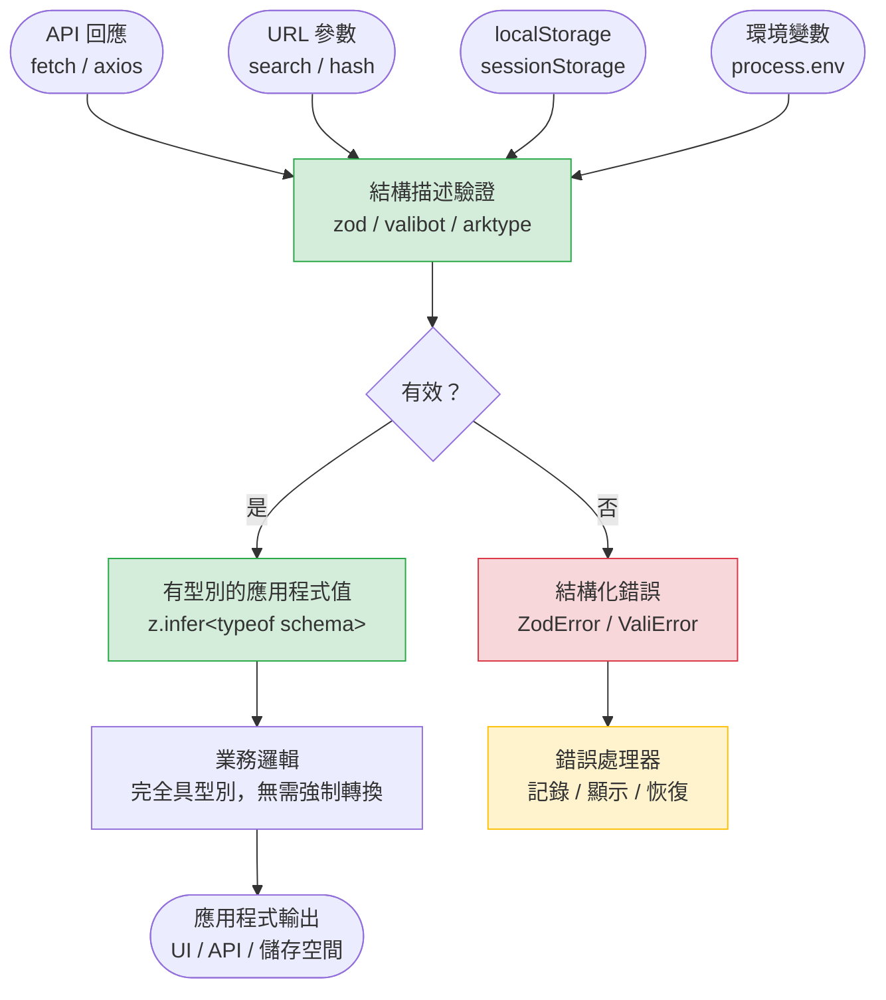

# 執行時期驗證與結構描述函式庫

TypeScript 的型別系統在編譯時期會被抹除。對 API 回應、URL 參數或 localStorage 值所加上的型別標註，是一種承諾，而非保證——它告訴 TypeScript 如何為該值定型，但並不驗證該值在執行時期是否真的符合那個型別。型別斷言（type assertion）（`as User`）不是驗證。它是開發者自行宣稱信任的主張。當這個主張是錯的，失敗是靜默的，直到存取了型別錯誤的屬性才會爆發。

TypeScript 的編譯時期保證與執行時期現實之間的落差，在系統邊界（system boundary）最為明顯：應用程式接收外部資料進入的邊緣地帶。API 回應來自獨立部署的伺服器。URL 查詢參數來自可以在瀏覽器中輸入任何內容的使用者。環境變數來自獨立維護的部署組態。localStorage 的值是由應用程式的舊版本所寫入的，可能在結構描述（schema）遷移之前，也可能是第三方擴充套件所寫入的。這些來源都沒有義務符合應用程式所預期的 TypeScript 型別。

結構描述函式庫的存在就是為了彌補這個落差。像 Zod、Valibot 或 ArkType 這類函式庫，可以在程式碼中定義值的形狀，在執行時期針對該形狀驗證未知輸入，並在驗證成功後產出具有型別的輸出值。這個定義是可執行的，而非裝飾性的。它在資料跨越邊界的那一刻執行——在應用程式處理值之前——只有在確認結構正確後，才會產出具有型別的結果。這就是將 TypeScript 靜態分析與外部資料混亂現實連結起來的機制。

結構描述函式庫的選擇，相對於「使用任何一個」這個實踐本身是次要的。沒有任何數量的型別標註能夠改變型別系統無法分析尚未存在之資料的事實——只有可執行的驗證程式碼才能填補這個落差。Zod 是 TypeScript 生態系中採用最廣泛的，擁有流暢的 API、強大的社群支援，以及廣泛的框架整合（React Hook Form、tRPC、Astro 等）。Valibot 以模組化設計優化打包體積，讓 tree-shaking 能夠消除未使用的驗證器。ArkType 提供以 TypeScript 語法為先的結構描述，具備提前型別推論能力。本文的範例使用 Zod，但原則同樣適用於其他函式庫——從結構描述推導型別、在邊界處驗證、明確處理失敗。無論選擇哪個函式庫，核心實踐都是相同的：讓結構描述成為資料形狀的唯一事實來源，在每個系統邊界處驗證，並將驗證失敗視為有型別的結果值而非隱式的例外。

## 設計思維

### 邊界問題

TypeScript 對專案內部撰寫的程式碼提供完整的型別安全。對於從外部進入專案的資料——API 回應、URL 查詢參數、localStorage、環境變數、使用者上傳的檔案——它不提供任何安全保護。這些就是需要執行時期驗證的邊界。

在專案邊界內，TypeScript 的保證是真實的。一個接受 `User` 參數的函式會收到一個 `User`，因為每個呼叫點在編譯時期都會被型別檢查。編譯器會追蹤每一個賦值、每一個函式呼叫、每一個回傳值，並確保整個程式碼庫中的型別是一致的。當 TypeScript 說一個值是 `User`，它已經驗證了每一條可能產生該值的程式碼路徑。

在邊界之外，TypeScript 看不見。一個型別標記為 `User` 的 API 回應，是由開發者的斷言所標記的，而非由編譯器對網路層的分析所標記。如果伺服器回傳 `{ id: "123", name: null }` 而型別宣告 `{ id: number; name: string }`，TypeScript 無法偵測到這個不匹配。fetch 呼叫成功，JSON 解析完成，型別斷言或強制轉換告訴 TypeScript 將結果視為 `User`，然後第一次存取 `user.name.toUpperCase()` 就會拋出一個本應被型別系統阻止的執行時期例外。

邊界問題不是 TypeScript 的限制——它是靜態分析與動態執行時期行為之間邊界的結構性特質。再多的型別標註也無法改變型別系統無法分析尚未存在的資料這個事實。唯一能彌補這個落差的工具就是執行時期驗證：在資料到達時執行的程式碼，在應用程式處理它之前確認形狀符合預期。

邊界是有限且眾所周知的。在一個典型的前端應用程式中，它們是：HTTP API 回應、GraphQL 回應、URL search params、hash params、localStorage 讀取、sessionStorage 讀取、環境變數、cookie 值、`postMessage` 訊息承載，以及使用者上傳的檔案內容。這些都在應用程式程式碼中有對應的位置——一個 `fetch` 封裝函式、一個 URL 解析工具、一個環境組態模組——驗證就應該在那裡進行。在邊界處驗證意味著應用程式的每一條進入路徑都受到覆蓋；在業務邏輯函式內部驗證意味著某些路徑不可避免地會被遺漏。

將驗證集中在邊界處，對測試也有正面影響。一個針對結構描述驗證其回應的 fetch 工具是可以單獨測試的：測試可以提供一個原始的 `unknown` 載荷，並驗證工具會產出正確的有型別結果或正確的錯誤。邊界下游的業務邏輯函式接收有型別的值，可以用有型別的測試固件進行測試，而不需要建構 `unknown` 載荷或模擬網路回應。

在朝向驗證方向遷移的程式碼庫中，一種常見的中間狀態是部分的邊界覆蓋：有些 API 回應已被驗證，有些則沒有。這種狀態比完全沒有覆蓋要好，但它會製造一種錯誤的安全感。假設所有回應都已被驗證的程式碼，會將未驗證回應的輸出視為可信的有型別值。最安全的遷移策略是：先識別所有邊界，全部加以驗證（即使是使用接受 `unknown` 並記錄不符之處的寬鬆結構描述），再隨著時間推移收緊結構描述。記錄不符之處而非拋出的寬鬆結構描述，是在承諾採用嚴格結構描述之前，收集 API 實際回傳內容資訊的低風險方式。

URL 參數驗證遵循與 API 回應驗證相同的模式。Web `URL` API 和 `URLSearchParams` 為每個參數提供原始字串；結構描述驗證參數值並將其強制轉換為預期的型別。一個預期 `?userId=123&tab=settings` 的頁面路由，應該驗證 `userId` 是一個可強制轉換為數字的數字字串（`z.coerce.number().int().positive()`），以及 `tab` 是允許的值之一（`z.enum(['settings', 'profile', 'billing'])`）。不驗證 URL 參數意味著精心設計的 URL 會產生未定義行為，而非清晰的錯誤。URL 參數邊界處的結構描述，也是使用 `.default()` 為可選參數定義預設值的自然位置。

### 結構描述作為唯一事實來源

像 Zod 這樣的結構描述函式庫，在一個地方定義資料的形狀，並從該結構描述推導出 TypeScript 型別（`z.infer<typeof schema>`）。結構描述既是驗證器（執行時期）也是型別（編譯時期）。在驗證函式旁邊另行維護一個獨立的 TypeScript 介面，會創造出兩個當結構描述變更時就會產生偏差的事實來源。

偏差問題是細微但持續的。開發者向 Zod 結構描述新增了一個新的必填欄位。型別 `z.infer<typeof userSchema>` 現在自動包含了新欄位。但如果在 `types.ts` 檔案中還有一個獨立宣告的 `interface User`，那個介面不會自動更新——它現在描述的是與結構描述不同的形狀。從 `types.ts` 匯入的應用程式程式碼，編譯時不會有錯誤。對結構描述的驗證開始拒絕之前能通過的資料。介面與結構描述之間的不匹配產生了令人困惑難以除錯的行為：程式碼看起來型別正確，但驗證在執行時期卻失敗了。

結構描述作為唯一事實來源的模式，消除了這一類的錯誤。如果程式碼庫中唯一的 `User` 型別是 `z.infer<typeof userSchema>`，每個消費者都會使用反映結構描述實際驗證內容的型別。向結構描述新增欄位，就會向型別新增欄位。讓結構描述中的欄位變為可選，就會讓型別中的欄位也變為可選。型別不會偏離結構描述，因為它不是一個獨立的宣告——它是結構描述定義的衍生結果。

這個模式也改善了結構描述變更的可讀性。一個向 Zod 結構描述新增欄位的 pull request，同時也是一個向型別、驗證以及所有下游型別檢查新增欄位的 pull request。審查者在一個地方看到單一的變更，TypeScript 的型別錯誤會引導作者找到每一個需要更新的下游呼叫點。另一種做法——獨立的結構描述和介面——要求作者找到並更新兩個宣告，並要求審查者確認它們是否一致。

採用結構描述作為唯一事實來源時，一個實際的考量點是可選欄位與可為 null 欄位的處理方式。Zod 區分了 `z.string().optional()`（欄位可以完全不存在於物件中，產生 `string | undefined`）、`z.string().nullable()`（欄位必須存在但其值可以是 `null`，產生 `string | null`）以及 `z.string().nullish()`（缺席或 null 皆可，產生 `string | null | undefined`）。這三種區分對應了 API 行為的真實差異，以及應用程式應如何處理該值。在結構描述中表達這些差異，意味著衍生的 TypeScript 型別承載了相同的區分：應用程式中型別為 `string | undefined` 的 `user.bio`，表示結構描述將其宣告為 `.optional()`；如果它的型別是 `string | null`，結構描述就使用 `.nullable()`。

在決定結構描述和其推導型別的命名與共置慣例上建立明確規範，可以防止每位工程師各自為政的混亂。推薦的模式是在同一個檔案中，緊接在結構描述之後宣告推導型別：`const entitySchema = z.object({ ... })` 與 `type Entity = z.infer<typeof entitySchema>` 共置同檔。這種共置讓讀者一眼就能看出兩者的關聯，並確保更新時必然同步進行。將推導型別放在獨立的 `types.ts` 檔案，重新引入了結構描述作為唯一事實來源所要消除的偏差風險，因為型別匯入可以獨立於結構描述被更新，反之亦然。
當結構描述被多個功能共用時，共置的結構描述與型別檔案應位於這些功能在專案目錄結構中的最近共同祖先，遵循共享元件和工具函式相同的鄰近性原則；不應將其集中放置在一個全域 `types` 目錄，因為這會使結構描述與使用它的功能之間的所有權關係變得模糊。
使用 ESLint 規則強制執行「`z.infer` 的使用必須與對應的結構描述宣告在同一個檔案或從同一個檔案匯入」的限制，可以在共置原則成為標準時，自動防止它在程式碼庫成長過程中瓦解。
將結構描述遷移作為 TypeScript 升級或 API 合約重審的附帶工作，而非獨立啟動，可降低引入這項實踐的摩擦：每次工程師接觸一個 API 呼叫點時，花幾分鐘將未驗證的型別斷言替換為結構描述解析，最終會以低摩擦的方式覆蓋整個程式碼庫的邊界，而無需一次性的大型遷移衝刺。
設定一個追蹤「有幾成 API 呼叫點在邊界處有結構描述驗證」的覆蓋率指標，並在每個 sprint 報告趨勢，可將邊界驗證遷移的進度可視化，讓工程師清楚知道目前的安全網覆蓋比例，並在新加入的 API 呼叫未驗證時收到提醒。
從結構描述驗證中捕獲的不符合規格的回應（`success: false` 分支），若以結構化格式記錄到可觀測性平台，可同時作為 API 合約文件的動態驗證：持續出現的結構描述驗證失敗，是 API 合約需要與後端團隊重新對齊的早期訊號，而非在前端出現執行時崩潰後才被察覺。

結構描述函式庫的組合能力也非常重要。一個 `UserProfile` 結構描述可以使用 `z.object({ address: addressSchema })` 嵌入一個 `UserAddress` 結構描述。衍生的 TypeScript 型別自然地將 `z.infer<typeof addressSchema>` 嵌套為 `address` 欄位的型別。這種組合是結構性的且型別安全的，而嵌套的結構描述也可以獨立重複使用。這種可組合性使得即使對於複雜的資料形狀，結構描述作為唯一事實來源也是實際可行的：這些結構描述是模組化的、可測試的，並且可以以與它們所產生的型別相同的方式重複使用。

### parse 與 safeParse

`parse` 在資料無效時拋出一個 `ZodError`。`safeParse` 回傳 `{ success: true, data: T } | { success: false, error: ZodError }`。在處理 API 回應或表單提交的應用程式程式碼中，`safeParse` 可與 TypeScript 的收窄整合：`success: true` 分支將 `data` 收窄為已驗證的型別。`parse` 變體適用於測試設定和初始化程式碼，在這些情況下失敗應該立即中止執行。

控制流程的差異，對錯誤如何在應用程式中傳播有重要影響。在資料獲取層使用 `parse` 意味著每個呼叫點要嘛用 try/catch 包裹解析，要嘛讓 `ZodError` 向上傳播到某個外部錯誤邊界。在規模化的情況下，兩種選項都不理想。try/catch 的做法會在每個 fetch 呼叫中產生重複的樣板程式碼。傳播的做法意味著結構描述驗證錯誤和網路錯誤由同一個錯誤邊界處理，這使得區分「伺服器回傳了錯誤回應」與「伺服器回傳了格式錯誤的成功回應」變得更加困難——這兩種情況應該觸發不同的恢復行為。

`safeParse` 回傳一個參與 TypeScript 差異化聯合收窄的值，而不需要例外。模式是：呼叫 `safeParse`，檢查 `result.success`，在 `false` 分支處理錯誤，並在 `true` 分支使用 `result.data`。`true` 分支的 `data` 屬性被收窄為結構描述的輸出型別；`false` 分支的 `error` 屬性是一個結構化的 `ZodError`，包含每個欄位的錯誤訊息，可以顯示、記錄，或映射到應用程式的錯誤狀態。這個模式是可組合的：一個回傳 `Promise<SafeParseReturnType<T>>` 的 fetch 工具，可以與 async/await 以及呼叫者偏好的任何錯誤處理模式組合，而不需要在每一層都強制使用 try/catch。

區分兩者的實用原則是：當驗證失敗應該崩潰或拋出時（初始化程式碼、測試固件、應該讓啟動失敗的組態載入），使用 `parse`；當失敗應該產生一個已處理的錯誤結果時，在所有地方使用 `safeParse`。在大多數應用程式執行時期的程式碼中——資料獲取、表單處理、URL 解析——`safeParse` 是正確的預設選擇。

Zod 也提供 `.safeParseAsync` 用於包含非同步精煉的結構描述——例如，針對資料庫檢查唯一性的驗證器，或是呼叫遠端服務的驗證器。非同步變體回傳 `Promise<SafeParseReturnType<T>>`，並遵循相同的差異化聯合模式。在 Node.js 環境或邊緣執行時期中執行的伺服器端程式碼，非同步結構描述精煉可用於將業務規則——「此使用者名稱必須是唯一的」——編碼為結構描述的一部分，而不是在成功解析後分散於各處的獨立驗證邏輯。

同步或非同步驗證的選擇屬於結構描述層，而非散落在各個呼叫點。無論是哪種方式，差異化聯合的回傳模式保持一致，呼叫者的錯誤處理程式碼不需要因此改變。這使得非同步精煉可以在不修改任何下游呼叫者的情況下被引入，只要整個程式碼庫都採用 `safeParse` 或 `safeParseAsync` 作為預設選擇。

`ZodError` 包含了 `safeParse` 使其易於存取的結構化資訊。`error.issues` 是一個 `ZodIssue` 物件的陣列，每個物件都有一個 `path`（從根到失敗欄位的欄位路徑）、一個 `code`（錯誤類型：`invalid_type`、`too_small`、`invalid_enum_value` 等），以及一個 `message`（可供人閱讀的描述）。這個結構可直接用於表單驗證錯誤顯示；`safeParse` 模式讓這個資訊在失敗分支中以有型別的值呈現，無需額外的型別斷言或收窄。

## 最佳實踐

**必須（MUST）在所有系統邊界處——API 回應、URL 參數、localStorage 值以及環境變數——使用結構描述函式庫進行驗證，再將資料視為已宣告的 TypeScript 型別。** TypeScript 型別在執行時期會被抹除。對 API 回應使用型別斷言（`as User`）並不會驗證回應——它只是壓制了 TypeScript 的警告，而執行時期的值可能有缺失的欄位、錯誤的型別，或在被存取時導致失敗的額外屬性。在邊界處進行驗證，是讓 TypeScript 靜態保證具有實際意義的機制。每一條外部資料進入應用程式的路徑都是一個邊界；覆蓋所有邊界意味著一旦一個值帶著型別進入應用程式，該型別就能準確描述該值。

**必須（MUST）使用函式庫的推論工具從結構描述推導 TypeScript 型別，而不是維護平行的宣告。** Zod 的 `z.infer<typeof schema>` 和 Valibot 的 `InferOutput<typeof schema>` 會產生一個與結構描述所驗證的內容完全一致的 TypeScript 型別。當結構描述變更時，型別會自動跟著變更。一個獨立維護的、複製了結構描述欄位的介面，會創造一個產生靜默偏差的維護義務：結構描述拒絕型別所接受的資料，或是新增到介面的欄位在邊界處未被驗證，讓無效的值以已宣告的型別靜默通過。結構描述是唯一事實來源；TypeScript 型別是其編譯時期的反映。

**應該（SHOULD）在處理外部來源資料的應用程式程式碼中，使用 `safeParse`（Zod）或等效的非拋出解析函式。** `parse` 在資料無效時拋出一個 `ZodError`，這要求在每個驗證呼叫點都有 try/catch。`safeParse` 回傳一個可與 TypeScript 控制流程收窄整合的差異化聯合結果——成功分支提供已驗證的有型別值；失敗分支提供結構化的錯誤。這個模式是可組合的，並且避免了基於例外的控制流程。失敗分支中的 `ZodError` 攜帶了每個欄位的錯誤路徑和訊息，可以被記錄、顯示給使用者，或映射到應用程式特定的錯誤狀態，比捕捉到的例外更具可操作性——例外的情境取決於 try/catch 在呼叫堆疊中的位置。

**應該（SHOULD）在應用程式啟動時使用結構描述驗證環境變數，而不是使用臨時性的 `process.env.VAR || 'default'` 模式。** 環境變數是字串。一個 API URL、一個連接埠號碼，以及一個功能標誌，無論其預期型別為何，都以字串的形式到達。啟動驗證結構描述（使用 Zod 或 t3-env）在啟動時強制轉換並驗證所有必填的環境變數，產生一個有型別的組態物件，並在必填變數缺失或格式錯誤時，在啟動時——在任何請求被處理之前——立即給出清晰的錯誤。`process.env.VAR || 'default'` 模式會隱藏缺失的組態，直到使用該變數的程式碼路徑被執行到；啟動時的結構描述則會在部署時立即浮現失敗，此時原因仍然顯而易見，且影響為零個已服務的請求。

## 視覺呈現

下圖展示了驗證邊界模型：從外部來源流入的資料，在被應用程式使用之前，必須通過結構描述驗證步驟。每個邊界處的失敗路徑會路由到明確的錯誤處理，而不是靜默地產生一個型別錯誤的值。結構描述驗證節點是所有外部資料來源的單一匯聚點——圖表中沒有任何一條繞過它的路徑。



圖表明確表達了結構性要點：從任何外部資料來源到應用程式業務邏輯，沒有任何繞過結構描述驗證步驟的路徑。進入應用程式業務邏輯的有型別值，不是一個被斷言的型別——它是成功解析的輸出。錯誤路徑路由到明確的處理器；它不會靜默地以型別錯誤的值繼續傳播。

所示的四個輸入來源是代表性的，而非詳盡的。WebSocket 訊息、`postMessage` 載荷、FileReader 結果和第三方 SDK 回調，都是遵循相同模型的額外邊界點。無論來源為何，驗證節點接受相同的結構描述函式庫機制。有型別的輸出是應用程式其餘部分所看到的；外部世界的原始 `unknown` 永遠不會進入業務邏輯層。

圖表的錯誤路徑也揭示了一個重要的設計決策：錯誤處理器應該根據錯誤類型做出不同的回應。網路失敗（連線中斷）、HTTP 錯誤（伺服器回傳 404 或 500）以及結構描述解析失敗（伺服器回傳格式不符的成功回應）是三種截然不同的情況，需要不同的恢復策略。圖表中的單一「錯誤處理器」節點，在應用程式實作中對應的是一個差異化聯合錯誤型別——如模式二所示——讓 TypeScript 的控制流程分析能夠在每個分支中提供正確的錯誤型別。

## 範例

以下三種模式各自對應一種主要的系統邊界型別，並展示了從結構描述定義到安全解析（safe parse）、再到型別收窄的完整流程。

以下範例展示了三種模式：一個帶有 `z.infer` 型別推導的 API 回應 Zod 結構描述、使用 `safeParse` 處理回應並展示差異化聯合收窄，以及使用 Zod 進行環境變數驗證。這些是覆蓋 TypeScript 前端應用程式中最常見驗證場景的生產品質模式。

**模式一：帶有推導 TypeScript 型別的 API 回應 Zod 結構描述**

`userSchema` 定義了使用者個人資料 API 回應的預期形狀。每個欄位都以其型別和任何精煉加以宣告——URL 使用 `z.string().url()`，受限字串使用 `z.enum([...])`，已驗證整數使用 `z.number().int().positive()`。TypeScript 型別 `User` 使用 `z.infer` 從結構描述推導；它沒有被獨立宣告。當 API 契約變更時，只有一個地方需要更新：結構描述。

```typescript
import { z } from 'zod';

export const userSchema = z.object({
  id: z.number().int().positive(),
  username: z.string().min(1).max(64),
  email: z.string().email(),
  role: z.enum(['admin', 'editor', 'viewer']),
  avatarUrl: z.string().url().nullable(),
  createdAt: z.string().datetime(),
  preferences: z.object({
    theme: z.enum(['light', 'dark', 'system']).default('system'),
    emailNotifications: z.boolean().default(true),
  }),
});

// TypeScript 型別從結構描述推導——無需獨立介面
export type User = z.infer<typeof userSchema>;

// 針對分頁列表端點，組合結構描述而非複製欄位
export const userListSchema = z.object({
  data: z.array(userSchema),
  total: z.number().int().nonnegative(),
  page: z.number().int().positive(),
  pageSize: z.number().int().positive(),
});

export type UserList = z.infer<typeof userListSchema>;
```

**模式二：在 fetch 工具中使用 `safeParse` 並進行差異化聯合收窄**

`fetchUser` 函式獲取使用者個人資料，並使用 `safeParse` 針對 `userSchema` 驗證回應。它回傳一個差異化聯合——一個 `Result<T, E>` 型別——呼叫者用型別守衛來收窄它。`loadUserProfile` 中的呼叫者在存取 `result.data` 之前檢查 `result.ok`；TypeScript 在 `true` 分支中將 `result.data` 收窄為 `User`，無需強制轉換。錯誤分支接收結構化的 `ZodError`，其中包含適合記錄或顯示的每個欄位訊息。

```typescript
import { z, ZodError } from 'zod';
import { userSchema, type User } from './schemas';

type Success<T> = { ok: true; data: T };
type Failure<E> = { ok: false; error: E };
type Result<T, E> = Success<T> | Failure<E>;

type FetchError =
  | { kind: 'network'; message: string }
  | { kind: 'http'; status: number }
  | { kind: 'parse'; error: ZodError };

async function fetchUser(id: number): Promise<Result<User, FetchError>> {
  let response: Response;
  try {
    response = await fetch(`/api/users/${id}`);
  } catch (err) {
    return { ok: false, error: { kind: 'network', message: String(err) } };
  }

  if (!response.ok) {
    return { ok: false, error: { kind: 'http', status: response.status } };
  }

  const json: unknown = await response.json();
  const parsed = userSchema.safeParse(json);

  if (!parsed.success) {
    // parsed.error 是 ZodError——包含結構化的每欄位錯誤資訊
    return { ok: false, error: { kind: 'parse', error: parsed.error } };
  }

  // parsed.data 是 User——由 success: true 分支收窄
  return { ok: true, data: parsed.data };
}

// 呼叫者：差異化聯合收窄，無需強制轉換
async function loadUserProfile(id: number): Promise<void> {
  const result = await fetchUser(id);

  if (!result.ok) {
    switch (result.error.kind) {
      case 'network':
        console.error('網路失敗:', result.error.message);
        break;
      case 'http':
        console.error('HTTP 錯誤:', result.error.status);
        break;
      case 'parse':
        // ZodError.issues 包含每個欄位的錯誤路徑和訊息
        console.error('結構描述不符:', result.error.error.issues);
        break;
    }
    return;
  }

  // TypeScript 知道 result.data 在此處是 User——無需斷言
  renderUserProfile(result.data);
}

declare function renderUserProfile(user: User): void;
```

**模式三：啟動時的環境變數驗證**

`envSchema` 在應用程式啟動時驗證所有必填的環境變數。型別強制轉換（`.url()`、`z.coerce.number()`、`z.enum([...])`）處理了環境變數永遠是字串這個事實。如果任何必填變數缺失或格式錯誤，`parse` 會在模組初始化期間——在任何請求被服務之前——立即拋出，並給出識別缺失變數的清晰錯誤訊息。匯出的 `env` 物件是完全有型別的；呼叫者以 `string`（而非 `string | undefined`）存取 `env.apiBaseUrl`，無需任何 null 檢查。

```typescript
import { z } from 'zod';

const envSchema = z.object({
  // NODE_ENV 是一個眾所周知的字串列舉
  NODE_ENV: z.enum(['development', 'test', 'production']).default('development'),

  // API 基礎 URL——必須是有效的 URL
  VITE_API_BASE_URL: z.string().url({
    message: 'VITE_API_BASE_URL 必須是有效的 URL（例如 https://api.example.com）',
  }),

  // 可選的 API 逾時（毫秒）——將字串強制轉換為數字
  VITE_API_TIMEOUT_MS: z.coerce.number().int().positive().default(10_000),

  // 功能標誌——將 '1' / 'true' 強制轉換為 boolean
  VITE_ENABLE_NEW_DASHBOARD: z
    .string()
    .transform((v) => v === '1' || v === 'true')
    .default('false'),
});

// 此處使用 parse（而非 safeParse）是正確的：啟動失敗應立即中止
// 並給出清晰的錯誤，而不是產生部分初始化的組態物件
export const env = envSchema.parse({
  NODE_ENV: process.env.NODE_ENV,
  VITE_API_BASE_URL: import.meta.env.VITE_API_BASE_URL,
  VITE_API_TIMEOUT_MS: import.meta.env.VITE_API_TIMEOUT_MS,
  VITE_ENABLE_NEW_DASHBOARD: import.meta.env.VITE_ENABLE_NEW_DASHBOARD,
});
```

這三種模式涵蓋了主要的邊界型別：外部 API 資料（模式一和二）以及部署組態（模式三）。模式二的 `Result<T, E>` 型別是一個通用的差異化聯合，可在整個程式碼庫的所有 fetch 工具中重複使用——它並非 Zod 特有。模式三刻意使用 `parse`，因為啟動時的環境組態失敗是一個硬性停止條件，應該立即產生清晰的錯誤。`parse` 與 `safeParse` 之間的差異不是風格選擇；它反映了關於失敗應如何在每個情境中傳播的刻意決策。

`ZodError` 中的 `issues` 陣列，是 `safeParse` 相比於帶有 try/catch 的 `parse` 最直接的實際優勢之一。每個 `ZodIssue` 都包含一個 `path`（從根到失敗欄位的欄位路徑）、一個 `code`（錯誤類型：`invalid_type`、`too_small`、`invalid_enum_value` 等），以及一個 `message`（可供人閱讀的描述）。這個結構可直接用於表單驗證錯誤顯示——依路徑映射 `error.issues` 會產生一個可應用於表單錯誤狀態的欄位到訊息字典。`safeParse` 模式讓這個結構在失敗分支中成為有型別的值，無需額外收窄或型別斷言即可使用。

## 常見錯誤

以下三種錯誤各自代表對結構描述驗證目的的不同誤解：第一種誤解了 TypeScript 型別斷言的作用；第二種低估了並行維護兩個宣告的維護成本；第三種以錯誤的工具解決了正確識別的問題（錯誤處理），導致整個程式碼庫出現不一致的模式。這些錯誤都不是顯而易見的；它們在程式碼審查中是常見的，因為症狀（執行時期錯誤、型別偏差）出現在距離根本原因（邊界的缺失驗證、並行宣告、例外驅動的解析）很遠的地方。

**當資料來自 API 時使用型別斷言而非驗證。** 在 `fetch` 呼叫之後寫下 `const user = data as User`，不是驗證——它是壓制。TypeScript 接受了這個斷言，並為所有下游程式碼將 `user` 標記為 `User` 型別。如果 API 回傳 `{ id: "abc", username: null }` 而型別宣告 `{ id: number; username: string }`，這個不匹配是不可見的，直到 `user.id.toFixed(2)` 或 `user.username.toUpperCase()` 在執行時期拋出。這個斷言繞過了型別系統偵測不匹配的能力；結構描述驗證步驟才是應該在 fetch 之後佔據的位置，而不是斷言。這個錯誤在使用泛型回傳型別 `Promise<T>` 的 `fetch` 封裝函式所撰寫的程式碼中特別常見——泛型在宣告點壓制了驗證的需求，每個呼叫者都繼承了這種錯誤的信心。

**在同一形狀旁邊，同時維護一個獨立的 TypeScript 介面和一個 Zod 結構描述。** 一個包含 `interface User { ... }` 的 `types/user.ts` 檔案，和一個包含 `const userSchema = z.object({ ... })` 的 `schemas/user.ts` 檔案，是同一份契約的兩種表示。當 API 新增一個必填欄位時，開發者更新結構描述（因為驗證失敗強迫如此），但可能會或可能不會記得更新介面。介面出現偏差。使用介面型別的程式碼通過了型別檢查，但執行時期已驗證的資料反映的是結構描述，而非介面。這個偏差產生了看似與型別不匹配無關的執行時期錯誤，因為型別本身並不是事實來源。修復方法是刪除該介面，並用 `z.infer<typeof userSchema>` 替換每個引用。

**在每個 fetch 呼叫點使用帶有 try/catch 的 `parse`，而非使用 `safeParse`。** 當程式碼庫使用 `parse` 進行 API 回應驗證時，每個呼叫點都需要一個 try/catch 來防止 `ZodError` 未被捕捉地傳播。從這種模式開始的團隊，會在數十個 fetch 函式中累積 try/catch 區塊，每個都有略微不同的錯誤處理：有些記錄並重新拋出，有些記錄並回傳 `null`，有些則完全吞掉錯誤。這種不一致性使得在整個應用程式中推理錯誤行為變得困難。`safeParse` 透過將錯誤變成值而非例外來解決這個問題。一個回傳 `Promise<Result<T, FetchError>>` 的單一 fetch 工具，標準化了整個程式碼庫的錯誤處理；呼叫者接收一個差異化聯合，並明確處理每種錯誤類型。失敗分支中的 `ZodError` 是一個包含結構化資訊的一等值，而不是逃逸到最近的 catch 邊界的例外。

## 相關 FEE

執行時期驗證是幾個其他 TypeScript 和 React 概念的交匯點。`unknown` 型別（FEE-1701）是任何未驗證值的正確輸入型別；型別收窄（FEE-1704）是 `safeParse` 的差異化聯合用來提供已驗證結果之有型別存取的機制。在表單情境中，結構描述驗證函式庫常與表單函式庫整合——這個交集在 FEE-1903 中介紹。補充已驗證非同步資料的錯誤和載入狀態模式，在 FEE-1807 中介紹。

- FEE-1701 — 型別系統基礎與型別推論
- FEE-1704 — 型別收窄與型別守衛
- FEE-1903 — Schema Validation (forms context)
- FEE-1807 — Error Handling & Loading States

## 參考資料

Zod 文件涵蓋了完整的結構描述 API：基本型別、物件、陣列、聯合、交集、轉換，以及 `safeParse` 和 `parse` 的區別。它包含了框架整合指南（Next.js、React Hook Form、tRPC）以及 `ZodError` 和其 `issues` 結構的 API 參考。閱讀錯誤格式化章節對於了解如何將每個欄位的錯誤映射到表單驗證 UI 特別有價值。

Valibot 文件解釋了函式庫的可 tree-shaking 模組設計，並為從 Zod 遷移的團隊提供了遷移指南。Valibot 的結構描述組合方式和基於管道的轉換，在結構上與 Zod 相似，但對於只使用部分驗證器的應用程式，能產生明顯更小的打包體積——對於效能敏感的瀏覽器打包值得評估。

t3-env 文件涵蓋了在 Next.js 和 Vite 專案中驗證環境變數的推薦模式。該函式庫建立在 Zod 之上，並新增了框架特定的整合，以區分伺服器端和客戶端的環境變數——這種分離防止了伺服器機密被意外暴露在瀏覽器打包中。

- Zod 文件 — https://zod.dev/
- Valibot 文件 — https://valibot.dev/
- t3-env（環境變數驗證）— https://env.t3.gg/
- TypeScript Handbook: The `unknown` type — https://www.typescriptlang.org/docs/handbook/2/functions.html#unknown
- Zod: ZodError 與錯誤格式化 — https://zod.dev/ERROR_HANDLING

TypeScript Handbook 關於 `unknown` 的章節，是理解為何 `unknown` 是未驗證外部資料的正確型別的有用背景知識。每個結構描述函式庫的 `parse` 和 `safeParse` 函式都接受 `unknown` 作為輸入，並在成功時回傳結構描述的輸出型別——這是從未驗證資料到已驗證資料之轉換的型別層次表示。了解 `unknown` 與型別收窄的關係，可以闡明為何 `safeParse` 的成功分支能夠在不使用強制轉換的情況下提供完全有型別的值。對於 t3-env，其文件同樣說明了如何在 monorepo 設定中共用環境變數結構描述，以及如何防止伺服器端變數洩漏至瀏覽器打包中——這對採用 Next.js 或類似框架的團隊尤其重要。
