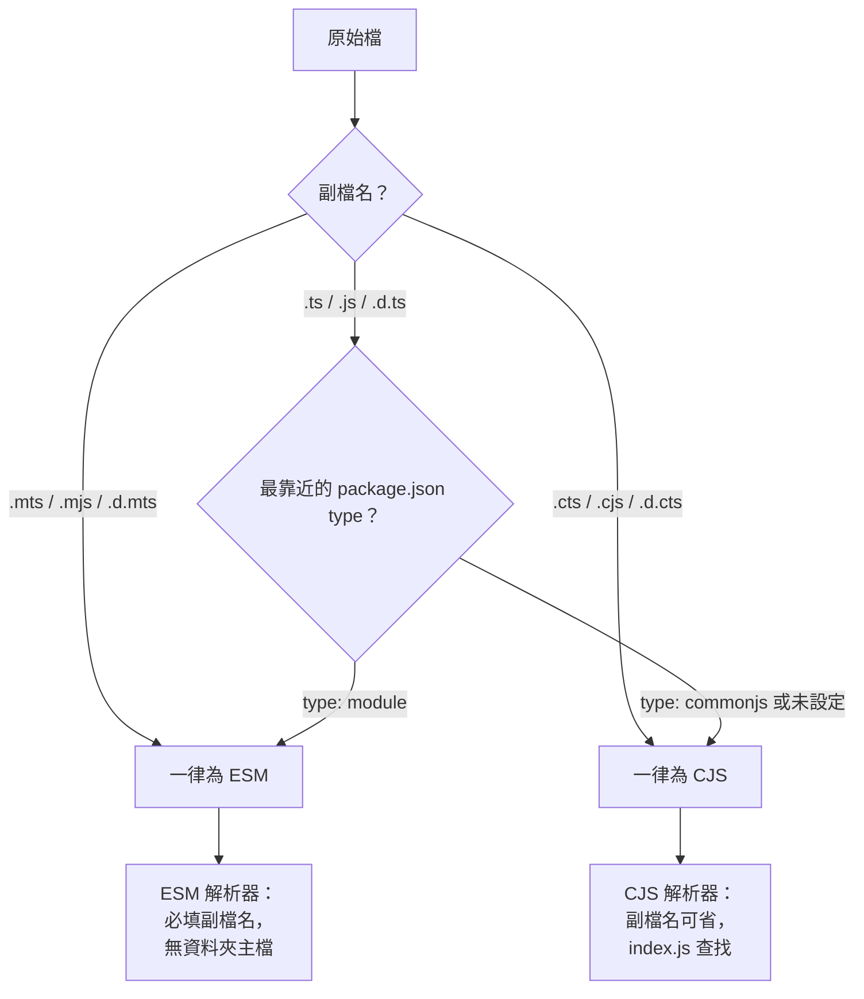

# [FEE-1714] Node.js ESM、`.mts`/`.cts` 與 `nodenext` 模組解析

:::info
Node.js 透過兩個訊號判斷 JavaScript 檔案屬於 ES module 還是 CommonJS：副檔名，以及最靠近的上層 `package.json` `"type"` 欄位。TypeScript 4.7 加入的 `.mts` 與 `.cts` 原始碼副檔名對應 Node 的 `.mjs`/`.cjs`，而 `node16`/`nodenext` 模組選項是唯一適合 Node.js v12 以上執行程式的模組選項。TypeScript 5.0 引入的 `bundler` 選項適合交給 bundler 處理的應用程式，但對於發佈到 npm 的函式庫並不合適。
:::

## 背景

Node 的模組系統將格式視為檔案的第一等屬性，並非執行期的推測。一個檔案若副檔名為 `.mjs`，或最靠近的上層 `package.json` 包含 `"type": "module"` 且副檔名為 `.js`，則屬於 ES module；否則屬於 CommonJS。Node 文件說明得相當直接：「作者可以透過 `.mjs` 副檔名、`package.json` `"type"` 欄位設為 `"module"`，或 `--input-type` 旗標設為 `"module"`，告訴 Node.js 將 JavaScript 解讀為 ES module。」而 `"type"` 欄位「定義 Node.js 對所有以該 `package.json` 為最靠近上層檔案的 `.js` 檔所使用的模組格式」。

ESM 解析器隨之引入 CommonJS 未有的規則。相對的 `import` 指定字「必須包含副檔名」，而「目錄索引（例如 `'./startup/index.js'`）也必須完整指定」。沒有跨副檔名的 Node 解析走訪，也沒有資料夾主檔查找。

TypeScript 4.7 讓撰寫模型對齊 Node 的執行模型，加入兩個原始碼副檔名：「`.mts` 與 `.cts`。當 TypeScript 將這些檔案 emit 為 JavaScript 時，會分別 emit 為 `.mjs` 與 `.cjs`。」同時也引入 `module: "node16"`（後續新增 `"nodenext"`），一種對齊 Node 自身解析器的編譯模式。在這些模式下，編譯器會依 Node 的規則判定每個檔案的格式，再 emit 適用該格式的語法。

## 視覺對比



| 輸入 | `node16`/`nodenext` 下的格式 | Emit 產出 |
| --- | --- | --- |
| `foo.mts` | ESM | `foo.mjs` |
| `foo.cts` | CJS | `foo.cjs` |
| `"type": "module"` 套件中的 `foo.ts` | ESM | `foo.js`（ESM） |
| `"type": "commonjs"` 套件中的 `foo.ts` | CJS | `foo.js`（CJS） |

## 範例

一個最小的雙格式套件。`exports` 欄位宣告單一進入點、兩份實作與共用的型別宣告。Node 會為 ESM 消費者選擇 `import` 條件、為 CJS 消費者選擇 `require`；TypeScript 在解析宣告時則優先讀取 `types` 條件。Node 文件表示 `types`「條件應該永遠排在最前面」。

```json
{
  "name": "shape",
  "version": "1.0.0",
  "type": "module",
  "exports": {
    ".": {
      "types": "./dist/index.d.ts",
      "import": "./dist/index.mjs",
      "require": "./dist/index.cjs"
    }
  }
}
```

原始碼使用對應的副檔名。`index.mts` emit 為 `index.mjs`；`index.cts` emit 為 `index.cjs`。TypeScript 4.7 的釋出說明直接描述了這組對應關係。

```ts
// src/index.mts
export function area(r: number): number {
  return Math.PI * r * r;
}
```

```ts
// src/index.cts
export function area(r: number): number {
  return Math.PI * r * r;
}
```

編譯後，`dist/index.mjs` 包含 `export function area`，`dist/index.cjs` 則包含 `exports.area = area`。package.json 的 `exports` 對應表會把每個消費者路由到正確的建置產物。

## 最佳實踐

- **MUST** 當輸出在 Node.js 中執行時，設定 `"module": "nodenext"`（或 `"node16"`）。TypeScript handbook 表示這些「是所有打算在 Node.js v12 或更新版本中執行的應用程式與函式庫**唯一正確的 `module` 選項**，無論是否使用 ES modules」。
- **MUST** 使用與目標格式相符的副檔名。在 `node16`/`nodenext` 下，「`.mts`/`.mjs`/`.d.mts` 檔案一律為 ES modules。`.cts`/`.cjs`/`.d.cts` 檔案一律為 CommonJS modules。`.ts`/`.tsx`/`.js`/`.jsx`/`.d.ts` 檔案若最靠近的上層 package.json 含有 `"type": "module"` 則為 ES modules，否則為 CommonJS modules」。
- **SHOULD NOT** 為發佈到 npm 的函式庫選擇 `"moduleResolution": "bundler"`。TypeScript 5.0 公告警告：「如果你撰寫的是要發佈到 npm 的函式庫，使用 bundler 選項可能會隱藏對於沒有使用 bundler 的使用者所產生的相容性問題。因此在這類情境下，使用 node16 或 nodenext 解析選項可能是較佳的路徑。」
- **SHOULD** 即使建置透過 bundler 完成，仍讓函式庫原始碼與 `nodenext` 相容。`"moduleResolution": "bundler"`「具有傳染性，會讓只能在 bundler 中運作的程式碼被產出」；在 `nodenext` 下合法的程式碼在 bundler 中仍然合法。
- **MAY** 對於透過 webpack、Vite、esbuild 或 Rollup bundle 的應用程式碼採用 `"moduleResolution": "bundler"`，此時可預期出現省略副檔名的 import 以及 bundler 專屬的 export 條件。

## 設計思維

兩項設計選擇解釋了 `nodenext` 的嚴格性。

第一，Node 的 ESM 解析器「沒有預設副檔名，也沒有資料夾主檔」。瀏覽器以 URL 載入 ES modules，而 URL 不會猜測。網頁上的 `./foo` 指定字嚴格解析為 `./foo`，不會解析為 `./foo.js` 或 `./foo/index.js`。Node 繼承此模型，使伺服器端撰寫的程式得以搬移到瀏覽器而無需改寫。代價是每個相對 import 都必須拼出副檔名，包含 `./startup/index.js`。

第二，TypeScript 必須為每個檔案推論其執行期格式，因為猜錯便無法挽回。Handbook 的理論章節直接說明：「若 TypeScript 將 `/example.js` emit 為包含 `import` 與 `export` 陳述式的檔案，Node.js 會在解析時 crash。若 TypeScript 將 `/main.mjs` emit 為包含 `require` 呼叫的檔案，Node.js 會在執行期 crash。」在較舊的 `module` 值下，編譯器無法看出檔案的執行期格式，因此設定錯誤的 `package.json` "type" 會靜默產出壞掉的建置。`nodenext` 透過讀取與 Node 相同的訊號──先副檔名、後 `package.json` `"type"`──彌補此缺口。

## 深入探討

**package.json 走訪。** TypeScript 4.7 部落格說明 `node16`/`nodenext` 在解析時實際上的行為：「當 TypeScript 找到 `.ts`、`.tsx`、`.js` 或 `.jsx` 檔案時，會向上走訪尋找 `package.json` 以判斷該檔案是否為 ES module，並據此決定：如何尋找該檔案所 import 的其他模組，以及在產生輸出時如何轉換該檔案。」走訪會停在第一個找到的 `package.json`，該檔設定了其下所有不明確副檔名的格式與解析器規則。

**隱式語法改寫。** 被歸類為 CJS 的檔案預設仍可使用 `import` 與 `export` 撰寫。Handbook：「被判定為 CommonJS 格式的 TypeScript 檔案預設仍可使用 `import` 與 `export` 語法，但 emit 出的 JavaScript 會改用 `require` 與 `module.exports`。」此行為在遷移時很方便，但也模糊了輸出樣貌。將 `verbatimModuleSyntax: true` 啟用便會停用此改寫；此時原始碼語法必須與 emit 格式完全對應。

**Masquerading（偽裝成 CJS/ESM）套件。** Are The Types Wrong 專案為常見失敗模式定義了兩個用語：「Masquerading as CJS……Masquerading as ESM……這些檢查專門適用於 `node10`、`node16` 與 `bundler` 模組解析模式。」當套件的型別宣告所標示的格式與實際出貨的 JavaScript 所出貨的格式不同時，該套件就「偽裝」了；舉例而言，`.d.ts` 描述具名匯出，但執行期檔案卻是 CommonJS `module.exports = ...`。在 `node16`/`nodenext` 下的消費者此時型別檢查通過、import 時 crash。在發佈前對 tarball 執行 Are The Types Wrong 可在發佈前攔截此錯配。

**雙套件風險。** 以單一套件名出貨兩種格式並非沒有代價。`dual-package-hazard` 說明表示：「雙套件風險發生於同時出貨 CJS 與 ESM 進入點的套件，使同一套件得以被載入兩次：一次經由 CJS 載入器，一次經由 ESM 載入器。」兩個實例代表兩份私有狀態：類別的 `instanceof` 失敗、singletons 分歧、registries 被切開。緩解方案包含讓套件保持無狀態、只匯出資料，或為需要 CJS 建置的消費者另外發佈獨立套件。

## 雙套件風險（Dual Package Hazard）

同時釋出 ESM 與 CJS 兩種進入點的套件，會讓使用者暴露於雙套件風險：同一個套件會被載入兩次——CJS loader 一次、ESM loader 一次——產生兩個彼此獨立的模組實體。GeoffreyBooth 的示範 repo 直接說明此失效模式：「The dual package hazard occurs in packages that ship both CJS and ESM entry points, allowing the same package to get loaded twice: once through the CJS loader and once through the ESM loader.」

常見症狀有兩個。首先，singleton 不再是 singleton：從套件匯出的 cache 或 registry，會在兩份 loader 的副本中各自持有狀態。其次，跨邊界的 `instanceof` 檢查會悄然失敗，因為兩份模組副本的 class identity 不同，即便這兩個 class「出自同一個套件」。

實務上有效的緩解方式：

- **能只釋出 ESM 就只釋出 ESM。** Node 20+ 消費者與所有現代 bundler 都能直接處理 ESM；保留 CJS fallback 多半是為了歷史相容，不是為了觸及率。
- **若必須雙釋出，將狀態集中到單一 CJS-only 或 ESM-only 的輔助套件。** 從 CJS 與 ESM 進入點共同 import 該輔助套件，使有狀態的模組僅被載入一次，不受外層套件由哪個 loader 解析影響。
- **嚴格使用 `exports` 條件欄位。** `package.json` 的 `"exports"` 欄位中，`"import"` 與 `"require"` 條件互斥。手寫繞過條件的 subpath import 會破壞原本的解析，可能引入錯誤副本。
- **切勿跨邊界暴露 class identity。** 若消費者需要 `instanceof` 檢查，改以品牌檢查函式（`isFoo(x)`）在單一模組副本中完成比較。

此風險本身並非 TypeScript 的問題——只要 Node runtime 同時支援兩種 loader 便會存在——但 TypeScript 的 emit 決策會決定每位消費者遇到的是哪個 loader，因此 `nodenext` 模組解析正是將問題在編譯期浮現的正確設定。

## 延伸閱讀

- [型別專用匯入與 `verbatimModuleSyntax`](/zh-tw/TypeScript/type-only-imports)
- [tsconfig 與 Strict Mode](/zh-tw/TypeScript/1706)
- [宣告檔與 DefinitelyTyped](/zh-tw/TypeScript/1705)

## 參考資料

- Node.js, "ECMAScript modules," Node.js Documentation. https://nodejs.org/api/esm.html
- Node.js, "Modules: Packages," Node.js Documentation. https://nodejs.org/api/packages.html
- Microsoft, "Announcing TypeScript 4.7," TypeScript Blog (2022). https://devblogs.microsoft.com/typescript/announcing-typescript-4-7/
- Microsoft, "Announcing TypeScript 5.0," TypeScript Blog (2023). https://devblogs.microsoft.com/typescript/announcing-typescript-5-0/
- Microsoft, "Modules Reference," TypeScript Handbook. https://www.typescriptlang.org/docs/handbook/modules/reference.html
- Microsoft, "Modules Theory," TypeScript Handbook. https://www.typescriptlang.org/docs/handbook/modules/theory.html
- Microsoft, "Choosing Compiler Options," TypeScript Handbook. https://www.typescriptlang.org/docs/handbook/modules/guides/choosing-compiler-options.html
- Andrew Branch et al., "Are The Types Wrong," GitHub. https://github.com/arethetypeswrong/arethetypeswrong.github.io
- Geoffrey Booth, "dual-package-hazard," GitHub. https://github.com/GeoffreyBooth/dual-package-hazard
