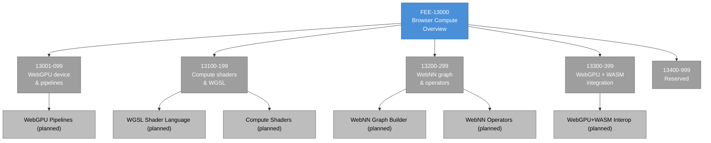

# [FEE-13000] 瀏覽器運算概覽

:::info
瀏覽器三十年來都是文件與 UI 的執行環境。WebGPU 與 WebNN 是把運算執行環境補在旁邊的規範，並且是每個瀏覽器 GPU 或 ML 工作負載今日建構於其上的 API 表面。
:::

:::warning Web Platform Proposals
10000-19999 範圍內的文章涵蓋尚未在所有主要瀏覽器中穩定的功能。當功能正式穩定後，文章將移至對應的 0-9999 分類。
:::

## 背景

兩個 W3C Community 與 Working Group 共享本分類。**GPU for the Web Community Group** 撰寫 WebGPU 規範；成員為瀏覽器引擎團隊、GPU 硬體廠商（NVIDIA、AMD、Intel）、以及行動裝置廠商（Apple、Google）。**Web Machine Learning Working Group** 撰寫 WebNN（Web Neural Network）規範，成員較偏向 ML，包含 Intel、Microsoft、以及學術實驗室。兩個群組都在 W3C 旗下運作，但節奏不同：GPU 群組自 2017 年起活躍，而 WebNN 群組成立於 2021 年，在其生命週期中較早。

**硬體異質性**是規範要解決的核心設計問題。瀏覽器執行於 Windows（原生 GPU API 是 Direct3D 12）、macOS 與 iOS（Metal）、Linux（Vulkan）、Android（Vulkan 或 iOS 上的 Metal）之上。一次撰寫的單一 shader 程式必須在這些平台上正確執行，並帶有可預測的效能特性與一致的行為。WebGPU 的解法是指定一個抽象的 device/pipeline 模型，讓每個瀏覽器引擎在原生 API 之上實作它，並以 **WGSL**（WebGPU Shading Language）作為跨平台 shader 語言，每個引擎將其翻譯為後端的原生 shader 格式（HLSL、MSL 或 SPIR-V）。

**WebGPU 的出貨現實**在撰文時跨引擎與跨平台分裂。規範於 2026 年初達到 Candidate Recommendation，並在多個引擎上出貨，但平台覆蓋度不同。Chromium 自 2023 年起在 Windows、macOS、Linux 桌面不帶 Flag 出貨 WebGPU；Safari 於 2025 年的一個釋出版在 macOS 出貨 WebGPU。Firefox 首先於 Windows（2025 年）出貨 WebGPU，非 Windows 平台隨後跟上。實務後果是 WebGPU 在大多數桌面 Chromium 與 Safari 配置、以及部分 Firefox 配置上是生產可用的 API，但今天撰寫代碼的開發者仍需檢查逐平台矩陣。

行動裝置支援是一個滯後於桌面的獨立維度。Android 上的 Chromium 在具相容 GPU 驅動的裝置上支援 WebGPU；iOS Safari 隨 2025 年的 iOS 釋出版出貨 WebGPU，但對較舊硬體有其自身的逐裝置 deny-list。Android 上的 Firefox 更晚。瞄準行動裝置受眾的團隊需要專門檢查行動裝置支援；桌面出貨不暗示行動裝置出貨，兩個支援矩陣沿不同時程演進。

**WebNN 的就緒狀態**比 WebGPU 早。規範在一段實質演進（加入 Transformer 模型支援、緩衝區共享的 MLTensor API、以及新的裝置選擇機制）後於 2026 年達到 Candidate Recommendation Draft。在規範層級，WebNN 尚未展示進入 Proposed Recommendation 前所需的兩個獨立可互通實作。Chromium 在 `WebMachineLearningNeuralNetwork` Flag 後出貨一個實作；Firefox 與 Safari 尚未出貨實作。今日的生產採用透過 WebGPU 或 WASM 執行環境進行，WebNN 被定位為一旦跨引擎出貨進展後的未來路徑。

WebGPU 與 WebNN 的關係對應原生平台的分工。在 Apple 硬體上，Metal 是圖形 API，MPS（Metal Performance Shaders）是建立於 Metal 之上的 ML 專注 Kernel 函式庫。在 NVIDIA 硬體上，CUDA 是通用運算 API，cuDNN 是建立於 CUDA 之上的 ML 專注 Kernel 函式庫。瀏覽器採用了相同分工：WebGPU 是可執行任意 shader 的底層運算 API，WebNN 是透過運算子介面瞄準平台 ML 加速器的高階 graph-builder API。想要通用 GPU 運算的團隊用 WebGPU；想要以最少工程努力做 ML 推論的團隊在 WebNN 出貨時用它。

WebGPU 與 WebNN 重疊之處是 WebNN 定義的運算子。WebNN 的 graph-builder API 暴露運算子（`conv2d`、`gemm`、`softmax`、`layernorm` 等），它們映射到平台上的 ML 調校 Kernel 實作。WebGPU 能透過自訂 compute shader 實作相同的運算子，但應用程式必須自行撰寫這些 shader。WebNN 的優勢是運算子實作經平台調校；劣勢是有限的運算子集合。完全映射到 WebNN 運算子目錄的模型受益於使用 WebNN；使用自訂運算子的模型無法使用 WebNN，必須回退到 WebGPU。

本分類的治理結構也與姊妹軌道不同。不像 TC39（有委員會全體會議流程）或 WHATWG（有 Steering Group），GPU for the Web CG 以活躍參與者共識模型運作。規範變更以 GitHub Pull Request 對 `gpuweb/gpuweb` 倉庫提出；核准需要多個參與組織簽署。結果是進展比 TC39 或 WHATWG 慢，但實作者對齊更緊密，因為每項變更在落地前都已被多個引擎團隊審閱。

取捨是非實作者貢獻在 GPU for the Web CG 比在某些其他標準組織更難。有特定 API 形狀使用案例需求的開發者，無法輕易在沒有實作者 Champion 的情況下推動規範變更。這不應該被視為流程缺陷——它是領域的結果：GPU API 深度糾纏於多數非實作者貢獻者看不到的硬體與驅動現實。實作者主導的治理與該技術現實對齊。

## 情境

一個團隊使用 `@xenova/transformers`（現稱 transformers.js）原型製作瀏覽器內大型語言模型推論。函式庫在載入時偵測可用的後端，選擇有 WebGPU 時用 WebGPU，沒有時回退到 WASM-SIMD。在搭載 Apple Silicon 的 macOS 上以 Chrome 執行時，原型以互動速度運作，WebGPU 底下使用 Metal。在同一台 macOS 機器上使用 Firefox 時，WebGPU 不可用（Firefox 在 macOS 上尚未出貨 WebGPU），因此函式庫回退到 WASM——以大約十分之一的吞吐量執行相同模型。在 Intel 筆電上，WebGPU 路徑在 Chrome 與 Edge 運作；Firefox 上該路徑在 Windows 運作但在 Linux 回退到 WASM。

團隊無法跨瀏覽器與平台承諾相同的體驗。決策矩陣是三維的（引擎 × 平台 × 功能可用性），每個格子有不同的成本輪廓。團隊有三個廣泛選項：出貨 WebGPU 路徑加上可量測較慢的 WASM fallback 給缺少 WebGPU 的配置、只出貨 WASM 路徑均一處理且錯過 WebGPU 可用處的效能勝利、或出貨兩條路徑加上執行期偵測並付出維護兩份實作的複雜度成本。本概覽為 WebGPU 或 WebNN 工作負載的任何決策形狀提供映射。

本空間的函式庫作者面對額外的顧慮。運算專注的函式庫（`transformers.js`、`onnxruntime-web`、`webgpu-utils`）必須假設使用者的環境是異質的；只為 WebGPU 可用環境出貨的函式庫會排除大部分潛在使用者。函式庫作者模式是執行期偵測加優雅降級：在載入時探測 WebGPU、探測特定所需功能（有些 shader 需要比其他更多能力）、在需要時回退到 CPU 或 WebGL。這比 JavaScript 函式庫「無條件出貨功能加 Polyfill」的模式更複雜，因為 WebGPU 與 WebGL 或 WASM 之間的效能懸崖夠陡峭，足以造成影響。

想出貨 WebGPU 渲染（與推論使用案例分開）的產品團隊有不同的計算。渲染使用案例比推論使用案例更能忍受 WebGL fallback，因為 WebGL 是具相當（雖然笨拙）能力的成熟圖形 API。WebGPU 渲染的 3D 場景常可以可管理的努力反向移植到 WebGL；WebGPU 加速的 ML 模型通常無法，因為 WebGL 的 compute shader 支援限於 fragment shader 技巧，不擴展到 Transformer 規模的模型。兩種使用案例的採用計算在 fallback 問題上分岔。

## 設計思維

### 為什麼運算需要自己的分類

在 WebGPU 之前，瀏覽器暴露圖形基本元素（2D canvas、WebGL），但不暴露通用運算基本元素。WebGL 是圖形 API；用它做運算代表把運算工作負載編碼到 vertex 與 fragment shader 中，讓引擎以圖形管線執行。這對某些情況可行——早期基於 WebGL 的神經網路示範就這樣做——但做法笨拙且低效率。GPU 的運算單元透過圖形管線排程，增加額外負擔；記憶體模型與運算工作負載格格不入；除錯需要把 fragment shader 輸出當作像素資料讀取。

WebGPU 是一級運算 API：它有與 render pipeline 分離的專屬 compute pipeline，WGSL 以原生概念支援 compute shader 並附帶適當的 workgroup 語意。圖形能力免費附帶，因為 render pipeline 是使用相同 device 抽象的獨立子系統。使用 WebGPU 做 ML 推論的團隊專用 compute pipeline；使用 WebGPU 做 3D 渲染的團隊使用 render pipeline；兩者都做的團隊透過同一個 `GPUDevice` 使用兩者。

**圖形（WebGPU）與 ML（WebNN）的分工對應原生 SDK 的分工。** Apple 出貨 Metal（圖形）與 MPS（建立於 Metal 之上的 ML 專注 Kernel）；NVIDIA 出貨 CUDA（通用運算）與 cuDNN（ML Kernel）；AMD 出貨 ROCm（運算）與 MIGraphX（ML）。瀏覽器採用了相同分工：WebGPU 是底層運算 API，WebNN 是透過運算子介面瞄準平台 ML 加速器的高階 graph-builder API。這個分工存在是因為手寫 shader 與廠商調校 ML Kernel 的效能特性對典型模型運算子而言相差一個量級；擁有兩個層讓開發者為使用案例選擇正確抽象。

WebGPU 的設計選擇也受**不能弄壞網路**約束塑形，該約束對運算 API 與 DOM API 的適用方式不同。運算 API 可以暴露在不同裝置間能力不同的 GPU 硬體（有些 GPU 缺少某些運算子、支援不同精度層級、或施加不同記憶體限制）。WebGPU 以 `GPUSupportedFeatures` 與 `GPUSupportedLimits` 回應——一組 Adapter 可能或不必廣告的選擇性功能，以及一組對緩衝區大小、workgroup 大小等的數值限制。想要可攜性的代碼在執行期檢查它們並優雅降級。想要在特定 GPU 類別上達到峰值效能的代碼對檢查過的能力 Feature-gate 並使用它們。

### 生態系如何彌補時間差

**WebGPU 在 WebGL 之上的 Polyfill 不切實際。** WebGPU 的 device/pipeline 模型與 WebGL 的狀態機模型基本不同；保留效能特性的翻譯層作為通用目的函式庫並不存在。少數專門化的 Polyfill 存在於狹窄使用案例（例如 Three.js 的後端抽象能在 WebGL 或 WebGPU 上運行），但這些 Polyfill 實作 WebGPU 語意的受限子集、對任意 shader 代碼不可用。需要跨引擎相容的函式庫為其核心例程維護分開的 WebGPU 與 WebGL 實作。

**ONNX Runtime Web**（npm 上的 `onnxruntime-web`）在執行期偵測 WebGPU、為每個推論運算子選擇後端。WebGPU 不可用時，它回退到 WASM-SIMD；兩者都不可用時，它回退到純量 WASM。Fallback 較慢但在每個引擎上可運作。ONNX Runtime 是瀏覽器模型推論的事實標準；Hugging Face 的 `transformers.js` 函式庫在內部以它作為執行後端。

**transformers.js** 與類似函式庫採用相同的執行期偵測模式：在載入時探測 WebGPU、把選定的後端回報給應用以便可觀察性、以任何可用後端執行模型。函式庫的公開 API 是後端無關的——無論底下執行哪個後端，相同的方法呼叫都有效。這讓應用代碼保持可攜性，同時函式庫處理能力偵測複雜度。

可觀察性面向對生產監控很重要。量測推論延遲的應用也應記錄函式庫選擇的後端；從 WebGPU 突然切換到 WASM（因瀏覽器更新、deny-list 變更、使用者偏好變更造成）在延遲指標上會顯示為階梯函數式回歸。沒有後端層級的可觀察性，這種回歸難以診斷。要套用的模式是：把後端識別加入應用的遙測，與延遲數字並列。

**對 WebNN 而言，使用者空間 Polyfill 不存在。** WebNN 本身就是 Polyfill 層——在 OS 暴露的任何 ML 加速器之上的穩定 API。在跨引擎出貨前，團隊透過 WebGPU 或 WASM 直接繞道。當 WebNN 達到出貨時，ONNX Runtime Web 這類函式庫會為支援的運算子加入 WebNN 作為優先後端，在 WebGPU 之前，因為 WebNN 能呼叫 WebGPU 無法直接到達的硬體加速 ML 路徑（NPU、Neural Engine）。

### 閱讀能力矩陣

WebGPU 的逐 GPU 能力矩陣是本分類必須管理的核心複雜度。矩陣有三個維度：Adapter 廣告可能或不必可用的**功能**（`"shader-f16"`、`"timestamp-query"`、`"bgra8unorm-storage"` 等）；Adapter 回報約束資源大小的**限制**（`maxBufferSize`、`maxStorageBufferBindingSize`、`maxComputeWorkgroupStorageSize`）；引擎的 WebGPU 實作本身可能在特定硬體上有規範無法預測的 Bug 或效能懸崖。

可攜式 WebGPU 代碼在裝置建立時同時檢查功能與限制。需要 `f16` 精度以便放入記憶體的 shader 必須在請求裝置前檢查 `adapter.features` 中的 `"shader-f16"`；需要 1 GB 緩衝區的工作負載必須在配置前檢查 `adapter.limits.maxBufferSize`。生產代碼常在模型載入前執行能力探測階段，以決定當前裝置上的可行執行路徑。

```js
const adapter = await navigator.gpu.requestAdapter();
if (!adapter) {
  // WebGPU 不可用；回退到 WASM。
}
const supportsF16 = adapter.features.has('shader-f16');
const maxBuffer = adapter.limits.maxBufferSize;
const device = await adapter.requestDevice({
  requiredFeatures: supportsF16 ? ['shader-f16'] : [],
});
```

能力矩陣對規範穩定性有含義。WebGPU 無法承擔在出貨後移除功能，因為那樣會破壞在先前廣告該功能的 Adapter 上執行的代碼。因此功能只加不減：一旦功能在規範中出貨，它就是 API 的永久部分，即便未來某個 GPU 架構缺少它。這是塑形 TC39 與 HTML 提案的相同穩定性約束，套用於 GPU 能力。

此約束也代表即使達到 Candidate Recommendation，新 WebGPU 功能比新 HTML 或 CSS 功能花更長時間落地。新 WebGPU 功能需要在所有三個主要後端 API（Direct3D 12、Metal、Vulkan）上的實作，且實作必須跨每個引擎支援的 GPU 範圍運作。在桌面 Metal 運作但在行動裝置 Metal-through-iOS 上有驅動 Bug 的功能，在驅動 Bug 解決前不能不帶 Flag 出貨。這就是為什麼 WebGPU 功能路線圖相較其他規範軌道移動較慢。

### 何時該採用 WebGPU 或 WebNN

採用計算是一組小問題。

第一：**哪個使用案例——渲染或運算？** 渲染使用案例有可行的 fallback（WebGL）加上相當的能力。運算使用案例的 fallback（WASM）有 10 倍效能懸崖。渲染容忍 fallback；運算較不容忍。為渲染採用 WebGPU 的團隊可以承諾「在缺少 WebGPU 的引擎上 WebGL fallback」；為運算採用 WebGPU 的團隊承諾「在較低品質下的 WASM fallback」。

第二：**支援哪些平台與引擎？** WebGPU 的平台矩陣是三維的（引擎 × OS × 功能）。檢查 `caniuse.com/webgpu` 上的當前矩陣加上引擎的發佈筆記。瞄準桌面 Chrome 的團隊擁有最廣的可用性；瞄準 macOS Firefox 的團隊在撰文時實際上沒有可用性。

第三：**Fallback 成本是多少？** 對渲染而言，fallback 是 WebGL，成本是維護第二條渲染管線。對運算而言，fallback 是 WASM，成本是在較低吞吐硬體上可接受的品質。特別對 ML 推論而言，WebGPU 相對 WASM 改變可行的模型大小——一個 30 億參數模型可能在 WebGPU 上以互動延遲運行，在 WASM 上則以多秒延遲運行。

第四：**功能集是否需要 WebNN？** 今日多數瀏覽器 ML 工作負載可由 WebGPU 加上 ONNX Runtime Web 服務。當目標硬體擁有 WebGPU 無法到達的專屬 NPU 或 Neural Engine 時，WebNN 變得有吸引力。隨著 NPU 在消費級筆電中普及（Intel Core Ultra、Snapdragon X、M1 後的 Apple Silicon），WebGPU 與 WebNN 的吞吐差距對能良好映射到 NPU 運算子的模型擴大。

13001-13399 下的文章為每個具體主題回答這四個問題。本概覽提供框架。

問題的排序反映決策結構。使用案例放第一，排除無關的 fallback。平台覆蓋放第二，決定功能對目標受眾是否可用。Fallback 成本放第三，校準品質降級。WebNN 適用性放最後，決定是否值得追求替代運算路徑。跳過第一個問題的團隊常建構無法在很大比例使用者裝置上執行的 WebGPU 專屬運算路徑，這會在啟動流量到達後作為生產事件浮現。

本運算領域的函式庫作者面對額外一層。函式庫的目標效能輪廓因使用案例而異：推論函式庫需要對小到中型模型達到互動延遲，而科學運算函式庫需要在大型工作負載上達到吞吐。兩者對 WebGPU 相對 WASM 懸崖的敏感度不同。推論函式庫可以優雅降級（較慢的模型回應）；科學運算函式庫則可能在沒有 GPU 加速的情況下完全無法使用。函式庫的採用計算因此與應用的不同——致力於服務廣泛受眾的函式庫可能需要將其範疇限制在中位支援裝置上能充分運行的內容。

## 深入探討

### WGSL 著色器語言

WGSL（WebGPU Shading Language）是規範定義的跨平台 Shader 語言。每個 WebGPU Shader 以 WGSL 撰寫；引擎在執行期把 WGSL 翻譯為後端的原生格式（Direct3D 的 HLSL、Metal 的 MSL、Vulkan 的 SPIR-V）。WGSL 語法類似 Rust（Rust 是影響因素之一），帶有型別標註、明確的儲存類別、workgroup 修飾詞。

指定單一 Shader 語言的設計決定在規範開發期間引起爭議。早期提案的替代方案是直接接受 SPIR-V，把 Shader 作為預編譯的中間表示傳給引擎。支持單一語言的論點是網路內容需要可被瀏覽器解析以做安全審查；接受任意 SPIR-V 需要引擎針對完整 SPIR-V 規範驗證每個 Shader，規範龐大且包含與網路無關的功能。反對的論點是非瀏覽器生態中每個運算函式庫都已發出 SPIR-V（透過 `rustc`、`shaderc`、`glslang`），單一語言強迫一個冗餘編譯步驟。規範選擇了 WGSL；函式庫現在把 WGSL 輸出當作建置時議題發佈。

WGSL 的功能集是原生 Shader 語言所支援的仔細子集。不支援遞迴；runtime 大小陣列只支援於 storage buffer；不存在指標運算。這些限制是為了確保 Shader 編譯器總能把 WGSL 翻譯為三個後端語言中任何一個，而不會遇到目標後端缺少的後端專屬功能。

WGSL 也包含數個跨越原生 Shader 語言改進的功能。常見圖形資料的內建型別（向量、矩陣、取樣器、紋理）在所有後端有一致語意，原生 Shader 語言中相同語法可能產生不同結果。型別系統對隱含轉換比 HLSL 或 GLSL 更嚴格，在編譯期抓出一類原本會在執行期浮現的 Bug。這些設計選擇讓應用代碼目標一次 WGSL 就能跨後端一致執行，不需要逐後端調整。

WGSL 的 Shader 撰寫工具仍在追趕原生 Shader 語言的等效工具。語法高亮、語言伺服器、Linter 存在（VSCode 擴充被維護、`naga` 提供獨立驗證器），但生態系比 GLSL 或 HLSL 年輕。採用 WebGPU 的團隊應把工具成熟度納入撰寫時間估計。

### 安全與隱私表面

把 GPU 硬體暴露給網路內容引入新的安全表面。現代 GPU 有共享快取、共享記憶體控制器、共享執行單元，若未仔細分區就可能跨行程邊界洩漏資訊。WebGPU 規範以雙軌方式處理：規範本身限制網路 Shader 能觀察到什麼（不直接存取配置緩衝區之外的記憶體、不帶高精度的直接時序查詢），瀏覽器的實作層加入進一步隔離（行程沙盒、GPU 行程與內容行程分離）。

**指紋識別疑慮**是 Adapter 識別（廠商、架構、驅動版本）是可用來追蹤使用者的資訊。規範透過 `GPUAdapterInfo` 暴露部分資訊，但明確限制精度；Adapter 可能回報「Apple Silicon」而不回報它是哪一代 M 系列晶片。引擎可能在啟用追蹤保護的使用者上進一步限制此資訊。

**時序側通道疑慮**適用於可能用來觀察其他行程快取存取模式的運算工作負載。瀏覽器透過限制 `GPUQuerySet` 時戳查詢的精度、以自己的記憶體分區執行 GPU 行程、對在共享上下文中執行的 Shader 停用高精度時序功能來減輕。減輕策略隨學術研究發現新的側通道技術持續演進；建構安全敏感 WebGPU 應用的團隊應追蹤 GPU 側通道的學術文獻，並審查目標瀏覽器的減輕狀態。

採用 WebGPU 的團隊應理解安全姿態取決於瀏覽器的實作與規範並列。在沒有完整行程隔離下出貨 WebGPU 的瀏覽器可能有規範不要求引擎修復的漏洞。規範描述 API 必須暴露什麼；安全屬性取決於引擎如何實作它。對安全敏感受眾出貨 WebGPU 相依功能的產品團隊應在檢查 API 支援之外審查目標瀏覽器的 GPU 沙盒姿態。

### WebGPU 與原生 GPU API 的關係

WebGPU 不是原生 GPU API；它是原生 GPU API 之上的網路抽象。每個 WebGPU 呼叫往下穿過引擎的 WebGPU 實作到原生 API（Direct3D 12、Metal 或 Vulkan）到驅動到硬體。逐層成本對效能分析很重要：瓶頸可能在任何層，除錯需要理解哪一層在做什麼。

在**規範層**，WebGPU 定義引擎實作的抽象概念（GPUDevice、GPUQueue、GPURenderPipeline）。規範規定行為但不規定實作——引擎可以在內部透過批次提交、快取 pipeline 狀態、延遲資源配置來最佳化，只要可觀察行為符合規範。

在**引擎層**，瀏覽器的 WebGPU 實作把規範概念映射到原生概念。`GPUDevice` 對應 Direct3D 12 的 `ID3D12Device` 或 Metal 的 `MTLDevice` 或 Vulkan 的 `VkDevice`。映射不總是一對一：單一 WebGPU 呼叫可能發出多個原生呼叫，或一系列 WebGPU 呼叫可能被合併為較少的原生呼叫。引擎在此層的最佳化工作相當可觀，也是 WebGPU 真實世界效能的許多來源。

在**驅動層**，GPU 廠商的驅動針對硬體實作原生 API。驅動品質因廠商與硬體世代而異；較舊的整合 GPU 可能有透過原生 API 影響 WebGPU 的驅動 Bug。出貨 WebGPU 重度工作負載的團隊應在代表性硬體上測試並維護已知有問題的驅動版本清單。

在**硬體層**，GPU 執行 Shader 與 Kernel。硬體層級因素（記憶體頻寬、運算單元數量、熱節流）設定最終的效能上限。

理解這種分層是能除錯 WebGPU 效能的團隊與只懂 API 表面的團隊的區別。效能問題常在 WebGPU 呼叫之下——在引擎的批次邏輯中、在驅動的 Shader 編譯中、在硬體的熱行為中——修正有時是「用不同的 Adapter」當問題是 Shader 重寫無法處理的驅動怪癖時。

### 閱讀 chromestatus、WebKit 功能、Firefox DevTools

每個引擎透過其平台狀態頁面暴露其 WebGPU 實作狀態。Chromium 的狀態在 `chromestatus.com/features?q=webgpu`，過濾至 WebGPU 相關功能。Firefox 的實驗性 WebGPU 在 `dom.webgpu.enabled` 偏好設定集中追蹤，逐平台啟用在分開的偏好設定中（`dom.webgpu.enabled.macos`、`dom.webgpu.enabled.linux`）。WebKit 的狀態在 Safari 發佈筆記與 Safari Technology Preview 發佈筆記中。

有效閱讀這些來源需要理解引擎特定語意。Chromium「出貨」WebGPU 在一個里程碑（Chrome 113 在桌面 Windows/macOS/Linux；之後於 Android）。Firefox 以特定平台上預設 true 的偏好設定出貨（Firefox 141 預設 `dom.webgpu.enabled` 在 Windows 上為 true；非 Windows 平台保持選擇性加入）。WebKit 綁定 Safari 主版本出貨。追蹤 WebGPU 出貨進度的生產團隊每月檢查這三個來源加上 `caniuse.com/webgpu`。

對生產部署而言，額外的注意點是瀏覽器維護的 **GPU deny-list**。某些 GPU 型號有驅動 Bug 或效能懸崖嚴重到連在其他時候出貨 WebGPU 的引擎上也自動停用 WebGPU。Deny-list 隨 Bug 被發現或修復而定期更新。啟動 WebGPU 相依功能的團隊應在代表性硬體上測試以確認目標受眾大多不在被 Deny-list 的 GPU 上。

### 撤回與暫停的規範

並非每個 GPU/ML 提案都前進。**WebGL 2.0 Compute** 擴充是一個警示案例。該擴充於 2018 年被提出作為 WebGL 的加入以加入 compute shader 支援。Chromium 於 2019 年出貨實驗性實作。當瀏覽器團隊結論擴展 WebGL 不是正確路徑時該提案停滯——WebGPU 的一級 compute 設計是更好的基礎，跨 WebGL-compute 與 WebGPU 分散努力會延遲兩者。WebGL 2.0 Compute 於 2020 年被棄用，採用它的團隊遷移至 WebGPU。

這是值得注意的模式：運算相關提案可以被放棄以支持定位更好的後繼者。WebGL 2.0 Compute → WebGPU 過渡花了早期採用者一次遷移，雖然後繼者是更廣泛且結構更好的規範，遷移通常是淨受益。今日採用早期運算相關提案（WebNN、自訂 WebGPU 擴充）的團隊應把這段歷史視為關於風險輪廓的訊號。

### 透過 WebNN 興起的 NPU 存取

一個值得追蹤的特定趨勢：**配備 NPU 的消費級硬體正變得普遍**。Intel 的 Core Ultra 系列（2024+）、Qualcomm 的 Snapdragon X（2024+）、Apple 的 M 系列（2020+）都包含與 GPU 運算單元分離的專屬神經處理單元。這些 NPU 針對神經網路推論典型的低精度（int8、int4）矩陣運算最佳化；在 NPU 與 GPU 運算單元上執行相同模型通常速度快 2-5 倍且功耗較低。

WebGPU 無法直接瞄準這些 NPU——API 是 GPU 範圍的。WebNN 是提議的橋樑。配備 NPU 平台上的 WebNN 實作透明地把矩陣運算路由到 NPU；使用 WebNN 的應用不改變任何應用代碼就能取得 NPU 加速。這是 WebNN 作為與 WebGPU 分離規範的主要原因：沒有它，瀏覽器推論無法到達 NPU 硬體。

實務後果：今日出貨的團隊應使用 WebGPU 加 ONNX Runtime Web，接受 NPU 硬體會被未充分使用。當 WebNN 跨引擎出貨時，ONNX Runtime Web 會為瞄準 NPU 的運算子透明地優先選 WebNN，效能輪廓會改善，無需應用變更。今日要套用的採用模式是：使用後端無關的推論函式庫、監看 WebNN 出貨進展、準備好在進展落地時切換後端。

## 圖解



藍色節點是分類概覽。灰色範圍節點目前沒有已起草的子文章；規劃主題以灰色葉節點顯示。13000 範圍的子文章是 FEE 專案後續規格的範疇——在那些子文章存在之前，本概覽是入口。追蹤特定主題的讀者應使用參考資料區段的 W3C 規範、MDN、引擎實作追蹤器的連結，直到對應子文章起草為止。

分類的空缺反映兩項現實。第一，瀏覽器運算是比 JavaScript、CSS、HTML 軌道更新的領域；規範較年輕且出貨較近期。第二，為本分類撰寫有效子文章需要與更廣泛的圖形與推論主題重疊的實質 GPU 與 ML 脈絡——子文章可能交叉引用 FEE-408（WebGL 與渲染）與 FEE-404（儲存與記憶體 API）以避免重複基礎材料。

子文章存在時的建議閱讀順序：WebGPU 裝置模型先（基礎）、compute shader 與 WGSL 第二（建立於裝置模型）、WebNN graph builder 第三（一個平行規範但在 WebGPU 後較易理解）、整合模式最後（結合 WebGPU 與 WebAssembly，需要熟悉兩者）。對瀏覽器運算剛接觸的開發者應花時間在 `webgpu.github.io/webgpu-samples` 的 WebGPU 範例作為閱讀的可執行伴侶。

## 此範圍的軌道

| 範圍 | 主題 | 範例內容 |
|------|------|---------|
| 13001-13099 | WebGPU 裝置模型、Pipeline、緩衝區 | GPUAdapter、GPUDevice、GPUQueue、緩衝區與紋理生命週期 |
| 13100-13199 | Compute Shader 與 WGSL | Workgroup 語意、storage buffer、compute dispatch |
| 13200-13299 | WebNN graph 與運算子 | MLGraphBuilder、運算子目錄、tensor 型別、裝置選擇 |
| 13300-13399 | 整合模式（WebGPU + WebAssembly） | 在 WASM 與 GPU 之間傳輸資料、shared-memory interop |
| 13400-13999 | 保留 | — |

範圍指派遵循規範的自然分層。WebGPU 的裝置模型（13001-13099）是 compute shader 主題（13100-13199）的前置條件，而 compute shader 主題又是 WebGPU+WASM 整合（13300-13399）的前置條件。WebNN（13200-13299）是有平行學習弧線的獨立規範，通常在讀者有 WebGPU 基線後接觸。

## 畢業機制

從 13000 範圍畢業到 `Browser APIs & Web Platform`（400-499）發生於規範在所有三個主要引擎的所有常見平台不帶 Flag 出貨。對 WebGPU 而言，這代表 Chromium、Firefox、Safari 都在 Windows、macOS、Linux 以及至少一個行動平台上不帶 Flag 出貨 WebGPU。撰文時剩餘項目是 Firefox 在非 Windows 平台與 Safari 在 iOS/iPadOS。當這些出貨時，WebGPU 是畢業候選。

WebNN 的畢業路徑更長。規範尚未展示進入 Proposed Recommendation 所需的兩個互通實作，不帶 Flag 的瀏覽器出貨可能還有數年。WebNN 文章在可預見未來將留在 13000 範圍。

漫長的 WebNN 時間軸也影響團隊如何繞著它規劃。依賴 NPU 加速推論的產品團隊不能等 WebNN 跨引擎出貨；他們必須要嘛瞄準 WebGPU 基於的推論能滿足延遲要求的特定裝置、要嘛為需要速度的使用者子集出貨原生伴隨應用。這是 13000 範圍的「Stage 前」框架直接影響產品路線圖的案例——WebNN 跨引擎出貨延遲三年就是瀏覽器原生替代原生 ML 執行環境延遲三年。

部分畢業方法在此也適用。底層 WebGPU 裝置模型與渲染 Pipeline 可以依自己的時程畢業，而 compute 特定主題（WGSL compute shader、workgroup 管理）若在跨引擎出貨上滯後可以留在 13000 範圍。畢業決策以主題為粒度做出，不是整類畢業。

當主題對應的文章畢業時，搬到 400-499 下的新 ID，舊的 13000 段 ID 變成重新導向。反向連結、Git 歷史、書籤都保持完整。

FEE 不正式追蹤哪些主題接近畢業，因為逐引擎出貨矩陣是更精確的答案。好奇候選的讀者應查 `caniuse.com/webgpu` 取得 WebGPU 資訊、`caniuse.com/webnn`（當追蹤器加入時）或 W3C WebNN 實作狀態取得 WebNN 資訊，加上每個引擎的平台狀態頁面取得當前出貨意圖。

畢業的編輯決策需要處理規範的內部結構。WebGPU 有核心（裝置模型、render pipeline、compute pipeline、WGSL）與 Adapter 可能或不必廣告的選擇性功能。核心在跨引擎出貨普遍時可能作為整體畢業；選擇性功能可能在其跨引擎支援成熟時個別畢業。涵蓋 `"shader-f16"` 的子文章可能在 WebGPU 核心畢業時仍留在 13000 範圍，並在 f16 支援穩定時獨立畢業。這反映 TC39 軌道使用的逐提案畢業模型。

## 相關 FEE

| FEE | 關聯 |
|-----|------|
| [FEE-400 Browser APIs & Web Platform](../../Browser%20APIs%20and%20Web%20Platform/400.md) | 畢業 WebGPU 與 WebNN 主題的目的地分類。 |
| [FEE-408 WebGL & WebGPU](../../Browser%20APIs%20and%20Web%20Platform/408.md) | 圖形 API 鄰居；評估 WebGPU 做純圖形使用案例的讀者應從這裡開始。 |
| [FEE-405 Web Workers & Concurrency](../../Browser%20APIs%20and%20Web%20Platform/405.md) | WebGPU 工作常在 Worker 中執行以避免阻擋主執行緒；FEE-405 是基於 Worker 的運算模式的前置條件。 |
| [FEE-417 Transferable Objects](../../Browser%20APIs%20and%20Web%20Platform/417.md) | 在主執行緒與 GPU-Worker 執行緒之間傳輸資料需要理解 Transferable 物件語意；FEE-417 涵蓋 transfer 與 clone 的決策。 |
| [FEE-14000 WebAssembly Proposals](../WebAssembly%20Proposals/14000.md) | 姊妹軌道——WASM 是無法使用 WebGPU 的工作負載的 fallback 運算執行環境，WebGPU+WASM 整合是 13300 範圍的主題。 |
| [FEE-11000 CSS Experimental](../CSS%20Experimental/11000.md) | CSS 提案的姊妹軌道。 |

## 參考資料

- [W3C GPU for the Web Community Group](https://www.w3.org/community/gpu/) — WebGPU 規範的撰寫場域。
- [WebGPU Specification (W3C CR)](https://www.w3.org/TR/webgpu/) — WebGPU 的規範性規範。
- [WGSL Specification](https://www.w3.org/TR/WGSL/) — WebGPU Shading Language 規範。
- [W3C Web Machine Learning WG](https://www.w3.org/groups/wg/webmachinelearning/) — WebNN 規範的撰寫場域。
- [W3C WebNN Specification](https://www.w3.org/TR/webnn/) — WebNN 的規範性規範。
- [gpuweb/gpuweb on GitHub](https://github.com/gpuweb/gpuweb) — 規範的工作倉庫。
- [webmachinelearning/webnn on GitHub](https://github.com/webmachinelearning/webnn) — WebNN 規範的工作倉庫。
- [MDN: WebGPU API](https://developer.mozilla.org/en-US/docs/Web/API/WebGPU_API) — 逐 API 文件，附有 browser-compat-data 表格。
- [MDN: WebGPU Shading Language](https://developer.mozilla.org/en-US/docs/Web/API/WebGPU_API/WGSL) — WGSL 語法與語意的實用參考。
- [caniuse.com/webgpu](https://caniuse.com/webgpu) — 社群維護的逐引擎 WebGPU 出貨矩陣。
- [Chrome WebGPU team blog](https://developer.chrome.com/blog/webgpu-io2023) — Google 關於 Chromium 中 WebGPU 進度的運行筆記。
- [WebKit WebGPU 公告](https://webkit.org/blog/) — WebKit 部落格與 Safari 的 WebGPU 推出貼文。
- [Firefox WebGPU 啟用筆記](https://hacks.mozilla.org/) — Mozilla 關於 Firefox 中 WebGPU 出貨的運行筆記。
- [ONNX Runtime Web](https://github.com/microsoft/onnxruntime/tree/main/js/web) — Microsoft 的瀏覽器 ML 執行環境，具有 WebGPU 與 WASM 後端。
- [transformers.js](https://github.com/xenova/transformers.js) — Hugging Face 基於 ONNX Runtime Web 建構的瀏覽器原生推論函式庫。
- [WebGPU samples](https://webgpu.github.io/webgpu-samples/) — 官方 WebGPU 範例畫廊，展示 API 模式。
- [Three.js WebGPU backend](https://threejs.org/docs/#manual/en/introduction/WebGPU-Renderer) — Three.js 的 WebGPU 渲染器，WebGPU 用於渲染的最大採用者之一。
- [WebGPU 相容性矩陣於 caniuse](https://caniuse.com/webgpu) — 社群維護的跨引擎與跨平台 WebGPU 出貨矩陣。
- [MDN 上的 WGSL 語言參考](https://developer.mozilla.org/en-US/docs/Web/API/WebGPU_API/WGSL) — WGSL shader 語言語法與內建函式的實用參考。
- [W3C WebGPU 實作狀態](https://github.com/gpuweb/gpuweb/wiki/Implementation-Status) — 逐引擎逐平台出貨狀態的 wiki 頁面。
- [Babylon.js WebGPU](https://doc.babylonjs.com/setup/support/webGPU) — 另一個具 WebGPU 後端的主要 3D 引擎；與 Three.js 的有用比較。
- [Chrome AI 開發者頁面](https://developer.chrome.com/docs/ai) — Google 面向開發者的瀏覽器內 AI 資源中心，包括 WebGPU 與 WebNN 資源。
- [WebGPU Fundamentals](https://webgpufundamentals.org/) — 社群教學網站，涵蓋 WebGPU 渲染與運算模式。
- [WebML Demos](https://webmachinelearning.github.io/webnn-samples/) — WebNN API 使用範例畫廊。
- [ONNX 格式](https://onnx.ai/) — 多數瀏覽器 ML 函式庫使用的神經網路模型交換格式。
- [Hugging Face Hub](https://huggingface.co/models) — 多個熱門模型的 ONNX 與 WebGPU 相容格式模型庫。
- [Intel OpenVINO web 範例](https://github.com/openvinotoolkit/openvino) — Intel 的參考實作，與 WebNN 搭配做 NPU 加速。
- [naga](https://github.com/gfx-rs/naga) — Firefox WebGPU 實作使用的 WGSL 驗證器與翻譯器。
- [Dawn](https://dawn.googlesource.com/dawn) — Chromium 的 WebGPU 實作專案；Chromium 內部 WebGPU 架構的參考。
- [wgpu](https://wgpu.rs/) — Rust 語言 WebGPU 實作，也能原生執行；對瞄準瀏覽器與桌面兩者的團隊作為可攜層有用。
- [WebGL 到 WebGPU 比較](https://developer.chrome.com/blog/webgpu-webgl) — 從 WebGL 到 WebGPU 模式的實用遷移指南。
- [WebGPU 回報工具](https://webgpureport.org/) — 線上工具，回報當前瀏覽器的 WebGPU Adapter 資訊與能力矩陣。
- [學術 GPU 側通道](https://webgpu.github.io/webgpu/security.html) — 規範的安全考量章節，涵蓋側通道相關疑慮。
- [ORT WebGPU 執行提供者](https://onnxruntime.ai/docs/execution-providers/WebGPU-ExecutionProvider.html) — ONNX Runtime 關於 transformers.js 使用的 WebGPU 執行提供者的文件。
- [Google MediaPipe](https://ai.google.dev/edge/mediapipe/solutions/guide) — MediaPipe 解決方案函式庫，具 WebGPU 加速的裝置上 ML 推論。
- [Kyutai 的 Moshi 網頁示範](https://moshi.chat/) — 生產 WebGPU 基於的 ML 應用範例，示範 API 在規模上能交付什麼。
- [Tabby Studio WebGPU 文件](https://developer.chrome.com/blog/new-in-webgpu-134) — 關於每個 Chrome 釋出版落地的新 WebGPU 能力的開發者部落格系列。
