# [FEE-11000] CSS 實驗功能概覽

:::info
CSS 以模組為單位出貨，不以規範為單位出貨。一個模組可以達到生產可用程度，姊妹模組卻仍在 Working Draft；分辨兩者是現代 CSS 的實用技能。
:::

:::warning Web Platform Proposals
10000-19999 範圍內的文章涵蓋尚未在所有主要瀏覽器中穩定的功能。當功能正式穩定後，文章將移至對應的 0-9999 分類。
:::

## 背景

**W3C CSS Working Group**（CSSWG）是 W3C 負責 CSS 的工作小組。成員來自 W3C 會員組織（涵蓋每家主要瀏覽器廠商）與受邀專家。小組每年約有一次實體會議，兩次實體會議之間每週透過電話會議（telecon）集會。決策完全公開：每個議題都在 GitHub 追蹤、每次會議都有紀錄發佈到公開存檔、每份規範草稿都存在於 `w3c/csswg-drafts` 倉庫中。

FEE 的 CSS 分類由一個與姊妹 10000 段軌道不同的標準組織治理。TC39 負責 JavaScript；WHATWG 負責 HTML 與 DOM；W3C CSSWG 負責 CSS。每個組織有自己的流程、自己的節奏、自己與瀏覽器引擎的關係。從 JavaScript 10000 段軌道過來的讀者會發現「階段」在這裡運作方式有別；CSS 流程採用成熟度階梯作為進程模型（Working Draft、Candidate Recommendation 等等）。這個軌道存在的目的——採用困境——和姊妹軌道相同。

**每個模組各自獨立**是現代 CSS 背後的結構性決策。CSSWG 在 2011 年 CSS 2.1 凍結之後，揚棄了曾產出 CSS 1、CSS 2、以及停滯的 CSS 3 的單體規範形式。每個功能領域都成為自己的模組，有自己的版本號（Level）與自己的編輯。Anchor Positioning Level 1、Grid Layout Level 2、Cascade Layers Level 1、Scoping Level 1、Nesting Level 1 各自是獨立規範，依照各自節奏演進。「CSS 3」的名稱仍保留在非正式用語中，但並無對應的規範文件存在；目前的替代物是 **CSS Snapshot**——每年發佈的 W3C Group Note，列出工作小組認為穩定的模組。撰文時最新的版本是 CSS Snapshot 2024，於 2025 年 2 月以 Group Note 身分發佈。

每個模組的 **W3C 成熟度階梯**依序為 FPWD（First Public Working Draft）→ WD（Working Draft）→ CR（Candidate Recommendation）→ PR（Proposed Recommendation）→ REC（Recommendation）。實務上，CR 是可用門檻。到達 CR 時，規範被視為完整、瀏覽器實作預期符合規範、文件進入實作回饋迴圈，引擎回報實作經驗。PR 與 REC 是正式里程碑，有些已出貨模組從未到達——模組可以無限期停留在 CR，同時瀏覽器出貨、開發者使用。因此 CSS Snapshot 的穩定模組清單同時包含 REC 與「可靠的 CR」，業界對兩者的處理一致。

**Interop 專案**（2022 年起）是跨廠商的年度承諾，將特定功能拉到共享時間軸上。每年年初，Google、Apple、Mozilla、Microsoft、Bocoup、Igalia 的代表協商出一張焦點清單，列出所有三個渲染引擎承諾在該年改進相容性的功能或規範。功能的選擇依據是累積的真實開發者痛點，以及已記錄的跨引擎實作差異。Interop 2024 與 Interop 2025 均收錄多個 CSS 模組。被選入 Interop 的功能通常在該日曆年內收斂跨引擎出貨缺口；未列入 Interop 的功能則可能在某一引擎 Flag 後停留多年，其他引擎反覆討論實作細節。

一個現代 CSS 模組從 First Public Working Draft 到普遍跨引擎出貨的典型時間軸約為五年。Container Queries 花了大約四年（2020-2023）。Subgrid Level 1 花了大約六年（2017-2023）。Anchor Positioning 在撰文時達到 CR 並在部分引擎出貨；跨引擎出貨仍在進行中。尾端長短取決於實作複雜度、各引擎對該功能的優先排序、以及該功能是否落在 Interop 清單上。做採用決策的開發者讀取每一項訊號，連同規範成熟度一起判斷。

## 情境

一個產品團隊收到設計稿，內含使用 Anchor Positioning 的工具提示（Tooltip）。每個按鈕都有一個浮出元素，透過 CSS `anchor-name` 與 `position-anchor` 屬性定位到按鈕邊緣，沒有 JavaScript 在執行期計算偏移。該功能在撰文時在 Chromium 中不帶 Flag 出貨；Safari 與 Firefox 有實作追蹤中但尚未發佈穩定版。設計倚賴 CSS 獨立定位帶來的無障礙優勢（沒有佈局偏移）與效能（滾動與調整大小時沒有 JS 工作）。

團隊的採用選項映射到與 JavaScript 10000 段軌道相同的四路徑結構，根據 CSS 工具鏈做對應調整。路徑 1：把 Anchor Positioning 送出給所有瀏覽器，讓 Safari 與 Firefox 回退到它們能理解的 CSS 佈局（通常按鈕與工具提示會以文件流的方式渲染、缺少預期的定位）。路徑 2：把 Anchor Positioning 放進 `@supports(anchor-name: --x) { … }` 區塊，並在區塊之外放 JavaScript fallback，在缺少該功能的瀏覽器上以 `getBoundingClientRect()` 定位。路徑 3：目前只出貨 JavaScript 路徑，等跨引擎出貨完成後再補上 CSS 版本。路徑 4：把整個功能包在一個 `CSS.supports()` 執行期檢查之後，兩種情況各自渲染不同元件。

每條路徑都有具體成本。路徑 1 沒有 Bundle 體積成本，但在一般網路受眾的約 35% 比例上體驗會被降級。路徑 2 將定位邏輯複製兩份（CSS 與 JS）並加上 `@supports` 閘門，但行為保持一致。路徑 3 沒有任何瀏覽器專屬代碼，代價是延後享受 CSS-only 路徑提供的效能優勢。路徑 4 執行期邏輯稍多，但兩條路徑完全獨立。11001-11099 下的文章專門介紹 Anchor Positioning；本概覽建立一個框架，讓整個 CSS Experimental 範圍的每個功能都能套用這樣的決策思維。

一個建構元件系統的函式庫作者面對不同的盤算。一個暴露 Tooltip 與 Dropdown 的無頭元件函式庫（Radix 風格）不能假設每個使用端都支援 Anchor Positioning，也不能無條件地把 JavaScript 定位代碼送給不需要它的使用者。典型模式是暴露一個控制定位模式的 Prop：當使用端確認支援時選 `"css-anchor-positioning"`，否則選 `"js-runtime"`。這把決策往下推到使用應用層，該層掌握著目標瀏覽器族群的資訊。

一個設計系統團隊的盤算又不同。設計系統為產品組合跨團隊共用的 Token、元件、佈局基本元素發佈。當一個新的 CSS 功能只在一兩個引擎出貨時，設計系統必須決定是否暴露給下游團隊。過早暴露會迫使每個團隊自己處理 `@supports` fallback；太晚暴露則可能讓多個團隊獨立重新發明同一個 fallback。設計系統的典型選擇是等待兩個引擎出貨加上一個明確的 Interop 承諾後，才把新功能當成一級的設計系統基本元素暴露。

## 設計思維

### 為什麼模組取代了單體規範

CSSWG 從 2004 年到 2011 年一直在穩定 CSS 2.1。這段期間是多年的 errata、實作修正、重寫以對齊瀏覽器實際行為的過程。期間沒有新增任何功能，因為規範無法前進，除非每一個編輯決定都在整份文件上協商完畢。這個經驗告訴小組，單體規範會停滯——每個編輯改進都必須等待每個功能辯論，速度最慢的功能會拖累其他所有功能。

2011 年後的決策是結構性的：每個新功能都有自己的模組。模組有自己的編輯、自己的規範文字、自己的成熟度階梯、自己的出貨時間軸。Anchor Positioning 可以達到 CR，而 Subgrid 仍在草稿——兩者彼此不會阻擋。一個問「CSS 5 出了嗎？」的讀者找不到答案，因為這個問題不再具備意義——2026 年的 CSS 規範是一組處於不同成熟度層級的模組，年度 CSS Snapshot 是最接近的版本參考。

模組系統有一項明顯的成本：功能變得難以版本化。一個想說「我們瞄準 CSS 2015」的團隊找不到精確的指涉目標。W3C 以 CSS Snapshot 作為部分解答，但 Snapshot 屬於 Group Note，帶有資訊性質的類別、沒有規範強制力，開發者多半忽略它們。實務工具（Autoprefixer、PostCSS、`caniuse-lite`）以個別功能的支援度為單位追蹤，並完全繞過彙整版本的問題。需要版本概念的團隊通常採用「Safari 15+ 出貨的內容」或「Chrome 120+ 出貨的內容」作為實用的相容性基準線。

模組系統的好處是功能層級的採用決定可行。一個團隊可以為某個元件啟用 Container Queries、同時在整年內不在代碼庫中引入 Subgrid；兩個決定對各自的功能而言都是本地決定。這在單體規範之下不可行，單體規範下採用任何現代功能就等於採用整個版本。

### 生態系如何彌補時間差

CSS 的使用者空間橋接工具與 JavaScript 的不同。首先要理解的區別是 CSS 是宣告式的：作者描述約束，由瀏覽器求解佈局。沒有類似 JavaScript 的執行環境可以被 Polyfill——「執行環境」就是瀏覽器的渲染引擎，函式庫代碼無法替換它。

**PostCSS 外掛**作為語法 Polyfill 運作。外掛接受現代 CSS 原始碼、將其轉換為目標瀏覽器可解析的較舊 CSS、並在建置期間發出轉換後的輸出。`postcss-nesting` 為 2023 年以前的瀏覽器將原生 CSS Nesting 改寫為扁平的選擇器。`postcss-custom-properties` 在不支援 `--` 屬性的瀏覽器中預先內聯自訂屬性值（這類支援現在已幾乎普及）。`postcss-preset-env` 是可配置的 Transform 聚合器，以目標瀏覽器矩陣為索引。

**執行期 JavaScript Polyfill**對部分佈局行為而言確實可行但受限。想要模仿 Container Queries 的執行期 Polyfill 必須用 `ResizeObserver` 觀察元素尺寸、在 JavaScript 中計算查詢謂詞、套用非原生 CSS 作為選擇器使用的類別名稱。這對小案例可行，但在佈局可能改變的每一幀都會增加 JS 工作量。Container Queries 的執行期 Polyfill 曾在該功能的 CR 期間存在，現在三個引擎都原生支援而不再被使用。Anchor Positioning 有部分執行期 Polyfill 以 `@oddbird/css-anchor-positioning` 的形式出貨，供缺少原生支援的環境使用。

**透過 `@supports` 的漸進增強**是主要的 CSS 原生橋接機制。`@supports` at-rule 讓樣式表自身宣告「只有當引擎支援此屬性值時才套用此區塊」。妥善運用時，`@supports` 的模式是：基礎樣式在每個地方都能運作，`@supports` 區塊為支援的引擎疊加增強。一個使用 `@supports(anchor-name: --x)` 的 Tooltip 為不支援的引擎出貨預設佈局、為支援的引擎使用 Anchor Positioning，完全不涉及 JavaScript。

**執行期功能偵測**在 JavaScript 中使用 `CSS.supports('property: value')`，用於當元件的行為需要改變超出 `@supports` 區塊能表達的範圍時。一個 JavaScript 框架可以基於 `CSS.supports` 條件式渲染兩種 Tooltip 實作之一。偵測是同步且廉價的，可以在元件掛載時執行而不產生效能疑慮。

```js
const supportsAnchor = CSS.supports('anchor-name: --x');
if (supportsAnchor) {
  // 使用 CSS Anchor Positioning。
} else {
  // 回退到 JS 計算的定位。
}
```

**狀態來源**是團隊確認哪個引擎出貨哪個功能的依據。`caniuse.com` 是 CSS 典範的逐功能出貨矩陣。MDN 的 browser-compat-data 提供同樣的資訊、格式化為嵌入每個 MDN 參考頁面的表格，加上額外的行動裝置與 WebView 平台資料。Interop 專案的計分卡在 `wpt.fyi/interop` 發佈每個引擎在該年焦點清單上每個功能的執行中測試通過率。

### 逐引擎出貨矩陣

CSS 功能由三個渲染引擎實作：Blink（Chromium 系瀏覽器，包括 Chrome、Edge、Opera、Brave、Arc，以及許多行動瀏覽器）、Gecko（Firefox）、WebKit（macOS 與 iOS 上的 Safari）。當某個渲染引擎發佈了一個實作該功能且不帶 Flag 的版本時，功能即算出貨。發佈週期 Chromium 與 Firefox 約為六週，WebKit 則綁定 iOS/macOS 釋出（典型每年一次主要版本，其間有較小的修訂版本）。

實務後果是：一個 CSS 功能的出貨矩陣是三欄（每引擎一欄），各自回報版本號或「在 Flag 後面」或「未出貨」。當所有三欄都顯示不帶 Flag 的版本、且累積了足夠的使用者數時，功能才算「普遍出貨」。「足夠的使用者數」的門檻依團隊而定——一個流量 90% 來自 Chromium 的網站可以容忍某功能在 Firefox 仍處於 Flag 後、在 WebKit 仍在偏好設定中，而服務更廣受眾的網站則需要所有三個引擎都出貨。

### `@supports`-first 的採用模式

與逐引擎出貨矩陣組合得最優雅的 CSS 採用模式是 `@supports`-first。模式包含三條規則：

**規則 1：基礎樣式永遠先寫。** 任何 `@supports` 區塊之外的樣式必須能在每個目標瀏覽器上運作，包含不支援該功能的那些。一個放置於文件流、以 `position: absolute` 與手工編寫偏移定位的 Tooltip 就是有效的基礎樣式；這個基礎之後可以在 `@supports` 區塊內為支援瀏覽器以 Anchor Positioning 增強。

**規則 2：`@supports` 區塊只做加法，不做減法。** `@supports` 區塊應該在基礎樣式之上疊加增強；基礎宣告在區塊外保持原樣。這讓基礎自動成為 fallback——當功能缺席時，讀者看到的就是基礎樣式。

**規則 3：以最小範圍 Feature-gate。** `@supports` 區塊只包裹依賴該功能的宣告，不要包裹整個元件選擇器。這讓增強樣式與基礎樣式的 diff 保持小且易審查。

這個模式讓瀏覽器碎片化變得可容忍。套用此模式的團隊不需要等所有三個引擎都出貨才開始採用；他們為今日出貨的瀏覽器增強，同時為其他瀏覽器保留基礎樣式。

### 轉譯與執行期 Polyfill 在 CSS 中的角色

一項值得清楚說明的採用模式比較是 CSS 功能在建置期轉譯（PostCSS 風格）與執行期 Polyfill（JavaScript 函式庫風格）之間的差異。兩者有不同的特徵。

建置期轉譯在建置期間運作。轉譯器讀取現代 CSS 原始碼、發出目標瀏覽器可解析的較舊 CSS。沒有執行期額外負擔——瀏覽器如常解析發出的 CSS。成本是 Bundle 體積（發出的 CSS 通常比原始 CSS 大）與轉譯步驟本身。這適用於能夠以較舊 CSS 表達的功能：Nesting 可以被壓平、自訂屬性可以對簡單情況預先內聯、新色彩空間可以預先計算。

建置期轉譯不適用於需要瀏覽器佈局引擎參與的功能。Container Queries 無法被轉譯——瀏覽器需要在佈局時知道容器的尺寸才能匹配查詢。Anchor Positioning 無法被轉譯——瀏覽器需要在佈局時計算錨點的位置。對於佈局期功能，執行期 Polyfill（在瀏覽器中執行並模擬功能的 JavaScript）是唯一的使用者空間路徑。

執行期 Polyfill 在每個相關互動上都付出 JavaScript 執行時間成本——滾動、調整大小、佈局變更。一個在瀏覽器中執行的 Container Queries Polyfill 每幀都佔用主執行緒時間預算的可量測比例。這就是執行期 Polyfill 被謹慎使用且在原生支援出貨後被迅速退役的原因；成本無法攤銷。

決策框架是：若功能可由較舊 CSS 表達，使用建置期轉譯並接受 Bundle 體積成本。若功能需要佈局期參與，使用 `@supports` 出貨基礎加增強的模式，並接受不支援的引擎看到基礎樣式。執行期 Polyfill 是最後手段，留給建置期轉譯與 `@supports` fallback 都不足以處理的情況。

### 何時該採用 Stage 前 CSS 功能

CSS 的採用計算是一組小問題。

第一：**該功能是否在 CR 或之後？** 到達 CR 的功能具有穩定的規範文字；文法與屬性值語法不太會改變。在 WD 的功能會（且確實會）改變，有時會破壞採用它的代碼。在 WD 採用代表承諾追蹤規範演進、在文法改變時更新代碼。

第二：**多少引擎出貨了它？團隊如何處理缺口？** 只在一個引擎出貨且沒有 Interop 承諾的功能是賭注。列於 Interop 焦點清單的功能有該年承諾的收斂日期。在所有三個引擎出貨且 Interop 測試活躍的功能實質上穩定。

第三：**該功能是否支援 `@supports` 偵測？** 有些 CSS 功能可透過 `@supports` 偵測（具有特定值的屬性）。其他不行（at-rule、選擇器、偽類）。對不可偵測的功能，唯一的選項是透過 `CSS.supports()` 在 JavaScript 中做功能偵測，或使用執行期探測技巧。

第四：**如果規範改變，Churn 成本是多少？** WD 與早期 CR 模組可能出現文法變動。在 WD 採用的團隊必須監看規範的 Issue 與 Pull Request。在 CR 採用的團隊通常不需要密切監看規範；模組的 Issue 多半已關閉或留給編輯性修正。

11001-11399 下的文章為每個具體功能回答這四個問題。本概覽提供閱讀那些文章的框架。

四個問題的排序反映採用決策的結構。規範成熟度放第一，排除太不穩定而不能觸碰的模組。引擎出貨放第二，決定哪些引擎看到增強體驗、哪些看到基礎樣式。`@supports` 可偵測性放第三，決定團隊能在 CSS 層閘門、或必須用 JavaScript 做功能偵測。Churn 成本放最後，校準整體風險。把順序反過來——從「我們想用這個」開始——的團隊，通常到很晚才發現前面的問題有顯而易見的答案，可以在一開始就省下功夫。

## 深入探討

### CSSWG 機制：議題、草稿、電話會議

CSSWG 的日常工作發生在 `w3c/csswg-drafts` GitHub 倉庫。每個模組的每個開放問題都是該倉庫裡的一個 Issue。討論發生在 Issue 留言；解決結論由小組主席在每週電話會議（Telecon）中標記，會議記錄連回該 Issue。追蹤特定功能的讀者可以訂閱 Issue 並隨討論進展收到通知。

每週 Telecon 在週三舉行，會議記錄發佈至公開的 `w3c/csswg-meeting-minutes` 日誌。每次 Telecon 的議程由標示為需要小組討論的 Issue 集結而成。Telecon 的決議通常確認一個方向，讓 Issue 的編輯在規範草稿中實作；草稿本身由獨立的 Pull Request 更新。

實體會議每年舉行一到兩次，涵蓋難以非同步解決的跨模組主題。這些會議是重大架構決定的發生地——例如將 Scoping 從 Cascade Layers 分離的決定，是在實體會議上在經過長時間的非同步討論後做成的。實體會議的記錄也是公開發佈的。

### 規範草稿與已發佈的 Recommendation

CSSWG 為每個模組維護兩個版本：**編輯草稿**與**已發佈版本**。編輯草稿位於 `drafts.csswg.org/<module-name>/`，反映規範的當前狀態，包含未發佈的變更。已發佈版本位於 `www.w3.org/TR/<module-name>/`，反映最近一次正式發佈（WD、CR、PR 或 REC）。

對於大多數實務用途，編輯草稿是讀者與實作者會使用的版本。已發佈版本是正式參考用的快照；編輯草稿則是發佈之間權威規範文字所在之處。查閱某個模組的讀者通常應從 `drafts.csswg.org/` 開始，只有在需要有日期的參考時才查 `www.w3.org/TR/`。

當模組到達新的成熟度里程碑（FPWD、CR、PR、REC）時，會從編輯草稿切出一份新的發佈並加到 `/TR/`。編輯草稿在發佈後繼續演進。一個在 CR 停留多年的模組會有當年初次到達 CR 時的 CR 發佈，加上編輯草稿中許多未觸發新發佈的更新。

### 閱讀引擎的 CSS 實作狀態

每個渲染引擎都發佈運行中的 CSS 實作狀態。Chromium 的位於 `chromestatus.com/features`，過濾至 CSS 主題。Firefox 的位於 `webcompat` 倉庫，以及 `DevTools` 實驗性功能面板中。WebKit 的位於 WebKit 部落格的發佈筆記，以及 Safari Technology Preview 的發佈筆記中。

有效閱讀引擎狀態需要理解該引擎定義的「出貨」。Chromium 在特定 Chrome 里程碑版本「出貨」某個功能；在 Flag 後的功能在較晚的里程碑出貨，在 Origin Trial 後的功能只對註冊的 Origin 在生產環境可用。Firefox 以在穩定版中預設 true 的 `layout.css.<feature>.enabled` 偏好設定出貨功能。WebKit 以 Safari 主要版本（Safari 17、18、26 等）為單位出貨功能，較小的修訂版本則攜帶較小的功能。

跨引擎比較最容易透過 caniuse.com 或 MDN 的 browser-compat-data。逐引擎追蹤適合用於功能的出貨狀態處於遷移中的時候——當一個引擎已出貨、另外兩個即將出貨時。

### Houdini：停滯的擴展性軌道

CSS Houdini Task Force 從大約 2015 年活躍到 2022 年，是一項把 CSS 渲染內部以一組 JavaScript API 暴露出來的倡議——Paint API、Layout API、Animation Worklet、Typed OM 與少數其他項目。目標是讓 JavaScript 擴展 CSS 的方式能和擴展 HTML 相似，使用者空間代碼能定義新的 `<paint>` 函式、新的佈局演算法、帶有型別值的新自訂屬性。

Houdini 在撰文時的狀態參差不齊。`@property`（型別化自訂屬性）已在所有引擎出貨、現在實質上穩定；`CSS Properties and Values API Level 1` 模組是 Houdini 努力的倖存者。Typed OM 在 Chromium 出貨但在 WebKit 與 Gecko 停滯，未見積極開發。Paint API 在 Chromium 出貨但被 WebKit 從其路線圖移除；在生產環境中很少使用。Layout API 與 Animation Worklet 從未在任何引擎出貨，僅有 Chromium 的實驗性實作。

給採用決策的教訓是，並非每個 CSSWG 倡議都產生普遍功能。Houdini 的目標（讓使用者空間擴展 CSS）站得住，但在三個渲染引擎的實作成本超過了認知中的開發者需求收益。倖存的模組靠其狹窄與實用性存活（`@property`）；停滯的模組因廣泛、投機、實作昂貴而停滯。

11200 範圍中未來的擴展性提案應在這個歷史脈絡下閱讀。一個達到 CR 且多引擎出貨的擴展性模組是好賭注；一個停留在 WD 且只有單引擎出貨的擴展性模組符合歷史上最終停滯的模式。

### 撤回與被取代的模組

並非每個 CSS 模組都前進到 REC。有些被撤回；有些被之後的模組取代。

CSS Regions Level 1 是撤回模組最清楚的例子。它達到 CR 狀態、在 Blink 之前的 WebKit 出貨（因此在 Safari 上可用一段時間）、並在設計方法被證明在每個引擎上太難有效實作後移除。採用 Regions 的團隊在功能被棄用時必須遷移到替代方案（Grid Layout、column-flow 模式）。`/TR/css-regions-1/` 頁面至今仍以歷史參考存在。

CSS Grid Layout Level 1 是取代模組的範例——它之後是 Grid Layout Level 2，後者增加了 Subgrid。Level 1 並未被撤回；Level 2 延伸了它。取代模式的破壞性小於撤回，因為既有代碼繼續運作。

CSSWG 也偶爾拆分模組。CSS Scoping 最初在早期草稿中與 Cascade Layers 綁在一起；當小組結論認定兩種概念的互動模式差異夠大值得分屬不同規範時，便被拆分為獨立模組（`@scope` 負責 Scoping、`@layer` 負責 Cascade Layers）。拆分不會破壞既有採用，因為每個拆出的模組重新開始。

### 追蹤一個模組走過 CSSWG：Container Queries

Container Queries 把 CSSWG 的流程具體化。「讓媒體查詢以容器尺寸作為依據」這個想法在 CSSWG 討論了接近十年，才具象化為具體提案。解決方案源自三個條件的組合：Miriam Suzanne 的具體語法提案、Google Chrome 團隊的原型實作、以及三個引擎團隊接受實作成本的意願。

First Public Working Draft 於 2021 年 4 月落地。經過實作回饋推動的若干修改（特別是從 `@container (min-width: …)` 轉為 `@container <name> (min-width: …)` 以處理作用域問題），模組在 2021 年 10 月達到 CR。Chromium 在 105 版（2022 年 8 月）不帶 Flag 出貨。WebKit 在 Safari 16（2022 年 9 月）出貨。Firefox 在 110 版（2023 年 2 月）出貨，在 FPWD 後約兩年內完成跨引擎可用。

Container Queries 在 Interop 2022 焦點清單上，並在 Interop 2023 焦點清單上再次出現（加上新的容器查詢單位 `cqw`、`cqh`、`cqmin`、`cqmax`）。到 2023 年底，三個引擎都收斂到 ≥98% 測試通過率。模組在 2024 年初成為畢業候選。這是現代 CSS 時間軸運作良好的樣貌：從 FPWD 到完整出貨兩年，Interop 在回饋期把引擎拉到對齊。

對採用決策的啟示是：CR 加上 Interop 的模組在約一年的視界內達到跨引擎穩定。2021 年底的 Container Queries 是合理賭注；到 2022 年底，採用成本已大幅下降。2025 年的 Anchor Positioning 處於可比較的位置——達到 CR 並有 Interop 承諾，這通常預測一年內的穩定出貨。

## 圖解

```mermaid
graph TD
    FEE11000["FEE-11000<br/>CSS Experimental<br/>Overview"]

    LAYOUT["11001-099<br/>Layout & positioning"]
    ANIM["11100-199<br/>Animation & scroll"]
    EXT["11200-299<br/>Extensibility"]
    CUSTOM["11300-399<br/>Custom properties<br/>& typed values"]
    SCOPING["11400-499<br/>Scoping"]
    RESERVED["11500-999<br/>Reserved"]

    FEE11001["11001<br/>Anchor Positioning"]
    FEE11002["11002<br/>Container Queries"]
    FEE11003["11003<br/>Subgrid"]
    FEE11100["11100<br/>Scroll-driven Animations"]
    FEE11101["11101<br/>@starting-style"]
    FEE11102["11102<br/>calc-size / interpolate-size"]
    FEE11103["11103<br/>View Transitions L1"]
    FEE11104["11104<br/>View Transitions L2"]
    FEE11200["11200<br/>@scope"]
    FEE11201["11201<br/>@property"]
    FEE11202["11202<br/>CSS Nesting"]
    FEE11203["11203<br/>@layer"]
    FEE11300["11300<br/>Carousel Primitives"]
    FEE11301["11301<br/>field-sizing"]
    FEE11302["11302<br/>Customizable select"]

    FEE11000 --> LAYOUT
    FEE11000 --> ANIM
    FEE11000 --> EXT
    FEE11000 --> CUSTOM
    FEE11000 --> SCOPING
    FEE11000 --> RESERVED

    LAYOUT --> FEE11001
    LAYOUT --> FEE11002
    LAYOUT --> FEE11003
    ANIM --> FEE11100
    ANIM --> FEE11101
    ANIM --> FEE11102
    ANIM --> FEE11103
    ANIM --> FEE11104
    EXT --> FEE11200
    EXT --> FEE11202
    EXT --> FEE11203
    CUSTOM --> FEE11201
    CUSTOM --> FEE11300
    CUSTOM --> FEE11301
    CUSTOM --> FEE11302

    style FEE11000 fill:#4A90D9,color:#fff,stroke:#2A5F9E
    style LAYOUT fill:#5BA55B,color:#fff,stroke:#3D7A3D
    style ANIM fill:#5BA55B,color:#fff,stroke:#3D7A3D
    style EXT fill:#5BA55B,color:#fff,stroke:#3D7A3D
    style CUSTOM fill:#5BA55B,color:#fff,stroke:#3D7A3D
    style SCOPING fill:#9E9E9E,color:#fff,stroke:#6A6A6A
    style RESERVED fill:#9E9E9E,color:#fff,stroke:#6A6A6A
```



藍色節點是分類概覽。綠色範圍節點是至少有一篇已起草文章的子分類；灰色範圍節點保留供未來使用。未特別著色的葉節點是語料中已起草的文章。Extensibility 範圍（11200-11299）目前因歷史原因承載 `@scope`、`@layer`、CSS Nesting；未來僅針對作用域的提案會落在 Scoping 範圍（11400-11499）當該範圍啟用後。

CSS Experimental 軌道在撰文時的密度反映 CSSWG 的實際活動量。Anchor Positioning、Scroll-driven Animations、View Transitions、`@starting-style`、`calc-size()`、Carousel Primitives、`field-sizing`、Customizable Select 在過去三年內都達到 CR 或出貨狀態。歷史上 CSSWG 曾經歷產出較低的時期（2007-2011 的 CSS 2.1 凍結），但目前正處於持續穩定交付模組的時期。

動畫與滾動範圍（11100-11199）的模組群值得簡短說明：scroll-driven animations、`@starting-style` 的進入/退出動畫、View Transitions API（Level 1 與 2）合起來構成一個連貫的故事，講 JavaScript 風格的動畫能力如何進入 CSS。同時閱讀這些文章會比個別閱讀產生更好的心智模型。Extensibility 範圍（11200-11299）的 `@scope`、`@layer`、CSS Nesting 也是如此——合起來改變了選擇器的撰寫方式與階層的行為。

## 此範圍的軌道

| 範圍 | 主題 | 範例模組 |
|------|------|---------|
| 11001-11099 | 佈局與定位 | Anchor Positioning、Container Queries、Subgrid、Carousel Primitives |
| 11100-11199 | 動畫與滾動相關效果 | Scroll-driven Animations、@starting-style、calc-size / interpolate-size、View Transitions |
| 11200-11299 | CSS 擴展性 | @scope、@layer、CSS Nesting、Houdini API（未來） |
| 11300-11399 | 自訂屬性與型別值 | @property、Custom Highlight API、field-sizing、Customizable select |
| 11400-11499 | 作用域提案 | 保留給未來專門的作用域提案 |
| 11500-11999 | 保留 | — |

具體模組對應到範圍的分配採用本概覽面向讀者的分類。CSS Nesting 放在 Extensibility 下，因為它對階層（Cascade）的結構性效應是讀者最常需要理解的特性，該效應與 Extensibility 主題對齊。`field-sizing` 放在 Custom Properties 下，因為它引入的替代元素調整大小語意套用相同的型別化值模式。未來的重新組織可以透過調整範圍與重建交叉引用來進行。

## 畢業機制

把文章從 11000 段移至 `CSS & Layout Systems`（200-299）的實際畢業門檻是 Candidate Recommendation 狀態**加上**在所有三個渲染引擎（Blink、Gecko、WebKit）不帶 Flag 出貨。一個處於 CR 且在兩個引擎出貨但仍在第三個引擎處於 Flag 後的模組，會繼續留在 11000 直到第三個引擎出貨。這與實務開發者消費 CSS 功能的方式一致：Safari 還沒出貨的 CR 模組對任何面向公眾的生產代碼仍需要 `@supports` 或 JS Polyfill。

Interop 專案提供有用的輔助訊號。列於當年 Interop 焦點清單的模組在該年有承諾的跨引擎支援收斂日期。在 Interop 年度結束時三個引擎達到 ≥95% 測試通過率的模組是畢業候選——出貨矩陣已收斂，該模組的採用成本即將下降。

近期歷史中的一個具體例子是 **Cascade Layers**（`@layer`，Level 1）。模組在 2022 年初達到 CR。Chromium 在 99 版（2022 年 3 月）出貨。Firefox 在 97 版（2022 年 2 月）出貨。WebKit 在 Safari 15.4（2022 年 3 月）出貨。到 2022 年中三個引擎都不帶 Flag 出貨。該模組在 Interop 2022 焦點清單上。到 2022 年底跨引擎出貨已穩定，Cascade Layers 成為 `CSS & Layout Systems` 範圍的畢業候選。這個模式是現代 CSS 的標準時間軸：CR 加 Interop 代表出貨在該日曆年內收斂。

當模組對應的文章畢業時，搬到 200-299 範圍的新 ID、舊的 11000 段 ID 變成重新導向。反向連結、Git 歷史、書籤都保持完整。因此畢業提升內容；它不破壞讀者路徑。

有些模組需要部分畢業的方式處理，整體搬移並不適合每個案例。View Transitions Level 1（同文件）在撰文時普遍出貨，而 Level 2（跨文件）仍處於較早階段。FEE 對分層級模組的做法是每個層級在各自達到跨引擎條件時獨立畢業；Level 1 可以畢業到穩定範圍，而 Level 2 停留在 11100 範圍直到它自己的條件達成。這避免把無關的成熟度層級綁在單一畢業決定中。

FEE 不正式追蹤哪些模組接近畢業——該問題是移動中的目標，Interop 專案的計分卡能更精確回答。好奇畢業候選的讀者應查當年 Interop 計分卡（`wpt.fyi/interop`）加上 MDN 的 browser-compat-data 表格。三個引擎都達到 ≥95% 測試通過率的模組是實際的畢業候選。

## 相關 FEE

| FEE | 關聯 |
|-----|------|
| [FEE-200 CSS & Layout Systems](../../CSS%20and%20Layout%20Systems/200.md) | 畢業 CSS 功能的目的地分類。想看穩定、跨引擎 CSS 的讀者去那裡；追蹤新興 CSS 功能的讀者留在這裡。 |
| [FEE-201 Cascade, Specificity & Inheritance](../../CSS%20and%20Layout%20Systems/201.md) | 本軌道數個模組（`@scope`、`@layer`）直接延伸階層；評估它們之前需要打好 FEE-201 的底子。 |
| [FEE-203 Flexbox & Grid](../../CSS%20and%20Layout%20Systems/203.md) | Subgrid（FEE-11003）延伸 Grid Layout；Anchor Positioning 建立在 FEE-203 涵蓋的絕對定位基礎之上。 |
| [FEE-204 Responsive Design & Container Queries](../../CSS%20and%20Layout%20Systems/204.md) | Container Queries 已從 11000 範圍畢業到 FEE-204；本軌道的其他姊妹模組會循類似路徑。 |
| [FEE-205 CSS Architecture & Scoping Strategies](../../CSS%20and%20Layout%20Systems/205.md) | 作用域模組（`@scope`）與 Cascade Layers（`@layer`）是 FEE-205 中使用者空間解法問題的平台原生答案。 |
| [FEE-10000 TC39 & JS Proposals](../TC39%20and%20JS%20Proposals/10000.md) | JavaScript 語言提案的姊妹軌道，由 TC39（不同標準組織）治理，但共用 10000-19999「出貨前」的慣例。 |

## 參考資料

- [W3C CSSWG Drafts (GitHub)](https://github.com/w3c/csswg-drafts) — 每個 CSS 模組規範文字、Issue、Pull Request 的工作倉庫。
- [drafts.csswg.org](https://drafts.csswg.org/) — 每個 CSS 規範的編輯草稿版本；正式發佈之間的權威當前規範。
- [CSS Snapshot 2024](https://www.w3.org/TR/css-2024/) — 最近的年度 W3C Group Note，列出工作小組認為穩定的 CSS 模組。
- [W3C Process — Maturity Levels](https://www.w3.org/2023/Process-20231103/#maturity-levels) — FPWD、WD、CR、PR、REC 的正式定義。
- [Interop Project](https://wpt.fyi/interop) — 跨廠商年度功能相容性承諾，附有逐引擎測試通過率計分卡。
- [caniuse.com](https://caniuse.com/) — 社群維護的逐功能瀏覽器出貨矩陣；「哪些瀏覽器支援 X」的典範參考。
- [MDN: CSS Reference](https://developer.mozilla.org/en-US/docs/Web/CSS) — 逐屬性文件，每頁嵌入的 browser-compat-data 表格。
- [CSS Working Group 公開郵件列表存檔](https://lists.w3.org/Archives/Public/www-style/) — CSS 規範歷史討論存檔。
- [web.dev CSS](https://web.dev/explore/css) — Google 面向開發者的現代 CSS 文章，常含實用採用模式。
- [State of CSS 年度調查](https://stateofcss.com/) — 社群調查資料，記錄 CSS 功能認知、使用率、意見的年度變化。
- [css-anchor-positioning polyfill](https://github.com/oddbird/css-anchor-positioning) — 由 OddBird 維護的部分執行期 Polyfill。
- [PostCSS Preset Env](https://github.com/csstools/postcss-plugins/tree/main/plugin-packs/postcss-preset-env) — 可配置的現代 CSS 功能建置期轉換管線。
- [Chrome Status](https://chromestatus.com/features) — Chromium 運行中的已出貨與進行中平台功能清單。
- [WebKit Features](https://webkit.org/status/) — WebKit 跨 Safari 版本的功能實作狀態清單。
- [Mozilla Platform Status](https://mozilla.github.io/standards-positions/) — Mozilla 對開發中網路平台規範的立場。
