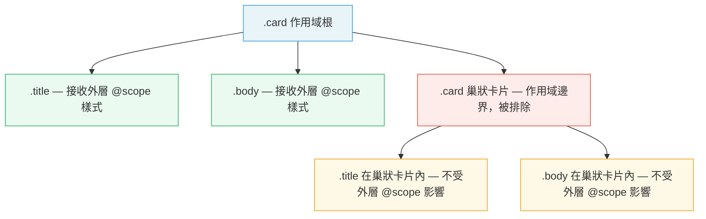

# [FEE-11200] CSS @scope — 無需特異性技巧的作用域樣式

:::info
完全不需要建置工具與 JavaScript — `@scope` 將選擇器的匹配範圍限制在 DOM 子樹內，讓某個元件中的 `.title` 永遠不會滲漏到其他地方。
:::

:::info Baseline Newly Available
Supported in Chrome 118+, Firefox 128+, Safari 17.4+. Use progressive enhancement for older browsers.
:::

## 背景

CSS 在單一的全域命名空間中運作。你寫下的每一條選擇器都與頁面上所有其他選擇器競爭。像 `.title { font-size: 1.25rem }` 這樣的規則，會套用到頁面上每一個帶有 `title` class 的元素——包含導覽列、卡片、模態框、頁尾中的所有元素。這不是 bug；這是 CSS 的設計初衷。1996 年，網頁是文件，不是元件樹。

web 平台逐漸累積了各種變通方案：

1. **BEM（Block Element Modifier）** — 冗長的 class 名稱充當命名空間：`.card__title`、`.nav__title`、`.modal__title`。不需要建置步驟，但冗長令人痛苦，且慣例只靠團隊紀律維持。
2. **CSS Modules** — 打包器在建置時對 class 名稱進行雜湊處理：`.title` 變成 `.title_3xK9f`。樣式洩漏在結構上是不可能的，但 DevTools 顯示的是雜湊後的名稱，難以閱讀，且需要 JavaScript 打包器。
3. **Shadow DOM** — 瀏覽器原生的封裝基本單位。Shadow root 內的樣式與外界完全隔離。但 Shadow DOM 需要 Web Components，引入了 slot 投影的複雜性，而且只為了一個 `<div>` 設定作用域顯然大材小用。
4. **工具類別框架** — Tailwind 等框架透過組合低階工具類別完全避免元件命名。作用域問題透過沒有共享 class 名稱來解決，但每個元素最終都掛著一長串工具 token。

`@scope` 是 CSS 工作小組的原生解答：一個純 CSS at-rule，無需建置步驟，將選擇器匹配限制在子樹內，並引入了一種稱為**鄰近特異性（proximity specificity）**的新級聯機制，取代特異性戰爭。

## 情境

你正在建立設計系統，系統中有 `.card` 元件。卡片可以巢狀——一個 `.card` 嵌套在另一個 `.card` 內是合理的模式（精選卡包含預覽卡）。兩個卡片都有 `.title` 元素。

設計需求：外層卡片的 `.title` 規則（`font-size: 1.25rem`）MUST NOT 滲透到內層卡片的 `.title`。內層卡片自行管理字體大小。

使用全域 CSS，祖先選擇器 `.card .title` 仍然匹配內層卡片中的 `.title`，因為內層卡片也是外層 `.card` 的後代。BEM 可以重新命名為 `.card__title`——但內層卡片也使用 `.card__title`，問題依然存在。CSS Modules 在不同檔案中會雜湊出不同名稱——但若同一個元件檔案渲染了兩個層級，問題依然存在。

`@scope (.card) to (.card)` — 甜甜圈作用域（donut scope）— 用一行純 CSS 宣告解決了這個問題。

## 最佳實踐

- SHOULD 在新程式碼中使用 `@scope` 取代 BEM 命名慣例。有語意的名稱（`.title`、`.body`、`.footer`）在 `@scope` 區塊內是安全的；不再需要 `.card__title` 這樣的前綴。
- SHOULD 在建立元件系統時使用甜甜圈作用域（`@scope (root) to (boundary)`），確保同一元件的巢狀實例 MUST NOT 繼承外層作用域的樣式。
- MUST NOT 將 `@scope` 作為 Shadow DOM 的完全替代品。`@scope` 只限制 CSS 選擇器的匹配。它不封裝 JavaScript、自訂元素的生命週期回呼、事件監聽器或 slot 投影。
- SHOULD 將 `@scope` 與 CSS 自訂屬性結合進行元件主題設定。在 `:scope` 上宣告主題變數；讓子元素繼承它們。這能在不使用 Shadow DOM 的情況下實現元件本地的變數作用域。
- SHOULD 採用漸進增強。將 `@scope` 區塊包在 `@supports (selector(:scope))` 中，讓舊版瀏覽器優雅地回退到全域選擇器，而非顯示破損的樣式。
- SHOULD NOT 依賴 `@scope` 的鄰近特異性來解決共用選擇器名稱的不相關元件之間的衝突。鄰近性是在同一層（layer）和同一特異性等級內的決勝機制；它不能取代有意為之的架構設計。

## 設計思維

### 為何全域 CSS 難以維護

CSS 只有一個特異性模型和一個命名空間。選擇器特異性（class 為 `0-1-0`，元素為 `0-0-1`）是全域計算的。當兩條規則以相同的特異性匹配同一個元素時，出現在原始碼較後面的那條獲勝。這迫使團隊陷入軍備競賽：用 `.card .title` 覆蓋 `.title`，再用 `.sidebar .card .title` 覆蓋，接著是 `.page .sidebar .card .title`。特異性只會越來越高。

根本原因：CSS 選擇器的設計初衷是匹配文件中的元素，而非在元件內部封裝。

### BEM 如何解決——以及它的局限

BEM 透過在每個 class 中嵌入元件名稱來跳出命名空間衝突：`.card__title` 與 `.nav__title` 不會衝突，因為它們是不同的字串。這個方法可靠，不需要工具。代價是冗長與慣例執行：開發者在 `.card` 內部寫了 `.title` 就靜默地打破了保證。

### CSS Modules 如何解決——以及其取捨

CSS Modules 透過在建置時雜湊 class 名稱，使 BEM 風格的唯一性自動化。開發者寫 `.title`；打包器輸出 `.title_3xK9f`。洩漏在結構上是不可能的。取捨在於：DevTools 顯示雜湊後的名稱（除錯需要 source map 或瀏覽器擴充套件），方法與 JavaScript 打包器耦合，切換框架意味著切換 CSS module 工具鏈。

### Shadow DOM 如何解決——以及何時是殺雞用牛刀

Shadow DOM 提供瀏覽器原生的樣式封裝。在 shadow root 中定義的樣式不會洩漏出去；外部樣式不會洩漏進來（繼承屬性和自訂屬性除外）。這是最強形式的封裝。代價：你必須定義一個自訂元素、管理 shadow root 的生命週期、並處理 slot 投影。對於純粹是 `<div>` 的 `.card` 而言，這是相當大的開銷。

### 為何 `@scope` 與眾不同

`@scope` 是純 CSS。不需要建置步驟、不需要 JavaScript、不需要自訂元素。瀏覽器將作用域解析作為其原生級聯計算的一部分來處理。`to` 子句讓你定義「下界」——匹配邊界選擇器的後代不參與作用域，在中間創造了一個洞（甜甜圈）。

關鍵的概念新增是**鄰近特異性**：當兩條具有相同選擇器和特異性的 `@scope` 規則都匹配同一個元素時，作用域根在 DOM 樹中更靠近的規則獲勝。這意味著巢狀元件自然優先於其祖先，無需提升特異性。

## 圖解

下圖展示了甜甜圈作用域如何與巢狀 `.card` 元件配合運作。外層作用域的樣式套用到外層 `.card` 內的 `.title` 和 `.body`，但在內層 `.card` 邊界停止。



甜甜圈的比喻：外層 `.card` 是甜甜圈，洞是內層 `.card`。外層作用域的樣式流過甜甜圈的麵團（外層的 `.title`、`.body`），但不流過洞（內層 `.card` 內的所有東西）。

## 範例

### 範例一 — 樣式洩漏問題與 `@scope` 修復

沒有 `@scope` 時，巢狀卡片會繼承外層卡片的 `.title` 規則，因為 `.card .title` 匹配任意深度的 `.title`。

```html
<!DOCTYPE html>
<html lang="zh-TW">
<head>
  <meta charset="UTF-8" />
  <meta name="viewport" content="width=device-width, initial-scale=1.0" />
  <title>@scope — 洩漏 vs. 作用域</title>
  <style>
    body {
      font-family: system-ui, sans-serif;
      padding: 24px;
      display: flex;
      gap: 32px;
    }

    /* ── 共用卡片外框 ─────────────────────────────────── */
    .card {
      border: 1px solid #ddd;
      border-radius: 8px;
      padding: 16px;
      background: #fff;
      max-width: 320px;
    }

    /* ── A 欄：無 @scope — 洩漏 ──────────────────────── */
    .without-scope .card .title {
      font-size: 1.25rem;
      color: #1a1a2e;
      font-weight: 700;
    }

    /* ── B 欄：有 @scope — 已限制 ──────────────────── */
    @supports (selector(:scope)) {
      @scope (.with-scope .card) to (.card) {
        .title {
          font-size: 1.25rem;
          color: #1a1a2e;
          font-weight: 700;
        }
      }
    }

    /* ── 內層卡片預設標題（較小） ────────────────────── */
    .inner-card .title {
      font-size: 0.875rem;
      color: #555;
      font-weight: 500;
    }
  </style>
</head>
<body>

  <!-- A 欄：外層規則滲透進內層卡片 -->
  <div class="without-scope">
    <h3 style="margin-top:0">無 @scope</h3>
    <div class="card">
      <h2 class="title">外層標題（1.25rem）</h2>
      <p>外層卡片內容。</p>
      <div class="card inner-card">
        <h2 class="title">內層標題 — 被洩漏為 1.25rem</h2>
        <p>內層卡片內容。外層規則滲透進來了。</p>
      </div>
    </div>
  </div>

  <!-- B 欄：外層作用域不影響內層卡片標題 -->
  <div class="with-scope">
    <h3 style="margin-top:0">有 @scope</h3>
    <div class="card">
      <h2 class="title">外層標題（1.25rem）</h2>
      <p>外層卡片內容。</p>
      <div class="card inner-card">
        <h2 class="title">內層標題 — 未受影響（0.875rem）</h2>
        <p>內層卡片內容。外層作用域在此停止。</p>
      </div>
    </div>
  </div>

</body>
</html>
```

在 B 欄中，`@scope (.with-scope .card) to (.card)` 建立了一個甜甜圈：樣式套用於 `.with-scope` 後代中任何 `.card` 的內部，但在第一個巢狀 `.card` 邊界停止。內層 `.card` 的 `.title` 保留了自己較小的尺寸。

### 範例二 — 使用 `:scope` 與自訂屬性進行元件主題設定

`@scope` 區塊中的 `:scope` 指向作用域根元素。使用它來宣告元件本地的自訂屬性，讓子元素繼承。

```html
<!DOCTYPE html>
<html lang="zh-TW">
<head>
  <meta charset="UTF-8" />
  <meta name="viewport" content="width=device-width, initial-scale=1.0" />
  <title>@scope — 元件主題設定</title>
  <style>
    body {
      font-family: system-ui, sans-serif;
      padding: 24px;
      display: flex;
      gap: 24px;
    }

    /* ── 基本卡片外框 ─────────────────────────────────── */
    .card {
      border-radius: 8px;
      padding: 20px;
      width: 260px;
      border: 2px solid var(--card-border, #ddd);
      background: var(--card-bg, #fff);
      color: var(--card-text, #111);
    }

    .card .title {
      font-size: 1rem;
      font-weight: 700;
      margin: 0 0 8px;
      color: var(--card-accent, #333);
    }

    .card .body {
      font-size: 0.875rem;
      margin: 0;
    }

    /* ── 預設（中性）主題 via @scope + :scope ─────────── */
    @scope (.card-neutral) {
      :scope {
        --card-bg: #f8f9fa;
        --card-border: #dee2e6;
        --card-text: #212529;
        --card-accent: #495057;
      }
    }

    /* ── 成功主題 ─────────────────────────────────────── */
    @scope (.card-success) {
      :scope {
        --card-bg: #d1fae5;
        --card-border: #6ee7b7;
        --card-text: #065f46;
        --card-accent: #047857;
      }
    }

    /* ── 警告主題 ─────────────────────────────────────── */
    @scope (.card-warning) {
      :scope {
        --card-bg: #fef3c7;
        --card-border: #fcd34d;
        --card-text: #78350f;
        --card-accent: #b45309;
      }
    }
  </style>
</head>
<body>

  <div class="card card-neutral">
    <h2 class="title">中性卡片</h2>
    <p class="body">主題透過 @scope 在 :scope 根上宣告。</p>
  </div>

  <div class="card card-success">
    <h2 class="title">成功卡片</h2>
    <p class="body">自訂屬性僅作用於此實例。</p>
  </div>

  <div class="card card-warning">
    <h2 class="title">警告卡片</h2>
    <p class="body">不需要 JavaScript，不需要 BEM 修飾 class。</p>
  </div>

</body>
</html>
```

每個變體 class 套用一個 `@scope` 區塊，在 `:scope`（卡片元素本身）上設定自訂屬性。所有子元素繼承這些變數。`.card`、`.title`、`.body` 規則保持乾淨且通用——主題完全是附加的。

## 深入探討

### 鄰近特異性

鄰近特異性是 `@scope` 新增的級聯機制，它在層級順序之後、特異性之前作為決勝機制。

考慮兩個重疊的作用域：

```css
/* 作用域 A — 包裹整個頁面 */
@scope (.page) {
  p { color: red; }
}

/* 作用域 B — 包裹一個區塊 */
@scope (.section) {
  p { color: blue; }
}
```

```html
<div class="page">
  <div class="section">
    <p>我是什麼顏色？</p>
  </div>
</div>
```

兩條規則都以相同的特異性（`0-0-1`）匹配 `<p>`。在沒有 `@scope` 的世界中，較後面的規則獲勝——`color: blue`。有了 `@scope`，瀏覽器計算從 `<p>` 到每個作用域根的距離（以祖先步驟計）。`.section` 距離一步；`.page` 距離兩步。`.section` 因為**更近**而獲勝，所以套用 `color: blue`，無論原始碼順序如何。

這意味著元件樣式自然優先於頁面層級的預設值，無需任何特異性提升——你不需要 `.page .section p` 來覆蓋 `.page p`。

### `<style>` 標籤內的 `@scope` — 隱式作用域

當 `@scope` 不帶作用域根書寫時，`:scope` 指向包含 `<style>` 標籤的元素：

```html
<div class="card">
  <style>
    @scope {
      .title { font-size: 1.25rem; }
    }
  </style>
  <h2 class="title">卡片標題</h2>
</div>
```

這是**隱式作用域**。`<style>` 元素的父元素（`.card`）自動成為作用域根。這個模式特別適合 HTML 模板和伺服器渲染的元件片段，讓你能在不使用建置步驟的情況下將樣式與標記放在一起。注意：這與 Declarative Shadow DOM 不同——樣式並未與外界封裝，只是在選擇器匹配上被限制了作用域。

### `@scope` 與 `@layer` 的組合

`@scope` 和 `@layer` 是獨立的正交級聯機制：

```css
@layer components {
  @scope (.card) {
    .title { font-size: 1.25rem; }
  }
}

@layer overrides {
  @scope (.card) {
    .title { font-size: 1.5rem; }
  }
}
```

層級順序優先解析（`overrides` 勝過 `components`）。在同一層內，接著解析鄰近特異性。在同一層和同一鄰近度內，解析標準特異性。原始碼順序是最終的決勝機制。兩種機制不衝突；它們在級聯中佔據不同的位置。

### 甜甜圈作用域的下界是排他的

一個重要的細節：下界（`to` 子句）是**排他的**。匹配邊界選擇器的元素被排除在作用域之外，但根與邊界之間的祖先元素是包含在內的。

```css
@scope (.article) to (aside) {
  p { color: #333; }
}
```

```html
<article class="article">
  <p>包含在內 — 在作用域內</p>        <!-- 套用樣式 -->
  <aside>
    <p>被排除 — 在邊界內部</p>        <!-- 不套用樣式 -->
  </aside>
</article>
```

`<aside>` 元素本身及其內部的所有東西都在作用域之外。`<aside>` 之前的 `<p>` 在作用域之內。這種不對稱是刻意設計的：你宣告「樣式套用到但不包含這些巢狀元件」。

### 漸進增強模式

```css
/* 所有瀏覽器的預設樣式 */
.card .title {
  font-size: 1.25rem;
  font-weight: 700;
}

/* 在支援的瀏覽器中以 @scope 增強 */
@supports (selector(:scope)) {
  /* 移除洩漏的規則 */
  .card .title {
    font-size: unset;
    font-weight: unset;
  }

  @scope (.card) to (.card) {
    .title {
      font-size: 1.25rem;
      font-weight: 700;
    }
  }
}
```

不支援 `@scope` 的瀏覽器接收全域的 `.card .title` 規則。支援 `@scope` 的瀏覽器套用有作用域的版本，避免了洩漏。

## 瀏覽器支援

| 瀏覽器  | 首次支援版本 | 備註 |
|---------|-------------|------|
| Chrome  | 118         | 完整支援，含甜甜圈作用域 |
| Firefox | 128         | 完整支援 |
| Safari  | 17.4        | 完整支援 |
| Edge    | 118         | 基於 Chromium |

CSS 功能偵測：

```css
@supports (selector(:scope)) {
  /* 支援 @scope */
}
```

JavaScript 功能偵測：

```js
const supportsScope = CSS.supports('selector(:scope)');
```

截至 2026 年，`@scope` 已是 Baseline Newly Available，在所有主流瀏覽器的現行版本中均獲廣泛支援。在需要支援長期維護專案中較舊瀏覽器版本時，使用漸進增強（上方的 `@supports` 模式）。

## 內部參考

- [FEE-11201 @property](../CSS%20Houdini/11201.md) — `@property` 與 `@scope` 在元件主題設定上組合得很好：用 `@property` 宣告具型別的自訂屬性，再在 `@scope` 區塊內將初始值限定在 `:scope` 上，實現完全具型別的元件本地主題變數。
- [FEE-11002 Container Queries](./11002.md) — `@scope` 和 Container Queries 從不同角度處理元件作用域樣式問題。Container Queries 根據容器的尺寸限制「哪些樣式套用」；`@scope` 根據 DOM 祖先關係限制「選擇器匹配哪些元素」。兩者互補：使用 Container Queries 進行響應式版面調整，使用 `@scope` 防止元件實例之間的選擇器洩漏。

## 參考資料

- [@scope — MDN Web Docs](https://developer.mozilla.org/en-US/docs/Web/CSS/@scope)
- [Limit the reach of your selectors with the CSS @scope at-rule — Chrome for Developers](https://developer.chrome.com/docs/css-ui/at-scope)
- [CSS Cascading and Inheritance Level 6 — W3C](https://www.w3.org/TR/css-cascade-6/#scoped-styles)
- [CSS @scope — web.dev](https://web.dev/articles/at-scope)
