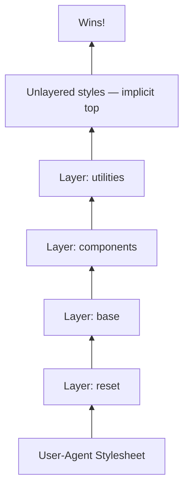

# [FEE-11203] CSS @layer — 串接層疊層

:::info
掌控哪條 CSS 規則獲勝：宣告哪一個規則層比另一個層更優先。層疊層順序勝過選擇器特異性，即使某條規則的選擇器較弱，只要它所在的層優先權較高就會獲勝。
:::

:::tip Baseline
此功能為 Baseline 廣泛可用，支援 Chrome 99+、Firefox 97+、Safari 15.4+。
:::

## 背景

在 CSS 的前四分之一個世紀，開發者只有一個工具來決定哪條規則勝出：特異性（specificity）。具有較高特異性選擇器的規則會覆蓋較低特異性選擇器的規則。如果結果不是你想要的，你就升級武力：多加一個類別、在 ID 內包裹選擇器、或者訴諸 `!important`。

當 CSS 由一個人為一份文件撰寫時，這樣的機制運作良好。但在有多位貢獻者、多個 CSS 來源（設計系統、第三方重置表、舊版程式碼、工具類框架），以及由互不了解對方程式碼的人在不同年代撰寫的規則的大型程式庫中，這個機制就會崩潰。

問題的根源在於，所有作者樣式都活在 CSS 串接（cascade）中單一、無差異的「作者層」內：你寫的每一個 `<link>` 標籤和每一個 `<style>` 區塊都在同一個池子中競爭。你無法宣告「這些是框架規則」或「這些是覆蓋規則」並讓瀏覽器尊重這種區分。你只能在選擇器權重上競爭。

CSS 串接層疊層（Cascade Layers），定義於 CSS Cascading and Inheritance Level 5，在特異性之上為串接新增了一個維度。你宣告一組具名層疊層並將規則分配給它們。在作者起源（author origin）內，層疊層的順序決定優先權：較高優先層的規則，無論選擇器特異性如何，都勝過較低優先層的規則。

設想一個情境：將設計系統整合到舊版企業應用程式中。設計系統提供了一個 `.button` 元件類別，但舊版應用程式已累積多年的樣式表技術債，包含像 `#sidebar .button` 和 `#app .button.button--primary` 這樣的選擇器。每次設計系統在側邊欄渲染按鈕時，舊版樣式表都會獲勝：`#sidebar .button` 的特異性為 `(1,1,0)`，也就是一個 ID 加一個類別，而設計系統的 `.button` 特異性只有 `(0,1,0)`，因此設計系統的樣式被靜默地覆蓋了。

傳統的解決方法是升級設計系統的選擇器，使其匹配或超越舊版特異性：加入 ID 包裝器、重複類別名稱、對每個屬性加上 `!important`。這些修復方式都只會增加特異性技術債，使下一次衝突更難解決。`@layer` 的解法是把排序單位從個別選擇器換成整組規則，範例小節會完整走過這個過程（參見「舊版整合」）。

## 視覺對比

正常（非 `!important`）規則的層疊層優先順序堆疊。圖中越上方表示優先順序越高：



設定此順序的宣告只需要在樣式表頂部的一行：

```css
@layer reset, base, components, utilities;
```

`utilities` 中的規則勝過 `components` 中的規則。`components` 中的規則勝過 `base` 中的規則。未分層的規則勝過所有規則。在每個層疊層內，特異性和來源順序正常適用。

對於 `!important` 規則，優先順序堆疊是反轉的：`reset` 中的 `!important` 勝過 `utilities` 中的 `!important`。

## 範例

### 三層設定：層疊層優先順序覆蓋特異性

這個範例展示了核心主張：層疊層優先順序覆蓋選擇器特異性。`utilities` 層中低特異性的工具類勝過 `components` 層中高特異性的選擇器。

```css
@layer reset, components, utilities;

@layer reset {
  *, *::before, *::after { box-sizing: border-box; margin: 0; }
  button { all: unset; }
}

@layer components {
  #app .button.button--primary {
    background: #0070f3;
    color: white;
    padding: 0.5rem 1rem;
    border-radius: 4px;
  }
}

@layer utilities {
  .bg-red { background: red; }
}
```

```html
<div id="app">
  <button class="button button--primary bg-red">Submit</button>
</div>
<!-- 結果：紅色按鈕 — utilities 層勝過 components 層
     即使 #app .button.button--primary 有更高的特異性 -->
```

選擇器 `#app .button.button--primary` 的特異性為 `(1,2,0)`。選擇器 `.bg-red` 的特異性為 `(0,1,0)`。在舊模型下，`.bg-red` 會大敗。在 `@layer` 下，`.bg-red` 獲勝，因為 `utilities` 在 `components` 之後宣告。

### 將第三方重置表匯入具名層疊層

```css
@layer reset, base, components, utilities;

/* 將整個 normalize.css 分配到 reset 層 */
@import url("https://cdnjs.cloudflare.com/ajax/libs/normalize/8.0.1/normalize.min.css") layer(reset);

@layer base {
  body {
    font-family: system-ui, sans-serif;
    line-height: 1.6;
    color: #333;
  }
  h1, h2, h3 { line-height: 1.2; }
}

@layer components {
  .card {
    background: white;
    border: 1px solid #e5e7eb;
    border-radius: 8px;
    padding: 1.5rem;
    box-shadow: 0 1px 3px rgba(0, 0, 0, 0.1);
  }

  .card__title {
    font-size: 1.25rem;
    font-weight: 700;
    margin-bottom: 0.5rem;
  }
}

@layer utilities {
  .mt-0 { margin-top: 0 !important; }
  .text-center { text-align: center; }
  .hidden { display: none; }
}
```

`@import url() layer()` 語法無需修改外部樣式表即可將其分層。來自 normalize.css 的所有規則都存在於 `reset` 層，也就是堆疊中最低的一層，因此你自己的樣式始終獲勝。

### 舊版整合：設計系統覆蓋舊版選擇器

這延續「背景」小節中設計系統整合進舊版應用程式的例子，此處用 `@layer` 實作。

```css
/* 宣告層疊層順序：設計系統規則勝過舊版規則 */
@layer legacy, design-system;

/* 舊版樣式表 — 高特異性選擇器 */
@layer legacy {
  #sidebar .button {
    background: #888;
    color: white;
    border: none;
    padding: 6px 12px;
  }

  #app .button.button--primary {
    background: navy;
    font-weight: bold;
  }
}

/* 設計系統 — 乾淨、低特異性的選擇器 */
@layer design-system {
  .button {
    display: inline-flex;
    align-items: center;
    padding: 0.5rem 1rem;
    border-radius: 4px;
    font-weight: 600;
    cursor: pointer;
    background: #0070f3;
    color: white;
    border: none;
  }

  .button:hover {
    background: #0051a8;
  }
}
```

```html
<!-- 在側邊欄：design-system .button 勝過 legacy #sidebar .button -->
<div id="sidebar">
  <button class="button">Filter</button>
</div>

<!-- 即使在這裡：design-system .button 也勝過 legacy #app .button.button--primary -->
<div id="app">
  <button class="button button--primary">Submit</button>
</div>
```

設計系統的 `.button` 規則在每個情境中都獲勝，因為 `design-system` 在 `legacy` 之後宣告；一旦兩條規則落在不同層，選擇器權重就不再參與比較。舊版樣式表沒有被修改：整個修正完全落在 `@layer` 的宣告順序上。

### 未分層樣式作為逃生艙口

```css
@layer reset, base, components, utilities;

@layer components {
  .modal {
    display: none;
    position: fixed;
    inset: 0;
    background: rgba(0, 0, 0, 0.5);
  }
}

/* 未分層：勝過每一條分層的正常規則 */
.modal--open {
  display: flex;
  align-items: center;
  justify-content: center;
}
```

`.modal--open` 類別是未分層的。它勝過來自 `@layer components` 的 `.modal`，即使 `.modal` 在那裡定義了。請有意地使用未分層樣式：它們是你需要某條規則勝過所有分層正常規則時的逃生艙口。

### 結合 `@layer` 與 CSS 巢狀結構

巢狀結構在層疊層區塊內自然組合。

```css
@layer reset, components, utilities;

@layer components {
  .button {
    display: inline-flex;
    align-items: center;
    gap: 0.5rem;
    padding: 0.5rem 1rem;
    border-radius: 4px;
    font-weight: 600;
    background: #0070f3;
    color: white;
    border: none;
    cursor: pointer;

    &:hover { background: #0051a8; }
    &:focus-visible { outline: 3px solid #0070f3; outline-offset: 2px; }
    &[disabled] { opacity: 0.5; cursor: not-allowed; }

    &.button--secondary {
      background: transparent;
      border: 2px solid #0070f3;
      color: #0070f3;
      &:hover { background: #e6f0ff; }
    }
  }
}

@layer utilities {
  .bg-transparent { background: transparent !important; }
}
```

整個巢狀元件都存在於 `@layer components` 內。結構、特異性和層疊層成員資格都是明確的。

## 最佳實踐

- MUST 在樣式表頂部宣告層疊層的順序，早於任何分配規則的 `@layer` 區塊。第一個 `@layer <names>` 宣告永久設定優先順序；後來對相同名稱的重新宣告不會改變優先順序。
- SHOULD 將第三方和廠商重置表分層到最低層（例如 `reset`），將元件規則放在中間，將工具類覆蓋放在頂部。典型的順序是 `@layer reset, base, components, utilities`。
- SHOULD NOT 在沒有明確策略的情況下將所有樣式放入層疊層。未分層的樣式（不在任何 `@layer` 區塊內的樣式）對於正常宣告被視為隱式最高優先級層，因此未分層的正常規則會勝過所有分層的正常規則。這個規則對 `!important` 不成立：分層的 `!important` 宣告仍然會勝過未分層的 `!important` 宣告，因此工具層中的 `!important` 規則（如本文範例中的規則）可能會靜默覆蓋你原本預期會無條件獲勝的未分層規則。
- MAY 使用 `@import url() layer()` 將整個第三方樣式表分配到具名層疊層，無需修改該檔案。這是分層 normalize.css、reset.css 或其他廠商重置表的正確方式。
- SHOULD NOT 使用匿名層（`@layer { ... }`），除非你有意要建立一個無法被追加的層。匿名層沒有名稱，無法被後續的 `@layer` 區塊指定；一旦宣告，其中的規則就固定了。
- MAY 將 `@layer` 與 `@scope` 和 CSS 巢狀結構組合使用。三者可以自然地相互組合；在 `@layer` 區塊內的巢狀元件區塊是有效且常見的做法。

## 設計思維

### 為何特異性是 25 年來唯一的串接控制手段

CSS 被設計為文件樣式表語言。原始的串接模型依照來源（origin）排序規則：用戶代理樣式、用戶樣式、作者樣式，並在每個來源內以特異性作為決勝手段。這個模型適合一個作者為一份文件撰寫一個樣式表的世界。

作者起源從未被細分。無論來自你的第一個 `<link>` 標籤、最後一個 `<style>` 區塊，還是行內的 `style` 屬性，每一條作者樣式都在同一個平坦的池子中競爭。沒有機制可以說「在我自己的程式碼中，這些規則的優先順序較低」。唯一的槓桿是選擇器權重和來源順序。

隨著網路發展成為應用程式平台，這種平坦模型產生了一類反覆出現的 bug。一個舊版規則會靜默覆蓋一條新規則，而新規則的作者從未見過那個舊版選擇器，於是一項單獨看起來正確無誤的變更，在瀏覽器中卻毫無效果。每一個大型 CSS 程式庫最終都會發展出特異性技術債：不斷升級的更重選擇器和作為繃帶貼上的 `!important` 宣告的軍備競賽。

CSS 工作組在 2010 年代初期認識到了這個問題。關於「串接控制」的各種提案被討論。`@layer` 機制為具名層疊層指定明確的優先順序，這項機制被規範在 CSS Cascading and Inheritance Level 5 中，穩定的瀏覽器實作在 2022 年問世。

### `!important` 升級模式如何發展

在平坦的作者層中，`!important` 是核武選項。標記為 `!important` 的宣告勝過所有正常宣告，無論特異性或來源順序如何。它的存在是為了讓用戶樣式表（無障礙覆蓋、高對比模式）能夠覆蓋作者樣式表，這在原始串接模型中是合理的使用場景。

實際上，開發者發現 `!important` 也是特異性衝突的逃生艙口。與其重構高特異性選擇器，不如對你想要獲勝的規則加上 `!important`。這個做法有效，直到有人也對競爭規則加上了 `!important`。然後兩條規則都有 `!important`，特異性決勝機制在它們之間繼續。軍備競賽又上升了一個層級。

大型 CSS 程式庫最終會擁有大量標注了 `!important` 的樣式表，實際的串接優先順序由誰對什麼加了 `!important` 以及以什麼順序決定。理解為什麼某個給定樣式會生效，需要同時追蹤來源順序、特異性和 `!important` 標注。

`@layer` 並不會使 `!important` 過時，但它改變了 `!important` 與層疊層的互動方式。對於 `!important` 規則，層疊層優先順序是反轉的：較早（較低優先級）層中的 `!important` 規則勝過較晚（較高優先級）層中的 `!important` 規則。這與更廣泛的串接模型中，不同來源（用戶代理、用戶、作者）之間 `!important` 規則優先順序早已反轉的運作方式一致。理解這種反轉對於混合層疊層和 `!important` 的程式庫至關重要。

### 心智模型的轉變：從重量到順序

`@layer` 要求的關鍵心智模型轉變，是從「哪條規則的選擇器更重」移向「哪個層疊層獲勝，然後在該層內哪條規則更重」。

在舊模型中，你從全局角度推理特異性。程式庫中任何地方的特異性 `(1,2,0)` 規則都勝過特異性 `(0,3,0)` 的規則，無論各自在哪個檔案中。

在分層模型中，你首先推理層疊層。如果規則 A 在 `utilities` 層，規則 B 在 `components` 層，且 `utilities` 在 `components` 之後宣告，那麼規則 A 獲勝，無論特異性如何；選擇器權重要到兩條規則落在同一層時才會被納入考量。

這是一個更強大的模型，但它需要在架構層面的紀律。樣式表頂部的層疊層宣告順序是一個承重的架構決策。更改它會改變整個程式庫中哪些規則獲勝。

回報是每個層疊層成為一個自包含的特異性域。在 `@layer components` 內，你不再需要擔心來自層外的特異性升級。你可以在設計系統中撰寫乾淨、低特異性的選擇器，知道層疊層邊界保護它們免受不同層中舊版高特異性選擇器的影響。

## 深入探討

### `revert-layer`：復原層疊層的宣告

CSS Cascading and Inheritance Level 5 也定義了 `revert-layer`，這是一個 CSS 全域關鍵字，可以把屬性值回退到作者起源中前一個層疊層原本會套用的值。當較高優先層需要讓單一屬性跳出自己的覆蓋、卻不想刪除整條規則時，可以使用它：

```css
@layer base, special;

@layer base {
  .feature { color: green; }
}

@layer special {
  .feature { color: revert-layer; } /* 回退到 green，也就是 base 層的值 */
}
```

如果沒有更早的層可以回退，屬性值會繼續往下回退，回到完全沒有套用任何作者規則時的值。`revert-layer` 自 2022 年 3 月起就已在所有主要瀏覽器中可用，與 `@layer` 本身的推出時間相同，如今是 Baseline Widely Available。

### 巢狀層疊層與 `parent.child` 簡寫語法

層疊層可以巢狀嵌套，這也是框架用來將子層暴露為擴充點的方式：

```css
@layer framework {
  @layer components {
    .button { color: blue; }
  }
}
```

這等同於扁平的點記法形式：

```css
@layer framework.components {
  .button { color: blue; }
}
```

巢狀層疊層的優先順序會先比較父層的順序，再比較同一父層內的子層順序。巢狀在較低優先權父層內的層，無論在自己的手足層中排在哪裡，都會輸給巢狀在較高優先權父層內的任何層。

## 瀏覽器支援

| 瀏覽器  | 首次支援版本 | 備註 |
|---------|------------|------|
| Chrome  | 99         | 2022 年 3 月穩定版 |
| Firefox | 97         | 2022 年 2 月穩定版 |
| Safari  | 15.4       | 2022 年 3 月穩定版 |
| Edge    | 99         | 基於 Chromium；與 Chrome 同步發布 |

四個主要瀏覽器在 2022 年初的兩個月內都發布了 `@layer` 支援。截至 2026 年，這是 Baseline Widely Available，現代瀏覽器目標無需 polyfill。

功能偵測：`@supports at-rule(@layer)` 已在 Chromium 148（2026 年 5 月穩定版）中推出，Edge 148 也已支援，但 Firefox 和 Safari 尚未支援。在此之前，於 JavaScript 中檢查 `CSSLayerBlockRule` 或 `CSSLayerStatementRule` 介面，仍是可跨瀏覽器使用的做法：

```js
const supportsLayers = typeof CSSLayerBlockRule !== 'undefined';
```

或者，依靠 Baseline Widely Available 的認定：如果你的 browserslist 排除了 Chrome 99 以下、Firefox 97 以下和 Safari 15.4 以下，你可以直接使用 `@layer` 而無需功能檢查。

### `@layer` 實戰：Tailwind CSS v4

Tailwind CSS v4（2025 年 1 月發布）將其工具類 CSS 產生在原生的串接層疊層內：`@layer theme, base, components, utilities;`。由於這些工具類都活在具名層疊層中，最佳實踐小節中「未分層規則」的規則會直接套用：任何未分層的 CSS 現在都會覆蓋 Tailwind 工具類，即使它以前單靠特異性贏不了，不論這段 CSS 來自元件庫的樣式表、複製貼上的程式碼片段，還是 `@layer` 區塊外的 `<style>` 區塊皆然。如果你需要某項自訂樣式穩定地勝過 Tailwind 的工具類，在 v4 之下讓它保持未分層，正是能維持這項保證的做法。

### `@layer` 與 PostCSS

`@csstools/postcss-cascade-layers` 外掛可以將 `@layer` 語法轉譯給不原生支援它的瀏覽器。截至 2026 年，現代瀏覽器目標不需要這樣做。該外掛僅在需要支援 Chrome 98 及以下或 Firefox 96 及以下時才有用。

## 延伸閱讀

- [FEE-11200 CSS @scope](./11200.md)：`@scope` 和 `@layer` 是互補的工具。使用 `@scope` 約束元件選擇器（selector）匹配哪些元素；使用 `@layer` 控制當兩個層疊層（layer）指定同一元素時哪個層的規則獲勝。
- [FEE-11202 CSS Nesting](./11202.md)：巢狀結構和 `@layer` 可以自然組合。將巢狀元件區塊放在 `@layer` 區塊內，以同時獲得撰寫清晰度和串接（cascade）優先順序控制。

## 參考資料

- [Cascade layers — MDN Web Docs](https://developer.mozilla.org/en-US/docs/Learn_web_development/Core/Styling_basics/Cascade_layers)
- [@layer — MDN Web Docs](https://developer.mozilla.org/en-US/docs/Web/CSS/Reference/At-rules/@layer)
- [revert-layer — MDN Web Docs](https://developer.mozilla.org/en-US/docs/Web/CSS/revert-layer)
- [Una Kravets, "Cascade layers are coming to your browser" — Chrome for Developers](https://developer.chrome.com/blog/cascade-layers)
- [CSS Cascading and Inheritance Level 5 — W3C](https://www.w3.org/TR/css-cascade-5/)
- [CSS @layer — Can I use](https://caniuse.com/css-cascade-layers)
- [Stephanie Eckles, "Getting Started With CSS Cascade Layers" — Smashing Magazine](https://www.smashingmagazine.com/2022/01/introduction-css-cascade-layers/)
- [Miriam Suzanne, "Cascade Layers Guide" — CSS-Tricks](https://css-tricks.com/css-cascade-layers/)
- [Tailwind CSS v4.0 — Tailwind Labs](https://tailwindcss.com/blog/tailwindcss-v4)
