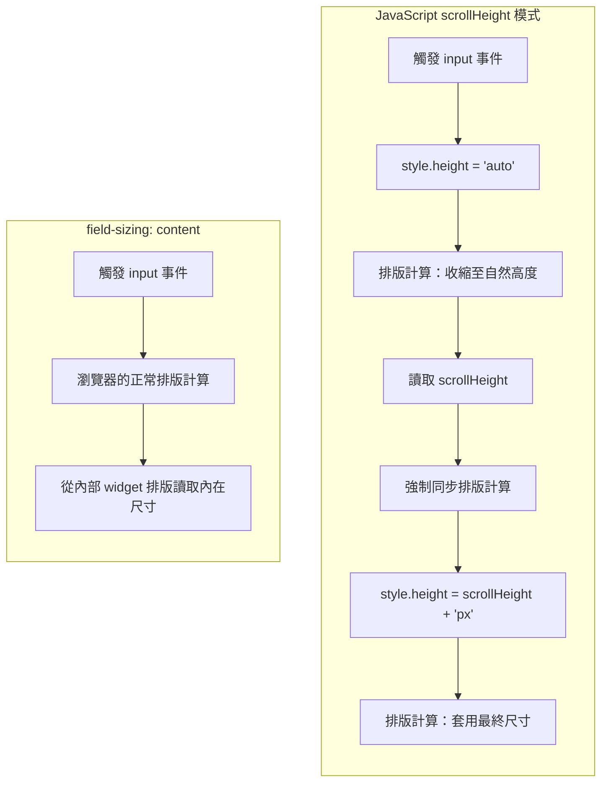

# [FEE-11301] field-sizing — 自動調整尺寸的表單控件

:::info
一個 CSS 屬性，`field-sizing: content`，就能完全取代 JavaScript textarea 自動增高的實作模式。表單控件無需事件監聽器、無需重新排版計算，就能隨內容展開與收縮。
:::

:::info Baseline Newly Available
`field-sizing` 已於 2026 年 6 月 16 日達到 Baseline Newly Available：Chrome 123+、Edge 123+、Safari 26.2+ 與 Firefox 152+ 均已支援。Baseline Widely Available（過去 2.5 年瀏覽器版本皆支援）狀態預計於 2028 年 12 月 16 日達成；仍需支援較舊瀏覽器版本的團隊，應保留降級方案。
:::

## 背景

表單控件在 CSS 中佔據一個特殊位置。頁面上大多數元素都參與瀏覽器的內在尺寸模型（intrinsic sizing model）：`<div>` 會包裹子元素、`<p>` 會撐滿容器、`` 預設使用其自然尺寸。表單控件則不然。

`<textarea>` 與 `<input>` 在 CSS 規範中是**置換元素（replaced elements）**：CSS 將它們視為一個具有尺寸的不透明方框，而不是可以從內容計算尺寸的東西。瀏覽器最初藉由將表單控件的渲染委派給作業系統原生的 widget 工具包，強化了這種不透明性。如今 Blink、Gecko 等現代引擎已改為自行渲染表單控件，不再交由 OS 處理，但置換元素的尺寸模型從未改變。在 `field-sizing` 出現之前，CSS 仍然無法像對 `<div>` 依子元素計算尺寸那樣，依文字內容決定 `<textarea>` 或 `<input>` 的尺寸。

實際結果：兩種元素都有固定的預設尺寸。

- `<textarea>` 預設為 2 行 × 20 欄（大約），由 HTML 的 `rows` 與 `cols` 屬性控制。
- `<input type="text">` 預設寬度為 20 個字元，由 `size` 屬性控制。

兩種元素都沒有任何內建機制能在使用者輸入時自動增長。開發者已用 JavaScript 解決這個問題超過十五年，其中最常見的做法是透過 `react-textarea-autosize` 之類的函式庫。

### JavaScript scrollHeight 方法

幾乎所有前端參考網站都記載了這個讓 textarea 自動增高的標準做法，分為三個步驟：

```js
textarea.addEventListener('input', () => {
  textarea.style.height = 'auto';      // 步驟 1：收縮至自然高度
  textarea.style.height = textarea.scrollHeight + 'px';  // 步驟 2：展開以容納內容
});
```

**步驟 1 是問題所在。** 設定 `height: auto` 會讓瀏覽器執行一次排版計算以決定自然高度。若在下一個繪製幀之前讀取 `scrollHeight`，瀏覽器必須同步刷新待處理的樣式與排版計算，才能回傳有效的測量值。這通常被稱為「強制重排（forced reflow）」或「排版抖動（layout thrash）」，且在每次按鍵時都會發生。

在現代機器上，單一簡單的 textarea 成本可忽略不計。但在同時渲染許多自動增高 textarea 的文件中，例如一個區塊式編輯器（每個區塊各自是獨立欄位），累積的成本是可測量的，並會造成視覺卡頓：任何在每次按鍵都重新測量每個欄位的解決方案，其強制重排成本都會隨頁面上的欄位數量增加。

### shadow DOM 複製技術

另一種更可靠但更繁重的方法，是建立一個隱藏的 textarea「鏡像」：

```js
const mirror = document.createElement('textarea');
// 從真實 textarea 複製所有計算樣式
// 寫入相同內容
// 將鏡像附加至 DOM（visibility: hidden）
// 讀取 mirror.scrollHeight
// 設定真實 textarea 的高度
```

這種做法透過讀取隱藏複製品來避免對真實元素的強制重排。代價是：DOM 節點數量加倍、每次更新都需要樣式同步，且當字型載入為非同步或容器尺寸改變時會出問題。`react-textarea-autosize` 正是建立在這項技術之上：它維護一個隱藏的鏡像 `<textarea>`，並讀取該鏡像的 `scrollHeight`，而不是在可見欄位上切換 `height: auto`。這樣做避開了前面提到的雙重排版問題，但從鏡像讀取 `scrollHeight` 仍然會強制觸發一次同步排版，因此在有許多自動增高欄位的文件中，這個函式庫仍然會在每次按鍵時重新測量每個欄位，強制重排的成本依然會隨頁面上的欄位數量增加。

### 為何 JS 解決方案是架構技術債

兩種解決方案都有相同的根本問題：它們在繞過 CSS 無法觀察表單控件內容尺寸的限制。每個讀取 `scrollHeight` 的解決方案，都在重新計算一個瀏覽器已經在內部知曉但未暴露出來的值。

`field-sizing: content` 將它暴露出來。

### 聊天輸入框的需求

設想一個聊天介面，其中訊息輸入框是一個 `<textarea>`，應該要：

- 從精確的一行高度開始，不是兩行，也不是固定的像素大小。
- 隨著使用者輸入自然地展開，逐行增高。
- 在五行時停止增長，超過則可捲動。
- 在使用者刪除內容時縮回。
- 調整大小的行為不需要 JavaScript。

在 `field-sizing` 出現之前，要同時滿足這五個需求，唯一的辦法就是 JavaScript：無論是前述的 `scrollHeight` 模式，或是 shadow DOM 複製技術。`field-sizing: content` 讓這五個需求都能單靠 CSS 達成。下方的「視覺對比」小節會對比這兩種做法；「範例」小節則會完整實作這個輸入框。

## 視覺對比

這兩種做法最終達到相同的可見結果：一個會自動增高的 textarea，但採取的路徑不同。JavaScript 模式讀取瀏覽器內部已經計算好的測量值，再將其寫回為明確的高度，因而多強制了一次同步排版。`field-sizing: content` 則讓排版引擎在正常的排版過程中，直接使用那個內部測量值。



## 範例

### 聊天訊息輸入框

一個從一行高度開始、最多增長至五行（1.5 行高 × 7.5em）、超過則捲動的聊天輸入框。

```html
<form class="chat-form">
  <textarea
    class="chat-input"
    placeholder="Type a message…"
    rows="1"
  ></textarea>
  <button type="submit" class="chat-send">Send</button>
</form>
```

```css
.chat-form {
  display: flex;
  align-items: flex-end;
  gap: 0.5rem;
  padding: 0.75rem;
  border: 1px solid #ccc;
  border-radius: 8px;
  background: #fff;
}

.chat-input {
  flex: 1;
  resize: none;
  border: none;
  outline: none;
  font: inherit;
  line-height: 1.5;
  padding: 0.25rem 0;
  overflow-wrap: break-word;
}

.chat-send {
  flex-shrink: 0;
  padding: 0.5rem 1rem;
  border-radius: 6px;
  border: none;
  background: #0066cc;
  color: white;
  font: inherit;
  cursor: pointer;
}

/* --- 漸進增強：支援 field-sizing --- */
@supports (field-sizing: content) {
  .chat-input {
    field-sizing: content;
    min-height: 1.5em;   /* 一行：永不收縮至零 */
    max-height: 7.5em;   /* 五行：限制增長 */
    overflow-y: auto;    /* 超過 max-height 時捲動 */
  }
}

/* --- 降級方案：不支援 field-sizing --- */
@supports not (field-sizing: content) {
  .chat-input {
    height: 1.5em;       /* 固定單行起始高度 */
    overflow-y: hidden;  /* JS 介入前隱藏捲動條 */
  }
}
```

```js
// 針對低於 Baseline 版本的瀏覽器提供降級 JS
// （Chrome/Edge < 123、Safari < 26.2、Firefox < 152）。
// 若專案的支援矩陣已排除這些版本，可移除此區塊。
if (!CSS.supports('field-sizing', 'content')) {
  const textarea = document.querySelector('.chat-input');

  textarea.addEventListener('input', () => {
    textarea.style.height = 'auto';
    const maxHeight = parseFloat(getComputedStyle(textarea).fontSize) * 7.5;
    textarea.style.height = Math.min(textarea.scrollHeight, maxHeight) + 'px';
    textarea.style.overflowY = textarea.scrollHeight > maxHeight ? 'auto' : 'hidden';
  });
}
```

**效果：**

- 在 Chrome/Edge 123+、Safari 26.2+ 與 Firefox 152+ 中：純 CSS 自動增高，調整大小行為不需要 JavaScript。
- 在較舊的瀏覽器版本中：JavaScript 降級方案自動啟用，提供相同的使用者體驗。
- 兩種情況下：都是從一行開始，最多五行，超過則捲動。

### 行內編輯輸入框

一個精確包覆其標籤的輸入框，用於行內編輯，沒有多餘的空白。

```html
<label class="inline-edit">
  <span>Project name:</span>
  <input type="text" class="inline-edit-input" value="My Project" />
</label>
```

```css
.inline-edit {
  display: inline-flex;
  align-items: center;
  gap: 0.5rem;
  border-bottom: 1px solid #ccc;
  padding-bottom: 2px;
}

.inline-edit-input {
  border: none;
  outline: none;
  font: inherit;
  background: transparent;
  min-width: 4ch;          /* 永不比 4 個字元窄 */
  max-width: 30ch;         /* 永不比 30 個字元寬 */
}

@supports (field-sizing: content) {
  .inline-edit-input {
    field-sizing: content;
  }
}
```

輸入框隨使用者輸入最多增長至 30 個字元寬，之後裁切。若沒有 `field-sizing`，這個模式需要一個鏡像輸入值以測量文字寬度的隱藏 `<span>`。

### 追蹤選取選項的 Select

```html
<label>
  Sort by:
  <select class="compact-select">
    <option>Name</option>
    <option>Date</option>
    <option>Most recently modified</option>
    <option>Size</option>
  </select>
</label>
```

```css
@supports (field-sizing: content) {
  .compact-select {
    field-sizing: content;
  }
}
```

選擇框的寬度隨使用者選取不同選項而變化。「Name」產生較窄的選擇框；「Most recently modified」產生較寬的選擇框。

## 最佳實踐

- MUST 在任何 `<textarea>` 上將 `field-sizing: content` 與 `min-height` 搭配使用。若沒有 `min-height`，空的 textarea 會收縮至零高度，使其不可見且無法使用。
- MUST 在任何無限增長會破壞排版的 `<textarea>` 上，將 `field-sizing: content` 與 `max-height` 搭配使用。若沒有 `max-height`，textarea 會隨使用者輸入無限擴張。
- SHOULD 為仍支援 pre-Baseline 瀏覽器版本（Chrome/Edge 低於 123、Safari 低於 26.2、Firefox 低於 152）的使用者，以 `@supports not (field-sizing: content)` 提供降級方案。在 `not` 分支中使用固定 `height` 或基於 JS 的 `scrollHeight` 調整，可讓控件在這些版本上維持可用；一旦支援矩陣排除這些版本，就可以移除這個分支。
- SHOULD 在搭配 `max-height` 時設定 `overflow-y: auto`。當內容超過 `max-height` 時，textarea 應捲動而非無聲地裁切內容。
- MAY 將 `field-sizing: content` 應用於 `<input type="text">`，用於標籤輸入（tag input）或行內編輯（inline-edit）的 UI 模式，讓輸入框精確地包覆文字而非維持固定寬度。
- SHOULD 測試長連續字串（例如沒有空格的 URL）：加入 `overflow-wrap: break-word` 或 `word-break: break-all`，以防控件水平溢出其容器。
- SHOULD NOT 在 `<input type="number">` 或其他有型別的輸入上使用 `field-sizing: content`，以避免每次按鍵都出現令人迷惑的寬度變化。
- SHOULD NOT 在使用 `field-sizing: content` 的 textarea 上移除 `resize: none`。瀏覽器預設的拖曳調整大小功能與內容驅動的尺寸調整互動不良；使用者拖曳後再輸入，會看到相互衝突的行為。

## 設計思維

### 為何表單控件是置換元素

HTML 表單控件早於 CSS 出現。瀏覽器最初實作 `<input>` 與 `<textarea>` 時，將渲染完全委派給作業系統原生的 widget 工具包：Windows 上的 Win32 EDIT 控件、macOS 上的 NSTextField、Linux 上的 GTK2 widget。這在當時是正確的：它讓表單控件與原生應用程式保持一致的外觀，並免費獲得 OS 的無障礙支援。

代價是與 CSS 排版的隔離。置換元素告訴 CSS：「我有一個尺寸；請向我索取。」它不告訴 CSS：「這是如何從我的內容計算我的尺寸的方法。」CSS 用於文字節點、flex 項目和 grid 項目的內在尺寸模型根本不適用。CSS 可以對 textarea 設定明確的 `width` 或 `height`；CSS 無法要求 textarea 從內容計算自身的尺寸。

這就是為什麼在 `field-sizing` 之前，每個自動增高方案都需要 JavaScript。JavaScript 可以讀取 `scrollHeight`，這個屬性會暴露內部的排版測量值，接著再將其寫回為明確的 `height`。這是一個讀取－測量－寫入的循環，彌補了 CSS 無法彌補的差距。

### scrollHeight 方法為何強制兩次排版計算

當你在 textarea 中輸入一個字元時：

1. 瀏覽器處理 input 事件。
2. Textarea 的內部排版引擎計算新的可捲動高度。
3. 若 JavaScript `input` 監聽器執行 `element.style.height = 'auto'`，瀏覽器排程一次樣式重新計算。
4. 若監聽器在下一個繪製幀之前讀取 `element.scrollHeight`，瀏覽器必須同步刷新待處理的樣式與排版計算，以回傳有效的測量值。
5. 監聽器將測量值作為明確高度寫回。
6. 瀏覽器為新的明確高度排程另一次排版計算。
7. 瀏覽器繪製。

步驟 4 到 6 是一次強制同步排版，也就是前面提到的強制重排：在單一事件處理器中，接連執行兩次完整的排版計算，瀏覽器無法將它們批次處理。原本一次排版計算就足夠；但讀取後再寫入的模式，讓瀏覽器多執行了一次。

對於簡單文件中的單一 textarea，速度快得無法感知。但在同時有許多自動增高 textarea 的文件中，例如前面提到的區塊式編輯器情境，或是在低效能的行動裝置上，累積的成本就是可見的。

### 為何 field-sizing: content 在架構上更優越

`field-sizing: content` 將尺寸決策從 JavaScript 移入 CSS 排版引擎本身。模型從「在 JS 中測量，作為明確高度寫回」變為「此元素像任何其他元素一樣參與內在尺寸計算」。

瀏覽器已經知道 textarea 的內容尺寸：它在內部 widget 排版過程中就會計算出這個尺寸。`field-sizing: content` 是對排版引擎下的一個指令，要求它將該內部測量值用作 CSS 排版時的內在尺寸，而非使用固定的預設值。

結果：

- **無事件監聽器**：textarea 在每次按鍵時自動增長，無需任何 JavaScript 連接。
- **無強制重排**：尺寸調整發生在正常排版計算過程中，而非作為同步的讀寫循環。
- **無額外 DOM 節點**：無需隱藏複製品或鏡像元素。
- **與 CSS 約束配合**：`min-height`、`max-height`、`min-width`、`max-width` 均正常適用，與任何具有內在尺寸的元素相同。
- **支援動畫**：因為高度現在是一個 CSS 值，可以用 CSS transition 或 `@keyframes` 進行動畫處理。JS 方法無法輕易地為高度變化添加動畫。

### 內在尺寸模型

CSS 定義了元素決定其尺寸的三種方式：

1. **明確尺寸**：作者直接設定 `width` 或 `height`。
2. **內在尺寸**：元素從其內容（文字節點、子元素）計算其尺寸。
3. **外在尺寸**：元素伸展或縮小以填充其包含塊。

在 `field-sizing` 之前，表單控件只參與明確尺寸和外在尺寸。`field-sizing: content` 增加了內在尺寸：元素回報從其內容計算的偏好尺寸，CSS 排版可以將其用作進一步約束應用的基礎。

這與 `width: max-content` 對 `<div>` 的作用機制相同：元素回報其最大內在寬度，CSS 使用它。`field-sizing: content` 賦予表單控件同樣的能力。

### field-sizing 應用於 select

`field-sizing: content` 也適用於 `<select>` 元素。使用預設的 `field-sizing: fixed` 時，`<select>` 下拉選單的寬度由最寬的選項或明確的 CSS 決定。使用 `field-sizing: content` 時，`<select>` 的寬度會追蹤當前選取的選項：較短的選項產生較窄的選擇框。

這對於行內表單排版很有用，因為固定寬度的 select 對於短選項標籤會產生大量空白。當選項長度差異很大時則較不適合，這時使用者選擇不同選項所造成的排版位移，在視覺上可能令人不適。

### 與 resize 的互動

Textarea 預設有使用者可拖曳的調整大小控制柄（`resize: both`）。當 `field-sizing: content` 啟用時，使用者仍然可以拖曳控制柄調整大小，但下一次按鍵就會覆蓋手動設定的尺寸，並恢復至內容驅動的尺寸。這很可能不是預期的行為。請務必將 `field-sizing: content` 與 textarea 的 `resize: none` 或 `resize: horizontal` 搭配使用。

## 瀏覽器支援

| 瀏覽器  | 首個版本 | 發布時間 | 備註 |
|---------|---------|---------|------|
| Chrome  | 123     | 2024 年 3 月 | 完整支援 `<input>`、`<textarea>`、`<select>` |
| Edge    | 123     | 2024 年 3 月 | 基於 Chromium；與 Chrome 支援相同 |
| Safari  | 26.2    | 2025 年 12 月 | 完整支援 |
| Firefox | 152     | 2026 年 6 月 | 完整支援；完成跨引擎 Baseline |

`field-sizing` 在 Firefox 152 發布後，於 2026 年 6 月 16 日達到 Baseline Newly Available。Baseline Widely Available（過去 2.5 年瀏覽器版本皆支援）預計於 2028 年 12 月 16 日達成。

功能偵測：

```css
@supports (field-sizing: content) {
  /* 支援 field-sizing */
}
```

```js
const supportsFieldSizing = CSS.supports('field-sizing', 'content');
```

**上線指引：** 隨著四大主流引擎皆已支援，大多數專案可以直接使用 `field-sizing: content`。只有在專案仍需支援 pre-Baseline 瀏覽器版本（Chrome/Edge 低於 123、Safari 低於 26.2、Firefox 低於 152）時，才需要保留 `@supports` 降級方案；否則可以移除。`field-sizing` 定義於 CSS Form Control Styling Level 1（`drafts.csswg.org/css-forms-1`），該規範是從先前所屬的 CSS Basic User Interface Module Level 4 中吸收而來。以 utility class 為主的框架也已跟進：Tailwind CSS 提供了直接對應此屬性的 `field-sizing-content` 與 `field-sizing-fixed` class。

## 延伸閱讀

目前尚無密切相關的 FEE 文章。這是本系列中第一篇涵蓋 CSS 表單控件增強的文章。

## 參考資料

- [CSS field-sizing — Chrome for Developers](https://developer.chrome.com/docs/css-ui/css-field-sizing)
- [field-sizing — MDN Web Docs](https://developer.mozilla.org/en-US/docs/Web/CSS/field-sizing)
- [Use Cases for Field Sizing — Ahmad Shadeed](https://ishadeed.com/article/field-sizing/)
- [Better form UX with the CSS property field-sizing — Stephanie Stimac's Blog](https://blog.stephaniestimac.com/posts/2024/01/css-field-sizing/)
- [field-sizing — CSS-Tricks Almanac](https://css-tricks.com/almanac/properties/f/field-sizing/)
- [field-sizing isn't only about growing textareas — Stefan Judis](https://www.stefanjudis.com/today-i-learned/field-sizing-is-about-more-than-textareas/)
- [Can I use: field-sizing](https://caniuse.com/mdn-css_properties_field-sizing)
- [New to the web platform in June — web.dev](https://web.dev/blog/web-platform-06-2026)
- [field-sizing — Web Platform Features Explorer](https://web-platform-dx.github.io/web-features-explorer/features/field-sizing/)
- [field-sizing — Tailwind CSS Docs](https://tailwindcss.com/docs/field-sizing)
- [react-textarea-autosize — npm](https://www.npmjs.com/package/react-textarea-autosize)
