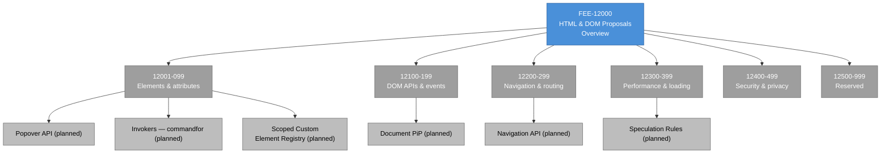

# [FEE-12000] HTML & DOM 提案概覽

:::info
HTML 沒有版本號。功能一個一個落入 Living Standard，意味著每個功能的就緒狀態都是自己的計算結果。
:::

:::warning Web Platform Proposals
10000-19999 範圍內的文章涵蓋尚未在所有主要瀏覽器中穩定的功能。當功能正式穩定後，文章將移至對應的 0-9999 分類。
:::

## 背景

**WHATWG**（Web Hypertext Application Technology Working Group）擁有 HTML 與 DOM 規範。成員為四家主要瀏覽器引擎——Apple、Google、Mozilla、Microsoft——透過 Steering Group 運作，該小組負責仲裁爭議並核可重要變更。Steering Group 的存在正是作為多實作者共識機制；任何進入規範的變更都已經過會實作它的實作者審視。這有別於 TC39 與 CSSWG，兩者的成員除了引擎廠商之外還包含受邀專家與社群代表。WHATWG 刻意以實作者為中心。

2019 年 W3C/WHATWG 諒解備忘錄（MoU）結束了十年的並行規範。2019 年以前，W3C 與 WHATWG 都發佈 HTML、DOM、Fetch 及相關標準的規範。實作在實務上跟隨 WHATWG 的草稿，因為那追蹤實際的瀏覽器行為，但 W3C 的正式 Recommendation 常與之不同。MoU 透過讓 WHATWG 成為所涵蓋規範的唯一真實來源來終結重複；W3C 發佈審閱副本但不再分支規範。對讀者而言，實務後果是 `html.spec.whatwg.org` 是 HTML 的權威來源，任何競爭文件都應視為歷史檔案。

在 MoU 之前，查閱 HTML 規範行為常常需要閱讀兩份規範並調解差異。WHATWG HTML Living Standard 描述瀏覽器實際做什麼；W3C HTML 5.x Recommendation 描述規範演進中某個時刻、帶有編輯性增補的樣貌。技術細節的差異可能讓讀者不確定哪個來源適用。MoU 的「單一真實來源」原則大幅簡化這點：讀者只需查閱 WHATWG 取得 HTML、DOM、Fetch、URL、Streams，不再需要判斷哪個版本適用。

**Living Standard 模型**是讓 HTML 與多數其他規範不同的結構性決策。沒有 HTML5、HTML5.1 或 HTML6。規範持續更新；一個對 `whatwg/html` 倉庫的提交可能在任何時候落地，發佈的規範在 `html.spec.whatwg.org` 上一直反映當前狀態。功能增量加入，沒有版本儀式。編輯盡可能保留錨點連結，讓外部對特定章節的引用在內容更新後仍然解析。這個模型遵循 WHATWG 編輯使用的三個指引問題：實作在做什麼、測試揭示什麼、處理模型應該是什麼樣子。

**Origin Trials** 是 Chrome 在全跨引擎協議完成之前把功能出貨給生產流量的機制。網站經營者在 `developer.chrome.com/origintrials` 註冊某個特定 Trial、收到 Token、把 Token 部署為 meta tag、HTTP header 或注入的 JavaScript。在 Trial 期間（通常六個月，有時延長），該功能對註冊來源的流量在 Chrome 上啟用。Trial 期間收集的資料會告知 Chrome 是否要不帶 Flag 出貨該功能、修訂它或撤回它。Origin Trials 是 Chrome 專屬的計畫；Firefox 與 Safari 有類似機制但規模較小，Chrome 的是實務上被最廣泛使用的。

**WICG**（Web Incubator Community Group）是許多 HTML 與 DOM 提案開始生命的地方。WICG 在 W3C 旗下運作，作為孵化器——讓開發者、瀏覽器工程師、研究者討論可能最終成為標準的想法的場域。提案從 `WICG/proposals` 倉庫開始、當獲得關注時畢業到專屬倉庫、準備好標準化時移至 WHATWG 或 W3C。Popover、Invokers（`commandfor` 與 `command` 屬性）、Speculation Rules、Navigation API 在到達 WHATWG 前都從 WICG 提案開始。WICG 到 WHATWG 的管道是柔性交接；提案在其 Champion 與協作者同意它已準備好接受實作者承諾時畢業。

有些提案無限期停留在 WICG。**Observable** 提案（一個針對 DOM 事件的反應式程式設計基本元素）在 WICG 已討論多年未畢業，因為實作者對這個抽象應屬於 DOM 層還是 JavaScript 語言層尚未達成共識。這類形狀的提案即使不畢業，也作為有用的共享設計存在；框架作者研究它們作為參考架構，有時會出貨自己的實作（`signals`、`observables`、反應式函式庫），這些實作又反過來影響平台層的設計。

**非正式的三引擎慣例**是承載式的就緒規則。當功能在 Chromium、Firefox、WebKit 不帶 Flag 出貨時，會被視為「標準」到足以被記錄於生產文件中。這個慣例是非正式的，因為沒有正式組織強制執行，但 MDN 每個平台參考頁面與每個相容性追蹤器都遵循它。在一個引擎出貨、在另一個引擎已實作但未出貨的功能落在一個模糊的中間地帶，而本文所屬的分類正是為了在這個地帶導航而存在。

三引擎慣例反映網路的一個更深層事實：它是實作之間的契約。只在一個引擎出貨的功能屬於廠商專屬擴展的類別，尚未達到平台功能的地位。當多個獨立實作就行為達成一致時，網路平台才獲得有意義的定義。這個規則是非正式的，因為符合資格的引擎數量在歷史上有所變化（Opera 的 Presto 到 2013 年前是第四個引擎；Internet Explorer 的 Trident 到 2016 年前是第五個），也因為「出貨」與「預設啟用」之間的界線可能模糊。開發者學會從 MDN 與 caniuse 的穩定出貨矩陣讀取訊號，並把三引擎慣例當作實務地板。

## 情境

一個產品團隊為新專案審查 HTML 功能清單。Popover API——`popover` 屬性、`showPopover()`、`hidePopover()`、`togglePopover()`、`:popover-open` 偽類——達到 Baseline 2025 狀態並在每個主要引擎不帶 Flag 出貨；團隊可以直接使用，無需功能守衛。scoped custom element registry 提案是 WHATWG 追蹤的草稿規範，其中一個實作正在落地；它會簡化團隊的 Web Components 架構，但只在一個引擎出貨。這兩個功能都存在於同一個 WHATWG「HTML Living Standard」大招牌下；只看單一「HTML」分類而沒有逐功能就緒資料的讀者會以為它們對等。

團隊對 scoped custom element registry 的選項沿著四條路徑分岔。路徑 1：現在在只有 Chrome 的代碼中採用，接受 Safari 與 Firefox 使用者看到預設的全域 Registry 行為。路徑 2：等跨引擎出貨後再採用；在此期間保留既有元件架構。路徑 3：出貨一個透過攔截 `customElements.define` 呼叫並在每棵樹隔離註冊來模擬作用域的 Polyfill；Polyfill 增加執行期額外負擔，且不完全符合原生語意。路徑 4：採用 Origin Trial（若提供），在該功能仍處於實作者回饋迴圈時取得自身使用的生產回饋。

每條路徑都有不同的成本輪廓與不同的訊號監看集合。路徑 1 把破損行為送給 35-40% 的使用者，需要 Chrome-user-agent 偵測或功能偵測來閘門。路徑 2 延後功能卻不付出成本，但同時也延後架構改進。路徑 3 對每個頁面載入、每個使用者都付出 Polyfill 稅，無論是否原生支援。路徑 4 在 Chrome 上啟用實驗，同時讓代碼庫保持準備，能在該功能普遍出貨時切到原生實作。本概覽是思考這類決策形狀的框架，套用於 12000 範圍內任何 HTML 或 DOM 提案。

具體的取捨對應於受眾與部署脈絡。一個擁有廣泛使用者族群的面向消費者產品無法承擔路徑 1 的破損行為成本；通常選擇路徑 2 或路徑 3。一個有受控使用者基礎（已知只在 Chrome）的內部工具可以安全選擇路徑 1。一個有工程能力追蹤 Origin Trial 回饋迴圈的高流量產品最適合選擇路徑 4。框架在各受眾間相同；決策不同是因為成本單位（使用者可見的破損行為、工程時間、Bundle 位元組、回饋迴圈負擔）在各脈絡中被以不同權重加總。

函式庫作者面對慣常的模式變體：以 Peer Dependency 風格的期待發佈函式庫，讓使用應用處理功能偵測與 Polyfill 載入。一個今天暴露 `<Popover>` 的元件函式庫可以依賴原生 Popover API 普遍可用；一個想暴露 scoped custom element registration 的函式庫則無法，必須出貨 Polyfill 或要求使用者自行處理。設計選擇隨每個功能的出貨狀態而變。

設計系統團隊的盤算多一層。設計系統發佈下游團隊消費的基本元素（Token、元件、佈局工具），下游團隊不必然理解瀏覽器出貨全景。一個暴露建立在 Popover 之上的 Tooltip 基本元素的設計系統可以依賴原生實作、不需 Polyfill 即可發佈。一個暴露建立在 Stage 前 API 之上的元件的設計系統，要嘛把 Polyfill 送給每個使用者（為每個使用產品增加 Bundle 體積），要嘛要求每個下游團隊自行處理功能閘門（把架構複雜度推到外部）。設計系統團隊的典型選擇是等待普遍出貨後才把 Stage 前功能當成一級的基本元素暴露。

## 設計思維

### 為什麼 HTML 放棄版本號

HTML 4 於 1997 年作為 W3C Recommendation 發佈。W3C 的後繼努力 XHTML 把 HTML 推向嚴格的 XML 語法。XHTML 1.0 是 HTML 4 在 XML 語法中的重製；2002 年以 W3C Working Draft 發佈的 XHTML 2 打破 HTML 的解析模型來普遍強制嚴格語法。瀏覽器廠商拒絕實作 XHTML 2，因為「打破網路」的成本無法接受。2004 年，來自 Apple、Mozilla、Opera 的工程師組成了 WHATWG，繼續以符合實際瀏覽器行為的 Living Standard 方式開發 HTML。

放棄版本號的決定將已經成真的事實形式化：HTML 是瀏覽器引擎與內容作者之間持續演進的契約。版本號暗示一種虛假的相容性界線感——一份標註「HTML 4.01 Strict」的文件實際上不需要與「HTML 4.01 Transitional」不同的瀏覽器行為；doctype 是一個帶有小幅解析含義的風格選擇。移除版本概念讓瀏覽器可以持續出貨功能而不需協調版本號，也讓規範可以累積修正而不觸發版本跳升。

取捨是讀者不能像 2008 年那樣說「這個網站瞄準 HTML X」。新的契約是「這個網站需要這些特定功能」，功能偵測取代版本偵測作為就緒檢查。這個取捨被接受，因為替代方案——維護版本化的 HTML 規範，帶有明確的相容性層級——會讓每個功能都被最慢的版本的步調拖累。

Living Standard 模型有一個讓新讀者措手不及的含義：規範可以不通知地改變。`html.spec.whatwg.org` 的一個章節去年可能以某種方式描述行為，今年可能以不同方式描述，因為編輯基於實作回饋更新了該章節。`web.archive.org` 的存檔是有效的版本歷史機制。在部落格文章或 Bug 回報中引用規範的讀者應在 URL 旁附上閱讀日期。

### 實作者優先的設計哲學

WHATWG 的運作哲學——編碼於工作模式文件並在編輯實務中反覆出現——是規範描述實作將做什麼。理論模型上的「應然」在 WHATWG 流程中沒有獨立權重，須由實際實作行為支撐。內部捕捉這一點的說法是「不要寫小說」。一個無法指出願意實作者的提案就是小說；描述沒有實作者承諾實作的行為的規範會累積成平台的死重。

這個哲學對提案形狀有可見影響。每個 WHATWG 提案在規範文字寫出之前，至少有一個願意先做原型的實作者。早期原型產生回饋塑形規範；規範只有在原型證明設計可被實際實作之後才被最終確定。這和 TC39（允許提案以實作者興趣但無實作者承諾停留在早期階段）以及 CSSWG（先產生規範文字，然後在 CR 期間尋求實作者回饋）不同。

取捨是當沒有實作者願意開始時，WHATWG 提案移動緩慢。一個沒有實作者興趣的好想法會無限期待在 WICG。一個有多個實作者興趣的好想法則快速前進。WHATWG 已出貨對提案的比例高於 TC39 或 CSSWG，但任何時刻可用的功能集較小，因為實作者優先的過濾器排除了「很酷但沒人想做」的類別。

### 生態系如何彌補時間差

HTML 與 DOM 提案有三個主要的使用者空間橋接策略。

**JavaScript Polyfill** 是最常見的 DOM 提案橋樑。Popover API 在其開發期間伴隨一個 Polyfill（npm 上的 `popover-polyfill`）出貨，在任何帶 `popover` 屬性的元素上實作 `togglePopover()` 與相關方法。`<dialog>` 元素在 Safari 於 2022 年出貨前同樣有 Polyfill。DOM API 的 Polyfill 通常體積適中（幾 KB）、不增加建置步驟、在載入時功能偵測以避免覆寫原生實作。

**功能偵測**對 DOM API 使用 `'methodName' in Element.prototype`、`typeof element.method === 'function'`、或特定屬性存在測試。對 HTML 層級行為（例如 `popover` 屬性的存在），可以建立並檢查測試元素：`document.createElement('div').showPopover` 在支援的引擎上存在、在不支援的引擎上為 undefined。

**Origin Trials** 讓大型生產網站在跨引擎出貨前、實作者回饋階段取得真實流量的回饋。Trial Token 是一項承諾——若 API 在畢業前改變（而 Trials 在回應回饋時確實會改變 API），網站必須適應。Origin Trials 是 Chrome 專屬機制；Firefox 的對應物是 `layout.experimental.*` 偏好設定集，Safari 的則是 Safari Technology Preview 發佈頻道。

**WICG 參與**是尚未在 WHATWG 的提案的橋樑。觀看 WICG 提案的團隊可以提 Issue、提議語法變更、在功能到達實作者考量前影響方向。這是真實世界需求進入規範管道的方式；到達實作者考量前未經 WICG 式孵化的提案常因缺少使用案例或未考慮既有模式而被拒絕。

除個別 Polyfill 外，**`@webcomponents/` 生態系**提供對核心 DOM 功能的通用化 Polyfill：`@webcomponents/custom-elements`、`@webcomponents/shadydom`、歷史上的 `@webcomponents/html-imports`。這些 Polyfill 由 Google 的 Polymer 時期團隊維護，是支援早於普遍 Custom Element 出貨的較舊瀏覽器的標準方式。對於瞄準 Baseline「Widely available」功能的現代瀏覽器，這些 Polyfill 已不再需要；它們對仍支援遺留引擎的專案仍然有用。

### 追蹤 Popover API 走過管道

Popover 把 HTML/DOM 管道具體化。最初提案來自 Open UI Community Group 與 WICG，時間是 2022 年，驅動力是開發者對 `aria-haspopup` 模式、焦點管理 Bug、以及實作可存取的下拉選單與工具提示複雜度的挫折感。提案在 2022 年底，當多個實作者承諾實作時，移至 WHATWG。

Chromium 在 Chrome 114（2023 年 5 月）不帶 Flag 出貨 `popover` 屬性。WebKit 在 Safari 17（2023 年 9 月）跟進。Firefox 在 Firefox 125（2024 年 4 月）出貨，完成跨引擎可用。所有三個引擎出貨後，該功能在 2025 年 1 月達到 Baseline 2025——`web.dev/baseline` 在功能跨引擎出貨 30 個月時指派的狀態，而在出貨完成時則指派新的「Newly available」狀態。這是現代 HTML 出貨時間軸：一個 WICG 孵化階段、當實作者承諾時移至 WHATWG、18-24 個月的引擎實作搭配 Origin Trials 填補早期採用者缺口、然後跨引擎出貨與最終的 Baseline 狀態。

Popover 畢業到 Baseline 2025 的事件，把 HTML/DOM 提案從 12000 範圍搬到 FEE-100（HTML & Semantic Markup）。Popover API 背後的功能——Interest Invokers、`commandfor` 屬性——各自被追蹤，可能在各自達到自己的 Baseline 里程碑時獨立畢業。

### 何時該採用 Stage 前 HTML 或 DOM 提案

採用計算是一組小問題。

第一：**提案是否已從 WICG 移至 WHATWG？** WICG 提案仍在構思階段；API 形狀預期會改變。WHATWG 提案有實作者承諾，形狀正在穩定。在 WICG 採用等於簽字接受重新設計；在 WHATWG 採用等於簽字接受修訂。

第二：**多少引擎出貨了它？團隊如何處理缺口？** 在所有三個引擎出貨的提案是完整採用候選。在兩個引擎出貨、第三個有活躍實作的提案是「即將到來」的情況，可由 Origin Trial 或 Polyfill 橋接缺口。只在一個引擎出貨、其他兩個無實作的提案是對該提案未來的賭注。

第三：**該功能是否有 Polyfill 或 Origin Trial？** DOM 提案常在 npm 上有 Polyfill 發佈。HTML 屬性提案（Popover、Invokers）有時有 Polyfill，有時沒有。檢查 npm 上是否有 Polyfill 是五分鐘的工作，常能走捷徑完成決策——若存在維護良好的 Polyfill，團隊可以現在採用、並在原生支援到位時撤除 Polyfill。

第四：**如果規範改變，Churn 成本是多少？** WICG 階段的提案可能且確實會改變形狀。WHATWG 提案較穩定但未凍結。形狀改變的成本與使用該功能的呼叫點數量以及遷移的複雜度成正比。觸及元件契約的功能（Popover、Navigation API）比觸及局部行為的功能（表單元素上的 `showPicker()`）有更高的遷移成本。

12001-12499 下的文章為每個具體提案回答這四個問題。本概覽提供框架。

四個問題的排序刻意安排。規範階段放第一，排除團隊尚無法承諾的早期提案。引擎出貨放第二，決定該功能是否普遍可用或需要橋樑。Polyfill 可用性放第三，為可橋接情況走捷徑。Churn 成本放最後，校準整體風險。沒有依此排序採用的團隊常到很晚才發現早期問題有會改變決策的答案。

在上述四個問題之外，一個值得追問的問題：**引擎維護者的立場是什麼？** Mozilla 與 WebKit 發佈標準立場文件（`mozilla.github.io/standards-positions`、`webkit.org/tracking-prevention`），記錄每個引擎對每個提案的立場。被所有三個引擎標示為「worth prototyping」或「positive」的提案是普遍出貨的強候選。被一個或多個引擎標示為「opposed」的提案可能永遠達不到普遍出貨；採用它是對反對將會改變的賭注，這有時發生有時不發生。

採用計算的具體實戰例子：scoped custom element registry（一個 WICG 階段提案）。執行期提案？是——一個 DOM API。規範階段？WICG 階段；WHATWG 追蹤進行中。引擎出貨？撰文時一個引擎正在落地實作；其他兩個尚未承諾。有 Polyfill 嗎？有，npm 上的 `@open-wc/scoped-elements`。Churn 成本？中等——元件 API 邊界穩定但內部註冊語意可能隨規範迭代而變動。

決策從計算中浮現：若團隊能忍受 Polyfill 且願意在規範變動時遷移，現在採用是可行的。若團隊需要功能原生語意且無法負擔遷移，採用應等 WHATWG 至少在兩個引擎出貨。計算不替團隊做決定，但把團隊必須權衡的取捨攤開。

## 深入探討

### WHATWG 治理：Steering Group 與 Workstream Participants

WHATWG 的治理結構有兩個層級。在工作層級，任何開發者都能對 WHATWG 規範提 Issue、提議變更、提交 Pull Request。這些貢獻由規範編輯（依設計每份規範兩位編輯）審閱，編輯在實作者同意下合併變更，或把不同意見向上升級。在決議層級，**Steering Group**（每個會員組織一席：Apple、Google、Mozilla、Microsoft）解決編輯無法解決的爭議並核可重要變更（新規範、規範退役、組織的結構性變更）。

Steering Group 只由實作者組成的設計是刻意選擇。HTML 與 DOM 規範描述瀏覽器行為；實作者未承諾實作的規範沒有約束力。將 Steering Group 擴展至包含非實作者代表（學者、標準倡議者、框架作者）在該小組看來會產生實作者拒絕實作的規範，這會傷害規範的可信度。因此只由實作者組成的結構以廣度換取可執行性。

非實作者輸入透過 **Workstream Participants**（特定規範討論的正式參與者）與 GitHub 上的 Issue/PR 工作流程進入。獲得實作者支持的非實作者提案成為規範候選；沒有任何實作者支持的提案停留在 Issue 追蹤器。

### HTML 解析器與約束積壓

HTML 的解析器是每個 HTML 提案的承載式約束。解析器由規範定義以處理十年的真實世界輸入——格式錯誤的標記、遺留的標籤湯、廠商專屬擴展——並在跨引擎產生相同的解析樹。任何新 HTML 語法提案都必須放進這個解析器而不破壞任何真實頁面的既有解析行為。

實務後果是：新 HTML 元素罕見，新 HTML 屬性常見。元素需要解析器變更，對標籤關閉演算法有級聯效應；屬性是既有元素屬性列表的增量變更。因此 Popover 以既有元素上的屬性（`popover`）實作——屬性避免了引入新 `<popover>` 元素會造成的解析器變更成本。Invokers 同樣在既有元素（按鈕、連結）上使用 `commandfor` 與 `command` 屬性，遵循同樣的增量方式。

當真正需要新元素時（`<dialog>`、`
`、`<template>`），解析器工作相當可觀。`<dialog>` 元素從第一次提案到普遍出貨花了超過十年，部分原因是解析器複雜度，部分原因是焦點管理語意必須從頭設計。

### 安全與隱私審查

每個 HTML 與 DOM 提案在出貨前都經過安全與隱私審查。`w3ctag/security-questionnaire`——W3C 技術架構小組維護的檢查清單——是標準格式。提案必須回答「這個功能是否暴露跨來源資訊？」、「這個功能是否可被用於指紋識別？」、「這引入什麼新的攻擊面？」等問題。

安全審查預先抓出重要設計問題。早期 Permissions API 設計允許網站列舉使用者曾授予其他來源的權限；安全審查將其標記為指紋識別向量，API 被重新設計為只查詢當前來源的權限。類似重新設計發生在 Notifications API、Clipboard API、File System Access API——所有這些都在隱私審查識別出疑慮後以修改形式到達出貨。

對採用的實務後果：在一個引擎出貨、其他引擎未出貨的功能有時被非出貨引擎希望解決的安全疑慮所阻擋。不先查看引擎的標準立場頁面（`mozilla.github.io/standards-positions`、`webkit.org/tracking-prevention`、`chromestatus.com/features`）就早期採用的團隊可能正在採用已被一兩個引擎標示為「worth prototyping」或「opposed」的功能。在承諾任何普遍出貨前的功能之前，查看立場頁面是值得的。

### 與 MDN 並行閱讀 HTML 規範

`html.spec.whatwg.org` 的 HTML 規範是規範性來源但密度很高——它為實作者撰寫，假設讀者熟悉 WebIDL、DOM 規範、以及網路安全模型。對於大多數實務閱讀，`developer.mozilla.org/docs/Web/HTML` 的 MDN HTML 參考是有用的夥伴。MDN 頁面摘要規範、連結至規範段落供深入閱讀、並嵌入顯示逐引擎出貨狀態的 browser-compat-data 表格。

接觸新 HTML 或 DOM 提案的讀者通常應先讀 MDN、對 WHATWG Issue 追蹤器提具體問題、只在除錯 MDN 未涵蓋的特定行為時才深入規範性規範文字。規範是典範參考，但很少是採用決策的起點。

### 撤回與延後的提案

並非每個達到 WHATWG 的提案都會前進。有些被延後；有些被撤回。

**HTML Imports** 提案是撤回最清楚的例子。HTML Imports 讓作者能把外部 HTML 文件作為資源引入，類似 CSS 與 JS 被引入的方式。提案在 2013 年達到 Chrome 的實作者考量，從未被 Firefox 或 Safari 實作，並在 ES modules 提案（JavaScript 側）為相同使用案例提供更好解決方案時最終在 Chrome 被棄用。採用 HTML Imports 的團隊必須遷移至 ES modules 或範本化函式庫。

**AppCache**（Application Cache）是出貨後棄用的例子。AppCache 在 2010 年代初期作為離線優先的快取機制在所有引擎出貨，當模型的限制被證明與真實世界使用模式不相容時被棄用，換成 Service Workers。棄用牽涉 DevTools 警告、從較新規範移除、最終從實作移除。

模式教訓是 HTML 提案即使在出貨後也可能被撤回，如果設計最終證明與真實世界使用不相容。在 12000 階段採用帶有類似 CSS Experimental 與 TC39 軌道的 Churn 風險。HTML 特定模式是 Churn 通常發生在生命週期後期（出貨後），相較於那些軌道，多數 Churn 發生於實作者回饋期間。

### Origin Trials 的實務

對於大型生產網站，參與 Origin Trial 是在功能普遍出貨前影響其設計的有用方式。Trial 給實作者團隊生產流量的回饋：規模化時遇到的錯誤、真實負載下的效能特性、只有在功能被認真使用時才浮現的 API 形狀摩擦。Trial 期間收集的回饋常塑形最終規範。

註冊 Origin Trial 花幾分鐘：在 `developer.chrome.com/origintrials` 選擇 Trial、同意條款（包含提交回饋的承諾）、收到 Token、部署為 meta tag（`<meta http-equiv="origin-trial" content="…">`）或 HTTP header（`Origin-Trial: …`）。Token 是來源範圍且有時限的；Trial 結束時，功能依出貨後決策回到其帶 Flag 或不帶 Flag 的狀態。

Origin Trial 參與的風險有兩項。第一，API 在 Trial 期間可能回應回饋而改變——在 Trial API 上建構功能的網站必須追蹤變更並適應。第二，Trial 可能結束而功能未出貨；網站則必須移除相依。兩項風險都可以管理，若網站把該功能架構為疊加在穩定基礎之上的可選增強，帶有針對 Trial 之外使用者的 fallback 代碼路徑。

Firefox 透過 `layout.experimental.*` 偏好設定集有類似機制，但這不是像 Chrome 那樣的生產面向計畫。Safari Technology Preview 為 WebKit 扮演相當的角色——開發者可以在 Technology Preview 上測試功能，然後該功能才到達穩定 Safari。

### 「Baseline」狀態模型

`web.dev/baseline` 狀態系統已成為 HTML、DOM、CSS 功能的實用就緒參考。Baseline 指派三個狀態：「Limited availability」（在一個引擎出貨、其他尚未）、「Newly available」（剛剛跨所有現代瀏覽器可用）、以及「Widely available」（已跨所有現代瀏覽器可用至少 30 個月）。

對採用決策而言，Baseline 提供單一查詢，把逐引擎出貨矩陣摘要為三狀態訊號。「Limited availability」代表團隊需要 Polyfill 或功能閘門代碼路徑。「Newly available」代表團隊可以在大多數瀏覽器採用，但對較舊裝置或較舊瀏覽器版本的使用者仍可能需要 fallback。「Widely available」代表團隊可以在面向現代瀏覽器的生產代碼中無條件使用該功能。

「Widely available」的 30 個月門檻經過校準以匹配典型企業瀏覽器升級週期與行動 OS 更新分佈曲線。已可用 30 個月的功能有時間傳播到更新較慢的脈絡——較舊的企業群、延後 OS 更新的使用者、有廠商控制更新週期的行動裝置。門檻捕捉功能在無需瀏覽器升級提示下即可在廣受眾生產代碼中安全使用的時刻。

## 圖解

藍色節點是分類概覽。灰色範圍節點目前沒有已起草的子文章；規劃主題以灰色葉節點顯示。12000 範圍的子文章是 FEE 專案後續規格的範疇——在那些子文章存在之前，本概覽是入口。追蹤特定提案的讀者應使用參考資料區段的 WHATWG 與 WICG 連結，直到對應子文章起草為止。

分類目前的空缺反映 HTML 與 DOM 提案畢業速度相對於 FEE 追上的速度。Popover（已達到 Baseline 2025）、Invokers（2025 年落地）、Document Picture-in-Picture（在 Chromium 出貨，Safari 18.3 加入支援）都是近期子文章撰寫的強候選，之後當達到跨引擎穩定門檻時畢業到 FEE-100 或 FEE-400。

當子文章存在時，建議的閱讀順序大致為：Popover 先（最成熟且流量最高）、Invokers 第二（概念上建立於 Popover 之上）、Navigation API 第三（在更廣層級影響應用架構）、然後 Document PiP 與 Speculation Rules 作為較窄受眾的功能。這是開發者第一次接觸 HTML/DOM 提案全景時的閱讀順序——從普遍出貨的開始，往後推到較不成熟的提案。

除目前規劃的子文章之外，12000 範圍還有空間容納尚未到達 WICG 或 WHATWG 的功能。Observable 基本元素（目前在 WICG 討論的 `Observable` 介面）可能最終到來；view-source 層級的變更（提議中結構化資料的 `source` 元素）可能充實 Elements 範圍。該範圍的保留空間可容納未來提案而不需要重新編號既有文章。

## 此範圍的軌道

| 範圍 | 主題 | 範例提案 |
|------|------|---------|
| 12001-12099 | 元素與屬性 | Popover API、Invokers（`commandfor`）、scoped custom element registry |
| 12100-12199 | DOM API 與事件 | Document Picture-in-Picture、Web Locks、observable primitives |
| 12200-12299 | 導航與路由 | Navigation API、URL Pattern API |
| 12300-12399 | 效能與載入 | Speculation Rules、Prerender、Priority Hints |
| 12400-12499 | 安全與隱私 | Trusted Types、Fenced Frames、Permissions Policy 擴充 |
| 12500-12999 | 保留 | — |

範圍的指派依循面向讀者的分類。Popover 放在 Elements 下，因為作者面向表面主要是 `popover` 屬性；Speculation Rules 放在 Performance 下，因為主要目的是控制 prefetch/prerender。跨多個軌道的提案（Navigation API 同時涵蓋導航與載入）放在與其主要作者面向概念對應的軌道下，並在 Related FEEs 段落交叉引用次要軌道。

## 畢業機制

從 12000 範圍畢業到 `HTML & Semantic Markup`（100-199）或 `Browser APIs & Web Platform`（400-499）發生於功能在所有三個主要引擎不帶 Flag 出貨、且被視為足以生產文件化。實際訊號是 `web.dev/baseline` 的 Baseline 狀態，它在所有三個引擎首次出貨時指派「Newly available」，持續可用 30 個月後指派「Widely available」。狀態為「Widely available」的功能是強畢業候選；狀態為「Newly available」的功能是近期候選，待內容深度審查。

元素提案（Popover、Invokers、`<dialog>`）通常畢業到 HTML & Semantic Markup（100-199）。API 提案（Navigation API、Document PiP、URL Pattern）通常畢業到 Browser APIs & Web Platform（400-499）。畢業目標在每個子文章的 frontmatter 中標註，以便維護者在畢業時識別目的地。

有些提案在當前 FEE 分類法中沒有明顯的目的地分類。目前在 WICG 討論的 Observable 基本元素儘管是 DOM API，會自然適合 `JavaScript Core & Runtime`，因為它定義的抽象行為存在於語言層。對這類情況，畢業決策落在讀者面向心智模型所在之處，即便該目的地與實作規範的歸屬不同。

一個近期歷史的具體例子是 **`<dialog>` 元素**。該元素在 HTML 中被規範超過十年才普遍出貨。Chromium 在 2014 年不帶 Flag 出貨；Safari 在 2022 年 3 月（Safari 15.4）跟進；Firefox 在 2022 年 7 月（Firefox 98）跟進。所有三個引擎出貨後，該元素在 2024 年達到 Baseline「Widely available」狀態並成為畢業候選。這是典型的 HTML 元素時間軸——解析器與焦點管理複雜度把實作時間延伸到遠超規範完成之後。

當功能對應的文章畢業時，搬到 100-199 或 400-499 範圍的新 ID；舊的 12000 段 ID 變成重新導向。反向連結、Git 歷史、書籤都保持完整。畢業提升內容；它不破壞讀者路徑。

有些功能以需要編輯判斷的方式跨越分類邊界。例如 Navigation API 是 DOM API（因此自然落在 400-499），但對應用架構的影響觸及與客戶端路由相同的關切——一個更靠近 Component Architecture 主題的問題，延伸出純瀏覽器 API 之外。每個畢業功能的編輯決策是該文章的目的地應符合其技術歸屬、還是其作者面向心智模型。對 Navigation API 而言，目前計畫是把技術參考放在 400-499，並在 500-599 範圍任何路由相關文章中加交叉引用。拆分保留兩條可尋找的路徑。

FEE 不正式追蹤哪些功能接近畢業，因為 Baseline 狀態是更精確的答案。好奇畢業候選的讀者應查 `web.dev/baseline` Baseline 追蹤器，加上 WHATWG 規範的變更日誌以確認跨引擎出貨。

部分畢業適用於分批出貨的功能族。Popover API 有核心（`popover` 屬性、`showPopover()`、`:popover-open`）與擴展（基於關注的調用、錨點目標）。核心達到 Baseline 2025 並可畢業；擴展處於不同的較早階段。做法是等子文章存在後把核心作為獨立 FEE 文章畢業、擴展特定的子文章留在 12000 範圍直到其各自的 Baseline 條件達成。這種部分畢業模式符合引擎本身的出貨方式——Popover 的核心是 Chrome 114 的里程碑，擴展在之後的釋出中落地。

## 相關 FEE

| FEE | 關聯 |
|-----|------|
| [FEE-100 HTML & Semantic Markup](../../HTML%20and%20Semantic%20Markup/100.md) | 已畢業 HTML 元素與屬性提案的目的地分類。 |
| [FEE-400 Browser APIs & Web Platform](../../Browser%20APIs%20and%20Web%20Platform/400.md) | 已畢業 DOM 與瀏覽器 API 提案的目的地分類。 |
| [FEE-402 Events & Event Delegation](../../Browser%20APIs%20and%20Web%20Platform/402.md) | 許多 DOM 提案延伸事件模型（observable 基本元素、Interest Invokers）；評估它們之前需要打好 FEE-402 的底子。 |
| [FEE-405 Web Workers & Concurrency](../../Browser%20APIs%20and%20Web%20Platform/405.md) | 有些 DOM 提案與 Worker 執行緒與共享記憶體互動；FEE-405 提供並行背景知識。 |
| [FEE-10000 TC39 & JS Proposals](../TC39%20and%20JS%20Proposals/10000.md) | JavaScript 語言提案的姊妹軌道；由 TC39（不同標準組織）治理，具有不同出貨慣例。 |
| [FEE-11000 CSS Experimental](../CSS%20Experimental/11000.md) | CSS 模組提案的姊妹軌道；由 W3C CSSWG 治理。 |

## 參考資料

- [WHATWG HTML Living Standard](https://html.spec.whatwg.org/) — HTML 的規範性規範，持續更新。
- [WHATWG DOM Living Standard](https://dom.spec.whatwg.org/) — DOM 的規範性規範。
- [WHATWG Working Mode](https://whatwg.org/working-mode) — 描述 WHATWG 如何運作的流程文件。
- [WHATWG FAQ](https://whatwg.org/faq) — 關於 Living Standard 模型與 WHATWG 與 W3C 關係的常見問題。
- [Chrome Origin Trials](https://developer.chrome.com/docs/web-platform/origin-trials) — Chrome 選擇性加入的實驗功能生產測試計畫。
- [WICG (Web Incubator Community Group)](https://wicg.io/) — HTML 與 DOM 提案在到達 WHATWG 前的孵化器。
- [WICG Proposals](https://github.com/WICG/proposals) — 新想法首次提出的中央倉庫。
- [web.dev Baseline](https://web.dev/baseline) — 網路平台功能「Newly available」與「Widely available」狀態的典範來源。
- [MDN: HTML reference](https://developer.mozilla.org/en-US/docs/Web/HTML) — 逐元素文件，附有 browser-compat-data 表格。
- [MDN: DOM reference](https://developer.mozilla.org/en-US/docs/Web/API) — 逐 API 文件，附有 browser-compat-data 表格。
- [caniuse.com](https://caniuse.com/) — 社群維護的 HTML、DOM、CSS 逐功能瀏覽器出貨矩陣。
- [Interop Project](https://wpt.fyi/interop) — 跨廠商年度功能相容性承諾；常含 HTML 與 DOM 功能於焦點清單上。
- [Open UI Community Group](https://open-ui.org/) — 內建 HTML 控制項與元件基本元素的研究小組；Popover 從這裡開始。
- [Mozilla Platform Status](https://mozilla.github.io/standards-positions/) — Mozilla 對開發中網路平台規範的立場。
- [WebKit Features](https://webkit.org/status/) — WebKit 運行中的功能實作狀態清單。
- [Chrome Status](https://chromestatus.com/features) — Chromium 運行中的平台功能清單，附逐版本出貨狀態。
- [W3C TAG security-questionnaire](https://github.com/w3ctag/security-questionnaire) — 網路平台提案安全與隱私審查使用的檢查清單。
- [@webcomponents polyfills on npm](https://www.npmjs.com/org/webcomponents) — 核心 custom-element 與 shadow-DOM 功能的遺留 Polyfill。
- [Open UI reports](https://open-ui.org/reports/) — 內建 HTML 控制項的研究報告，為 Popover 與 Invokers 設計錨定。
- [popover-polyfill on npm](https://www.npmjs.com/package/@oddbird/popover-polyfill) — Popover API 的執行期 Polyfill，由 OddBird 維護。
- [@open-wc/scoped-elements](https://open-wc.org/docs/development/scoped-elements/) — scoped custom element registry 的 Polyfill 與輔助工具，來自 Open Web Components 專案。
- [WHATWG GitHub discussions](https://github.com/whatwg/html/discussions) — HTML 規範問題的社群討論論壇。
- [HTML Standard changes](https://html.spec.whatwg.org/commit-snapshots/) — 提交快照存檔，供帶日期的歷史規範狀態引用。
- [WebIDL Standard](https://webidl.spec.whatwg.org/) — WHATWG 用來指定 DOM API 形狀的介面定義語言。
- [caniuse Baseline 查詢](https://caniuse.com/?search=baseline) — 依 Baseline 狀態搜尋與過濾功能。
