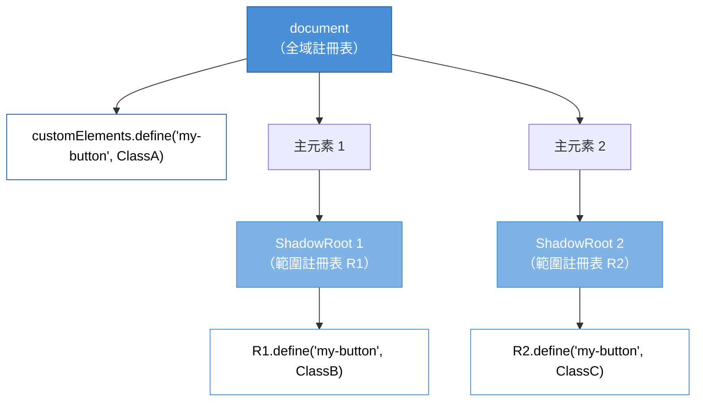

# [FEE-12001] Scoped Custom Element Registry

:::info
同一個自訂元素的多個版本可以共存於同一頁面，只要每個版本在各自 shadow root 的本地註冊表中註冊。這解決了自訂元素推出以來困擾微前端與 widget 函式庫整合的命名空間衝突問題。
:::

:::info Limited availability
撰寫時 Chromium 與 WebKit 已出貨。Firefox 實作進行中。在跨引擎可用性落地之前，本文涵蓋提案與 polyfill 路徑。
:::

## 背景

自訂元素於 2016 年登場，搭配的是可透過 `window.customElements` 取得的單一、文件層級全域 `CustomElementRegistry`。此註冊表是一份名稱到建構函式的對映，把 `<my-button>` 之類的標籤名對應到瀏覽器遇到該標籤時要實例化的類別。

每個自訂元素定義都爭奪同一個命名空間。呼叫一次 `customElements.define('my-button', ClassA)` 會為文件存續期間綁定此名稱。第二次 `define('my-button', ClassB)` 會拋出 `NotSupportedError`。註冊表採取「永不覆寫」規則：第一次註冊永久勝出。

全域註冊表在 2016 年對單擁有者頁面而言是合理的預設。擁有自身自訂元素的產品沒有擔心衝突的理由，因為它控制每一次 `define()` 呼叫。當時大部分正式環境程式碼都符合「一頁一作者」的假設。此設計對應於前標準 API `document.registerElement` 的工作方式——而該前標準 API 本身又仿照 2013-2015 年框架模式（Polymer、X-Tag），元件屬於應用作者所有。

隨著 Web 平台成熟，此假設不再成立。微前端架構讓獨立團隊部署共用文件但不共用建置管線的功能。Widget 與 SDK 供應商出貨可嵌入元件，須與其他供應商的元件並存於主頁。瀏覽器擴充功能注入 DOM，不可與頁面的自訂元素衝突。開發工具、分析函式庫、A/B 測試框架，甚至密碼管理器都會註冊自訂元素，而不知道主頁已註冊了什麼。每一種場景都打破全域註冊表所設計的單一作者假設。

Scoped Custom Element Registry 提案透過把註冊表由每文件概念變為每 shadow-root 概念來回應衝突問題。一個 shadow root 可攜帶自己的 `CustomElementRegistry`，由 `new CustomElementRegistry()` 建立。該 shadow root 內部的建構函式查找會先檢查範圍內註冊表。同一頁上的兩個 shadow root 可各自把 `<my-button>` 註冊為不同的類別，且各自 shadow root 內的 `<my-button>` 會解析到各自的本地定義。

WHATWG HTML Living Standard 的自訂元素段落現在描述了範圍註冊表變體。`CustomElementRegistry()` 建構函式（無引數）會建立新的範圍註冊表，並將其內部 `is scoped` 旗標設為真。`attachShadow()` 選項物件接受 `registry` 欄位，指向 `CustomElementRegistry` 實例；shadow root 內部的 `custom element registry` 便設為該註冊表。shadow root 內部的元素建立——透過 shadow root 自身的 `createElement`、`createElementNS` 或 `importNode` 方法，或透過帶有 `customElementRegistry` 選項的 `document.createElement`——會先查詢範圍註冊表。

提案在 WICG 經過數年演進才達到實作者共識。早期設計探索多個替代方案：與全域註冊表並存的「範圍註冊表」命名空間、每文件片段一個註冊表的作法、以及 `define()` 上的各種選入旗標。目前出貨的設計把註冊表附在 shadow DOM 上，因為 shadow DOM 已提供範圍查找所需的結構隔離邊界。重用既有邊界避免了發明新的範圍基本元素，這是提案作者視為指導原則的設計選擇。

各引擎的實作就緒度有所差異。Chromium 在分階段推出後以未設旗標方式出貨範圍註冊表，先引入建構函式、再是 `attachShadow` 選項，最後是 shadow-root 元素建立方法。WebKit 以類似分階段路徑跟進。Firefox 追蹤提案，實作工作進行中；實際出貨時程取決於與 DOM 和自訂元素實作團隊的協調。

## 情境

一個產品頁面嵌入了兩家不同供應商的 widget。供應商 A 的 widget 出貨 `<vendor-button>` 自訂元素，實作為帶有 A 品牌的點擊追蹤按鈕。供應商 B 的 widget 也出貨 `<vendor-button>` 自訂元素——相同標籤名、不同行為、不同內部狀態。產品頁的執行期先載入供應商 A 的 widget bundle；bundle 呼叫 `customElements.define('vendor-button', VendorAButton)`。當供應商 B 的 bundle 載入並呼叫相同的 `define` 時，註冊表拋出 `NotSupportedError`。

該拋出錯誤的執行期後果取決於供應商 B 如何撰寫初始化程式碼。若供應商 B 捕獲例外並繼續執行，供應商 B 的 widget 不會註冊，每個 `<vendor-button>` 在供應商 B 的 shadow tree 中都會呈現為沒有行為的未知 HTML 元素——空白的行內容器。若供應商 B 沒有捕獲，例外會沿呼叫堆疊向上傳播，可能完全讓供應商 B 的 bundle 初始化崩潰，端視 bundle 的結構而定。無論何種情況，供應商 B 的 widget 在供應商 A 先載入的頁面上都會停止運作。

在範圍註冊表出現前，產品團隊有三個平庸的選項來避開此崩潰：

**選項 1：跨供應商協調標籤名前綴。** 與雙方供應商約定供應商 A 用 `<vendor-a-button>`，供應商 B 用 `<vendor-b-button>`。協調成本高昂，且有第三家供應商加入時便崩壞。瞄準廣泛散佈的第三方 SDK 無法實際與每個落地的主頁協調；協調的單向性把負擔推給主頁。

**選項 2：iframe 隔離。** 將每個供應商載入 `<iframe>` 以取得真正的文件層級命名空間隔離。iframe 失去與主頁的共享狀態、產生額外 HTTP 請求（每個 iframe 都是一份新文件擷取）、破壞複製貼上的使用者流程，也無法擴展到有數十格的 widget 格柵。無障礙工具難以處理大量 iframe 的頁面，螢幕閱讀器需要額外標記才能順利朗讀 iframe 內容，iframe 邊界也會干擾主頁的捲動行為。

**選項 3：供應商每次發佈都為標籤名加版本。** 供應商 A 出貨 `<vendor-a-button-v12>` 與 `<vendor-a-button-v13>`；供應商 B 出貨 `<vendor-b-button-v8>`。兩個版本的供應商 A widget 可在執行期並存。但每次版本升級都變成需要協調的更名，名稱會洩漏進分析識別碼、CSS 選擇器、第三方整合，以及任何按標籤名查詢的作者端 JavaScript。複雜度隨每次發佈累積。

有了範圍自訂元素註冊表，產品團隊要求每家供應商把 widget 附到帶本地註冊表的 shadow root。供應商 A 呼叫 `host.attachShadow({ mode: 'open', registry: new CustomElementRegistry() })` 並在該註冊表上定義 `<vendor-button>`。供應商 B 在自己的主元素上做同樣的事。兩個 `<vendor-button>` 定義共存於文件中，各自在自己的 shadow root 內，各自擁有自己的類別、狀態與事件監聽器。供應商之間無需協調，版本升級時也無需更名。

整合契約變得更簡單。每家供應商的 widget 自成一體：擁有自己的 shadow root、註冊表，以及元素生命週期。主頁不需要知道各供應商內部使用什麼標籤名。供應商可以更改標籤名而無需與主頁協調，因為名稱永遠不會洩漏出 shadow root 的範圍。可攜元件散佈——原始 Web Components「一次撰寫、處處使用」的承諾——終於在多擁有者頁面中成立。

多供應商設計系統採用相同模式。每家供應商把元件以自我範圍化 widget 發佈，主頁在版面中拼接它們，無需觸及內部命名空間。設計令牌與主題變數透過 CSS custom properties（預設跨越 shadow DOM 邊界）流入。事件透過 shadow DOM 邊界向上冒泡並達到主頁的事件監聽器。整合表面是明確的：樣式進入、事件離開、命名空間隔離。

## 最佳實踐

在整合邊界使用範圍註冊表。組合獨立部署功能的微前端主機應把每個功能包在攜帶範圍註冊表的 shadow root 中。跑在不同團隊控制的主頁中的 widget SDK 應為其內部自訂元素建立自己的範圍註冊表。控制整個文件的頁面內模組（單擁有者應用）不需要範圍註冊表——全域註冊表對此情境更簡單也正確。

在倚賴範圍行為前進行功能偵測。所有非支援引擎都能通過建構函式存在檢查：`typeof CustomElementRegistry === 'function' && 'define' in CustomElementRegistry.prototype` 在所有引擎都為真，但只有支援的引擎允許 `new CustomElementRegistry()` 不拋錯。更嚴格的檢查是在建構函式呼叫外包上 try-catch。若範圍註冊表不可用，整合層應要求 polyfill，或為受影響元件退化到版本化標籤名。

透過 `attachShadow({ mode, registry })` 傳遞範圍註冊表。registry 選項是記錄過的 API 表面；不要 monkey-patch `document.createElement` 或透過其他手段攔截標籤解析。shadow root 自身的 `createElement`、`createElementNS` 和 `importNode` 方法會自動遵循範圍註冊表。

不要為了應用程式內部封裝而使用範圍註冊表。若你的程式碼庫使用 ES 模組，ES 模組範圍已提供所需的封裝；範圍註冊表只會為相同好處添加 shadow DOM 負擔。範圍註冊表解決的是多擁有者問題，不是模組邊界問題。

將範圍註冊表搭配 shadow DOM 樣式隔離。範圍註冊表讓元素定義隔離，但 CSS 繼承仍預設流入 shadow root。使用 `:host` 選擇器與 `adoptedStyleSheets` 避免主頁樣式覆寫 widget 樣式，或在適當時使用 `mode: 'closed'` 的明確 shadow root。

將同一個 `CustomElementRegistry` 實例傳給多個 `attachShadow` 呼叫，即可讓多個 shadow root 共享範圍註冊表。這對一個 widget 有多個主元素（如卡片格柵、分頁面板或虛擬化清單）的情境是慣用模式。使用共享註冊表的每個 `attachShadow` 會從同一個名稱到建構函式對映解析定義。

MUST NOT 從範圍 shadow root 內部倚賴全域註冊表。shadow root 內部呼叫 `customElements.get('vendor-button')` 的程式碼會取得全域定義，不是範圍定義。使用 shadow root 的本地註冊表參考——在支援引擎上可透過 `shadowRoot.customElements` 取得。

## 設計思維

### 平台為什麼需要此功能

2016 年自訂元素的設計對應到先於它的 `document.registerElement` 前標準 API。`document.registerElement` 本身仿照 2013-2015 年 Web 框架的自訂元素系統，當時大多數框架假設單擁有者頁面。Angular、Ember 與 Backbone 都把自訂元素當作頁面作者的新增，而非函式庫出貨的基本元素。全域註冊表符合該心智模型。

當自訂元素成為可攜元件基本元素時，心智模型改變了。Web Components 承諾 UI 元件「一次撰寫、處處使用」：函式庫可出貨 `<fancy-input>` 自訂元素、在 npm 上發佈，任何消費者都可使用。該承諾只有在發佈 `<fancy-input>` 的兩個函式庫可共存時才成立。全域註冊表讓這種共存不可能；唯一的解法是跨整個 Web 協調標籤名，而這無法規模化。

微前端讓共存問題變得尖銳。整合獨立部署團隊功能的頁面正是自訂元素未為之設計的多擁有者情境。平台提供的選項——iframe 或標籤名協調——都對整合施加結構成本。範圍註冊表透過把元件與全域命名空間解耦，恢復了「可攜元件」的承諾。

2016 年（自訂元素）與範圍註冊表落地（2025-2026）之間的延遲反映了多擁有者痛點需要多久才能顯著到足以支撐規格工作。早期 Web Components 推動者假設註冊表會保持簡單；當微前端模式穩定、iframe 替代方案的痛點累積後，範圍註冊表的設計空間才具體到足以出貨。

### 提案中的設計決策

提案刻意限制範圍所觸及的層面。範圍註冊表僅隔離元素定義命名空間——不會建立新的 CSS 選擇器範圍、新的焦點範圍，或新的事件重新定向範圍。那些由 shadow DOM 本身處理（透過 `::part` 與 `:host` 作 CSS 範圍，透過 shadow DOM 焦點邊界作焦點）。範圍註冊表搭在 shadow DOM 既有的邊界上。

API 在 shadow-root 建立時附上註冊表，而非元素建立時。shadow root 要嘛有範圍註冊表（`attachShadow` 時傳入），要嘛使用文件的全域註冊表（沒有 `registry` 選項）。這讓範圍在靜態上可見——程式碼讀者只要看 `attachShadow` 呼叫就知道適用哪個註冊表，無需追蹤元素建立。

建構函式查找維持全域。若消費者在 shadow root 外呼叫 `new VendorButton()`（類別建構函式本身），元素會針對全域註冊表實例化——而全域註冊表可能沒有該類別。這是刻意的限制：提案作者選擇不為範圍註冊表建立新的建構函式解析路徑，使實作表面保持精簡。實務上，shadow root 內的程式碼使用 shadow root 的 `createElement` 方法，shadow root 外的程式碼不會伸入 shadow 的元素類型系統。

`define` 方法的衝突語意原樣沿用。定義註冊表中已存在的名稱會拋出 `NotSupportedError`，無論註冊表為全域或範圍。兩個範圍註冊表可各自獨立定義同一名稱，因為它們是擁有各自名稱到建構函式對映的獨立註冊表物件。

### 生態系如何橋接差距

`@webcomponents/scoped-custom-element-registry` polyfill 是生態系為缺少原生支援之引擎提供的橋接。此 polyfill 實作建構函式、`attachShadow` 選項與範圍查找行為，與更廣泛的 webcomponents polyfill 集合並存。polyfill 策略是攔截 `attachShadow`，並改寫範圍根內的元素建立，讓標籤名解析到範圍定義。

polyfill 有記錄中的限制。在某些引擎上，針對 shadow root 內原始標籤名撰寫的 CSS 規則可能不會匹配範圍改寫後的元素，因為 polyfill 的改寫策略在 DOM 建構時把標籤名替換為前綴變體。polyfill 作者建議範圍元素使用 `:host` 與 part 選擇器而非標籤選擇器，這本來就符合 shadow-DOM 最佳實踐。DevTools 顯示前綴後的名稱而非原始名稱，除錯時稍微多些雜訊。

出貨範圍註冊表感知元件的框架作者可以偵測支援，僅在可用時使用原生 API。同時支援原生與 polyfill 路徑的元件在載入時檢查建構函式；若為原生，使用 `attachShadow` 的 `registry` 選項；若為 polyfill，倚賴 polyfill 的攔截路徑；若兩者皆無，退化到版本化標籤名或警告消費者。

Lit、Stencil 與 Angular Elements 都追蹤提案。每個框架與自訂元素註冊各有關係：

- **Lit** 透過 `@customElement(name)` 裝飾器或命令式 `customElements.define` 呼叫宣告式註冊類別。範圍註冊表感知的 Lit 整合會在元件類別層級或 shadow-root 建立邊界暴露註冊表。
- **Stencil** 在建置時把元件類別編譯為註冊呼叫。範圍註冊表支援需要建置時訊號（裝飾器選項或執行期選入），告訴 Stencil 把目標指向範圍註冊表而非全域。
- **Angular Elements** 透過 `createCustomElement` 把 Angular 元件包裝為自訂元素。該包裝器預設註冊到全域註冊表；範圍註冊表感知的包裝器會接受明確的註冊表引數。

承諾範圍註冊表優先整合的框架——在其元件 API 中暴露範圍註冊表 API——可以將多擁有者安全的組合作為一等功能而非盡力配置。

### 註冊表共享與繼承

屬於同一邏輯範圍的 shadow root 可共享單一範圍註冊表。把同一個 `CustomElementRegistry` 實例傳給多個 `attachShadow` 呼叫，是一個 widget 有多個主元素（卡片格柵、分頁面板、虛擬化清單）時的慣用模式，每個主元素想要相同的元素定義可用。

範圍註冊表不繼承自全域註冊表。在全域註冊表定義 `<my-button>` 不會讓它在範圍根內可用，除非範圍註冊表也定義它。這是刻意的設計選擇：繼承會重新引入範圍原本要解決的名稱衝突問題。想存取全域定義元素的範圍根必須透過 `document.createElement` 查找，或匯入類別並在範圍註冊表重新註冊。

非繼承規則影響整合模式。同時使用主應用設計系統元件（全域註冊）與自身私有元件（範圍註冊）的微前端必須在兩個註冊表都定義設計系統元件，或透過主文件 API 而非 shadow root API 建立設計系統元素。

### 效能特性

範圍註冊表執行期成本極小。shadow root 內的查找路徑先檢查範圍註冊表，再退化到全域註冊表，每次元素建立加上常數時間的對映查找。記憶體負擔是每個範圍 shadow root 一個註冊表物件，加上其名稱到建構函式對映。

主要成本是 shadow DOM 本身。擁有數百個範圍 shadow root 的頁面承擔一般 shadow-DOM 負擔：額外 DOM 節點、額外樣式重新計算範圍、額外事件重新定向工作。範圍註冊表不在 shadow DOM 既有成本上加上新成本——它重用 shadow-DOM 邊界而非引入平行範圍。

正在針對範圍註冊表密集頁面做效能分析的團隊應先聚焦 shadow DOM 指標（shadow-root 計數、shadow tree 總深度、樣式 recalc 時間），只有在 shadow DOM 本身不是瓶頸時才調查範圍註冊表行為。實務上，shadow DOM 主導。

### 為什麼不是宣告式註冊？

提案刻意讓註冊維持命令式——`registry.define(name, class)`——而非宣告式。宣告式替代方案會讓 shadow root 的模板字串宣告使用哪些元素（例如 `<template registry="vendor-a-button=VendorAButton">...</template>`），由瀏覽器自動設置註冊表。

WICG 討論過宣告式註冊並予以棄用，理由有幾個。第一，JavaScript 類別是註冊單位，而類別無法存活於 HTML 標記中。命令式 API 對應到自訂元素定義來自 JavaScript 模組的現實。第二，宣告式註冊需要一套用於類別參考的新 HTML 語法，規格負擔顯著，且與模組匯入冗餘。第三，既有元件函式庫已有命令式註冊模式；強迫它們改為宣告式會破壞多年正式環境程式碼的相容性。

命令式 API 付出小成本——消費者必須記得呼叫 `define`——換取與既有生態系的一致。框架轉接器（Lit、Stencil、Angular Elements）可以在命令式 API 之上為其元件定義疊加宣告式包裝，這才是宣告式人體工學的正確位置。

### 與宣告式 shadow DOM 的互動

宣告式 shadow DOM（`<template shadowrootmode>`）目前沒有記錄中的路徑可附加範圍註冊表，因為宣告式語法無法參考 JavaScript 註冊表物件。使用宣告式 shadow DOM 做伺服器渲染 shadow tree 的頁面對這些根退化到全域註冊表。

範圍註冊表與宣告式 shadow DOM 互補但獨立。一個頁面可同時使用兩者：某些 shadow root 宣告式附加並使用全域註冊表；其他透過 `attachShadow({ registry })` 命令式附加並使用範圍註冊表。未來提案可能透過為宣告式 shadow DOM 加上註冊表參考屬性來統一兩者，但那不是目前範圍註冊表提案的一部分。

## 圖解



三個獨立的 `my-button` 定義共存於同一份文件中。全域註冊表綁定 `ClassA`。Shadow root 1 攜帶註冊表 R1 綁定 `ClassB`。Shadow root 2 攜帶註冊表 R2 綁定 `ClassC`。Shadow root 1 內的元素查找透過 R1 解析；shadow root 外的元素查找透過全域註冊表解析；shadow root 2 內的元素查找透過 R2 解析。三個註冊表互不干擾。

## 範例

兩個 widget 將自身的 `<vendor-button>` 註冊到不同的範圍註冊表。兩個 widget 在主頁並排渲染，行為不同，證明定義不會衝突。

```html
<!DOCTYPE html>
<html>
<head><meta charset="utf-8"><title>範圍註冊表示範</title></head>
<body>
<div id="slot-a"></div>
<div id="slot-b"></div>
<script type="module">
// 供應商 A 的 widget 模組
class VendorAButton extends HTMLElement {
  connectedCallback() {
    this.innerHTML = '<button style="background:#4A90D9;color:#fff">A</button>';
    this.addEventListener('click', () => console.log('供應商 A 點擊'));
  }
}

const registryA = new CustomElementRegistry();
registryA.define('vendor-button', VendorAButton);

const hostA = document.getElementById('slot-a');
const shadowA = hostA.attachShadow({ mode: 'open', registry: registryA });
shadowA.innerHTML = '<vendor-button></vendor-button>';

// 供應商 B 的 widget 模組
class VendorBButton extends HTMLElement {
  connectedCallback() {
    this.innerHTML = '<button style="background:#D94A4A;color:#fff">B</button>';
    this.addEventListener('click', () => console.log('供應商 B 點擊'));
  }
}

const registryB = new CustomElementRegistry();
registryB.define('vendor-button', VendorBButton);

const hostB = document.getElementById('slot-b');
const shadowB = hostB.attachShadow({ mode: 'open', registry: registryB });
shadowB.innerHTML = '<vendor-button></vendor-button>';
</script>
</body>
</html>
```

點擊 A 按鈕記錄「供應商 A 點擊」；點擊 B 按鈕記錄「供應商 B 點擊」。兩個按鈕具有相同標籤名、活在同一份文件中，且不會衝突，因為各自透過自身範圍註冊表解析。沒有範圍註冊表，全域註冊表上的第二次 `define` 呼叫會拋錯，供應商 B 的 `<vendor-button>` 會呈現為未知元素。

## 常見陷阱

幾個看似正確但在範圍註冊表感知程式碼中會壞掉的模式。

**從外部伸入範圍根。** 在主頁執行並呼叫 `document.querySelector('vendor-button')` 的程式碼只會取得位於 light DOM 的元素，不會取得任何 shadow root 內的元素。主頁腳本無法透過全域選擇器觸及範圍根內元素；必須明確走入 shadow root。這是標準 shadow DOM 行為，但範圍註冊表讓它更明顯，因為範圍根元素在全域註冊表的命名空間中根本不存在。

**透過類別建構函式實例化。** 直接呼叫 `new VendorAButton()` 而不經 shadow root 的 `createElement`，會建立一個其標籤解析預設為全域註冊表的元素實例。若類別未全域註冊，該元素最終會變為未知 HTML 元素，儘管擁有正確的建構函式。務必透過範圍 shadow root 的 `createElement`（或支援引擎上帶 `customElementRegistry` 選項的 `document.createElement`）實例化。

**為同一名稱混用全域與範圍定義。** 主機全域定義 `<my-button>` 然後建立同樣定義 `<my-button>` 的範圍根，在支援引擎上能正常運作，但非繼承規則意味範圍根內的元素渲染範圍類別，而範圍根外的元素渲染全域類別。不知道範圍根存在的程式碼讀者看到同一標籤名在頁面不同部分產生不同行為時會困惑。明確記錄邊界。

**不搭配 shadow DOM 使用範圍註冊表。** API 把註冊表附到 shadow root；沒有頂層 `document.registerScoped` 或等價物。想要每模組隔離的頁面必須使用 shadow DOM 建立邊界。試圖不用 shadow DOM 而範圍化註冊的變通作法（例如透過 `MutationObserver` 攔截）不符合原生語意，且會產生邊緣案例。

**期望 CSS 選擇器隨註冊表範圍化。** 範圍註冊表隔離元素定義命名空間，不是 CSS 選擇器。在主頁樣式表定義的 `vendor-button { color: red }` 規則不會觸及範圍 shadow root（因為 shadow DOM 隔離樣式），但在範圍根內，任何 `vendor-button` 選擇器會匹配該標籤的範圍元素，也可能匹配全域定義的元素。樣式範圍是 shadow DOM 的工作，不是註冊表的。

## 遷移指南

把既有函式庫或 widget 從全域註冊表遷移到範圍註冊表，遵循一致的模式。

**步驟 1：盤點目前的註冊。** 列出程式碼庫中每個 `customElements.define` 呼叫及其執行範圍。在模組匯入時發生的註冊（匯入模組的頂層程式碼）風險最高——它們在整合邊界設置前執行。

**步驟 2：把註冊移入整合邊界。** 把頂層 `customElements.define` 呼叫重構為 widget 初始化時執行的函式。函式接受目標註冊表作為引數，在支援引擎上呼叫 `registry.define`（而非 `customElements.define`），或在非支援引擎上退回全域註冊表。

**步驟 3：取代內部 `document.createElement` 呼叫。** 在 widget 的 shadow tree 內部，把 `document.createElement('vendor-button')` 換為 `shadowRoot.createElement('vendor-button')`。shadow root 的 `createElement` 透過範圍註冊表解析；文件的則透過全域解析。

**步驟 4：更新標籤名查詢。** 把尋找 widget 元素的 `document.querySelector` 呼叫替換為 `shadowRoot.querySelector` 呼叫。從文件層級查詢仍可取得主元素的 light-DOM 後代，但對 shadow root 內的元素會回傳空。

**步驟 5：同時測試有與沒有範圍註冊表支援。** widget 必須在兩種模式下表現相同。在 Chromium（原生支援）、polyfill 環境（polyfill 語意）與明確停用 polyfill（全域註冊表退化）中測試。

**步驟 6：記錄整合契約。** 發佈 widget 預期的註冊表形狀。消費者需要知道 widget 是否接受註冊表引數、是否自己建立，或是否需要 polyfill。把契約作為 widget 公開 API 的一部分。

## 除錯筆記

範圍註冊表改變開發者在瀏覽器 DevTools 看到的內容。

DevTools 的 Elements 面板依註冊時的名稱顯示標籤名。範圍 shadow root 內，在範圍註冊表註冊的 `<vendor-button>` 在面板中顯示為 `<vendor-button>`——與全域註冊元素相同。面板不標註哪個註冊表解析了標籤。要判定使用中的註冊表，檢視 shadow root 的主元素，並在 console 檢查 `shadowRoot.customElements`（或祖先的等價物）。

Console 面板的 `$0.customElementRegistry`（或 shadow root 內元素的 `$0.getRootNode().customElements`）回傳解析該元素的註冊表。當元素行為與預期不符時，這是主要除錯入口。

polyfill 活動時，Elements 面板中的標籤名可能顯示為改寫過的形式——polyfill 範圍根內的 `vendor-button` 顯示為 `scoped-1-vendor-button` 或類似前綴形式。這是預期的 polyfill 行為。改寫在註冊表存續期間穩定，因此中斷點與選擇器查詢繼續運作，但視覺雜訊是真實的。

Source map 與堆疊追蹤參考類別名稱（`VendorAButton`）而非標籤名。console 中的堆疊追蹤顯示類別建構函式在原始碼中的位置，不是標籤註冊位置。在 `connectedCallback` 設置的中斷點按實例觸發，與註冊表範圍無關。

在開發期驗證註冊表隔離最簡單的方式是一個小探針：附上帶範圍註冊表的 shadow root，嘗試定義與全域註冊名稱衝突的名稱，確認兩次 `define` 呼叫都不會拋錯。若範圍 `define` 拋錯，引擎的範圍註冊表支援不完整或 polyfill 未載入。

CI 層的回歸檢查把探針包進自動化測試，對專案目標瀏覽器矩陣執行。瞄準多個引擎的團隊應在任一目標引擎上探針失敗時讓建置失敗，強迫整合路徑載入 polyfill 或退化到版本化標籤名。探針不到一毫秒即可完成，自然融入既有元件函式庫的測試套件。

## 瀏覽器支援與退化

撰寫時（2026 年 4 月），MDN 回報 `CustomElementRegistry()` 建構函式為「Limited availability」——Chromium 系瀏覽器（Chrome、Edge）與 WebKit（Safari）出貨，Firefox 旗標或實作中。狀態將持續演進；讀者在投入正式環境策略前應對照 MDN 與 caniuse 驗證目前支援。

三條退化路徑涵蓋 Baseline 前的時間窗：

1. **Polyfill。** 安裝 `@webcomponents/scoped-custom-element-registry` 並在頁面生命週期中儘早載入。polyfill 攔截 `attachShadow` 並加上範圍查找路徑。接受 polyfill 的取捨（標籤名改寫、DevTools 雜訊），以換取跨引擎一致的 API。

2. **版本化標籤名。** 在你控制的整合邊界上，讓每家供應商為標籤名加上版本前綴：`<vendor-a-button-v1>`、`<vendor-b-button-v2>`。今日所有引擎都可運作，但版本改動會洩漏進每位消費者對該標籤的參考。

3. **iframe 隔離。** 對無法容忍任何協調的 widget，`<iframe>` 為每個 widget 提供自己的文件與自己的全域註冊表。接受額外 HTTP 請求、失去主狀態共享與無障礙摩擦，換取完全隔離。

依整合形狀挑選。受信任的第一方微前端可以 polyfill。瀏覽器多樣消費者基礎的第三方 SDK 可能偏好版本化標籤名。無須共享狀態的安全敏感 widget 可用 iframe。

混合策略在可用處使用原生支援，不可用處優雅退化。widget 初始化程式碼偵測範圍註冊表支援；支援引擎上建立範圍註冊表並註冊類別；非支援引擎退化到帶前綴標籤名的全域註冊。widget 的公開 API 兩邊相同——主頁看不到差異。這是 Baseline 過渡視窗內函式庫作者應預設採取的策略。

此功能的 Baseline 過渡預計跨越 2026-2027 年，隨 Firefox 出貨。早期採用的函式庫可以只出貨單一程式碼路徑，但主頁支援矩陣仍混合。務實的政策：在 widget 初始化邊界做功能偵測，並在退化時記錄觀測訊號，讓作者可以追蹤實際流量中各路徑的比例。當觀測訊號降至門檻以下，函式庫作者可以退休退化路徑並要求原生支援。

觀測性也關乎偵測 polyfill 漂移。polyfill 由 webcomponents 社群維護，更新追隨規格；偶發與原生語意的行為偏差會在邊緣案例顯現。與 shadow root 建立一同記錄 polyfill 存在的 widget 給作者資料，讓他們可以把 bug 報告與 polyfill 版本關聯。

## 內部參考

- FEE-12000 — HTML 與 DOM 提案的父總覽
- FEE-12002 — 閱讀順序中的下一篇子文章（Document Picture-in-Picture）
- FEE-12003 — 此範圍的第三篇子文章（Speculation Rules）

## 參考資料

1. [WHATWG HTML Living Standard — custom elements](https://html.spec.whatwg.org/multipage/custom-elements.html#customelementregistry) — `CustomElementRegistry` 建構函式與 `attachShadow` registry 選項的規範性說明。
2. [WICG Scoped Custom Element Registries proposal](https://github.com/WICG/webcomponents/blob/gh-pages/proposals/Scoped-Custom-Element-Registries.md) — 解釋動機、API 與關鍵決策的設計提案。
3. [MDN — `CustomElementRegistry` constructor](https://developer.mozilla.org/en-US/docs/Web/API/CustomElementRegistry/CustomElementRegistry) — API 參考與 Baseline 可用性註記。
4. [`@webcomponents/scoped-custom-element-registry` polyfill (webcomponents/polyfills)](https://github.com/webcomponents/polyfills/tree/master/packages/scoped-custom-element-registry) — 為缺少原生支援之引擎提供的生態系 polyfill 套件。
5. [MDN — `CustomElementRegistry.define`](https://developer.mozilla.org/en-US/docs/Web/API/CustomElementRegistry/define) — `define` 方法參考，涵蓋全域與範圍註冊表相同的衝突行為。
