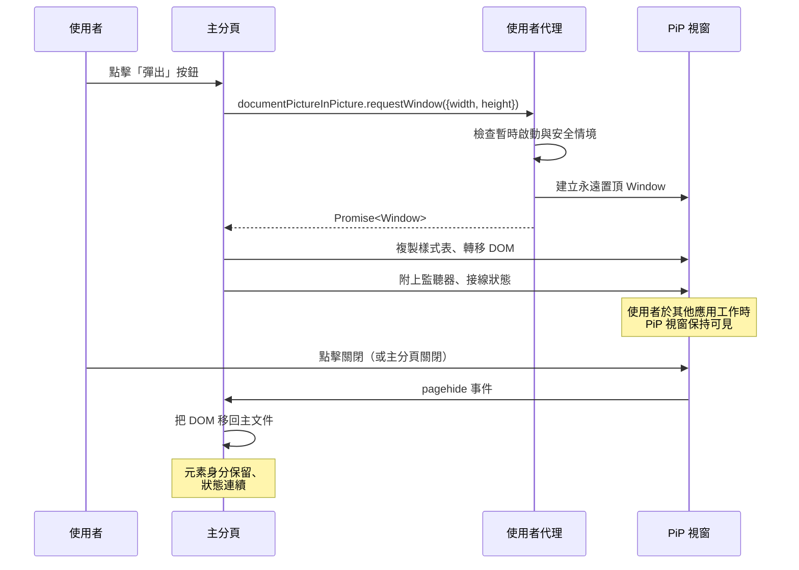

# [FEE-12002] Document Picture-in-Picture

:::info
將整份 HTML 文件放入浮動、永遠置頂的視窗，讓使用者在切換到另一個應用程式時仍能看到會議成員格柵、播放控制條或任務清單。此 API 涵蓋全文件 PiP，而非其前身的僅限影片 PiP。
:::

:::info Limited availability
Chromium 系瀏覽器（Chrome 116+、Edge）已出貨。Safari 與 Firefox 追蹤實作。在跨引擎可用性落地之前，本文涵蓋提案、Chromium 實作與退化策略。
:::

## 背景

既有的 `HTMLVideoElement.requestPictureInPicture()` API 只處理一個場景：把 `<video>` 元素彈出到浮動的永遠置頂視窗。瀏覽器在 2017-2020 年間出貨影片 PiP，因為串流媒體應用是需求驅動者，而影片元素是容易處理的範圍——單一元素、單一播放狀態、沒有導航顧慮。

Document Picture-in-Picture 擴大了範圍。`documentPictureInPicture.requestWindow({ width, height })` 回傳完整的 `Window` 物件。頁面可以在其 `document` 中加上任何 DOM——成員格柵、聊天面板、程式碼編輯器、任務清單，作者想在使用者切換焦點時持續看到的任何東西。PiP 視窗不限於媒體；它是通用的永遠置頂表面。

此功能位於 `window.documentPictureInPicture`（全域存取器），並受使用者啟動與安全情境限制。想要開啟 PiP 視窗的頁面在 click 處理器或其他使用者發起的回呼中呼叫 `documentPictureInPicture.requestWindow({ width: 400, height: 300 })`；若呼叫時沒有暫時啟動，呼叫會以 `NotAllowedError` 拒絕。安全情境需求意味著只能在 HTTPS 上。

回傳的 `Window` 物件是同源瀏覽情境。頁面可以像處理任何其他 window 參考一樣存取它：透過 `pipWindow.document.head.appendChild(style)` 加上樣式表、透過 `pipWindow.document.body.appendChild(element)` 轉移 DOM、附加事件監聽器、讀取 `pipWindow.innerWidth` 和 `innerHeight`。PiP 視窗與開啟者共用 JavaScript 堆積，所以把元素從主文件移到 PiP 文件不需要序列化——節點的身分與附加監聽器都能存活。

規格限制 PiP 視窗可以做什麼。視窗無法導航；在 PiP 文件內設定 `location.href` 會拋錯或被忽略。PiP 視窗無法進入全螢幕；fullscreen API 在其內停用。網站無法以程式方式重新定位視窗（`moveTo`、`moveBy` 無效），因為使用者代理擁有視窗位置。PiP 視窗「絕不比開啟視窗存活更久」——關閉主分頁會自動關閉 PiP 視窗。

此設計位於 WICG 並有 Chromium 的實作者興趣。Chrome 116 在桌面出貨 Document PiP，該功能在後續發佈中保持穩定。Safari 的 WebKit 與 Firefox 的 Gecko 追蹤此提案；撰寫時（2026 年 4 月），兩者都未以未設旗標方式出貨。提案本身已成熟——API 表面自 Chrome 初始出貨以來實質上未改變——但跨引擎可用性差距讓此功能留在前穩定範圍。

目前的規格狀態不再包含早期提案版本中描述的 `copyStyleSheets` 選項。開發者必須手動複製樣式表，透過迭代 `document.styleSheets` 並把規則序列化為 `<style>` 標籤，或複製 `<link rel="stylesheet">` 標籤到 PiP 文件。移除此選項的動機是觀察到大部分應用想要部分樣式表轉移（限於 PiP 內容），而非整份文件鏡射；讓複製變為明確強迫作者思考哪些樣式跨越邊界。

## 情境

視訊會議 Web 應用在通話時顯示成員格柵、字幕覆蓋層與最小控制。當使用者切換到另一個應用做筆記時，瀏覽器分頁失去可見空間——即使有平鋪視窗管理器，分頁的視埠也不再捕獲使用者的目光。沒有 Document PiP，使用者要嘛容忍看不見的通話分頁，要嘛在應用與筆記間分割螢幕空間。

2018 年的僅限影片 PiP 無法解決此問題。`HTMLVideoElement.requestPictureInPicture()` 可以彈出單一 `<video>` 元素——可能是目前發言者的串流——但失去成員格柵、字幕、舉手指示器與靜音按鈕。使用者取得一位可見發言者，但沒有會議的任何其他情境狀態。

有了 Document Picture-in-Picture，應用建構第二個包含成員格柵、字幕與控制的 DOM tree，並轉移到 PiP 視窗。使用者的筆記應用取得主焦點；成員格柵在浮動的永遠置頂視窗中保持可見。字幕透過與主分頁相同的事件串流即時更新。使用者可以透過 PiP 控制靜音自己，無需把焦點切回主分頁。

API 形狀讓轉移具體化。應用在使用者點擊「彈出」按鈕的 click 處理器中呼叫 `documentPictureInPicture.requestWindow({ width: 400, height: 300 })`。回傳的 `Window` 參考空白的同源文件。應用把共用樣式表複製到 PiP 文件的 `<head>`，然後把成員格柵元素從主文件移到 `pipWindow.document.body`。元素的事件監聽器、React 狀態綁定與影片串流附加都會跟隨。主分頁的成員格柵槽位可以變空，也可以換為「在 PiP 中檢視」的佔位符。

當使用者關閉 PiP 視窗時——透過視窗 chrome 的關閉按鈕或 `pipWindow.close()`——`pagehide` 事件在 PiP 視窗觸發。應用監聽此事件並把成員格柵元素移回主文件，恢復分頁內檢視。因為元素的身分穿越 PiP 旅程後保留，React 的 reconciliation、影片串流的附加與字幕的訂閱都從原處繼續；不會重新掛載。

## 最佳實踐

在倚賴 Document PiP 前進行功能偵測。在要使用此功能的地方檢查 `'documentPictureInPicture' in window`。非支援引擎對此存取器回傳 `undefined`；在非支援引擎上呼叫 `documentPictureInPicture.requestWindow` 的任何程式碼路徑會拋 `TypeError`。

僅在使用者啟動的事件處理器內呼叫 `requestWindow`。自發性呼叫（計時器回呼、microtask、fetch 完成處理器）會以 `NotAllowedError` 拒絕。使用者啟動需求是一道安全守門——瀏覽器不讓任意頁面在使用者沒有要求時彈出永遠置頂視窗。UI 入口必須接到點擊、按鍵或其他使用者手勢。

手動複製樣式表。迭代 `document.styleSheets`，把 `cssRules` 序列化到 `<style>` 標籤，並附到 `pipWindow.document.head`。對於 `cssRules` 存取會拋錯的跨來源 `<link>` 樣式表（跨來源樣式表的安全模型），把 `<link>` 元素本身複製到 PiP head，讓 PiP 視窗重新抓取樣式表。`copyStyleSheets` 規格選項已不存在；手動模式是目前的標準作法。

處理 PiP 視窗的 `pagehide`。當使用者透過視窗 chrome 關閉 PiP 視窗、主分頁關閉（自動關閉 PiP）或應用呼叫 `pipWindow.close()` 時，此事件觸發。使用 `pagehide` 作為把轉移元素還回主文件的掛鉤。

不要在 PiP 視窗內導航。PiP 文件無法重新定向。嘗試設定 `location.href` 或送出會導航 PiP 文件的表單會被忽略或關閉視窗。把 PiP 內容建為命令式建構的 DOM tree，而非 URL。

不要倚賴視窗定位。PiP 視窗的 `moveTo`、`moveBy` 與 `resizeTo` 由使用者代理控制。在 `requestWindow` 時透過 `width` 與 `height` 選項請求大小；UA 選擇最終位置，可能會調整尺寸。

為非支援引擎提供退化 UI。一個什麼都不做的「彈出」按鈕是壞掉的 UX。在非支援引擎上，要嘛完全隱藏按鈕（在渲染時功能偵測），要嘛退化到分離的 `window.open()`（失去永遠置頂），或頁面內可拖曳的浮動面板。

保護開啟者關係。`disallowReturnToOpener` 選項設為 true 時，防止 PiP 視窗導航回開啟者。若 PiP 內容不應能把使用者從主分頁重新定向，請設定此選項。多數使用情境下預設值（允許返回）沒問題，但嵌入不受信任使用者內容的會議應用可能想要更嚴格的設定。

MUST NOT 把 Document PiP 用於建立通知、彈出或廣告。使用者代理拒絕濫用模式，永遠置頂的性質讓侵入式覆蓋層特別糟糕。此功能是為使用者主動想看到的內容設計。

## 設計思維

### 平台為什麼需要此功能

影片 PiP 範圍狹窄，因為串流媒體使用情境在 2017-2020 年主導需求曲線。Netflix、YouTube 與視訊會議產品都想要在使用者多工時保持影片可見，單一元素 API 是該目的的最小可行原語。

此限制在 Web 應用演進成多面板表面後變成瓶頸。視訊會議是最尖銳的例子：一場通話不是一個影片——而是成員格柵、字幕、聊天、舉手指示器、螢幕分享預覽與靜音控制。通話時彈出影片串流的使用者失去所有其他情境。即時編碼串流面對相同問題——觀看編碼示範的使用者想要程式碼、輸出與聊天，不只是直播者的網路攝影機。

Document PiP 把「一個影片」一般化為「一份文件」。文件是頁面作者已用來組織 UI 的單位，所以 API 對應到既有的程式設計模型。作者無需把 UI 分解為媒體元素才能使用 PiP；他們可以轉移相關子樹。

從初始提案到 Chrome 出貨花了數年規格工作，因為設計空間有真實的安全張力。任何頁面都能開啟的永遠置頂視窗是釣魚向量——使用者可能相信 PiP 視窗是系統對話框。規格以來源可見性需求（PiP 視窗在 chrome 顯示開啟者的來源）、使用者啟動需求（使用者必須有要求）與不可導航規則（PiP 開啟後不能被劫持）解決此問題。

### 為什麼不直接用 window.open()？

配置小視窗的 `window.open()` 是 PiP 前最接近的原語。彈出視窗可以顯示在主內容旁的小視窗。但彈出視窗不是永遠置頂——聚焦到另一個應用會隱藏它們。Document PiP 的永遠置頂行為是讓此 API 值得引入的關鍵差異。

macOS、Windows 與 Linux 的視窗管理器都把「永遠置頂」作為視窗屬性暴露，桌面應用（Slack、Zoom、OBS）例行使用。Web 平台沒有暴露它，因為天真地暴露會招致濫用。Document PiP 的護欄（使用者啟動、安全情境、來源可見性、每分頁單一視窗、不可導航）是讓永遠置頂足夠安全到能在 Web 上出貨的設計取捨。

### API 形狀決策

`requestWindow` 方法取單一選項字典（`{ width, height, disallowReturnToOpener, preferInitialWindowPlacement }`）。字典模式是向前相容 API 的現代 Web 平台慣用法——新選項可加入而不破壞既有呼叫站。

寬度與高度必須同時指定或同時不指定。只指定一個會拋 `RangeError`。配對規則避免「我該怎麼處理另一個維度」的模糊（預設正方形？保留比例？），強迫作者思考兩個維度。預設（無寬高）讓使用者代理選擇合理大小，這也是有效且常見的選擇。

`disallowReturnToOpener` 是嵌入第三方內容的應用的安全守門。建構 PiP 內容自使用者產生輸入的頁面（例如協作應用中的分享筆記）可以設定此旗標，讓 PiP 無法導航回開啟者的來源。預設為 false 以維持向後相容，以及應用作者信任 PiP 內容的常見情境。

`preferInitialWindowPlacement` 是給使用者代理關於 PiP 視窗放置位置的提示。UA 沒有義務遵循；該旗標是偏好，不是命令。這反映使用者代理擁有視窗放置的設計原則，而不是頁面。

### 生態系如何橋接差距

沒有有效的 polyfill。永遠置頂行為是 JavaScript 無法模擬的作業系統層級視窗能力。宣稱「polyfill PiP」的函式庫要嘛用 `window.open()`（失去永遠置頂），要嘛渲染頁面內浮動面板（失去作業系統層級彈出）。

功能偵測是實務上的橋接。想在可用時使用 Document PiP、其他情況優雅退化的應用，把程式碼結構成執行期分支：

- **支援引擎**：呼叫 `documentPictureInPicture.requestWindow`、轉移 DOM、接線 `pagehide`。
- **非支援引擎**：退化到限於主分頁視埠的頁面內浮動面板，或完全隱藏彈出入口。

框架才剛開始加入 Document PiP 支援。React 函式庫如 `react-document-picture-in-picture` 與 Vue 對應物把生命週期（請求、轉移、拆除）包裝成元件友善 API。這些包裝器讓元件 tree 透過 portal 渲染到 PiP 視窗，對應到框架既有的跨邊界渲染模型。

伺服器端渲染不適用——Document PiP 是命令式的、僅執行期的功能。使用 SSR 的應用必須在 hydration 後於客戶端渲染 PiP 內容。

### 與影片 PiP 的互動

Document PiP 與影片 PiP 共存；互不替代。頁面可用影片 PiP 於單影片場景，用 Document PiP 於多元素場景。兩個 API 不合成——頁面在同分頁中不能同時開啟兩者；在影片 PiP 啟動時開啟 Document PiP 會先關閉影片 PiP。

從影片 PiP 遷移到 Document PiP 的作者通常把 `<video>` 元素轉移到 Document PiP 視窗中，而非另行呼叫影片 PiP。`<video>` 元素的身分穿越轉移後保留，所以播放狀態、媒體串流附加與任何已附監聽器繼續運作。這是偏好遷移路徑，因為它讓作者控制 PiP 周圍版面（字幕、控制、成員資訊），而影片 PiP 無法提供。

### 效能考量

Document PiP 在同分頁程序中執行兩份文件。Layout 與 paint 在兩邊發生，style recalc 在兩邊發生，JavaScript 事件迴圈在兩邊執行。成本隨 PiP 內容複雜度擴大；有十個影片串流的成員格柵比靜態文字面板更昂貴。

把重量級內容彈入 PiP 的團隊應分析 PiP 前與 PiP 中狀態，測量差異。常見瓶頸是冗餘工作：主文件持續更新已轉移到 PiP 的成員格柵，把 CPU 花在主分頁中不再可見的元素上。

緩解方式是在元素存活於 PiP 期間暫停主文件對轉移子樹的工作。主文件的 `visibilitychange` 監聽器在 PiP 開啟時不會觸發——主分頁仍可見——所以作者必須明確發出轉換訊號。追蹤元素目前是否在 PiP 中（開啟時設定的布林旗標，`pagehide` 時清除），並根據該旗標控制子樹的更新迴圈。

轉移的 `<video>` 元素中的影片串流在 PiP 視窗以全品質繼續渲染。沒有自動降級。想在 PiP 期間減少頻寬的應用（因為 PiP 視窗小，全解析度串流浪費）必須透過 `applyConstraints` 或伺服器端串流切換手動降取樣。

### 安全模型

PiP 視窗在其視窗 chrome 中攜帶開啟者的來源，所以使用者可以看到哪個站點顯示浮動內容。這是主要反釣魚守門——頁面無法把 PiP 視窗偽裝為系統對話框或別的站點 UI，因為使用者代理控制 chrome。

永遠置頂行為受使用者啟動控制，所以頁面無法用浮動視窗驚擾使用者。瀏覽器也限制 PiP 請求頻率：快速開關 PiP 的站點不被允許持續產生視窗。

`disallowReturnToOpener` 選項是嵌入不受信任內容之應用的細粒度守門。PiP 內容是使用者產生的（分享筆記、使用者提供的 rich text 區塊）時設為 true，防止 PiP 視窗導航到開啟者來源。這是 `<a>` 與 `window.open()` 上 `noopener` 屬性的 PiP 對應物。

Permissions Policy（舊稱 Feature Policy）可透過 `document-picture-in-picture` 政策名限制或允許 iframe 情境下的 PiP。以 iframe 提供內嵌內容並希望那些內嵌可開啟 PiP 的站點必須明確允許該政策；預設為拒絕，防止第三方內嵌在未經頂框允許時開啟永遠置頂視窗。

## 圖解



請求到返回的生命週期。使用者透過啟動發起過渡；使用者代理執行守門；頁面接收 Window 參考並填入；當使用者或分頁關閉 PiP 時，`pagehide` 通知頁面回收轉移的 DOM。

## 範例

最小的視訊會議彈出按鈕。按鈕把成員格柵容器轉移到 PiP 視窗，並在關閉時還回。

```html
<!DOCTYPE html>
<html>
<head>
  <meta charset="utf-8">
  <title>Document PiP 示範</title>
  <style>
    .grid { display: grid; grid-template-columns: 1fr 1fr; gap: 8px; padding: 8px; }
    .tile { background: #222; color: #fff; aspect-ratio: 16/9; border-radius: 4px; }
  </style>
</head>
<body>
<button id="popout">彈出成員格柵</button>
<div id="grid-host">
  <div class="grid">
    <div class="tile">Alice</div>
    <div class="tile">Bob</div>
    <div class="tile">Carol</div>
    <div class="tile">Dave</div>
  </div>
</div>
<script>
const btn = document.getElementById('popout');
const host = document.getElementById('grid-host');

btn.addEventListener('click', async () => {
  if (!('documentPictureInPicture' in window)) {
    alert('此瀏覽器不支援 Document PiP');
    return;
  }
  const pipWindow = await documentPictureInPicture.requestWindow({
    width: 400,
    height: 300
  });

  // 複製樣式表
  [...document.styleSheets].forEach((sheet) => {
    try {
      const css = [...sheet.cssRules].map((r) => r.cssText).join('');
      const style = document.createElement('style');
      style.textContent = css;
      pipWindow.document.head.appendChild(style);
    } catch {
      const link = document.createElement('link');
      link.rel = 'stylesheet';
      link.href = sheet.href;
      pipWindow.document.head.appendChild(link);
    }
  });

  // 把格柵移進 PiP
  const grid = host.firstElementChild;
  pipWindow.document.body.appendChild(grid);

  // 關閉時移回
  pipWindow.addEventListener('pagehide', () => {
    host.appendChild(grid);
  });
});
</script>
</body>
</html>
```

點擊按鈕會彈出 400x300 的永遠置頂視窗，內含成員格柵。關閉 PiP 視窗會把格柵恢復到主文件。元素身分保留，所以附加監聽器、狀態與（若有）播放媒體無縫繼續。

## 退化策略

此功能沒有有效 polyfill，所以瞄準多引擎受眾的應用需要分支策略。

**第 1 層：原生 Document PiP。** 在支援引擎上，使用 API。這是偏好路徑與 UX 目標。

**第 2 層：`window.open()` 彈出。** 在允許未被阻擋彈出（仍須使用者啟動）的非支援引擎上，開啟小的同源視窗。以相同方式把內容轉移進去。關鍵 UX 差異是該視窗不是永遠置頂；聚焦到另一應用會隱藏它。這是明顯退化，但仍比什麼都沒有好，適用可忍受視窗切換的使用者。

**第 3 層：頁面內浮動面板。** 在彈出被阻擋或行為不佳的引擎上，在主分頁視埠內渲染可拖曳的頁面內面板。面板無法離開分頁，但使用者可以把它放在視埠其他內容不遮擋的地方。`react-rnd` 等函式庫提供拖曳與調整大小的原語。

**第 4 層：功能隱藏。** 對退化層比什麼都沒有更糟的應用，在非支援引擎上完全隱藏「彈出」按鈕。在渲染時透過 `'documentPictureInPicture' in window` 偵測。

根據使用者預期挑選層級。瞄準每天做視訊通話專業人士的視訊會議應用應實作第 1 層，並考慮第 2 層作為過渡；第 3 層是遠距退化，因為使用者預期永遠置頂行為。把「浮動清單」作為可有可無功能的任務清單應用可以在非支援引擎上出貨第 4 層，並將此功能宣傳為目前 Chromium 限定。

## 常見陷阱

幾個看似正確但以微妙方式破壞 Document PiP 使用的模式。

**忘記使用者啟動需求。** 在 `setTimeout` 回呼、非源自使用者事件的 `Promise.then` 處理器，或 WebSocket 訊息處理器內呼叫 `requestWindow`，都會拋 `NotAllowedError`。呼叫必須同步源自使用者手勢。想要回應背景事件開啟 PiP 的應用（會議成員加入）必須先提示使用者點擊按鈕。

**忘記安全情境需求。** 在純 HTTP 上載入頁面並呼叫 `requestWindow` 會拋錯。localhost 在開發用途上被視為安全情境，所以 `http://localhost:3000` 在開發中運作，但非 HTTPS 網域上的 staging 環境會靜默失敗。在 PiP 路徑執行的每個環境都配置 TLS。

**關閉後把轉移元素留在 PiP 中。** 沒有把元素還回主文件的 `pagehide` 處理器，留下元素孤兒化在已不存在的視窗中。下次嘗試存取元素會拋錯或回傳分離節點。總是在轉移前接線 `pagehide`，而非之後。

**建立新元素而非轉移。** 在 `pipWindow.document` 內建構新的 DOM tree 並以複製內容填入——而非轉移既有元素——會破壞監聽器連續性、破壞 React 狀態綁定、破壞 `<video>` 串流附加。轉移元素本身；節點的身分跨邊界保留。

**從 iframe 開啟 PiP。** 使用者啟動與安全情境檢查適用於呼叫 `requestWindow` 的框架。與頂框來源不同的 iframe 可能無法開啟 PiP，取決於 Permissions Policy。若應用倚賴 iframe 內嵌，在 Permissions-Policy header 或 iframe 的 `allow` 屬性中宣告 `document-picture-in-picture`。

**假設 PiP 視窗維持焦點。** PiP 視窗不會自動接收或保留焦點；焦點留在主分頁或移至使用者互動的視窗。倚賴鍵盤捷徑到達 PiP 視窗的應用必須明確給予它焦點（UA 管控），或在主文件處理捷徑並轉發。

**假設 `resizeTo` 與 `moveTo` 運作。** PiP 視窗拒絕或忽略重新定位呼叫。PiP 視窗上的 `resizeTo`/`moveTo` 方法靜默返回。在 `requestWindow` 時使用 `width` 與 `height` 選項；開啟後的調整大小由使用者控制。

**不正確地關閉 PiP 視窗。** `pipWindow.close()` 是程式化關閉的記錄方式。不要設定 `pipWindow.location = 'about:blank'` 或從 PiP 文件移除元素並預期視窗會關閉——它會保持開啟但 body 為空，這是更糟的 UX。

**未考量 PiP 擷取就暴露敏感內容。** PiP 視窗可被螢幕分享工具與截圖擷取，與任何其他視窗相同。渲染敏感內容（金融資料、私人訊息）的應用應在彈出內容前警告使用者，或在 PiP 視窗中使用遮罩表示。

## 除錯筆記

DevTools 把 PiP 視窗顯示為獨立的頂層目標。在 Chromium DevTools 中，PiP 視窗出現在 frame tree 中與主文件並列；選取它會把檢查器切換到 PiP 文件的 DOM。

從主文件寫入的 console log 仍顯示在主文件的 console。從 PiP 文件寫入的 log 進到 PiP 文件的 console，可透過獨立的 DevTools 實例存取（在 PiP 視窗右鍵 → Inspect）。跨邊界記錄是手動練習。

在主文件原始碼設置的中斷點套用於主文件的執行。若轉移元素的事件監聽器在主文件附加，即使事件在 PiP 視窗觸發，監聽器的執行會出現在主文件的呼叫堆疊中。開發者把執行情境看作繫於安裝監聽器的腳本，而非元素的 DOM 位置，轉移元素推理就會更容易。

`pagehide` 事件可能因視窗關閉以外的原因觸發——頁面導航、分頁關閉、瀏覽器關閉。使用 `event.persisted` 屬性區分關閉（`persisted` 為 false）與快取保留的導航（`persisted` 為 true）。對 Document PiP 而言，非持久情況是相關者。

Chrome DevTools Performance 面板擷取 PiP 視窗工作。分析時，在 Performance 面板的目標下拉選單啟用 PiP 視窗的目標。沒有明確目標選擇，profile 只顯示主文件的工作，漏失 PiP 文件的 frame、layout 與 paint 成本。

Memory 面板把 PiP 文件的物件視為附於分頁堆積。保留大小分析包含 PiP 常駐節點與其監聽器。PiP 開啟與關閉循環前後的 heap snapshot 可確認轉移元素完全被回收；洩漏通常表現為 `pagehide` 把元素還回主文件後，轉移子樹仍被參考。

跨引擎驗證時，在 Chrome（原生）與 Safari Tech Preview 或 Firefox Nightly（旗標可用時）手動測試該功能。撰寫時行為差異很小，但開啟者關係與視窗 chrome 語意在前穩定期間可能因引擎而異。

自動化端對端測試更難。WebDriver 目前沒有記錄中對 PiP 視窗尋址的方式，所以大多數應用退回到單元測試轉移邏輯（`requestWindow` 的副作用可以被樁化），並在真實瀏覽器手動驗證行為。

隨功能成熟，預期 WebDriver 與 Playwright 會加入 PiP 視窗尋址，使完整 e2e 覆蓋變為實務可行。在那之前，務實策略是驗證轉移邏輯（單元測試）與 PiP 常駐行為（真實瀏覽器手動測試），並接受跨邊界行為目前缺乏自動化回歸覆蓋。

缺乏自動化覆蓋是另一個保持 PiP 程式碼路徑狹窄的理由。只為單一彈出元件使用 PiP 的應用可以單元測試轉移並倚賴手動回歸於 PiP 常駐版面。

想要把 PiP 當作多元件通用彈出的應用應投資共享的 PiP 管理工具並單元測試該工具；個別元件表面之後疊加於已測試的核心。

## 內部參考

- FEE-12000 — HTML 與 DOM 提案的父總覽
- FEE-12001 — 前一篇子文章（Scoped Custom Element Registry）
- FEE-12003 — 下一篇子文章（Speculation Rules）

## 參考資料

1. [WICG Document Picture-in-Picture specification](https://wicg.github.io/document-picture-in-picture/) — `documentPictureInPicture.requestWindow` 與回傳 Window 行為的規範性說明。
2. [Chrome for Developers — Document Picture-in-Picture](https://developer.chrome.com/docs/web-platform/document-picture-in-picture) — Chrome 標準解說，含出貨版本、樣式表複製模式與使用情境。
3. [MDN — Document Picture-in-Picture API](https://developer.mozilla.org/en-US/docs/Web/API/Document_Picture-in-Picture_API) — API 參考與 Baseline 可用性註記。
4. [WICG document-picture-in-picture proposal repository](https://github.com/WICG/document-picture-in-picture) — 設計歷史、議題追蹤與實作者回饋。
5. [MDN — `HTMLVideoElement.requestPictureInPicture`](https://developer.mozilla.org/en-US/docs/Web/API/HTMLVideoElement/requestPictureInPicture) — Document PiP 一般化的僅限影片前身。
