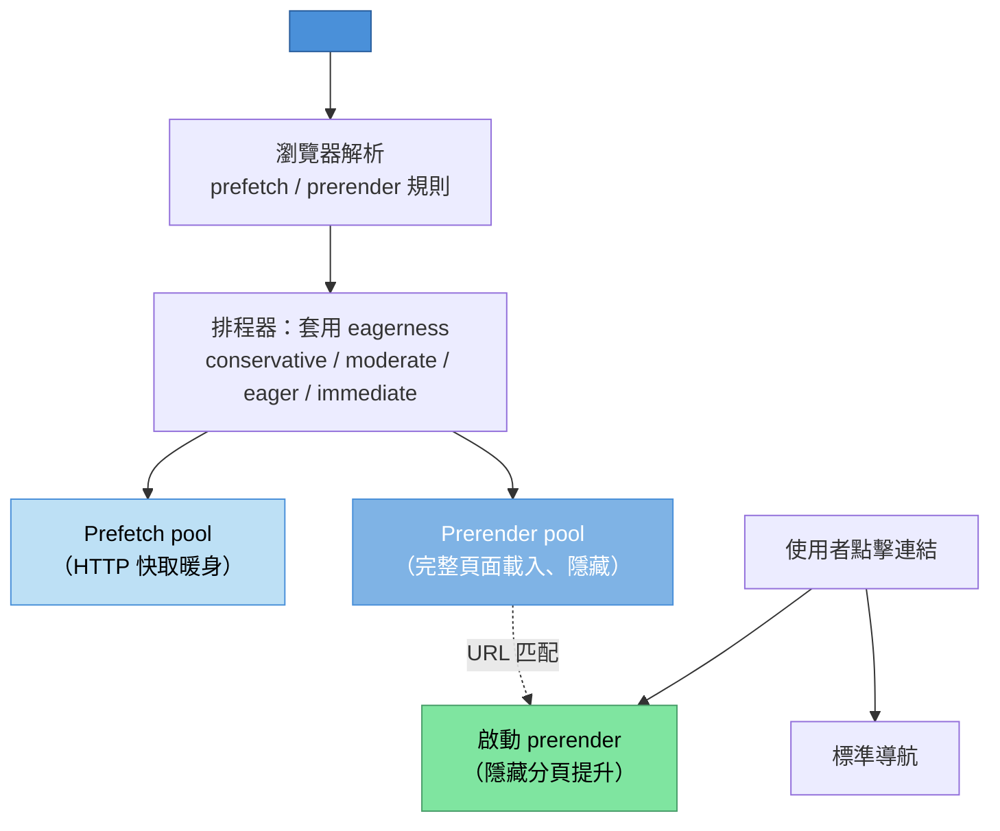

# [FEE-12003] Speculation Rules

:::info
透過 `<script type="speculationrules">` 標籤內的 JSON 區塊，宣告式地告訴瀏覽器該預先抓取或預先渲染哪些連結、以及多積極。此 API 取代 `<link rel="prefetch">`、已於 2019 年移除的 `<link rel="prerender">` 以及手寫 hover 預抓器的臨時組合，改以單一治理表面處理。
:::

:::info Limited availability
Chromium 系瀏覽器（Chrome 109+、Edge）出貨 Speculation Rules 的 prefetch 與 prerender。Eagerness 功能於 Chrome 121 落地。Safari 與 Firefox 追蹤提案。本文涵蓋 API、eagerness 語意，以及作者必須處理的副作用守門。
:::

## 背景

當瀏覽器可以預測使用者的下一次導航時，prefetch 與 prerender 是效能勝利。在使用者位於「購物車」時預抓「結帳」頁面的頁面消除點擊時的網路往返；預先渲染「結帳」頁面完整的子資源圖的頁面也消除渲染成本。速度提升可大到顯著轉換放棄購物車的比率。

Speculation Rules 之前的原語提供部分涵蓋。`<link rel="prefetch" href="/next">` 為資源排程低優先網路擷取，讓 HTTP 快取暖身但不執行腳本或抓取子資源。`<link rel="prerender" href="/next">`（2019 年從 Chromium 移除）完整載入目標頁面，包含腳本與網路請求，這很強大但昂貴且易洩漏——它觸發分析信標、執行有副作用的 JavaScript，並為使用者可能從未訪問的頁面消耗頻寬。

`<link rel="prerender">` 的移除留下空缺。開發者寫出臨時 JavaScript 預抓器，監聽連結的 `mouseenter` 並發出 `<link rel="prefetch">` 插入。此模式可行，但每個團隊各自重新實作，eagerness 啟發式各異（300 毫秒停留門檻、100 毫秒、或毫無門檻），品質參差不齊。跨團隊一致性差，平台沒有辦法表達「預渲染此頁面但不執行其腳本」或「僅預抓 HTML 但不預抓子資源」。

Speculation Rules 是事後重新設計。`<script type="speculationrules">` 元素攜帶 JSON 區塊，宣告瀏覽器應預抓或預渲染哪些 URL、在什麼條件下（`where` 模式匹配器）以及以何種 eagerness。JSON 是宣告式——瀏覽器的排程器選擇何時行動，尊重使用者偏好、省資料模式與資源壓力。此 API 有範圍（prerender 預設同源，跨源需明確選入）並受守門（prerender 期間頁面的侵入行為暫停直到使用者啟動）。

規格已從 WICG 移至 HTML Living Standard。`wicg.github.io/nav-speculation` 的 WICG 儲存庫現在是指向 HTML Standard 推測載入段落的重導向。此移動反映 Speculation Rules 已在 WHATWG 達到實作者共識成熟度，編輯工作在該處繼續。

撰寫時的出貨狀態：Chrome 109（2022 年 12 月）透過 Speculation Rules 出貨 prefetch 與 prerender。Chrome 121 加入 eagerness 功能。Edge 跟隨 Chromium。Safari 與 Firefox 追蹤提案但未以未設旗標方式出貨。跨引擎可用性差距讓此功能在 Chromium 已成熟的情況下仍留在前穩定範圍。

JSON 區塊架構有兩個頂層鍵：`prefetch` 與 `prerender`。每個值是規則物件陣列。每條規則宣告 `urls`（明確 URL 清單）或 `where`（帶有 `href_matches`、`selector_matches` 與 `and`/`or`/`not` 組合子的 URL 模式匹配器），加上選用的 `eagerness`，值為 `conservative`、`moderate`、`eager` 或 `immediate`。`eagerness` 管控瀏覽器行動多積極：`conservative` 在 click-down 時行動、`moderate` 在帶延遲的 hover 時、`eager` 在 hover 時、`immediate` 在規則註冊時。

## 情境

一個文件站點測量到站內導航的 p75 延遲為 400 毫秒——使用者點擊連結、等待 400 毫秒，然後看到新頁面。團隊已優化關鍵渲染路徑；延遲由網路往返加上初始渲染主導。預渲染策略可以把觀察到的延遲降至接近零，因為目標頁面在點擊前已渲染。

沒有 Speculation Rules，團隊有三個平庸選項。他們可以寫 JavaScript hover 預抓器，在 `mouseenter` 時發出 `<link rel="prefetch">`；這會預抓 HTML 但不會預渲染。他們可以與 CDN 協調在邊緣預抓；這減少後端成本但不會在客戶端預渲染。他們可以出貨 service worker 做目標快取暖身；這減少快取未命中成本但不減渲染成本。

有了 Speculation Rules，團隊為頁面加上 `<script type="speculationrules">` 區塊，宣告：對使用者停留 200 毫秒的任何同源連結預渲染，`eagerness: "moderate"`。瀏覽器處理其餘——它監看帶延遲的 hover、在隱藏分頁預渲染目標頁面、執行其腳本、載入其子資源，並保留渲染結果。當使用者點擊時，瀏覽器啟動預渲染：隱藏分頁提升為可見、URL 列更新、導航在個位數毫秒內完成。

勝利是真實的，但帶有取捨。預渲染使用者沒有導航到的頁面會浪費客戶端與伺服器的頻寬與 CPU。分析信標預設會為預渲染頁面觸發，污染漏斗指標。有副作用初始化的頁面（自動播放影片、讀取回執、推播通知提示）可能為從未訪問的頁面觸發那些效果，讓使用者與伺服器困惑。Eagerness 是以資源成本換取導航確定性的旋鈕；選擇正確的層級需要知道每頁的成本與命中率。

電子商務站點的計算與文件站點不同。電子商務站點的結帳頁面預渲染成本高（許多子資源、個人化呼叫、購物車狀態同步），從購物車頁面的命中率高。`moderate` eagerness 是良好匹配——停留結帳按鈕的使用者很可能會點擊。文件站點的文章間導航預渲染成本低（靜態 HTML、無個人化），每次停留的命中率較低；某些精選路徑上 `eager` 甚至 `immediate` 可能合適。

## 最佳實踐

在倚賴 Speculation Rules 前進行功能偵測。檢查 `HTMLScriptElement.supports('speculationrules')` 驗證瀏覽器是否解析此腳本類型。在非支援引擎上，`<script type="speculationrules">` 區塊會被忽略——不做任何事而非拋錯——但功能偵測讓應用可以記錄關於支援與退化比例的觀測訊號。

除非有測量證據支持其他層級，否則預設 `eagerness: "moderate"`。`moderate` 在命中率與過度推測成本間取得平衡：它在短暫停留或 pointerdown 時觸發，使用者已發出意圖訊號。`conservative` 只在點擊時觸發，失去大部分預渲染好處但仍做預抓。`eager` 與 `immediate` 適用於每頁成本低且命中率高的精選路徑。

預設只預渲染冪等的同源頁面。有載入時副作用的頁面（郵件開啟追蹤、一次性通知、會變更狀態的 POST）必不可預渲染。`where` 匹配器的 `not` 組合子讓你在仍允許預抓時排除特定 URL 模式被預渲染。把明確排除路徑清單納入站點的預渲染政策。

SHOULD 把分析信標延遲到頁面啟動後。預渲染頁面暴露 `document.prerendering` 屬性；載入期間執行的程式碼可以檢查此屬性，並把信標發出延遲到 `prerenderingchange` 事件觸發（表示使用者啟動預渲染）之後。常見的分析函式庫正開始遵循此模式；較舊的函式庫需要手動包裝。

用 `<link rel="prefetch">` 作為非支援引擎的退化。`<script type="speculationrules">` 區塊在支援引擎上提供宣告式治理；配合對相同 URL 的 `<link rel="prefetch">` 集合，非支援引擎仍做 HTTP 快取暖身（沒有預渲染勝利）。組合優雅退化。

為無法容忍預渲染的頁面提供明確同源選出。載入處理器觸發非冪等效果的頁面應設定 `Supports-Loading-Mode` 回應標頭或使用 `sec-purpose` 請求標頭檢查來抑制預渲染。伺服器可以辨識預渲染觸發的請求並回傳可快取但無副作用的變體。

MUST NOT 在未明確選入的情況下預渲染跨源頁面。跨源預渲染需要目標在回應標頭宣告 `Supports-Loading-Mode: credentialed-prerender`。這是安全與隱私守門——惡意頁面否則可以在第三方站點觸發導航層效果。

MAY 把 Speculation Rules 與 View Transitions 結合。預渲染的目標頁面透過 `@view-transition` 規則有資格做跨文件檢視過渡；組合提供近乎即時的導航與動畫過渡，這是平台對多頁應用 SPA 風格路由的回答。

為推測命中率設置分析儀表板。追蹤推測的 URL 被使用者實際訪問的比例。命中率低於 20% 表示 eagerness 太積極；高於 80% 表示 eagerness 太保守。依據測量分佈為每種頁面類型調整。

## 設計思維

### 平台為什麼需要事後重新設計

`<link rel="prerender">` 於 2019 年從 Chromium 移除，因為累積了一套相互糾纏的問題。它為使用者從未看到的頁面觸發分析信標，污染任何天真啟用它的站點的漏斗指標。它為可能沒被導航到的頁面消耗頻寬與記憶體。它執行目標的任意 JavaScript，可能設定 cookie 或觸發使用者未實際訪問時令人困惑的伺服器端效果。且它沒有 eagerness 控制——規則是全有或全無。

移除後的工程檢討找出核心張力。預渲染有價值，但有價值的情境（強意圖訊號、低副作用成本）狹窄，而危險情境（弱意圖訊號、高副作用成本）廣泛。`<link rel="prerender">` 無法區分。事後重新設計必須讓頁面作者宣告式地表達區別。

Speculation Rules 就是那次重新設計。JSON 區塊以何種確定性（eagerness）、在何種條件下（模式匹配器）表達要行動的 URL。瀏覽器的排程器可以基於使用者偏好（省資料、電池）、裝置資源（CPU 壓力）與隱私姿態（無痕模式）尊重或拒絕規則。此 API 對頁面的意圖明確，同時保留瀏覽器對執行的權威。

宣告式形狀是關鍵設計選擇。命令式 API（`navigation.speculate(url)`）會有相同的副作用問題——作者宣告意圖一次，瀏覽器不透明地行動。`<script type="speculationrules">` 區塊可被使用者代理、DevTools、安全工具與 CI 掛鉤規則檢查。宣告式形狀使治理表面可審計。

### 副作用問題

預渲染觸發完整的頁面載入流程：腳本執行、子資源載入、網路請求完成。任何一個都可能有作者未預期為預渲染觸發的副作用：

- 記錄頁面檢視的分析信標。
- 通知權限提示（這些在預渲染期間由 UA 控制，但提示程式碼仍可能執行並排入佇列）。
- 載入期間發出的會變更狀態的 POST 請求。
- 變更使用者伺服器端狀態的 session cookie 更新。
- 把訊息標記為已讀的讀取回執 ping。

規格在預渲染期間暫停使用者互動 API（fullscreen 請求、權限提示等），讓使用者不會從隱藏分頁看到 UI。但它無法暫停分析信標或應用層級狀態變更——這些與頁面的正常載入行為無法區分。作者必須自己偵測 `document.prerendering` 並延遲這些效果。

`prerenderingchange` 事件在使用者啟動預渲染（導航到它）時觸發。延遲的分析應監聽此事件並於該點發出。延遲的狀態變更應檢查其是否能延遲到啟動，或者應該屬於完全不同的端點。

### Eagerness 作為設計表面

四個 eagerness 值讓作者表達多少意圖證據觸發推測：

- **`conservative`**：在 click-down 時觸發。這接近 `<link rel="prefetch">` 行為；它利用 mousedown 與 click 之間的短暫窗口開始網路擷取。最小過度推測成本，最小好處。
- **`moderate`**：在帶延遲（200 毫秒）的 pointer hover 或 pointerdown 時觸發。使用者至少停下來閱讀連結。平衡的預設。
- **`eager`**：在 pointer hover（無延遲）或 focus 時觸發。精選路徑上命中率更高；探索性頁面上過度推測更多。
- **`immediate`**：在規則註冊時觸發。適合少數高信心目標（閱讀系列的下一頁、登陸頁面的主要 CTA）。

每引擎的門檻（`moderate` 的 200 毫秒）可能隨引擎收集使用資料而改變。作者承諾層級，不是特定門檻；引擎選擇具體行為。

### 同源與跨源

預渲染預設同源。頁面可以在不經目標任何選入下預渲染相同來源上的 URL，因為目標是同一來源，其安全姿態共用。跨源預渲染需要目標透過 `Supports-Loading-Mode: credentialed-prerender` 回應標頭選入，否則惡意頁面可以在目標不知情下觸發跨源效果（分析、狀態變更、cookie）。

選入標頭是目標同意被帶憑證預渲染。未設定此標頭的跨源頁面退回到預抓（僅網路層快取暖身），沒有執行或副作用影響。

預抓也預設同源，但跨源預抓限制較少，因為預抓只暖 HTTP 快取，不執行腳本或發出子請求。

### 生態系如何整合

框架路由正在採用 Speculation Rules。Next.js 的 `<Link>` 元件可以在支援引擎上為其預抓目標發出 Speculation Rules 條目，在其他情況退回框架既有的預抓邏輯。

Remix 的預抓器支援類似整合。Nuxt 與 SvelteKit 追蹤此模式。每個框架的採用路徑遵循相同形狀：偵測支援、在支援引擎上發出規則、保留既有的 `<link rel="prefetch">` 路徑作為退化。

靜態站點產生器是天然搭配。文件平台（VitePress、Docusaurus）可以為站內導航圖發出站點範圍的 Speculation Rules 區塊。部落格引擎可以為文章與索引的關係發出規則。SSG 對完整 URL 圖的知識讓產生完整規則不需要每頁作者工作。

CDN 與邊緣層可以集中注入 Speculation Rules。使用 Cloudflare 或 Fastly 的站點可以設定 worker，為每個 HTML 回應加上帶站點適宜預設的 `<script type="speculationrules">`。集中設定意味個別頁面不需要在模板中加入此區塊，政策變更透過邊緣設定更新而非站點重建推出。

分析函式庫正開始尊重 `document.prerendering`。Google Analytics 4 把頁面檢視事件延遲到啟動後。Mixpanel、Amplitude 等函式庫正加入類似支援。

生態系仍在調整；站點營運者應稽核其分析函式庫版本與設定。未檢查 `document.prerendering` 的過時分析函式庫會把頁面檢視指標放大等比於預渲染對啟動的比率——有時為 5 倍或更多（積極 eagerness 設定時），把功能推出變成指標分析恐慌。

## 圖解



瀏覽器處理 Speculation Rules 的管線。解析 JSON 區塊；依規則與 eagerness 分派到預抓池（HTTP 快取暖身）或預渲染池（完整隱藏頁面載入）；使用者點擊時，啟動匹配的預渲染或退回標準導航。

## 範例

文件站點加上 Speculation Rules 區塊，當使用者停留 200 毫秒時預渲染主內容區中的任何同源連結。分析延遲到啟動後。

```html
<!DOCTYPE html>
<html>
<head>
  <meta charset="utf-8">
  <title>文件 — Speculation Rules 示範</title>
  <script type="speculationrules">
    {
      "prerender": [
        {
          "where": {
            "and": [
              { "href_matches": "/*" },
              { "selector_matches": "main a[href]" },
              { "not": { "href_matches": "/account/*" } }
            ]
          },
          "eagerness": "moderate"
        }
      ]
    }
  </script>
</head>
<body>
<main>
  <h1>簡介</h1>
  <p>接下來請閱讀 <a href="/getting-started">入門指南</a>。</p>
  <p>或跳到 <a href="/reference">參考手冊</a>。</p>
</main>
<script>
  // 延遲分析直到預渲染啟動
  if (document.prerendering) {
    document.addEventListener('prerenderingchange', () => {
      trackPageView();
    }, { once: true });
  } else {
    trackPageView();
  }

  function trackPageView() {
    // 在此發送信標
    console.log('頁面檢視', location.pathname);
  }
</script>
</body>
</html>
```

`where` 匹配器瞄準 `<main>` 內的所有同源連結，排除帳戶頁面（排除因為帳戶流程可能觸發會變更狀態的請求）。`moderate` eagerness 在 200 毫秒停留時觸發預渲染。分析延遲到使用者實際啟動預渲染——`document.prerendering` 在隱藏載入期間為 true，`prerenderingchange` 事件於啟動時觸發。

## 常見陷阱

**預渲染非冪等 URL。** 結帳完成頁、郵件開啟追蹤器或讀取回執端點觸發會變更狀態的效果。預渲染此類 URL 會破壞伺服器端狀態與使用者紀錄。稽核站點的 URL 模式尋找非冪等端點，並透過 `where` 匹配器的 `not` 子句排除。

**忘記延遲分析。** 在載入時觸發信標的分析函式庫把頁面檢視計數放大等於每個預渲染的 URL，不論使用者是否訪問。始終將信標發出包在 `document.prerendering` 檢查中。啟用 Speculation Rules 後監控分析儀表板；頁面檢視無法解釋的跳升訊號此陷阱。

**在多個 URL 上使用 `immediate` eagerness。** `immediate` 在規則註冊時觸發，意味瀏覽器在頁面載入時開始預渲染。對大型 URL 集套用會造成連鎖資源消耗。把 `immediate` 保留給少數高信心目標（閱讀系列的下一章、登陸頁面的主要行動號召）。

**未經選入的跨源預渲染。** 在沒有目標 `Supports-Loading-Mode` 標頭的情況下預渲染第三方 URL 會靜默退回到預抓。假設跨源預渲染會運作的作者可能看不到好處且不理解為何。以網路面板時間測試，不要假設。

**SPA 中的陳舊 Speculation Rules。** 初始頁面載入註冊的規則在被移除或替換前保持活動。透過其路由器導航到新路由的 SPA 應重新整理規則區塊以匹配新頁面的相關 URL；否則舊規則繼續為現在不相關的目標觸發推測。

**不尊重 `Save-Data`。** 網路受限連線上的使用者可能送 `Save-Data: on`。瀏覽器的排程器預設尊重此，但作者不應發出假設頻寬免費的 `immediate` 層級規則。在節流條件下測試站點以確認 speculation-rules 行為優雅退化。

**忽略 DevTools Application 面板。** Chrome DevTools 在 Application 面板的「Speculative Loads」下暴露活動中的推測。開發期間不檢查此面板的團隊錯失關於規則觸發過於積極或匹配錯誤 URL 的訊號。

**假設預渲染以確定性方式執行 JavaScript。** 預渲染執行 JavaScript，但某些 API 被控制或排入佇列直到啟動。倚賴立即相機存取、通知權限或地理位置的程式碼可能表現異常。把目標頁面當作預渲染表面測試，而非僅當作直接載入表面。

**在單一規則中混用 `urls` 與 `where`。** 規則物件使用明確 `urls` 陣列或基於模式的 `where` 匹配器；在一條規則中合併兩者為無效，規則會被丟棄。若作者同時需要明確 URL 與模式匹配 URL，把它們分為同一 `prerender` 陣列中的兩條規則。

**透過規則洩漏敏感 URL。** Speculation Rules 在 HTML 原始碼中內嵌；任何檢視頁面原始碼或檢查 DevTools 的人都能看到站點預渲染哪些 URL。不要在規則 `urls` 清單中包含敏感 URL 參數（session token、私人識別碼）。使用描述形狀而不含字面敏感值的 `where` 模式匹配器。

**倚賴同頁面捲動還原。** 預渲染頁面不會把使用者的捲動位置從主分頁帶到啟動後的檢視——預渲染從目標頁面頂端開始。倚賴目標特定捲動位置的應用應使用 View Transitions 或捲動錨定機制；不要期望僅預渲染處理此問題。

## 除錯筆記

Chrome DevTools 在 Application 面板 → Background Services → Speculative Loads 暴露推測。每個條目顯示來源 URL、目標 URL、eagerness、匹配的規則與目前狀態（pending、prerendering、prerender-ready、activated、discarded）。

`Performance Insights` 面板（Chrome）在導航時間線上突顯預渲染啟動。啟動的預渲染顯示為幾乎即時的導航；點擊到渲染穩定之間的差值就是觀察到的勝利。

在各腳本點記錄 `document.prerendering` 揭露頁面是否在預渲染情境中執行。這對開發期確認功能偵測分支正確很有用。

`sec-purpose: prefetch` 與 `sec-purpose: prefetch;prerender` 請求標頭讓伺服器區分推測流量與實際使用者流量。伺服器端記錄應剝離或標記這些請求以免污染流量儀表板。

Speculation Rules 的自動化測試可透過 Puppeteer 的 `--enable-features=SpeculationRulesPrerendering` 旗標；工具可以導航頁面、檢查 Application 面板資料並斷言預期規則已觸發。WebDriver Bidi 規格隨功能成熟加入一等的推測狀態檢查支援。

跨引擎測試目前僅限 Chromium，因為只有 Chromium 出貨。在 Safari 與 Firefox 出貨前，Speculation Rules 的自動跨引擎測試覆蓋無法達成；Chrome 上的手動測試加上非支援引擎的功能偵測是實務策略。

效能回歸追蹤應包含預渲染命中率。命中率突然下降（推測的 URL 未被訪問）經常指示回歸——或許匹配器現在瞄準錯誤 URL，或 eagerness 被調得太高。把此作為 Core Web Vitals 姐妹指標追蹤。

啟動預渲染的 `Navigation` 計時條目把啟動時間與一般導航計時分開記錄。報告 LCP 或 TTI 的頁面載入計時程式碼應區分啟動的預渲染導航與冷載入導航，因為計時語意大不相同。預渲染感知的 RUM 函式庫註記條目類型；較舊的函式庫把啟動導航報告為可疑地快速的標準載入。

檢查 `PerformanceNavigationTiming` 條目上的 `activationStart` 時間戳區分冷導航（值為 0）與啟動預渲染（非零、指示預渲染被保留多久後啟動）。按 `activationStart` 拆分的儀表板告訴預渲染勝利落在何處、命中率在哪裡低於預期的故事。

`sec-purpose` 請求標頭結合 Speculation Rules 也啟用伺服器端命中率測量。CDN 或源伺服器可以記錄推測觸發的請求數，並與匹配這些 URL 的實際導航數比較。比率是伺服器觀察到的命中率，若推測與啟動之間的快取或內容協商有差異，可能與客戶端觀察到的不同。

## 退化策略

在非支援引擎（Safari、Firefox、較舊的 Chromium）上，Speculation Rules 區塊被靜默忽略。頁面仍運作；只是沒有預渲染速度提升。兩個退化層涵蓋差距：

**第 1 層：原生 Speculation Rules。** 支援引擎解析 JSON 區塊並據此行動。這是目標。

**第 2 層：對相同 URL 使用 `<link rel="prefetch">`。** 非支援引擎透過舊原語取得快取暖身。在 Speculation Rules 區塊旁為相同 URL 集合發出 `<link rel="prefetch" href="...">`；支援引擎偏好規則區塊，非支援引擎退回連結標籤。退化失去預渲染優勢但保留網路層暖身。

**第 3 層：框架層級預抓。** Next.js `<Link>`、Remix `<Link>` 與類似框架原語不論 Speculation Rules 支援與否都實作 hover 觸發的預抓。倚賴框架原語讓應用可攜，不需每引擎分支。

依框架能力選擇。建立於已在支援引擎發出 Speculation Rules 之框架（Next.js 14+、Remix 2+）的應用免費取得第 1 與第 3 層。建立於純 HTML 或沒有此支援之框架的應用需要手動發出各層。

Speculation Rules 的 Baseline 過渡取決於 Safari 與 Firefox 出貨。提案在 Chromium 的成熟度暗示阻塞點是引擎實作工作而非設計分歧，但時程不定。

團隊目前應把 Speculation Rules 視為 Chromium 優先的漸進增強，在 Firefox 或 Safari 未設旗標出貨時重新評估。此功能的經濟學偏向早期採用——支援引擎上的延遲勝利是真實的，退化層成本很小，所以早期採用的站點付出不多就能在 Chromium 流量上取得可測量的勝利。

過渡期間的觀測性很重要。記錄每位訪客的 Speculation Rules 支援存在性、規則匹配率、啟動率與觀察到的導航延遲（按啟動與冷分開）。資料告訴你功能是否在交付以及調校努力該往哪裡去。

執行 speculation 積極性 A/B 測試的站點可以經驗主義地精煉其 eagerness 設定。全域以 `moderate` 開始、測量，然後在成本低且命中率看似高的路徑前綴上嘗試 `eager`。可能設定的空間很廣，正確設定很少是預設。

內部文件應記錄所選設定與理由。選 `/docs/*` 上 `eager` 的團隊，因為命中率測量為 85% 且頁面便宜，應把該決策記錄在某個持久位置。當站點結構演進或團隊更替時，記錄的理由防止設定變成孤兒。

Speculation Rules 是第一個給頁面作者「預測並準備」API 表面的 Web 平台功能。此典範值得投資學習，因為後續提案（多頁應用 SPA 搭配 View Transitions 的預渲染、更深的跨文件預載）將建立在相同心智模型上。

目前建立 eagerness、同源限制與分析延遲熟練度的團隊將發現後續功能更容易採用。因為「Chromium 限定」而跳過 Speculation Rules 的團隊在跨引擎可用性落地後會面對更陡的學習曲線，生產力差距累積。

Speculation Rules 的採用曲線對應於較早的平台預測功能（preconnect、preload）。兩者都先在 Chromium 出貨，在 Chromium 主導的流量上累積採用，幾年後達到跨引擎可用性。Speculation Rules 位於類似早期採用點，有相同取捨：支援引擎上真實的勝利、退化的小成本與學習時間，隨功能成熟而回報。

健康的採用政策承諾於測量。

在推出前，以基準測量目前的導航延遲與預抓策略。推出後，測量 Chromium 流量上的差異。保持基準檢測以快速捕捉回歸（錯誤設定的規則、分析污染）。此功能是 Web 平台觀測性較友善的部分之一；善用此特性。

## 內部參考

- FEE-12000 — HTML 與 DOM 提案的父總覽
- FEE-12001 — 此範圍的第一篇子文章（Scoped Custom Element Registry）
- FEE-12002 — 前一篇子文章（Document Picture-in-Picture）

## 參考資料

1. [HTML Living Standard — speculative loading](https://html.spec.whatwg.org/multipage/document-sequences.html#prerendering) — `<script type="speculationrules">` 解析與預渲染瀏覽情境的規範性說明。
2. [Chrome for Developers — Prerender pages with the Speculation Rules API](https://developer.chrome.com/docs/web-platform/prerender-pages) — Chrome 標準解說，涵蓋 eagerness、分析延遲與常見陷阱。
3. [MDN — Speculation Rules API](https://developer.mozilla.org/en-US/docs/Web/API/Speculation_Rules_API) — API 參考與 Baseline 可用性註記。
4. [MDN — `<script type="speculationrules">`](https://developer.mozilla.org/en-US/docs/Web/HTML/Element/script/type/speculationrules) — 元素層級參考，附範例規則區塊。
5. [WICG nav-speculation proposal repository](https://github.com/WICG/nav-speculation) — 設計歷史與議題追蹤；記錄了編輯工作移至 HTML Standard。
