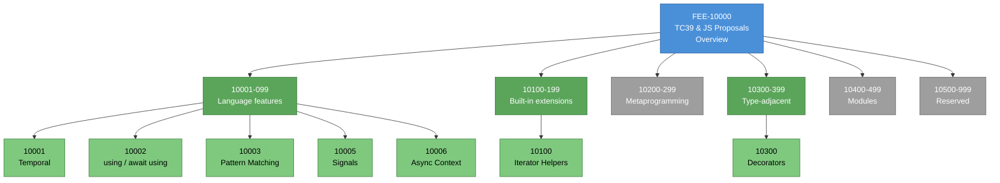

# [FEE-10000] TC39 & JS 提案概覽

:::info
JavaScript 語言是分階段演進的。理解提案目前處於哪個階段、哪個階段才算安全可以投入生產環境，是使用現代 JavaScript 的入門技能。
:::

:::warning Web Platform Proposals
10000-19999 範圍內的文章涵蓋尚未在所有主要瀏覽器中穩定，或尚未達到 TC39 Stage 4 的功能。當提案正式穩定後，文章將移至對應的 0-9999 分類。
:::

## 背景

TC39 是 Ecma International 的第 39 號技術委員會（Technical Committee 39），負責維護 ECMA-262（ECMAScript 規範）與 ECMA-402（國際化 API 規範）。瀏覽器廠商、執行環境實作者、Transpiler 作者，以及更廣泛的社群的代表（Delegate）約每兩個月開會一次。決策採共識制：只要有任何一位代表提出 Block，提案就無法前進。提案由 **Champion** 驅動——Champion 是個別代表，負責帶領功能走過多階段流程、回應委員會的疑問，並維護提案公開的 GitHub 倉庫。

TC39 是共同治理網路平台的多個標準組織之一。W3C（World Wide Web Consortium）與其 Community Group 涵蓋 HTML（與 WHATWG 合作）、CSS，以及多數 DOM 相關 API。WHATWG（Web Hypertext Application Technology Working Group）負責 HTML Living Standard、DOM、Fetch 與 Streams。TC39 專責 JavaScript 語言本身，與語言可存取的 DOM API 分屬不同治理範疇。要在 `Document.prototype` 增加一個方法的提案走 WHATWG；要在 `Array.prototype` 增加一個方法的提案走 TC39。這個分工在邊界處偶爾會浮現爭議——例如 `structuredClone` 應屬 DOM API（WHATWG）還是語言基本元件（TC39），就花了不少時間釐清；最終決議將它留在 HTML Living Standard，因為它依賴平台專屬的 Transferable 型別。

TC39 的成員資格透過 Ecma International 運作，委員會在全體會議（Plenary，每年約六次）以及兩次全體會議之間的工作小組會議上集會。每次全體會議推進提案、討論規範修訂，並處理行政事務。委員會的決策流程有明文規定：提案前進需要出席代表的共識，這裡的共識採取的是「沒有阻擋性反對」的最低門檻形式，允許代表保留意見而仍讓提案前進。規範編輯（Specification Editing）是一個與 Champion 分離的角色；由一個小型編輯群組維護 ECMA-262 的實際條文，並在每一個提案的規範文字合併前審閱它。

代表組織包含主要瀏覽器引擎廠商（Google 負責 V8、Mozilla 負責 SpiderMonkey、Apple 負責 JavaScriptCore，Microsoft 歷史上曾負責 ChakraCore）、Transpiler 與工具團隊（Igalia、Babel 團隊、Bloomberg），以及來自學術界與業界的多位受邀專家代表。每個組織指派一位或多位具名代表出席全體會議並對前進議案投票。名單是公開的；tc39/Reflector 倉庫記錄了組織從屬關係。這種廣度正是共識決策具備意義的機制——能夠前進的提案，必然已被每個主要 JavaScript 執行環境的代表審視過，不只是單一廠商的偏好。

委員會的**行為準則、智財權政策與會議協定**都是公開文件，維護在 tc39/how-we-work 倉庫中。新代表透過這份文件與資深代表的結對機制完成入門。公開是刻意的：委員會的產出是每個瀏覽器都實作的規範；一個封閉的流程會削弱該產出的可信度。公開的會議記錄、公開的提案、公開的流程文件，是 TC39 維持正當性的方式。

**Stage 0 至 Stage 4 管線**是核心機制。Stage 0 是「稻草人」——任何在提案倉庫中發佈的構想。Stage 1 是「提案」——委員會接受問題陳述並同意這個問題值得解決。Stage 2 是「草稿」——完整的 API 設計、範例，規範文字進行中。Stage 2.7 是 2023 年底在流程文件中正式成立的階段，稱為「候選（規範就緒）」——規範文字經審閱者與編輯核可，設計已準備好接受實作測試。Stage 3 是引擎意義下的「候選」——原生實作與 Test262 測試就位；變更回應實作者的回饋。Stage 4 是「完成」——兩個出貨實作通過 Test262、規範文字合併進 ECMA-262 編輯草稿，功能在下一年度編輯版中推出。

實際情況是，**引擎出貨並不與階段進程同步**。V8、SpiderMonkey、JavaScriptCore 會在 Flag 後面出貨 Stage 3 提案，並在各自引擎另一套發佈流程完成後將 Stage 4 提案解鎖出貨。一個在 2025 年合併入 ECMA-262 的 Stage 4 提案，到 2026 年初可能在 Safari 還缺席。因此，生產採用的實用門檻同時要求 Stage 4 **加上**跨引擎出貨；只看 Stage 4 本身並不足以涵蓋整個判斷。每個引擎的發佈時間是它自己的追蹤介面，這也是 MDN、caniuse.com、與 kangax ES 相容性表格會與 TC39 倉庫同時存在的原因。

年度發佈節奏本身是委員會因應一次失敗做出的決定。**ES4 提案**是一項從 2000 年到 2008 年的野心勃勃多年計畫，目標是一次性為 JavaScript 加上 Class、型別與 Package，當 Microsoft 與 Yahoo 拒絕支持時宣告崩解。2009 年發佈的 ES5 是一次規模小得多的修正。ES6（後來更名為 ES2015）六年後出貨，標誌著年度節奏的開始。從那之後，每年六月，Ecma 都會發佈一個新版本（ES2016、ES2017 等等），收錄在該週期內達到 Stage 4 的提案。目前已發佈的版本是 ES2025；`tc39.es/ecma262/` 的編輯草稿反映下一個目標版本，包含最近合併的 Stage 4 提案。年度節奏是 ES2015 之後的功能語料得以存在的原因。

命名慣例值得一提。每個年度版本以年份表示（ES2016、ES2017、……、ES2025）；版本號形式（「ES7」、「ES8」）在 2016-2017 曾一度流行，但委員會統一改用年份後綴形式，以避免混淆、並強化「持續演進」的框架。一個在 2024 年達到 Stage 4 但錯過 2024 版本截止日期的提案會落入 ES2025，以此類推。年度快照的功能是將一組已合併提案固定到可引用年份的歷史檔案點，不具備行銷發佈的性質。

## 情境

一個團隊考慮把生產環境中所有 `new Date()` 呼叫改成 Temporal API。Temporal 已經達到 TC39 Stage 4，合併進 ECMA-262 編輯草稿，並在 Firefox 139（2025 年 5 月）與 Chrome 144（2026 年 1 月）以不帶 Flag 的原生 API 出貨。Safari 在撰文時有實作進行中但尚未發佈穩定版。團隊想要**現在**就採用 Temporal——Temporal 修掉的 `Date` 缺陷（可變性、時區處理、月份從 0 開始、DST 感知的持續時間運算）每個月都在耗費工程時間。

選擇收束到三條實務路徑。團隊可以無條件引入 `@js-temporal/polyfill`，這在每個引擎包含 Safari 都能運作，代價是為 Bundle 增加約 50-100 KB 的 Polyfill 代碼。他們可以出貨原生 Temporal，並為 `typeof Temporal === 'undefined'` 的環境設定條件式 Polyfill——這讓 Firefox 與 Chrome 的 Bundle 保持輕量，代價是第二份必須維護的代碼路徑，以及 Safari 上的動態 Import。他們可以等 Safari 出貨後再開始遷移。每條路徑都有可量化的成本與使用者可見的取捨。

對這個團隊而言，把每條路徑的數值成本估算清楚是值得的。無條件 Polyfill 路徑為 Bundle 每次載入增加約 50-100 KB 壓縮後體積，對每個引擎上的每位使用者都一樣；在每日有 10 萬使用者的網站上，這大約等於每日額外 5-10 GB 的頻寬。原生加上 fallback 路徑在 Safari 流量（通常佔一般網路受眾的 15-25%）上成本是一次動態 `import()` 與少量條件載入邏輯；Firefox 與 Chrome 上的 Bundle 成本是零。等待路徑在位元組上零成本，但會在 Safari 出貨前的每個 `Date` 缺陷上累積工程時間成本。這三項成本單位不同，這正是決策成為判斷題的原因——團隊必須決定願意吸收哪些成本。

第四條路徑「轉譯為原生」並不可行，因為 Temporal 屬於 Runtime API 類別而沒有新語法附加於它之上。Transpiler（Babel、SWC）無法在沒有原生 `Temporal.PlainDate` 定義的執行環境上生出該物件——Transpiler 只能改寫語法。語法提案可以被轉譯、Runtime 提案需要 Polyfill，這項區別是 10000 段文章中每個採用決策第一個會遇到的分類。本文為整個範圍的提案提供這項決策的結構，不只 Temporal；每個個別提案的設計、遷移策略、當前出貨矩陣，則由對應的子文章介紹。

函式庫作者的盤算不同。若函式庫在內部使用 Temporal，那麼每個消費端都會被強加這份 Polyfill 成本——對於那些引擎本來已經原生出貨該功能的使用者來說，這是困難的硬性成本。函式庫作者的典型做法是**以 Peer Dependency 搭配功能偵測**：函式庫期望環境中存在 `Temporal`，在 README 中記錄這個需求，讓使用該函式庫的應用決定是否載入 Polyfill。這把採用決策往下推到應用層，也是它該在的位置。同樣的模式適用於函式庫想用的每個 Runtime 提案：把需求暴露出來，讓使用端處理。至於語法提案，函式庫作者普遍避免使用 Stage 3 以前的語法，因為轉譯後的產物會把使用端綁定到特定的 Babel Plugin 版本。

## 設計思維

### 為什麼需要提案流程

第一個設計問題是：為什麼 TC39 要採用分階段流程？答案是兩個 JavaScript 獨有的限制條件。和其他語言社群比較可以看清楚差異。Rust 有一個祝聖的實作（rustc）、一個決定功能的核心團隊，以及每六週一次的發佈列車。Go 類似，由 Google 主導的 Go 團隊擔任唯一仲裁者。Python 有一個參考實作（CPython）驅動語言演進，其他實作跟隨。這些語言都不需要分階段共識流程，因為它們只有一個實作者。JavaScript 則有四個主要瀏覽器引擎，各自有發佈節奏與工程優先順序，還有伺服器執行環境（Node.js、Deno、Bun）依照規範出貨但各自有自己的節奏。TC39 的分階段流程是讓這些獨立實作保持對齊的機制。

第一項限制是**後 ES4 教訓**。ES4 回頭看是一份經過協商的龐大單體提案——一個一次性把 Class、型別系統、Module 系統全部塞進去的 JavaScript 版本。廠商對優先順序意見不一。任何一家廠商都能、也確實阻擋了整個計畫。事後檢討寫得明確：規模龐大、多廠商協商、一次到位的規範，對一個有多個獨立實作者的語言來說是失敗模式。漸進式階段流程以小型、獨立的提案取代單體協商。每一個提案自行取得共識。沒有提案可以阻擋另一個提案前進，沒有實作者必須一次同意整籃功能。Temporal 的 Stage 4 前進，沒有因為 Pattern Matching 的 Stage 2 協商而延宕，反之亦然。

第二項限制是**「不能弄壞網路」原則**。JavaScript 是廣泛使用中唯一無法承受 2.x 主版本破壞性變更的執行環境。一個 20 年前的頁面若仍在企業內部網路中，必須能在 2026 年的瀏覽器中載入並運行。因此每個新功能都必須向後相容所有既有 JavaScript，包含既有函式庫所做的意外功能偵測。這迫使幾項流程選擇。新語法不能與有效的既有語法衝突（`using` 需要採用 Contextual Keyword 形式，就是為了避開這條界線）。新的內建方法不能遮蔽流行函式庫可能加進 `Array.prototype` 的猴子補丁屬性。實作者在出貨前會執行「Web Compat」調查，把候選功能在大型真實世界 JavaScript 語料上測試，檢測破壞。破壞太多真實世界代碼的功能會被修訂或拒絕，即使已在流程後期。`Array.prototype.contains` 提案之所以改名為 `Array.prototype.includes`，正是因為 MooTools 在生產頁面上有一個不相容的 `contains` 方法，重命名被判斷為比破壞那些頁面成本更低。

Champion 模式的存在是為了讓流程可運作。一個沒有 Champion 的提案不會前進，因為沒有特定的個人負責帶領它通過委員會的關切、維護規範文字、撰寫 Test262 測試。Champion 通常是引擎廠商、Transpiler 團隊，或面向語言的框架團隊的代表。每個階段都是一個檢查點，委員會在此確認 Champion 的工作已達到下一階段的入口條件；Champion 跨越階段轉換仍保有責任。這也是為什麼提案可以在 Stage 2 停留多年——前進需要 Champion 完成下一階段要求的規範、審閱、測試工作。

### 生態系如何彌補時間差

一旦提案達到 Stage 2 或 Stage 3，透過使用者空間工具就能在生產環境採用。工具沿著委員會自己畫的一條線分流：語法提案與 Runtime 提案。

**語法提案**引入新文法——新關鍵字、新宣告形式、新運算子。`using` 與 `await using`（Explicit Resource Management，Stage 3）增加新的宣告形式。Decorators（Stage 3）增加新的 Class 成員註解語法。Pattern Matching（Stage 1）提出新的 `match` 表達式。語法提案無法透過 JavaScript 函式庫 Polyfill，因為在還沒實作該語法的引擎上，原始碼本身就會 Parse 失敗。生態系的橋樑是轉譯：Babel 與 SWC 出貨 Parser 外掛，接受新語法並發出 ES2015 相容的輸出。Stage 3 的語法提案，其轉譯輸出通常穩定，因為文法不太會改變；在 Stage 2，文法變動很常見，Transpiler 以外掛版本追蹤它們。

**Runtime 提案**引入新的內建函式、方法或物件，但不引入新文法。Temporal、Iterator Helpers、`Promise.withResolvers`、Array grouping、Symbols-as-WeakMap-keys 都是 Runtime 提案。Runtime 提案可以透過 JavaScript 函式庫 Polyfill——載入時將新 API 定義到既有的全域或 Prototype 上（若尚未存在）。典型範例是 `@js-temporal/polyfill`，以使用者空間 JavaScript 實作完整的 Temporal API，代價是可量化的 Bundle 體積；另一個是 `core-js` 套件，打包了多數 ES2015 後內建新增的 Polyfill。Polyfill 為 Bundle 增加位元組，但不增加建置步驟。

Runtime 提案的**功能偵測**使用 `typeof` 護衛或 `in` 檢查：`if (typeof Temporal !== 'undefined')` 或 `if ('withResolvers' in Promise)`。Transpiler 在功能偵測上幫不上忙——偵測必須在部署環境執行時進行，因為相同的 JavaScript Bundle 會在許多引擎版本上運行。條件式 Polyfill 載入在功能偵測後使用動態 `import()`，以避免已經原生出貨該功能的引擎仍然載入 Polyfill 負載：

```js
if (typeof Temporal === 'undefined') {
  await import('@js-temporal/polyfill');
}
// Temporal 在這一頁之後可用。
```

**狀態來源**是團隊確認哪個引擎出貨哪個功能的依據。Kangax 的 ES 相容性表格位於 `compat-table.github.io/compat-table/`，是社群維護的逐引擎功能支援參考，對 ES2016+、ES2025、ES Next 各有獨立欄位。tc39/proposals GitHub 倉庫追蹤每個活躍提案的當前階段。MDN 的 browser-compat-data 倉庫（被每個 MDN 參考頁面消費）追蹤每個記錄中 API 的逐引擎出貨版本。Web Platform Tests Interop 專案每年發佈跨引擎相容性報告，涵蓋選定的功能組。採用 Stage 4 前功能的團隊監看這些來源的方式，和他們監看相依套件 Release Notes 的方式一致。

### 語法與 Runtime 區別的實務面

任何計畫採用 Stage 4 前提案的團隊，第一步都是把提案分類為語法或 Runtime，因為這個分類決定了工具管線。

**語法提案**範例：Explicit Resource Management 增加 `using` 與 `await using` 宣告形式：

```js
function openResource() {
  using file = openFile('data.json');
  // file.read(...)
  // 區塊結束時自動呼叫 file[Symbol.dispose]()。
}
```

要讓這段代碼在還沒出貨 `using` 的引擎上執行，Transpiler 必須把該宣告改寫成 `try { ... } finally { ... }` 區塊，手動呼叫 `Symbol.dispose`。Babel 的 `@babel/plugin-proposal-explicit-resource-management` 就是做這件事。轉譯輸出在每個 ES2015+ 引擎上運行。功能偵測與此無關——轉譯後的代碼就是最終出貨的形狀。

**Runtime 提案**範例：Temporal 增加新的全域 API：

```js
const deadline = Temporal.PlainDate.from('2026-12-31');
const daysLeft = deadline.since(Temporal.Now.plainDateISO()).total({ unit: 'day' });
```

Transpiler 無法把這段改寫為 `Date` 運算——在一般情況下，`Temporal.PlainDate.from` 與 `Temporal.Now.plainDateISO()` 的行為無法以 ES2015 代碼表達。因此改由 Polyfill 函式庫（例如 `@js-temporal/polyfill`）將 `Temporal` 安裝為全域。應用代碼不變；Polyfill 在載入時執行，讓全域對其後的一切可用。功能偵測與條件式 Polyfill 載入則是最佳化路徑。

**一個提案可以兩者兼具。** Decorators 部分是語法（`@name` 註解）、部分是 Runtime（Decorator 組合的語意與 Metadata 協定）。採用 Stage 4 前的 Decorators 同時需要 Transpiler Plugin 和（視周邊生態而定）一個實作 Metadata 協定的小型執行時輔助函式。成本會疊加：團隊要負責 Transpiler 版本鎖定、Polyfill Bundle 體積，以及 Runtime API 可能在其他部分之前先出貨所需的功能偵測邏輯。

### 何時該採用 Stage 4 前提案

採用計算收束成結構後，是一組小問題。

第一：**這是 Runtime 提案還是語法提案？** Runtime 提案在使用者空間可以 Polyfill 不需建置步驟，唯一成本是 Bundle 體積。語法提案需要 Transpiler——多數前端建置管線都已經有，但對沒有建置管線的代碼庫（例如直接向瀏覽器出貨原生 ES Module 的團隊）來說，引入並非零成本。沒有建置管線的團隊可以在 Stage 3 採用 Runtime 提案搭配 Polyfill，卻難以在任何階段採用語法提案。

第二：**規範文字是否穩定？** 在 Stage 3，規範文字預期只會因應實作者回饋而變動；Stage 3 的變動通常是小幅釐清。在 Stage 2，規範文字可能有破壞性變更——API 介面、方法名稱、行為都可能在委員會會議之間改變。在 Stage 2 採用代表接受提案前進時可能必須重寫採用代碼的風險。

第三：**多少引擎出貨了它？團隊如何處理缺口？** Stage 4 且在三個引擎都出貨的提案，是完整穩定採用——不需要 Polyfill、不需要條件邏輯。Stage 4 但只在兩個引擎出貨的提案，需要第三個引擎的 Polyfill fallback 代碼路徑，或是決定讓該引擎使用者看到降級體驗。Stage 3 僅在一個引擎出貨的提案，需要 Polyfill（或轉譯）加上因應提案規範變動的更新路徑。

第四：**如果提案改變或撤回，Churn 成本是多少？** Stage 3 之後的撤回罕見但並非沒有：`Array.prototype.contains` 重命名、Pipeline 運算子漫長的 Stage 1-2 擺盪、原始 Decorators 提案多年重寫，都為早期採用者帶來真實成本。提前採用的團隊，背著提案可能重寫的債。重寫成本與觸及該 API 的呼叫點數量成正比。

10000-10999 範圍內的文章為每個具體提案回答這四個問題。本概覽提供閱讀那些文章的框架。

四個問題的排序本身也重要。先分類 Runtime vs 語法會排除整類選項（只能轉譯的團隊無法採用語法提案；只能 Polyfill 的團隊沒有建置步驟就無法採用語法提案）。規範文字穩定性放第二，排除任何不能承受 Churn 的團隊的 Stage 1 與大部分 Stage 2。引擎出貨放第三，決定逐引擎代碼路徑。Churn 成本放最後，設定整體風險預算。把順序反過來——從「這很酷，我們可以出貨嗎？」開始——的團隊，通常到很晚才發現第一、第二個問題有顯而易見的答案，可以在一開始就省下功夫。

此外，要把採用決策的層級對齊到團隊結構。應用團隊處理「我們要在使用者流量中採用 X 嗎？」的問題；平台或基礎設施團隊處理「我們要把 X 加進共用工具鏈嗎？」；函式庫作者處理「我們要讓 X 成為我們的 Peer Dependency 嗎？」三者問題相似但答案常不同。應用團隊可以對特定場景採取最快路徑；平台團隊必須顧及最慢的相依；函式庫作者必須顧及下游生態的廣度。在 10000 段文章提供的採用計算之上，每個團隊層級會再疊一層自己的決定。

## 深入探討

### 委員會機制：全體會議、工作小組、共識

TC39 全體會議每次為期三天，每年約六次，採實體或視訊形式。議程事先由代表提交的公開議題隊列排定。每個有前進議案的提案由其 Champion 報告，接著進行討論——若提出前進請求——進行共識檢查。共識以否定形式定義：除非有一位或多位代表阻擋，提案即前進。阻擋罕見，通常附帶 Champion 可以在後續全體會議之前嘗試化解的具體理由。

全體會議之間，較小的工作小組處理較窄的議題。編輯群組（Editor Group）處理 ECMA-262 規範編輯；國際化群組（Internationalization Group）處理 ECMA-402 提案；Test262 群組處理合規測試套件。工作小組會議節奏更短（通常每兩週或每月一次），其產出在全體會議上浮出檯面。一個提案的 Champion 在提案生命週期中通常會與多個工作小組互動。

**會議記錄**是公開的。每次全體會議都在 tc39/notes 倉庫產生公開記錄，是委員會討論的主要紀錄。追蹤特定提案歷史的讀者通常可以依時間順序閱讀對應的會議記錄，重建設計辯論。對於需要理解某個 API 形狀為何在 Stage 2 與 Stage 3 之間變動，或某個命名方案為何被拒絕的早期採用者而言，這很有用。

### 規範編輯與 ECMA-262 編輯草稿

ECMA-262 規範由一小群編輯維護，目前由一位來自瀏覽器廠商團隊的具名編輯領軍。編輯負責規範的行文——演算法式的語言、段落間的交叉引用、術語的一致性。編輯通常不是他們編輯的提案的 Champion；這兩個角色是分開的。當提案前進到 Stage 4，編輯會將提案的規範文字（維護在逐提案倉庫中）合併入 `tc39.es/ecma262/` 主編輯草稿。編輯工作在合併時發生：交叉引用調整、演算法步驟對照規範其他部分正規化、術語對齊。

編輯草稿永遠領先已發佈的年度版本。查閱規範的讀者必須知道自己看的是哪個版本。年度版本（每年六月發佈）是編輯草稿在核准時的快照。編輯草稿會在版本之間繼續演進；在六月截止日期與隔年截止日期之間合併的提案會出現在下一個年度版本，而當前年度版本的內容在該年六月即已凍結。

提案達到 Stage 4 並合併入編輯草稿後，該提案自己的規範倉庫在合併狀態凍結。日後更新透過 ECMA-262 編輯 Issue 與 Pull Request 進行，不再透過提案倉庫。這對查閱逐提案倉庫的讀者會造成實際影響：Stage 4 之後倉庫是歷史文件，ECMA-262 編輯草稿才是當前真實來源。把兩者混淆會讀到過時的規範文字——那份文字對提案而言曾經正確，但之後在主規範中被釐清或修正。

### 閱讀提案追蹤器

`tc39/proposals` GitHub 倉庫是權威追蹤器。它的 README 按階段組織活躍提案，欄位包含提案名稱、Champion 與逐提案倉庫連結。有效閱讀追蹤器是值得培養的小技能。

**從 README 的頂端開始。** Stage 3 區段在頂端，因為 Stage 3 提案最可能影響團隊即將到來的工作。每個 Stage 3 列連向專屬倉庫。逐提案 README 通常有「Status」區段（當前階段、上次前進）、「Polyfill」區段（若適用），以及「Implementations」區段（哪個引擎出貨了、版本號、Flag 狀態）。

**掃視 Stage 2.7 與 Stage 2 區段，尋找團隊已經依賴的提案。** 如果你使用的函式庫在內部開始使用 Stage 2 提案，你的代碼庫就位在它的 Churn 下游。知道相依樹引入哪些提案，是維護它的一部分。

**查閱 finished-proposals.md 看最近的畢業。** 這個檔案列出 Stage 4 提案及其出貨所在的年度版本（例如「ES2024：Promise.withResolvers」）。列於此處的提案已合併入 ECMA-262 規範；剩下的問題是逐引擎出貨。MDN 的 browser-compat-data 是權威的逐引擎出貨參考；kangax compat-table 是社群參考，涵蓋更廣的執行環境（Node.js 版本、Deno、Bun 等）。

**不要把追蹤器當作每個細節的即時來源。** 階段變更在全體會議發生（每年約六次）；逐引擎出貨更新在引擎發佈節奏下發生（每週到每月）。追蹤器對「階段」是權威的；逐引擎出貨則需要查 MDN 或 caniuse 以取得當前快照。

對於需要自動化監控的團隊，github.com/tc39/proposals 倉庫的 Watch 功能可用於追蹤提案變動；大多數提案自己的倉庫也提供同樣機制。這比人工每月檢查追蹤器有效率——委員會做出變動時，通知會即時進入團隊的工具。

### 撤回與停滯的提案

並非每個達到 Stage 2 或 Stage 3 的提案都會前進。有些被撤回；有些停滯多年。兩種結果對早期採用者都構成真實成本。

**Pipeline 運算子**（`|>`）是長期案例。它在 Stage 1 與 Stage 2 之間移動過多次，並有多個互相競爭的語法變體（F# 風格 vs Hack 風格，以及 Smart-mix 折衷）。採用早期語法的生產團隊在委員會轉向時必須遷移。此提案仍然活躍，但已在早期階段停留近十年。2018 年在 Stage 1 採用 Pipeline 運算子，意味著從那之後要多次重寫代碼。

**原始 Decorators 提案**（有時稱為 Stage 2 Decorators）是 Class 成員 `@name` 語法的最初設計。它成熟到 Stage 2，透過 TypeScript 的 `experimentalDecorators` Flag 獲得重要的生態系採用，隨後被修訂並由一個新設計替換，後者才是目前的 Stage 3 提案。早期採用者的遷移成本相當可觀：Decorator 函式庫作者必須重寫實作、TypeScript 的 Decorator 輸出必須改變，每個使用 Decorator 的代碼庫都要處理過渡。

**Observable** 提案是停滯範例。它在 2016 年達到 Stage 1，當時預期會快速前進，但至今未動。生態系以 RxJS 作為事實標準繞開停滯；提案本身技術上仍活躍但未前進。

對考慮早期採用的團隊而言，結論直白。Stage 1 時，API 一年後可能不以任何可辨識的形式存在。Stage 2 時，API 大概會存在但形狀不同。Stage 3 時，形狀變動可能性降低但仍有。Stage 4 時，變動僅限於編輯性修正。早期採用是一場賭注；離 Stage 4 越遠，賭注越大。

理解這份賭注結構後，採用決定就不再是「是否採用」，而是「以何種承諾幅度採用」。把某個提案放進內部實驗專案的承諾，與把它放進使用者面向產品的承諾，規模完全不同。團隊可以在實驗專案中採用 Stage 2 提案來學習它，卻在生產代碼中要求 Stage 4 且跨引擎出貨。這種分層採用是真實大型組織使用新功能的典型做法。

一個合理的團隊姿態是，把團隊依賴的每個 Stage 4 前提案（直接或透過函式庫間接依賴）列入團隊的技術風險登記冊。每個提案都記錄階段、採用狀態（未採用、透過 Polyfill 採用、透過轉譯採用、原生採用），以及若提案顯著變更或撤回時的回滾計畫。這種明確追蹤，是把模糊擔憂（「我們用了某些預覽功能」）轉成具體工程計畫的做法。

### 追蹤一個提案如何走過各階段：Temporal

Temporal 的歷程把流程具體化。這個提案最初由 Maggie Pint、Matt Johnson-Pint、Brian Terlson、Philipp Dunkel 擔任 Champion，2017 年達到 Stage 1。最初的規範文字花了約兩年穩定化；提案 2018 年達到 Stage 2、2021 年達到 Stage 3。Stage 3 是這個提案停留最久的階段：接近四年，期間引擎進行實作、Bug 浮現、關於 DST 轉換與 ISO 行事曆運算的邊角狀況獲得釐清，Polyfill（`@js-temporal/polyfill`，後來加入 `temporal-polyfill`）成為早期生產使用者的參考實作。

Stage 4 前進發生在 2024-2025 年，分幾個部分。編輯把提案拆開，將核心行事曆 API 與非 ISO 行事曆系統（希伯來曆、伊斯蘭曆、中國農曆等）分離，因為非 ISO 行事曆需要額外的規範工作。Firefox 在 2025 年 5 月於 139 版不帶 Flag 出貨 Temporal。Chrome 在 V8 完成實作審查後，於 2026 年 1 月於 144 版跟進。WebKit 有實作進行中，預期 2026 年出貨，但 Safari 的發佈節奏比 Chromium 慢。Champion 團隊持續維護提案倉庫、回答規範詮釋問題，並與編輯協調測試修正。

這段歷程告訴生產團隊的是：**「可以安全採用」的界線並不等於「Stage 4」。** Temporal 從 Stage 2 起就可透過 Polyfill 在生產環境使用；從 Stage 3 起可以用原生加 Polyfill 的方式使用；從第一個引擎出貨起可以用原生加 Polyfill fallback 的方式使用。「何時可以安全使用 X？」這個問題，由團隊選擇的採用路徑回答，不由單一委員會里程碑回答。無條件出貨 Polyfill 的團隊從 2021 年就能採用 Temporal；拒絕出貨任何 Polyfill 位元組的團隊必須等 Safari。兩種立場都站得住腳，只是成本不同。

值得觀察的還有一件事：Temporal 在 Stage 3 停留四年期間，Polyfill 本身就是提案的一部分的生命週期。`@js-temporal/polyfill` 的版本演進就是提案規範變動的鏡像——當委員會在某次會議調整某個方法的行為時，Polyfill 的下一個版本也跟著更新。這讓早期採用者有機會透過 Polyfill 的變更日誌，近乎即時地追蹤委員會的討論——一條在其他地方少有的學習管道。對於希望早期深度投入特定提案的團隊，把 Polyfill 倉庫加進工程團隊的技術 Reading List，是具體可行的做法。

## 圖解



藍色節點是分類概覽。綠色範圍節點是至少有一篇已起草文章的子分類；灰色範圍節點保留供未來使用。淡綠色葉節點是語料中已起草的文章。每個葉節點連往涵蓋該提案設計、當前階段、採用狀態、遷移策略的文章。追蹤特定提案的讀者應直接前往該文章；瀏覽全景的讀者則從本概覽開始，循範圍到葉節點的結構，找到符合自己採用標準的提案。

這個結構刻意採用階層而放棄平面列法。扁平列出十到十五個提案會遮蔽自然的叢集：語言功能、內建擴充、元程式設計、模組系統，這四類提案在採用考量上表現各自獨立。以範圍為基礎的子分類讓那些叢集一目了然；FEE 的編號方案在每個叢集中預留數字空間，讓未來提案可以加入而不需重新編號既有文章。

對於在視覺上第一次看到這張圖的讀者，建議的閱讀順序是：先從藍色節點出發，理解整體分類意圖；然後依自己當前關心的技術領域，選一個綠色範圍節點往下鑽；最後點擊感興趣的淡綠色葉節點進入具體提案文章。灰色節點代表未來可能增加內容的位置，目前可略過。這個導航方式也適用於 FEE 的其他分類概覽——一個一致的視覺結構讓跨分類的閱讀經驗不需要每次重新學習。

## 此範圍的軌道

| 範圍 | 主題 | 範例提案 |
|------|------|---------|
| 10001-10099 | 語言功能（語法、運算子、宣告） | Temporal（雖為 Runtime 但這裡歸為語言新增）、`using` / `await using`、Pattern Matching、Signals、Async Context |
| 10100-10199 | 內建物件擴充（Array、Set、Iterator、Promise） | Iterator Helpers、Set 方法、Promise combinator |
| 10200-10299 | 元程式設計與反射 | Reflect 新增、Proxy 擴展 |
| 10300-10399 | 類型相關提案（裝飾器、型別標註） | Decorators、Decorator Metadata、Type Annotations |
| 10400-10499 | 模組系統提案 | Import Attributes、Module Expressions、Deferred Import Evaluation |
| 10500-10999 | 保留 | — |

具體提案對應到範圍的分配採用本概覽面向讀者的分類，委員會內部的分類法僅作為參考而未直接採用。像 Temporal 這樣跨語言新增與內建擴充界線的提案，FEE 放在 10001-10099 下，因為接觸它的讀者會把它想成新語言功能（`Date` 的替代品），以「新語言功能」的框架理解起來比「既有內建上的新方法」框架更自然。

## 畢業機制

僅達到 Stage 4 並不是把文章從 10000 段移到 0-9999 穩定段的畢業門檻。實際的畢業門檻是 Stage 4 **加上**在三個主要引擎都不帶 Flag 出貨：V8（Chrome 與 Chromium 系瀏覽器）、SpiderMonkey（Firefox）、JavaScriptCore（Safari）。已達 Stage 4 但只在一兩個引擎出貨的提案，會繼續留在 10000-10999 直到剩下的引擎出貨。這與實務開發者真正消費新功能的方式一致：Safari 還沒出貨的 Stage 4 功能，在任何面向公眾的生產代碼中仍需要 Polyfill 或功能守衛的代碼路徑。

一個具體例子是**同步 Iterator Helpers**。Iterator Helpers 於 2025 年達到 Stage 4 並合併入 ECMA-262。V8 在 2024 年於 Chrome 不帶 Flag 出貨（先於 Stage 4 合併，在 Stage 3 準備度時）。SpiderMonkey 於 2024 年在 Firefox 出貨。JavaScriptCore 稍後跟進。三個引擎都不帶 Flag 出貨後，涵蓋 Iterator Helpers 的文章就有資格從 10100 畢業到 `JavaScript Core & Runtime`（300-399）範圍中適當的位置。在畢業發生前，查閱 Iterator Helpers 的讀者可以在原 ID 與畢業建立的任何重新導向下找到文章。

當提案的對應文章畢業時，會在新 ID 下於 `JavaScript Core & Runtime`（300-399）中原地重寫，而舊 ID 在 10000-10999 下轉換成輕量重新導向。這保留來自其他 FEE 文章、外部部落格、搜尋引擎索引的反向連結。跨這次搬家 Git 歷史保持完整。因此畢業不破壞讀者路徑——它提升內容。

FEE 在新位置也保留歷史脈絡。一篇已畢業文章的「背景」區段應簡短提及該功能在穩定出貨前曾是 10000 段的 TC39 提案，並連回重新導向的佔位。這有其意義，因為日後讀者若在除錯引擎間行為差異，有時會因為知道某個功能在不同引擎不同時間出貨而受益——那是其提案期推出的屬性，不是目前穩定功能的屬性。忘記歷史對絕大多數讀者是小成本，但對除錯邊角狀況的少數人是真實損失。

畢業並非自動。那是 FEE 維護者確認跨引擎出貨後觸發的手動編輯決定。對於 Temporal 這樣的重量級功能，畢業會牽涉大幅重寫文章——移除 10000 段文章使用的「採用計算」框架，改以成熟主題文章完整的深入結構替代。對於 `Promise.withResolvers` 這類較小的功能，畢業可能只是搬移文章並調整一兩段。

FEE 不正式追蹤哪些提案接近畢業，因為該問題是移動中的目標。好奇接下來哪個會畢業的讀者，應查 tc39/proposals/finished-proposals.md（Stage 4）與 MDN browser-compat-data 的三引擎出貨矩陣的交集。同時出現在兩份清單上的功能是候選；列為 Stage 4 但缺席一個或多個引擎的功能尚非候選，會留在 10000 段直到缺席的引擎出貨。

另外，畢業在 FEE 的 ID 空間中不會留下空洞。一旦 10100 的 Iterator Helpers 畢業，它的原位置會保留成為重新導向條目；新 ID 分配發生在 300-399 範圍的下一個可用編號。這讓讀者從搜尋結果或舊連結點進來時，仍能到達正確的文章而不會遇到 404 錯誤。文章搬家對讀者體驗不應該造成斷連，FEE 的編號方案正是以這個目標為前提設計，在長期維護中支援無痛的內容遷移。

## 相關 FEE

| FEE | 關聯 |
|-----|------|
| [FEE-300 JavaScript Core & Runtime](../../JavaScript%20Core%20and%20Runtime/300.md) | 畢業提案的目的地分類。想看成熟、跨引擎功能的讀者前往此處；追蹤新興功能的讀者留在 10000 段。 |
| [FEE-301 Event Loop & Async Model](../../JavaScript%20Core%20and%20Runtime/301.md) | 本段數個提案（Async Context、Explicit Resource Management）直接延伸非同步模型；評估它們之前需要先打好 FEE-301 的底子。 |
| [FEE-307 ES Modules & Module Systems](../../JavaScript%20Core%20and%20Runtime/307.md) | 10400-10499 範圍的模組相關提案建立在 FEE-307 涵蓋的語意之上。 |
| [FEE-308 Iterators, Generators & Async Iteration](../../JavaScript%20Core%20and%20Runtime/308.md) | Iterator Helpers 與 Async Iterator Helpers 直接建立在 FEE-308 記錄的迭代協定之上。 |
| [FEE-803 Transpilation: Babel, TypeScript Compiler & SWC](../../Build%20Tooling%20and%20Module%20Systems/803.md) | 轉譯管線是語法提案的使用者空間橋樑；採用 Stage 2 或 Stage 3 語法的讀者應先理解它。 |
| [FEE-11000 CSS Experimental Overview](../CSS%20Experimental/11000.md) | 姊妹軌道：網路平台樣式語言的提案，由 W3C CSSWG 治理（屬於不同標準組織），但共用 10000-19999「出貨前」的慣例。 |

## 參考資料

- [TC39 Process Document](https://tc39.es/process-document/) — 每個階段的權威規範，包含入口條件與出口條件。Stage 2.7 中介階段在此定義。
- [tc39/proposals on GitHub](https://github.com/tc39/proposals) — 每個活躍提案的中央追蹤器，包含當前階段、Champion 與逐提案倉庫連結。
- [tc39/proposals finished-proposals](https://github.com/tc39/proposals/blob/HEAD/finished-proposals.md) — Stage 4 提案清單，含各自目標 ECMA-262 版本年份。
- [tc39/proposal-temporal](https://github.com/tc39/proposal-temporal) — Temporal 提案的參考倉庫，README 列出出貨狀態與 Polyfill 套件。
- [ECMA-262 Editor's Draft](https://tc39.es/ecma262/) — ECMAScript 規範的活體草稿。Stage 4 提案先合併於此，再進入下一年度版本。
- [ECMA-402 Editor's Draft](https://tc39.es/ecma402/) — 國際化 API 的伴隨規範。部分提案（例如 Temporal）同時跨越 ECMA-262 與 ECMA-402。
- [Test262](https://github.com/tc39/test262) — 官方 ECMAScript 合規測試套件。Stage 4 前進需要實作通過相關 Test262 測試。
- [MDN: JavaScript Reference](https://developer.mozilla.org/en-US/docs/Web/JavaScript/Reference) — 逐功能文件，含反映逐引擎出貨狀態的 browser-compat-data 表格。
- [kangax ES Compat Table](https://compat-table.github.io/compat-table/es2016plus/) — 社群維護的跨引擎功能支援表，涵蓋 ES2016 之後，包含 Stage 3 提案。
- [Web Platform Tests Interop Project](https://wpt.fyi/interop) — 年度跨引擎相容性計分卡，涵蓋選定的平台功能組。
- [tc39/how-we-work](https://github.com/tc39/how-we-work) — 委員會工作實務、行為準則、智財權政策文件。
- [tc39/notes](https://github.com/tc39/notes) — 每次全體會議的公開會議記錄；用於重建特定提案歷史。
- [@js-temporal/polyfill](https://www.npmjs.com/package/@js-temporal/polyfill) — Temporal 的典範生產 Polyfill，與提案同步維護。
- [core-js](https://github.com/zloirock/core-js) — 使用最廣的 Runtime Polyfill 彙整套件，涵蓋多數 ES2015 後的內建提案。
- [Babel plugin-proposal collection](https://babeljs.io/docs/plugins#proposal) — Stage 2 以上語法提案的 Transpiler 外掛。
- [MDN browser-compat-data](https://github.com/mdn/browser-compat-data) — 每個 MDN 相容性表格背後的資料來源；逐引擎出貨版本的權威參考。
- [caniuse.com](https://caniuse.com/) — 以 MDN 資料加上額外 polyfill 與用法註解的視覺化相容性表格。
- [2ality 部落格](https://2ality.com/) — Dr. Axel Rauschmayer 的 JavaScript 部落格，長期深入解析 TC39 提案的每個階段與技術細節。
