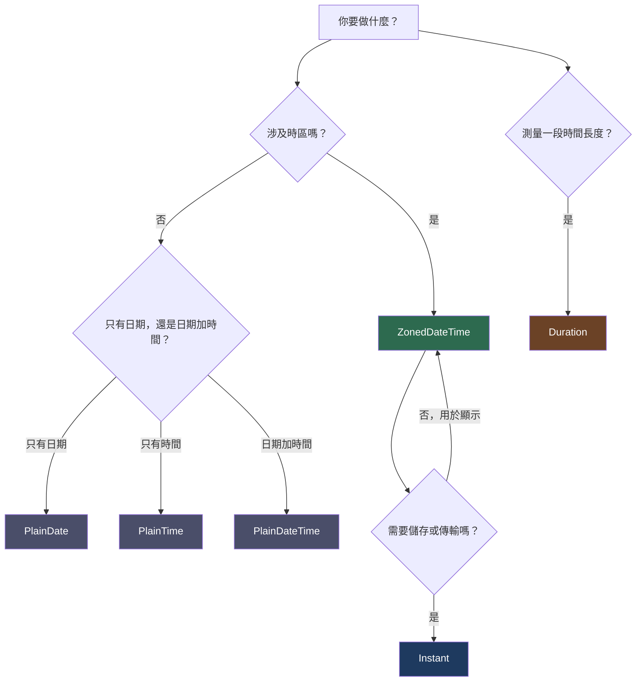

# [FEE-10001] Temporal API — 取代 `Date`

:::info
`Date` 從 Netscape Navigator 2 起就充滿缺陷。Temporal 是期待已久的替代方案：不可變（immutable）、具備時區感知能力，且設計上不存在語意模糊的問題。
:::

:::warning Web Platform Proposals
此提案目前位於 TC39 Stage 3。已在 Firefox 139+（Nightly）中出貨，Chrome 則在旗標（flag）後面支援。可在正式環境使用 polyfill：`@js-temporal/polyfill`。
在抵達 Stage 4 之前，API 介面仍可能變動。請參閱 MDN 與 TC39 提案儲存庫以取得最新狀態。
:::

## 背景

`Date` 是 JavaScript 最古老也最令人頭痛的 API 之一。1995 年，Brendan Eich 在 10 天內設計了它，並直接複製了 Java 的 `java.util.Date` — 一個 Java 自己也在三年內廢棄的 API。`Date` 的每一個主要問題，都是從那次決策繼承而來的。

### `Date` 的五大核心問題

**1. 月份從 0 開始計算。** 一月是 `0`，十二月是 `11`。這沒有任何技術上的理由，是從 Java 複製過來的 bug，且在不破壞既有 Web 相容性的前提下無法修正。

```js
// "這是哪個月？" — 每次忘記就會答錯
const d = new Date(2024, 0, 15); // 一月 15 日，而非第 0 個月
d.getMonth(); // 回傳 0，而非 1
```

**2. `Date` 是可變的（mutable）。** 所有 `setXxx()` 方法都會就地（in-place）修改物件。把一個 `Date` 傳給函式庫，它可能在你不知情的情況下修改你的時間戳記。

```js
const deadline = new Date('2024-12-31');
doSomething(deadline); // 函式庫內部呼叫了 deadline.setMonth(6)
console.log(deadline); // 現在變成 7 月 31 日 — 你的截止日消失了
```

**3. 不支援 IANA 時區。** `Date` 物件沒有時區的概念。你只能取得本地時間（根據機器 OS 設定）或 UTC。無法將 `America/New_York` 或 `Asia/Tokyo` 當作第一類值（first-class value）來操作。每個需要處理時區的應用程式，要麼引入函式庫，要麼撰寫脆弱的手動偏移量計算。

**4. 解析行為依實作而定。** `new Date(string)` 的行為部分有規範，部分留給引擎自行決定。

```js
new Date('2020-01-01')       // UTC（ISO 8601 純日期 → 依規範為 UTC）
new Date('01/01/2020')       // 本地時間（非 ISO 格式 → 依實作）
new Date('Jan 1 2020')       // 依實作而定
```

在不同環境（Node.js 版本、各瀏覽器、iOS Safari）中，相同的字串可能產生不同的時間點（instant）。

**5. 沒有時間長度（duration）運算。** 沒有內建的 `Duration` 型別。「30 天後」需要手動進行毫秒運算 — 而且這個運算在日光節約時間（DST）邊界上會出錯。

```js
// 錯誤：DST 轉換可能增減一小時
const thirtyDays = 30 * 24 * 60 * 60 * 1000;
const future = new Date(Date.now() + thirtyDays);

// 同樣錯誤：在 DST 轉換當天，這會悄悄給出錯誤的小時
const d = new Date();
d.setDate(d.getDate() + 30);
```

## 情境

一名開發者正在為分散在各地的團隊建立行事曆應用程式。會議需要以每位參與者的本地時區顯示。開發者這樣寫：

```js
// 嘗試方案一：偏移量計算
function toUserTime(utcMs, offsetHours) {
  return new Date(utcMs + offsetHours * 3600 * 1000);
}

const meeting = new Date('2024-03-10T14:00:00Z'); // UTC
const nyDisplay = toUserTime(meeting.getTime(), -5); // "EST 是 UTC-5"
```

冬天一切正常。但在 3 月 10 日 — 美國切換到日光節約時間的那天 — 會議顯示了錯誤的時間。紐約在轉換後是 UTC-4，而非 UTC-5。

開發者嘗試用硬編碼的 DST 表來修正，卻發現這張表需要涵蓋所有時區，以及每年的規則變更，最終發現自己在建立一個殘缺的 IANA 時區資料庫副本。

正確的解法是搭配 IANA 時區識別碼使用 `Temporal.ZonedDateTime`。Temporal API 原生處理 DST 轉換、閏秒與行事曆運算。

## 最佳實踐

**Engineers MUST 對任何要顯示給使用者的日期/時間使用 `Temporal.ZonedDateTime`**，無論是用於顯示、排程或跨時區比較。這個型別同時攜帶日期、時間與 IANA 時區。

```js
const meeting = Temporal.ZonedDateTime.from({
  year: 2024, month: 3, day: 10,
  hour: 14, minute: 0,
  timeZone: 'America/New_York',
});
```

**Engineers MUST 對資料庫儲存與跨系統傳輸使用 `Temporal.Instant`。** `Instant` 是純粹的 UTC 時間點，不含時區或行事曆。這是儲存至資料庫、放入 API 回應或寫入日誌的正確型別。

```js
// 儲存這個 — 而非 ZonedDateTime
const stored = meeting.toInstant().toJSON(); // "2024-03-10T19:00:00Z"
```

**Engineers SHOULD NOT 在涉及時區的情境下使用 `Temporal.PlainDateTime`。** `Plain` 型別存在的目的是用於無時區的使用情境：表單輸入、範本排程（「每週一早上 9 點，不論使用者身在何處」），以及尚未確定時區的假設性未來日期。

**以 `Temporal.Instant.toJSON()`（ISO 8601 字串）或 `.epochMilliseconds`（數字）儲存日期。** 絕對不要將 `ZonedDateTime` 直接儲存至資料庫 — 它攜帶了不屬於資料層的使用者特定時區。

```js
// 正確的持久化方式
const asISO    = instant.toJSON();           // "2024-03-10T19:00:00Z"
const asNumber = instant.epochMilliseconds;  // 1710097200000
```

**使用 `Temporal.Now.zonedDateTimeISO()` 取代 `new Date()` 取得當前時間。**

```js
// 以前
const now = new Date();

// 以後
const now = Temporal.Now.zonedDateTimeISO('America/New_York');
```

**從 `<input type="date">` 解析使用者輸入時，先解析為 `PlainDate`，再搭配使用者時區轉換為 `ZonedDateTime`。** `input[type=date]` 給你的是 `"2024-03-10"` 這樣的字串 — 沒有時間，沒有時區。先將其視為 `PlainDate`。

```js
const inputValue = '2024-03-10'; // 來自 <input type="date">
const plain = Temporal.PlainDate.from(inputValue);
const zoned = plain.toZonedDateTime({
  timeZone: userTimezone,
  plainTime: Temporal.PlainTime.from({ hour: 9 }),
});
```

**使用 `.with()` 進行部分更新，而非直接修改物件。**

```js
// 舊做法：可變、容易出錯
const d = new Date(2024, 2, 15);
d.setMonth(5); // 就地修改

// Temporal：不可變，回傳新物件
const d = Temporal.PlainDate.from('2024-03-15');
const updated = d.with({ month: 6 }); // 6 月 15 日 — d 保持不變
```

## 設計思維

### `Date` 為何如此設計

Brendan Eich 在 1995 年 5 月為了趕上 Netscape 的截止日，在 10 天內寫完了 JavaScript。日期處理直接複製自 Java 的 `java.util.Date`，包括從 0 開始的月份。Java 在 1.0 版（1996 年）出貨了 `java.util.Date`，意識到設計有缺陷，並在 1.1 版（1997 年）廢棄了大部分方法，改以 `java.util.Calendar` 取代。JavaScript 沒有類似的逃生門 — Web 的向後相容性限制使這個 bug 永久固定下來。

### 生態系統如何補救

`Date` 的不足催生了整個第三方日期函式庫分類：

| 函式庫 | 狀態 | 特色 |
|--------|------|------|
| Moment.js | 已廢棄（2020 年 10 月） | 可變包裝器，套件體積大 |
| date-fns | 持續維護中 | 函式式，支援 tree-shaking |
| day.js | 持續維護中 | 體積極小，相容 Moment.js API |
| Luxon | 持續維護中 | 不可變，具備時區感知 |

Temporal 直接從 Luxon 的設計汲取經驗。Luxon 的作者 Isaac Cambron 是 Temporal 提案的共同作者。關鍵心得：不可變性能預防一整類 bug；IANA 時區支援不可或缺；將「時間點」、「行事曆日期」與「時鐘時間」分離為不同型別，能讓 API 自我說明（self-documenting）。

### Temporal 的不可變設計

每個 Temporal 型別都是不可變的。算術運算回傳新物件，原始物件保持不變。這與 JavaScript 中 `String` 的設計原則相同 — 你不會修改一個字串，而是產生一個新的。

```js
const date = Temporal.PlainDate.from('2024-01-15');
const nextMonth = date.add({ months: 1 }); // 新物件：2024-02-15
console.log(date.toString()); // "2024-01-15" — 保持不變
```

不可變性也讓 Temporal 物件可以安全地跨函式呼叫共享、存入狀態，或作為快取鍵 — 這些都是使用 `Date` 時不安全的操作。

### Temporal 型別系統的職責分離

`Date` 試圖成為萬能工具：行事曆日期、時鐘時間、UTC 時間戳記，以及本地時間格式化 — 全部塞進一個可變物件。Temporal 明確地分離了這些職責：

- **Instant** — 我們在通用時間軸上的哪個位置？（無行事曆，無時區）
- **PlainDate / PlainTime / PlainDateTime** — 忽略時區，時鐘顯示什麼？
- **ZonedDateTime** — 在特定地點，行事曆和時鐘顯示什麼？
- **Duration** — 兩個時間點之間相差多少？

這反映了人類實際上思考時間的方式。「我的航班在 14:00 起飛」是 `PlainTime`。「Unix 紀元始於 1970-01-01T00:00:00Z」是 `Instant`。「會議在紐約時間週二早上 9 點」是 `ZonedDateTime`。

## 圖解



**快速參考：**

| 使用情境 | 型別 |
|----------|------|
| 向使用者顯示會議時間 | `ZonedDateTime` |
| 將事件儲存至資料庫 | `Instant` |
| 生日或節假日（純日期） | `PlainDate` |
| 營業時間（純時間） | `PlainTime` |
| 表單的日期時間輸入值 | `PlainDateTime` |
| 「加 30 天」或計算間隔 | `Duration` |

## 範例

以下是一個完整的時區感知行事曆應用程式範例：

```js
import { Temporal } from '@js-temporal/polyfill'; // 或等原生支援後直接使用

// 1. 取得當前時間，以 ZonedDateTime 表示
const nowNY = Temporal.Now.zonedDateTimeISO('America/New_York');
console.log(nowNY.toString());
// 例如："2024-03-15T09:30:00-04:00[America/New_York]"

// 2. 使用 Duration 加上 30 天
const thirtyDays = Temporal.Duration.from({ days: 30 });
const futureNY = nowNY.add(thirtyDays);
console.log(futureNY.toString());
// "2024-04-14T09:30:00-04:00[America/New_York]"
// DST 安全：Temporal 自動調整 UTC 偏移量

// 3. 轉換為 Instant 以便儲存
const instant = futureNY.toInstant();
const stored = instant.toJSON(); // ISO 8601 UTC 字串
console.log(stored);
// "2024-04-14T13:30:00Z"

// 4. 從儲存的值重建 ZonedDateTime
const reconstructed = Temporal.Instant
  .from(stored)
  .toZonedDateTimeISO('America/New_York');
console.log(reconstructed.toString());
// "2024-04-14T09:30:00-04:00[America/New_York]" — 完全吻合

// 5. 跨時區比較：東京早上 9 點 vs 倫敦早上 9 點
const tokyoMeeting = Temporal.ZonedDateTime.from(
  '2024-06-01T09:00:00[Asia/Tokyo]'
);
const londonMeeting = Temporal.ZonedDateTime.from(
  '2024-06-01T09:00:00[Europe/London]'
);

// 以 Instant 比較，找出在時間軸上哪個更早
const tokyoInstant  = tokyoMeeting.toInstant();
const londonInstant = londonMeeting.toInstant();

const comparison = Temporal.Instant.compare(tokyoInstant, londonInstant);
// -1 代表 tokyoMeeting 較早
console.log(comparison); // -1

// 兩者相差多久？
const gap = tokyoInstant.until(londonInstant);
console.log(gap.toString()); // "PT8H" — 東京早上 9 點比倫敦早上 9 點早 8 小時

// 以倫敦時區顯示東京會議時間
const tokyoMeetingInLondon = tokyoMeeting
  .toInstant()
  .toZonedDateTimeISO('Europe/London');
console.log(tokyoMeetingInLondon.toLocaleString('en-GB', { timeZoneName: 'short' }));
// "01/06/2024, 01:00:00 BST"
```

## 型別參考

| 型別 | 一句話說明 |
|------|-----------|
| `Temporal.PlainDate` | 不含時間的行事曆日期 — 生日、節假日、申報截止日 |
| `Temporal.PlainTime` | 不含日期的一天中的時間 — 營業時間、鬧鐘時間 |
| `Temporal.PlainDateTime` | 不含時區的日期加時間 — 排程 UI 的輸入值、假設性日期 |
| `Temporal.ZonedDateTime` | 包含 IANA 時區的日期加時間 — 任何面向使用者的時間的正確選擇 |
| `Temporal.Instant` | 絕對 UTC 時間點 — 日誌、資料庫儲存、跨系統比較 |
| `Temporal.Duration` | 用於算術的時間長度 — 「30 天」、「2 小時 15 分鐘」 |

所有型別均為不可變。所有算術方法均回傳新物件。

### 常用建構模式

```js
// 從字串字面值建立
Temporal.PlainDate.from('2024-03-15');
Temporal.Instant.from('2024-03-15T14:00:00Z');
Temporal.ZonedDateTime.from('2024-03-15T14:00:00+09:00[Asia/Tokyo]');

// 從欄位建立
Temporal.PlainDate.from({ year: 2024, month: 3, day: 15 });
Temporal.ZonedDateTime.from({ year: 2024, month: 3, day: 15, hour: 14, timeZone: 'Asia/Tokyo' });

// 取得當前時間
Temporal.Now.instant();                          // 當前 UTC 時間點
Temporal.Now.zonedDateTimeISO('Asia/Tokyo');     // 東京當前時間
Temporal.Now.plainDateISO('Asia/Tokyo');         // 東京今日日期
```

## 內部參考

- [FEE-300 JavaScript Core & Runtime Overview](../../JavaScript%20Core%20and%20Runtime/300.md)
- [FEE-400 Browser APIs Overview](../../Browser%20APIs%20and%20Web%20Platform/400.md)
- FEE-10002 — Explicit Resource Management（另一個與 Temporal 同步出貨的 Stage 3 提案）

## 參考資料

- [TC39 Temporal 提案](https://tc39.es/proposal-temporal/) — 官方規格
- [Temporal API 文件](https://tc39.es/proposal-temporal/docs/) — 完整 API 參考
- [MDN：Temporal](https://developer.mozilla.org/en-US/docs/Web/JavaScript/Reference/Global_Objects/Temporal) — 瀏覽器相容性與方法參考
- [Temporal Cookbook](https://tc39.es/proposal-temporal/docs/cookbook.html) — 常見日期/時間任務的實用範例
- [Axel Rauschmayer：JavaScript for impatient programmers — Temporal](https://exploringjs.com/js/book/ch_temporal.html) — 深度解析章節
- [@js-temporal/polyfill on npm](https://www.npmjs.com/package/@js-temporal/polyfill) — 正式環境可用的 polyfill
- [Firefox 139 Temporal 出貨公告](https://developer.mozilla.org/en-US/docs/Mozilla/Firefox/Releases/139) — 首個不需旗標即可使用的瀏覽器
