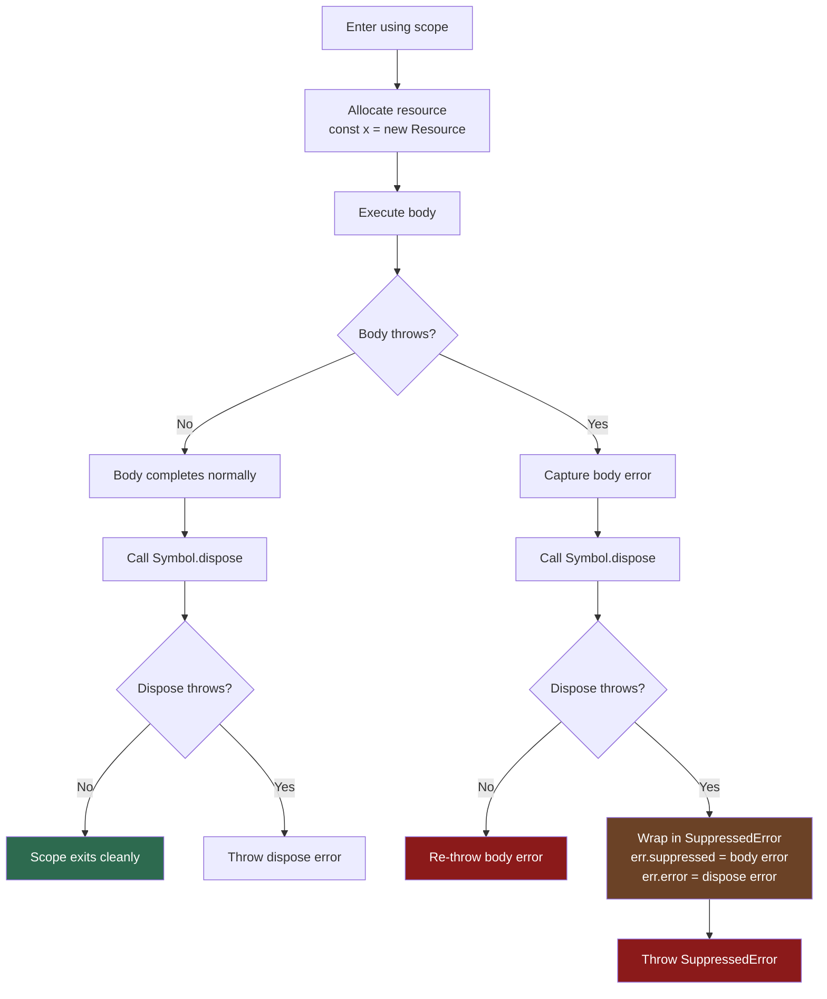

# [FEE-10002] Explicit Resource Management — `using` 與 `await using`

:::info
每一條你忘記關閉的資料庫連線、每一個在例外後懸空的檔案控制代碼（file handle）— `using` 讓清理（cleanup）變得無條件且與配置（allocation）並排，一如它本該有的樣子。
:::

:::warning Web Platform Proposals
此提案目前位於 TC39 Stage 3。已在 V8 12.1（Chrome 123+、Node.js 22+）中出貨，TypeScript 5.2+ 亦原生支援，並可透過 Babel 轉換使用。
在抵達 Stage 4 之前，API 介面仍可能變動。請參閱 MDN 與 TC39 提案儲存庫以取得最新狀態。
:::

## 背景

JavaScript 的資源管理長期以來依賴 `try/finally` 區塊。這個模式廣為人知，卻充滿容易出錯的地方。每次開發者手動撰寫清理程式碼，都是距離資源洩漏只有一個錯誤的距離。

### `try/finally` 的四種失敗模式

**1. 完全忘記撰寫 `finally` 區塊。** 當開發者專注於正常流程（happy path）時，`finally` 往往是事後才想到的。在程式碼審查或趕工期限的壓力下，它常常被省略。

```js
async function handleRequest(req) {
  const db = await openConnection();
  const result = await db.query(req.params.id); // 傳入錯誤 id 時拋出例外
  await db.close(); // 若 query 拋出例外，這行永遠不會執行
  return result;
}
```

每次發生錯誤都會洩漏連線。這個問題可能在連線池（connection pool）耗盡之前都不會在正式環境中浮現。

**2. 在非同步 `finally` 區塊中忘記 `await`。** 這是一個微妙的變體，TypeScript 預設不會偵測到。

```js
async function handleRequest(req) {
  const db = await openConnection();
  try {
    return await db.query(req.params.id);
  } finally {
    db.close(); // 少了 await — close() 執行但錯誤被靜默丟棄
  }
}
```

`finally` 區塊回傳一個懸空的 Promise（floating Promise）。下一個請求抵達時，連線可能尚未關閉。

**3. 清理時拋出的例外會靜默吞掉原始例外。** 若本體（body）與 `finally` 區塊都拋出例外，`finally` 的例外會勝出，原始例外就此永遠消失。

```js
async function doWork() {
  const db = await openConnection();
  try {
    throw new Error('query failed'); // 原始例外
  } finally {
    throw new Error('close failed'); // 這個例外取代了原始例外
    // "query failed" 已消失 — 你永遠不會在日誌中看到它
  }
}
```

**4. 多個資源需要巢狀的 `try/finally` 區塊。** 每增加一個資源，就多一層巢狀結構，也多一個犯錯的機會。

```js
async function handleRequest(req) {
  const db = await openConnection();
  try {
    const file = await openFile(req.params.path);
    try {
      return await processFileWithDb(file, db);
    } finally {
      await file.close();
    }
  } finally {
    await db.close();
  }
}
```

每增加一個資源，金字塔就向右延伸一層。清理邏輯與配置邏輯之間隔著任意距離，資源的生命週期也不夠直觀。

## 情境

一位開發者正在為 Node.js API 撰寫請求處理函式（request handler）。這個函式開啟一個資料庫連線來查詢使用者記錄，再開啟一個檔案來寫入稽核日誌（audit log）。在原始程式碼中，開發者正確地為資料庫連線加了 `finally` 區塊，卻忘記處理檔案控制代碼：

```js
// 有問題：檔案控制代碼在發生錯誤時洩漏
async function auditHandler(req, res) {
  const db = await Database.connect(process.env.DB_URL);
  try {
    const user = await db.findUser(req.body.userId);
    const logFile = await fs.open('./audit.log', 'a');

    // 若這行拋出例外，logFile 永遠不會被關閉
    await logFile.appendFile(`[${new Date().toISOString()}] ${user.name} accessed\n`);
    await logFile.close();

    res.json({ ok: true });
  } finally {
    await db.close(); // db 總是被清理
    // logFile.close() 在此被遺忘了
  }
}
```

每次 `appendFile` 拋出例外，檔案描述符（file descriptor）就會洩漏。在高流量的情況下，這會耗盡作業系統的檔案描述符限制。

使用 `using` 與 `await using` 後，修正是結構性的，而非依賴紀律 — 開發者不可能忘記清理，因為清理是在配置時宣告的：

```js
// 修正後：兩個資源都必定被清理
async function auditHandler(req, res) {
  await using db = await Database.connect(process.env.DB_URL);
  // 離開此作用域時，不論發生什麼事，db[Symbol.asyncDispose]() 都會被呼叫

  const user = await db.findUser(req.body.userId);

  await using logFile = await fs.open('./audit.log', 'a');
  // 離開此作用域時，logFile[Symbol.asyncDispose]() 都會被呼叫

  await logFile.appendFile(`[${new Date().toISOString()}] ${user.name} accessed\n`);

  res.json({ ok: true });
  // db 與 logFile 依宣告的反序在此被釋放
}
```

清理現在是無條件的，且與資源配置並排在一起。沒有任何東西可以被遺忘。

## 最佳實踐

**Engineers MUST 在任何管理資源的類別上實作 `[Symbol.dispose]()`** — 包括資料庫連線、檔案控制代碼、鎖（lock）、訂閱（subscription）、事件監聽器（event listener）、計時器。若一個類別獲取了某個必須釋放的東西，它就必須公開一個釋放介面（disposal interface）。

```js
class DatabaseConnection {
  #conn;

  constructor(conn) {
    this.#conn = conn;
  }

  async query(sql) {
    return this.#conn.execute(sql);
  }

  // 同步釋放：適用於清理是同步的類別
  [Symbol.dispose]() {
    this.#conn.closeSync();
  }

  // 非同步釋放：適用於清理是非同步的類別
  async [Symbol.asyncDispose]() {
    await this.#conn.close();
  }
}
```

**Engineers SHOULD 優先使用 `using` 而非 `try/finally` 進行所有資源清理。** `using` 關鍵字讓清理變得無條件（在正常離開與拋出例外時都會執行），且清理邏輯位於類別定義中，而非分散在每個呼叫端（call site）。

**當管理數量不固定的資源時，使用 `DisposableStack`**，例如動態取得的鎖、一批連線，或在迴圈中建立的資源。

```js
async function processItems(items) {
  await using stack = new AsyncDisposableStack();

  for (const item of items) {
    // .use() 登記一個 Disposable；stack 取得其所有權
    const lock = stack.use(await acquireLock(item.id));
    await processItem(item, lock);
  }
  // 當 stack 離開作用域，所有鎖依反序釋放
}
```

**當同時需要同步與非同步釋放時，同時實作 `[Symbol.dispose]` 與 `[Symbol.asyncDispose]`。** 這讓類別可以在 `using`（同步情境）與 `await using`（非同步情境）中都能使用。

**不要在 `[Symbol.dispose]` 中拋出例外。** 若清理失敗，記錄並抑制錯誤，或使用 `SuppressedError` 保留兩個錯誤。若 `dispose` 拋出例外，它會取代呼叫端堆疊中的原始錯誤，讓除錯變得更困難。

```js
[Symbol.dispose]() {
  try {
    this.#conn.closeSync();
  } catch (err) {
    // 記錄但不重新拋出
    console.error('Connection close failed:', err);
  }
}
```

## 設計思維

### RAII：JavaScript 缺少 30 年的模式

RAII（Resource Acquisition Is Initialization，資源取得即初始化）是 Bjarne Stroustrup 在 1980 年代引入的 C++ 設計原則。核心概念：將資源生命週期與物件作用域綁定。當物件離開作用域，其解構函式（destructor）就會執行 — 無條件地，即使例外正在傳播也不例外。

JavaScript 擁有閉包（closure）、Promise 與 async/await，卻沒有語言層級等效於 RAII 的機制。資源必須手動追蹤與釋放。這不是紀律的失敗，而是語言特性的缺失。

### 其他語言如何解決這個問題

JavaScript 是最後幾個加入明確資源管理語法的主要語言之一：

| 語言 | 語法 | 介面 |
|------|------|------|
| C++ | 解構函式（`~T()`） | 作用域結束時執行 |
| Python | `with` 陳述式 | `__enter__` / `__exit__` |
| C# | `using` 陳述式 | `IDisposable.Dispose()` |
| Java | try-with-resources | `AutoCloseable.close()` |
| Swift | `defer` 陳述式 | 任意陳述式 |
| Kotlin | `.use {}` 擴充函式 | `Closeable.close()` |
| Go | `defer` 陳述式 | 任意陳述式 |
| **JavaScript** | `using` / `await using` | `[Symbol.dispose]()` / `[Symbol.asyncDispose]()` |

JavaScript 的設計最接近 C# — 一個在作用域結束時呼叫已知介面方法的關鍵字 — 同時加入了獨立的非同步變體，以因應 JavaScript 普遍使用非同步 API 的特性。

### React 的 `useEffect` 清理就是同一個概念

React 開發者早已習慣「設置與清理」的思考模式：

```js
useEffect(() => {
  const subscription = eventBus.subscribe(handler);
  return () => {
    subscription.unsubscribe(); // 清理函式
  };
}, []);
```

`useEffect` 中的 `return () => {}` 就是 RAII 在元件（component）生命週期中的體現。Explicit Resource Management 提案將同樣的概念帶入純粹的 JavaScript 作用域，不需要 React 或任何框架。清理函式變成 `[Symbol.dispose]()`，作用域邊界則由 `using` 宣告決定。

### `SuppressedError`：保留兩個例外

在此提案之前，若本體與清理函式都拋出例外，其中一個錯誤會被靜默丟棄：

```js
// 原始錯誤「body threw」被「cleanup threw」取代
// 你永遠不會在日誌中看到「body threw」
```

提案引入了 `SuppressedError` 來保留兩個錯誤：

```js
// SuppressedError 結構：
// err.message    — "An error was suppressed during disposal"
// err.error      — [Symbol.dispose]() 拋出的例外（壓制者）
// err.suppressed — 本體拋出的原始例外（被壓制者）
```

當 `using` 同時捕捉到本體例外與 `dispose` 例外時，會將兩者包裝成 `SuppressedError` 並拋出。你現在可以在 `catch` 區塊中同時存取兩個錯誤 — 原始問題與清理失敗。

## 圖解



**比較：`using` vs `try/finally` 控制流程**

| 情境 | `try/finally` | `using` |
|------|---------------|---------|
| 正常結束時清理 | 是（需有 `finally`） | 必定執行 |
| 拋出例外時清理 | 是（需有 `finally`） | 必定執行 |
| 忘記清理 | 可能發生 | 不可能 — 清理在類別上 |
| 本體與 dispose 都拋出 | 原始錯誤消失 | 兩者保留在 `SuppressedError` |
| 多個資源 | 巢狀區塊 | 線性宣告 |
| 清理位置 | 呼叫端 | 類別定義 |

## 深入探討

### `using` 與 `try/catch/finally` 的互動方式

`using` 登記一個 dispose 動作，在詞法作用域（lexical scope）結束時執行 — 但「作用域結束」與 `try/catch/finally` 有精確的順序關係：

1. `finally` 區塊先執行。
2. `using` 的 dispose 動作在 `finally` 之後執行，依宣告的反序。

```js
function example() {
  using a = new ResourceA();
  using b = new ResourceB();
  try {
    throw new Error('body error');
  } catch (err) {
    console.log('catch:', err.message);
  } finally {
    console.log('finally');
    // 此時 b[Symbol.dispose]() 與 a[Symbol.dispose]() 尚未執行
  }
  // b[Symbol.dispose]() 在此執行（最後宣告，最先釋放）
  // a[Symbol.dispose]() 在此執行（最先宣告，最後釋放）
}
// 輸出：
// catch: body error
// finally
// (dispose b)
// (dispose a)
```

這個順序是刻意設計的：`finally` 區塊可能仍需參照資源（例如進行日誌或刷新緩衝區），因此釋放在 `finally` 完成後才發生。注意：此順序適用於 `using` 宣告在包裹函式作用域（enclosing function scope）中、位於 `try` 區塊之外的情況。若 `using` 宣告在 `try` 區塊內部，其釋放動作會在該 `try` 區塊作用域結束時觸發 — 早於 `finally`。

### `SuppressedError` 語意

`SuppressedError` 是此提案引入的新內建錯誤型別，繼承自 `Error`。

```js
try {
  using resource = new FailingResource();
  throw new Error('body error');
} catch (err) {
  if (err instanceof SuppressedError) {
    console.log('Original error:', err.suppressed.message); // "body error"
    console.log('Cleanup error:', err.error.message);       // 來自 dispose
  }
}
```

命名方式刻意設計，但初次看到可能令人困惑：
- `err.suppressed` 是被壓制的錯誤 — 即原始本體例外。
- `err.error` 是造成壓制的錯誤 — 即 `[Symbol.dispose]()` 拋出的例外。

可以這樣理解：`dispose` 例外是「主動」的錯誤（`err.error`），而本體例外被它「壓制」了（`err.suppressed`）。

### `DisposableStack` 的方法

`DisposableStack`（及其非同步版本 `AsyncDisposableStack`）提供一個 Disposable 的堆疊（stack），當堆疊本身被釋放時，所有登記的資源都會被釋放。這是處理動態資源管理的正確工具。

```js
function createBatch(items) {
  const stack = new DisposableStack();

  for (const item of items) {
    // .use(resource) — 登記一個 Disposable；回傳該資源
    const conn = stack.use(openConnection(item));

    // .adopt(value, fn) — 登記一個非 Disposable 並提供回呼函式
    stack.adopt(conn.socket, (socket) => socket.destroy());

    // .defer(fn) — 登記一個任意的清理回呼函式
    stack.defer(() => console.log(`closed connection for ${item}`));
  }

  return stack; // 呼叫端負責釋放
}

{
  using batch = createBatch(['a', 'b', 'c']);
  // 使用 batch...
} // 所有連線關閉、socket 銷毀、日誌訊息印出
```

`DisposableStack` 的四個方法：

| 方法 | 接受什麼 | 適用情境 |
|------|---------|---------|
| `.use(disposable)` | 任何具有 `[Symbol.dispose]()` 的物件 | 轉移 Disposable 的所有權 |
| `.adopt(value, fn)` | 任意值 + 清理回呼 | 非 Disposable 的資源（原始 socket、原生控制代碼） |
| `.defer(fn)` | 一個零參數函式 | 清理時的任意副作用 |
| `.move()` | 無 | 轉移所有權：回傳一個新堆疊；舊堆疊清空 |

### TypeScript 支援

TypeScript 5.2 將 `using` 與 `await using` 作為第一類關鍵字加入。相關型別已定義在 `lib` 中：

```ts
// TypeScript 內建介面（不需 import）
interface Disposable {
  [Symbol.dispose](): void;
}

interface AsyncDisposable {
  [Symbol.asyncDispose](): Promise<void>;
}

// TypeScript 從右側推斷 conn 的型別
using conn = new DatabaseConnection(url);
//     ^^^^ TypeScript 會檢查 DatabaseConnection 是否實作 Disposable
```

若對未實作 `[Symbol.dispose]()` 的型別使用 `using`，TypeScript 會產生編譯錯誤。這個靜態檢查消除了一整類的執行期錯誤。

若要在以舊環境為目標的 TypeScript 專案中使用 `using`，請在 `tsconfig.json` 中加入 `"lib": ["ES2022", "ESNext.Disposable"]`（或 `"ESNext"`）。

## 範例

### 1. 基本的 `using` 搭配資料庫連線

```js
class DatabaseConnection {
  #pool;
  #client;

  constructor(client, pool) {
    this.#client = client;
    this.#pool = pool;
  }

  async query(sql, params = []) {
    return this.#client.query(sql, params);
  }

  // 同步釋放：立即將 client 歸還給連線池
  [Symbol.dispose]() {
    this.#pool.release(this.#client);
  }
}

class DatabasePool {
  // ... 連線池實作

  async connect() {
    const client = await this.#acquireClient();
    return new DatabaseConnection(client, this);
  }

  release(client) {
    this.#clients.push(client);
  }
}

// 用法 — 即使拋出例外，連線也必定歸還給連線池
async function getUserById(pool, userId) {
  using conn = await pool.connect();
  const rows = await conn.query('SELECT * FROM users WHERE id = $1', [userId]);
  return rows[0] ?? null;
  // conn[Symbol.dispose]() 在此呼叫 — client 歸還給連線池
}
```

### 2. `await using` 搭配非同步檔案控制代碼

```js
import { open } from 'node:fs/promises';

class AsyncFileHandle {
  #handle;

  constructor(handle) {
    this.#handle = handle;
  }

  async read() {
    return this.#handle.readFile({ encoding: 'utf8' });
  }

  async write(data) {
    return this.#handle.writeFile(data, { encoding: 'utf8' });
  }

  async [Symbol.asyncDispose]() {
    await this.#handle.close();
    // 檔案描述符已釋放 — 若需要可安全多次呼叫
  }
}

async function appendAuditLog(userId, action) {
  await using fh = new AsyncFileHandle(await open('./audit.log', 'a'));
  await fh.write(`${new Date().toISOString()} user=${userId} action=${action}\n`);
  // fh[Symbol.asyncDispose]() 在此呼叫 — 檔案控制代碼關閉
}
```

### 3. `DisposableStack` 組合多個資源

```js
// Polyfill: import 'core-js/proposals/explicit-resource-management'（side-effect 引入）
// 原生支援：Node.js 22+ 與 Chrome 123+

async function processTransaction(db, items) {
  await using stack = new AsyncDisposableStack();

  // 取得一個交易（transaction） — 包裝它讓 stack 可以釋放它
  const tx = await db.beginTransaction();
  stack.defer(async () => {
    if (!tx.committed) {
      await tx.rollback(); // 必定回滾未提交的交易
    }
  });

  // 為每個項目取得一個鎖
  for (const item of items) {
    const lock = await acquireRowLock(item.id);
    // .adopt() 處理沒有 [Symbol.asyncDispose] 的資源
    stack.adopt(lock, async (l) => await l.release());
  }

  // 處理所有項目
  for (const item of items) {
    await tx.update('items', { processed: true }, { id: item.id });
  }

  await tx.commit();
  // stack 依反序釋放：
  // 1. 各項目的鎖依反序釋放
  // 2. 回滾保護執行（因為 tx.committed 為 true，故為空操作）
}
```

## 內部參考

- [FEE-300 JavaScript Core & Runtime Overview](../../JavaScript%20Core%20and%20Runtime/300.md)
- [FEE-301 Event Loop & Async Model](../../JavaScript%20Core%20and%20Runtime/301.md)
- [FEE-10001 Temporal API](10001.md)
- [FEE-10006 Async Context](10006.md)

## 參考資料

- [TC39 proposal-explicit-resource-management](https://github.com/tc39/proposal-explicit-resource-management) — 官方提案儲存庫，含規格原文與設計動機
- [TypeScript 5.2 Release Notes — `using` Declarations and Explicit Resource Management](https://www.typescriptlang.org/docs/handbook/release-notes/typescript-5-2.html) — TypeScript 實作細節與型別系統整合說明
- [MDN: Symbol.dispose](https://developer.mozilla.org/en-US/docs/Web/JavaScript/Reference/Global_Objects/Symbol/dispose) — 瀏覽器相容性與 API 參考
- [MDN: Symbol.asyncDispose](https://developer.mozilla.org/en-US/docs/Web/JavaScript/Reference/Global_Objects/Symbol/asyncDispose) — 非同步釋放參考
- [V8 blog: Explicit Resource Management](https://v8.dev/blog/explicit-resource-management) — V8 實作筆記與效能考量
- [MDN: SuppressedError](https://developer.mozilla.org/en-US/docs/Web/JavaScript/Reference/Global_Objects/SuppressedError) — 錯誤型別參考
- [Axel Rauschmayer: Explicit Resource Management in JavaScript](https://2ality.com/2022/10/javascript-explicit-resource-management.html) — 提案設計的深度分析
