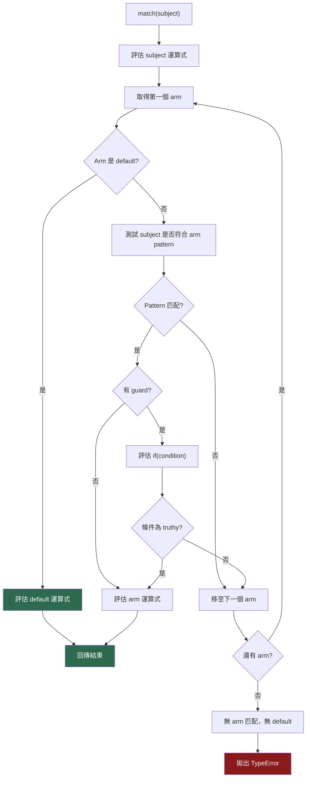

# [FEE-10003] Pattern Matching — `match` 運算式

:::info
`switch` 比較的是值，`match` 比較的是形狀 — 而且作為一個運算式，它可以出現在任何需要值的地方，讓條件分派成為型別系統真正能推理的事。
:::

:::warning Web Platform Proposals
此提案目前位於 TC39 Stage 2。在沒有 transpiler 的情況下，任何瀏覽器或引擎都無法使用此語法。
語法仍在積極演進中，**在達到 Stage 4 之前可能會有所變動**。請隨時查閱 [TC39 提案儲存庫](https://github.com/tc39/proposal-pattern-matching) 取得最新語法。在未使用 Babel transpiler 並充分了解穩定性風險的前提下，不得用於正式環境。
:::

## 背景

JavaScript 的 `switch` 陳述式數十年來一直是主要的多分支分派機制。它適用於簡單的相等性測試，但一旦需要根據值的*結構*進行分支，就會迅速失效。有四個具體問題使 `switch` 不足以應對現代 JavaScript 的需求：

### 1. 無法進行結構性匹配

`switch` 只能使用 `===` 將主體（subject）與字面值比較。它無法檢查物件形狀、陣列長度或巢狀屬性。

```js
// 你無法用 switch 寫出這個邏輯：
// 「如果回應有 status 200 且具有 data 屬性，執行 X」
// 你必須改用巢狀的 if：
if (res.status === 200 && 'data' in res) {
  handleSuccess(res.data);
} else if (res.status === 404 && 'message' in res) {
  handleNotFound(res.message);
}
```

每個檢查都必須手動分解為屬性存取與比較。值的結構被零散地分散在各個條件中描述。

### 2. Fall-through 錯誤需要明確的 `break`

`switch` 在沒有明確停止的情況下會從一個 `case` 穿透到下一個。`break` 的必要性是一個容易踩到的陷阱：漏掉一個 `break` 就會靜默地執行兩個 case。

```js
switch (action.type) {
  case 'INCREMENT':
    count++;
    // 少了 break — 會穿透到 DECREMENT
  case 'DECREMENT':
    count--;
    break;
}
```

這類錯誤非常普遍，以至於 linter（`no-fallthrough`）專門為此而存在。

### 3. 沒有 guard 子句 — 需要巢狀結構

`switch` 無法在 `case` 上附加條件。任何超出簡單相等性的條件邏輯都必須巢狀在 case 本體內：

```js
switch (res.status) {
  case 429:
    if (res.retryAfter < MAX_RETRY_DELAY) {
      scheduleRetry(res.retryAfter);
    } else {
      handleFatalError(res);
    }
    break;
}
```

guard 條件藏在本體內部，無法在 `switch` 的結構層次上看到。

### 4. `switch` 是陳述式，不是運算式

`switch` 不產生值。若不用立即呼叫函式（IIFE）包裹或引入一個可變動的 `let` 變數，就無法在賦值、`return` 或模板字面值中使用它：

```js
// 被迫使用可變動的變數
let label;
switch (status) {
  case 200: label = 'OK'; break;
  case 404: label = 'Not Found'; break;
  default:  label = 'Unknown';
}
```

這個模式是樣板程式碼，命令式的突變（mutation）模糊了意圖。

### 5. TypeScript 對 `switch` 的型別縮窄（type narrowing）有限

TypeScript 可以在 `switch` 內部縮窄可辨識聯合型別（discriminated union），但在更複雜的模式下會失效 — 例如巢狀條件、多個辨識符（discriminant）或結構性檢查。編譯器驗證窮盡性（exhaustiveness）的能力依賴於在 `default` case 中使用 `never` 的技巧，這個技巧很容易被遺忘。

---

`match` 運算式同時解決上述五個問題。

## 情境

一位開發者正在建構客戶端 API 層。fetch 處理函式根據伺服器的回應回傳不同的形狀：

- `{ status: 200, data: T }` — 成功
- `{ status: 404, message: string }` — 找不到資源
- `{ status: 429, retryAfter: number }` — 速率限制
- 任何其他 `{ status: number, error: string }` — 非預期的伺服器錯誤

目前的實作使用一長串 `if/else if` 鏈：

```js
// 修改前：脆弱、冗長、無結構性保證
async function handleApiResponse(res) {
  if (res.status === 200 && res.data !== undefined) {
    return renderData(res.data);
  } else if (res.status === 404 && res.message !== undefined) {
    return renderNotFound(res.message);
  } else if (res.status === 429 && res.retryAfter !== undefined) {
    if (res.retryAfter < 60) {
      return scheduleRetry(res.retryAfter);
    } else {
      return renderError('Rate limit exceeded — retry window too long');
    }
  } else {
    return renderError(res.error ?? 'Unknown error');
  }
}
```

這段程式碼的問題：

- 結構性測試（`res.data !== undefined`）與它們所描述的形狀是分離的。
- `retryAfter` 的 guard 條件巢狀了兩層。
- 新增一種回應形狀需要小心放置，以避免被先前的條件遮蔽。
- TypeScript 無法證明窮盡性。

使用 `match` 運算式後，相同的邏輯變得清晰：

```js
// 修改後：結構性、窮盡、可讀
// 需要 @babel/plugin-proposal-pattern-matching（Stage 2 — 語法可能變動）
async function handleApiResponse(res) {
  return match (res) {
    when { status: 200, let data }: renderData(data);
    when { status: 404, let message }: renderNotFound(message);
    when { status: 429, let retryAfter } and if (retryAfter < 60):
      scheduleRetry(retryAfter);
    when { status: 429 }: renderError('Rate limit exceeded — retry window too long');
    default: renderError(res.error ?? 'Unknown error');
  };
}
```

每個 arm 描述它期望的形狀、解構所需的值，並在必要時附加 guard。`default` arm 使窮盡性明確。TypeScript 可以根據 binding pattern 在每個 arm 中縮窄型別。

## 最佳實踐

**Engineers SHOULD 對可辨識聯合（discriminated union）和變體型別（variant type）優先使用 `match` 而非長串 `if/else if` 鏈。** 當主體是已知形狀集合的值（API 回應、Redux action、路由物件、解析器 AST 節點），`match` 在同一個地方表達了測試與萃取。

**務必包含 `default` arm 以明確表達窮盡性。** 若沒有 `default` arm，當沒有任何 arm 匹配時，`match` 運算式會在執行期拋出 `TypeError`。明確的 `default` arm — 即使它是拋出例外或記錄日誌 — 也能記錄開發者對未識別 case 的處理意圖。

```js
// 建議寫法：
match (action.type) {
  when 'INCREMENT': state + 1;
  when 'DECREMENT': state - 1;
  default: throw new Error(`Unhandled action: ${action.type}`);
}

// 避免這樣（未匹配時靜默回傳 undefined）：
// ... 沒有 default arm
```

**使用 guard pattern（`and if(condition)`）而非在 `when` arm 內巢狀 `if`。** Guard pattern 讓條件在 match 運算式的結構層次上可見，而不是埋藏在 arm 本體內。

```js
// 建議 — guard 在 arm 層次上可見
when { status: 429, let retryAfter } and if (retryAfter < 60): scheduleRetry(retryAfter);

// 避免 — guard 藏在 arm 本體內
when { status: 429, let retryAfter }: do {
  if (retryAfter < 60) { scheduleRetry(retryAfter); }
  else { renderError('retry window too long'); }
};
```

**搭配 TypeScript 可辨識聯合進行編譯期窮盡性檢查。** Binding pattern 會縮窄每個 arm 內的型別。結合辨識符屬性（如 `status` 或 `type`），TypeScript 可以驗證所有聯合成員都被處理。

```ts
type ApiResponse =
  | { status: 200; data: User }
  | { status: 404; message: string }
  | { status: 429; retryAfter: number };

// 在每個 arm 中，TypeScript 將 res 縮窄為匹配的成員
match (res as ApiResponse) {
  when { status: 200, let data }: renderUser(data);  // data: User
  when { status: 404, let message }: renderError(message); // message: string
  when { status: 429, let retryAfter }: scheduleRetry(retryAfter); // retryAfter: number
  default: throw new Error('Unexpected status');
}
```

**沒有 Babel transpiler 時，NOT 得在正式環境使用 `match`。** 此提案位於 Stage 2。語法與早期草稿相比已有重大變更，在達到 Stage 4 之前可能再次改變。Babel 外掛的存在不代表穩定性 — 它意味著語法可供實驗與回饋。

## 設計思維

### 為什麼 JavaScript 落後了

Pattern matching 並不是新概念。它是 ML 家族語言（Haskell、OCaml、F#）、Rust、Swift 和 Elixir 的基礎。這些語言將其視為檢查和分支資料的主要方式 — 比 `if` 陳述式更基礎。

JavaScript 缺少 pattern matching 數十年，不是因為這個功能難以規格化，而是因為 `switch` 被認為「夠用」，社群用函式庫填補了這個缺口。一旦 userland 的替代方案存在，標準化的壓力就會降低。這個提案是一個認可：這個缺口已經大到無法忽視，尤其是 TypeScript 可辨識聯合已讓結構性分支成為 TypeScript 的核心慣用法。

### 函式庫如何填補缺口

在提案出現之前，生態系發展出幾個 pattern matching 函式庫：

**ts-pattern**（最受歡迎的 TypeScript 解決方案）提供一個 `match` 函式，搭配可鏈式呼叫的 `.with()` arm 與用於編譯期窮盡性的 `.exhaustive()`：

```ts
// ts-pattern 版本的 API 回應範例
import { match } from 'ts-pattern';

const result = match(res)
  .with({ status: 200 }, ({ data }) => renderData(data))
  .with({ status: 404 }, ({ message }) => renderNotFound(message))
  .with({ status: 429, retryAfter: P.when(r => r < 60) }, ({ retryAfter }) =>
    scheduleRetry(retryAfter))
  .with({ status: 429 }, () => renderError('retry window too long'))
  .otherwise(() => renderError(res.error ?? 'Unknown error'));
```

`ts-pattern` 不需要 transpiler 就能立即使用，並提供出色的 TypeScript 型別推斷。原生 `match` 運算式將提供更緊湊的語法（pattern 中原生解構、結構層次的 guard 子句），並且可在純 JavaScript 中使用。兩種方式在結構上是等效的。

其他函式庫：Redux action 型別的 `switch` 是手動的 pattern matching — 對 `action.type` 進行 `switch` 並在每個 `case` 內解構，本質上就是結構性匹配的慣例。`match-iz` 和 `patcom` 以不同的人體工學提供類似功能。

### 從 Rust 和 Python 學習

**Rust 的 `match`** 引入了 TC39 提案採用的兩個核心概念：

1. 窮盡性保證 — `match` 必須處理每一種可能的 case，否則編譯器拒絕編譯。TC39 提案在執行期（未匹配時拋出 `TypeError`）和型別檢查時（透過 TypeScript）達成相同效果。
2. Pattern 中的綁定 — Rust 的 pattern 內 `let` 綁定（例如 `Some(x)`）直接對應到提案的 binding pattern（`let x`）。

**Python 的 `match` 陳述式（PEP 634，Python 3.10）** 證明了結構性 pattern matching 可以在動態語言中加入，而不會破壞型別系統或增加額外負擔。Python 的 `case` 語法使用隱式綁定（裸名稱永遠是捕捉，而非比較），而 TC39 提案使用 `let`/`const`/`var` 讓綁定明確，以避免與變數比較產生歧義。

### TypeScript 可辨識聯合 + `match` 作為標準慣用法

長遠來看，TypeScript 可辨識聯合與 `match` 很可能成為 JavaScript 和 TypeScript 處理變體型別的標準方式。這個模式與 Rust 稱為「帶資料的列舉（enum with data）」的概念相同：一個可以是多種形狀的型別，每種形狀持有不同的資料，在單一運算式中匹配並萃取。Redux、XState、result 型別和解析器 AST 都已使用這種形狀 — 只是缺少語言層級的語法來乾淨地分派。

## 圖解



**Pattern 評估順序摘要：**

| 步驟 | 發生的事情 |
|------|-----------|
| 1 | Subject 被評估一次 |
| 2 | Arm 由上至下依序測試 |
| 3 | 每個 arm：先測試 pattern |
| 4 | 若 pattern 匹配且有 guard：評估 guard |
| 5 | Pattern 與 guard 都通過的第一個 arm 獲勝 |
| 6 | `default` arm 在被到達時無條件匹配 |
| 7 | 無匹配且無 `default` 時拋出 `TypeError` |

## 範例

### 1. API 回應處理函式 — 結合物件、binding 與 guard pattern 的 `match`

```js
// 需要：@babel/plugin-proposal-pattern-matching
// Stage 2 — 語法在 Stage 4 之前可能變動

/**
 * ApiResponse 聯合型別：
 *   | { status: 200, data: User }
 *   | { status: 404, message: string }
 *   | { status: 429, retryAfter: number }
 *   | { status: number, error: string }
 */
async function fetchUser(userId) {
  const res = await fetch(`/api/users/${userId}`).then(r => r.json());

  return match (res) {
    // 物件 pattern — 匹配形狀 { status: 200 }，綁定 data
    when { status: 200, let data }: data;

    // 物件 pattern — 匹配形狀 { status: 404 }，綁定 message
    when { status: 404, let message }: null;  // 呼叫端將 null 視為「找不到」

    // 物件 pattern + guard — 僅在重試視窗短時重試
    when { status: 429, let retryAfter } and if (retryAfter < 30): do {
      await new Promise(resolve => setTimeout(resolve, retryAfter * 1000));
      fetchUser(userId);  // 重試
    };

    // 物件 pattern 無 guard — 重試視窗過長
    when { status: 429, let retryAfter }:
      Promise.reject(new Error(`Rate limited. Retry after ${retryAfter}s.`));

    // Default arm — 任何其他 status（500、503 等）
    default: Promise.reject(new Error(res.error ?? 'Unexpected server error'));
  };
}
```

### 2. 含 rest binding 的陣列 pattern

```js
// 解析命令協定 — 依陣列形狀分派
function handleCommand(tokens) {
  return match (tokens) {
    // 精確匹配 ["quit"]
    when ['quit']: shutdown();

    // ["move", direction] — 恰好兩個元素，第一個是 "move"
    when ['move', let direction]: move(direction);

    // ["say", ...words] — "say" 後跟一個或多個單詞
    when ['say', ...let words]: speak(words.join(' '));

    // 任何其他陣列
    default: console.warn('Unknown command:', tokens);
  };
}
```

### 3. 組合 pattern：`and`、`or`、`not`

```js
function classifyNumber(n) {
  return match (n) {
    // and 組合：兩個條件都必須成立
    when Number and if (n > 0 && n % 2 === 0): 'positive even';

    // or 組合：任一條件匹配即可
    when (if (n === -1) or if (n === 0) or if (n === 1)): 'unit value';

    // not 組合：subject 不得匹配
    when not NaN and Number: 'finite number';

    default: 'not a number or special case';
  };
}
```

### 4. `ts-pattern` 等效寫法（設計思維比較）

使用 `ts-pattern` 函式庫（不需 transpiler，今日即可使用）撰寫相同的 API 回應邏輯：

```ts
import { match, P } from 'ts-pattern';

async function fetchUser(userId: string) {
  const res = await fetch(`/api/users/${userId}`).then(r => r.json());

  return match(res)
    .with({ status: 200 }, ({ data }) => data)
    .with({ status: 404 }, () => null)
    .with(
      { status: 429, retryAfter: P.when((r: number) => r < 30) },
      ({ retryAfter }) => scheduleRetry(retryAfter)
    )
    .with({ status: 429 }, ({ retryAfter }) =>
      Promise.reject(new Error(`Rate limited. Retry after ${retryAfter}s.`))
    )
    .otherwise(() =>
      Promise.reject(new Error(res.error ?? 'Unexpected server error'))
    );
}
```

主要差異：`ts-pattern` 無需 transpiler 即可立即使用，並提供出色的 TypeScript 推斷。原生 `match` 運算式將提供更緊湊的語法（pattern 中原生解構、結構層次的 guard 子句），並且可在純 JavaScript 中使用。兩種方式在結構上是等效的。

## 深入探討

### Pattern 型別參考

提案定義了幾種可遞迴組合的 pattern 型別：

**字面值 pattern（Literal patterns）** — 使用 `SameValue` 語意匹配 subject：

```js
match (x) {
  when 42: '...';       // SameValue 為 42
  when "hello": '...';  // SameValue 為 "hello"
  when true: '...';     // SameValue 為 true
  when null: '...';     // SameValue 為 null
}
```

注意：`0` 使用 `SameValueZero`（同時匹配 `+0` 和 `-0`）。如需帶正負號的零匹配，請明確使用 `+0` 或 `-0`。

**Binding pattern** — 永遠匹配，使用 `let`、`const` 或 `var` 引入具名綁定：

```js
match (res) {
  when let x: console.log(x);  // x 綁定為 res
}
```

Binding pattern 常與物件或陣列 pattern 搭配使用，在測試結構的同時萃取屬性：

```js
when { status: 200, let data }: renderData(data);
//                  ^^^^^^^^^^ 物件 pattern 內的 binding pattern
```

**物件 pattern（Object patterns）** — 測試 subject 是否具有指定屬性；sub-pattern 應用於每個屬性的值：

```js
match (obj) {
  // 測試：obj 有 'type'，obj.type === 'click'，obj 有 'target'
  when { type: 'click', let target }: handleClick(target);

  // 簡寫：{ foo } 等同於 { foo: void }
  // （測試 'foo' 的存在，但不綁定或測試其值）
  when { foo }: '...';
}
```

**陣列 pattern（Array patterns）** — 測試 subject 是否為具有指定數量元素的可迭代物件：

```js
match (arr) {
  when []:                 'empty';
  when [let x]:            `one item: ${x}`;
  when [let x, let y]:     `two items: ${x}, ${y}`;
  when [let head, ...let tail]: `head=${head}, rest=${tail.length} items`;
  // `...` 不帶 binding：放寬長度檢查為「至少 2 個元素」
  when [let a, let b, ...]: 'two or more items';
}
```

**Guard pattern** — 附加 `and if(<expression>)` 的任意條件：

```js
match (score) {
  when Number and if (score >= 90): 'A';
  when Number and if (score >= 80): 'B';
  when Number and if (score >= 70): 'C';
  default: 'F';
}
```

**組合 pattern（Combinator patterns）** — `and`、`or`、`not` 用於跨 pattern 的布林邏輯：

```js
// and：subject 必須同時匹配兩個 pattern
when String and if (s.length > 0): 'non-empty string';

// or：subject 至少匹配其中一個 pattern
when (200 or 201 or 204): 'success status';

// not：subject 不得匹配該 pattern
when not null: 'not null';

// 組合 pattern 需要明確括號 — 無隱式優先順序
// 合法：   (foo and bar) or baz
// 非法：   foo and bar or baz  （語法錯誤）
```

### Guard 子句深入說明

Guard pattern（`and if(expr)`）可在不巢狀的情況下，為匹配 arm 附加任意的布林條件。在 guard 運算式之前由物件 pattern 建立的綁定，在 guard 內部是可見的：

```js
match (event) {
  // 'key' 先由物件 pattern 綁定；guard 使用它
  when { type: 'keydown', let key } and if (key === 'Enter' || key === ' '):
    activate();

  when { type: 'keydown', let key } and if (key === 'Escape'):
    dismiss();

  default: void 0;
}
```

若 guard 評估為 falsy，該 arm 被略過，測試下一個 arm — guard 不會拋出例外。

### `match` 作為運算式

因為 `match` 是一個運算式，它可以用在任何需要值的地方：

```js
// 在 return 陳述式中
return match (status) { when 200: 'ok'; default: 'error'; };

// 在變數賦值中
const label = match (status) { when 200: 'OK'; when 404: 'Not Found'; default: 'Unknown'; };

// 在模板字面值中（注意：不得使用雙大括號 — Vue/VitePress 會將其解釋為模板運算式）
const msg = `Status: ${match (code) { when 200: 'OK'; default: 'Error'; }}`;

// 作為預設引數
function render(ui = match (env) { when 'test': TestUI; default: ProdUI; }) { ... }
```

### 與 `switch` 的比較

| 功能 | `switch` | `match` |
|------|----------|---------|
| 運算式 vs 陳述式 | 僅陳述式 | 運算式 |
| 比較語意 | 僅 `===` 相等性 | 結構性、自訂 matcher |
| Fall-through | 隱式（需要 `break`） | 從不 — arm 相互獨立 |
| 綁定值 | 需在區塊前明確宣告變數 | 原生 binding pattern |
| Guard 條件 | 需在 `case` 本體內使用 `if` | arm 層次的 `and if(expr)` |
| 物件形狀測試 | 不可能 | 物件 pattern |
| 陣列形狀測試 | 不可能 | 陣列 pattern |
| 窮盡性 | 無語言層級的強制 | 未匹配時 `TypeError`；TypeScript 縮窄 |
| 作用域 | 所有 `case` 共享同一作用域 | 每個 arm 是獨立的區塊作用域 |

### TypeScript 互動

`match` 中的 binding pattern 會在 arm 本體內建立縮窄型別。TypeScript 理解物件 pattern 匹配帶來的辨識符縮窄：

```ts
type Shape =
  | { kind: 'circle'; radius: number }
  | { kind: 'square'; side: number }
  | { kind: 'triangle'; base: number; height: number };

function area(shape: Shape): number {
  return match (shape) {
    when { kind: 'circle', let radius }:
      Math.PI * radius ** 2;
      // TypeScript 推斷：radius 為 number（從 Shape 聯合縮窄）

    when { kind: 'square', let side }:
      side ** 2;

    when { kind: 'triangle', let base, let height }:
      (base * height) / 2;

    // TypeScript 窮盡性：若 Shape 新增成員，
    // default 可在執行期暴露缺口
    default: throw new Error(`Unknown shape: ${(shape as any).kind}`);
  };
}
```

## 內部參考

- [FEE-300 JavaScript Core & Runtime Overview](../../JavaScript%20Core%20and%20Runtime/300.md)
- [FEE-302 Closures](../../JavaScript%20Core%20and%20Runtime/302.md) — binding pattern 在包裹作用域中建立新綁定，類似閉包捕捉
- [FEE-10005 Signals](10005.md) — Signals 與 Pattern Matching 都是目前處於提案階段的語言層級 primitive

## 參考資料

- [TC39 proposal-pattern-matching](https://github.com/tc39/proposal-pattern-matching) — 官方提案儲存庫，含完整規格文字、pattern 型別定義與設計動機範例
- [ts-pattern](https://github.com/gvergnaud/ts-pattern) — TypeScript 的窮盡性 pattern matching 函式庫；目前可用的最接近 userland 實作
- [Python PEP 634 — Structural Pattern Matching](https://peps.python.org/pep-0634/) — 證明了結構性 pattern matching 可在動態語言中運作的 Python 規格；對 TC39 提案有直接影響
- [The Rust Programming Language — Patterns and Matching](https://doc.rust-lang.org/book/ch06-02-match.html) — Rust 的 `match` 作為窮盡性、支援綁定的 pattern matching 的標準模型
- [TC39 Proposals tracking page](https://github.com/tc39/proposals) — 所有活躍 TC39 提案的當前 stage 狀態
