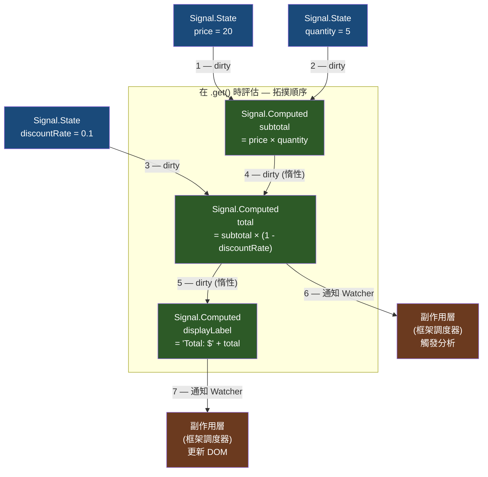

# [FEE-10005] Signals — 語言內建的響應式原語

:::info
每個主流 JavaScript 框架都各自發明了自己的響應式狀態系統 — 而且彼此完全不相容。TC39 Signals 試圖在語言層級解決這個問題。
:::

:::warning Web Platform Proposals
此提案目前位於 TC39 Stage 1。任何瀏覽器都尚未實作。
可透過 npm 的 `signal-polyfill` 套件進行實驗。
在到達 Stage 4 之前，API 可能會變更。請查閱 TC39 提案儲存庫以取得最新狀態。
:::

## 背景

響應式狀態是一種機制，讓 UI 在其所依賴的資料改變時自動更新。每個主流 JavaScript 框架都各自實作了這個機制 — 而每個實作都與其他實作不相容：

| 框架 | 狀態原語 | 衍生值 | 副作用 |
|------|---------|--------|--------|
| Vue 3 | `ref()` | `computed()` | `watchEffect()` |
| React | `useState()` | `useMemo()` | `useEffect()` |
| Angular 17+ | `signal()` | `computed()` | `effect()` |
| SolidJS | `createSignal()` | `createMemo()` | `createEffect()` |
| Preact Signals | `signal()` | `computed()` | `effect()` |
| Svelte 5 | `$state` rune | `$derived` rune | `$effect` rune |

這些實作共享相同的心智模型 — 一個響應式值，當它改變時會自動通知所有依賴它的地方 — 但它們並不相容。Vue 的 `ref` 無法被 SolidJS 的 `createMemo` 讀取。建立在 MobX 上的響應式工具函式庫無法在 Angular 應用程式中運行。共用的響應式業務邏輯必須針對每個框架重新撰寫。

TC39 Signals 的目標是提供一個單一的標準原語，讓所有框架都能在其上建構。這個提案由來自 Angular、Vue、Solid、Preact、Ember 等框架的貢獻者共同撰寫，定義了三個基本構建塊：

- **`Signal.State`** — 可變動的響應式值（真實來源）
- **`Signal.Computed`** — 惰性的衍生值，自動追蹤其依賴關係
- **`Signal.subtle.Watcher`** — 低階鉤子，供框架建構自己的調度器與副作用系統

提案刻意不包含副作用（effect）。副作用是框架特定的：React 批次更新、SolidJS 同步執行、Angular 使用 zone（正在遷移中）。調度不在標準化範圍內。真正標準化的是依賴追蹤圖 — 所有框架在建構自己的調度之前都需要它。

## 情境

一個前端團隊正在建構帶有共用響應式業務邏輯的設計系統。元件函式庫團隊使用 Vue。後端團隊的一個新微前端正在用 SolidJS 開發。兩者都需要訪問相同的 `cartTotal` 計算：套用折扣碼後的商品價格總和。

### 不相容性問題

```js
// cart.vue-store.js — 適用於 Vue，對 SolidJS 不可見
import { ref, computed } from 'vue';

export const items = ref([]);
export const discountRate = ref(0);
export const cartTotal = computed(() =>
  items.value.reduce((sum, item) => sum + item.price, 0) * (1 - discountRate.value)
);
```

```js
// cart.solid-store.js — 針對 SolidJS 的重複實作
import { createSignal, createMemo } from 'solid-js';

export const [items, setItems] = createSignal([]);
export const [discountRate, setDiscountRate] = createSignal(0);
export const cartTotal = createMemo(() =>
  items().reduce((sum, item) => sum + item.price, 0) * (1 - discountRate())
);
```

兩份實作，兩份維護負擔，程式碼發散在所難免。

### 使用 TC39 Signals

```js
// cart.signals.js — 與框架無關，到處都能使用
import { Signal } from 'signal-polyfill';

export const items = new Signal.State([]);
export const discountRate = new Signal.State(0);
export const cartTotal = new Signal.Computed(() =>
  items.get().reduce((sum, item) => sum + item.price, 0) * (1 - discountRate.get())
);
```

```js
// 在 Vue 元件中 — 透過 .get() 讀取，用 computed 包裝以接入 Vue 的響應式系統
import { computed } from 'vue';
import { cartTotal } from './cart.signals.js';

const total = computed(() => cartTotal.get());
```

```js
// 在 SolidJS 元件中 — 透過 .get() 讀取，用 createMemo 包裝以接入 SolidJS 的追蹤系統
import { createMemo } from 'solid-js';
import { cartTotal } from './cart.signals.js';

const total = createMemo(() => cartTotal.get());
```

業務邏輯只寫一次。每個框架在自己的響應式原語中透過 `.get()` 讀取 signal 值，然後由框架自己的調度器接手。共用開發工具、共用測試工具、共用響應式函式庫成為可能。

## 最佳實踐

**Engineers SHOULD 只將 `Signal.State` 用於真實來源的值 — 任何可衍生的值 MUST 使用 `Signal.Computed`。** 如果一個值可以從其他 signal 計算得出，它 MUST 是 `Signal.Computed`，而不是手動保持同步的 `Signal.State`。手動同步是響應式不一致的主要來源。

```js
// 正確 — total 是衍生值，不是儲存值
const price = new Signal.State(100);
const quantity = new Signal.State(3);
const total = new Signal.Computed(() => price.get() * quantity.get());

// 錯誤 — 將可衍生值儲存為 State 會產生同步問題
const price = new Signal.State(100);
const quantity = new Signal.State(3);
const total = new Signal.State(300); // 將會脫離同步
```

**Engineers MUST NOT 在 `Signal.Computed` 內呼叫 `.set()`。** 在計算值中對其所依賴的 signal 呼叫 `.set()` 會導致無窮評估迴圈。執行期會拋出例外，但根本原因始終是將 computed 誤用為有副作用的操作。

```js
// 錯誤 — 將造成無窮迴圈或拋出錯誤
const doubled = new Signal.Computed(() => {
  count.set(count.get() + 1); // 永遠不要這樣做
  return count.get() * 2;
});
```

**Engineers MUST 呼叫 `.get()` 來讀取 signal 的值 — 直接參照 signal 物件本身不會讀取值。** `Signal.State` 或 `Signal.Computed` 實例是 JavaScript 物件。傳遞、儲存或比較它不會觸發響應式追蹤。只有 `.get()` 才能讀取值並註冊依賴關係。

```js
const count = new Signal.State(0);

console.log(count);       // Signal.State 物件 — 不是值
console.log(count.get()); // 0 — 正確
```

**當 `Signal.subtle.Watcher` 不再需要時，MUST 清理它。** Watcher 對它所監看的 signal 持有強引用。未被解除監看或垃圾回收的 Watcher 將阻止其監看的 signal 被回收，且回呼函式將無限期地繼續觸發。在丟棄 Watcher 之前，務必呼叫 `.unwatch(...signals)`。

**不得對非響應式資料使用 signal。** 設定常數、一次性初始化值和永不改變的資料應保持為普通變數。將所有東西都包裝在 `Signal.State` 中，只會在依賴圖中增加額外負擔和噪音，卻沒有任何好處。

**副作用（effect）不在 TC39 提案範圍內。** 不要期望有 `Signal.effect()` API。請使用框架提供的、建構在 `Signal.subtle.Watcher` 之上的副作用 API（`watchEffect`、`createEffect`、`effect`）。如果在框架外工作，請使用 `Watcher` 建構最小化的副作用執行器（參見範例章節）。

## 設計思維

### 第一部分：JavaScript 響應式程式設計的歷史

要理解為什麼 TC39 Signals 會存在，需要追溯響應式程式設計如何進入 JavaScript — 以及為什麼 15 年來框架層級的發明，依然無法產生一個共用的原語。

#### 試算表：最初的響應式系統

響應式程式設計的概念起源是試算表，尤其是 Excel（1985 年）。在試算表中，包含公式的儲存格不儲存結果 — 它儲存的是*配方*。當依賴的儲存格改變時，所有依賴它的儲存格都會自動重新計算。不需要明確的訂閱呼叫，不需要手動「通知觀察者」。試算表引擎維護一個依賴圖，並以拓撲順序評估儲存格，確保每個儲存格始終反映其依賴關係的當前狀態。

這正是 signal 所做的事。試算表模型比 JavaScript 早了十五年，然而直到 2010 年代，JavaScript 生態系才在規模上重新發現它。

#### 硬體電路模擬：「signal」一詞的起源

「signal」這個詞本身來自硬體描述語言（HDL），如 VHDL 和 Verilog，用於模擬數位電路。在電路中，「signal」是傳遞值的電線。邏輯閘讀取輸入 signal 並驅動輸出 signal。當輸入改變時，變化會透過電路圖傳播。這是細粒度響應式評估 — 相當於 `Signal.Computed` 的電路版本。

當響應式程式設計框架在 2010 年代開始重新使用「signal」這個詞時，它們是刻意援引這個淵源：響應式值透過依賴圖傳播變化，就像電訊號透過電路線傳播一樣。

#### Knockout.js（2010 年）：第一個主流響應式 JavaScript 函式庫

Knockout.js 是第一個被廣泛採用的、將響應式 observable 引入瀏覽器 UI 層的 JavaScript 函式庫。它引入了 `ko.observable()`（可變動的響應式值）和 `ko.computed()`（自動追蹤依賴關係的衍生響應式值）。Knockout 的語法以今天的標準來看相當冗長 — 帶有 `data-bind` 屬性的 HTML 模板 — 但概念模型已經完整成形：狀態、衍生狀態和自動依賴追蹤。

Knockout 證明了細粒度響應式在瀏覽器規模上是可行的，但它要求透過函式呼叫進行明確的屬性存取（`name()` 讀取，`name('Alice')` 寫入），這與一般 JavaScript 語法格格不入。

#### Meteor（2012 年）：跨伺服器與客戶端的響應式資料

Meteor 引入了 `Tracker`，一個同時在客戶端和服務端運作的響應式依賴系統。`Tracker.autorun()` 註冊一個函式，每當它存取的任何響應式資料源改變時，該函式就會重新執行。Meteor 的資料源（Minimongo 集合、session 變數）預設都是響應式的。

Meteor 的貢獻在於示範了響應式追蹤可以是隱式的 — 你不需要宣告訂閱。在 `Tracker.autorun()` 上下文中執行就足以讓任何響應式讀取操作註冊依賴關係。這種隱式追蹤模型成為了標準：Vue 的 `watchEffect`、SolidJS 的 `createEffect` 和 `Signal.Computed` 都採用了它。

#### MobX（2015 年）：使用裝飾器的細粒度響應式

MobX 將響應式程式設計帶入了 React 主流生態系，提供細粒度的 observable 狀態作為 Redux 不可變狀態儲存模型的替代方案。MobX 使用 `observable()` 表示狀態、`computed()` 表示衍生值、`autorun()` 表示副作用 — 正是 TC39 Signals 十年後將要正式化的同一個三原語模型。

MobX 對 TC39 提案的影響是直接的：`Signal.Computed` 的惰性求值模型和一致中間狀態的「無 glitch」保證，是 MobX 在 2015 年就已在 userland 解決的設計目標。

#### Vue 2（2016 年）：基於 `Object.defineProperty` 的響應式

Vue 2 引入了響應式物件，其中每個屬性都使用 `Object.defineProperty` 的 getter 和 setter 自動追蹤。在計算函式中存取響應式屬性會註冊依賴關係。設定屬性會觸發所有依賴方的重新計算。

這種方式存在重大限制：Vue 2 無法偵測屬性的新增或刪除，無法追蹤陣列索引的突變，並且某些操作需要特殊的 `Vue.set()` 呼叫。這些限制是 `Object.defineProperty` 的根本性問題 — 你只能攔截*已存在*於物件上的屬性的存取操作。

#### RxJS 和 Observable：不同的範式

RxJS（以及更廣泛的來自 Reactive Extensions 的 Observable 模式）採取了根本不同的方法：基於推送（push-based）的響應式串流。Observable 是一個惰性的資料生產者。訂閱者（Subscriber）註冊回呼函式。值隨時間推移*推送*給訂閱者。

Signal 和 Observable 解決不同的問題。Signal 模型化的是*當前狀態* — 始終存在一個當前值，讀取它會同步返回該值。Observable 模型化的是*事件串流* — 可能沒有當前值，值非同步到達，串流可以完成或出錯。

TC39 Signals 提案明確選擇了*狀態*模型而非*串流*模型。Signal 用於響應式狀態管理，RxJS 用於非同步事件組合。兩者在應用程式中共存：signal 用於元件狀態，RxJS 用於 API 呼叫和 WebSocket 串流。

#### Vue 3（2020 年）：基於 Proxy 的響應式

Vue 3 用 `Proxy` 取代了 `Object.defineProperty`，消除了 Vue 2 的所有限制。`reactive()` 將任何物件包裝在一個攔截所有屬性讀寫的 Proxy 中。`ref()` 將基本值包裝在帶有 `.value` 屬性的物件中。

Vue 3 的 Composition API（`ref`、`computed`、`watchEffect`）是最接近 TC39 提案的先例技術。三原語模型 — 可變狀態、衍生狀態、副作用 — 直接對應到 `Signal.State`、`Signal.Computed` 和基於 `Signal.subtle.Watcher` 的副作用。

#### React 的非 signal 方法：為什麼 React 選擇了不同的模型

React 刻意選擇不使用細粒度響應式。React 的做法是：

1. **單向資料流** — 狀態從父元件向子元件流動，事件向上傳遞
2. **不可變狀態** — `useState` 始終替換整個狀態值；突變對 React 不可見
3. **由上而下的重新渲染** — 當元件狀態改變時，React 重新渲染該元件及其所有後代（除非有 `React.memo`）
4. **Virtual DOM 差分比較** — React 透過比較前後 virtual DOM 樹來計算最小化的 DOM 變更

這個模型以細粒度效率換取可預測性。開發者不需要思考哪些計算值需要失效，或哪些副作用需要重新執行。狀態改變下游的一切都會重新渲染，差分演算法優化實際的 DOM 操作。

`useMemo` 和 `useCallback` 是選擇性加入的逃生艙口 — 你宣告一個衍生值應該被記憶化，但預設是重新計算。這與 signal 的做法相反，在 signal 中衍生是預設值，記憶化是唯一選項。

React 的模型並非「錯誤」— 它反映了整棵子樹重新渲染的人體工學簡單性與細粒度更新的效能上限之間的真實設計取捨。對於 React Server Components 和並發渲染模型，整棵樹方法自然地與 Suspense 和串流 HTML 整合。細粒度響應式需要根本不同的渲染架構。

這就是為什麼 TC39 Signals 不會取代 React 的狀態模型。React 可能會將 signal 採用為可選的優化層，而不是 `useState` 的替代品。

#### SolidJS（2021 年）：沒有 Virtual DOM 的細粒度 signal

SolidJS 將響應式原語模型推向了邏輯的終點：如果你有細粒度的響應式追蹤，根本就不需要 Virtual DOM。SolidJS 將模板編譯為 DOM 節點，並直接將 signal 連接到 DOM 屬性，而不是在狀態改變時重新渲染元件。當 signal 改變時，只有依賴它的特定 DOM 屬性或文字節點會更新 — 無需差分比較，無需元件重新渲染。

SolidJS 的 `createSignal`、`createMemo` 和 `createEffect` 是 `Signal.State`、`Signal.Computed` 以及基於 `Signal.subtle.Watcher` 建構的副作用執行器的直接先驅。SolidJS 的作者 Ryan Carniato 是 TC39 Signals 提案討論中最重要的聲音之一。

#### Angular 17（2023 年）：用 signal 取代 Zone.js

Angular 在版本 17 中採用 signal，是這個提案歷史上最重大的框架遷移。Angular 自誕生以來就使用 Zone.js — 一個對瀏覽器 API 進行猴子補丁（monkey-patch）以在任何非同步操作後觸發變更偵測的函式庫。Zone.js 有效但不透明：它讓每個 `setTimeout`、`Promise` 和 `fetch` 呼叫都觸發完整的變更偵測傳遞，卻無法知道什麼真正改變了。

Angular 17 引入了 `signal()`、`computed()` 和 `effect()` 作為一等響應式原語。Angular 團隊打算用基於 signal 的變更偵測系統完全取代 Zone.js。這個從粗粒度輪詢模型到細粒度依賴追蹤模型的轉變，代表著 Angular 渲染引擎的完整架構重寫。

Angular 團隊參與 TC39 提案並非巧合。他們需要一個不與 Angular 框架內部綁定的響應式原語，讓更廣泛的生態系能夠共用工具和模式。

#### TC39 Signals 委員會（2024 年）：罕見的跨框架共識

在 2024 年以 Stage 1 提出的 TC39 Signals 提案，因其作者陣容的廣度而值得關注。委員會包括來自 Angular（Google）、Vue（Evan You）、SolidJS（Ryan Carniato）、Preact（Jason Miller）、Ember、Svelte 等框架的貢獻者。在 TC39 提案上達到這種程度的跨框架共識，在歷史上是極為罕見的。

共同的動機：每個框架都獨立地得出了相同的三原語模型（狀態、計算值、副作用），所有人都會從一個可以在其上建構的標準響應式圖中受益 — 跨越框架邊界共用開發工具、測試工具和響應式工具函式庫。

---

### 第二部分：「glitch」問題

在響應式程式設計中，「glitch」是指在所有更新完成之前，觀察者就看到不一致的中間狀態。

考慮一個有兩個 signal 和一個計算值的系統：

```
price = Signal.State(10)
quantity = Signal.State(3)
total = Signal.Computed(() => price.get() * quantity.get())
```

假設 `price` 和 `quantity` 在同一個更新週期中都改變了：`price` 改為 20，`quantity` 改為 5。

一個簡單的基於推送的系統可能按以下順序處理更新：
1. `price` 改為 20 → 通知 `total` → `total` 重新計算為 `20 * 3 = 60`（錯誤 — quantity 仍然是 3）
2. `quantity` 改為 5 → 通知 `total` → `total` 重新計算為 `20 * 5 = 100`（正確）

監看 `total` 的觀察者會看到它短暫地等於 60 — 一個從未有意有效的不一致狀態。這就是 glitch。

**Signal 如何解決它：惰性求值與拓撲排序**

`Signal.Computed` 是*惰性*的。當其輸入改變時，它不會急切地將新值推送給依賴方。而是將自己標記為「髒」（dirty）— 陳舊，需要重新計算 — 然後等待被讀取。

當框架的副作用系統透過 `.get()` 讀取一個計算值時，signal 執行期對依賴圖執行拓撲排序：識別所有髒的 signal 並按依賴順序重新計算它們，從來源到終點。到任何計算值被讀取時，其所有傳遞依賴關係都已解析為當前更新週期的最終值。

結果：沒有 glitch。觀察者永遠不會看到不一致的中間狀態，因為計算值直到所有輸入都已確定之後才會被評估。

**為什麼 React 的模型不同**

React 透過不同的機制避免 glitch：整棵子樹批次處理。當狀態改變時，React 排程一次重新渲染傳遞。在那次傳遞中，所有 `useMemo` 值都按元件樹順序（父元件優先於子元件）重新計算。由於整棵樹作為批次重新渲染，不存在子元件同時看到舊父狀態和新孫狀態的窗口。

React 的無 glitch 方法是架構性的 — 它源自由上而下的重新渲染模型。Signal 的方法是演算法性的 — 它源自惰性求值和拓撲排序。兩者都有效；它們以不同的粒度運作。

---

### 第三部分：為什麼框架可以共用一個原語

如果每個框架都有自己的調度器（React 批次處理、SolidJS 同步執行、Angular 使用微任務佇列），它們如何共用相同的 signal 原語？

答案是**調度刻意不在 TC39 提案範圍內**。提案只規定響應式圖：如何建立狀態、計算值如何追蹤其依賴關係，以及變化如何在圖中傳播。提案對框架*何時*應處理待處理的更新隻字未提。

`Signal.subtle.Watcher` 是整合點。Watcher 在上次通知被清除後，任何被監看的 signal 第一次變髒時，就會（透過其回呼函式）被通知。框架使用這個回呼來排程自己的更新批次：

- React 可以在自己的調度器中排隊一次重新渲染
- SolidJS 可以同步執行副作用
- Angular 可以為變更偵測排隊一個微任務

共用的原語是依賴圖。框架各自的層次是決定何時清空（drain）該圖的調度器。

**共用帶來什麼：**

- **共用開發工具**：視覺化 signal 依賴圖的瀏覽器擴充功能可以同時跨 Vue、Angular 和 Solid 工作
- **共用測試工具**：`@testing-library/signals` 這樣的函式庫可以撰寫針對任何框架的 signal 整合執行的響應式測試
- **共用響應式函式庫**：公開 `Signal.State` 輸入的日期範圍選擇器元件可以被 Vue、SolidJS 和 Angular 應用程式無需適配地消費
- **共用響應式工具函式**：`throttle(signal, 100ms)` 或 `debounce(signal, 300ms)` 這樣的算子可以寫一次，到處使用

## 圖解

響應式依賴圖展示了 `Signal.State` 節點如何驅動 `Signal.Computed` 節點，進而驅動副作用層。帶編號的箭頭顯示當狀態改變時的拓撲評估順序。



**圖解說明：** 狀態節點（藍色）是真實來源。當狀態改變時，依賴它的計算節點（綠色）被標記為髒，但不會立即重新計算 — 它們是惰性的。Watcher（棕色，副作用層）被通知有待處理的工作。當框架的調度器對計算節點呼叫 `.get()` 時，執行期以拓撲順序（箭頭 1–7）評估所有髒的祖先，然後返回最終值。觀察者永遠不會看到不一致的中間狀態。

## 範例

### 1. 基本計數器：State 與 Computed

```js
import { Signal } from 'signal-polyfill';

// Signal.State — 可變動的真實來源
const count = new Signal.State(0);

// Signal.Computed — 衍生、惰性、無 glitch
const doubled = new Signal.Computed(() => count.get() * 2);
const label = new Signal.Computed(() => `Count is ${count.get()}, doubled is ${doubled.get()}`);

// 讀取值 — MUST 使用 .get()
console.log(count.get());   // 0
console.log(doubled.get()); // 0
console.log(label.get());   // "Count is 0, doubled is 0"

// 寫入值 — 只有 Signal.State 有 .set()
count.set(5);

console.log(count.get());   // 5
console.log(doubled.get()); // 10
console.log(label.get());   // "Count is 5, doubled is 10"
```

### 2. 使用 Signal.subtle.Watcher 建構簡單副作用

副作用不在 TC39 提案範圍內。以下是使用 `Signal.subtle.Watcher` 建構副作用的最小化模式：

```js
import { Signal } from 'signal-polyfill';

/**
 * 建構在 Signal.subtle.Watcher 上的最小化副作用執行器。
 * 這是框架內部實作的簡化版本。
 * 在正式環境中，請使用框架提供的副作用 API。
 */
function effect(fn) {
  let scheduled = false;

  const watcher = new Signal.subtle.Watcher(() => {
    // 這個回呼在任何被監看的 signal 第一次變髒時觸發（一次）。
    // 排程一個微任務，在下一個微任務檢查點執行副作用。
    if (!scheduled) {
      scheduled = true;
      queueMicrotask(() => {
        scheduled = false;
        // 重新執行副作用，也透過 .get() 呼叫重新註冊依賴關係
        watcher.watch(); // 為下一個週期重新啟用 watcher
        computed.get();  // 觸發重新計算
      });
    }
  });

  // 注意：在這個最小化實作中，'fn' 同時被用作依賴追蹤器和副作用函式。
  // 這僅為說明目的而做的簡化。正式環境的副作用執行器（Vue 的 watchEffect、
  // Angular 的 effect()）會將依賴追蹤與副作用分開處理。
  // 在正式環境程式碼中 MUST NOT 將 Signal.Computed 當作副作用執行器使用。
  const computed = new Signal.Computed(fn);

  // 監看計算值 — 當 fn 的依賴改變時，watcher 將觸發
  watcher.watch(computed);

  // 立即執行一次以註冊初始依賴關係
  computed.get();

  // 返回清理函式
  return () => {
    watcher.unwatch(computed);
  };
}

// 使用方式
const name = new Signal.State('Alice');
const greeting = new Signal.State('Hello');

const cleanup = effect(() => {
  // 此處任何 .get() 呼叫都會註冊依賴關係
  console.log(`${greeting.get()}, ${name.get()}!`);
});
// 輸出: "Hello, Alice!"

name.set('Bob');
// 輸出（下一個微任務）: "Hello, Bob!"

greeting.set('Hi');
// 輸出（下一個微任務）: "Hi, Bob!"

// 當元件卸載時 — 防止記憶體洩漏
cleanup();
```

### 3. 購物車 — 跨框架共用響應式邏輯

```js
// cart.signals.js — 共用響應式業務邏輯
import { Signal } from 'signal-polyfill';

export const items = new Signal.State([]);
export const discountCode = new Signal.State(null);

// 按代碼劃分的折扣率 — 普通資料，非響應式（正確做法）
const DISCOUNT_RATES = { 'SAVE10': 0.10, 'SAVE20': 0.20 };

export const discountRate = new Signal.Computed(() => {
  const code = discountCode.get();
  return code ? (DISCOUNT_RATES[code] ?? 0) : 0;
});

export const subtotal = new Signal.Computed(() =>
  items.get().reduce((sum, item) => sum + item.price * item.qty, 0)
);

export const total = new Signal.Computed(() =>
  subtotal.get() * (1 - discountRate.get())
);

export const itemCount = new Signal.Computed(() =>
  items.get().reduce((sum, item) => sum + item.qty, 0)
);

// 輔助函式 — 始終使用 .set() 搭配新陣列（不要就地突變）
export function addItem(item) {
  items.set([...items.get(), item]);
}

export function applyDiscount(code) {
  discountCode.set(code);
}
```

```js
// 在 Vue 中使用 — 包裝在 computed() 中以接入 Vue 的響應式系統
import { computed } from 'vue';
import { total, itemCount, addItem } from './cart.signals.js';

export default {
  setup() {
    return {
      total: computed(() => total.get()),
      itemCount: computed(() => itemCount.get()),
      addItem,
    };
  }
};
```

```js
// 在 SolidJS 中使用 — 包裝在 createMemo() 中以接入 SolidJS 的追蹤系統
import { createMemo } from 'solid-js';
import { total, itemCount, addItem } from './cart.signals.js';

function CartSummary() {
  const totalValue = createMemo(() => total.get());
  const count = createMemo(() => itemCount.get());
  return <div>{count()} items — ${totalValue().toFixed(2)}</div>;
}
```

### 4. 框架比較表

| 概念 | TC39 Signal | Vue 3 | Angular 17+ | SolidJS |
|------|------------|-------|-------------|---------|
| 可變狀態 | `new Signal.State(v)` | `ref(v)` | `signal(v)` | `createSignal(v)` |
| 讀取值 | `s.get()` | `s.value` | `s()` | `s()` |
| 寫入值 | `s.set(v)` | `s.value = v` | `s.set(v)` | `setS(v)` |
| 衍生值 | `new Signal.Computed(fn)` | `computed(fn)` | `computed(fn)` | `createMemo(fn)` |
| 副作用 | 不在提案範圍 | `watchEffect(fn)` | `effect(fn)` | `createEffect(fn)` |
| 惰性求值 | 是 | 是 | 是 | 是 |
| 無 glitch | 是 | 是 | 是 | 是 |
| 副作用調度 | 框架層 | Vue 調度器 | Angular 調度器 | 同步 |

## 深入探討

### 無 glitch 執行：惰性求值與拓撲排序

無 glitch 保證由 `Signal.Computed` 的兩個特性達成：

**1. 惰性**：`Signal.Computed` 永遠不會主動將其值推送給依賴方。當輸入 signal 改變時，計算值將自己標記為髒並將髒標記傳播到所有下游計算值。此時不會發生重新計算。

**2. 拓撲評估**：當 `.get()` 被呼叫在一個髒的 `Signal.Computed` 上時，執行期遍歷依賴圖並按依賴順序重新計算所有髒的祖先，然後再返回值。沒有髒輸入的祖先直接從快取返回，無需重新計算。評估過程永遠不會觀察到「半更新」的祖先。

這兩個特性合在一起，保證任何對 `.get()` 的呼叫都返回與所有傳遞來源 signal 的當前狀態一致的值 — 正是試算表模型所保證的。

### `Signal.subtle.Watcher` API 參考

`Signal.subtle.Watcher` 是建構調度器和副作用系統的整合點。

```js
// 建構函式：fn 在任何被監看的 signal 在上次通知後第一次變髒時（同步）呼叫
const watcher = new Signal.subtle.Watcher((signal) => {
  // signal 是觸發通知的第一個髒 signal
  // 這個回呼在導致髒狀態的 .set() 呼叫期間同步執行
  // 不要在這裡呼叫 .get() — 改為排程稍後的工作
  scheduleFlush();
});

// .watch(...signals) — 將 signal 加入監看集合
// 呼叫 .watch() 也會「清除」watcher，為下次髒狀態重新啟用回呼
watcher.watch(computedA, computedB);

// .unwatch(...signals) — 從監看集合中移除 signal
// 在丟棄 watcher 之前務必呼叫此方法，以防止記憶體洩漏
watcher.unwatch(computedA, computedB);

// .getPending() — 返回當前髒的被監看 signal 列表
// 在調度器清空（flush）內部使用，以知道哪些計算值需要重新計算
const pending = watcher.getPending(); // Signal[]
for (const signal of pending) {
  signal.get(); // 重新計算並通知下游
}
```

**關鍵行為細節：**
- Watcher 回呼每個「週期」最多觸發一次 — 當第一個 signal 變髒時觸發，而非每次後續的髒狀態
- 回呼在 `.set()` 呼叫期間同步觸發，在 `.set()` 返回之前
- 在回呼內呼叫 `.get()` 是不安全的（可能觀察到部分狀態）— 始終改為排程非同步工作
- 回呼觸發後，Watcher 處於「待機」狀態 — 在呼叫 `.watch()` 重新清除之前不會再次觸發

### `Signal.subtle.untrack(fn)`

`untrack` 在不註冊任何響應式依賴關係的情況下執行函式。使用此方法可在計算上下文內讀取 signal 值，而不使計算值依賴該 signal。

```js
const a = new Signal.State(1);
const b = new Signal.State(100);

const c = new Signal.Computed(() => {
  // c 依賴 `a` — 改變 `a` 會使 `c` 變髒
  const aVal = a.get();

  // c 不依賴 `b` — 改變 `b` 不會使 `c` 變髒
  const bVal = Signal.subtle.untrack(() => b.get());

  return aVal + bVal;
});

console.log(c.get()); // 101

b.set(200);
console.log(c.get()); // 仍然是 101 — b 的改變沒有使 c 變髒

a.set(2);
console.log(c.get()); // 202 — a 的改變使 c 變髒，用當前的 b（200）重新計算
```

典型使用場景：讀取設定值、在不建立依賴關係的情況下存取 signal 的當前值（例如，在過渡或動畫中，你想要起始值但不想將結束值作為響應式輸入）。

### `Signal.subtle.currentComputed()`

返回當前正在評估的 `Signal.Computed`，如果在計算上下文外呼叫則返回 `null`。

```js
const inner = new Signal.Computed(() => {
  const self = Signal.subtle.currentComputed();
  console.log(self === inner); // true — 返回當前正在執行的計算值
  return 42;
});

console.log(Signal.subtle.currentComputed()); // null — 不在計算上下文中
inner.get(); // 輸出: true
```

主要使用場景：建構需要偵測自己是否在響應式上下文中被呼叫的響應式工具函式庫，以及為開發工具檢查當前運行計算值的診斷工具。

### `Signal.State` 選項：`equals`

`Signal.State` 接受帶有 `equals` 函式的選項物件。預設情況下，`Signal.State` 使用 `Object.is` 來判斷新值是否與當前值不同。如果值相等，依賴的計算值不會被標記為髒。

```js
// 預設：Object.is 比較
const count = new Signal.State(0);
count.set(0); // 無操作 — Object.is(0, 0) 為 true，沒有依賴方被標記為髒

// 自訂 equals：陣列的深度比較
const tags = new Signal.State([], {
  equals: (a, b) => a.length === b.length && a.every((v, i) => v === b[i])
});

tags.set(['typescript', 'react']); // 設定值
tags.set(['typescript', 'react']); // 無操作 — 陣列淺層相等
```

這個選項對於防止在 signal 被設定為語義上等價但引用上不同的值時（從狀態轉換產生新陣列/物件時的常見模式）進行不必要的重新計算非常重要。

### Polyfill 整合配方：以 microtask 去抖的 flush

`signal-polyfill` 的 README 提供標準的 `effect()` 配方供框架接入。它示範如何將 `Signal.subtle.Watcher` 串接到真實的調度器並加上去抖，使得 Watcher 在同一個 tick 中無論發生多少寫入，每個 microtask 僅觸發一次。

```js
let needsEnqueue = true;

const w = new Signal.subtle.Watcher(() => {
  if (needsEnqueue) {
    needsEnqueue = false;
    queueMicrotask(processPending);
  }
});

function processPending() {
  needsEnqueue = true;

  for (const s of w.getPending()) {
    s.get();
  }

  w.watch();
}
```

整合形式由提案固定：

1. 為每個排程邊界（一個 renderer、一個 effect 群組、一個 hydration root）建立一個 `Signal.subtle.Watcher`。
2. 將該邊界關注的 signals 加入 Watcher 的集合；當其中任一 signal 首次轉為 dirty 時，notify callback 觸發。
3. 在 notify 內以 `needsEnqueue` 旗標搭配 `queueMicrotask` 進行去抖，使 Watcher 在同一個 tick 中無論發生多少寫入，每個 microtask 僅觸發一次。
4. 在 microtask 中走訪 `w.getPending()`，對每個項目呼叫 `.get()` 以重算，再呼叫 `w.watch()` 為下一次 dirty 轉換重新武裝 Watcher。
5. 將新值交給框架自身的渲染或 effect 機制。提案的職責止於依賴圖；渲染屬於框架。

Lit 端到端示範了此模式：`SignalWatcher` 是一個 mixin，內部負責步驟 1 至 4，步驟 5 即為「在 host element 上觸發更新」。

## 內部參考

- [FEE-300 JavaScript Core & Runtime Overview](../../JavaScript%20Core%20and%20Runtime/300.md) — 本文所需的 JavaScript 基礎知識
- [FEE-502 Reactive State & Signals in Component Architecture](../../Component%20Architecture%20and%20Design%20Patterns/502.md) — signal 應用於元件層；框架特定的使用模式
- [FEE-600 State Management](../../State%20Management/600.md) — signal 作為狀態管理系統的基礎原語
- [FEE-10003 Pattern Matching](10003.md) — Signals 與 Pattern Matching 都是目前在 TC39 進行標準化的語言層級原語

## 參考資料

- [TC39 proposal-signals](https://github.com/tc39/proposal-signals) — 官方提案儲存庫；包含完整規格、設計理念、FAQ 和委員會討論歷史
- [signal-polyfill on npm](https://www.npmjs.com/package/signal-polyfill) — TC39 Signals 的參考 polyfill；僅供實驗使用，API 將會變更
- [Angular Signals 指南](https://angular.dev/guide/signals) — Angular 的正式 signal 實作；目前最完整的 TC39 模型真實世界採用案例
- [SolidJS Signals 文件](https://docs.solidjs.com/concepts/signals) — SolidJS 的 `createSignal`、`createMemo`、`createEffect`；TC39 Signals 的直接先驅技術
- [Preact Signals](https://preactjs.com/guide/v10/signals/) — Preact 的 signal 實作；以其最小化套件大小和跨框架適配器方法著稱
- [Ryan Carniato — A Hands-on Introduction to Fine-Grained Reactivity](https://dev.to/ryansolid/a-hands-on-introduction-to-fine-grained-reactivity-3ndf) — SolidJS 作者對細粒度響應式系統的深入解說；理解 TC39 提案設計目標的必讀文章
- [Vue 3 Reactivity in Depth](https://vuejs.org/guide/extras/reactivity-in-depth) — Vue 團隊對其響應式系統的解說；以 Vue 特定的實作細節涵蓋相同概念
- [TC39 Proposals tracking page](https://github.com/tc39/proposals) — 所有活躍 TC39 提案的當前 stage 狀態
