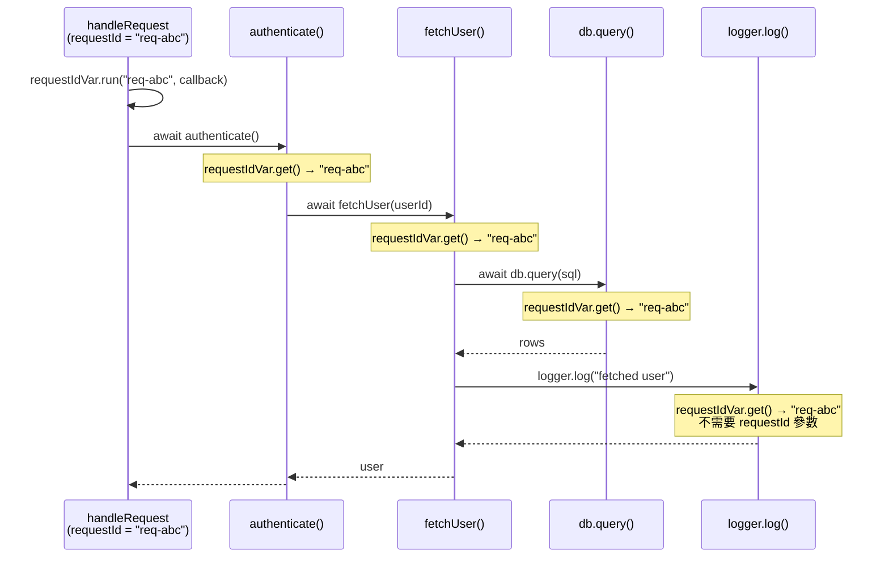

# [FEE-10006] Async Context — 跨非同步邊界傳播上下文

:::info
在請求處理函式頂端設定的請求識別碼，在深層巢狀的 `await` 呼叫日誌工具時已悄悄消失。Async Context 在語言層級解決了這個問題。
:::

:::warning Web Platform Proposals
截至 2026-07，此提案位於 TC39 Stage 2，已指派 Stage 2.7 審查人（James M Snell、Mark S. Miller）。目前尚無任何瀏覽器實作。剩餘的工作是定義此提案如何與網頁平台 API（事件、計時器，以及其他 HTML 規格中的非同步原語）整合；TC39 代表認為核心 ECMAScript 語意大致已經底定。
先行技術：Node.js `AsyncLocalStorage`，自 Node.js 13.10.0／12.17.0（2020 年）起可用。
請查閱 [TC39 提案儲存庫](https://github.com/tc39/proposal-async-context) 以取得最新狀態。
:::

## 背景

非同步 JavaScript 建立在事件迴圈之上：一個請求到達，處理函式觸發，一連串的 `await` 表達式在微任務檢查點之間暫停和恢復執行。每次暫停都會丟棄呼叫堆疊。執行恢復時，無論是在 `Promise.then()` 回呼、`setTimeout` 處理函式，還是巢狀的 `await` 中，執行環境都不會保留任何「是誰呼叫我」的環境資訊。

這為**橫切關注點（cross-cutting concerns）**製造了根本性的問題：某些資訊需要在整個非同步操作過程中保持可用，而不需要明確地作為函式參數傳遞。

### 三種變通方案（以及各自的失敗原因）

**1. 將上下文作為函式參數傳遞（上下文穿透）**

最明確的方式：每個可能需要請求識別碼的函式都接受它作為參數。

```js
async function handleRequest(req, res) {
  const requestId = req.headers['x-request-id'];
  const user = await authenticate(requestId);        // 向下傳遞
  const profile = await fetchProfile(user.id, requestId); // 繼續傳遞
  await updateCache(profile, requestId);             // 再傳遞
  logger.log('done', { requestId });                 // 終於在這裡使用
}
```

這雖然可行，但具有**病毒性**：每個中間函式都必須接受並轉發 `requestId`，即使它本身並不使用這個值。如果要新增一個橫切關注點（例如租戶 ID、語系設定），每個呼叫鏈中的每個函式簽名都要跟著增長。

**2. 模組層級全域變數**

將當前請求識別碼存儲在模組層級的變數中。

```js
// logger.js
let currentRequestId = null;

export function setRequestId(id) { currentRequestId = id; }
export function log(msg) { console.log(`[${currentRequestId}] ${msg}`); }
```

在單執行緒、單一請求的情境下這能運作。但**一旦有並行請求就立刻崩壞**：如果兩個請求同時執行（兩者都在等待某些操作），它們共享同一個 `currentRequestId` 變數。請求 B 的 `setRequestId()` 呼叫會在請求 A 執行途中覆蓋掉 A 的值。

**3. Node.js `AsyncLocalStorage`**

Node.js 在 13.10.0 版推出 `AsyncLocalStorage`，並回溯移植到 12.17.0 LTS 版本線（皆為 2020 年），作為生產環境可用的解決方案。它儲存一個值，該值會自動傳播到當前上下文衍生的所有非同步操作中：`await`、`Promise.then()`、`setTimeout`、`setImmediate` 等等。

```js
import { AsyncLocalStorage } from 'node:async_hooks';

const store = new AsyncLocalStorage();

async function handleRequest(req, res) {
  store.run({ requestId: req.headers['x-request-id'] }, async () => {
    await authenticate();
    await fetchProfile();
    logger.log('done'); // 可呼叫 store.getStore() 讀取 requestId
  });
}
```

`AsyncLocalStorage` 能自動涵蓋 `await`、Promise 與計時器鏈，但像 `EventEmitter` 這類以回呼為基礎的 API，仍需要明確使用 `AsyncResource` 綁定。它同時也**僅限 Node.js**：在瀏覽器、Web Workers 或其他 JavaScript 執行環境中沒有等效的 API。Deno 需要自己的填充實作。邊緣執行環境（Cloudflare Workers、Vercel Edge）則各自實作了自己的等效方案。

### 網頁可觀測性的缺口

OpenTelemetry 等分散式追蹤系統會為每個傳入請求分配一個**追蹤識別碼（trace ID）**，並為該請求中的每個工作單元分配一個**跨度識別碼（span ID）**。每一行日誌、每個對外的 fetch 呼叫、每次資料庫查詢都應該攜帶當前的追蹤和跨度識別碼，讓追蹤後端（Jaeger、Zipkin、Honeycomb）能夠重建完整的呼叫樹。

在 Node.js 中，OpenTelemetry 的 SDK 使用 `AsyncLocalStorage` 自動將活躍跨度傳播到所有非同步操作中。應用程式碼從不接觸追蹤識別碼：它只是執行 `await fetch(url)`，OpenTelemetry 的 instrumentation 會從非同步本地儲存中取得活躍跨度，並將 `traceparent` 標頭注入請求。

瀏覽器中沒有 `AsyncLocalStorage`，因此 OpenTelemetry 的網頁 SDK 改為提供兩種選擇。預設的 `StackContextManager` 以堆疊同步追蹤上下文，一旦經過任何 `await` 就會遺失。另一種選擇 `ZoneContextManager` 依賴 Zone.js（與下方設計思維一節所談的同一套猴子補丁函式庫），以還原 Promise 鏈以及經轉譯（以 ES2016 為目標）的 `await` 的傳播；它無法追蹤原生的 ES2017 以上 `async`/`await`，上下文會在第二個 `await` 之後遺失（見深入探討），也帶來 Zone.js 本身的套件大小與相容性成本。Async Context 能讓瀏覽器 SDK 在不必承擔上述任何一項代價的情況下，達到完整的原生 `await` 傳播。

**TC39 Async Context** 正是要將等同於 `AsyncLocalStorage` 的語意帶到所有 JavaScript 環境，包括瀏覽器、Node.js、Deno 與 Cloudflare Workers，作為語言的一等特性。

## 視覺對比

下方圖表展示了單一 HTTP 請求的非同步呼叫樹。`requestId` 值 `"req-abc"` 在請求處理函式中建立，並流經樹中的每個非同步操作：穿越 `await` 邊界，進入工具函式，全程無需作為參數傳遞。



呼叫樹中的每個節點都從根 `.run()` 呼叫繼承了 `requestId`。上下文值不是參數。它是由非同步執行上下文攜帶的環境資料。如果第二個請求以 `requestId = "req-xyz"` 同時執行，其整個非同步樹會獨立地攜帶 `"req-xyz"`。

## 範例

一個 SSR 網頁伺服器處理兩個並行請求。每個請求都需要一個唯一的 `requestId`，以便在集中式日誌系統中關聯其所有日誌行。以下的逐步走查會說明沒有 Async Context 時會出什麼問題、修正這兩種失敗模式後的提案 API 長什麼樣子，以及它如何對應到多數工程師已經熟悉的 Node.js API。

### 沒有 Async Context：兩種失敗模式

**失敗模式 1：模組層級全域變數（資料競爭）**

```js
// logger.js — 對並行請求而言是破損的
let requestId = null;

export function setRequestId(id) { requestId = id; }
export function log(msg) { console.log(`[${requestId ?? 'no-id'}] ${msg}`); }
```

```js
// server.js
import { setRequestId, log } from './logger.js';

async function handleRequest(req) {
  setRequestId(req.headers['x-request-id']);
  log('request received');           // [req-A] request received
  await authenticate(req);           // 暫停 — req-B 在這裡執行
  // req-B 在我們等待期間呼叫了 setRequestId('req-B')
  log('auth complete');              // [req-B] auth complete  ← 錯誤
}

// 兩個並行請求
handleRequest({ headers: { 'x-request-id': 'req-A' } });
handleRequest({ headers: { 'x-request-id': 'req-B' } });
```

`await authenticate()` 的暫停讓事件迴圈有機會處理 `req-B`，後者覆寫了 `requestId`。`req-A` 恢復時，卻使用了 `req-B` 的識別碼記錄日誌。這是一個靜默的資料損毀錯誤：不會拋出任何例外。

**失敗模式 2：上下文穿透（病毒式參數）**

```js
// 每個函式都必須接受 requestId — 即使它本身不直接使用
async function handleRequest(req) {
  const requestId = req.headers['x-request-id'];
  await authenticate(req, requestId);
}

async function authenticate(req, requestId) {
  const user = await fetchUser(req.userId, requestId); // 必須轉發
  return user;
}

async function fetchUser(userId, requestId) {
  const row = await db.query('SELECT * FROM users WHERE id = ?', userId, requestId); // 再次轉發
  log('fetched user', requestId); // 終於在這裡使用
  return row;
}

async function log(msg, requestId) {
  console.log(`[${requestId}] ${msg}`); // 實際使用點
}
```

`requestId` 出現在四個函式簽名中，只為了到達日誌呼叫。再加入第二個橫切關注點（`tenantId`、`locale`、`traceSpan`），每個簽名就又會增長。

### 使用 Async Context：乾淨的傳播

此提案公開了兩個類別：`AsyncContext.Variable` 用來保存一個作用域限定於非同步操作樹的值，`AsyncContext.Snapshot` 則會在下方的範例 2 中介紹。`Variable` 有兩個操作：`.run(value, fn)` 為以 `fn` 為根的非同步樹建立值，`.get()` 則從該樹內的任何地方讀取當前值。`Snapshot` 有一個實例方法 `.run(fn)`，會在回呼周圍還原一組已捕獲的綁定；還有一個靜態方法 `AsyncContext.Snapshot.wrap(fn)`，會回傳一個包裝 `fn` 的新函式，使其永遠在呼叫 `wrap` 當下所生效的綁定中執行。

```js
// context.js — 只定義一次變數
import { AsyncContext } from 'simple-async-context'; // 提案 API，目前尚無原生實作

export const requestIdVar = new AsyncContext.Variable({
  name: 'requestId',
  defaultValue: 'no-request-id',
});
```

```js
// server.js — 只在進入點設定一次值
import { requestIdVar } from './context.js';

async function handleRequest(req) {
  requestIdVar.run(req.headers['x-request-id'], async () => {
    await authenticate(req); // 不需要 requestId 參數
    await fetchProfile(req);
    log('request complete'); // 不需要 requestId 參數
  });
}
```

```js
// logger.js — 在非同步鏈的任何地方讀取值
import { requestIdVar } from './context.js';

function log(msg) {
  const requestId = requestIdVar.get(); // 永遠正確，即使在 await 之後
  console.log(`[${requestId}] ${msg}`);
}
```

```js
// db.js — 同樣能正確讀取，零參數變更
import { requestIdVar } from './context.js';

async function query(sql) {
  const requestId = requestIdVar.get();
  console.log(`[${requestId}] db.query: ${sql}`);
  // ...
}
```

兩個並行請求各自擁有自己的 `requestId` 值，從 `.run()` 呼叫衍生的每個非同步操作都繼承該值。無需更改任何參數。沒有全域狀態競爭。

### 1. 基本的 `AsyncContext.Variable` 用法

```js
// 使用 TC39 提案 API（填充函式庫或未來的原生支援）
// npm install simple-async-context  (社群填充函式庫，僅供實驗)

const requestIdVar = new AsyncContext.Variable({
  name: 'requestId',
  defaultValue: 'unknown',
});

async function handleRequest(requestId) {
  // run() 為此非同步操作樹建立值
  await requestIdVar.run(requestId, async () => {
    await stepOne();
    await stepTwo();
  });
}

async function stepOne() {
  // 不需要 requestId 參數 — 從非同步上下文讀取
  const id = requestIdVar.get();
  console.log(`[stepOne] requestId = ${id}`);
  await stepOneHelper();
}

async function stepOneHelper() {
  // 同樣繼承 — 上下文流經每個巢狀的 await
  const id = requestIdVar.get();
  console.log(`[stepOneHelper] requestId = ${id}`);
}

async function stepTwo() {
  const id = requestIdVar.get();
  console.log(`[stepTwo] requestId = ${id}`);
}

// 兩個並行請求 — 各自有自己的上下文
handleRequest('req-abc');
handleRequest('req-xyz');

// 輸出（順序可能因非同步排程而有所不同）：
// [stepOne] requestId = req-abc
// [stepOne] requestId = req-xyz
// [stepOneHelper] requestId = req-abc
// [stepOneHelper] requestId = req-xyz
// [stepTwo] requestId = req-abc
// [stepTwo] requestId = req-xyz
```

每個請求的非同步樹攜帶自己的 `requestId`。這兩個值永不交叉。

### 2. `AsyncContext.Snapshot`：在回呼中保留上下文

`AsyncContext.Snapshot` 會在建立的當下捕獲目前的變數綁定。當第三方 API 會儲存回呼、並在稍後從一個與註冊當下無關的上下文中呼叫它時，就該使用它：例如依自身排程清空佇列的批次佇列、在其他事件發生後重播回呼的外掛系統，或是真正由使用者觸發的事件監聽器（指點擊事件本身，而非呼叫 `addEventListener` 的那段程式碼）。一般的 `setTimeout`、`queueMicrotask` 與 Promise 回呼則不需要 `Snapshot`：根據此提案的網頁整合設計（見下方深入探討），它們本來就會繼承各自呼叫點當下生效的上下文。

```js
const traceVar = new AsyncContext.Variable({ name: 'traceId' });

// 一個第三方工作佇列，會批次收集回呼並在稍後、依自身內部迴圈
// （與是誰推入這項工作無關）清空並執行它們。
class JobQueue {
  #jobs = [];
  push(fn) {
    this.#jobs.push(fn);
  }
  flush() {
    const jobs = this.#jobs.splice(0);
    for (const job of jobs) job();
  }
}

const queue = new JobQueue();

async function processJob(traceId) {
  await traceVar.run(traceId, async () => {
    console.log('start:', traceVar.get()); // traceId

    // AsyncContext.Snapshot.wrap() 會立即捕獲上下文，
    // 再將回呼交給佇列
    queue.push(
      AsyncContext.Snapshot.wrap(() => {
        // 若不使用 Snapshot.wrap()，traceVar.get() 在這裡會回傳 'unknown'，
        // 因為 flush() 是稍後從無關的程式碼中執行的。
        console.log('queued job:', traceVar.get()); // traceId — 正確
      })
    );
  });
}

processJob('trace-789');

// 應用程式中無關的另一部分，在任何 traceVar.run() 之外執行：
queue.flush();
```

如果沒有 `Snapshot`，`queue.flush()` 會在擁有此佇列的無關程式碼決定清空佇列時，於當下任何生效的上下文中執行該項工作，而不一定是 `trace-789` 的上下文。

### 3. 多個變數：分層上下文

多個 `AsyncContext.Variable` 實例是獨立的。每個都在非同步樹中追蹤自己的值。

```js
const traceIdVar = new AsyncContext.Variable({ name: 'traceId', defaultValue: null });
const userIdVar = new AsyncContext.Variable({ name: 'userId', defaultValue: null });
const localeVar = new AsyncContext.Variable({ name: 'locale', defaultValue: 'en-US' });

function withRequestContext(traceId, userId, locale, fn) {
  return traceIdVar.run(traceId, () =>
    userIdVar.run(userId, () =>
      localeVar.run(locale, fn)
    )
  );
}

async function renderPage() {
  const traceId = traceIdVar.get();   // 'trace-001'
  const userId  = userIdVar.get();    // 'user-42'
  const locale  = localeVar.get();    // 'zh-TW'
  console.log({ traceId, userId, locale });
}

withRequestContext('trace-001', 'user-42', 'zh-TW', async () => {
  await renderPage(); // 正確讀取所有三個值
});
```

### 4. Node.js `AsyncLocalStorage` 等效寫法

在 Node.js 中今天使用相同用例（生產可用，不需要提案 API）：

```js
import { AsyncLocalStorage } from 'node:async_hooks';

const requestStore = new AsyncLocalStorage();

async function handleRequest(req, res) {
  const context = { requestId: req.headers['x-request-id'] };

  // run() 為以此為根的非同步樹建立儲存
  await requestStore.run(context, async () => {
    await authenticate(req);
    await fetchProfile(req);
    res.send('ok');
  });
}

function log(msg) {
  const ctx = requestStore.getStore(); // 在任何 await 之後永遠正確
  const requestId = ctx?.requestId ?? 'no-id';
  console.log(`[${requestId}] ${msg}`);
}

async function authenticate(req) {
  log('authenticating'); // 不需要參數即可讀取 requestId
  // ...
}

async function fetchProfile(req) {
  log('fetching profile'); // 不需要參數即可讀取 requestId
  // ...
}
```

`AsyncLocalStorage` API 形狀直接對應到 TC39 提案：

| Node.js `AsyncLocalStorage` | TC39 `AsyncContext.Variable` |
|-----------------------------|------------------------------|
| `new AsyncLocalStorage()` | `new AsyncContext.Variable({ name, defaultValue })` |
| `store.run(value, fn)` | `variable.run(value, fn)` |
| `store.getStore()` | `variable.get()` |
| `AsyncLocalStorage.snapshot()` | `new AsyncContext.Snapshot()` |

## 最佳實踐

**工程師應該將 `AsyncContext.Variable` 用於橫切環境資料**：追蹤識別碼、請求識別碼、使用者會話權杖、語系設定、功能旗標，任何在邏輯上屬於「當前操作的上下文」而非特定函式直接輸入的資料皆屬此類。

**當非同步工作交給執行於標準傳播鏈之外的回呼時，工程師應該使用 `AsyncContext.Snapshot`。** 依網頁整合提案的設計，一個真正由使用者觸發的事件（例如某人點擊按鈕）會啟動一個全新、與先前無關的非同步操作，並且刻意在空的上下文中執行；如果處理函式需要監聽器註冊當下生效的上下文，就用 `Snapshot` 包裝該監聽器。會儲存回呼、並在稍後從無關程式碼呼叫它的第三方排程器，也有相同的問題。`setTimeout`、`requestAnimationFrame` 與 Promise 鏈則不屬於這一類：它們會自動繼承各自呼叫點當下生效的上下文（見下方深入探討），因此不需要用 `Snapshot` 包裝。

```js
// 不使用 Snapshot — 真正的使用者點擊會遺失上下文
element.addEventListener('click', async () => {
  // 使用者觸發的點擊會啟動一個帶有空上下文的新瀏覽器任務，
  // 因此 requestIdVar.get() 在這裡會回傳預設值。
  await doWork();
});

// 使用 Snapshot — 上下文被保留
element.addEventListener('click', AsyncContext.Snapshot.wrap(async () => {
  // requestIdVar.get() 會回傳呼叫 Snapshot.wrap() 當下生效的值
  await doWork();
}));
```

**不應使用 `AsyncContext.Variable` 取代明確函式參數，當資料是函式的直接、邏輯輸入時。** 需要 `userId` 才能計算結果的函式，應該接受 `userId` 作為參數。Async Context 是用於那些否則需要穿越許多對該值沒有語意興趣的中間層的資料。

**不應將 `AsyncContext.Variable` 用於應用程式狀態。** 它不是狀態管理解決方案。儲存在 `AsyncContext.Variable` 中的值的作用域限定於特定的非同步操作樹。一個分支中的變更不會向上或橫向傳播。將它用於環境資料，而非共享的可變狀態。

```js
// 錯誤 — 將 Async Context 用於應用程式狀態
const cartVar = new AsyncContext.Variable();
cartVar.run(new Cart(), async () => {
  await addItem('product-1');      // 在 run() 內部修改購物車
  // 購物車的變更在此 run() 作用域內可見
  // 但無法從外部存取 — 這令人困惑，並非實用用途
});

// 正確 — 用於環境資料
const traceIdVar = new AsyncContext.Variable({ name: 'traceId' });
traceIdVar.run(generateTraceId(), async () => {
  await processOrder(); // 追蹤識別碼流經所有 await
});
```

**在非同步操作的最外層邊界設定值**：在請求處理函式、事件處理函式進入點，或任務排程器進入點。在呼叫鏈深處設定值會造成比預期更小的傳播作用域。

## 設計思維

### Node.js `AsyncLocalStorage`：久經考驗的先行技術

`AsyncLocalStorage` 在 Node.js 13.10.0 版推出，並回溯移植到 12.17.0 LTS 版本線（皆為 2020 年），建立在 `async_hooks` 模組之上；`async_hooks` 本身自 Node.js 8 起即以實驗性 API 的形式存在，用於追蹤非同步操作。`AsyncLocalStorage` 將低層級的 async hooks 包裝成一個簡潔易用的 API。

到了 Node.js 16，`AsyncLocalStorage` 已變得穩定。OpenTelemetry Node.js SDK、`dd-trace`（Datadog APM）以及 `elastic-apm-node` 都採用它作為上下文傳播的骨幹，取代了先前直接建立在 `async_hooks` 之上的使用者層級方案，例如 `cls-hooked`。

TC39 Async Context 提案明確以 `AsyncLocalStorage` 為藍本。語意幾乎完全相同：以一個值執行一個回呼，該回呼內衍生的所有非同步操作（包括其後代）都會繼承該值。差異在於 TC39 Async Context 是語言層級的標準，而非 Node.js 特有的 API。

Node.js 尚未在任何旗標之下推出 `AsyncContext.Variable`。真正推出的是 `AsyncContextFrame`：一套以 V8 為基礎、重新實作 `AsyncLocalStorage` 內部機制的方案，移除了 `async_hooks` 追蹤機制帶來的額外負擔。它自 Node.js 22.7.0 起以 `--experimental-async-context-frame` 旗標推出，並在 Node.js 24.0.0 成為預設行為，同時新增 `--no-async-context-frame` 作為停用選項。`AsyncLocalStorage` 的 API 外形並未改變；`AsyncContextFrame` 是一項參考 TC39 提案設計工作而來的內部效能改動，而非新的公開 API。

### Zone.js：猴子補丁的前身，至今仍在生產環境中使用

在 `AsyncLocalStorage` 出現之前，瀏覽器生態系中的主流解決方案是 Zone.js，自 Angular 2（2016 年）起就被 Angular 使用，且至今仍是 OpenTelemetry 瀏覽器版的上下文管理器（見上方背景一節的網頁可觀測性缺口）。Zone.js 的工作原理是對瀏覽器中的每個非同步 API 進行猴子補丁：`setTimeout`、`setInterval`、`Promise`、`fetch`、`XMLHttpRequest`、`addEventListener`、`requestAnimationFrame` 等等。

當你在一個 Zone 內部時，你排程的任何非同步操作都攜帶了 Zone 的引用。當回呼觸發時，Zone.js 在呼叫回呼之前恢復 Zone 的上下文。

這雖然能運作，但有實際的代價：
- **啟動開銷**：在載入時對數十個瀏覽器 API 進行猴子補丁
- **相容性風險**：Zone.js 不知道的任何非同步 API 都會打斷傳播鏈
- **套件大小**：zone.js（0.16.x 版）為套件增加約 34-36KB（壓縮後），gzip 壓縮後約 11.5-12KB
- **干擾開發工具**：被猴子補丁的 Promise 會讓某些瀏覽器分析器感到困惑

TC39 Async Context 是 Zone.js 所建構功能的原生、非猴子補丁版本：JavaScript 引擎不再從外部包裝每個非同步 API，而是透過自身擁有的每種非同步機制原生傳播上下文，因此不會有第三方 API 清單過時的問題。但代價並未消失，只是轉移到瀏覽器引擎內部：轉移成在每個宿主 API 中串接上下文傳播所需的實作與效能工作，而這正是 Mozilla 提出的疑慮所在（見深入探討中的〈為什麼 Stage 2 需要更長時間〉一節）。

Angular 自身框架層級的 Signals API 推動了它邁向去 Zone 化（zoneless）變更偵測，移除了這項特定的 Zone.js 依賴。至於 Async Context 最終是否會取代 Zone.js 在 OpenTelemetry 等函式庫中更廣泛的上下文傳播角色，目前仍是一個尚無定論的開放問題，而非已拍板的路線圖項目。

### OpenTelemetry：主要的生產使用案例

OpenTelemetry（OTel）是 CNCF 的分散式追蹤和可觀測性標準。其上下文傳播模型正是圍繞著 Async Context 所解決的問題建構的：

1. 一個傳入的 HTTP 請求攜帶包含追蹤識別碼和父跨度識別碼的 `traceparent` 標頭。
2. 伺服器為傳入請求建立一個新的跨度，並將活躍跨度存儲在上下文儲存中。
3. 每個對外的 fetch、資料庫呼叫和訊息佇列發布都從上下文儲存中讀取活躍跨度，並將其注入到對外請求的標頭中。
4. 下游服務繼續追蹤鏈。

在 Node.js 中，OTel 使用 `AsyncLocalStorage` 來完成步驟 2。請求期間發生的所有 `await` 操作都自動繼承活躍跨度。應用程式開發者不接觸追蹤識別碼。

在瀏覽器中，OTel 的 SDK 無法依賴 `AsyncLocalStorage`，而是仰賴上方背景一節網頁可觀測性缺口所提到的那些上下文管理器：一個僅支援同步的預設方案，或是一個要付出 Zone.js 代價（見上方 Zone.js 一節）的以 Zone.js 為基礎的方案。Async Context 能直接補上這個缺口，將等同於 `AsyncLocalStorage` 品質的傳播能力延伸到單頁應用程式、Service Worker 與 Worklet。

### 「隱式上下文」與「動態作用域」：計算機科學的淵源

Async Context 所解決的問題在程式語言理論中以多個名稱被廣泛研究：

**動態作用域**（相對於詞法作用域）：具有動態作用域的變數在建立它的呼叫的整個執行過程中可見，包括所有被呼叫者，無論詞法作用域如何。Lisp 的 special variables、Common Lisp 的帶有 `defvar` 的 `let`，以及 Scheme 的 `parameterize` 形式都是動態作用域機制。

**Scheme 的 `dynamic-wind`**：Scheme 的 `dynamic-wind` 保證了設置和清理過程在控制流進入和離開動態作用域時執行，即使透過 continuation。Async Context 透過 `await` 的傳播類似於在 continuation 邊界之間維護動態作用域。

**Haskell 的 `ReaderT` monad**：`ReaderT` 在不明確傳遞參數的情況下，將一個唯讀環境穿透一個計算。它是 Async Context 的純函數式等效物。環境透過 monadic bind（`>>=`）流動，就像 Async Context 透過 `await` 流動一樣。

這些概念在 Async Context 中匯聚：JavaScript 的 `await` 機制是 continuation 的一種形式，而透過它傳播上下文需要一個動態作用域機制。`AsyncContext.Variable` 正是為 JavaScript 的 `await` 提供了這項機制。

### 與 React Context 的關聯

React 的 Context API（`React.createContext`、`useContext`）解決了相同的「隱式上下文」問題，但在元件樹的層級：

- **React Context**：隱式上下文作用域限定於 React 元件的子樹，透過渲染樹傳播
- **Async Context**：隱式上下文作用域限定於非同步操作的子樹，透過 `await` 鏈傳播

這種相似之處是真實的，但只是部分相似。兩者都會將提供的值限定在一個子樹的作用域內，讓程式碼不必透過每個中間函式的參數層層傳遞就能讀取它。差異在於「子樹」的定義：React Context 是詞法性質的，在渲染時依元件在樹中的位置讀取；Async Context 則是動態性質的，在非同步操作恢復執行的那一刻讀取，與該操作在詞法上定義於何處無關。理解 `useContext` 的 React 開發者會認出 `AsyncContext.Variable` 的外形，但不會因此就掌握它精確的行為。

兩者有一個值得注意的相似之處，在於各自如何限定變更的作用域：React Context 在消費者內部是唯讀的（你不能改變上下文值，只能透過 `<Context.Provider>` 向子樹提供新值）。`AsyncContext.Variable` 同樣限定了變更的作用域：呼叫 `.run(newValue, fn)` 只會影響在 `fn` 內衍生的非同步操作。變更不會向上或橫向傳播。

## 深入探討

### 上下文如何傳播：機制說明

此提案自己的 `WEB-INTEGRATION.md` 文件明確定義了每個宿主 API 究竟會傳播哪個上下文。以下是與一般應用程式程式碼最相關的幾個原語：

- **`await`**：`await` 表達式處的活躍上下文在 Promise 解決並恢復執行時被還原。這是主要的傳播機制。
- **`Promise.then(fn)` / `Promise.catch(fn)` / `Promise.finally(fn)`**：`fn` 回呼繼承呼叫 `.then()` 時（而非 Promise 解決時）活躍的上下文。
- **`queueMicrotask(fn)`**：回呼繼承 `queueMicrotask()` 呼叫點處活躍的上下文。
- **`setTimeout(fn)` / `setInterval(fn)`**：回呼繼承 `setTimeout()` 呼叫點處活躍的上下文。`setTimeout` 是宿主（HTML 規格）API，並不屬於 ECMA-262，因此這項行為來自此提案的網頁整合工作，而非核心語言規格本身。`WEB-INTEGRATION.md` 將計時器歸類為「排程器（schedulers）」，對這類 API 而言，呼叫點的上下文是唯一合理可傳播的上下文。
- **`new Promise(executor)`**：執行器繼承 `new Promise()` 呼叫點處的上下文。

### 什麼不會傳播

**`new Worker(url)`**：Web Workers 在隔離的全域作用域中執行。它們有自己的執行上下文。`AsyncContext.Variable` 的值**不會**跨越 Worker 邊界。如果你需要將上下文傳遞給 Worker，請序列化它並透過 `postMessage` 傳送。

**`structuredClone()` 和 `postMessage()`**：序列化機制會丟棄非同步上下文。`AsyncContext.Variable` 中的值不是結構化複製演算法的一部分。

### `AsyncContext.Variable` 預設值行為

在任何 `.run()` 呼叫之外呼叫 `.get()` 時，會回傳建構子中提供的 `defaultValue`：

```js
const traceVar = new AsyncContext.Variable({
  name: 'traceId',
  defaultValue: 'no-trace',
});

// 在任何 run() 之外：
console.log(traceVar.get()); // 'no-trace'

traceVar.run('trace-abc', () => {
  console.log(traceVar.get()); // 'trace-abc'
});

// run() 完成後：
console.log(traceVar.get()); // 'no-trace' — 回到預設值
```

沒有 `defaultValue` 時，在 `.run()` 呼叫之外，`.get()` 回傳 `undefined`。請始終提供 `defaultValue`，或在消費者中防範 `undefined`。

### `AsyncContext.Snapshot` 內部機制

`new AsyncContext.Snapshot()` 會在建立快照的時刻，捕獲當前所有 `AsyncContext.Variable` 綁定的完整集合。這是綁定映射本身，而非值的副本。實際上，這意味著：

- 在快照建立時所有有活躍值的變數都被捕獲。
- 在 `new Snapshot()` 之後新增的變數不在快照中。
- 快照不追蹤變更：如果一個變數的值在快照建立後發生了變更，快照仍持有快照建立時的值。

```js
const v = new AsyncContext.Variable({ defaultValue: 'initial' });

v.run('first', () => {
  const snapshot = new AsyncContext.Snapshot(); // 捕獲 'first'

  v.run('second', () => {
    console.log(v.get()); // 'second' — 在第二個 run 內部

    snapshot.run(() => {
      console.log(v.get()); // 'first' — 快照還原了 'first'
    });

    console.log(v.get()); // 'second' — 回到第二個 run 的值
  });
});
```

`AsyncContext.Snapshot.wrap(fn)` 在呼叫時會捕獲一份快照，並回傳一個能還原該快照的函式：`const snap = new AsyncContext.Snapshot(); return (...args) => snap.run(() => fn(...args));`。

### 配套提案：可處置作用域（disposable scoping）

TC39 也在孵化 [`proposal-async-context-disposable`](https://github.com/tc39/proposal-async-context-disposable)，這項設計讓 `AsyncContext.Variable` 的變更能以 `using` 宣告（見 [FEE-10002](10002.md)）限定作用域，而不必總是把區塊剩餘的部分包在 `.run(value, fn)` 裡。其動機是處理那些難以輕易巢狀回呼的程式碼，例如具有多個 `yield` 點的產生器函式主體。這目前是探索性的工作，尚未成為正式分階段的提案；目前也沒有任何處於活躍狀態的 TC39 結構化並行提案可供 Async Context 協調搭配。

### 為什麼 Stage 2 需要更長時間：網頁整合的挑戰

從 Stage 2 進展到 Stage 3 需要完整的規格說明。TC39 代表認為核心 ECMAScript 語意（`AsyncContext.Variable`、`.run()`、`.get()`、`Snapshot`）已大致底定。剩下的工作是定義每一個網頁平台的非同步原語要如何與 Async Context 互動，尤其是事件。此提案已在 tc39/proposals 表中指派了 Stage 2.7 審查人 James M Snell 與 Mark S. Miller，但截至 2026-07 仍尚未推進超過 Stage 2。

事件是耗時最久才拍板定案的部分。早期草案區分了「註冊時上下文」（呼叫 `addEventListener` 時生效的上下文）與「派發時上下文」（事件觸發時生效的上下文）。在 2025 年 4 月的 TC39 全體會議上，提案負責人回應 Mozilla 的審查意見，捨棄了註冊時上下文，改為只採用派發時上下文，並僅限於定義明確的一部分派發情境：同步派發會透明地沿用當下生效的上下文；由同一個物件自身 API 呼叫所觸發的派發（例如 `XMLHttpRequest` 在呼叫 `.send()` 後觸發 `load`）則會在該次呼叫啟動任務時所生效的上下文中執行，該上下文儲存在物件上，並在事件觸發時還原；而由外部原因觸發的派發，例如真正的使用者點擊，則依設計在空的上下文中執行。相對應的變更正以提案的形式送交 WHATWG HTML 與 WebIDL 規格（`whatwg/html#12152`、`whatwg/webidl#1568`），此提案也另外在 2025 年 11 月為這部分工作申請了 WHATWG Stage 1。

並非所有人都認同這項網頁整合值得付出這樣的代價。在 Mozilla 的標準立場審查（mozilla/standards-positions#1187）中，一位 Mozilla 審查人主張這項 API 主要服務的是函式庫作者，而非多數開發者；而且一旦此 API 上線，應用程式開發者仍然會直接使用它，並需要學會分辨哪些宿主 API 傳播的是「註冊」上下文、哪些傳播的是「因果」上下文，這為相對小眾的族群增加了平台複雜度。一位 OpenTelemetry 維護者在同一討論串中回應，指出 OTel 目前建立在 Zone.js 之上的瀏覽器支援無法追蹤原生的 `async`/`await`，不應被當作 Async Context 沒有必要的證據。比起剩餘的 ECMAScript 設計工作，正是這場分歧讓此提案在 Stage 2 停留了好幾年。

## 執行環境支援矩陣

| 執行環境 | 狀態（2026-07） | 備註 |
|---|---|---|
| 瀏覽器（Chrome、Firefox、Safari） | 尚無實作 | TC39 Stage 2；網頁平台整合（事件、計時器）仍在依 WHATWG HTML 與 WebIDL 規格制定中 |
| Node.js | 尚無 `AsyncContext.Variable`；`AsyncLocalStorage` 是穩定的等效方案 | `AsyncLocalStorage` 自 Node.js 16 起趨於穩定；其預設實作已於 Node.js 24.0.0 改為 `AsyncContextFrame`（自 Node.js 22.7.0 起可透過 `--experimental-async-context-frame` 旗標啟用），移除了 `async_hooks` 的追蹤額外負擔，且未變更公開 API |
| Deno | 支援 `AsyncLocalStorage`（Node 相容層） | 沒有原生的 `AsyncContext.Variable`；依賴相同的 Node 相容 API |
| Cloudflare Workers | 支援 `AsyncLocalStorage`（`node:async_hooks` 相容層） | 內部以 frame 為基礎的設計實作；可參閱 James Snell 的 "The Road to Async Context"（見參考資料），了解這位提案 Stage 2.7 審查人之一對此執行環境的觀點 |
| 填充函式庫（`simple-async-context`、`@b9g/async-context`） | 僅限使用者層級 | 目前已實作此提案的 API 外形；`@b9g/async-context` 內部包裝了 `AsyncLocalStorage`，因此可在任何提供該 API 的執行環境（Node.js、Bun、Deno、Cloudflare Workers）上運作，但無法像真正的填充函式庫那樣提供瀏覽器支援 |

請將此表格視為一份快照：在依賴 2026-07 之後的任何一列資訊之前，請先查閱 [TC39 提案儲存庫](https://github.com/tc39/proposal-async-context) 與各執行環境的發行說明。

## 延伸閱讀

- [FEE-301 — 事件迴圈](../../JavaScript%20Core%20and%20Runtime/301.md) — 上下文流經的非同步模型；理解微任務和任務佇列是先備知識
- [FEE-403 — Fetch 與網路](../../Browser%20APIs%20and%20Web%20Platform/403.md) — 在對外 fetch 請求中傳播追蹤識別碼；主要的 OTel 使用案例
- [FEE-10002 — 顯式資源管理](10002.md) — 另一個在 TC39 標準化的非同步原語；深入探討一節中的可處置作用域設計正是建立在這個提案之上
- [FEE-1400 — 可觀測性](../../Observability%20and%20Error%20Tracking/1400.md) — Async Context 的主要生產使用案例；分散式追蹤與日誌關聯

## 參考資料

- TC39, "Async Context for JavaScript" (proposal-async-context), GitHub repository (2026). https://github.com/tc39/proposal-async-context
- TC39, "WEB-INTEGRATION.md," proposal-async-context repository (2026). https://github.com/tc39/proposal-async-context/blob/master/WEB-INTEGRATION.md
- TC39, "proposals," GitHub repository (2026). https://github.com/tc39/proposals
- WHATWG, "AsyncContext Stage 1 request," WHATWG breakout session minutes (2025). https://www.w3.org/2025/11/11-whatwg-minutes.html
- Mozilla, "TC39 AsyncContext," standards-positions issue #1187 (2025). https://github.com/mozilla/standards-positions/issues/1187
- Igalia, "Summary of the April 2025 TC39 plenary," Igalia Compilers blog (2025). https://blogs.igalia.com/compilers/2025/05/20/summary-of-the-april-2025-tc39-plenary/
- James Snell, "The Road to Async Context," Node Congress 2023, GitNation (2023). https://gitnation.com/contents/the-road-to-async-context
- Node.js, "Asynchronous context tracking," Node.js API documentation (2026). https://nodejs.org/api/async_context.html
- Node.js, "async_hooks," Node.js API documentation (2026). https://nodejs.org/api/async_hooks.html
- OpenTelemetry, "Context propagation," OpenTelemetry JavaScript documentation (2026). https://opentelemetry.io/docs/languages/js/context/
- Angular, "zone.js," angular/angular GitHub repository (2026). https://github.com/angular/angular/tree/main/packages/zone.js
